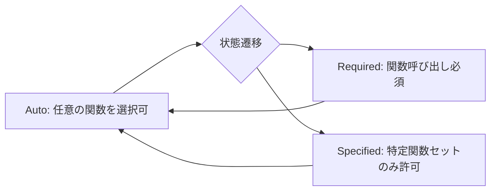

本記事は [Context Engineering for AI Agents: Lessons from Building Manus](https://manus.im/blog/Context-Engineering-for-AI-Agents-Lessons-from-Building-Manus) の解説記事です。

## ブログ概要（Summary）

ManusチームのYichao 'Peak' Ji氏が、AIエージェントフレームワークを4度再構築する過程で得たContext Engineeringの実践的教訓を共有したエンジニアリングブログ記事である。核心的な主張は「KVキャッシュヒット率がプロダクションAIエージェントの最も重要な指標である」というものであり、キャッシュ済みトークン（$0.30/MTok）と未キャッシュトークン（$3/MTok）のコスト差が10倍に達するClaude Sonnetの例を挙げて、キャッシュ効率がコストとレイテンシの両方に直結することを実証している。

この記事は [Zenn記事: 1Mトークン時代のコンテキスト構造化設計パターン集と本番実装ガイド](https://zenn.dev/0h_n0/articles/b780d43dba0e87) の深掘りです。

## 情報源

- **種別**: 企業テックブログ
- **URL**: [https://manus.im/blog/Context-Engineering-for-AI-Agents-Lessons-from-Building-Manus](https://manus.im/blog/Context-Engineering-for-AI-Agents-Lessons-from-Building-Manus)
- **組織**: Manus（現Meta傘下）
- **著者**: Yichao 'Peak' Ji
- **発表日**: 2025年7月18日

## 技術的背景（Technical Background）

ManusはAIエージェントプラットフォームとして、ユーザーの指示に基づき複数のツール（ブラウザ、シェル、ファイルシステム等）を自律的に操作するシステムを提供している。複雑なタスクでは平均50回のツール呼び出しが発生し、エージェントのコンテキストは各ステップで入力（観測結果）を蓄積するため急速に膨張する。入力と出力の比率は平均100:1であり、入力トークンのコスト最適化が事業的にも技術的にも最重要課題となっている。

従来の「プロンプトエンジニアリング」がプロンプトの文面改善に焦点を当てるのに対し、Manusチームはこれを「Context Engineering」と再定義している。Context Engineeringは、プロンプトの構造、情報の配置順序、キャッシュ効率、ツールスキーマの安定性、エラー履歴の保持といった、コンテキスト全体のライフサイクルを設計対象とするアプローチである。

## KVキャッシュヒット率：最重要指標（Core Insight）

Manusチームの最も重要な主張は、**KVキャッシュヒット率がプロダクションAIエージェントの最も重要な単一指標である**というものである。

### なぜKVキャッシュが重要か

LLMの推論において、入力トークンの処理（プリフィル）は出力トークンの生成（デコード）より計算コストが高い。APIプロバイダはこのプリフィルコストをキャッシュにより軽減しており、キャッシュヒット時のコストは未キャッシュの1/10（Anthropic）から1/2（OpenAI）に削減される。

Manusのエージェントは平均100:1の入出力比率を持つため、入力トークンの処理効率がコストの大部分を決定する。キャッシュヒット率が90%であれば、実効的な入力コストは通常の約1/10に圧縮される。

$$
C_{\text{effective}} = C_{\text{cache\_miss}} \cdot (1 - r) + C_{\text{cache\_hit}} \cdot r
$$

ここで $r$ はキャッシュヒット率、$C_{\text{cache\_miss}}$ は未キャッシュコスト、$C_{\text{cache\_hit}}$ はキャッシュヒットコストである。Claude Sonnetの場合:

$$
C_{\text{effective}} = 3.00 \cdot (1 - 0.9) + 0.30 \cdot 0.9 = 0.30 + 0.27 = 0.57 \text{ \$/MTok}
$$

つまりキャッシュヒット率90%で、実効コストは$3.00/MTokから$0.57/MTokに削減される（81%削減）。

### 3つのKVキャッシュ最適化プラクティス

Manusチームは以下の3つのプラクティスを挙げている。

#### プラクティス1: 安定したプロンプトプレフィックス

キャッシュはプロンプトの先頭からの一致で判定されるため、先頭部分に動的な要素を含めるとキャッシュが無効化される。

```python
# ❌ 悪い例: タイムスタンプがプレフィックスを変更
system_prompt = f"Current time: {datetime.now()}\nYou are a helpful agent..."

# ✅ 良い例: 静的なシステム指示を先頭に固定
system_prompt = "You are a helpful agent...\n<dynamic_context>..."
```

1トークンの差異でもキャッシュは先頭から無効化される。タイムスタンプ、乱数、セッションIDなどの動的要素はプロンプトの末尾に配置すること。

#### プラクティス2: Append-onlyコンテキスト

過去のアクションや観測結果を修正してはならない。キャッシュの一致はプレフィックス全体で判定されるため、過去のメッセージを書き換えると、そのポイント以降のすべてのキャッシュが無効化される。

```python
# ❌ 悪い例: 過去の観測結果を修正
messages[5]["content"] = updated_observation

# ✅ 良い例: 新しいメッセージとして追加
messages.append({
    "role": "user",
    "content": f"Updated observation: {updated_observation}"
})
```

JSON のシリアライゼーションも決定的であること。Pythonの辞書は挿入順序が保証されるが、`json.dumps`の`sort_keys`設定が異なるとキャッシュが無効化される可能性がある。

#### プラクティス3: 明示的なキャッシュブレークポイント

Anthropic APIでは`cache_control`フィールドでキャッシュ境界を明示的に設定できる。Manusチームはキャッシュの有効期限（5分）を考慮し、戦略的にブレークポイントを配置している。

## ツール可用性の動的制御：マスキング戦略

### 従来のアプローチの問題

エージェントの状態に応じてツール（関数）を動的に追加・削除するのが一般的なアプローチだが、Manusチームはこれを避けている。理由は2つある。

1. **KVキャッシュの破壊**: ツールリストの変更はシステムプロンプトの変更を意味し、キャッシュが無効化される
2. **モデルの混乱**: ツールセットが変動すると、モデルが存在しないツールを呼び出そうとする等の不安定な挙動が発生

### コンテキスト認識ステートマシン

代わりにManusチームは「コンテキスト認識ステートマシン」を実装し、トークンレベルのロジットマスキングでツール呼び出しを制御している。



3つの関数呼び出しモード:

1. **Auto**: モデルが関数を呼ぶかどうかを自由に選択
2. **Required**: モデルは必ず何らかの関数を呼ぶ（選択は自由）
3. **Specified**: モデルは指定されたサブセットからのみ関数を選択

ツール名には一貫したプレフィックス（`browser_`、`shell_`、`file_`）を使用し、グループレベルの制約を効率的に適用できるようにしている。

## ファイルシステムを拡張コンテキストとして活用

Manusチームは128K+トークンのコンテキストウィンドウでも「実際のワークロードでは十分でないことが多く、場合によっては負債にもなる」と指摘している。この課題に対する解決策として、ファイルシステムを「無限サイズで永続的かつエージェント自身が直接操作できる究極のコンテキスト」として活用している。

### 復元可能な圧縮戦略

コンテキスト圧縮時に情報を永久に失わないよう、以下の戦略を採用している。

- **Webページ**: コンテンツは削除するがURLを保持（再取得可能）
- **文書**: 内容は削除するがファイルパスを保持（再読み込み可能）
- **ツール出力**: 大きな出力は要約に圧縮するが、元の出力をファイルに保存

この設計はZenn記事で解説した「Compaction（圧縮）パターン」の実践版と言える。Anthropicのエンジニアリングブログで提唱されたCompactionは直近Nターンの完全保持と古いターンの要約圧縮を行うが、Manusはこれをファイルシステムとの連携で拡張し、圧縮前のフルデータを常に復元可能な状態で保持している。

```python
from dataclasses import dataclass


@dataclass
class CompressibleContextItem:
    """復元可能なコンテキスト項目"""
    content: str
    source_type: str
    recovery_reference: str
    is_compressed: bool = False

    def compress(self) -> "CompressibleContextItem":
        """コンテキスト項目を圧縮する。元データへの参照は保持。"""
        if self.source_type == "web_page":
            summary = f"[Web content from {self.recovery_reference}]"
        elif self.source_type == "document":
            summary = f"[Document at {self.recovery_reference}]"
        else:
            summary = f"[Output saved to {self.recovery_reference}]"

        return CompressibleContextItem(
            content=summary,
            source_type=self.source_type,
            recovery_reference=self.recovery_reference,
            is_compressed=True,
        )
```

この戦略により、コンテキストを縮小しつつ永続的な情報損失を回避している。エージェントが圧縮済み項目を再度必要とした場合、`recovery_reference`を用いてフルデータを復元できる。

## Attention操作：todo.mdによる目標の再注入

複雑なタスクで平均50回のツール呼び出しを行うと、コンテキストの末尾には大量のアクション・観測ペアが蓄積される。著者らはLost-in-the-Middleの影響で「エージェントの目標がコンテキスト中間に埋もれて見失われる」問題を発見した。

解決策として、`todo.md`ファイルを各ステップで更新し、コンテキストの末尾にエージェントの目標を意図的に再注入している。これは「recitation（暗唱）」パターンと呼ばれ、アーキテクチャの変更なしにAttention機構を操作する手法である。Zenn記事で紹介した「クエリ末尾配置」パターンの実践的な応用例と言える。

## エラー履歴の保持：自己修正の基盤

Manusチームは失敗したトレースをコンテキストからクリーンアップせず、意図的に保持している。モデルが失敗したアクションとそのエラーメッセージを参照できることで、内部の確率分布が暗黙的に更新され、同様のミスを避けるようになる。著者らはこれを「真のエージェント的振る舞いの最も明確な指標の1つ」と述べている。

## Few-Shotパターン崩壊の回避

コンテキストが類似したアクション・観測ペアで埋まると、モデルはそのパターンに固執し、最適でなくなっても同じ行動を繰り返す傾向がある。対策として、アクションと観測に構造化されたバリエーション（異なるシリアライゼーションテンプレート、代替的な言い回し、順序の微小なノイズ）を導入している。

## パフォーマンス最適化（Performance）

ブログ記事には具体的なベンチマーク数値は限定的だが、以下の定性的・定量的情報が報告されている。

- **コスト**: キャッシュ済みトークンと未キャッシュトークンのコスト差は10倍（Claude Sonnet: $0.30 vs $3.00/MTok）
- **入出力比率**: 平均100:1。入力トークンのコスト最適化が全体コストを支配
- **ツール呼び出し回数**: 複雑なタスクで平均50回
- **フレームワーク再構築**: 4回の全面再構築を経て現在のアーキテクチャに到達

## 運用での学び（Production Lessons）

### 設計原則：モデル進歩に対して直交的に

Manusチームの設計哲学は「モデルの進歩が潮の満ち引きなら、Manusはボートであるべきで、海底に固定された柱であってはならない」というものである。特定のモデルの弱点を補うハックではなく、モデル非依存な構造的改善に注力することで、新しいモデルの恩恵を自動的に受けられるようにしている。

### Stochastic Graduate Descent

著者らはManusチームの方法論を自嘲的に「Stochastic Graduate Descent（確率的大学院生降下法）」と呼んでいる。アーキテクチャ探索、プロンプト調整、経験的な推測を手動で行うプロセスであり、エレガントではないが効果的に機能するというものだ。

### 4度のフレームワーク再構築

著者らはコンテキストの形成方法にブレークスルーを発見するたびにフレームワーク全体を再構築したと述べている。各再構築でContext Engineeringの理解が深化し、現在のKVキャッシュ中心の設計に至っている。

## 学術研究との関連（Academic Connection）

- **Lost in the Middle (Liu et al., 2023)**: Manusチームが`todo.md`による目標再注入で回避している問題の学術的根拠
- **ChunkAttention (Ye et al., 2023)**: KVキャッシュ共有の学術的基盤。Manusが活用しているAPIレベルのPrompt Cachingの実装原理
- **Context Rot (Chroma, 2025)**: Manusのファイルシステム拡張コンテキスト戦略は、Context Rotを構造的に回避するアプローチ

## まとめと実践への示唆

Manusチームの実践から得られる最も重要な教訓は、プロダクションAIエージェントにおいてKVキャッシュヒット率が最も重要な指標であるという点にある。Zenn記事で紹介した「レイヤードコンテキスト（静的→動的→クエリ）」パターンは、まさにこの知見を設計に反映したものであり、静的な部分をプレフィックスに固定してキャッシュヒット率を最大化する。ツールリストの動的変更を避けるマスキング戦略、ファイルシステムを拡張コンテキストとして活用する手法、`todo.md`による目標再注入など、いずれもContext Rotとキャッシュ効率の両方に対処する実践的な手法として参考になる。

## 参考文献

- **Blog URL**: [https://manus.im/blog/Context-Engineering-for-AI-Agents-Lessons-from-Building-Manus](https://manus.im/blog/Context-Engineering-for-AI-Agents-Lessons-from-Building-Manus)
- **Related Zenn article**: [https://zenn.dev/0h_n0/articles/b780d43dba0e87](https://zenn.dev/0h_n0/articles/b780d43dba0e87)
