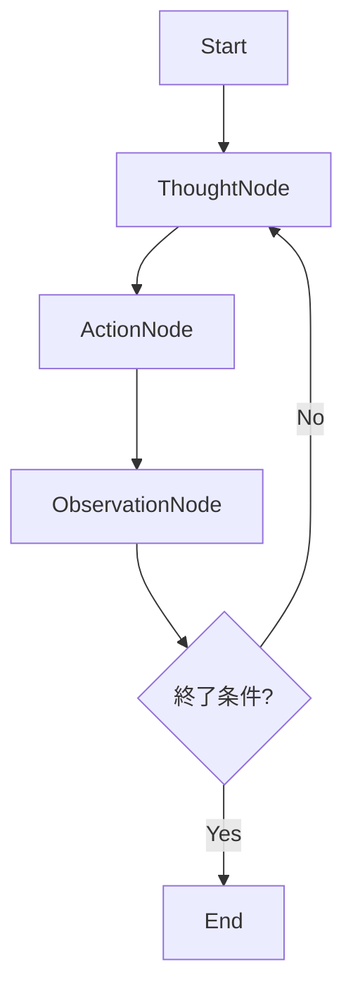

## 論文概要（Abstract）

本記事は [ReAct: Synergizing Reasoning and Acting in Language Models](https://arxiv.org/abs/2210.03629) の解説記事です。

ReActは、大規模言語モデル（LLM）に推論トレース（Thought）とタスク固有の行動（Action）を交互に生成させるフレームワークである。従来のChain-of-Thought（CoT）が推論のみを行い、行動ベースの手法が推論なしに行動のみを実行していたのに対し、ReActは両者を統合することで、外部環境から情報を取得しつつ根拠のある意思決定を実現する。ICLR 2023にてOral発表（上位5%）として採択された。

この記事は [Zenn記事: LangGraph v1.1ステートマシンのドメインモデリングとテスト駆動設計](https://zenn.dev/0h_n0/articles/751f2013ecfa32) の深掘りです。

## 情報源

- **arXiv ID**: 2210.03629
- **URL**: [https://arxiv.org/abs/2210.03629](https://arxiv.org/abs/2210.03629)
- **著者**: Shunyu Yao, Jeffrey Zhao, Dian Yu, Nan Du, Izhak Shafran, Karthik Narasimhan, Yuan Cao
- **発表年**: 2022（arXiv）、2023（ICLR Oral）
- **分野**: cs.CL, cs.AI, cs.LG
- **コード**: [https://github.com/ysymyth/ReAct](https://github.com/ysymyth/ReAct)（MIT License）

## 背景と動機（Background & Motivation）

LLMの推論能力と行動能力は、従来の研究では別々に発展してきた。Chain-of-Thought（CoT）プロンプティングは、LLMに中間推論ステップを生成させることで算術や常識推論タスクの性能を向上させたが、外部世界との対話能力を持たない。一方、WebGPTやSayCan等の行動ベースの手法は、LLMに外部ツールの呼び出しやロボット制御を行わせるが、推論トレースを生成しないため、行動選択の根拠が不透明であった。

Yaoらはこの分離が2つの問題を引き起こすと指摘している。第一に、CoT単独では外部情報の取得ができないため、事実に基づかない推論（hallucination）が発生する。論文のエラー分析（Table 2）では、CoTの失敗ケースの56%がhallucinationに起因すると報告されている。第二に、行動のみの手法では計画の立案や修正が困難であり、行き当たりばったりの探索に陥りやすい。ReActはこれら2つの限界を、推論と行動を同一の生成ストリームに統合することで解決する。

## 主要な貢献（Key Contributions）

- **Thought/Action/Observationの3要素交互ループの提案**: LLMの生成空間を拡張し、推論トレース（言語空間 $\hat{\mathcal{A}} = \mathcal{A} \cup \mathcal{L}$）を行動空間に統合する枠組みを定式化した
- **推論と行動の相乗効果の実証**: 推論トレースが行動計画の立案・修正・例外処理を支援し、行動が外部情報の取得により推論の根拠を補強することを、4つの異なるベンチマークで検証した
- **Few-shotプロンプティングによる汎用性**: タスク固有のfew-shot例をプロンプトに埋め込むだけで、追加学習なしに多様なタスクへ適用可能であることを示した
- **CoT-SCとの組み合わせ手法**: ReActとCoT-SC（Self-Consistency）を組み合わせるハイブリッド手法（CoT-SC → ReAct、ReAct → CoT-SC）により、さらなる性能向上を達成した

## 技術的詳細（Technical Details）

### 問題定式化

Yaoらは、エージェントと環境の対話を以下のように定式化している。時刻 $t$ において、エージェントは観察 $o_t \in \mathcal{O}$ を受け取り、方策 $\pi(a_t \mid c_t)$ に従って行動 $a_t \in \mathcal{A}$ を選択する。ここで $c_t = (o_1, a_1, \ldots, o_{t-1}, a_{t-1}, o_t)$ はコンテキストである。

ReActの核心は、行動空間を言語空間で拡張することにある。

$$
\hat{\mathcal{A}} = \mathcal{A} \cup \mathcal{L}
$$

ここで、
- $\mathcal{A}$: タスク固有の行動空間（例: `search[entity]`, `finish[answer]`）
- $\mathcal{L}$: 言語空間（Thoughtとして表現される自由形式テキスト）
- $\hat{\mathcal{A}}$: 拡張行動空間

Thought $\hat{a}_t \in \mathcal{L}$ は環境に影響を与えず（観察 $o_{t+1}$ を生成しない）、次の行動選択のためのコンテキストを補強する役割を持つ。これにより、LLMは「考えてから行動する」ことが可能になる。

### Thought/Action/Observationループ

ReActの各ステップは以下の3要素で構成される。

```
Thought: [推論トレース - 計画立案、情報整理、判断]
Action: [実行する行動 - ツール呼び出し等]
Observation: [環境からのフィードバック - 行動の結果]
```

Yaoらは、Thoughtが果たす役割を以下の4カテゴリに分類している。

1. **タスク分解（Decomposition）**: 複雑な質問を部分問題に分割
2. **情報抽出（Information Extraction）**: 観察から関連情報を抽出・整理
3. **常識推論（Commonsense Reasoning）**: 既知の知識との統合
4. **行動計画の修正（Plan Revision）**: 失敗時の方針転換

### HotpotQAにおける具体例

HotpotQAタスクでは、以下の行動空間が定義されている。

- `search[entity]`: Wikipedia APIで検索し、先頭5文を取得
- `lookup[string]`: 現在のページ内で次の該当文を検索
- `finish[answer]`: 最終回答を提出

ReActのトレース例（論文Figure 1より）:

```
Question: "Aside from the Apple Remote, what other
device can control the program Apple Remote was
originally designed to interact with?"

Thought 1: I need to search Apple Remote and find
the program it was originally designed to interact with.
Action 1: search[Apple Remote]
Observation 1: The Apple Remote is a remote control
device designed by Apple Inc. ... originally designed
to control the Front Row media program ...

Thought 2: Apple Remote was originally designed to
interact with Front Row. I need to search Front Row
to find other devices that can control it.
Action 2: search[Front Row]
Observation 2: Front Row is a discontinued media
center software ... It could also be controlled by
the keyboard function keys ...

Thought 3: Front Row can be controlled by Apple Remote
and keyboard function keys. So the answer is keyboard.
Action 3: finish[keyboard function keys]
```

### LangGraphとの対応関係

ReActの3要素ループは、LangGraphの状態機械設計と直接的に対応する。以下の図は、ReActの概念的なループをLangGraphのノード・エッジ構造にマッピングしたものである。



LangGraphにおけるReActパターンの実装では、各ステップがStateGraphのノードとして定義され、条件付きエッジ（conditional edge）でループ制御を行う。これは`langgraph.prebuilt.create_react_agent`として標準APIに組み込まれている。

```python
from typing import TypedDict, Annotated, Literal
from langgraph.graph import StateGraph, END

class AgentState(TypedDict):
    """ReActエージェントの状態定義

    Attributes:
        messages: 会話履歴（Thought/Action/Observation含む）
        step_count: 現在のステップ数（無限ループ防止用）
        max_steps: 最大ステップ数
    """
    messages: Annotated[list, "会話メッセージ履歴"]
    step_count: int
    max_steps: int

def thought_node(state: AgentState) -> AgentState:
    """推論ノード: 現在の状態から次の行動計画を生成

    Args:
        state: 現在のエージェント状態

    Returns:
        更新された状態（推論トレース追加）
    """
    # LLMを呼び出して推論トレースを生成
    messages = state["messages"]
    # ... LLM呼び出しロジック
    return {"messages": messages, "step_count": state["step_count"]}

def action_node(state: AgentState) -> AgentState:
    """行動ノード: 推論結果に基づいてツールを実行

    Args:
        state: 現在のエージェント状態

    Returns:
        更新された状態（行動結果追加）
    """
    # ツール呼び出しを実行
    return {"messages": state["messages"], "step_count": state["step_count"] + 1}

def should_continue(state: AgentState) -> Literal["thought", "end"]:
    """終了条件の判定

    Args:
        state: 現在のエージェント状態

    Returns:
        "thought": ループ継続、"end": 終了
    """
    if state["step_count"] >= state["max_steps"]:
        return "end"
    last_message = state["messages"][-1]
    if hasattr(last_message, "tool_calls") and not last_message.tool_calls:
        return "end"
    return "thought"

# StateGraph構築
graph = StateGraph(AgentState)
graph.add_node("thought", thought_node)
graph.add_node("action", action_node)
graph.set_entry_point("thought")
graph.add_edge("thought", "action")
graph.add_conditional_edges("action", should_continue, {
    "thought": "thought",
    "end": END,
})
react_agent = graph.compile()
```

上記の実装において、ReActの論文が指摘する「無限ループ問題」への対処として、`max_steps`による上限設定が組み込まれている。これはLangGraphでReActパターンを本番運用する際の必須要件である。

## 実装のポイント（Implementation）

### プロンプト設計

ReActでは、タスクごとに1-6個のfew-shot例をプロンプトに埋め込む。HotpotQAでは6例、FEVERでは3例が使用されている。各例はThought/Action/Observationの完全なトレースを含み、LLMに出力フォーマットを学習させる。

### アクション空間の設計

アクション空間の定義が性能に直結する。Yaoらは、HotpotQA/FEVERで`search`/`lookup`/`finish`の3種のアクションを定義し、Wikipedia APIとの対話を実現している。ALFWorldでは`go to`, `take`, `put`, `open`, `close`, `toggle`, `clean`, `heat`, `cool`, `use`, `look`の環境操作アクションを使用している。

### 無限ループ対策

ReActの制約として、ループが終了しないリスクがある。Yaoらは最大ステップ数の上限を設定しているが、論文では最適な上限値の決定方法については明示的に議論していない。実装上は、タスクの複雑さに応じて6-10ステップ程度の上限を設けることが一般的である。

### コンテキスト長の管理

Observationが長文になる場合、コンテキストウィンドウを超過するリスクがある。Wikipedia検索結果は先頭5文に制限することでこの問題を緩和している。LangGraphでの実装では、`trim_messages`や要約機能を活用してコンテキスト長を管理する。

## Production Deployment Guide

ReActパターンのエージェントをAWS上にデプロイするための実践ガイドを以下に示す。コスト試算は2026年4月時点のap-northeast-1（東京リージョン）料金に基づく概算値であり、実際のコストはトラフィックパターン、バースト使用量により変動する。最新料金はAWS料金計算ツールで確認を推奨する。

### AWS実装パターン（コスト最適化重視）

#### Small構成（~100 req/日）: Serverless

| サービス | 用途 | 月額概算 |
|----------|------|----------|
| Lambda | ReActループ実行 | $5-15 |
| Amazon Bedrock (Claude Haiku) | LLM推論 | $20-50 |
| DynamoDB (On-Demand) | 会話状態・トレース保存 | $5-10 |
| CloudWatch | ログ・メトリクス | $5-10 |
| **合計** | | **$35-85/月** |

Lambda関数でReActの各ステップを実行し、DynamoDBに中間状態を永続化する。Bedrockを通じてClaude Haikuを呼び出し、1リクエストあたり平均3-5ステップのReActループを想定する。Lambda実行時間は最大15分に設定し、タイムアウトをReActの最大ステップ数と連動させる。

#### Medium構成（~1,000 req/日）: ECS Fargate

| サービス | 用途 | 月額概算 |
|----------|------|----------|
| ECS Fargate (2 vCPU, 4GB) | ReActエージェント常駐 | $100-150 |
| Amazon Bedrock (Claude Sonnet) | LLM推論 | $200-400 |
| ElastiCache (Redis) | セッション管理・キャッシュ | $50-80 |
| ALB | ロードバランシング | $25-35 |
| DynamoDB | 永続化 | $10-20 |
| CloudWatch + X-Ray | 監視・トレーシング | $15-25 |
| **合計** | | **$400-710/月** |

ECS Fargateでエージェントプロセスを常駐させ、リクエストごとにReActループを実行する。Redisでプロンプトキャッシュとセッション管理を行い、Bedrock呼び出し回数を削減する。

#### Large構成（10,000+ req/日）: EKS + Spot Instances

| サービス | 用途 | 月額概算 |
|----------|------|----------|
| EKS Control Plane | クラスタ管理 | $73 |
| EC2 Spot (m6i.xlarge x 3) | ワーカーノード | $120-180 |
| Amazon Bedrock (Claude Sonnet) | LLM推論 | $1,500-3,000 |
| ElastiCache (Redis Cluster) | 分散キャッシュ | $150-250 |
| ALB + WAF | ロードバランシング・セキュリティ | $50-80 |
| DynamoDB (Provisioned) | 永続化 | $30-60 |
| CloudWatch + X-Ray + Budgets | 監視・コスト管理 | $30-50 |
| **合計** | | **$1,953-3,693/月** |

Karpenterによる自動スケーリングでSpot Instancesを優先的に使用し、On-Demand比で最大70%のコスト削減を実現する。

### Terraformインフラコード

#### Small構成（Serverless）

```hcl
# ReAct Agent - Small構成 (Lambda + Bedrock + DynamoDB)
# 2026年4月時点 ap-northeast-1

terraform {
  required_version = ">= 1.9"
  required_providers {
    aws = {
      source  = "hashicorp/aws"
      version = "~> 5.80"
    }
  }
}

provider "aws" {
  region = "ap-northeast-1"
}

# DynamoDB: ReActトレース保存（On-Demandでコスト最適化）
resource "aws_dynamodb_table" "react_traces" {
  name         = "react-agent-traces"
  billing_mode = "PAY_PER_REQUEST"
  hash_key     = "session_id"
  range_key    = "step_number"

  attribute {
    name = "session_id"
    type = "S"
  }
  attribute {
    name = "step_number"
    type = "N"
  }

  ttl {
    attribute_name = "expires_at"
    enabled        = true
  }

  server_side_encryption {
    enabled = true
  }

  tags = {
    Project = "react-agent"
    Env     = "production"
  }
}

# IAMロール: Lambda用（最小権限）
resource "aws_iam_role" "lambda_react" {
  name = "react-agent-lambda-role"
  assume_role_policy = jsonencode({
    Version = "2012-10-17"
    Statement = [{
      Action = "sts:AssumeRole"
      Effect = "Allow"
      Principal = { Service = "lambda.amazonaws.com" }
    }]
  })
}

resource "aws_iam_role_policy" "lambda_react_policy" {
  name = "react-agent-lambda-policy"
  role = aws_iam_role.lambda_react.id
  policy = jsonencode({
    Version = "2012-10-17"
    Statement = [
      {
        Effect   = "Allow"
        Action   = ["bedrock:InvokeModel"]
        Resource = "arn:aws:bedrock:ap-northeast-1::foundation-model/anthropic.claude-3-haiku-*"
      },
      {
        Effect = "Allow"
        Action = [
          "dynamodb:PutItem",
          "dynamodb:GetItem",
          "dynamodb:Query"
        ]
        Resource = aws_dynamodb_table.react_traces.arn
      },
      {
        Effect = "Allow"
        Action = [
          "logs:CreateLogGroup",
          "logs:CreateLogStream",
          "logs:PutLogEvents"
        ]
        Resource = "arn:aws:logs:ap-northeast-1:*:*"
      }
    ]
  })
}

# Lambda関数: ReActエージェント
resource "aws_lambda_function" "react_agent" {
  function_name = "react-agent"
  runtime       = "python3.12"
  handler       = "handler.lambda_handler"
  role          = aws_iam_role.lambda_react.arn
  timeout       = 900 # 15分（ReActループの最大実行時間）
  memory_size   = 512

  environment {
    variables = {
      DYNAMODB_TABLE = aws_dynamodb_table.react_traces.name
      MAX_STEPS      = "10" # ReAct無限ループ防止
      MODEL_ID       = "anthropic.claude-3-haiku-20240307-v1:0"
    }
  }

  tracing_config {
    mode = "Active" # X-Ray有効化
  }

  tags = {
    Project = "react-agent"
  }

  filename = "lambda.zip" # デプロイパッケージ
}

# CloudWatch アラーム: コスト異常検知
resource "aws_cloudwatch_metric_alarm" "lambda_duration" {
  alarm_name          = "react-agent-high-duration"
  comparison_operator = "GreaterThanThreshold"
  evaluation_periods  = 3
  metric_name         = "Duration"
  namespace           = "AWS/Lambda"
  period              = 300
  statistic           = "Average"
  threshold           = 60000 # 60秒（ReActループが長すぎる場合）
  alarm_description   = "ReActループの平均実行時間が60秒を超過"

  dimensions = {
    FunctionName = aws_lambda_function.react_agent.function_name
  }
}
```

#### Large構成（Container）

```hcl
# ReAct Agent - Large構成 (EKS + Karpenter + Spot)

module "eks" {
  source  = "terraform-aws-modules/eks/aws"
  version = "~> 20.31"

  cluster_name    = "react-agent-cluster"
  cluster_version = "1.31"

  vpc_id     = module.vpc.vpc_id
  subnet_ids = module.vpc.private_subnets

  cluster_endpoint_public_access = false # セキュリティ: プライベートのみ

  eks_managed_node_groups = {
    system = {
      instance_types = ["m6i.large"]
      min_size       = 1
      max_size       = 2
      desired_size   = 1
      labels         = { role = "system" }
    }
  }

  tags = {
    Project = "react-agent"
    Env     = "production"
  }
}

# Karpenter: Spot優先の自動スケーリング
resource "kubectl_manifest" "karpenter_nodepool" {
  yaml_body = yamlencode({
    apiVersion = "karpenter.sh/v1"
    kind       = "NodePool"
    metadata   = { name = "react-workers" }
    spec = {
      template = {
        spec = {
          requirements = [
            { key = "karpenter.sh/capacity-type", operator = "In", values = ["spot", "on-demand"] },
            { key = "node.kubernetes.io/instance-type", operator = "In",
              values = ["m6i.xlarge", "m6a.xlarge", "m5.xlarge"] },
          ]
          nodeClassRef = { name = "default" }
        }
      }
      limits   = { cpu = "32", memory = "128Gi" }
      disruption = {
        consolidationPolicy = "WhenEmptyOrUnderutilized"
        consolidateAfter    = "30s"
      }
    }
  })
}

# AWS Budgets: 月額予算アラート
resource "aws_budgets_budget" "react_agent" {
  name         = "react-agent-monthly"
  budget_type  = "COST"
  limit_amount = "4000"
  limit_unit   = "USD"
  time_unit    = "MONTHLY"

  notification {
    comparison_operator       = "GREATER_THAN"
    threshold                 = 80
    threshold_type            = "PERCENTAGE"
    notification_type         = "ACTUAL"
    subscriber_email_addresses = ["alerts@example.com"]
  }
}
```

### 運用・監視設定

#### CloudWatch Logs Insights クエリ

```
# ReActステップ数の異常検知（1時間あたり）
fields @timestamp, @message
| filter @message like /react_step/
| stats count(*) as step_count by bin(1h) as hour
| filter step_count > 1000
| sort hour desc

# Bedrockトークン使用量のレイテンシ分析
fields @timestamp, duration_ms, input_tokens, output_tokens
| filter event = "bedrock_invoke"
| stats avg(duration_ms) as avg_latency,
        pct(duration_ms, 95) as p95_latency,
        pct(duration_ms, 99) as p99_latency,
        sum(input_tokens) as total_input,
        sum(output_tokens) as total_output
  by bin(1h)
```

#### CloudWatch アラーム設定

```python
import boto3

cloudwatch = boto3.client("cloudwatch", region_name="ap-northeast-1")

def create_react_alarms() -> None:
    """ReActエージェント用CloudWatchアラームを設定

    Bedrockトークン使用量スパイクとLambda実行時間を監視する。
    """
    # Bedrock呼び出し回数スパイク検知
    cloudwatch.put_metric_alarm(
        AlarmName="react-bedrock-invocation-spike",
        MetricName="Invocations",
        Namespace="AWS/Bedrock",
        Statistic="Sum",
        Period=300,
        EvaluationPeriods=2,
        Threshold=500,  # 5分間で500回以上
        ComparisonOperator="GreaterThanThreshold",
        AlarmActions=["arn:aws:sns:ap-northeast-1:ACCOUNT:react-alerts"],
    )
```

#### X-Ray トレーシング設定

```python
from aws_xray_sdk.core import xray_recorder, patch_all

# boto3を含む全ライブラリの自動計装
patch_all()

def trace_react_step(step_num: int, step_type: str, model_id: str) -> None:
    """ReActの各ステップをX-Rayでトレース

    Args:
        step_num: ステップ番号
        step_type: "thought", "action", "observation"のいずれか
        model_id: 使用するBedrockモデルID
    """
    subsegment = xray_recorder.begin_subsegment(f"react_{step_type}")
    subsegment.put_annotation("step_number", step_num)
    subsegment.put_annotation("step_type", step_type)
    subsegment.put_metadata("model_id", model_id)
    xray_recorder.end_subsegment()
```

#### Cost Explorer 自動レポート

```python
import boto3
from datetime import datetime, timedelta

ce = boto3.client("ce", region_name="ap-northeast-1")
sns = boto3.client("sns", region_name="ap-northeast-1")

def daily_cost_report(sns_topic_arn: str) -> dict:
    """日次コストレポートを取得し、閾値超過時にSNS通知

    Args:
        sns_topic_arn: 通知先SNSトピックのARN

    Returns:
        サービス別コスト情報の辞書
    """
    end = datetime.utcnow().strftime("%Y-%m-%d")
    start = (datetime.utcnow() - timedelta(days=1)).strftime("%Y-%m-%d")

    response = ce.get_cost_and_usage(
        TimePeriod={"Start": start, "End": end},
        Granularity="DAILY",
        Metrics=["UnblendedCost"],
        GroupBy=[{"Type": "DIMENSION", "Key": "SERVICE"}],
        Filter={
            "Tags": {
                "Key": "Project",
                "Values": ["react-agent"],
            }
        },
    )

    costs: dict[str, float] = {}
    total = 0.0
    for group in response["ResultsByTime"][0]["Groups"]:
        service = group["Keys"][0]
        amount = float(group["Metrics"]["UnblendedCost"]["Amount"])
        costs[service] = amount
        total += amount

    # $100/日超過でSNS通知
    if total > 100:
        sns.publish(
            TopicArn=sns_topic_arn,
            Subject="ReAct Agent Cost Alert",
            Message=f"Daily cost: ${total:.2f}\n{costs}",
        )

    return costs
```

### コスト最適化チェックリスト

#### アーキテクチャ選択

- [ ] トラフィック量に応じた構成を選択（~100 req/日: Serverless、~1,000: Hybrid、10,000+: Container）
- [ ] ReActのステップ数上限を設定し、Bedrock呼び出し回数を制限
- [ ] 非同期処理可能なタスクはBatch APIに振り分け

#### リソース最適化

- [ ] EC2はSpot Instances優先（On-Demand比最大70%削減）
- [ ] 長期稼働ワークロードにReserved Instances（1年コミットで最大40%削減）
- [ ] Savings Plansの適用を検討（Compute Savings Plans）
- [ ] Lambdaメモリサイズの最適化（Power Tuningツール使用）
- [ ] ECS/EKSワーカーのアイドル時スケールダウン設定

#### LLMコスト削減

- [ ] Bedrock Batch APIの使用（リアルタイム不要なタスクで50%削減）
- [ ] Prompt Caching有効化（ReActのfew-shot部分で30-90%削減）
- [ ] タスク難易度に応じたモデル選択ロジック（Haiku/Sonnet/Opus使い分け）
- [ ] 入出力トークン数の上限設定（ReActの各ステップで`max_tokens`制限）
- [ ] ReActステップ数上限による間接的なコスト制限

#### 監視・アラート

- [ ] AWS Budgets設定（月額予算の80%/100%/120%で段階的通知）
- [ ] CloudWatch アラーム（Bedrock呼び出し頻度、Lambda実行時間）
- [ ] Cost Anomaly Detection有効化（異常支出の自動検知）
- [ ] 日次コストレポートの自動生成・メール送信

#### リソース管理

- [ ] 未使用のEBS/EIPの定期削除
- [ ] リソースタグ戦略の徹底（Project/Env/Owner必須）
- [ ] S3/DynamoDBライフサイクルポリシー（90日でアーカイブ）
- [ ] 開発環境の夜間・休日自動停止（EventBridge Scheduler）
- [ ] CloudTrail/Config有効化による監査ログ

## 実験結果（Results）

### 知識推論タスク（PaLM-540B）

以下の結果は論文Table 1より引用した値である。

| 手法 | HotpotQA (EM) | FEVER (Acc) |
|------|---------------|-------------|
| Standard | 28.7 | 57.1 |
| CoT | 29.4 | 56.3 |
| CoT-SC (n=21) | 33.4 | 60.4 |
| Act | 25.7 | 58.9 |
| ReAct | 27.4 | 60.9 |
| CoT-SC → ReAct | 34.2 | 64.6 |
| ReAct → CoT-SC | **35.1** | 62.0 |

HotpotQAにおいてReAct単独（27.4）はCoT（29.4）をわずかに下回るが、FEVERではReAct（60.9）がCoT（56.3）を上回っている。Yaoらは、ReActとCoT-SCを組み合わせた「ReAct → CoT-SC」手法がHotpotQAで35.1と最高性能を達成したと報告している。この手法では、ReActの内部信頼度が低い場合にCoT-SCにフォールバックする。

### エラー分析

論文Table 2のエラー分析（200サンプルの人手評価）によると、ReActとCoTの失敗パターンは質的に異なる。

| カテゴリ | ReAct | CoT |
|----------|-------|-----|
| 成功ケースの正確性 | 94% | 86% |
| 成功ケースのhallucination | 6% | 14% |
| 失敗ケースの推論エラー | 47% | 16% |
| 失敗ケースの検索エラー | 23% | - |
| 失敗ケースのhallucination | **0%** | **56%** |

ReActは外部情報を取得するため、hallucination由来の失敗が0%である点が注目される。一方、検索クエリの失敗（23%）や複雑な推論のエラー（47%）が主な失敗要因となっている。

### インタラクティブタスク

論文Table 3, 4より、ALFWorldとWebShopの結果を示す。

| タスク | Act | ReAct (avg) | ReAct (best of 6) | ベースライン |
|--------|-----|-------------|--------------------|-----------  |
| ALFWorld | 45% | 57% | **71%** | BUTLER: 37% |
| WebShop (Score) | 62.3 | - | **66.6** | IL+RL: 62.4 |
| WebShop (SR) | 30.1% | - | **40.0%** | IL+RL: 28.7% |

ALFWorldでは、ReAct（best of 6 trials）が71%の成功率を達成し、Act単独（45%）に対して26ポイントの改善を示した。Yaoらは、ReActの推論トレースがタスク進捗の追跡と例外処理に寄与していると分析している。WebShopでは、ReActが66.6のスコアと40.0%の成功率を達成し、約12,000の人手デモンストレーションで学習したIL+RL手法（62.4, 28.7%）を上回った。

## 実運用への応用（Practical Applications）

### LangGraphでのReActパターン

LangGraphは`langgraph.prebuilt.create_react_agent`としてReActパターンを標準APIに組み込んでいる。この関数は、ツール定義とLLMを受け取り、Thought/Action/Observationループを自動構築する。Zenn記事で解説されているLangGraph v1.1のステートマシン設計は、ReActの理論的基盤を実装レベルで具現化したものである。

### 本番運用での注意点

ReActの実運用では以下の点に留意する必要がある。第一に、最大ステップ数の設定が必須である。論文でも指摘されている通り、ループが終了しないリスクがある。第二に、Observationの長さ制限を設ける必要がある。コンテキストウィンドウの超過を防ぐため、各ステップの出力を適切にトリミングする。第三に、エラーリカバリ機構の実装が望ましい。論文の失敗分析では検索エラーが23%を占めており、リトライや代替クエリの生成ロジックが有効である。

### 派生フレームワーク

ReActの提案以降、Reflexion（自己反省を追加）、LATS（モンテカルロ木探索との統合）、AutoGPT（長期タスクへの拡張）など、多数の派生手法が提案されている。LangGraphのエコシステムでは、これらの手法もStateGraphのノード構成を変更するだけで実装可能である。

## 関連研究（Related Work）

- **Chain-of-Thought (Wei et al., 2022)**: LLMに中間推論ステップを生成させる手法。ReActはCoTの推論能力を行動と統合することで拡張した
- **Self-Ask (Press et al., 2022)**: LLMが自己質問と検索を交互に行う手法。ReActのAction/Observationループと類似するが、Thoughtの明示的生成がない点で異なる
- **WebGPT (Nakano et al., 2021)**: Web検索と回答生成を組み合わせた手法。人間のフィードバックで強化学習を行う点でReActのfew-shotアプローチと対照的
- **Inner Monologue (Huang et al., 2022)**: ロボット制御における内部言語フィードバック。ReActのThoughtに相当する概念を身体的タスクに適用

## まとめと今後の展望

ReActは、LLMの推論と行動を統一的なフレームワークで統合し、4つの異なるベンチマークでその有効性を実証した。hallucination由来の失敗を0%に抑える一方で、検索エラーや複雑な推論の失敗が課題として残る。LangGraphの`create_react_agent`としてエコシステムに組み込まれた現在、ReActは事実上のLLMエージェント設計の標準パターンとなっている。

今後の研究方向として、Yaoらは大規模言語モデルのfine-tuningによるReActの性能向上、マルチモーダル入力への拡張、より長期的な計画を要するタスクへの適用を挙げている。

> 本記事はarXiv論文 [2210.03629](https://arxiv.org/abs/2210.03629) の引用・解説であり、筆者自身が実験を行ったものではありません。記事中の数値は全て原論文からの引用です。本記事はAIによって生成されています。

## 参考文献

- **arXiv**: [https://arxiv.org/abs/2210.03629](https://arxiv.org/abs/2210.03629)
- **ICLR 2023**: [https://iclr.cc/virtual/2023/oral/12647](https://iclr.cc/virtual/2023/oral/12647)
- **Code**: [https://github.com/ysymyth/ReAct](https://github.com/ysymyth/ReAct) (MIT License)
- **Google Research Blog**: [https://research.google/blog/react-synergizing-reasoning-and-acting-in-language-models/](https://research.google/blog/react-synergizing-reasoning-and-acting-in-language-models/)
- **Related Zenn article**: [https://zenn.dev/0h_n0/articles/751f2013ecfa32](https://zenn.dev/0h_n0/articles/751f2013ecfa32)
