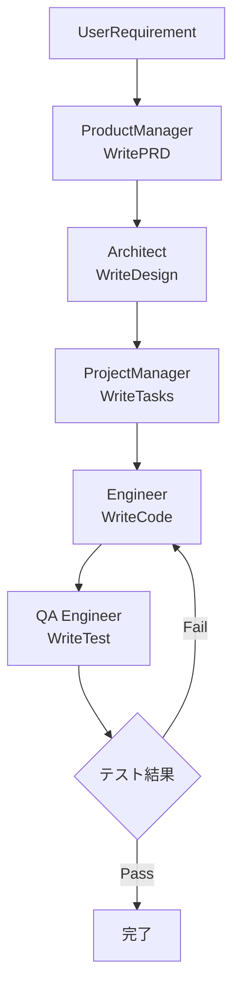

## 論文概要（Abstract）

本記事は [MetaGPT: Meta Programming for A Multi-Agent Collaborative Framework](https://arxiv.org/abs/2308.00352) の解説記事です。

MetaGPTは、人間のソフトウェア開発組織で用いられる**標準作業手順書（SOP: Standard Operating Procedures）**をLLMエージェントの協調プロトコルとしてコード化するフレームワークである。Product Manager、Architect、Project Manager、Engineer、QA Engineerの5つの専門ロールにエージェントを割り当て、各ロールが構造化された成果物（PRD、設計書、コード、テスト）を順次生成する。Publish-Subscribeパターンに基づく共有メッセージプールにより、ロール間の情報伝達を効率化し、連鎖的ハルシネーションを抑制する。

この記事は [Zenn記事: LangGraph v1.1ステートマシンのドメインモデリングとテスト駆動設計](https://zenn.dev/0h_n0/articles/751f2013ecfa32) の深掘りです。Zenn記事で扱うLangGraphの状態機械設計パターンとMetaGPTのSOP駆動ワークフローの対応関係を分析する。

## 情報源

- **arXiv ID**: 2308.00352
- **URL**: [https://arxiv.org/abs/2308.00352](https://arxiv.org/abs/2308.00352)
- **著者**: Sirui Hong, Mingchen Zhuge, Jiaqi Chen, et al.（DeepWisdom, KAUST AI Initiative）
- **発表年**: 2023年（初版）、ICLR 2024にて発表
- **分野**: cs.AI, cs.MA
- **コード**: [https://github.com/geekan/MetaGPT](https://github.com/geekan/MetaGPT)（Apache 2.0 License）

## 背景と動機（Background & Motivation）

LLMベースのマルチエージェントシステムにおける最大の課題は**連鎖的ハルシネーション（cascading hallucinations）**である。複数のエージェントが自由形式の対話で協調する場合、あるエージェントが生成した誤った情報を後続のエージェントが前提として取り込み、誤りが雪だるま式に増幅される。Hongらはこれを「伝言ゲーム（telephone game）効果」と呼んでいる。

従来のマルチエージェントフレームワーク（ChatDev、CAMEL等）は、エージェント間の対話を自然言語の自由形式チャットに依存していた。しかし、現実のソフトウェア開発組織では、PM（プロダクトマネージャ）が要件定義書を書き、アーキテクトが設計書を作成し、エンジニアがその設計書に基づいてコードを書くという**構造化されたワークフロー**が存在する。Hongらは、この人間組織の知見をLLMエージェントに移植することで、情報伝達の精度向上と無駄な対話の削減を実現できると主張した。

この設計思想は、Zenn記事で扱うLangGraphのステートマシン設計と強く対応する。LangGraphではノード（処理単位）とエッジ（状態遷移）で明示的にワークフローを定義するが、MetaGPTのSOPもまさにロール間の成果物フローを明示的に定義している。

## 主要な貢献（Key Contributions）

- **SOP駆動のロール分担**: ソフトウェア開発のウォーターフォール工程をエージェントのロールとしてPythonコードで定義。各ロールが構造化された成果物を出力し、下流ロールへの入力とする
- **構造化メッセージプール（Pub/Subパターン）**: 全エージェントがアクセスできる共有メッセージプールを導入。各ロールは自身に関連するメッセージタイプのみをサブスクライブし、情報過負荷を防止する
- **実行可能フィードバック機構**: Engineerが生成したコードに対してユニットテストを実行し、テスト結果に基づいてコードを修正するループを最大3回繰り返す。これによりHumanEvalで+4.2%、MBPPで+5.4%の改善を達成
- **トークン効率の改善**: 構造化出力とロール別のコンテキスト制御により、1コード行あたり124.3トークン（ChatDevの248.9トークンの約半分）を実現

## 技術的詳細（Technical Details）

### SOPのコード表現とロール定義

MetaGPTは5つの専門ロールでソフトウェア開発パイプラインを構成する。各ロールはPythonクラスとして実装され、入力メッセージタイプと出力成果物が型レベルで定義される。

| ロール | 入力 | 出力（成果物） | 対応Action |
|--------|------|--------------|-----------|
| Product Manager | ユーザー要件 | PRD | `WritePRD` |
| Architect | PRD | 設計書・API仕様 | `WriteDesign` |
| Project Manager | 設計書 | タスクリスト・依存関係 | `WriteTasks` |
| Engineer | タスク + 設計書 | 実装コード | `WriteCode` |
| QA Engineer | コード | テストコード | `WriteTest` |

```python
from metagpt.roles import Role
from metagpt.actions import WritePRD, WriteDesign, WriteCode, WriteTest
from metagpt.schema import Message

class ProductManager(Role):
    """Product Managerロールの定義

    SOPにおける最上流ロール。ユーザー要件を
    構造化されたPRDに変換する。
    """
    name: str = "Alice"
    profile: str = "Product Manager"
    goal: str = "Efficiently create a successful product"
    constraints: str = "Use the same language as the user requirement"

    def __init__(self, **kwargs) -> None:
        super().__init__(**kwargs)
        # 実行するAction
        self._init_actions([WritePRD])
        # サブスクライブするメッセージタイプ
        self._watch([UserRequirement])

class Engineer(Role):
    """Engineerロールの定義

    設計書とタスクリストに基づいてコードを生成する。
    テスト失敗時は最大3回リトライする。
    """
    name: str = "Alex"
    profile: str = "Engineer"
    goal: str = "Write elegant, readable, extensible code"
    constraints: str = "The code should conform to PEP8 standards"
    n_borg: int = 1  # 並列インスタンス数

    def __init__(self, **kwargs) -> None:
        super().__init__(**kwargs)
        self._init_actions([WriteCode])
        # Architect と ProjectManager の出力を購読
        self._watch([WriteDesign, WriteTasks])
```

### 構造化メッセージプール（Pub/Subメカニズム）

MetaGPTのメッセージングは共有メッセージプールと Publish-Subscribe パターンで構成される。

$$
\mathcal{P} = \{m_1, m_2, \ldots, m_n\}
$$

各ロール $R_i$ は関心のあるメッセージタイプの集合 $\mathcal{T}_i$ を定義し、メッセージプール $\mathcal{P}$ から条件に合致するメッセージのみを取得する。

$$
\text{Inbox}(R_i) = \{m \in \mathcal{P} \mid \text{type}(m) \in \mathcal{T}_i\}
$$

ここで、
- $\mathcal{P}$: 共有メッセージプール
- $m$: 構造化された成果物を含むメッセージ
- $\mathcal{T}_i$: ロール $R_i$ がサブスクライブするメッセージタイプの集合
- $\text{type}(m)$: メッセージ $m$ の生成元Action型

この設計により、EngineerはArchitectの設計書とProject Managerのタスクリストのみを受信し、Product Managerの要件定義やQA Engineerのテスト結果は受信しない。不要な情報によるコンテキスト汚染を構造的に防止する。

### LangGraphの状態機械との対応関係

MetaGPTのSOP駆動ワークフローは、LangGraphのステートマシンと以下のように対応付けられる。

| MetaGPTの概念 | LangGraphの概念 | 説明 |
|--------------|----------------|------|
| ロール（Role） | ノード（Node） | 処理の実行単位 |
| 成果物フロー | エッジ（Edge） | ノード間の状態遷移 |
| MessagePool | State（TypedDict） | 共有される状態オブジェクト |
| SOP（実行順序） | グラフトポロジー | ノードの実行順序 |
| `_watch` メカニズム | 条件分岐（Conditional Edge） | 入力条件に基づくルーティング |



LangGraphでMetaGPTスタイルのワークフローを再現する場合、以下のようになる。

```python
from typing import TypedDict
from langgraph.graph import StateGraph, END

class SOPState(TypedDict):
    """MetaGPTのMessagePoolに対応する共有状態

    各ロールの成果物を型安全に管理する。
    LangGraphのStateはMessagePoolの静的型付けバージョン。
    """
    user_requirement: str
    prd: str
    design: str
    tasks: list[str]
    code: dict[str, str]
    test_results: str
    retry_count: int

def product_manager(state: SOPState) -> SOPState:
    """Product Managerノード: 要件 -> PRD"""
    prd = generate_prd(state["user_requirement"])
    return {"prd": prd}

def architect(state: SOPState) -> SOPState:
    """Architectノード: PRD -> 設計書"""
    design = generate_design(state["prd"])
    return {"design": design}

def engineer(state: SOPState) -> SOPState:
    """Engineerノード: 設計書 + タスク -> コード"""
    code = generate_code(state["design"], state["tasks"])
    return {"code": code, "retry_count": state.get("retry_count", 0)}

def qa_engineer(state: SOPState) -> SOPState:
    """QA Engineerノード: コード -> テスト実行"""
    results = run_tests(state["code"])
    return {"test_results": results, "retry_count": state["retry_count"] + 1}

def should_retry(state: SOPState) -> str:
    """条件分岐: テスト失敗時のリトライ判定"""
    if "PASS" in state["test_results"]:
        return "end"
    if state["retry_count"] >= 3:
        return "end"
    return "engineer"

# グラフ構築
graph = StateGraph(SOPState)
graph.add_node("product_manager", product_manager)
graph.add_node("architect", architect)
graph.add_node("project_manager", project_manager)
graph.add_node("engineer", engineer)
graph.add_node("qa_engineer", qa_engineer)

graph.set_entry_point("product_manager")
graph.add_edge("product_manager", "architect")
graph.add_edge("architect", "project_manager")
graph.add_edge("project_manager", "engineer")
graph.add_edge("engineer", "qa_engineer")
graph.add_conditional_edges("qa_engineer", should_retry, {
    "engineer": "engineer",
    "end": END,
})

app = graph.compile()
```

Zenn記事で紹介されているLangGraph v1.1のStateGraphを使うことで、MetaGPTのSOP駆動ワークフローを型安全に再構築でき、テスト駆動設計も適用しやすくなる。LangGraphのcheckpointer機能を活用すれば、各ロールの出力を永続化し、MetaGPTのMessagePoolと同等の機能を実現できる。

### 実行可能フィードバック機構

MetaGPTのEngineerロールには、生成コードの自動検証ループが組み込まれている。Hongらは論文中でこのメカニズムを以下のように定式化している。

$$
C_{k+1} = \text{Debug}(C_k, E_k)
$$

ここで、
- $C_k$: $k$回目のイテレーションで生成されたコード
- $E_k$: $C_k$を実行した際のエラーメッセージ
- $\text{Debug}$: エラーメッセージを入力として修正コードを生成するLLM呼び出し
- 最大リトライ回数: $K = 3$

論文Table 1によると、この実行可能フィードバックの有無で以下の差が生じた。

| 指標 | フィードバックなし | フィードバックあり | 改善幅 |
|------|------------------|------------------|--------|
| HumanEval Pass@1 | 81.7% | **85.9%** | +4.2% |
| MBPP Pass@1 | 82.3% | **87.7%** | +5.4% |
| SoftwareDev実行可能率 | 3.67/4.0 | **3.75/4.0** | +0.08 |
| 人間修正コスト | 2.25 | **0.83** | -63% |

## 実装のポイント（Implementation）

### 構造化出力テンプレートの強制

MetaGPTでは各ロールの出力をJSON/Markdownテンプレートで強制する。これによりLLMの自由形式出力に起因するパースエラーを防止する。

```python
WRITE_PRD_TEMPLATE = """
## Output Format (JSON)
{
    "original_requirements": "string",
    "competitive_analysis": ["competitor1", "competitor2"],
    "requirement_pool": [
        ["requirement text", "P0"],
        ["requirement text", "P1"]
    ],
    "user_stories": ["As a user, I want to..."],
    "ui_design_draft": "string"
}
"""
```

Zenn記事のLangGraphにおけるドメインモデリングでは、この構造化をPydanticモデルで実現する。TypedDictでState型を定義することで、MetaGPTの構造化出力と同等のスキーマ検証をコンパイル時に適用できる。

### コスト制御の設計

MetaGPTはトークン使用量を以下の3段階で管理する。

1. **ロール別コンテキスト制限**: 各ロールは最大4,096トークンの要約を保持し、不要な履歴は圧縮される
2. **MessagePoolのTTL**: 古いメッセージは自動的に要約・圧縮される
3. **予算上限（`invest()`）**: APIコストの上限を設定し、超過時にパイプラインを停止

論文の実験によると、タスク当たり平均コストは約$0.2（GPT-4使用時）であり、ChatDevの同等タスクと比較してトークン効率は約2倍（124.3 tokens/LOC vs 248.9 tokens/LOC）である。

## Production Deployment Guide

MetaGPTスタイルのSOP駆動マルチエージェントシステムをAWS上にデプロイする際の構成ガイドを示す。

### AWS実装パターン（コスト最適化重視）

| 規模 | 月間リクエスト | 推奨構成 | 月額コスト概算 | 主要サービス |
|------|--------------|---------|--------------|------------|
| **Small** | ~3,000 (100/日) | Serverless | $80-200 | Lambda + Bedrock + DynamoDB |
| **Medium** | ~30,000 (1,000/日) | Hybrid | $400-1,200 | Lambda + ECS Fargate + ElastiCache |
| **Large** | 300,000+ (10,000+/日) | Container | $2,500-6,000 | EKS + Karpenter + EC2 Spot |

**Small構成の詳細**（月額$80-200）:
- **Lambda**: 1024MB RAM, 300秒タイムアウト。SOPオーケストレータとして各ロールのLLM呼び出しを順次実行（$15/月）
- **Bedrock**: Claude 3.5 Sonnet（PM/Architect）+ Claude 3.5 Haiku（Engineer/QA）。ロール別モデル選択でコスト最適化（$100-150/月）
- **DynamoDB**: On-Demand。MessagePool永続化、セッション管理（$10/月）
- **SQS**: エージェント間メッセージキュー。ロール間の非同期通信（$5/月）
- **CloudWatch**: 基本監視・ログ（$5/月）

**Medium構成の詳細**（月額$400-1,200）:
- **ECS Fargate**: 各ロールを独立コンテナとして実行。ロール別スケーリング
- **ElastiCache (Redis)**: MessagePoolのインメモリキャッシュ。Pub/Subネイティブサポート
- **Step Functions**: SOPワークフローのオーケストレーション

**Large構成の詳細**（月額$2,500-6,000）:
- **EKS**: 各ロールをKubernetes Podとしてデプロイ
- **Karpenter**: Spot Instances優先のオートスケーリング（最大90%コスト削減）
- **KEDA**: SQSキュー深度に基づくPod自動スケーリング

**コスト削減テクニック**:
- Bedrock Batch API使用で50%削減（非リアルタイムのコード生成に適用）
- Prompt Caching有効化で30-90%削減（ロール別システムプロンプトのキャッシュ）
- ロール別モデル選択: 推論量の多いPM/ArchitectにはSonnet、コード生成特化のEngineer/QAにはHaikuを割り当て

**コスト試算の注意事項**: 上記は2026年4月時点のAWS ap-northeast-1（東京）リージョン料金に基づく概算値である。実際のコストはトラフィックパターン、リージョン、バースト使用量により変動する。最新料金は[AWS料金計算ツール](https://calculator.aws/)で確認すること。

### Terraformインフラコード

**Small構成（Serverless）: Lambda + Bedrock + DynamoDB**

```hcl
# --- プロバイダ設定 ---
terraform {
  required_version = ">= 1.8"
  required_providers {
    aws = {
      source  = "hashicorp/aws"
      version = "~> 5.40"
    }
  }
}

provider "aws" {
  region = "ap-northeast-1"
}

# --- IAMロール（最小権限の原則） ---
resource "aws_iam_role" "sop_orchestrator" {
  name = "metagpt-sop-orchestrator"

  assume_role_policy = jsonencode({
    Version = "2012-10-17"
    Statement = [{
      Action    = "sts:AssumeRole"
      Effect    = "Allow"
      Principal = { Service = "lambda.amazonaws.com" }
    }]
  })
}

resource "aws_iam_role_policy" "bedrock_invoke" {
  role = aws_iam_role.sop_orchestrator.id
  policy = jsonencode({
    Version = "2012-10-17"
    Statement = [{
      Effect   = "Allow"
      Action   = ["bedrock:InvokeModel", "bedrock:InvokeModelWithResponseStream"]
      # Bedrock権限を特定モデルに限定
      Resource = "arn:aws:bedrock:ap-northeast-1::foundation-model/anthropic.claude-*"
    }]
  })
}

resource "aws_iam_role_policy" "dynamodb_access" {
  role = aws_iam_role.sop_orchestrator.id
  policy = jsonencode({
    Version = "2012-10-17"
    Statement = [{
      Effect = "Allow"
      Action = [
        "dynamodb:GetItem", "dynamodb:PutItem",
        "dynamodb:Query", "dynamodb:UpdateItem"
      ]
      Resource = aws_dynamodb_table.message_pool.arn
    }]
  })
}

# --- Lambda: SOPオーケストレータ ---
resource "aws_lambda_function" "sop_orchestrator" {
  filename      = "sop_orchestrator.zip"
  function_name = "metagpt-sop-orchestrator"
  role          = aws_iam_role.sop_orchestrator.arn
  handler       = "main.handler"
  runtime       = "python3.12"
  timeout       = 300  # 5ロール順次実行のため長めに設定
  memory_size   = 1024

  environment {
    variables = {
      # ロール別モデル選択（コスト最適化）
      BEDROCK_MODEL_PM       = "anthropic.claude-3-5-sonnet-20241022-v2:0"
      BEDROCK_MODEL_ARCHITECT = "anthropic.claude-3-5-sonnet-20241022-v2:0"
      BEDROCK_MODEL_ENGINEER  = "anthropic.claude-3-5-haiku-20241022-v1:0"
      BEDROCK_MODEL_QA        = "anthropic.claude-3-5-haiku-20241022-v1:0"
      DYNAMODB_TABLE          = aws_dynamodb_table.message_pool.name
      SQS_QUEUE_URL           = aws_sqs_queue.role_messages.url
    }
  }
}

# --- DynamoDB: MessagePool永続化 ---
resource "aws_dynamodb_table" "message_pool" {
  name         = "metagpt-message-pool"
  billing_mode = "PAY_PER_REQUEST"  # 低トラフィック時に最適
  hash_key     = "session_id"
  range_key    = "message_id"

  attribute {
    name = "session_id"
    type = "S"
  }
  attribute {
    name = "message_id"
    type = "S"
  }

  # 24時間でセッションデータ自動削除（コスト削減）
  ttl {
    attribute_name = "expire_at"
    enabled        = true
  }

  # KMS暗号化
  server_side_encryption {
    enabled = true
  }
}

# --- SQS: ロール間メッセージキュー ---
resource "aws_sqs_queue" "role_messages" {
  name                       = "metagpt-role-messages"
  visibility_timeout_seconds = 300
  message_retention_seconds  = 86400  # 24時間保持
  # KMS暗号化
  sqs_managed_sse_enabled = true
}

# --- CloudWatch: コスト監視アラーム ---
resource "aws_cloudwatch_metric_alarm" "lambda_duration" {
  alarm_name          = "metagpt-lambda-duration-spike"
  comparison_operator = "GreaterThanThreshold"
  evaluation_periods  = 1
  metric_name         = "Duration"
  namespace           = "AWS/Lambda"
  period              = 3600
  statistic           = "Sum"
  threshold           = 300000  # 5分 * 100回 = 500分/時超過で警告
  alarm_description   = "Lambda実行時間異常（コスト急増の可能性）"
  dimensions = {
    FunctionName = aws_lambda_function.sop_orchestrator.function_name
  }
}
```

**Large構成（Container）: EKS + Karpenter + Spot**

```hcl
# --- EKSクラスタ ---
module "eks" {
  source          = "terraform-aws-modules/eks/aws"
  version         = "~> 20.0"
  cluster_name    = "metagpt-cluster"
  cluster_version = "1.30"

  vpc_id     = module.vpc.vpc_id
  subnet_ids = module.vpc.private_subnets

  # コスト削減: Fargateプロファイルは不使用、Spot優先
  eks_managed_node_groups = {
    spot = {
      instance_types = ["m6i.large", "m5.large", "m6a.large"]
      capacity_type  = "SPOT"
      min_size       = 1
      max_size       = 10
      desired_size   = 2
    }
  }
}

# --- Karpenter: Spot優先オートスケーリング ---
resource "kubectl_manifest" "karpenter_provisioner" {
  yaml_body = yamlencode({
    apiVersion = "karpenter.sh/v1beta1"
    kind       = "NodePool"
    metadata   = { name = "metagpt-nodepool" }
    spec = {
      template = {
        spec = {
          requirements = [
            { key = "karpenter.sh/capacity-type", operator = "In", values = ["spot", "on-demand"] },
            { key = "node.kubernetes.io/instance-type", operator = "In",
              values = ["m6i.large", "m6i.xlarge", "m5.large", "m5.xlarge"] }
          ]
        }
      }
      limits   = { cpu = "100", memory = "400Gi" }
      disruption = {
        consolidationPolicy = "WhenUnderutilized"
      }
    }
  })
}

# --- AWS Budgets: 月次予算アラート ---
resource "aws_budgets_budget" "metagpt_monthly" {
  name         = "metagpt-monthly-budget"
  budget_type  = "COST"
  limit_amount = "5000"
  limit_unit   = "USD"
  time_unit    = "MONTHLY"

  notification {
    comparison_operator       = "GREATER_THAN"
    threshold                 = 80
    threshold_type            = "PERCENTAGE"
    notification_type         = "ACTUAL"
    subscriber_email_addresses = ["alerts@example.com"]
  }
}
```

### 運用・監視設定

```python
import boto3
from datetime import datetime, timedelta

# --- CloudWatch Logs Insights: コスト異常検知 ---
COST_ANOMALY_QUERY = """
fields @timestamp, @message
| filter @message like /token_usage/
| stats sum(input_tokens) as total_input,
        sum(output_tokens) as total_output,
        count(*) as request_count
  by bin(1h) as hour
| filter total_input > 500000
| sort hour desc
"""

# --- CloudWatch アラーム: Bedrockトークン使用量 ---
cloudwatch = boto3.client("cloudwatch", region_name="ap-northeast-1")

cloudwatch.put_metric_alarm(
    AlarmName="metagpt-bedrock-token-spike",
    ComparisonOperator="GreaterThanThreshold",
    EvaluationPeriods=1,
    MetricName="TokenUsage",
    Namespace="Custom/MetaGPT",
    Period=3600,
    Statistic="Sum",
    Threshold=500000,
    AlarmDescription="MetaGPT Bedrockトークン使用量異常（1時間あたり50万トークン超過）",
)

# --- X-Ray トレーシング設定 ---
from aws_xray_sdk.core import xray_recorder, patch_all

xray_recorder.configure(service="metagpt-sop-pipeline")
patch_all()  # boto3自動計装

def trace_role_execution(role_name: str, session_id: str) -> None:
    """各ロール実行をX-Rayセグメントとして記録"""
    subsegment = xray_recorder.begin_subsegment(f"role:{role_name}")
    subsegment.put_annotation("role", role_name)
    subsegment.put_annotation("session_id", session_id)
    subsegment.put_metadata("timestamp", datetime.utcnow().isoformat())

# --- Cost Explorer: 日次コストレポート ---
ce = boto3.client("ce", region_name="us-east-1")

def get_daily_cost_report() -> dict:
    """Bedrock/Lambda/DynamoDBの日次コストを取得"""
    end = datetime.utcnow().strftime("%Y-%m-%d")
    start = (datetime.utcnow() - timedelta(days=1)).strftime("%Y-%m-%d")
    response = ce.get_cost_and_usage(
        TimePeriod={"Start": start, "End": end},
        Granularity="DAILY",
        Metrics=["UnblendedCost"],
        Filter={
            "Dimensions": {
                "Key": "SERVICE",
                "Values": [
                    "Amazon Bedrock",
                    "AWS Lambda",
                    "Amazon DynamoDB",
                ],
            }
        },
        GroupBy=[{"Type": "DIMENSION", "Key": "SERVICE"}],
    )
    return response["ResultsByTime"]
```

### コスト最適化チェックリスト

**アーキテクチャ選択**:
- [ ] ~100 req/日 -> Lambda + Bedrock（Serverless）: $80-200/月
- [ ] ~1,000 req/日 -> ECS Fargate + Bedrock（Hybrid）: $400-1,200/月
- [ ] 10,000+ req/日 -> EKS + Spot（Container）: $2,500-6,000/月

**リソース最適化**:
- [ ] EC2/EKS: Spot Instances優先（最大90%削減）
- [ ] Reserved Instances: 1年コミットで最大72%削減
- [ ] Savings Plans: Compute Savings Plansの適用検討
- [ ] Lambda: メモリサイズ最適化（Power Tuningツール使用）
- [ ] ECS/EKS: アイドル時のスケールダウン設定
- [ ] DynamoDB: On-Demandモード（低トラフィック）またはProvisioned + Auto Scaling（高トラフィック）

**LLMコスト削減**:
- [ ] Bedrock Batch API: 非リアルタイム処理で50%削減
- [ ] Prompt Caching: ロール別システムプロンプトをキャッシュ（30-90%削減）
- [ ] ロール別モデル選択: PM/Architect=Sonnet、Engineer/QA=Haiku
- [ ] トークン数制限: 各ロールの出力上限を設定（max_tokens）
- [ ] コンテキスト圧縮: MessagePoolの古いメッセージを要約

**監視・アラート**:
- [ ] AWS Budgets: 月次予算アラート（80%/100%閾値）
- [ ] CloudWatch アラーム: Bedrockトークン使用量スパイク検知
- [ ] Cost Anomaly Detection: 自動異常検知の有効化
- [ ] 日次コストレポート: Cost Explorer APIで自動取得・通知

**リソース管理**:
- [ ] 未使用リソース: 定期的な棚卸し（Lambda未使用関数、古いECRイメージ等）
- [ ] タグ戦略: `Project=metagpt`, `Environment=prod/dev`, `Role=pm/architect/engineer`
- [ ] ライフサイクルポリシー: DynamoDB TTL、SQSメッセージ保持期間の最適化
- [ ] 開発環境夜間停止: EKS開発クラスタのスケジュールスケーリング

## 実験結果（Results）

Hongらは3つのベンチマークでMetaGPTを評価した。

### コード生成ベンチマーク

| ベンチマーク | GPT-4単体 | ChatDev | MetaGPT (w/o Feedback) | MetaGPT | 改善率（vs GPT-4） |
|-------------|----------|---------|------------------------|---------|------------------|
| HumanEval (Pass@1) | 67.0% | 73.7% | 81.7% | **85.9%** | +28.2% |
| MBPP (Pass@1) | -- | -- | 82.3% | **87.7%** | -- |

### SoftwareDevベンチマーク（70タスク）

| 指標 | ChatDev | MetaGPT (w/o Feedback) | MetaGPT | 備考 |
|------|---------|------------------------|---------|------|
| 実行可能率（1-4） | 2.25 | 3.67 | **3.75** | 4が最高 |
| 実行時間（秒） | 762 | 503 | 541 | -- |
| トークン使用量 | 19,292 | 24,613 | 31,255 | -- |
| コード行数（合計） | 77.5 | 194.6 | **251.4** | -- |
| トークン効率（tokens/LOC） | 248.9 | 126.5 | **124.3** | 低いほど効率的 |
| 人間修正コスト | 2.5 | 2.25 | **0.83** | 低いほど高品質 |

Hongらは、MetaGPTがChatDevと比較してトークン使用量は増加するものの、1コード行あたりのトークン効率は約2倍改善し、人間による修正コストを67%削減したと報告している（論文Table 1）。

### ロール別アブレーション

Hongらはロールの段階的追加による効果を測定した（論文Table 3）。Engineerのみの構成から始めてProduct Manager、Architect、Project Managerを順次追加した結果、フルロール構成で実行可能率が最高（4.0/4.0）となり、人間修正コストが最低（2.5）となった。この結果は、SOPの各ステップが品質向上に寄与していることを示唆している。

## 実運用への応用（Practical Applications）

MetaGPTのSOP駆動アプローチは、LangGraphを用いたマルチエージェントシステムの設計に直接応用できる。

**LangGraphでのロールベース設計への応用**:

1. **StateGraphによるSOP定義**: Zenn記事で紹介されているLangGraph v1.1のStateGraphを使い、MetaGPTの5ロールをノードとして定義する。TypedDictでState型を定義することで、各ロール間のインターフェースをコンパイル時に検証できる

2. **ドメインモデリングとの対応**: MetaGPTのロール設計はドメイン駆動設計（DDD）のBounded Contextに対応する。各ロールが独自のユビキタス言語（PRD用語、設計用語、コード用語）を持ち、構造化メッセージが Context Map として機能する

3. **テスト駆動設計の適用**: Zenn記事で紹介されているTDDパターンにより、各ロール（ノード）の入出力を事前にテストケースとして定義し、LangGraphのグラフ構築前にロール単体テストを実行できる

4. **Checkpointerによる状態永続化**: LangGraphのcheckpointer（SqliteSaver等）を使えば、MetaGPTのMessagePoolと同等の状態永続化を実現でき、長時間実行のSOPパイプラインでもロールバック可能になる

## 関連研究（Related Work）

- **ChatDev** (Qian et al., 2023): チャットベースのマルチエージェントソフトウェア開発。自由形式の対話に依存するため、MetaGPTと比較して構造化出力の保証が弱い
- **CAMEL** (Li et al., 2023): ロールプレイングによるマルチエージェント協調の汎用フレームワーク。ロール間の通信プロトコルは定義するが、SOP的なワークフロー制約は持たない
- **AutoGen** (Wu et al., 2023): Microsoftが提案した会話駆動のマルチエージェントフレームワーク。柔軟な会話パターンを定義できるが、MetaGPTのように成果物の構造化を強制するメカニズムはない
- **AgentVerse** (Chen et al., 2023): 動的なエージェント構成が特徴の汎用フレームワーク。実行時にエージェントを追加・削除できる柔軟性があるが、SOPの静的な構造保証はない

## まとめと今後の展望

MetaGPTは「SOPをコードとして表現する」という明確な設計原則により、マルチエージェント協調の品質とトークン効率を大幅に改善した。特に構造化メッセージプールによるPub/Subパターンは、LangGraphのStateGraphとノード間エッジの設計と本質的に同じ問題を解決している。

一方で、Hongらが論文中で認めている制約として、SOPが固定的でランタイムの動的分岐が限定的である点、クロスプロジェクト学習機構が未実装である点、大規模プロジェクトでのコンテキスト長制限がある点が挙げられる。LangGraphの条件分岐（Conditional Edge）やHuman-in-the-Loop機能を組み合わせることで、これらの制約を部分的に緩和できる可能性がある。

## 参考文献

- **arXiv**: [https://arxiv.org/abs/2308.00352](https://arxiv.org/abs/2308.00352)
- **Code**: [https://github.com/geekan/MetaGPT](https://github.com/geekan/MetaGPT)（Apache 2.0 License）
- **ICLR 2024**: [https://openreview.net/forum?id=VtmBAGCN7o](https://openreview.net/forum?id=VtmBAGCN7o)
- **Related Zenn article**: [https://zenn.dev/0h_n0/articles/751f2013ecfa32](https://zenn.dev/0h_n0/articles/751f2013ecfa32)
