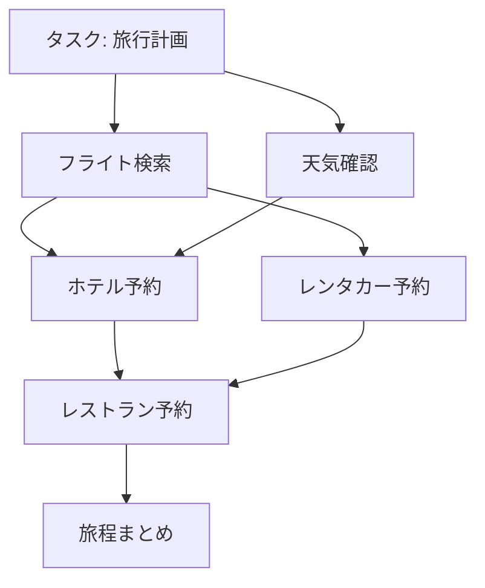

## 論文概要（Abstract）

本記事は [Benchmarking Agentic Workflow Generation](https://arxiv.org/abs/2410.07869)（WorFBench）の解説記事です。

WorFBenchは、LLMエージェントが複雑なタスクを実行可能なワークフロー（有向非巡回グラフ: DAG）に分解する能力を体系的に評価するベンチマークである。著者らは、既存の評価フレームワークがシナリオの多様性やワークフロー構造の複雑さに欠けると指摘し、4つのシナリオカテゴリ（関数呼び出し、問題解決、身体化タスク、オープングラウンデッド計画）にまたがる統合ベンチマークを構築した。さらに、部分列・部分グラフマッチングに基づく評価プロトコルWorFEvalを提案し、GPT-4でもグラフ構造計画では約15%の性能低下が生じることを明らかにした。

この記事は [Zenn記事: LangGraph v1.1ステートマシンのドメインモデリングとテスト駆動設計](https://zenn.dev/0h_n0/articles/751f2013ecfa32) の深掘りです。

## 情報源

- **arXiv ID**: 2410.07869
- **URL**: [https://arxiv.org/abs/2410.07869](https://arxiv.org/abs/2410.07869)
- **著者**: Shuofei Qiao, Runnan Fang, Zhisong Qiu, Xiaobin Wang, Ningyu Zhang et al.（浙江大学, アリババDAMO Academy）
- **発表年**: 2024（ICLR 2025採択）
- **分野**: cs.CL, cs.AI, cs.HC, cs.LG, cs.MA

## 背景と動機（Background & Motivation）

LLMエージェントの実用化において、複雑なタスクを実行可能なサブタスクへ分解する「ワークフロー生成」は中核的な能力である。たとえば「旅行プランを立てる」というタスクを、フライト検索、ホテル予約、天気確認といったサブタスクに分解し、それらの依存関係を正しく定義する必要がある。

しかし、著者らは既存の評価フレームワークに以下の3つの限界があると指摘している。第一に、全体的な成功率のみに注目し、ワークフロー構造自体を評価しないフレームワークが多い。第二に、シナリオのカバレッジが狭く、特定のドメインに偏っている。第三に、ワークフロー構造が線形（逐次実行）に限定されており、並列実行を含むDAG構造を扱えない。

これらの課題を解決するため、著者らは多様なシナリオと複雑なグラフ構造を備えたWorFBenchと、部分列・部分グラフマッチングによる定量的評価プロトコルWorFEvalを提案した。

## 主要な貢献（Key Contributions）

- **WorFBenchベンチマーク**: 4カテゴリ（関数呼び出し、問題解決、身体化タスク、オープングラウンデッド計画）にまたがる統合ベンチマーク。訓練データ18,679件、テストデータ2,146件、汎化評価用ホールドアウト723件を含む
- **WorFEval評価プロトコル**: ノードレベル（二部マッチング）、チェーンレベル（最長増加部分列）、グラフレベル（最大共通誘導部分グラフ）の3段階評価を統合した体系的プロトコル
- **18モデルの包括的評価**: GPT-4、Claude-3.5、O1-preview等の閉源モデルとLlama-3.1、Qwen-2等の開源モデルを比較し、線形計画とグラフ計画の間に15-20%の性能差があることを実証
- **ワークフローの実用価値の実証**: 生成されたワークフローを下流タスクに適用すると、タスク成功率の向上と推論時間の短縮が同時に達成されることを示した

## 技術的詳細（Technical Details）

### タスク定式化

WorFBenchでは、ワークフロー生成を以下のように定式化している。

$$
\mathcal{G}(\mathcal{V}, \mathcal{E}) \leftarrow \mathcal{M}_\theta(q, \mathcal{A})
$$

ここで、
- $\mathcal{G}$: 生成されるワークフロー（DAG）
- $\mathcal{V}$: サブタスクの集合（ノード）
- $\mathcal{E}$: 実行依存関係の集合（エッジ）
- $q$: タスク記述
- $\mathcal{A}$: 利用可能なアクションのリスト
- $\mathcal{M}_\theta$: LLMエージェント

LLMの生成特性を考慮し、著者らはノードチェーン（トポロジカル順序の線形表現）を中間表現として導入している。

$$
\mathcal{G}(\mathcal{V}, \mathcal{E}) \leftarrow \mathcal{C}(\mathcal{V}) \leftarrow \mathcal{M}_\theta(q, \mathcal{A})
$$

$\mathcal{C}(\mathcal{V})$はDAGのトポロジカルソートに対応するノード列であり、LLMが自然に生成しやすい形式である。

### DAGベースのワークフロー表現

WorFBenchの特徴は、ワークフローを単なる逐次的なステップ列ではなく、並列実行可能なDAGとして表現する点にある。以下に典型的なワークフロー例を示す。



この例では、フライト検索と天気確認は独立に並列実行可能であり、ホテル予約はその両方の完了を待つ必要がある。このような依存関係の表現はLangGraphのエッジ定義と直接対応する。

### データ構築プロセス

著者らは以下のデータソースからワークフローデータを収集している。

| シナリオ | データソース | 構築方法 |
|---------|------------|---------|
| 関数呼び出し | ToolBench, ToolAlpaca | GPT-4によるREACTフォーマットからのリバースエンジニアリング |
| 身体化タスク | ALFWorld, WebShop, OS | Few-shot例からのGPT-4合成 |
| 問題解決 | LUMOS | 既存の計画チェーンの直接処理 |
| オープングラウンデッド | WikiHow | 既存ワークフローの処理、類似アクションのDistractor追加 |

品質管理として、ノードチェーンフィルタリング（15.36%除去）とグラフフィルタリング（29.77%除去）の2段階フィルタリングを実施し、さらに人手による粒度・論理性・品質の検証を行っている。

### WorFEval評価プロトコル

WorFEvalは3段階の評価を統合した体系的プロトコルである。

**ステップ1: ノードマッチング（二部マッチング）**

生成ノードと正解ノードの意味的類似度行列を構築し、Hopcroft-Karpアルゴリズムで最大重み二部マッチングを行う。

$$
\mathcal{S}_{i,j} = \begin{cases} \sigma(v_i^g, v_j^p), & \sigma \geq \beta \\ 0, & \text{otherwise} \end{cases}
$$

ここで、$\sigma$はSentence-BERT（all-mpnet-base-v2）による埋め込み類似度、$\beta = 0.6$は閾値である。

**ステップ2: チェーン評価（最長増加部分列: LIS）**

生成されたノードチェーンと正解の全有効トポロジカル順序（最大20個）との間でLISマッチングを行い、F1スコアを算出する。

$$
f1_{\text{chain}} = \frac{2 \cdot p_{\text{chain}} \cdot r_{\text{chain}}}{p_{\text{chain}} + r_{\text{chain}}}
$$

ここで、$p_{\text{chain}} = l / \lvert\mathcal{V}^p\rvert$（適合率）、$r_{\text{chain}} = l / \lvert\mathcal{V}^g\rvert$（再現率）、$l$はLISの長さである。

**ステップ3: グラフ評価（最大共通誘導部分グラフ: MCIS）**

DAGの構造的整合性を評価するため、MCISアルゴリズムを適用する。

$$
f1_{\text{graph}} = \frac{2 \cdot p_{\text{graph}} \cdot r_{\text{graph}}}{p_{\text{graph}} + r_{\text{graph}}}
$$

ここで、$p_{\text{graph}} = k / \lvert\mathcal{V}^p\rvert$、$r_{\text{graph}} = k / \lvert\mathcal{V}^g\rvert$、$k$はMCISのノード数である。

### LangGraphのエッジ設計との対応関係

WorFBenchのDAG表現はLangGraphのステートグラフ設計と直接的に対応する。以下に具体的なコード例を示す。

```python
from typing import TypedDict, Annotated
from langgraph.graph import StateGraph, START, END


class WorkflowState(TypedDict):
    """ワークフロー実行状態

    Attributes:
        task: 元のタスク記述
        subtask_results: 各サブタスクの実行結果
        completed_nodes: 完了済みノードの集合
    """
    task: str
    subtask_results: dict[str, str]
    completed_nodes: set[str]


def build_workflow_graph(
    nodes: list[str],
    edges: list[tuple[str, str]],
) -> StateGraph:
    """WorFBenchのDAG定義からLangGraphを構築する

    Args:
        nodes: サブタスク名のリスト
        edges: (source, target) 形式の依存関係リスト

    Returns:
        構築されたStateGraph
    """
    graph = StateGraph(WorkflowState)

    # ノード登録
    for node_name in nodes:
        graph.add_node(node_name, _create_node_fn(node_name))

    # エッジ登録（DAGの依存関係を反映）
    entry_nodes = _find_entry_nodes(nodes, edges)
    for entry in entry_nodes:
        graph.add_edge(START, entry)

    for source, target in edges:
        graph.add_edge(source, target)

    exit_nodes = _find_exit_nodes(nodes, edges)
    for exit_node in exit_nodes:
        graph.add_edge(exit_node, END)

    return graph


def _create_node_fn(node_name: str):
    """ノード実行関数を生成する

    Args:
        node_name: サブタスク名

    Returns:
        ノード実行関数
    """
    def node_fn(state: WorkflowState) -> WorkflowState:
        result = f"Executed: {node_name}"
        state["subtask_results"][node_name] = result
        state["completed_nodes"].add(node_name)
        return state
    return node_fn


def _find_entry_nodes(
    nodes: list[str],
    edges: list[tuple[str, str]],
) -> list[str]:
    """入次数0のノード（エントリポイント）を特定する

    Args:
        nodes: 全ノードリスト
        edges: エッジリスト

    Returns:
        エントリノードのリスト
    """
    targets = {e[1] for e in edges}
    return [n for n in nodes if n not in targets]


def _find_exit_nodes(
    nodes: list[str],
    edges: list[tuple[str, str]],
) -> list[str]:
    """出次数0のノード（終了ポイント）を特定する

    Args:
        nodes: 全ノードリスト
        edges: エッジリスト

    Returns:
        終了ノードのリスト
    """
    sources = {e[0] for e in edges}
    return [n for n in nodes if n not in sources]
```

## 実装のポイント（Implementation）

WorFBenchのアプローチを実装する際の重要な注意点を以下に整理する。

**ノードマッチングの閾値設定**: 著者らはSentence-BERTの類似度閾値を$\beta = 0.6$に設定しているが、ドメイン固有のタスクでは調整が必要となる。特に専門用語が多いドメインでは、ドメイン適応済みの埋め込みモデルの使用を検討すべきである。

**トポロジカルソートの列挙制限**: チェーン評価でトポロジカル順序を最大20個に制限しているのは計算量の制約による。DAGのノード数$n$に対してトポロジカル順序の数は最悪$O(n!)$であり、大規模グラフでは列挙が困難になる。

**MCISの計算複雑性**: 最大共通誘導部分グラフ問題はNP困難であるため、実用的にはヒューリスティクスや近似アルゴリズムの導入が必要になる場合がある。著者らの実装ではワークフローの平均ノード数が4.17と小さいため、厳密解が現実的な時間で計算可能である。

**LangGraphへの適用**: WorFBenchのDAG定義をLangGraphのエッジとして直接変換する際、条件付きエッジ（`add_conditional_edges`）への対応が必要になるケースがある。WorFBenchは静的なDAGを前提としているが、実運用では実行時の分岐が必要になる場面が多い。

## Production Deployment Guide

DAGベースのワークフローオーケストレーションシステムをAWSにデプロイする際の実装ガイドを示す。WorFBenchのDAG構造をLangGraphで実装し、Step Functionsと連携させるアーキテクチャを想定する。

### AWS実装パターン（コスト最適化重視）

以下のコスト試算は2026年4月時点のap-northeast-1（東京）リージョン料金に基づく概算値である。実際のコストはトラフィックパターン、バースト使用量により変動するため、最新料金はAWS料金計算ツールで確認を推奨する。

**Small構成（~100 req/日）: Serverless**

| サービス | 用途 | 月額概算 |
|---------|------|---------|
| Lambda | ワークフロー実行エンジン | $5-15 |
| Step Functions | DAG実行制御 | $10-25 |
| Bedrock (Claude 3 Haiku) | サブタスク分解 | $20-60 |
| DynamoDB (On-Demand) | ワークフロー状態管理 | $5-10 |
| CloudWatch | ログ・監視 | $5-10 |
| **合計** | | **$45-120/月** |

**Medium構成（~1,000 req/日）: Hybrid**

| サービス | 用途 | 月額概算 |
|---------|------|---------|
| ECS Fargate | ワークフロー実行エンジン | $80-200 |
| Step Functions | DAG実行制御 | $100-250 |
| Bedrock (Claude 3.5 Sonnet) | サブタスク分解 | $200-500 |
| ElastiCache (Redis) | 実行状態キャッシュ | $50-100 |
| DynamoDB (Provisioned) | ワークフロー永続化 | $30-60 |
| CloudWatch + X-Ray | 監視・トレーシング | $20-40 |
| **合計** | | **$480-1,150/月** |

**Large構成（10,000+ req/日）: Container**

| サービス | 用途 | 月額概算 |
|---------|------|---------|
| EKS + Spot Instances | ワークフロー実行クラスタ | $400-800 |
| Step Functions Express | 高頻度DAG実行 | $200-500 |
| Bedrock (Batch API) | サブタスク分解（50%コスト削減） | $800-2,000 |
| ElastiCache (Redis Cluster) | 分散状態管理 | $200-400 |
| Aurora Serverless v2 | ワークフロー履歴・分析 | $150-300 |
| CloudWatch + X-Ray + Grafana | 統合監視 | $50-100 |
| **合計** | | **$1,800-4,100/月** |

**コスト削減テクニック**:
- Spot Instances活用で計算リソースを最大90%削減
- Reserved Instances（1年コミット）でEKSワーカーノードを最大72%削減
- Bedrock Batch APIで推論コストを50%削減
- Step Functions Expressワークフローで標準の1/6のコスト

### Terraformインフラコード

**Small構成（Serverless）**:

```hcl
# WorFBench DAG Workflow - Small Serverless構成
# terraform >= 1.9, aws provider >= 5.80

terraform {
  required_version = ">= 1.9"
  required_providers {
    aws = {
      source  = "hashicorp/aws"
      version = ">= 5.80"
    }
  }
}

provider "aws" {
  region = "ap-northeast-1"
}

# --- IAM ---
resource "aws_iam_role" "workflow_lambda" {
  name = "workflow-dag-lambda-role"
  assume_role_policy = jsonencode({
    Version = "2012-10-17"
    Statement = [{
      Action    = "sts:AssumeRole"
      Effect    = "Allow"
      Principal = { Service = "lambda.amazonaws.com" }
    }]
  })
}

resource "aws_iam_role_policy" "lambda_bedrock" {
  name = "bedrock-invoke"
  role = aws_iam_role.workflow_lambda.id
  policy = jsonencode({
    Version = "2012-10-17"
    Statement = [
      {
        Effect   = "Allow"
        Action   = ["bedrock:InvokeModel"]
        Resource = "arn:aws:bedrock:ap-northeast-1::foundation-model/anthropic.claude-3-haiku-*"
      },
      {
        Effect   = "Allow"
        Action   = ["dynamodb:PutItem", "dynamodb:GetItem", "dynamodb:UpdateItem", "dynamodb:Query"]
        Resource = aws_dynamodb_table.workflow_state.arn
      },
      {
        Effect   = "Allow"
        Action   = ["logs:CreateLogGroup", "logs:CreateLogStream", "logs:PutLogEvents"]
        Resource = "arn:aws:logs:ap-northeast-1:*:*"
      }
    ]
  })
}

# --- DynamoDB（ワークフロー状態管理）---
resource "aws_dynamodb_table" "workflow_state" {
  name         = "workflow-dag-state"
  billing_mode = "PAY_PER_REQUEST"  # On-Demand: 低トラフィックで最適
  hash_key     = "workflow_id"
  range_key    = "node_id"

  attribute {
    name = "workflow_id"
    type = "S"
  }
  attribute {
    name = "node_id"
    type = "S"
  }

  server_side_encryption {
    enabled = true  # KMS暗号化
  }

  point_in_time_recovery {
    enabled = true
  }
}

# --- Lambda（ワークフロー実行エンジン）---
resource "aws_lambda_function" "workflow_engine" {
  function_name = "workflow-dag-engine"
  runtime       = "python3.12"
  handler       = "handler.lambda_handler"
  role          = aws_iam_role.workflow_lambda.arn
  timeout       = 300
  memory_size   = 512  # LangGraph実行に十分なメモリ

  filename         = "lambda.zip"
  source_code_hash = filebase64sha256("lambda.zip")

  environment {
    variables = {
      DYNAMODB_TABLE = aws_dynamodb_table.workflow_state.name
      BEDROCK_MODEL  = "anthropic.claude-3-haiku-20240307-v1:0"
    }
  }

  tracing_config {
    mode = "Active"  # X-Ray有効化
  }
}

# --- CloudWatch アラーム ---
resource "aws_cloudwatch_metric_alarm" "lambda_errors" {
  alarm_name          = "workflow-lambda-errors"
  comparison_operator = "GreaterThanThreshold"
  evaluation_periods  = 2
  metric_name         = "Errors"
  namespace           = "AWS/Lambda"
  period              = 300
  statistic           = "Sum"
  threshold           = 5
  alarm_description   = "Lambda error rate exceeded threshold"

  dimensions = {
    FunctionName = aws_lambda_function.workflow_engine.function_name
  }
}
```

**Large構成（Container）**:

```hcl
# WorFBench DAG Workflow - Large Container構成
# EKS + Karpenter + Spot Instances

module "eks" {
  source  = "terraform-aws-modules/eks/aws"
  version = "~> 20.31"

  cluster_name    = "workflow-dag-cluster"
  cluster_version = "1.31"

  vpc_id     = module.vpc.vpc_id
  subnet_ids = module.vpc.private_subnets

  cluster_endpoint_public_access = false  # プライベートアクセスのみ

  eks_managed_node_groups = {
    system = {
      instance_types = ["m7i.large"]
      min_size       = 2
      max_size       = 3
      desired_size   = 2
      capacity_type  = "ON_DEMAND"  # システム系はオンデマンド
    }
  }
}

# Karpenter Provisioner（Spot優先で最大90%コスト削減）
resource "kubectl_manifest" "karpenter_nodepool" {
  yaml_body = yamlencode({
    apiVersion = "karpenter.sh/v1"
    kind       = "NodePool"
    metadata   = { name = "workflow-workers" }
    spec = {
      template = {
        spec = {
          requirements = [
            { key = "karpenter.sh/capacity-type", operator = "In", values = ["spot", "on-demand"] },
            { key = "node.kubernetes.io/instance-type", operator = "In",
              values = ["m7i.xlarge", "m6i.xlarge", "m5.xlarge", "c7i.xlarge", "c6i.xlarge"] },
          ]
          nodeClassRef = { name = "default" }
        }
      }
      limits   = { cpu = "100", memory = "400Gi" }
      disruption = {
        consolidationPolicy = "WhenEmptyOrUnderutilized"
        consolidateAfter    = "30s"
      }
    }
  })
}

# AWS Budgets（コストアラート）
resource "aws_budgets_budget" "monthly" {
  name         = "workflow-dag-monthly"
  budget_type  = "COST"
  limit_amount = "5000"
  limit_unit   = "USD"
  time_unit    = "MONTHLY"

  notification {
    comparison_operator       = "GREATER_THAN"
    threshold                 = 80
    threshold_type            = "PERCENTAGE"
    notification_type         = "ACTUAL"
    subscriber_email_addresses = ["ops-team@example.com"]
  }
}

# Secrets Manager（Bedrock設定）
resource "aws_secretsmanager_secret" "bedrock_config" {
  name                    = "workflow-dag/bedrock-config"
  recovery_window_in_days = 7
}
```

### 運用・監視設定

**CloudWatch Logs Insights クエリ**:

```
# ワークフロー実行のレイテンシ分析（P95, P99）
fields @timestamp, workflow_id, duration_ms
| filter event = "workflow_completed"
| stats percentile(duration_ms, 95) as p95,
        percentile(duration_ms, 99) as p99,
        avg(duration_ms) as avg_ms
  by bin(1h) as time_bucket
| sort time_bucket desc

# DAGノード別のエラー率
fields @timestamp, node_id, error.type
| filter level = "ERROR"
| stats count(*) as error_count by node_id
| sort error_count desc
| limit 20
```

**CloudWatch アラーム設定（Python）**:

```python
import boto3


def create_workflow_alarms(function_name: str, sns_topic_arn: str) -> None:
    """ワークフロー監視用CloudWatchアラームを作成する

    Args:
        function_name: Lambda関数名
        sns_topic_arn: 通知先SNSトピックARN
    """
    cloudwatch = boto3.client("cloudwatch", region_name="ap-northeast-1")

    # Bedrock トークン使用量スパイク検知
    cloudwatch.put_metric_alarm(
        AlarmName="bedrock-token-spike",
        MetricName="InputTokenCount",
        Namespace="AWS/Bedrock",
        Statistic="Sum",
        Period=3600,
        EvaluationPeriods=1,
        Threshold=100000,
        ComparisonOperator="GreaterThanThreshold",
        AlarmActions=[sns_topic_arn],
    )

    # Lambda実行時間異常検知
    cloudwatch.put_metric_alarm(
        AlarmName="workflow-lambda-duration",
        MetricName="Duration",
        Namespace="AWS/Lambda",
        Statistic="p99",
        Period=300,
        EvaluationPeriods=3,
        Threshold=250000,  # 250秒
        ComparisonOperator="GreaterThanThreshold",
        Dimensions=[{"Name": "FunctionName", "Value": function_name}],
        AlarmActions=[sns_topic_arn],
    )
```

**X-Ray トレーシング設定（Python）**:

```python
from aws_xray_sdk.core import xray_recorder, patch_all


def configure_xray_tracing() -> None:
    """X-Rayトレーシングを設定する"""
    xray_recorder.configure(service="workflow-dag-engine")
    patch_all()  # boto3自動計装


def trace_workflow_node(
    workflow_id: str,
    node_id: str,
    node_type: str,
) -> None:
    """ワークフローノード実行をトレースする

    Args:
        workflow_id: ワークフロー実行ID
        node_id: 実行中のノードID
        node_type: ノードタイプ（function_call, reasoning等）
    """
    subsegment = xray_recorder.begin_subsegment(f"node-{node_id}")
    subsegment.put_annotation("workflow_id", workflow_id)
    subsegment.put_annotation("node_type", node_type)
    subsegment.put_metadata("node_id", node_id, "workflow")
```

**Cost Explorer自動レポート（Python）**:

```python
import boto3
from datetime import datetime, timedelta


def get_daily_cost_report() -> dict:
    """日次コストレポートを取得する

    Returns:
        サービス別コスト情報の辞書
    """
    ce = boto3.client("ce", region_name="us-east-1")
    today = datetime.utcnow().date()
    yesterday = today - timedelta(days=1)

    response = ce.get_cost_and_usage(
        TimePeriod={
            "Start": yesterday.isoformat(),
            "End": today.isoformat(),
        },
        Granularity="DAILY",
        Metrics=["UnblendedCost"],
        Filter={
            "Tags": {
                "Key": "Project",
                "Values": ["workflow-dag"],
                "MatchOptions": ["EQUALS"],
            }
        },
        GroupBy=[{"Type": "DIMENSION", "Key": "SERVICE"}],
    )

    costs = {}
    for group in response["ResultsByTime"][0]["Groups"]:
        service = group["Keys"][0]
        amount = float(group["Metrics"]["UnblendedCost"]["Amount"])
        if amount > 0:
            costs[service] = amount

    total = sum(costs.values())

    # $100/日超過でアラート
    if total > 100:
        sns = boto3.client("sns", region_name="ap-northeast-1")
        sns.publish(
            TopicArn="arn:aws:sns:ap-northeast-1:ACCOUNT:cost-alert",
            Subject="Workflow DAG Cost Alert",
            Message=f"Daily cost exceeded $100: ${total:.2f}",
        )

    return costs
```

### コスト最適化チェックリスト

**アーキテクチャ選択**:
- [ ] トラフィック量に応じた構成選択（~100/日: Serverless、~1,000/日: Hybrid、10,000+/日: Container）
- [ ] Step Functions Standard vs Express の使い分け（短時間ワークフローはExpress: 1/6コスト）

**リソース最適化**:
- [ ] EC2/EKSワーカー: Spot Instances優先（最大90%削減）
- [ ] Reserved Instances: 1年コミットで最大72%削減
- [ ] Savings Plans: コンピューティング全体での割引検討
- [ ] Lambda: メモリサイズ最適化（Power Tuning実施）
- [ ] ECS/EKS: Karpenterによるアイドル時スケールダウン
- [ ] NAT Gateway: VPCエンドポイント活用で通信コスト削減

**LLMコスト削減**:
- [ ] Bedrock Batch API使用（非リアルタイムワークフローで50%削減）
- [ ] Prompt Caching有効化（繰り返しプロンプトで30-90%削減）
- [ ] モデル選択ロジック（単純タスクはHaiku、複雑タスクはSonnet）
- [ ] トークン数制限（max_tokens設定、プロンプト圧縮）
- [ ] WorFBenchの知見: 小規模モデル（7B）でも訓練済みならGPT-4相当の関数呼び出し性能

**監視・アラート**:
- [ ] AWS Budgets設定（月額上限の80%で警告）
- [ ] CloudWatch アラーム（Bedrockトークン使用量、Lambda実行時間）
- [ ] Cost Anomaly Detection有効化
- [ ] 日次コストレポート（Cost Explorer API + SNS通知）
- [ ] X-Rayトレーシング（ボトルネック特定）

**リソース管理**:
- [ ] 未使用リソース定期削除（Lambda旧バージョン、未使用ENI）
- [ ] タグ戦略（Project, Environment, Ownerタグ必須）
- [ ] ライフサイクルポリシー（S3/ECRの古いオブジェクト自動削除）
- [ ] 開発環境の夜間・週末自動停止
- [ ] CloudFormation/Terraform Drift Detection

## 実験結果（Results）

著者らは18モデルを対象に包括的な評価を実施している。以下に主要な結果を示す（論文Table 1より）。

### 主要モデルの性能比較

| モデル | Chain F1 (%) | Graph F1 (%) | 差分 |
|-------|-------------|-------------|------|
| GPT-4 | 67.32 | 52.47 | -14.85 |
| Claude-3.5 | 66.70 | 52.53 | -14.17 |
| O1-preview | 66.70 | 51.63 | -15.07 |
| Qwen-2-72B | 67.24 | 50.46 | -16.78 |
| Llama-3.1-70B | 64.48 | 49.47 | -15.01 |
| Mixtral-8x7B | 63.26 | 46.14 | -17.12 |
| InternLM-2.5-7B | 61.99 | 45.03 | -16.96 |
| GLM-4-9B | 59.12 | 39.07 | -20.05 |

全モデルでChain F1からGraph F1への性能低下（15-20%）が確認されており、著者らはDAG構造の依存関係を正しく生成することがLLMにとって本質的に困難であると結論づけている。

### エラー分析

著者らはエラーを4カテゴリに分類している（論文Figure 4より）。

- **粒度エラー**（20-30%）: サブタスクの分解粒度が不適切（粗すぎる/細かすぎる）
- **明示性エラー**（15-25%）: タスク記述が曖昧で具体性に欠ける
- **グラフエラー**（25-35%）: 依存関係の誤り（不要なエッジの追加、必要なエッジの欠落）
- **フォーマットエラー**（5-15%）: 出力形式の違反

根本的な原因として、著者らは「環境知識の不足」を挙げている。LLMはタスクドメインの実行環境について十分な知識を持っておらず、適切な粒度や依存関係の判断が困難になっている。

### ワークフローの下流タスクへの効果

著者らは生成されたワークフローの実用価値も検証している（論文Table 3より）。

| モデル | タスク | ベースライン | ワークフロー適用 | 改善幅 |
|-------|------|-----------|-------------|------|
| GPT-4 | ALFWorld（未見） | 28.36% | 47.01% | +18.65 |
| Llama-3.1-8B | ALFWorld（未見） | 5.00% | 12.14% | +7.14 |

また、DAGの並列実行により推論時間を1/5から1/3に短縮できることが報告されている。著者らは「弱いモデルが生成したワークフローでも強いモデルの性能を向上させる」（Weak-Guide-Strong）というパラダイムを示している。

## 実運用への応用（Practical Applications）

### LangGraphのエッジ設計への示唆

WorFBenchの知見はLangGraphでのステートマシン設計に直接適用可能である。

第一に、**依存関係のDAG表現**が有効である。WorFBenchではツール間の依存関係をDAGで明示的に定義する設計がワークフロー品質の向上につながることが示されている。LangGraphの`add_edge`でツール間の順序制約を定義する際、このDAG設計パターンが設計根拠となる。

第二に、**並列実行可能なノードの特定**が重要である。DAGのトポロジカル構造から、互いに独立なノードを特定し並列実行することで、推論時間を大幅に短縮できる。LangGraphでは`Send` APIを用いたファンアウト・パターンでこれを実装可能である。

第三に、**粒度の設計判断**がある。WorFBenchのエラー分析から、サブタスクの粒度が粗すぎても細かすぎても性能が低下することが分かっている。LangGraphのノード設計では、各ノードが「最小実行可能単位」となるよう粒度を調整することが望ましい。

### テスト駆動設計との連携

WorFBenchのWorFEval評価指標（Chain F1, Graph F1）は、LangGraphのワークフローに対する自動テストの設計指針として活用できる。ノードの出力検証（ノードマッチング）とエッジ構造の検証（グラフマッチング）を分離することで、ワークフローの品質を多面的に評価できる。

## 関連研究（Related Work）

- **TaskBench** (Shen et al., 2023): ツール呼び出しに特化したベンチマーク。WorFBenchはこれを拡張し、多様なシナリオとDAG構造を導入した
- **ToolBench** (Qin et al., 2024): 16,000以上のRapidAPI を対象としたツール使用ベンチマーク。WorFBenchのFunction Callシナリオのデータソースの一つ
- **FlowBench** (Wang et al., 2024, EMNLP): 51シナリオのワークフロー誘導型計画ベンチマーク。WorFBenchとは評価の焦点が異なり、FlowBenchはワークフロー知識の形式（テキスト/コード/フローチャート）に注目している
- **WorkflowLLM** (Fan et al., 2024): Apple Shortcutsベースの106,763サンプルのワークフローデータセット。WorFBenchとは構築方法とタスクの多様性が異なる
- **LUMOS** (Yin et al., 2024): サブタスク分解と根拠付けを統合した計画フレームワーク。WorFBenchの問題解決シナリオのデータソースとして使用されている

## まとめと今後の展望

WorFBenchは、LLMエージェントのワークフロー生成能力を体系的に評価する初の包括的ベンチマークである。著者らの実験結果から、GPT-4やClaude-3.5といった最先端モデルでもDAG構造のワークフロー生成には約15%の性能低下が生じ、実用レベルには達していないことが明らかになった。

今後の研究方向として、著者らは外部の世界知識の統合とインタラクティブな計画パラダイムの探索を挙げている。LangGraphを用いた実装では、WorFBenchの知見を活かしたDAGベースのエッジ設計と、WorFEvalの評価指標に基づくテスト戦略の構築が実務的に有用であると考えられる。

> 注記: 本記事は論文の引用・解説であり、筆者自身が実験を行ったものではない。実験結果の数値は論文の記載に基づく。AI（Claude）による生成記事である。

## 参考文献

- **arXiv**: [https://arxiv.org/abs/2410.07869](https://arxiv.org/abs/2410.07869)
- **Code**: [https://github.com/zjunlp/WorfBench](https://github.com/zjunlp/WorfBench)
- **ICLR 2025**: [https://openreview.net/forum?id=vunPXOFmoi](https://openreview.net/forum?id=vunPXOFmoi)
- **Related Zenn article**: [https://zenn.dev/0h_n0/articles/751f2013ecfa32](https://zenn.dev/0h_n0/articles/751f2013ecfa32)
