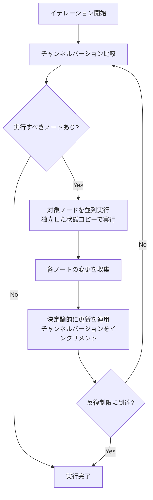

## ブログ概要（Summary）

本記事は [Building LangGraph: Designing an Agent Runtime from First Principles](https://www.langchain.com/blog/building-langgraph) の解説記事です。

この記事は [Zenn記事: LangGraph v1.1ステートマシンのドメインモデリングとテスト駆動設計](https://zenn.dev/0h_n0/articles/751f2013ecfa32) の深掘りです。

LangGraphは、LLMエージェントを本番環境で運用するためのフレームワークとして設計されたランタイムである。LangChainチームのNuno Campos氏が2025年9月に公開したこのブログでは、LangGraphの設計思想として「未来に依存しない設計」と「コードライクなDX」の2原則を掲げ、本番運用に必要な6つの要件（並列化、ストリーミング、タスクキュー、チェックポイント、Human-in-the-Loop、トレーシング）をどのように満たしたかが詳細に解説されている。コアとなる実行エンジンにはGoogleのPregel論文に着想を得たバルク同期並列（BSP）アルゴリズムを採用しており、ループ対応・決定論的並列実行・履歴長O(1)のスケーリング特性を実現している。

## 情報源

- **種別**: 企業テックブログ
- **URL**: [https://www.langchain.com/blog/building-langgraph](https://www.langchain.com/blog/building-langgraph)
- **組織**: LangChain
- **著者**: Nuno Campos
- **発表日**: 2025年9月4日

## 技術的背景（Technical Background）

LLMエージェントの本番運用において、LangChainチームは既存のフレームワークでは要件を満たせないという課題に直面した。ブログでは、この判断の根拠として2種類の既存フレームワークの限界が分析されている。

**DAGフレームワーク（Apache Airflow等）の限界**: LLMエージェントの計算グラフは本質的に循環的である。LLMが次のアクションを動的に決定し、その結果に基づいて再びLLMを呼び出す必要があるため、非循環グラフ（DAG）では表現できない。ブログでは「LLMエージェントの計算グラフは循環的であり、DAGアルゴリズムでは処理できない」と明確に述べられている。

**永続実行エンジン（Temporal等）の限界**: Temporalのようなワークフローエンジンは耐久性に優れるが、LangChainチームは以下の3点を問題視している。(1) ストリーミング機能の欠如 --- チャットボットUIでは実行中の進捗表示が必須である。(2) ステップ間レイテンシの存在 --- 対話的なエージェントでは許容できない遅延が生じる。(3) 実行履歴長に比例した性能劣化 --- 長時間実行のエージェントでは致命的になる。

これらの制約を踏まえ、LangChainチームは「ループ対応」「ストリーミングネイティブ」「履歴長に依存しないスケーリング」を同時に実現する新しいランタイムの設計に着手した。

## 実装アーキテクチャ（Architecture）

### 設計原則

LangGraphの設計は2つの原則に基づいている。

**原則1: 未来に依存しない設計（Minimal Future Assumptions）**

LangChainチームは「未来について仮定を少なくするほど良い」と述べている。LLMの開発パターンは急速に変化しており、特定のアーキテクチャパターン（ReActやChain-of-Thought等）に依存する設計は短命になりやすい。LangGraphが前提とするのは「LLMは遅く、不安定で、オープンエンドである」という3つの性質のみである。

**原則2: コードライクなDX（Natural Code Expression）**

開発者に課すすべての制約は「本当に高い価値の機能を実現するため」に正当化される必要があるとしている。フレームワーク固有のDSLや抽象化を最小限に抑え、通常のPythonコードに近い感覚でエージェントを構築できることを目指している。

### Pregelベース実行アルゴリズム

LangGraphのコアランタイムであるPregelLoopは、Googleが2010年に発表したPregel論文（Malewicz et al., SIGMOD 2010）のバルク同期並列（BSP）モデルに着想を得ている。BSPは、Leslie Valiantが1990年に提唱した分散計算モデルで、計算を「スーパーステップ」と呼ばれる同期的なフェーズに分割して実行する。

LangGraphはこのモデルを単一プロセス内でのエージェント実行に適用し、ループ対応を追加した点が独自の貢献である。

#### コアコンポーネント

**チャンネル（Channels）**: 名前付きデータコンテナであり、単調増加するバージョン番号を持つ。チャンネルへの変更はバージョンのインクリメントとして追跡される。

**ノード（Nodes）**: チャンネルを購読する関数である。購読先のチャンネルのバージョンが変化すると、そのノードが実行候補として選択される。

**入出力マッピング**: エージェント実行の開始トリガーとなるチャンネルと、最終出力として返すチャンネルを指定する。

```python
from langgraph.graph import StateGraph
from typing import TypedDict, Annotated
import operator


class AgentState(TypedDict):
    """エージェントの状態定義

    Attributes:
        messages: 会話履歴（追記型チャンネル）
        next_action: 次に実行するアクション
    """
    messages: Annotated[list[str], operator.add]
    next_action: str


def planning_node(state: AgentState) -> dict:
    """計画ノード: LLMを呼び出して次のアクションを決定する

    Args:
        state: 現在のエージェント状態

    Returns:
        次のアクションを含む状態更新
    """
    # LLM呼び出しで次のアクションを決定
    return {"next_action": "execute", "messages": ["Plan decided"]}


def execution_node(state: AgentState) -> dict:
    """実行ノード: 計画に基づいてアクションを実行する

    Args:
        state: 現在のエージェント状態

    Returns:
        実行結果を含む状態更新
    """
    return {"messages": ["Action executed"]}


# グラフ構築
graph = StateGraph(AgentState)
graph.add_node("plan", planning_node)
graph.add_node("execute", execution_node)
```

#### 実行ループの詳細

BSPモデルに基づく実行ループは、以下の手順で1イテレーションを処理する。



**ステップ1: ノード選択** --- 各チャンネルの現在バージョンと、各ノードが最後に確認したバージョンを比較する。バージョンが古いノードが実行候補として選択される。

**ステップ2: 並列実行** --- 選択されたノードは独立した状態コピー上で並列実行される。あるノードの書き込みが他のノードの読み取りに干渉しないことが保証される。

**ステップ3: 更新の適用** --- 全ノードの実行が完了した後、変更を決定論的な順序で一括適用する。これによりデータ競合を防止しつつ、実行結果の再現性を担保する。

**ステップ4: 停止判定** --- 全ノードが最新バージョンを確認済みか、反復制限に到達した場合に停止する。

この「並列実行 → バリア同期 → 更新適用」のサイクルはBSPのスーパーステップに対応する。BSPでは各スーパーステップが(1)ローカル計算、(2)通信、(3)バリア同期の3フェーズで構成されるが、LangGraphではこれを「ノード実行→変更収集→決定論的適用」に読み替えている。

### ランタイムとSDKの分離

LangChainチームは、実行エンジン（PregelLoop）と開発者向けSDK（StateGraph、命令型API）を明確に分離する設計判断を行っている。この分離により以下が可能になる。

- **SDK側の進化**: ランタイムを変更せずに新しいAPIパターンを追加できる
- **ランタイム側の最適化**: APIに影響を与えずにパフォーマンスを改善できる
- **将来の分散実行**: ランタイムを分散環境に置き換える実験が可能になる

## パフォーマンス最適化（Performance）

### スケーリング特性

ブログでは、LangGraphの各実行フェーズにおけるスケーリング特性が以下のように示されている。

| フェーズ | ノード数 | エッジ数 | チャンネル数 | アクティブノード数 | 履歴長 | スレッド数 |
|---------|---------|---------|------------|-----------------|--------|----------|
| 起動（Starting） | $O(n)$ | $O(1)$ | $O(n)$ | $O(1)$ | $O(1)$ | $O(1)$ |
| 計画（Planning） | $O(1)$ | $O(1)$ | $O(n)$ | $O(n)$ | $O(1)$ | $O(1)$ |
| 実行（Running） | $O(1)$ | $O(n)$ | $O(n)$ | $O(n)$ | $O(1)$ | $O(1)$ |
| 終了（Finishing） | $O(n)$ | $O(1)$ | $O(n)$ | $O(n)$ | $O(1)$ | $O(1)$ |

### 履歴長O(1)の意味

この表で注目すべきは、**履歴長がすべてのフェーズでO(1)である**という点である。これは、チェックポイントからの再開時に最新のチェックポイントのみをロードすれば済むことを意味する。

Temporalのような永続実行エンジンでは、再開時に過去の実行履歴をリプレイする必要があり、履歴が長くなるほど性能が劣化する。LangGraphでは、チャンネルのシリアライズされた値とバージョン文字列をチェックポイントとして保存するため、履歴長に依存しない定数時間での再開が可能である。

これは、長時間実行されるエージェント（数時間から数日にわたるワークフロー）において決定的な優位性となる。

## 運用での学び（Production Lessons）

### 企業での本番運用

ブログによると、LangGraphはLinkedIn、Uber、Klarna、Elasticといった企業で本番環境に導入されている。また、Kenshoはマルチエージェント金融データ取得フレームワークに、Remoteは顧客オンボーディングのスケーリングに、FastwebとVodafoneはカスタマーエクスペリエンス変革にそれぞれLangGraphを活用している。

### 設計判断のトレードオフ

**構造化エージェント vs. モノリシックループ**: LangGraphは離散的なステップで実行を構造化する方式を採用している。これはGOTO文を排して構造化プログラミングに移行した歴史的経緯と類似しており、チェックポイント・HITL・決定論的動作を実現する代わりに、開発者はステップ単位での設計を求められる。

**最小限の抽象化**: フレームワークが提供する抽象化を最小限に留めることで、LLM開発パターンの急速な変化に対応している。開発者は必要な機能（たとえば`interrupt()`関数によるHuman-in-the-Loop）をオンデマンドで有効化する。不要な複雑さを持ち込まないことで、フレームワーク自体の陳腐化リスクを低減している。

**6種類のストリーミングモード**: LangGraphはvalues、updates、messages、tasks、checkpoints、customの6種類のストリームモードを提供している。開発者がストリーミング用のカスタムコードを書く必要がないことは、ランタイムがステップを管理しているからこそ実現できる機能であると述べられている。

## 学術研究との関連（Academic Connection）

### Pregelモデル（Google, SIGMOD 2010）

LangGraphのコアアルゴリズムは、Googleが2010年にSIGMODで発表したPregel論文（Malewicz et al., "Pregel: A System for Large-Scale Graph Processing"）に着想を得ている。元のPregelは大規模グラフ処理のための分散計算フレームワークであり、「Think Like a Vertex」というプログラミングモデルで頂点中心の計算を実現した。

### BSPとの関連

Pregelの理論的基盤であるBSPモデルは、Leslie Valiantが1990年に提唱した分散計算モデルである。BSPでは計算をスーパーステップに分割し、各ステップは「ローカル計算→通信→バリア同期」の3フェーズで構成される。LangGraphはこの概念を単一プロセス内のエージェント実行に転用し、「ノード実行→変更収集→決定論的適用」のサイクルとして実装している。分散システムの理論を単一プロセスのエージェントランタイムに応用した点が、LangGraphのアーキテクチャ上の独自性である。

## Production Deployment Guide

本セクションでは、LangGraphエージェントをAWS上に本番デプロイするための実装パターン、Terraformコード、運用設定、コスト最適化チェックリストを示す。コスト試算は2026年4月時点のap-northeast-1（東京リージョン）料金に基づく概算値であり、実際のコストはトラフィックパターンやバースト使用量により変動する。最新料金はAWS料金計算ツールで確認を推奨する。

### AWS実装パターン（コスト最適化重視）

#### トラフィック量別の推奨構成

| 構成 | トラフィック | サービス構成 | 月額コスト目安 |
|------|------------|-------------|-------------|
| Small | ~100 req/日 | Lambda + Bedrock + DynamoDB | $50-150/月 |
| Medium | ~1,000 req/日 | ECS Fargate + Bedrock + ElastiCache | $300-800/月 |
| Large | 10,000+ req/日 | EKS + Karpenter + Spot + Bedrock | $2,000-5,000/月 |

**Small構成（~100 req/日）**: Lambda関数でLangGraphエージェントを実行し、DynamoDBにチェックポイントを永続化する。Bedrockを通じてClaude/Titanモデルを呼び出す。コールドスタートのレイテンシ（1-3秒）が許容できるバッチ処理やバックオフィス用途に適する。月額内訳: Lambda $5-15、Bedrock $30-100（トークン量依存）、DynamoDB $5-20、CloudWatch $5-15。

**Medium構成（~1,000 req/日）**: ECS Fargateでコンテナを常時稼働させ、ElastiCacheでチェックポイントの読み取りを高速化する。Fargateのスポットキャパシティを活用し、コスト削減を図る。月額内訳: Fargate $80-200、Bedrock $150-400、ElastiCache $50-100、ALB $20-50、CloudWatch $10-30。

**Large構成（10,000+ req/日）**: EKSクラスタをKarpenterで自動スケーリングし、Spot Instancesを優先的に使用する。複数のLangGraphエージェントを並列実行し、高スループットを実現する。月額内訳: EKS Control Plane $75、EC2 Spot $500-1,500、Bedrock $1,000-2,500、ElastiCache $200-500、ALB $50-100、監視 $50-100。

**コスト削減テクニック**:
- Spot Instancesの活用でEC2コストを最大90%削減
- 1年リザーブドインスタンス購入でオンデマンド比最大72%削減
- Bedrock Batch APIで非リアルタイム処理を50%削減
- Prompt Caching有効化でトークンコストを30-90%削減
- Savings Plansの併用で更に最大66%削減

### Terraformインフラコード

#### Small構成（Serverless: Lambda + Bedrock + DynamoDB）

```hcl
# --- Small構成: LangGraph Agent (Serverless) ---
# コスト最適化: NAT Gateway不使用、DynamoDB On-Demand

terraform {
  required_version = ">= 1.5"
  required_providers {
    aws = {
      source  = "hashicorp/aws"
      version = "~> 5.0"
    }
  }
}

provider "aws" {
  region = "ap-northeast-1"
}

# --- IAMロール（最小権限） ---
resource "aws_iam_role" "langgraph_lambda" {
  name = "langgraph-agent-lambda-role"
  assume_role_policy = jsonencode({
    Version = "2012-10-17"
    Statement = [{
      Action = "sts:AssumeRole"
      Effect = "Allow"
      Principal = { Service = "lambda.amazonaws.com" }
    }]
  })
}

resource "aws_iam_role_policy" "langgraph_lambda_policy" {
  name = "langgraph-agent-policy"
  role = aws_iam_role.langgraph_lambda.id
  policy = jsonencode({
    Version = "2012-10-17"
    Statement = [
      {
        Effect = "Allow"
        Action = [
          "bedrock:InvokeModel",
          "bedrock:InvokeModelWithResponseStream"
        ]
        Resource = "arn:aws:bedrock:ap-northeast-1::foundation-model/*"
      },
      {
        Effect = "Allow"
        Action = [
          "dynamodb:GetItem",
          "dynamodb:PutItem",
          "dynamodb:UpdateItem",
          "dynamodb:Query"
        ]
        Resource = aws_dynamodb_table.checkpoints.arn
      },
      {
        Effect = "Allow"
        Action = [
          "logs:CreateLogGroup",
          "logs:CreateLogStream",
          "logs:PutLogEvents"
        ]
        Resource = "arn:aws:logs:ap-northeast-1:*:*"
      },
      {
        Effect   = "Allow"
        Action   = ["xray:PutTraceSegments", "xray:PutTelemetryRecords"]
        Resource = "*"
      }
    ]
  })
}

# --- DynamoDB（チェックポイント保存、On-Demand） ---
resource "aws_dynamodb_table" "checkpoints" {
  name         = "langgraph-checkpoints"
  billing_mode = "PAY_PER_REQUEST" # コスト最適化: On-Demandモード
  hash_key     = "thread_id"
  range_key    = "checkpoint_id"

  attribute {
    name = "thread_id"
    type = "S"
  }
  attribute {
    name = "checkpoint_id"
    type = "S"
  }

  # KMS暗号化
  server_side_encryption {
    enabled = true
  }

  point_in_time_recovery {
    enabled = true
  }

  ttl {
    attribute_name = "expires_at"
    enabled        = true
  }
}

# --- Lambda関数 ---
resource "aws_lambda_function" "langgraph_agent" {
  function_name = "langgraph-agent"
  role          = aws_iam_role.langgraph_lambda.arn
  handler       = "handler.lambda_handler"
  runtime       = "python3.12"
  timeout       = 300 # LLM呼び出しを含むため長めに設定
  memory_size   = 512 # コスト最適化: 必要最小限のメモリ

  filename         = "lambda_package.zip"
  source_code_hash = filebase64sha256("lambda_package.zip")

  tracing_config {
    mode = "Active" # X-Ray有効化
  }

  environment {
    variables = {
      CHECKPOINT_TABLE = aws_dynamodb_table.checkpoints.name
      BEDROCK_REGION   = "ap-northeast-1"
      LOG_LEVEL        = "INFO"
    }
  }
}

# --- CloudWatchアラーム（コスト監視） ---
resource "aws_cloudwatch_metric_alarm" "lambda_duration" {
  alarm_name          = "langgraph-lambda-duration-high"
  comparison_operator = "GreaterThanThreshold"
  evaluation_periods  = 3
  metric_name         = "Duration"
  namespace           = "AWS/Lambda"
  period              = 300
  statistic           = "Average"
  threshold           = 60000 # 60秒超過で警告
  alarm_description   = "LangGraph Lambda execution time exceeds 60s"
  dimensions = {
    FunctionName = aws_lambda_function.langgraph_agent.function_name
  }
}
```

#### Large構成（Container: EKS + Karpenter + Spot）

```hcl
# --- Large構成: LangGraph Agent (EKS + Karpenter) ---
# コスト最適化: Spot Instances優先、Karpenter自動スケーリング

module "eks" {
  source  = "terraform-aws-modules/eks/aws"
  version = "~> 20.0"

  cluster_name    = "langgraph-production"
  cluster_version = "1.31"

  vpc_id     = module.vpc.vpc_id
  subnet_ids = module.vpc.private_subnets

  # コスト最適化: マネージドノードグループ不使用（Karpenter管理）
  cluster_endpoint_public_access = false # セキュリティ: プライベートのみ

  enable_irsa = true # IAM Roles for Service Accounts

  cluster_encryption_config = {
    provider_key_arn = aws_kms_key.eks.arn
    resources        = ["secrets"]
  }
}

# --- KMS暗号化キー ---
resource "aws_kms_key" "eks" {
  description             = "EKS Secret Encryption Key"
  deletion_window_in_days = 7
  enable_key_rotation     = true
}

# --- Karpenter Provisioner（Spot優先） ---
resource "kubectl_manifest" "karpenter_node_pool" {
  yaml_body = yamlencode({
    apiVersion = "karpenter.sh/v1"
    kind       = "NodePool"
    metadata   = { name = "langgraph-agents" }
    spec = {
      template = {
        spec = {
          requirements = [
            {
              key      = "karpenter.sh/capacity-type"
              operator = "In"
              values   = ["spot", "on-demand"] # Spot優先
            },
            {
              key      = "node.kubernetes.io/instance-type"
              operator = "In"
              values   = ["m6i.xlarge", "m6a.xlarge", "m5.xlarge", "c6i.xlarge"]
            }
          ]
          nodeClassRef = {
            group = "karpenter.k8s.aws"
            kind  = "EC2NodeClass"
            name  = "default"
          }
        }
      }
      limits = {
        cpu    = "128"  # クラスタ全体のCPU上限
        memory = "512Gi"
      }
      disruption = {
        consolidationPolicy = "WhenEmptyOrUnderutilized"
        consolidateAfter    = "30s" # アイドルノードを迅速に回収
      }
    }
  })
}

# --- Secrets Manager（Bedrock設定） ---
resource "aws_secretsmanager_secret" "bedrock_config" {
  name                    = "langgraph/bedrock-config"
  kms_key_id              = aws_kms_key.eks.arn
  recovery_window_in_days = 7
}

# --- AWS Budgets（予算アラート） ---
resource "aws_budgets_budget" "langgraph_monthly" {
  name         = "langgraph-monthly-budget"
  budget_type  = "COST"
  limit_amount = "5000"
  limit_unit   = "USD"
  time_unit    = "MONTHLY"

  notification {
    comparison_operator       = "GREATER_THAN"
    threshold                 = 80
    threshold_type            = "PERCENTAGE"
    notification_type         = "ACTUAL"
    subscriber_email_addresses = ["ops-team@example.com"]
  }

  notification {
    comparison_operator       = "GREATER_THAN"
    threshold                 = 100
    threshold_type            = "PERCENTAGE"
    notification_type         = "FORECASTED"
    subscriber_email_addresses = ["ops-team@example.com"]
  }
}
```

### 運用・監視設定

#### CloudWatch Logs Insights クエリ

```
# コスト異常検知: 1時間あたりのBedrockトークン使用量スパイク
fields @timestamp, @message
| filter @message like /input_tokens|output_tokens/
| stats sum(input_tokens) as total_input, sum(output_tokens) as total_output by bin(1h)
| sort @timestamp desc

# レイテンシ分析: P95/P99
fields @timestamp, duration_ms
| filter @message like /langgraph_step_complete/
| stats percentile(duration_ms, 95) as p95,
        percentile(duration_ms, 99) as p99,
        avg(duration_ms) as avg_ms
  by bin(5m)
```

#### CloudWatchアラーム設定

```python
import boto3
from typing import Final

cloudwatch = boto3.client("cloudwatch", region_name="ap-northeast-1")

ALARM_CONFIGS: Final[list[dict]] = [
    {
        "AlarmName": "langgraph-bedrock-token-spike",
        "MetricName": "InputTokenCount",
        "Namespace": "AWS/Bedrock",
        "Statistic": "Sum",
        "Period": 3600,
        "EvaluationPeriods": 1,
        "Threshold": 500000,  # 1時間50万トークン超過で警告
        "ComparisonOperator": "GreaterThanThreshold",
    },
    {
        "AlarmName": "langgraph-lambda-errors",
        "MetricName": "Errors",
        "Namespace": "AWS/Lambda",
        "Statistic": "Sum",
        "Period": 300,
        "EvaluationPeriods": 2,
        "Threshold": 5,
        "ComparisonOperator": "GreaterThanThreshold",
    },
]


def create_alarms(sns_topic_arn: str) -> None:
    """CloudWatchアラームを一括作成する

    Args:
        sns_topic_arn: 通知先SNSトピックARN
    """
    for config in ALARM_CONFIGS:
        cloudwatch.put_metric_alarm(
            **config,
            AlarmActions=[sns_topic_arn],
            TreatMissingData="notBreaching",
        )
```

#### X-Rayトレーシング設定

```python
from aws_xray_sdk.core import xray_recorder, patch_all
from aws_xray_sdk.core.models.subsegment import Subsegment

# boto3自動計装
patch_all()


def trace_langgraph_step(step_name: str, state: dict) -> Subsegment:
    """LangGraphの各ステップをX-Rayでトレースする

    Args:
        step_name: ステップ名（ノード名に対応）
        state: 現在のエージェント状態

    Returns:
        作成したサブセグメント
    """
    subsegment = xray_recorder.begin_subsegment(f"langgraph.{step_name}")
    subsegment.put_annotation("step_name", step_name)
    subsegment.put_annotation("channel_count", len(state))
    subsegment.put_metadata("state_keys", list(state.keys()), "langgraph")
    return subsegment
```

#### Cost Explorer自動レポート

```python
import boto3
import json
from datetime import datetime, timedelta
from typing import Any

ce = boto3.client("ce", region_name="us-east-1")
sns = boto3.client("sns", region_name="ap-northeast-1")


def get_daily_cost_report(sns_topic_arn: str) -> dict[str, Any]:
    """日次コストレポートを取得し、閾値超過時にSNS通知する

    Args:
        sns_topic_arn: 通知先SNSトピックARN

    Returns:
        コストレポートの辞書
    """
    today = datetime.utcnow().strftime("%Y-%m-%d")
    yesterday = (datetime.utcnow() - timedelta(days=1)).strftime("%Y-%m-%d")

    response = ce.get_cost_and_usage(
        TimePeriod={"Start": yesterday, "End": today},
        Granularity="DAILY",
        Metrics=["UnblendedCost"],
        GroupBy=[{"Type": "DIMENSION", "Key": "SERVICE"}],
    )

    total_cost = 0.0
    service_costs: dict[str, float] = {}
    for group in response["ResultsByTime"][0]["Groups"]:
        service = group["Keys"][0]
        cost = float(group["Metrics"]["UnblendedCost"]["Amount"])
        service_costs[service] = cost
        total_cost += cost

    # $100/日超過でSNS通知
    if total_cost > 100.0:
        sns.publish(
            TopicArn=sns_topic_arn,
            Subject=f"[ALERT] LangGraph daily cost: ${total_cost:.2f}",
            Message=json.dumps(service_costs, indent=2),
        )

    return {"total": total_cost, "services": service_costs}
```

### コスト最適化チェックリスト

#### アーキテクチャ選択

- [ ] トラフィック量に応じた構成選択（~100 req/日: Serverless、~1,000: Hybrid、10,000+: Container）
- [ ] リアルタイム要件の有無でLambda vs. ECS/EKSを判断
- [ ] マルチリージョン要否の確認

#### リソース最適化

- [ ] EC2: Spot Instancesを優先（m6i.xlarge等、最大90%削減）
- [ ] Reserved Instances: 安定ワークロードには1年コミット（最大72%削減）
- [ ] Savings Plans: Compute Savings Plansの検討（最大66%削減）
- [ ] Lambda: メモリサイズの最適化（Power Tuningツール使用）
- [ ] ECS/EKS: Karpenterでアイドル時のスケールダウンを30秒以内に設定
- [ ] NAT Gateway: 可能な場合はVPCエンドポイントで代替（月額$30-50削減）

#### LLMコスト削減

- [ ] Bedrock Batch APIの使用（非リアルタイム処理で50%削減）
- [ ] Prompt Caching有効化（繰り返しプロンプトで30-90%削減）
- [ ] モデル選択ロジック実装（簡単なタスクにはHaiku、複雑なタスクにはSonnet/Opus）
- [ ] トークン数制限（max_tokensの適切な設定）
- [ ] レスポンスキャッシュ（同一入力の結果をElastiCacheに保存）

#### 監視・アラート

- [ ] AWS Budgets: 月次予算アラート設定（80%/100%の2段階）
- [ ] CloudWatch: Bedrockトークン使用量スパイク検知
- [ ] Cost Anomaly Detection: 自動異常検知の有効化
- [ ] 日次コストレポート: Cost Explorer APIで自動取得・SNS通知
- [ ] X-Ray: ステップ単位のレイテンシ可視化

#### リソース管理

- [ ] 未使用リソースの定期削除（未アタッチEBS、古いスナップショット等）
- [ ] タグ戦略: `Project=langgraph`, `Environment=prod/dev`の一貫したタグ付け
- [ ] ライフサイクルポリシー: S3/ECR/CloudWatch Logsの保持期間設定
- [ ] 開発環境の夜間停止: EventBridgeルールで平日夜間・休日のリソース停止
- [ ] DynamoDB TTL: チェックポイントの自動期限切れ設定

## まとめと実践への示唆

LangGraphの設計は、分散システムの古典的理論（BSP/Pregel）をLLMエージェントランタイムに転用した点に独自性がある。「未来に依存しない設計」と「コードライクなDX」という2原則に基づき、チェックポイント・HITL・ストリーミングといった本番要件を構造化されたステップ実行の上に実現している。履歴長O(1)のスケーリング特性は、長時間実行エージェントの運用において実用上の優位性を持つ。実際のAWSデプロイではトラフィック量に応じた構成選択とSpot/Batch API等のコスト最適化が、持続可能な本番運用の鍵となる。

## 参考文献

- **Blog URL**: [Building LangGraph: Designing an Agent Runtime from First Principles](https://www.langchain.com/blog/building-langgraph)
- **Pregel論文**: Malewicz, G., et al. "Pregel: A System for Large-Scale Graph Processing." ACM SIGMOD 2010. [https://dl.acm.org/doi/10.1145/1807167.1807184](https://dl.acm.org/doi/10.1145/1807167.1807184)
- **BSP**: Valiant, L. G. "A Bridging Model for Parallel Computation." Communications of the ACM, 1990.
- **LangGraph GitHub**: [https://github.com/langchain-ai/langgraph](https://github.com/langchain-ai/langgraph)
- **Related Zenn article**: [LangGraph v1.1ステートマシンのドメインモデリングとテスト駆動設計](https://zenn.dev/0h_n0/articles/751f2013ecfa32)
