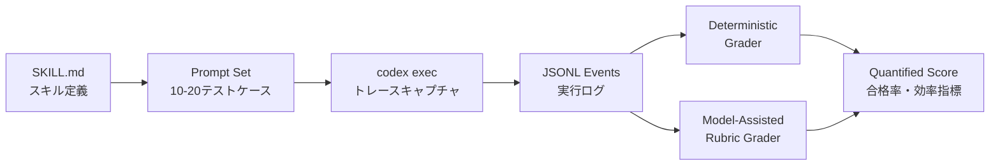
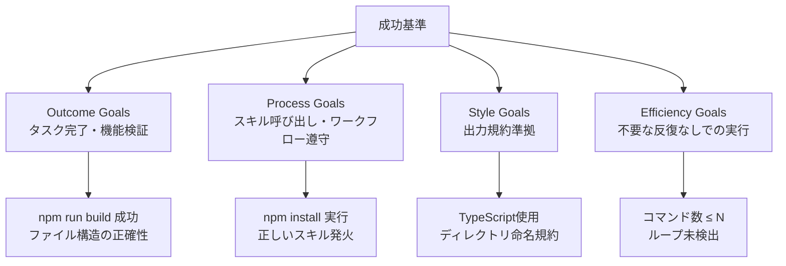

## ブログ概要（Summary）

本記事は [Testing Agent Skills Systematically with Evals](https://developers.openai.com/blog/eval-skills) の解説記事です。

OpenAI開発者ブログ「Testing Agent Skills Systematically with Evals」は、AIエージェントが備える個々の **スキル（skill）** を体系的にテストするためのフレームワークを提示している。従来のLLMテストが出力テキストの品質判定に偏っていたのに対し、本稿では **プロンプト設計 → 実行トレースのキャプチャ → 決定論的チェック → 定量スコアリング** という4段階のパイプラインを定義し、エージェントの振る舞いを再現可能かつ定量的に評価する手法を解説している。成功基準を **Outcome / Process / Style / Efficiency** の4カテゴリに分類し、各カテゴリに適したグレーディング戦略を示している点が特徴的である。

この記事は [Zenn記事: LangGraph v1.1ステートマシンのドメインモデリングとテスト駆動設計](https://zenn.dev/0h_n0/articles/751f2013ecfa32) の深掘りです。

---

## 情報源

- **種別**: 企業テックブログ（OpenAI Developers Blog）
- **URL**: [https://developers.openai.com/blog/eval-skills](https://developers.openai.com/blog/eval-skills)
- **組織**: OpenAI
- **発表時期**: 2025年

---

## 技術的背景（Technical Background）

### なぜエージェントスキルの体系的テストが必要か

LLMベースのエージェントは、コード生成、ファイル操作、API呼び出しなど複数のスキルを組み合わせてタスクを遂行する。従来のLLM評価はモデル出力のテキスト品質を対象としていたが、エージェントの評価では **「正しいスキルが正しい順序で呼び出されたか」「不要な操作を行っていないか」「完了基準を満たしたか」** といった多次元の検証が求められる。

単純な文字列一致や人手評価では、以下の問題が生じる。

1. **非決定性**: 同じプロンプトでもエージェントの行動シーケンスが毎回異なる
2. **観測困難性**: 中間ステップ（ツール呼び出し、ファイル書き込み）の正否を最終出力だけからは判定できない
3. **スケーラビリティ**: スキル数の増大に伴い、テストケースの組み合わせが指数的に増加する

### LangGraphノードテストとの関連性

Zenn記事「LangGraph v1.1ステートマシンのドメインモデリングとテスト駆動設計」では、ステートマシンの各ノードを単体テストし、遷移条件をプロパティベーステストで検証する手法を紹介した。OpenAIの本稿はこのアプローチと思想的に共通しており、**エージェントの振る舞いを分解可能な単位（スキル）に切り出し、各スキルに対して独立した評価基準を設ける** という設計原則を採用している。LangGraphがノード単位のテスト駆動開発を推奨するのに対し、OpenAIはスキル単位の「Eval駆動開発」を提案している。

---

## 実装アーキテクチャ（Architecture）

### 評価パイプラインの全体像

OpenAIチームが提示する評価フレームワークは、以下の4段階で構成される。



#### Stage 1: SKILL.md によるスキル定義

各スキルは YAML frontmatter と Markdown で記述される。OpenAIチームは `name` と `description` フィールドがスキル呼び出しのトリガーとなると述べている。

```yaml
---
name: setup-demo-app
description: >
  Create a demo React application with Tailwind CSS
  pre-configured for Responses API showcase
---

## Instructions

1. Initialize a new React project using Vite
2. Install and configure Tailwind CSS v4
3. Create a demo component showcasing the Responses API
4. Verify the app builds successfully with `npm run build`
```

スキル定義において重要なのは、**完了基準（completion criteria）** を指示内に明記することである。上記例では「`npm run build` が成功すること」が完了基準となる。

#### Stage 2: プロンプトセット設計

OpenAIチームは、10-20件のテストケースをCSV形式で管理することを推奨している。テストケースは以下の4種類に分類される。

| 種別 | should_trigger | 目的 | 例 |
|------|:---:|------|------|
| 明示的呼び出し | true | スキル名を直接指定 | "Create a demo app using $setup-demo-app skill" |
| 暗黙的呼び出し | true | スキル名なしで意図を伝達 | "Set up minimal React demo with Tailwind" |
| コンテキスト付き | true | 追加条件を含む呼び出し | "Create demo app for Responses API showcase" |
| ネガティブコントロール | false | 類似だが対象外のリクエスト | "Add Tailwind to existing React app" |

```csv
id,should_trigger,prompt
test-01,true,"Create a demo app using $setup-demo-app skill"
test-02,true,"Set up minimal React demo with Tailwind"
test-03,true,"Create demo app for Responses API showcase"
test-04,false,"Add Tailwind to existing React app"
```

ネガティブコントロールの設計は、スキルの **境界条件** を明確にするために不可欠である。上記の `test-04` は「既存アプリへの追加」であり、「新規アプリの作成」スキルが発火すべきではないケースを表している。

#### Stage 3: 実行トレースのキャプチャ

`codex exec --json --full-auto` を使用してエージェントを実行し、JSONLイベントストリームを取得する。このトレースには以下のシグナルが含まれる。

- **command_execution**: 実行されたコマンドとその結果
- **usage metrics**: 入力トークン数・出力トークン数
- **file system changes**: ファイルの作成・変更・削除
- **exit codes**: 各コマンドの終了コード

#### Stage 4: グレーディング

グレーディングは **決定論的グレーダー** と **モデル支援ルーブリックグレーダー** の2種類を組み合わせる（詳細は次節）。

---

### 成功基準の4カテゴリ

OpenAIチームは、エージェントの評価基準を以下の4カテゴリに分類している。



1. **Outcome Goals**: タスクが最終的に完了したか。ビルド成功、テスト通過、期待されるファイル生成など
2. **Process Goals**: 正しいスキルが呼び出されたか、必要なステップが実行されたか
3. **Style Goals**: コーディング規約、ディレクトリ構成、命名規則に準拠しているか
4. **Efficiency Goals**: 不要な反復やループなしにタスクを完了できたか

---

## パフォーマンス最適化: 決定論的グレーダー vs モデルベースグレーダー

### 決定論的グレーダー

JSONLイベントストリームを直接パースし、特定のイベントの存在・不存在を検証する。OpenAIチームは以下のような関数ベースのチェックを推奨している。

```javascript
/**
 * JSONLイベントから npm install の実行有無を判定する。
 * @param {Array<Object>} events - JSONLイベント配列
 * @returns {boolean} npm install が実行されたか
 */
function checkRanNpmInstall(events) {
  return events.some(
    (e) =>
      (e.type === "item.started" || e.type === "item.completed") &&
      e.item?.type === "command_execution" &&
      e.item.command?.includes("npm install")
  );
}

/**
 * 無限ループ検出: 同一コマンドの連続実行を検知する。
 * @param {Array<Object>} events - JSONLイベント配列
 * @param {number} threshold - 連続実行の閾値（デフォルト: 3）
 * @returns {boolean} ループが検出されたか
 */
function detectCommandLoop(events, threshold = 3) {
  const commands = events
    .filter(
      (e) =>
        e.type === "item.completed" &&
        e.item?.type === "command_execution"
    )
    .map((e) => e.item.command);

  for (let i = 0; i <= commands.length - threshold; i++) {
    const window = commands.slice(i, i + threshold);
    if (window.every((cmd) => cmd === window[0])) {
      return true;
    }
  }
  return false;
}
```

決定論的グレーダーの利点は、**実行コストゼロ**、**再現性100%**、**レイテンシがミリ秒単位** である点にある。Process Goals と Efficiency Goals の評価に適している。

### モデル支援ルーブリックグレーダー

コード品質、ドキュメントの適切さ、アーキテクチャ設計の妥当性など、ルールベースでは判定困難な基準にはモデルを使用する。OpenAIチームは、JSON Schema で応答形式を強制することで評価結果の構造化を実現している。

```json
{
  "type": "object",
  "properties": {
    "overall_pass": { "type": "boolean" },
    "score": {
      "type": "integer",
      "minimum": 0,
      "maximum": 100
    },
    "checks": {
      "type": "array",
      "items": {
        "type": "object",
        "properties": {
          "id": { "type": "string" },
          "pass": { "type": "boolean" },
          "notes": { "type": "string" }
        },
        "required": ["id", "pass", "notes"]
      }
    }
  },
  "required": ["overall_pass", "score", "checks"]
}
```

以下に Python による実装例を示す。

```python
from typing import Any
from dataclasses import dataclass


@dataclass(frozen=True)
class CheckResult:
    """個別チェック項目の結果。"""

    id: str
    passed: bool
    notes: str


@dataclass(frozen=True)
class RubricScore:
    """ルーブリック評価の総合結果。"""

    overall_pass: bool
    score: int  # 0-100
    checks: list[CheckResult]


def parse_rubric_response(response: dict[str, Any]) -> RubricScore:
    """モデルの構造化応答をRubricScoreに変換する。

    Args:
        response: JSON Schemaに準拠したモデル応答

    Returns:
        RubricScore: パース済みの評価結果

    Raises:
        KeyError: 必須フィールドが欠落している場合
        ValueError: スコアが0-100の範囲外の場合
    """
    score = response["score"]
    if not 0 <= score <= 100:
        raise ValueError(
            f"Score must be between 0 and 100, got {score}"
        )
    checks = [
        CheckResult(
            id=c["id"],
            passed=c["pass"],
            notes=c["notes"],
        )
        for c in response["checks"]
    ]
    return RubricScore(
        overall_pass=response["overall_pass"],
        score=score,
        checks=checks,
    )
```

### 使い分けの指針

OpenAIチームは、以下の使い分けを推奨している。

| 評価カテゴリ | 推奨グレーダー | 理由 |
|-------------|-------------|------|
| Outcome Goals | 決定論的 + モデル支援 | ビルド成功は決定論的、コード品質はモデル支援 |
| Process Goals | 決定論的 | コマンド実行の有無は確定的に判定可能 |
| Style Goals | モデル支援 | 規約準拠の判定にはコンテキスト理解が必要 |
| Efficiency Goals | 決定論的 | コマンド数・ループ検出は定量的に測定可能 |

---

## 拡張評価ディメンション

OpenAIチームは、基本の4カテゴリに加えて以下の拡張指標を提案している。

### トークン予算の管理

エージェントのコスト効率を測定するため、`input_tokens` と `output_tokens` の追跡が必要である。

```python
from dataclasses import dataclass


@dataclass(frozen=True)
class TokenBudget:
    """トークン使用量の予算管理。"""

    max_input_tokens: int
    max_output_tokens: int


def check_token_budget(
    events: list[dict],
    budget: TokenBudget,
) -> tuple[bool, dict[str, int]]:
    """トークン使用量が予算内か検証する。

    Args:
        events: JSONLイベント配列
        budget: トークン予算の上限値

    Returns:
        (予算内か, 実績値の辞書)
    """
    total_input = sum(
        e.get("usage", {}).get("input_tokens", 0)
        for e in events
        if e.get("type") == "item.completed"
    )
    total_output = sum(
        e.get("usage", {}).get("output_tokens", 0)
        for e in events
        if e.get("type") == "item.completed"
    )
    within_budget = (
        total_input <= budget.max_input_tokens
        and total_output <= budget.max_output_tokens
    )
    return within_budget, {
        "input_tokens": total_input,
        "output_tokens": total_output,
    }
```

### リポジトリ衛生チェック

エージェントがリポジトリを汚染していないかを `git status --porcelain` で検証する。未追跡ファイルや意図しない変更がないことを確認する。

### 権限検証

エージェントが最小権限の原則に従って実行されたかを検証する。`--full-auto` モードであっても、不要なファイルアクセスやネットワーク通信が発生していないことを確認する。

---

## 運用での学び（Production Lessons）

### 回帰テスト化パターン

OpenAIチームは、本番環境で発生した障害をテストケースに変換する「手動修正 → テストケース化」パターンを推奨している。具体的には以下のフローで運用する。

1. **障害検出**: 本番環境でスキルの誤動作を検出
2. **根本原因分析**: トレースログからJSONLイベントを分析
3. **テストケース追加**: 障害を再現するプロンプトをCSVに追加（`should_trigger` を適切に設定）
4. **グレーダー追加**: 障害パターンを検出する決定論的チェック関数を実装
5. **スキル修正**: SKILL.md の指示を修正し、テストが通ることを確認

このフローは、ソフトウェアエンジニアリングにおける **回帰テスト** の考え方と同一であり、TDD（テスト駆動開発）のRed-Green-Refactorサイクルに対応している。

### CI/CD統合

評価パイプラインをCI/CDに組み込むことで、スキル定義の変更がデグレーションを引き起こさないことを自動検証できる。OpenAIチームは以下のベストプラクティスを挙げている。

1. **スキル指示に明確な完了基準を設定する**: 曖昧な完了条件はテストの偽陽性・偽陰性を招く
2. **JSONLトレースで決定論的コマンドレベルチェックを行う**: モデル依存の評価を最小限に抑え、再現性を確保する
3. **ルール不足箇所にモデル支援ルーブリックを追加する**: 決定論的チェックでカバーできない品質基準を補完する
4. **実際の本番失敗からカバレッジを拡大する**: 想定外のケースを組織的に蓄積する
5. **手動修正をテストケース化する**: 修正のたびに回帰防止テストを追加する

---

## 学術研究との関連（Academic Connection）

エージェント評価の体系化は、学術研究でも活発に議論されている。Anthropicの evals framework は、モデルの安全性と能力を多角的に評価する枠組みを提供しており、本稿のスキル評価フレームワークとは相補的な関係にある。Anthropicのフレームワークがモデルレベルの汎用的な能力評価に重点を置くのに対し、OpenAIの本稿はエージェントのスキルレベルの実務的な品質保証に焦点を当てている。AgentBench（Liu et al., 2023）のようなマルチタスクベンチマークが「何ができるか」を測定するのに対し、本稿のフレームワークは「どのように実行したか」のプロセス品質まで評価対象に含めている点が差別化要因である。

---

## Production Deployment Guide

本セクションでは、OpenAIが提示するエージェントスキル評価パイプラインをAWS上に構築する際の実装パターンを解説する。エージェント実行 → トレース収集 → グレーディング → スコア集計の一連のフローをAWSマネージドサービスで実現する。

コスト試算は2026年4月時点のap-northeast-1（東京リージョン）料金に基づく概算値であり、実際のコストはトラフィックパターンや使用量により変動する。最新料金はAWS料金計算ツール（AWS Pricing Calculator）で確認することを推奨する。

### AWS実装パターン（コスト最適化重視）

#### Small構成（~100 eval/日）: Lambda + Bedrock + DynamoDB

| サービス | 用途 | 月額概算 |
|---------|------|---------|
| Lambda | エージェント実行・グレーディング | $5-15 |
| Amazon Bedrock | モデル支援ルーブリック評価 | $30-80 |
| DynamoDB | テストケース・スコア保存 | $5-10 |
| S3 | JSONLトレース保存 | $1-3 |
| CloudWatch | ログ・メトリクス | $5-10 |
| **合計** | | **$46-118** |

評価頻度が低い場合、Lambda のオンデマンド実行とDynamoDBのオンデマンドキャパシティモードにより、アイドル時のコストをゼロに抑えられる。

#### Medium構成（~1,000 eval/日）: ECS Fargate + Step Functions

| サービス | 用途 | 月額概算 |
|---------|------|---------|
| ECS Fargate | エージェント実行（並列） | $80-200 |
| Step Functions | 評価パイプラインオーケストレーション | $10-25 |
| Amazon Bedrock | モデル支援ルーブリック（Batch API） | $150-400 |
| DynamoDB | テストケース・スコア保存 | $20-50 |
| S3 | JSONLトレース保存 | $5-15 |
| CloudWatch + X-Ray | 監視・トレーシング | $15-30 |
| **合計** | | **$280-720** |

Step Functionsによるワークフロー管理で、決定論的グレーダーとモデル支援グレーダーを並列実行し、全チェック完了後にスコアを集計する。Bedrock Batch APIの使用で通常APIの約50%のコスト削減が可能である。

#### Large構成（10,000+ eval/日）: EKS + Karpenter + Spot

| サービス | 用途 | 月額概算 |
|---------|------|---------|
| EKS | コンテナオーケストレーション | $73（コントロールプレーン） |
| EC2 Spot | ワーカーノード（Karpenter管理） | $400-1,200 |
| Amazon Bedrock | モデル支援ルーブリック（Batch API） | $800-2,500 |
| ElastiCache (Redis) | スコアキャッシュ・重複排除 | $50-100 |
| DynamoDB | テストケース・スコア保存 | $50-150 |
| S3 + Glacier | トレース長期保存 | $20-50 |
| CloudWatch + X-Ray | 監視・トレーシング | $30-60 |
| **合計** | | **$1,423-4,133** |

Karpenterの Spot 優先 Provisioner により、ワーカーノードのコストを最大70%削減できる。GPU インスタンス（g5.xlarge）をモデル支援グレーダーに使用する場合は Spot 価格の変動に注意が必要である。

### Terraformインフラコード

#### Small構成（Serverless）

```hcl
# --- Small構成: Lambda + Bedrock + DynamoDB ---
# エージェントスキル評価パイプライン

terraform {
  required_version = ">= 1.9"
  required_providers {
    aws = {
      source  = "hashicorp/aws"
      version = "~> 5.70"
    }
  }
}

provider "aws" {
  region = "ap-northeast-1"
}

# === DynamoDB: テストケース・評価結果保存 ===
resource "aws_dynamodb_table" "eval_results" {
  name         = "agent-eval-results"
  billing_mode = "PAY_PER_REQUEST"
  hash_key     = "eval_id"
  range_key    = "skill_name"

  attribute {
    name = "eval_id"
    type = "S"
  }

  attribute {
    name = "skill_name"
    type = "S"
  }

  ttl {
    attribute_name = "expires_at"
    enabled        = true
  }

  point_in_time_recovery {
    enabled = true
  }

  tags = {
    Project = "agent-eval"
    Env     = "production"
  }
}

# === S3: JSONLトレース保存 ===
resource "aws_s3_bucket" "eval_traces" {
  bucket = "agent-eval-traces-${data.aws_caller_identity.current.account_id}"

  tags = {
    Project = "agent-eval"
  }
}

resource "aws_s3_bucket_lifecycle_configuration" "eval_traces_lifecycle" {
  bucket = aws_s3_bucket.eval_traces.id

  rule {
    id     = "archive-old-traces"
    status = "Enabled"

    transition {
      days          = 30
      storage_class = "GLACIER"
    }

    expiration {
      days = 365
    }
  }
}

resource "aws_s3_bucket_server_side_encryption_configuration" "eval_traces_sse" {
  bucket = aws_s3_bucket.eval_traces.id

  rule {
    apply_server_side_encryption_by_default {
      sse_algorithm = "aws:kms"
    }
  }
}

resource "aws_s3_bucket_public_access_block" "eval_traces_block" {
  bucket = aws_s3_bucket.eval_traces.id

  block_public_acls       = true
  block_public_policy     = true
  ignore_public_acls      = true
  restrict_public_buckets = true
}

# === IAMロール: Lambda実行用（最小権限） ===
resource "aws_iam_role" "eval_lambda_role" {
  name = "agent-eval-lambda-role"

  assume_role_policy = jsonencode({
    Version = "2012-10-17"
    Statement = [{
      Action = "sts:AssumeRole"
      Effect = "Allow"
      Principal = {
        Service = "lambda.amazonaws.com"
      }
    }]
  })
}

resource "aws_iam_role_policy" "eval_lambda_policy" {
  name = "agent-eval-lambda-policy"
  role = aws_iam_role.eval_lambda_role.id

  policy = jsonencode({
    Version = "2012-10-17"
    Statement = [
      {
        Effect = "Allow"
        Action = [
          "dynamodb:PutItem",
          "dynamodb:GetItem",
          "dynamodb:Query"
        ]
        Resource = aws_dynamodb_table.eval_results.arn
      },
      {
        Effect = "Allow"
        Action = [
          "s3:PutObject",
          "s3:GetObject"
        ]
        Resource = "${aws_s3_bucket.eval_traces.arn}/*"
      },
      {
        Effect = "Allow"
        Action = [
          "bedrock:InvokeModel"
        ]
        Resource = "arn:aws:bedrock:ap-northeast-1::foundation-model/*"
      },
      {
        Effect = "Allow"
        Action = [
          "logs:CreateLogGroup",
          "logs:CreateLogStream",
          "logs:PutLogEvents"
        ]
        Resource = "arn:aws:logs:ap-northeast-1:*:*"
      }
    ]
  })
}

# === Lambda: 決定論的グレーダー ===
resource "aws_lambda_function" "deterministic_grader" {
  function_name = "agent-eval-deterministic-grader"
  runtime       = "python3.12"
  handler       = "grader.handler"
  role          = aws_iam_role.eval_lambda_role.arn
  timeout       = 300
  memory_size   = 512

  filename         = "lambda/deterministic_grader.zip"
  source_code_hash = filebase64sha256("lambda/deterministic_grader.zip")

  environment {
    variables = {
      DYNAMODB_TABLE = aws_dynamodb_table.eval_results.name
      S3_BUCKET      = aws_s3_bucket.eval_traces.id
    }
  }

  tracing_config {
    mode = "Active"
  }

  tags = {
    Project = "agent-eval"
  }
}

# === Lambda: モデル支援ルーブリックグレーダー ===
resource "aws_lambda_function" "rubric_grader" {
  function_name = "agent-eval-rubric-grader"
  runtime       = "python3.12"
  handler       = "rubric_grader.handler"
  role          = aws_iam_role.eval_lambda_role.arn
  timeout       = 900
  memory_size   = 1024

  filename         = "lambda/rubric_grader.zip"
  source_code_hash = filebase64sha256("lambda/rubric_grader.zip")

  environment {
    variables = {
      DYNAMODB_TABLE = aws_dynamodb_table.eval_results.name
      S3_BUCKET      = aws_s3_bucket.eval_traces.id
      BEDROCK_MODEL  = "anthropic.claude-sonnet-4-20250514"
    }
  }

  tracing_config {
    mode = "Active"
  }

  tags = {
    Project = "agent-eval"
  }
}

# === CloudWatch アラーム ===
resource "aws_cloudwatch_metric_alarm" "grader_errors" {
  alarm_name          = "agent-eval-grader-errors"
  comparison_operator = "GreaterThanThreshold"
  evaluation_periods  = 2
  metric_name         = "Errors"
  namespace           = "AWS/Lambda"
  period              = 300
  statistic           = "Sum"
  threshold           = 5
  alarm_description   = "Grader Lambda error rate exceeds threshold"

  dimensions = {
    FunctionName = aws_lambda_function.deterministic_grader.function_name
  }
}

data "aws_caller_identity" "current" {}

output "dynamodb_table_name" {
  value = aws_dynamodb_table.eval_results.name
}

output "s3_bucket_name" {
  value = aws_s3_bucket.eval_traces.id
}
```

#### Large構成（Container）: EKS + Karpenter + Spot

```hcl
# --- Large構成: EKS + Karpenter + Spot ---
# 大規模エージェント評価パイプライン

terraform {
  required_version = ">= 1.9"
  required_providers {
    aws = {
      source  = "hashicorp/aws"
      version = "~> 5.70"
    }
    helm = {
      source  = "hashicorp/helm"
      version = "~> 2.16"
    }
    kubectl = {
      source  = "alekc/kubectl"
      version = "~> 2.1"
    }
  }
}

provider "aws" {
  region = "ap-northeast-1"
}

# === EKSクラスタ ===
module "eks" {
  source  = "terraform-aws-modules/eks/aws"
  version = "~> 20.31"

  cluster_name    = "agent-eval-cluster"
  cluster_version = "1.31"

  vpc_id     = module.vpc.vpc_id
  subnet_ids = module.vpc.private_subnets

  cluster_endpoint_public_access = true

  eks_managed_node_groups = {
    system = {
      instance_types = ["m7i.large"]
      min_size       = 2
      max_size       = 3
      desired_size   = 2

      labels = {
        role = "system"
      }
    }
  }

  tags = {
    Project = "agent-eval"
    Env     = "production"
  }
}

# === VPC ===
module "vpc" {
  source  = "terraform-aws-modules/vpc/aws"
  version = "~> 5.16"

  name = "agent-eval-vpc"
  cidr = "10.0.0.0/16"

  azs             = ["ap-northeast-1a", "ap-northeast-1c", "ap-northeast-1d"]
  private_subnets = ["10.0.1.0/24", "10.0.2.0/24", "10.0.3.0/24"]
  public_subnets  = ["10.0.101.0/24", "10.0.102.0/24", "10.0.103.0/24"]

  enable_nat_gateway = true
  single_nat_gateway = false

  tags = {
    Project = "agent-eval"
  }
}

# === Karpenter Provisioner（Spot優先） ===
resource "kubectl_manifest" "karpenter_node_pool" {
  yaml_body = yamlencode({
    apiVersion = "karpenter.sh/v1"
    kind       = "NodePool"
    metadata = {
      name = "eval-workers"
    }
    spec = {
      template = {
        spec = {
          requirements = [
            {
              key      = "karpenter.sh/capacity-type"
              operator = "In"
              values   = ["spot", "on-demand"]
            },
            {
              key      = "node.kubernetes.io/instance-type"
              operator = "In"
              values   = ["m7i.xlarge", "m7i.2xlarge", "c7i.xlarge", "c7i.2xlarge"]
            }
          ]
          nodeClassRef = {
            group = "karpenter.k8s.aws"
            kind  = "EC2NodeClass"
            name  = "default"
          }
        }
      }
      limits = {
        cpu    = "128"
        memory = "512Gi"
      }
      disruption = {
        consolidationPolicy = "WhenEmptyOrUnderutilized"
        consolidateAfter    = "30s"
      }
    }
  })

  depends_on = [module.eks]
}

# === Secrets Manager: API キー管理 ===
resource "aws_secretsmanager_secret" "eval_api_keys" {
  name                    = "agent-eval/api-keys"
  recovery_window_in_days = 7

  tags = {
    Project = "agent-eval"
  }
}

# === Cost Explorer アラート ===
resource "aws_budgets_budget" "eval_budget" {
  name         = "agent-eval-monthly"
  budget_type  = "COST"
  limit_amount = "5000"
  limit_unit   = "USD"
  time_unit    = "MONTHLY"

  notification {
    comparison_operator       = "GREATER_THAN"
    threshold                 = 80
    threshold_type            = "PERCENTAGE"
    notification_type         = "ACTUAL"
    subscriber_email_addresses = ["ops-team@example.com"]
  }

  notification {
    comparison_operator       = "GREATER_THAN"
    threshold                 = 100
    threshold_type            = "PERCENTAGE"
    notification_type         = "FORECASTED"
    subscriber_email_addresses = ["ops-team@example.com"]
  }
}
```

### 運用・監視設定

#### CloudWatch Logs Insights クエリ

```sql
-- 評価パイプラインのレイテンシ分析
fields @timestamp, skill_name, grader_type, duration_ms, score
| filter grader_type IN ["deterministic", "rubric"]
| stats avg(duration_ms) as avg_latency,
        p99(duration_ms) as p99_latency,
        avg(score) as avg_score
  by skill_name, grader_type
| sort avg_latency desc

-- コスト異常検知: トークン使用量の急増
fields @timestamp, skill_name, input_tokens, output_tokens
| stats sum(input_tokens) as total_input,
        sum(output_tokens) as total_output
  by bin(1h) as time_bucket
| filter total_input > 1000000
| sort time_bucket desc
```

#### CloudWatch アラーム設定

- **Bedrockトークン使用量**: 1時間あたりの `InvocationModelTokenCount` が閾値を超過した場合にSNS通知
- **Lambda実行時間**: p99レイテンシが900秒（タイムアウト上限）の80%を超過した場合にアラート
- **DynamoDB読み取り容量**: Throttled リクエストが発生した場合のオートスケーリングトリガー

#### X-Ray トレーシング設定

```python
import boto3
from aws_xray_sdk.core import xray_recorder, patch_all


# boto3の自動計装
patch_all()


@xray_recorder.capture("run_deterministic_grader")
def run_deterministic_grader(
    events: list[dict],
    skill_name: str,
) -> dict:
    """決定論的グレーダーの実行とX-Rayトレース記録。

    Args:
        events: JSONLイベント配列
        skill_name: 評価対象のスキル名

    Returns:
        グレーディング結果の辞書
    """
    subsegment = xray_recorder.current_subsegment()
    if subsegment:
        subsegment.put_annotation("skill_name", skill_name)
        subsegment.put_metadata(
            "event_count", len(events), "eval"
        )

    # グレーディングロジック
    results = {
        "npm_install_ran": check_ran_npm_install(events),
        "build_success": check_build_success(events),
        "no_loops": not detect_command_loop(events),
    }

    if subsegment:
        subsegment.put_annotation(
            "all_passed",
            all(results.values()),
        )

    return results


def check_ran_npm_install(events: list[dict]) -> bool:
    """npm install の実行有無を判定する。"""
    return any(
        e.get("item", {}).get("type") == "command_execution"
        and "npm install" in e.get("item", {}).get("command", "")
        for e in events
        if e.get("type") in ("item.started", "item.completed")
    )


def check_build_success(events: list[dict]) -> bool:
    """npm run build の成功を判定する。"""
    return any(
        e.get("item", {}).get("type") == "command_execution"
        and "npm run build" in e.get("item", {}).get("command", "")
        and e.get("item", {}).get("exit_code") == 0
        for e in events
        if e.get("type") == "item.completed"
    )


def detect_command_loop(
    events: list[dict],
    threshold: int = 3,
) -> bool:
    """同一コマンドの連続実行を検知する。"""
    commands = [
        e["item"]["command"]
        for e in events
        if e.get("type") == "item.completed"
        and e.get("item", {}).get("type") == "command_execution"
    ]
    for i in range(len(commands) - threshold + 1):
        window = commands[i : i + threshold]
        if len(set(window)) == 1:
            return True
    return False
```

#### Cost Explorer 自動レポート

日次のコストレポートをSNS経由で通知し、予算超過の早期検知を実現する。AWS Budgets と連携して、予測ベースのアラート（Forecasted 100%超過時）を設定することで、月末のコスト超過を未然に防止する。

### コスト最適化チェックリスト

#### アーキテクチャ選択

- [ ] トラフィック量でServerless/Hybrid/Containerを判断したか
- [ ] 評価頻度のピーク・オフピークパターンを分析したか
- [ ] マルチリージョン展開の必要性を評価したか
- [ ] データ転送コストを見積もりに含めたか

#### リソース最適化

- [ ] Spot Instancesを評価ワーカーに適用（最大70%削減）
- [ ] Reserved Instances / Savings Plansを長期利用サービスに検討
- [ ] Lambda メモリサイズを実測ベースで最適化（Power Tuning）
- [ ] DynamoDB オンデマンド vs プロビジョンドを評価頻度で選択
- [ ] ECS/EKS のオートスケーリング閾値を調整

#### LLMコスト削減

- [ ] Bedrock Batch API を非リアルタイム評価に使用（50%削減）
- [ ] Prompt Caching を有効化（同一スキルの反復評価で30-90%削減）
- [ ] モデル選択ロジック: 決定論的チェック → 軽量モデル → 高精度モデルの段階的適用
- [ ] 入力トークン削減: JSONLイベントのフィルタリング（不要なイベントの除外）
- [ ] 出力トークン制限: JSON Schema による応答構造化で冗長な出力を抑制

#### 監視・アラート

- [ ] AWS Budgets で月次予算アラートを設定
- [ ] CloudWatch カスタムメトリクスでトークン使用量を追跡
- [ ] Cost Anomaly Detection を有効化
- [ ] 日次コストレポートをSNS/Slack通知
- [ ] Bedrock のモデル別使用量ダッシュボードを作成

#### リソース管理

- [ ] 未使用のLambda関数・ECSタスク定義を定期削除
- [ ] S3 ライフサイクルポリシー: 30日でGlacier、365日で削除
- [ ] タグ戦略: Project / Env / Owner タグを全リソースに付与
- [ ] CloudFormation/Terraform による IaC 管理の徹底
- [ ] 開発環境の夜間・週末自動停止

---

## まとめと実践への示唆

OpenAIチームが提示した「Testing Agent Skills Systematically with Evals」は、エージェントのスキルを体系的にテストするための実践的なフレームワークである。決定論的グレーダーでプロセスと効率を検証し、モデル支援ルーブリックで品質とスタイルを補完するという二層構造は、テストの信頼性とカバレッジのバランスを取る上で有効な設計指針である。本フレームワークは、LangGraphのノードテストやAnthropicの evals framework と組み合わせることで、エージェントの品質保証をより包括的に実現できる。プロダクション環境でのエージェント運用において、障害を回帰テストに変換する文化の定着が、長期的な品質向上の鍵となる。

---

## 参考文献

- **OpenAI Developers Blog**: [Testing Agent Skills Systematically with Evals](https://developers.openai.com/blog/eval-skills)
- **Related Zenn article**: [LangGraph v1.1ステートマシンのドメインモデリングとテスト駆動設計](https://zenn.dev/0h_n0/articles/751f2013ecfa32)
- **AgentBench**: Liu, X., et al. (2023). "AgentBench: Evaluating LLMs as Agents." arXiv:2308.03688.
- **Anthropic Evals**: [Anthropic's approach to evaluating AI systems](https://www.anthropic.com/research)
- **AWS Well-Architected Framework**: [Cost Optimization Pillar](https://docs.aws.amazon.com/wellarchitected/latest/cost-optimization-pillar/)

---

> **注記**: 本記事はOpenAI開発者ブログの内容を解説・整理したものであり、筆者が独自に実験を行ったものではありません。技術的な詳細は原典を参照してください。AWS構成のコスト試算は2026年4月時点のap-northeast-1料金に基づく概算値です。
>
> **AI生成表記**: この記事はClaude（Anthropic）の支援を受けて作成されました。
