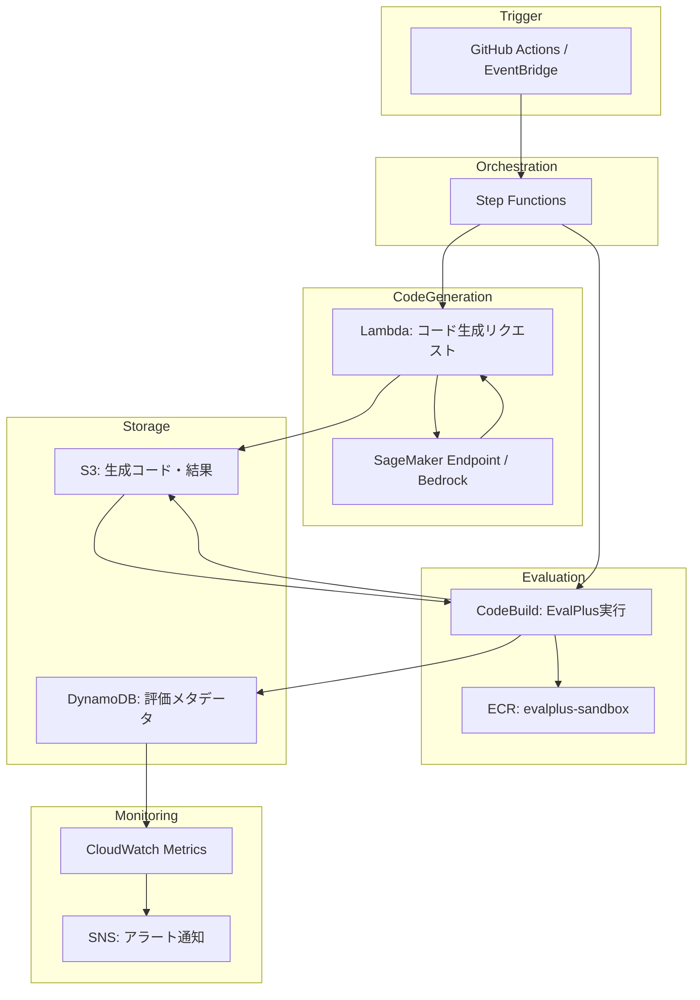

## 論文概要（Abstract）

大規模言語モデル（LLM）によるコード生成の性能評価において、既存ベンチマークのテストケース不足が深刻な問題であることを明らかにした論文である。著者らは、OpenAIが公開したHumanEval（164問のPythonプログラミング問題）に対し、LLMベースの生成と型認識ミューテーションを組み合わせた自動テスト入力生成により、テストケースを80倍に拡張したHumanEval+を構築した。26種のLLMを対象とした評価の結果、HumanEval+ではpass@kが最大19.3〜28.9%低下し、モデル間のランキングが逆転するケースも確認された。本研究はNeurIPS 2023に採択されている。

本記事は [https://arxiv.org/abs/2305.01210](https://arxiv.org/abs/2305.01210) の解説記事です。関連するZenn記事「[LLMベンチマーク完全ガイド 主要15指標の読み方と自宅で実行する方法](https://zenn.dev/0h_n0/articles/205a1900fbde2a)」もあわせて参照されたい。

## 情報源

| 項目 | 内容 |
|------|------|
| arXiv ID | [2305.01210](https://arxiv.org/abs/2305.01210) |
| タイトル | Is Your Code Generated by ChatGPT Really Correct? Rigorous Evaluation of Large Language Models for Code Generation |
| 著者 | Jiawei Liu, Chunqiu Steven Xia, Yuyao Wang, Lingming Zhang |
| 所属 | University of Illinois Urbana-Champaign, Nanjing University |
| 発表年 | 2023年（NeurIPS 2023採択） |
| 分野 | Software Engineering (cs.SE), Computation and Language (cs.CL), Machine Learning (cs.LG) |
| GitHub | [evalplus/evalplus](https://github.com/evalplus/evalplus) |

## 背景と動機

LLMによるコード生成の性能評価には、HumanEval（OpenAI, 2021）やMBPP（Google, 2021）といったベンチマークが広く用いられている。しかし、これらのベンチマークには根本的な問題がある。HumanEvalのテストケース数は1問あたり平均わずか9.6件であり、中央値は7件にとどまる。

このテストケースの不足は**偽陽性**（false positive）を引き起こす。すなわち、実際には誤ったコードがベンチマーク上では「正解」と判定されてしまう。著者らはHumanEval問題#58（ソート済みの共通要素を返す関数）を例に挙げている。ChatGPTが生成したコードは中間リストをsetに変換しており、ソート順が保持されないという不具合を含んでいたが、元のHumanEvalのテストケースではこのバグを検出できなかった。

さらに深刻なのは、テスト不足がモデル間の**ランキングを歪める**点である。HumanEvalの限られたテストで評価すると、あるモデルが別のモデルより優れているように見えるが、十分なテストケースで評価すると順位が逆転するケースが存在する。著者らは、WizardCoder-CodeLlamaやPhind-CodeLlama（34B）がHumanEvalではChatGPTに劣るが、HumanEval+では上回ることを示している。

## 主要な貢献

本論文の貢献は以下の3点に整理できる。

**1. 自動テスト入力生成手法の提案**: LLMベースのシード生成と型認識ミューテーションを組み合わせ、1問あたり平均764.1件のテストケースを自動生成する手法を確立した。人手によるコントラクト（事前条件）の付与と差分テストにより、テストの正確性を担保している。

**2. HumanEval+データセットの構築**: HumanEvalの164問すべてについてテストケースを80倍に拡張した。さらに、テストスイートの削減手法（HumanEval+-mini）も提案しており、テスト数を47分の1に圧縮しつつ同等の識別能力を維持している。

**3. リーダーボードの運営**: [evalplus.github.io](https://evalplus.github.io/) にてモデルの評価結果を公開するリーダーボードを運営している。後にMBPP+（MBPPのテストケースを35倍に拡張）もリリースされ、コード生成モデルの標準的な評価基盤として広く採用されている。

## 技術的詳細

### テスト入力生成パイプライン

EvalPlusのテスト生成は2段階で構成される。


**LLMベースのシード生成**: ChatGPTにground-truth実装とサンプルテストケースを提示し、コーナーケースやエッジ条件を狙ったシード入力を約30件生成させる。

**型認識ミューテーション**: シード入力に対して、型に応じた構造化ミューテーションを適用する。

| 型 | ミューテーション操作 |
|------|------|
| `int` / `float` | $$x \pm 1$$ を返す |
| `bool` | ランダムな真偽値を返す |
| `str` | 部分文字列の削除・繰り返し、文字のミューテーション |
| `List` | 要素の削除・繰り返し、要素の挿入・置換（再帰的） |
| `Dict` | キー・値ペアの削除、値の更新、新規ペアの挿入 |
| `Tuple` / `Set` | Listに変換後ミューテーションし、元の型に再変換 |

この手法により、1時間の計算予算内で1問あたり1,000件の追加入力を生成する。

### プログラム入力コントラクト

164問中83問に対して、人手で事前条件（コントラクト）を付与している。例えば `assert n > 0` のようなアサーションで、無効な入力をフィルタリングする。これはプログラミング・バイ・コントラクトの考え方に基づいており、曖昧な問題仕様を明確化する役割も果たす。

### pass@kメトリクス

コード生成の評価には、Chen et al.（2021）が提案したpass@kの不偏推定量が用いられる。$$n$$個のサンプルを生成し、そのうち$$c$$個が全テストケースに通過した場合、$$k$$個のサンプルのうち少なくとも1つが正解である確率は以下で計算される。

$$
\text{pass@}k = 1 - \frac{\binom{n-c}{k}}{\binom{n}{k}}
$$

ここで各変数の定義は以下の通りである。

- $$n$$: 生成したコードサンプルの総数
- $$c$$: 全テストケースに通過した正解サンプル数（$$c \leq n$$）
- $$k$$: 選択するサンプル数（$$k \leq n$$）
- $$\binom{a}{b}$$: 二項係数（$$a$$個から$$b$$個を選ぶ組合せ数）

この推定量は非復元抽出に基づいており、ナイーブな推定量 $$1 - (1 - c/n)^k$$ と異なり不偏性が保証される。

### テスト品質の検証

生成されたテストの品質は以下の3つの観点から検証されている。

1. **コードカバレッジ**: ブランチカバレッジ基準による網羅性
2. **ミュータント殺傷**: ミューテーションテスティングによる欠陥検出能力
3. **LLMサンプル殺傷**: 実際のLLM生成コードに対する誤り検出能力

テストスイート削減（HumanEval+-mini）では、これら3つの基準を用いた貪欲な集合被覆アルゴリズムにより、平均764.1件から16.1件へと47倍に圧縮しつつ、同等の識別力を維持することに成功している（論文Table 4より）。

### Ground-Truthの品質問題

著者らは、HumanEvalのground-truth実装自体に**18件（全体の11%）の欠陥**を発見している。内訳は、未処理のエッジケース5件、ロジック誤り10件、パフォーマンス問題3件である。例えば問題#124（`validate_date`）では演算子の優先順位が誤っており、"12-31-1999"のような妥当な日付の検証に失敗していた（論文Section 4.1より）。

## 実装のポイント

EvalPlusはPyPIパッケージとして公開されており、CLIから簡便に利用できる。

### インストールと基本的な使い方

```python
# インストール（vLLMバックエンド付き）
# pip install --upgrade "evalplus[vllm] @ git+https://github.com/evalplus/evalplus"

from typing import Optional


def run_evalplus_evaluation(
    model_name: str,
    dataset: str = "humaneval",
    backend: str = "vllm",
    greedy: bool = True,
    tensor_parallel: Optional[int] = None,
) -> str:
    """EvalPlus評価のCLIコマンドを構築する。

    Args:
        model_name: HuggingFaceモデル名またはAPI名
        dataset: 評価データセット（"humaneval" or "mbpp"）
        backend: 推論バックエンド（"vllm", "hf", "openai"等）
        greedy: 貪欲デコーディングの使用有無
        tensor_parallel: テンソル並列数（vLLMバックエンド用）

    Returns:
        構築されたCLIコマンド文字列
    """
    cmd: str = f"evalplus.evaluate --model {model_name} --dataset {dataset} --backend {backend}"
    if greedy:
        cmd += " --greedy"
    if tensor_parallel is not None:
        cmd += f" --tp {tensor_parallel}"
    return cmd
```

### 評価の実行例

```bash
# Greedy decodingでpass@1★を計測
evalplus.evaluate --model "ise-uiuc/Magicoder-S-DS-6.7B" \
    --dataset humaneval \
    --backend vllm \
    --greedy

# Samplingでpass@1/10/100を計測（温度0.8、100サンプル）
evalplus.codegen --model "ise-uiuc/Magicoder-S-DS-6.7B" \
    --dataset humaneval \
    --backend vllm \
    --temperature 0.8 \
    --n-samples 100
```

### サンドボックス実行

セキュリティを考慮し、Dockerコンテナ内での実行も公式にサポートされている。

```bash
docker run --rm --pull=always \
    -v $(pwd)/evalplus_results:/app \
    ganler/evalplus:latest \
    evalplus.evaluate --dataset humaneval \
    --samples /app/humaneval/model_results.jsonl
```

## Production Deployment Guide

本セクションでは、EvalPlusを活用したコード生成評価パイプラインをAWS上に構築する方法を解説する。LLM生成コードのサンドボックス実行、自動評価、結果の集約をスケーラブルに行うアーキテクチャである。

**注意**: 以下の構成は本論文の内容ではなく、EvalPlusを実運用に適用するための筆者による設計提案である。

### アーキテクチャ概要



### トラフィック量別構成

| 規模 | 評価頻度 | コード生成 | 評価実行 | 月額概算 |
|------|---------|-----------|---------|---------|
| Small | 日次1モデル | Bedrock (Claude) | CodeBuild (arm64, small) | $50-100 |
| Medium | 日次5モデル | SageMaker (A10G) | CodeBuild (large) x 並列 | $500-1,000 |
| Large | CI/CDごと | SageMaker Multi-Model | ECS Fargate Spot | $2,000-5,000 |

### Terraformによるインフラ構築

以下にCodeBuild（サンドボックス実行）とS3（結果保存）の主要リソース定義を示す。

```hcl
# ECRリポジトリ: EvalPlusサンドボックスイメージ
resource "aws_ecr_repository" "evalplus_sandbox" {
  name                 = "evalplus-sandbox"
  image_tag_mutability = "IMMUTABLE"

  image_scanning_configuration {
    scan_on_push = true
  }
}

# CodeBuildプロジェクト: サンドボックド評価実行
resource "aws_codebuild_project" "evalplus_runner" {
  name          = "evalplus-evaluation-runner"
  description   = "EvalPlusによるコード生成評価をサンドボックス内で実行"
  build_timeout = 60
  service_role  = aws_iam_role.codebuild_role.arn

  artifacts {
    type     = "S3"
    location = aws_s3_bucket.eval_results.id
  }

  environment {
    compute_type                = "BUILD_GENERAL1_LARGE"
    image                       = "${aws_ecr_repository.evalplus_sandbox.repository_url}:latest"
    type                        = "LINUX_GPU_CONTAINER"
    privileged_mode             = false
    image_pull_credentials_type = "SERVICE_ROLE"
  }

  source {
    type      = "S3"
    location  = "${aws_s3_bucket.eval_results.id}/codegen_samples/"
    buildspec = "buildspec.yml"
  }
}

# S3バケット + ライフサイクル（30日でGlacier、365日で削除）
resource "aws_s3_bucket" "eval_results" {
  bucket = "evalplus-results-${data.aws_caller_identity.current.account_id}"
}

resource "aws_s3_bucket_lifecycle_configuration" "eval_results_lifecycle" {
  bucket = aws_s3_bucket.eval_results.id

  rule {
    id     = "archive-old-results"
    status = "Enabled"

    transition {
      days          = 30
      storage_class = "GLACIER"
    }

    expiration {
      days = 365
    }
  }
}

# DynamoDB: 評価メタデータ（キャッシュ兼用）
resource "aws_dynamodb_table" "eval_metadata" {
  name         = "evalplus-metadata"
  billing_mode = "PAY_PER_REQUEST"
  hash_key     = "model_id"
  range_key    = "eval_timestamp"

  attribute {
    name = "model_id"
    type = "S"
  }

  attribute {
    name = "eval_timestamp"
    type = "S"
  }
}
```

### Lambda関数: コード生成リクエスト

```python
"""Lambda handler: LLMにコード生成リクエストを送信しS3に保存する。"""

import json
import os
from typing import Any

import boto3


def handler(event: dict[str, Any], context: Any) -> dict[str, Any]:
    """コード生成リクエストを処理する。

    Args:
        event: Step Functionsからのイベント。
            model_id (str): 評価対象モデルID
            dataset (str): "humaneval" or "mbpp"
        context: Lambda実行コンテキスト

    Returns:
        生成結果のS3パスを含む辞書
    """
    model_id: str = event["model_id"]
    dataset: str = event.get("dataset", "humaneval")

    bedrock = boto3.client("bedrock-runtime")
    s3 = boto3.client("s3")
    bucket: str = os.environ["RESULTS_BUCKET"]

    response = bedrock.invoke_model(
        modelId=model_id,
        body=json.dumps({
            "prompt": "Generate Python code for the given task.",
            "max_tokens": 2048,
            "temperature": 0.0,
        }),
    )

    result_key: str = f"codegen_samples/{model_id}/{dataset}/samples.jsonl"
    s3.put_object(
        Bucket=bucket,
        Key=result_key,
        Body=response["body"].read(),
    )

    return {"status": "SUCCESS", "s3_path": f"s3://{bucket}/{result_key}"}
```

### 監視設定

CloudWatch Metricsにカスタムメトリクスを送信し、pass@1の閾値割れと評価実行時間の超過を監視する。

```python
"""CloudWatch監視設定ユーティリティ。"""

from typing import Any

import boto3


def create_pass_at_1_alarm(
    model_id: str,
    threshold: float = 0.5,
    sns_topic_arn: str = "",
) -> dict[str, Any]:
    """pass@1低下の監視アラームを作成する。

    Args:
        model_id: 監視対象モデルID
        threshold: pass@1の閾値（下回るとアラート）
        sns_topic_arn: 通知先SNSトピックARN

    Returns:
        作成されたアラーム情報
    """
    cloudwatch = boto3.client("cloudwatch")

    response = cloudwatch.put_metric_alarm(
        AlarmName=f"evalplus-{model_id}-pass-at-1-drop",
        MetricName="PassAt1",
        Namespace="EvalPlus/Evaluation",
        Statistic="Average",
        Period=86400,
        EvaluationPeriods=1,
        Threshold=threshold,
        ComparisonOperator="LessThanThreshold",
        Dimensions=[{"Name": "ModelId", "Value": model_id}],
        AlarmActions=[sns_topic_arn] if sns_topic_arn else [],
        AlarmDescription=f"{model_id}のpass@1が{threshold}を下回った",
    )
    return {"name": f"evalplus-{model_id}-pass-at-1-drop", "response": response}
```

### コスト最適化のポイント

1. **CodeBuild ARM64インスタンス**: x86比で約20%のコスト削減。GPU不要の評価フェーズではARM64 smallインスタンスが最適である。
2. **S3ライフサイクルポリシー**: 30日経過した評価結果をGlacierに移行し、365日後に自動削除する。
3. **Spot利用**: ECS FargateでのSpotインスタンス活用により、大規模評価のコンピュート費用を最大70%削減できる。ただし中断に備えたチェックポイント機能が必要。
4. **評価結果のキャッシュ**: DynamoDBに同一モデル・データセットの結果をキャッシュし、重複評価を防止する。

## 実験結果

### HumanEval vs HumanEval+の精度差

著者らは26種のLLMをHumanEvalとHumanEval+の両方で評価している。主要モデルのpass@1★（greedy decoding）の結果を以下に示す（論文Table 3より）。

| モデル | HumanEval pass@1★ | HumanEval+ pass@1★ | 低下率 |
|--------|-------------------|---------------------|--------|
| GPT-4 | 86.6% | 79.3% | -8.4% |
| ChatGPT | 72.6% | 65.9% | -9.2% |
| StarCoder-15B | 34.1% | 29.3% | -14.1% |
| CodeGen-16B | 32.9% | 26.8% | -18.5% |

pass@kが大きくなるほど低下幅も拡大する傾向が確認されている。pass@100ではモデルによって最大28.9%の低下が報告されている。

### ランキングの逆転

HumanEvalではChatGPTに劣っていたWizardCoder-CodeLlamaおよびPhind-CodeLlama（34B）が、HumanEval+ではChatGPTを上回るスコアを記録している。これはテストケースの不十分さがモデル選定の判断を誤らせる具体例である。

### 偽陽性の具体例

HumanEval問題#58（ソート済みの共通要素を返す関数）において、ChatGPTは中間リストを `set` に変換するコードを生成した。`set` は要素の順序を保証しないため、ソート済みという要件に反するが、元のHumanEvalのテストケースでは偶然正解と判定されていた。HumanEval+の拡張テストケースにより、この不具合が検出された。

## 実運用への応用

EvalPlusの知見は、以下のような実運用場面で活用できる。

**CI/CDパイプラインでのコード品質ゲート**: LLMを用いたコード生成（GitHub Copilot等）を開発プロセスに組み込む際、EvalPlusの手法に倣い、自動生成されたテストケースで品質を担保する仕組みを構築できる。単体テストの網羅性が不十分な場合、型認識ミューテーションによるテスト拡充が有効である。

**モデル選定の判断基準**: コード生成モデルの選定時には、HumanEvalの公称スコアだけでなく、HumanEval+やMBPP+でのスコアを確認すべきである。本論文が示す通り、テストケースが不十分な場合にはモデル間のランキングが逆転し得る。EvalPlusリーダーボード（evalplus.github.io）を参照することで、より信頼性の高い比較が可能となる。

**テストスイートの品質監査**: 既存のテストスイートがLLM生成コードの欠陥をどの程度検出できるかを評価する際、EvalPlusのテストスイート削減手法（集合被覆アルゴリズム）を応用できる。カバレッジ、ミュータント殺傷率、LLMサンプル殺傷率の3指標でテストの有効性を定量化する手法は汎用的に適用可能である。

## 関連研究

- **HumanEval**（Chen et al., 2021）: OpenAIがCodexの評価用に作成した164問のPythonプログラミングベンチマーク。EvalPlusの拡張元。
- **MBPP**（Austin et al., 2021）: Googleが作成した約1,000問のPythonベンチマーク。EvalPlusチームにより後にMBPP+として拡張された。
- **SWE-Bench**（Jimenez et al., 2024）: 実際のGitHubリポジトリのissue解決能力を評価するベンチマーク。関数単位のHumanEvalとは異なり、プロジェクト全体の理解を要する。
- **Aider Polyglot**（Gauthier, 2024）: 複数プログラミング言語にまたがるコード編集能力を評価するベンチマーク。Python限定のHumanEval+を補完する位置づけにある。

## まとめと今後の展望

EvalPlusは、コード生成ベンチマークにおけるテストケース不足という根本的な問題を定量的に示し、型認識ミューテーションとLLMベースの自動テスト生成を組み合わせた解決策を提案した。HumanEval+により、既存評価で見逃されていた多数の不正解コードが検出され、モデル間のランキングが変動することが明らかになった。

今後の展望として、著者らはPython以外の言語への拡張、形式検証（Dafny等）との統合、およびAIペアプログラミングツールへの適用を提案している。MBPP+のリリースにより対象ベンチマークは拡大しており、コード生成LLMの評価基盤としてEvalPlusの重要性は今後も高まるものと考えられる。

## 参考文献

1. Liu, J., Xia, C. S., Wang, Y., & Zhang, L. (2023). Is Your Code Generated by ChatGPT Really Correct? Rigorous Evaluation of Large Language Models for Code Generation. *NeurIPS 2023*. [arXiv:2305.01210](https://arxiv.org/abs/2305.01210)
2. Chen, M., et al. (2021). Evaluating Large Language Models Trained on Code. [arXiv:2107.03374](https://arxiv.org/abs/2107.03374)
3. Austin, J., et al. (2021). Program Synthesis with Large Language Models. [arXiv:2108.07732](https://arxiv.org/abs/2108.07732)
4. Jimenez, C. E., et al. (2024). SWE-bench: Can Language Models Resolve Real-World GitHub Issues? [arXiv:2310.06770](https://arxiv.org/abs/2310.06770)
5. EvalPlus GitHub Repository. [https://github.com/evalplus/evalplus](https://github.com/evalplus/evalplus)
6. EvalPlus Leaderboard. [https://evalplus.github.io/leaderboard.html](https://evalplus.github.io/leaderboard.html)
