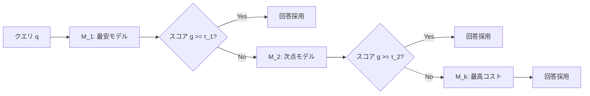

本記事は [arXiv:2305.05176 FrugalGPT: How to Use Large Language Models While Reducing Cost and Improving Performance](https://arxiv.org/abs/2305.05176) の解説記事です。

## 論文概要（Abstract）

FrugalGPTは、複数のLLMサービスを効率的に利用するための3つの戦略（プロンプト適応、LLM近似、LLMカスケード）を提案するフレームワークである。著者らの実験によると、GPT-4の性能を維持しながら最大98%のコスト削減、あるいは同一コストで最大4%の品質向上を達成できると報告されている。LLMルーティング分野の先駆的論文として広く引用されている。

この記事は [Zenn記事: Azure AI Foundry Model Routerで社内問い合わせBotのコストを50%削減する実装ガイド](https://zenn.dev/0h_n0/articles/3ec8fd39c09959) の深掘りです。Azure AI Foundry Model Routerの「プロンプト複雑度に応じたモデル選択」というアイデアの学術的源流を理解するうえで、FrugalGPTは必読の論文である。

## 情報源

- **arXiv ID**: 2305.05176
- **URL**: [https://arxiv.org/abs/2305.05176](https://arxiv.org/abs/2305.05176)
- **著者**: Lingjiao Chen, Matei Zaharia, James Zou（Stanford University）
- **発表年**: 2023年（TMLR 2024に採録）
- **分野**: cs.CL, cs.AI, cs.LG

## 背景と動機（Background & Motivation）

2023年時点で、LLM APIの価格はモデル間で300倍以上の開きがある。GPT-4のプロンプトコストが$0.06/1Kトークン、Adaが$0.0004/1Kトークンと大きな差があるにもかかわらず、多くのユーザーは単一モデルを使い続けている。

著者らは2つの最適化問題を設定している。

1. **コスト制約付き品質最大化**: 予算 $B$ 以内で平均品質スコアを最大化する
2. **品質制約付きコスト最小化**: 品質閾値 $T$ を満たしながら平均コストを最小化する

これらはAzure AI Foundry Model Routerの3つのルーティングモード（Balanced/Cost/Quality）の理論的根拠と対応する。Balancedモードは1と2のバランス、Costモードは2の最適化、Qualityモードは品質制約を緩めないアプローチに相当する。

## 主要な貢献（Key Contributions）

- **貢献1**: LLMコスト最適化の3つの独立戦略（プロンプト適応、LLM近似、LLMカスケード）の体系的な提案と分析
- **貢献2**: LLMカスケードの動的計画法による最適構成（使用モデルの部分集合、各モデルの閾値、実行順序）の学習アルゴリズム
- **貢献3**: 12種類のLLM APIを組み合わせた5つの実世界QAベンチマークでの定量評価

## 技術的詳細（Technical Details）

### 戦略1: プロンプト適応（Prompt Adaptation）

同一LLMを使いながら、プロンプトのトークン数を削減してコストを下げる戦略である。

- **プロンプト選択**: 複数のプロンプトテンプレート候補からタスクに最適なものを選択する。Few-shotの例示サンプル数・内容・順序を動的に変える
- **クエリ結合**: 複数の短いクエリをバッチにまとめてAPI呼び出し回数を削減する
- **圧縮**: 冗長な説明・空白・Few-shot例を削除・要約してトークン数を削減する

著者らの実験では、Few-shot例数を8から2に削減するだけで、品質をほぼ維持しながら30-50%のコスト削減が可能なケースが確認されている。

### 戦略2: LLM近似（LLM Approximation）

高コストLLMの呼び出しを低コスト代替で近似する戦略であり、2つのサブ手法がある。

#### Semantic Cache（意味的キャッシュ）

クエリ埋め込みベクトルの類似度で「意味的に同じ質問」を判定し、過去の回答を再利用する。

$$
\text{cache\_hit}(q_{\text{new}}) = \begin{cases} a_{\text{cached}} & \text{if } \max_{q_i \in \mathcal{C}} \text{sim}(q_{\text{new}}, q_i) > \tau \\ \text{miss} & \text{otherwise} \end{cases}
$$

ここで $\mathcal{C}$ はキャッシュ済みクエリ集合、$\tau$ は類似度閾値である。$\tau$ が低いほどキャッシュヒット率は上がるが、誤った回答を返すリスクも増加する。

社内問い合わせBotのようにFAQ的な質問が繰り返されるユースケースでは、Semantic Cacheの効果が大きい。Azure AI Foundry Model Routerのプロンプトキャッシュ機能と概念的に類似しているが、FrugalGPTのSemantic Cacheはクエリレベルでの意味的マッチングを行う点が異なる。

#### Model Fine-tuning

GPT-4等の高コストLLMの入出力ペアを教師データとして、小型のオープンソースLLMをファインチューニングする。特定タスク・ドメインで大モデルに近い品質を小モデルで達成することを目指す。

### 戦略3: LLMカスケード（LLM Cascade）

FrugalGPTの核心的な提案であり、最も詳細に分析されている戦略である。

#### カスケードの仕組み



1. コスト昇順に並べたLLMリスト $M = [M_1, M_2, \ldots, M_k]$ を定義する
2. クエリ $q$ に対し、最安の $M_1$ で回答を生成する
3. **スコアリング関数** $g(q, a)$ で回答品質を推定する
4. $g(q, a) \geq \tau_i$ なら採用して終了する（コスト = $\text{cost}(M_i)$）
5. $g(q, a) < \tau_i$ なら次の $M_{i+1}$ に進む
6. 最後の $M_k$ まで到達したらその結果を採用する

#### スコアリング関数 g(q, a)

回答品質を推定する関数であり、論文では以下の実装が提案されている。

- **ルーターモデル**: クエリ $q$ と回答 $a$ を入力として品質スコアを出力する小さな分類器。特徴量としてクエリのカテゴリ、回答の確信度（token-level log probability）、回答長などを使用する
- **LLMの自己評価**: $M_i$ 自身に「この回答に自信があるか？」を問わせ、Verbalized confidenceを使用する

#### 数学的定式化

カスケード全体の期待コスト:

$$
\mathbb{E}[\text{cost}] = \sum_{i=1}^{k} P(\text{stop at } M_i) \cdot \sum_{j=1}^{i} \text{cost}(M_j, q)
$$

停止確率:

$$
P(\text{stop at } M_i) = P(g(q, a_i) \geq \tau_i) \cdot \prod_{j=1}^{i-1} P(g(q, a_j) < \tau_j)
$$

#### 最適カスケード構成の学習

最適な $(M \text{のサブセット}, \tau_i, \text{実行順序})$ の組み合わせは、動的計画法とGreedy searchの組み合わせで求められる（論文Algorithm 1）。各ステップで最もコスト-品質改善に貢献するLLMを追加し、閾値は予算制約または品質制約に合わせて調整する。

### アルゴリズム

```python
from dataclasses import dataclass


@dataclass
class CascadeStep:
    """カスケードの各ステップ"""
    model_name: str
    cost_per_token: float
    threshold: float


@dataclass
class CascadeResult:
    """カスケード実行結果"""
    answer: str
    model_used: str
    total_cost: float
    steps_taken: int


def run_cascade(
    query: str,
    cascade: list[CascadeStep],
    call_model: callable,
    score_fn: callable,
) -> CascadeResult:
    """LLMカスケードを実行する。

    Args:
        query: ユーザークエリ
        cascade: カスケードステップのリスト（コスト昇順）
        call_model: LLM呼び出し関数 (model_name, query) -> answer
        score_fn: スコアリング関数 (query, answer) -> float

    Returns:
        カスケード実行結果
    """
    total_cost = 0.0

    for i, step in enumerate(cascade):
        answer = call_model(step.model_name, query)
        total_cost += step.cost_per_token * len(query + answer)

        score = score_fn(query, answer)
        if score >= step.threshold or i == len(cascade) - 1:
            return CascadeResult(
                answer=answer,
                model_used=step.model_name,
                total_cost=total_cost,
                steps_taken=i + 1,
            )

    raise RuntimeError("unreachable")
```

## 実装のポイント（Implementation）

FrugalGPTのカスケード方式を実装する際の注意点は以下の通りである。

- **スコアリング関数の品質**: カスケードの効果はスコアリング関数 $g(q, a)$ の精度に直接依存する。安価モデルの誤答を正確に検出できない場合、品質が低下する。GSM8K（算数推論）では安価モデルの精度自体が低いため、コスト削減幅が小さくなる
- **レイテンシの問題**: カスケードでは複数モデルを順番に呼び出す可能性があるため、最悪ケースのレイテンシが $k$ 倍に増加する。リアルタイム応答が求められる社内Botでは、カスケードの深さ $k$ を2-3に制限することが現実的である
- **価格変動への対応**: LLM APIの価格は頻繁に変更されるため、最適なカスケード構成を定期的に再最適化する必要がある

## 実験結果（Results）

著者らは12種類のLLM APIを組み合わせて評価を行っている（論文Table 2-3より）。

**GPT-4と同等品質でのコスト削減率**:

| データセット | コスト削減率 | 備考 |
|-------------|-------------|------|
| HellaSwag | 最大98% | 定型的な常識推論 |
| MMLU | 最大96% | 多肢選択QA |
| BoolQ | 最大96% | 真偽判定 |
| GSM8K | 50-70% | 算数推論（安価モデルの精度が低い） |

98%という数値はHellaSwagでの結果であり、このデータセットでは多くの質問がAda等の安価モデルで正解できるため、GPT-4の出番が極めて少ない。一方、GSM8KではGPT-4への依存度が高く削減幅が縮小する。

著者らはまた、同一コストでFrugalGPTが最大4%の品質向上を達成したことも報告している。これは複数モデルの応答から最良のものを選択できるカスケードの利点を示している。

**コスト-品質トレードオフの非線形性**: コストを半分にしても品質はほぼ変わらないケースが多い一方、最後の1-2%の品質向上には大きなコストがかかる。この知見はAzure AI Foundry Model RouterのCostモードとQualityモードの価格差を理解するうえでも有用である。

## 実運用への応用（Practical Applications）

FrugalGPTの3つの戦略は、社内問い合わせBotの文脈で以下のように応用できる。

- **プロンプト適応**: FAQデータベースの検索結果をシステムプロンプトに含めるRAGパイプラインでは、検索結果の件数やFew-shot例の数を動的に調整することで、品質を維持しながらトークンコストを削減できる
- **Semantic Cache**: 同一部署からの類似質問（例:「経費精算の締め日は？」「経費の申請期限は？」）に対してキャッシュを活用することで、LLM呼び出しを回避できる
- **LLMカスケード**: Azure AI Foundry Model Routerのようなマネージドサービスを使わない場合でも、自前でカスケードを構築できる。gpt-5-nano → gpt-5-mini → gpt-5のような階層で、スコアリング関数で品質を判定しながらカスケードを実行する

ただし、カスケード方式はAzure AI Foundry Model Routerのようなルーティング方式と比較して、レイテンシの面で不利になりうる。Model Routerは1回のルーティング判断で最適モデルを選択するのに対し、カスケードは複数モデルを逐次呼び出す可能性がある。

## 関連研究（Related Work）

- **RouteLLM**（Ong et al., 2024）: Chatbot Arenaの嗜好データからルーターを学習するフレームワーク。FrugalGPTのカスケード方式とは異なり、1回のルーティング判断で最適モデルを選択する「ルーティング方式」を採用している。レイテンシの面ではRouteLLMが有利だが、FrugalGPTはスコアリング関数により回答品質を実際に確認してから判断する点で安全性が高い
- **Hybrid LLM**（Ding et al., 2024）: 品質制約を明示的にモデル化したルーティング手法。FrugalGPTの品質制約付きコスト最小化問題と同様の定式化を、DeBERTaベースの分類器で実現している

## まとめと今後の展望

FrugalGPTは、LLMのコスト最適化における3つの独立戦略を体系的に提案し、特にLLMカスケードの有効性を実証した先駆的論文である。著者らの実験では最大98%のコスト削減が報告されているが、これはタスクの特性（質問の難易度分布）に大きく依存する。算数推論のような安価モデルの精度が低いタスクでは、削減幅は50-70%程度に留まる。

後続研究（RouteLLM、Hybrid LLM、BEST-Route等）や商用サービス（Azure AI Foundry Model Router、OpenRouter等）の多くがFrugalGPTの概念（カスケード、スコアリング関数、コスト-品質Pareto最適化）を基盤としており、LLMルーティング分野における重要な出発点となっている。

## 参考文献

- **arXiv**: [https://arxiv.org/abs/2305.05176](https://arxiv.org/abs/2305.05176)
- **Related Zenn article**: [https://zenn.dev/0h_n0/articles/3ec8fd39c09959](https://zenn.dev/0h_n0/articles/3ec8fd39c09959)
