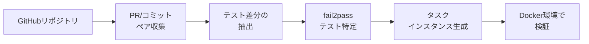

本記事は [SWE-bench: Can Language Models Resolve Real-World GitHub Issues?](https://arxiv.org/abs/2310.06770)（Jimenez et al., 2023; ICLR 2024 Oral）の解説記事です。

## 論文概要（Abstract）

SWE-benchは、GitHubの実リポジトリから収集した2,294件のイシュー・プルリクエストペアを用いて、言語モデルのソフトウェアエンジニアリング能力を評価するベンチマークである。従来のHumanEvalが合成的な単関数問題に限定されていたのに対し、SWE-benchは複数ファイルにまたがるバグ修正や機能追加といった実世界のタスクを要求する。著者らは12のPythonリポジトリから自動抽出したタスクに対し、Claude 2やGPT-4を含む複数のモデルを評価し、最良のモデルでも解決率が4.80%にとどまることを報告している。

この記事は [Zenn記事: SWE-Bench Proから自作評価まで LLMコーディングベンチマーク実践ガイド](https://zenn.dev/0h_n0/articles/e1722937bd269a) の深掘りです。

## 情報源

- **arXiv ID**: 2310.06770
- **URL**: [https://arxiv.org/abs/2310.06770](https://arxiv.org/abs/2310.06770)
- **著者**: Carlos E. Jimenez, John Yang, Alexander Wettig, Shunyu Yao, Kexin Pei, Ofir Press, Karthik Narasimhan（Princeton NLP Group）
- **発表年**: 2023年（ICLR 2024 Oral採択）
- **分野**: cs.SE, cs.CL, cs.LG
- **コード**: [princeton-nlp/SWE-bench](https://github.com/princeton-nlp/SWE-bench)（MIT License）

## 背景と動機（Background & Motivation）

2023年時点で、LLMのコーディング能力評価にはHumanEval（164問）やMBPP（約1,000問）が広く使われていた。しかし、これらのベンチマークには構造的な問題があった。

第一に、タスクが**自己完結的な単関数生成**に限定されていた。実際のソフトウェアエンジニアリングでは、既存コードベースの理解、複数ファイルの横断的な修正、既存テストとの整合性維持が求められる。HumanEvalの問題はこうした要素を一切含まない。

第二に、**データ汚染（data contamination）**の影響が深刻だった。HumanEvalの問題は公開後すぐにインターネット上に拡散し、モデルの学習データに含まれる可能性が指摘されていた。フロンティアモデルがHumanEvalで95%以上を記録する中、このスコアが真のコーディング能力を反映しているのか疑問視されていた。

著者らは「実世界のソフトウェアエンジニアリング課題を、再現可能かつスケーラブルに評価できるベンチマークが不在である」と問題提起し、SWE-benchを設計した。

## 主要な貢献（Key Contributions）

- **貢献1**: GitHubの実リポジトリから2,294件のタスクを自動抽出するパイプラインを構築し、人手アノテーションなしでスケーラブルなベンチマーク生成を実現した
- **貢献2**: コンテナ化された評価環境で、fail2pass（修正前に失敗していたテストがパスするか）とpass2pass（既存テストがリグレッションしないか）の2基準による自動評価を確立した
- **貢献3**: 12リポジトリ・2,294タスクの大規模評価により、当時のフロンティアモデルでも解決率が極めて低い（最大4.80%）ことを実証し、LLMの実務コーディング能力の限界を定量化した

## 技術的詳細（Technical Details）

### タスク抽出パイプライン

SWE-benchのタスクは、以下の手順でGitHubリポジトリから自動抽出される。



1. **PRの収集**: リポジトリの全マージ済みPRを収集する
2. **テスト差分の抽出**: PR内の変更のうち、テストファイルの差分を分離する
3. **fail2passテストの特定**: PR適用前に失敗し、適用後にパスするテストを自動検出する
4. **タスクインスタンスの生成**: 問題文（PR description + Issue body）、ベースコミット、テストパッチの三つ組を構成する

著者らが収集に使用した12リポジトリは以下の通りである（論文Table 1より）。

| リポジトリ | タスク数 | 分野 |
|:--|:--|:--|
| Django | 572 | Webフレームワーク |
| scikit-learn | 374 | 機械学習 |
| requests | 63 | HTTPクライアント |
| Flask | 17 | Webフレームワーク |
| matplotlib | 267 | データ可視化 |
| sympy | 456 | 数式処理 |
| pytest | 96 | テストフレームワーク |
| astropy | 90 | 天文学 |
| sphinx | 155 | ドキュメント生成 |
| xarray | 58 | 多次元配列 |
| pylint | 44 | 静的解析 |
| seaborn | 2 | 可視化 |

### 評価指標: %Resolved

SWE-benchの主要指標は**%Resolved**（解決率）である。タスク$i$に対してモデルが生成したパッチ$p_i$が以下の2条件を同時に満たす場合、そのタスクは「解決」と判定される。

$$
\text{Resolved}(i) = \mathbb{1}\left[\text{fail2pass}(p_i) \land \text{pass2pass}(p_i)\right]
$$

ここで、
- $\text{fail2pass}(p_i)$: パッチ適用前に失敗していた全テストが、適用後にパスする
- $\text{pass2pass}(p_i)$: パッチ適用前にパスしていた全テストが、適用後もパスし続ける（リグレッションなし）
- $\mathbb{1}[\cdot]$: 指示関数（条件が真なら1、偽なら0）

全体の解決率は以下で計算される。

$$
\text{\%Resolved} = \frac{1}{N}\sum_{i=1}^{N}\text{Resolved}(i) \times 100
$$

ここで$N$はタスク総数（2,294）である。

### コンテキスト検索戦略

モデルにリポジトリ全体を入力することはコンテキストウィンドウの制約上不可能であるため、著者らは問題文に関連するコードファイルを検索して入力する戦略を検討している。

- **Oracle検索**: 正解パッチが修正するファイルをそのまま提供する（上限性能の推定用）
- **BM25検索**: 問題文をクエリとしてBM25でリポジトリ内のファイルをランキングし、上位ファイルを提供する

### アルゴリズム: パッチ生成と評価

モデルへの入力と出力の流れは以下の通りである。

```python
def evaluate_swe_bench_task(
    model,
    issue_text: str,
    repo_snapshot: str,
    retrieval_strategy: str = "bm25",
    context_window: int = 16384,
) -> bool:
    """SWE-benchタスクの評価パイプライン

    Args:
        model: 評価対象のLLM
        issue_text: GitHubイシューの本文
        repo_snapshot: ベースコミット時点のリポジトリ
        retrieval_strategy: コード検索戦略（"oracle" or "bm25"）
        context_window: モデルのコンテキストウィンドウサイズ

    Returns:
        タスクが解決されたかどうか
    """
    if retrieval_strategy == "oracle":
        relevant_files = get_gold_patch_files(repo_snapshot)
    else:
        relevant_files = bm25_retrieve(
            query=issue_text,
            corpus=repo_snapshot,
            top_k=context_window // AVG_TOKENS_PER_FILE,
        )

    prompt = format_prompt(issue_text, relevant_files)
    patch = model.generate(prompt)

    fail2pass = run_tests(repo_snapshot, patch, test_type="fail2pass")
    pass2pass = run_tests(repo_snapshot, patch, test_type="pass2pass")

    return fail2pass and pass2pass
```

評価はDockerコンテナ内で実行され、各タスクのリポジトリ環境（依存関係、Pythonバージョン）が再現される。

## 実装のポイント（Implementation）

SWE-benchを実行する際の技術的な注意点を述べる。

**環境構築**: 各リポジトリのタスクは特定のコミットに紐づいており、そのコミット時点の依存関係を再現する必要がある。著者らはDockerイメージを事前構築し、`conda`環境で依存関係を固定している。

**パッチ形式**: モデルはunified diff形式（`diff -u`の出力形式）でパッチを生成する必要がある。形式が不正な場合、`git apply`が失敗しタスクは不正解となる。

**テスト実行の分離**: fail2passテストとpass2passテストは別プロセスで実行され、タイムアウト（デフォルト300秒）が設定されている。無限ループを生成するパッチへの対策である。

**リポジトリサイズの影響**: Djangoのような大規模リポジトリ（数十万行）では、BM25検索のノイズが大きくなり、関連ファイルの特定が困難になる。著者らは「リポジトリの規模とタスク難易度には正の相関がある」と報告している（論文Section 5.2より）。

## Production Deployment Guide

### AWS実装パターン（コスト最適化重視）

SWE-benchスタイルの評価基盤をAWS上で構築する場合の推奨構成を示す。

| 規模 | 月間評価回数 | 推奨構成 | 月額コスト | 主要サービス |
|------|------------|---------|-----------|------------|
| **Small** | ~100回 | Serverless | $80-200 | Lambda + CodeBuild + S3 |
| **Medium** | ~1,000回 | Hybrid | $500-1,200 | ECS Fargate + CodeBuild + ElastiCache |
| **Large** | 10,000回+ | Container | $3,000-8,000 | EKS + EC2 Spot + ECR |

**Small構成の詳細**（月額$80-200）:
- **Lambda**: タスクディスパッチ、結果集約（$15/月）
- **CodeBuild**: Dockerコンテナ内でのテスト実行（$40/月）
- **S3**: リポジトリスナップショット保存（$10/月）
- **Bedrock**: LLMパッチ生成（$100/月、Claude 3.5 Haiku使用）
- **DynamoDB**: 評価結果保存（$5/月）

**Large構成の詳細**（月額$3,000-8,000）:
- **EKS**: コンテナオーケストレーション（$72/月）
- **EC2 Spot**: c5.2xlarge × 4-8台、テスト実行用（$400/月、最大90%削減）
- **ECR**: 12リポジトリのDockerイメージ保存（$30/月）
- **Bedrock Batch**: 50%割引でパッチ生成（$2,500/月）

**コスト試算の注意事項**: 上記は2026年4月時点のAWS ap-northeast-1（東京）リージョン料金に基づく概算値です。実際のコストはテスト実行時間、モデル選択、同時実行数により変動します。最新料金は [AWS料金計算ツール](https://calculator.aws/) で確認してください。

### Terraformインフラコード

**Small構成（Serverless）: Lambda + CodeBuild + S3**

```hcl
module "vpc" {
  source  = "terraform-aws-modules/vpc/aws"
  version = "~> 5.0"

  name = "swe-bench-vpc"
  cidr = "10.0.0.0/16"
  azs  = ["ap-northeast-1a", "ap-northeast-1c"]
  private_subnets = ["10.0.1.0/24", "10.0.2.0/24"]

  enable_nat_gateway   = false
  enable_dns_hostnames = true
}

resource "aws_iam_role" "lambda_eval" {
  name = "swe-bench-lambda-role"
  assume_role_policy = jsonencode({
    Version = "2012-10-17"
    Statement = [{
      Action    = "sts:AssumeRole"
      Effect    = "Allow"
      Principal = { Service = "lambda.amazonaws.com" }
    }]
  })
}

resource "aws_iam_role_policy" "lambda_permissions" {
  role = aws_iam_role.lambda_eval.id
  policy = jsonencode({
    Version = "2012-10-17"
    Statement = [
      {
        Effect   = "Allow"
        Action   = ["codebuild:StartBuild", "codebuild:BatchGetBuilds"]
        Resource = aws_codebuild_project.test_runner.arn
      },
      {
        Effect   = "Allow"
        Action   = ["s3:GetObject", "s3:PutObject"]
        Resource = "${aws_s3_bucket.repo_snapshots.arn}/*"
      }
    ]
  })
}

resource "aws_lambda_function" "task_dispatcher" {
  filename      = "dispatcher.zip"
  function_name = "swe-bench-dispatcher"
  role          = aws_iam_role.lambda_eval.arn
  handler       = "index.handler"
  runtime       = "python3.12"
  timeout       = 120
  memory_size   = 512

  environment {
    variables = {
      CODEBUILD_PROJECT = aws_codebuild_project.test_runner.name
      S3_BUCKET         = aws_s3_bucket.repo_snapshots.id
    }
  }
}

resource "aws_s3_bucket" "repo_snapshots" {
  bucket = "swe-bench-repo-snapshots"
}

resource "aws_codebuild_project" "test_runner" {
  name         = "swe-bench-test-runner"
  service_role = aws_iam_role.codebuild_role.arn

  artifacts { type = "NO_ARTIFACTS" }

  environment {
    compute_type    = "BUILD_GENERAL1_MEDIUM"
    image           = "aws/codebuild/standard:7.0"
    type            = "LINUX_CONTAINER"
    privileged_mode = true
  }

  source {
    type      = "NO_SOURCE"
    buildspec = file("buildspec.yml")
  }
}
```

### セキュリティベストプラクティス

- **ネットワーク**: CodeBuildはVPC内のプライベートサブネットで実行、パブリックアクセス不可
- **IAM**: Lambda・CodeBuild各ロールは最小権限（PoLP）で設定
- **シークレット**: APIキーはSecrets Managerで管理、環境変数へのハードコード禁止
- **暗号化**: S3バケットはSSE-KMS暗号化、CloudTrailで全操作を監査

### 運用・監視設定

```python
import boto3

cloudwatch = boto3.client('cloudwatch')

cloudwatch.put_metric_alarm(
    AlarmName='swe-bench-codebuild-failures',
    ComparisonOperator='GreaterThanThreshold',
    EvaluationPeriods=1,
    MetricName='FailedBuilds',
    Namespace='AWS/CodeBuild',
    Period=3600,
    Statistic='Sum',
    Threshold=10,
    ActionsEnabled=True,
    AlarmActions=['arn:aws:sns:ap-northeast-1:123456789:ops-alerts'],
    AlarmDescription='CodeBuildテスト実行失敗数が閾値超過'
)
```

### コスト最適化チェックリスト

- [ ] ~100回/月 → Lambda + CodeBuild（Serverless） - $80-200/月
- [ ] ~1,000回/月 → ECS Fargate + CodeBuild（Hybrid） - $500-1,200/月
- [ ] 10,000回+/月 → EKS + EC2 Spot（Container） - $3,000-8,000/月
- [ ] EC2: Spot Instances優先（テスト実行は中断耐性あり）
- [ ] CodeBuild: ビルドキャッシュ有効化でDockerイメージ再構築を回避
- [ ] S3: ライフサイクルポリシーで古いスナップショットを30日後に削除
- [ ] Bedrock Batch API: 非リアルタイムのパッチ生成で50%割引
- [ ] CloudWatch: 異常検知アラーム設定でコストスパイク即時検知

## 実験結果（Results）

論文Table 3より、主要モデルの%Resolvedを示す。

| モデル | 検索戦略 | %Resolved |
|:--|:--|:--|
| Claude 2 | BM25 | 4.80% |
| GPT-4 | BM25 | 1.74% |
| Claude 2 | Oracle | 4.80% |
| GPT-4 | Oracle | 1.31% |
| SWE-Llama 13B | BM25 | 0.70% |
| SWE-Llama 7B | BM25 | 0.17% |

著者らはこの結果について以下の分析を報告している。

**Oracle検索でもスコアが低い**: 正解ファイルを直接提供しても%Resolvedは大幅には改善しない。これは「正しいファイルを特定すること」よりも「正しい修正を生成すること」自体が困難であることを示唆している。

**リポジトリ間の難易度差**: Djangoのような大規模リポジトリ（572タスク）では解決率が特に低く、小規模リポジトリ（requests: 63タスク）では相対的に高い傾向がある。

**SWE-Llama**: 著者らがCodeLlama上でSWE-benchタスクにファインチューニングしたモデルだが、汎用モデル（Claude 2、GPT-4）を下回った。著者らは「ファインチューニングデータの量と質が不十分」と分析している。

## 実運用への応用（Practical Applications）

SWE-benchの設計は、自社コードベースに対するLLM評価パイプラインの構築に応用できる。

**社内ベンチマーク構築**: 自社リポジトリのマージ済みPRから同様のタスク抽出パイプラインを構築することで、特定ドメイン（金融、医療等）でのLLM性能を評価できる。SWE-benchのタスク抽出コードはMITライセンスで公開されており、カスタマイズが可能である。

**CI/CDへの統合**: パッチ生成→テスト実行のパイプラインは、既存のCI/CDワークフローに組み込める。GitHub ActionsやGitLab CIでDockerコンテナ内テストを自動実行し、LLMが生成したPRの品質を自動検証するユースケースが考えられる。

**コスト効率の観点**: 2,294タスクのフル評価にはLLM API費用が大きい。Zenn記事で紹介したBedrock Batch APIやPrompt Cachingの活用で、評価コストを大幅に削減できる。

## 関連研究（Related Work）

- **HumanEval（Chen et al., 2021）**: SWE-benchの前身にあたる評価セット。164問のPython関数生成タスクで構成されるが、2024年時点でフロンティアモデルが95%以上を記録し飽和状態にある
- **MBPP（Austin et al., 2021）**: 約1,000問のPythonプログラミングタスク。HumanEval同様に飽和が進んでいる
- **CodeContests（Li et al., 2022）**: 競技プログラミング問題をベースにした評価で、LiveCodeBenchの先駆的研究

## まとめと今後の展望

SWE-benchは、LLMのコーディング能力評価を「合成的な関数生成」から「実世界のソフトウェアエンジニアリング」へと引き上げた重要な研究である。ICLR 2024でOral採択されたことからも、コミュニティからの評価の高さがうかがえる。

公開後、SWE-bench Verified（500問に厳選した人手検証版）、SWE-bench Lite（300問のサブセット）、SWE-Bench Pro（1,865問・4言語対応・データ汚染対策強化）といった派生版が登場し、ベンチマークのエコシステムとして発展を続けている。2026年4月時点ではSWE-Bench Proの最高スコアが標準スキャフォールディングで59%程度に達しているが、実務的なコーディング能力の完全な評価にはまだ課題が残されている。

## 参考文献

- **arXiv**: [https://arxiv.org/abs/2310.06770](https://arxiv.org/abs/2310.06770)
- **Code**: [https://github.com/princeton-nlp/SWE-bench](https://github.com/princeton-nlp/SWE-bench)
- **Related Zenn article**: [https://zenn.dev/0h_n0/articles/e1722937bd269a](https://zenn.dev/0h_n0/articles/e1722937bd269a)
