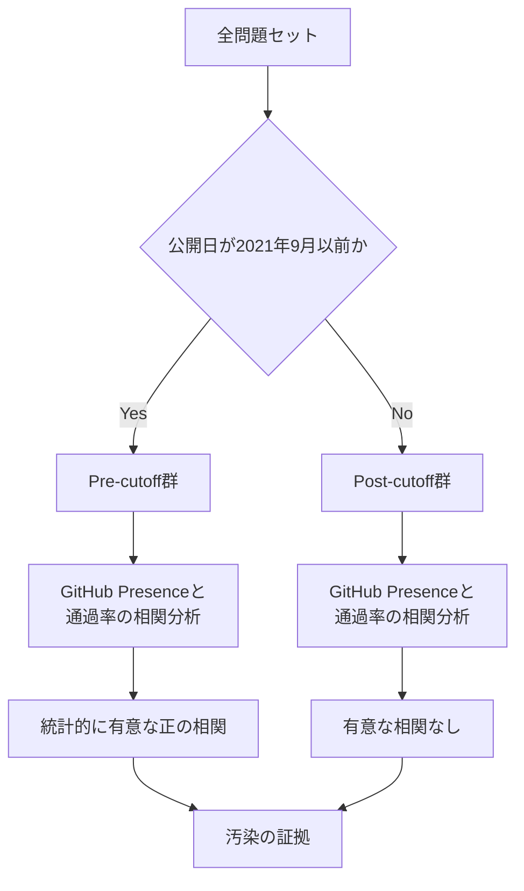

## 論文概要（Abstract）

本論文「Data Contamination Through the Lens of Time」は、大規模言語モデル（LLM）の訓練データにベンチマークデータが混入する「データ汚染（Data Contamination）」の問題を、時系列分析の観点から定量的に検証した研究である。著者らは、GPTモデルの訓練データカットオフ日を自然実験として活用し、カットオフ前後でのモデル性能変化を統計的に分析している。具体的には、CodeforcesとProject Eulerという2つのコード生成・数学的問題解決データセットを対象に、問題のGitHub上での露出度とLLMのテストケース通過率の間に統計的に有意な相関があることを示し、データ汚染の強い証拠を提示している。本研究はICLR 2024に採択され、データセット・評価フレームワークが公開されている。

本記事は [https://arxiv.org/abs/2310.10628](https://arxiv.org/abs/2310.10628) の解説記事です。関連するZenn記事「[LLMベンチマーク完全ガイド 主要15指標の読み方と自宅で実行する方法](https://zenn.dev/0h_n0/articles/205a1900fbde2a)」もあわせて参照されたい。

## 情報源

| 項目 | 内容 |
|------|------|
| arXiv ID | [2310.10628](https://arxiv.org/abs/2310.10628) |
| URL | [https://arxiv.org/abs/2310.10628](https://arxiv.org/abs/2310.10628) |
| 著者 | Manley Roberts, Himanshu Thakur, Christine Herlihy, Colin White, Samuel Dooley |
| 発表年 | 2023年（arXiv）、2024年（ICLR採択） |
| 分野 | Computer Science > Computation and Language (cs.CL) |
| 採択会議 | ICLR 2024（"To the Cutoff... and Beyond? A Longitudinal Perspective on LLM Data Contamination"として） |
| コード | [https://github.com/abacusai/to-the-cutoff](https://github.com/abacusai/to-the-cutoff) |

## 背景と動機

LLMの性能評価はベンチマークに大きく依存しているが、インターネット規模のデータで訓練されるモデルでは、評価データが訓練データに混入する「データ汚染」が深刻な問題となっている。汚染されたベンチマークでの高スコアは、モデルの真の汎化能力ではなく、単なる記憶（memorization）を反映している可能性がある。

従来のデータ汚染検出手法には主にn-gram重複分析が用いられてきた。GPT-3の論文（Brown et al., 2020）では13-gramの共起をもとに「clean」と「dirty」の分類を行い、PaLM（Chowdhery et al., 2022）では8-gramの70%以上が訓練データに存在する場合を汚染とみなしている。しかし、これらの手法には限界がある。訓練データへの直接アクセスが必要であり、また単純な言い換えや翻訳で検出を回避できるという問題が指摘されている。

著者らは、こうした既存手法の限界を克服するために、訓練データへのアクセスを必要としない時系列分析アプローチを提案している。GPTモデルの訓練データカットオフ日（2021年9月）という既知の時間的境界を利用し、カットオフ前後での性能変化パターンから汚染の存在を推定するという、自然実験（natural experiment）の枠組みを採用した点が本研究の着眼点である。

## 主要な貢献

著者らは、本研究における主要な貢献として以下の3点を報告している。

**1. 時系列分析フレームワークの提案**

LLMデータ汚染の初の包括的な縦断分析（longitudinal analysis）を実施している。CodeforcesとProject Eulerという、長期にわたり継続的に問題が公開されてきたプラットフォーム（それぞれ2010年、2001年から）を対象とし、問題の公開日とモデルの訓練カットオフ日の前後関係を分析の軸としている。

**2. 汚染度の統計的定量化**

GitHub上での問題の露出度（GitHub Presence）とモデルのテストケース通過率の間の相関を、ロジスティック回帰分析で定量化している。著者らの報告によると、GPT-4のCodeforcesにおいて、GitHub Presenceのlog値が1単位増加するごとにオッズ比が4.5%上昇し、Project Eulerでは47.8%上昇するという結果が得られている。この相関は、カットオフ前の問題でのみ統計的に有意であり、カットオフ後の問題では有意な相関が消失する。

**3. データセット・評価フレームワークの公開**

再現可能な研究のために、評価コード、問題データ、実験結果をすべて公開し、LLM時代のベンチマーク公開に関するベストプラクティスの提言を行っている。

## 技術的詳細

### 自然実験の設計

著者らの分析手法は、GPTモデルの訓練データカットオフ（2021年9月）を利用した自然実験に基づいている。問題をカットオフ前（pre-cutoff）とカットオフ後（post-cutoff）に分割し、それぞれのグループにおけるモデル性能と問題のWeb上での露出度の関係を比較している。



### GitHub Presenceの定量化

問題のWeb上での露出度を測定するために、著者らはGitHub上での問題の出現頻度を定量化している。各問題について、GitHubの検索APIを用いてリポジトリ内での出現数を取得し、これをGitHub Presenceとして定義している。この指標は、問題が訓練データ（WebTextやCommon Crawlなど）に含まれる確率の代理変数として機能する。

### ロジスティック回帰分析

テストケース通過率は二値変数（合格/不合格）として扱えるため、著者らはロジスティック回帰を用いて分析を行っている。モデルのテストケース通過確率 $p$ に対して、以下のモデルを適用している。

$$
\log\left(\frac{p}{1-p}\right) = \beta_0 + \beta_1 \cdot \log(\text{GitHubPresence}) + \beta_2 \cdot \text{Difficulty} + \varepsilon
$$

ここで、$p$ はテストケース通過確率、$\beta_1$ はGitHub Presenceの効果を表す回帰係数、$\text{Difficulty}$ は問題の難易度を制御する共変量、$\varepsilon$ は誤差項である。

著者らの報告によると、$\beta_1$ はpre-cutoff群で統計的に有意（$p < 0.05$）であるが、post-cutoff群では有意でない。この結果は、モデルがカットオフ前の問題については、GitHub上での露出が大きいほど高い通過率を示す一方、カットオフ後の問題ではそうした傾向がないことを意味する。

### カイ二乗検定による分布比較

著者らはさらに、pre-cutoffとpost-cutoffの問題における通過率の分布を比較するためにカイ二乗検定（$\chi^2$ test）を適用している。pre-cutoffの正規化度数を参照分布として、post-cutoffの分布との統計的差異を検定している。

### オッズ比の解釈

GPT-4のCodeforcesにおけるオッズ比の解釈として、GitHub Presenceのlog値が1単位増加した場合にテストケース通過のオッズが4.5%上昇するということは、GitHub上で約2.7倍（$e^1 \approx 2.718$）多く露出している問題に対して、GPT-4が解ける確率がわずかに上昇することを意味する。Project Eulerでの47.8%という大きなオッズ比の上昇は、数学的問題解決タスクにおいてGitHub上の解答コードの存在が性能に与える影響が大きいことを示唆している。

## 実装のポイント

### 汚染検出の実装アプローチ

著者らが公開したコードベース（[abacusai/to-the-cutoff](https://github.com/abacusai/to-the-cutoff)）に基づき、汚染検出の実装上の要点を以下に整理する。

```python
from dataclasses import dataclass
from typing import Optional
import datetime


@dataclass(frozen=True)
class BenchmarkProblem:
    """ベンチマーク問題のメタデータを保持するデータクラス。

    Attributes:
        problem_id: 問題の一意識別子
        release_date: 問題の公開日
        github_presence: GitHub上での出現数（検索API経由）
        difficulty: 問題の難易度指標
        platform: 問題のプラットフォーム（codeforces / project_euler）
    """

    problem_id: str
    release_date: datetime.date
    github_presence: int
    difficulty: float
    platform: str

    def is_pre_cutoff(self, cutoff_date: datetime.date) -> bool:
        """問題が訓練データカットオフ日より前に公開されたかを判定する。

        Args:
            cutoff_date: モデルの訓練データカットオフ日

        Returns:
            カットオフ前であればTrue
        """
        return self.release_date < cutoff_date


def compute_contamination_indicator(
    pass_rate_pre: float,
    pass_rate_post: float,
    github_coeff_pre: float,
    github_coeff_post: float,
    p_value_pre: float,
    p_value_post: float,
    alpha: float = 0.05,
) -> dict[str, bool | float]:
    """汚染の証拠を統計的指標に基づいて判定する。

    カットオフ前のGitHub Presenceの回帰係数が有意であり、
    かつカットオフ後では有意でない場合に汚染の証拠ありと判定する。

    Args:
        pass_rate_pre: カットオフ前の平均通過率
        pass_rate_post: カットオフ後の平均通過率
        github_coeff_pre: カットオフ前のGitHub Presence回帰係数
        github_coeff_post: カットオフ後のGitHub Presence回帰係数
        p_value_pre: カットオフ前の回帰係数のp値
        p_value_post: カットオフ後の回帰係数のp値
        alpha: 有意水準（デフォルト: 0.05）

    Returns:
        汚染判定結果と関連指標の辞書
    """
    pre_significant = p_value_pre < alpha
    post_significant = p_value_post < alpha

    return {
        "contamination_evidence": pre_significant and not post_significant,
        "pass_rate_diff": pass_rate_pre - pass_rate_post,
        "github_coeff_pre": github_coeff_pre,
        "github_coeff_post": github_coeff_post,
        "pre_significant": pre_significant,
        "post_significant": post_significant,
    }
```

### n-gram検索の効率化

n-gram重複分析を大規模コーパスに対して実行する場合、計算コストが問題となる。以下のような最適化手法が一般的に用いられている。

- **Suffix Array**: 訓練コーパスの接尾辞配列を事前構築し、任意のn-gramの検索を $O(m \log n)$（$m$: n-gramの長さ、$n$: コーパスサイズ）で実行する
- **Bloom Filter**: 空間効率の良い確率的データ構造を用いて、n-gramの存在判定を近似的に行う（偽陽性あり、偽陰性なし）
- **MinHash**: 大規模文書間の類似度をハッシュベースで近似計算し、候補ペアを効率的に絞り込む

### 訓練コーパスへのアクセス

本研究の手法の利点は、訓練コーパスへの直接アクセスを必要としない点である。GitHub Presenceを訓練データ内の露出度の代理変数として用いることで、プロプライエタリモデル（GPT-4など）にも適用可能な汚染検出を実現している。

## 実験結果

### Codeforcesにおける結果

著者らは、GPT-4およびGPT-3.5-Turboを用いてCodeforcesの問題を評価している。訓練カットオフ（2021年9月）前に公開された問題では、GitHub Presenceとテストケース通過率の間に統計的に有意な正の相関が観測されている。一方、カットオフ後の問題ではこの相関は消失している。

外部の独立した検証（Horace He氏による報告）でも、GPT-4がCodeforcesの最も簡単な問題において、2021年以前の問題を10問中10問正解したのに対し、最近の問題では10問中0問正解であったことが報告されており、本論文の知見と整合する結果が示されている。

### Project Eulerにおける結果

Project Eulerの数学的問題解決タスクでは、GitHub Presenceの影響がCodeforcesよりも顕著に表れている。GPT-4のオッズ比上昇率が47.8%と報告されており、Codeforcesの4.5%と比較して大きい。これは、Project Eulerの解答コードがGitHub上で広く共有されている特性（2001年からの長い歴史）が影響していると著者らは分析している。

### 汚染の影響規模

データ汚染の影響規模については、関連研究の結果も含めて以下のような知見が報告されている。

| ベンチマーク | モデル | 汚染の影響 | 出典 |
|-------------|--------|-----------|------|
| HellaSwag | LLaMA-2 70B | clean vs dirty で15.3ポイント差（63.5 vs 78.8） | Oren et al., 2023 |
| C-Eval | Yi 6B | 汚染セットで14ポイント上昇 | Oren et al., 2023 |
| ARC | LLaMA-2 70B | 約11ポイント上昇 | Oren et al., 2023 |
| MMLU | LLaMA-2 70B | 汚染率29.1%だが性能向上は小さい | Oren et al., 2023 |
| SciEval (Physics) | GPT-4 | 静的65.22% → 動的25.84%（39.4ポイント低下） | Sun et al., 2024 |

SciEvalの結果は注目に値する。著者らSun et al.（2024）は、静的な（既存の）物理問題でGPT-4が65.22%の正答率を達成する一方、科学原理に基づいて動的に生成された問題では25.84%まで低下することを報告している。この約40ポイントの差は、静的ベンチマークの汚染が性能評価を大幅に歪める可能性を示唆している。

## 実運用への応用

### ベンチマーク設計における汚染対策

本研究の知見は、LLMベンチマークの設計と運用に対して以下の実践的な示唆を与えている。

**時間的管理の導入**: ベンチマーク問題の公開日を管理し、モデルの訓練カットオフ日との関係を追跡可能にすることが重要である。LiveBench（White et al., 2024）のように、毎月新しい問題を追加し、古い問題を段階的に更新するアプローチが有効とされている。

**動的ベンチマークの採用**: SciEvalの動的データセットが示すように、アルゴリズム的に問題を生成するアプローチは汚染リスクを大幅に低減できる。ただし、動的生成された問題の質と難易度の制御が新たな課題となる。

**多層的な汚染検出**: n-gram重複分析だけでなく、本論文のような時系列分析やパープレキシティベースの手法を組み合わせた多層的な検出が推奨される。

### 評価結果の解釈方法

LLMのベンチマークスコアを解釈する際には、以下の点に注意が必要である。

- **カットオフ日の確認**: モデルの訓練データカットオフ日とベンチマークの公開日を比較し、汚染リスクを評価する
- **汚染報告の参照**: GPT-3、LLaMA、PaLMなどの技術報告書に含まれる汚染分析セクションを参照し、clean/dirty分割での性能差を確認する
- **複数ベンチマークでの評価**: 単一のベンチマークスコアに依存せず、公開時期の異なる複数のベンチマークでの性能を比較する

## 関連研究

データ汚染の検出と対策は活発な研究分野であり、複数のアプローチが提案されている。

**汚染検出手法**: Deng et al.（2024, NAACL）は、Testset Slot Guessing（TS-Guessing）と呼ばれる手法を提案し、多肢選択問題の誤答選択肢をマスクしてモデルに推測させることで汚染を検出している。ChatGPTがMMLUで52%、GPT-4が57%の完全一致率を示したと報告されている。

**動的ベンチマーク**: LiveBench（White et al., 2024, ICLR 2025 Spotlight）は、最新のニュース記事やarXiv論文、数学コンペティションから毎月問題を生成し、汚染リスクを制限している。LiveCodeBench（Jain et al., 2024）はコード生成タスクに特化した動的ベンチマークである。

**汚染影響の定量化**: Oren et al.（2023）は複数のモデル・ベンチマークにわたる体系的な汚染分析を行い、HellaSwagで最大15.3ポイント、C-Evalで14ポイントの性能差を報告している。

## まとめと今後の展望

本論文は、LLMデータ汚染の問題を時系列分析の枠組みで定量化し、訓練データカットオフという自然実験を活用した新しい検出アプローチを提示した研究である。Codeforcesの最易問題でGPT-4が2021年以前の問題を全問正解する一方、最近の問題を全問不正解するという結果は、データ汚染がベンチマーク評価の信頼性に与える影響を端的に示している。

今後の課題としては、コード生成・数学問題以外のドメイン（自然言語理解、推論など）への手法の拡張、モデルのファインチューニングデータにおける汚染の分析、そしてWeb上の露出度以外の汚染経路（合成データ、データ拡張など）の検討が挙げられる。LLMの性能評価における汚染対策は、ベンチマークの設計、モデルの訓練プロセス、評価結果の解釈のすべてにおいて考慮されるべき問題であり、本論文はその基礎的な知見を提供している。

## 参考文献

1. Roberts, M., Thakur, H., Herlihy, C., White, C., & Dooley, S. (2023). "Data Contamination Through the Lens of Time." arXiv:2310.10628. [https://arxiv.org/abs/2310.10628](https://arxiv.org/abs/2310.10628)
2. Roberts, M., Thakur, H., Herlihy, C., White, C., & Dooley, S. (2024). "To the Cutoff... and Beyond? A Longitudinal Perspective on LLM Data Contamination." ICLR 2024. [https://openreview.net/forum?id=m2NVG4Htxs](https://openreview.net/forum?id=m2NVG4Htxs)
3. Brown, T. B., et al. (2020). "Language Models are Few-Shot Learners." NeurIPS 2020.
4. Deng, C., Zhao, Y., et al. (2024). "Investigating Data Contamination in Modern Benchmarks for Large Language Models." NAACL 2024. arXiv:2311.09783.
5. Oren, Y., et al. (2023). "An Open-Source Data Contamination Report for Large Language Models." arXiv:2310.17589. [https://arxiv.org/abs/2310.17589](https://arxiv.org/abs/2310.17589)
6. Sun, L., et al. (2024). "SciEval: A Multi-Level Large Language Model Evaluation Benchmark for Scientific Research." AAAI 2024. arXiv:2308.13149.
7. White, C., Dooley, S., et al. (2024). "LiveBench: A Challenging, Contamination-Limited LLM Benchmark." ICLR 2025 Spotlight. arXiv:2406.19314. [https://arxiv.org/abs/2406.19314](https://arxiv.org/abs/2406.19314)
8. Jain, N., et al. (2024). "LiveCodeBench: Holistic and Contamination Free Evaluation of Large Language Models for Code." [https://livecodebench.github.io/](https://livecodebench.github.io/)
9. Chowdhery, A., et al. (2022). "PaLM: Scaling Language Modeling with Pathways." arXiv:2204.02311.
10. Singh, A., et al. (2024). "Evaluation data contamination in LLMs: how do we measure it and (when) does it matter?" arXiv:2411.03923.
