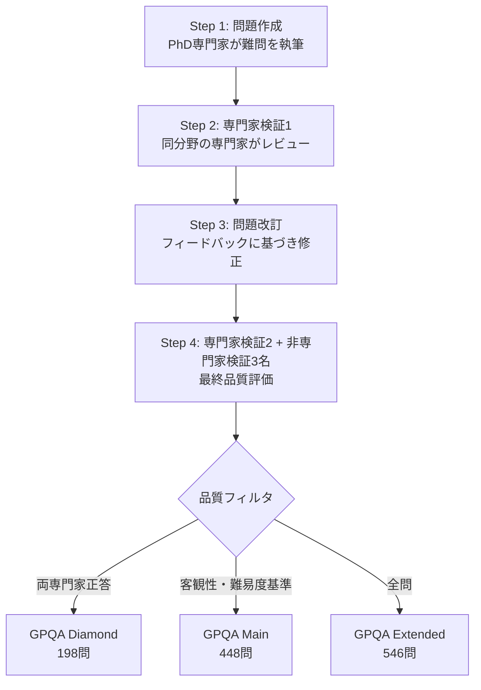

## 論文概要（Abstract）

GPQA（Graduate-Level Google-Proof Q&A Benchmark）は、生物学・物理学・化学の3領域にわたる448問の4択問題からなるベンチマークデータセットである。各問題はPhD保持者またはPhD課程の専門家によって作成され、同分野の専門家が正答率65%（事後的に誤りを除外すると74%）を達成する一方、非専門家の検証者は30分以上のWeb検索を行っても正答率34%にとどまる。論文発表時点（2023年11月）のGPT-4は正答率39%であり、専門家水準を大幅に下回った。著者らは、このデータセットをAIシステムのscalable oversight（拡張可能な監督）研究のための現実的なテストベッドとして位置づけている。

本記事は [https://arxiv.org/abs/2311.12022](https://arxiv.org/abs/2311.12022) の解説記事です。関連するZenn記事「[LLMベンチマーク完全ガイド 主要15指標の読み方と自宅で実行する方法](https://zenn.dev/0h_n0/articles/205a1900fbde2a)」もあわせてご参照ください。

## 情報源

| 項目 | 内容 |
|------|------|
| arXiv ID | [2311.12022](https://arxiv.org/abs/2311.12022) |
| URL | [https://arxiv.org/abs/2311.12022](https://arxiv.org/abs/2311.12022) |
| 著者 | David Rein, Betty Li Hou, Asa Cooper Stickland, Jackson Petty, Richard Yuanzhe Pang, Julien Dirani, Julian Michael, Samuel R. Bowman |
| 所属 | New York University (NYU) 等 |
| 発表年 | 2023年11月 |
| 分野 | Artificial Intelligence (cs.AI), Computation and Language (cs.CL) |
| ライセンス | CC BY 4.0 |
| ページ数 | 28ページ、5図、7表 |

## 背景と動機

LLMの性能向上に伴い、既存のベンチマークが急速に飽和する問題が顕在化していた。MMLU（Massive Multitask Language Understanding）は2021年時点でGPT-3が43.9%だったが、2023年にはGPT-4が86.4%に到達し、人間の専門家水準（89.8%）に迫った。ARC（AI2 Reasoning Challenge）やHellaSwagなどの他のベンチマークでも同様の飽和傾向が見られ、モデルの差別化が困難になりつつあった。

このような状況において、著者らは2つの根本的な課題を提起している。第一に、AIシステムが人間の専門家を超える性能を達成しつつある領域において、そのシステムの出力を人間がどのように監督・検証できるのかという**scalable oversight問題**である。第二に、既存ベンチマークの多くはWeb検索で容易に解答が見つかるため、モデルの真の推論能力を測定できていないという**評価の信頼性**の問題である。

GPQAは、これらの課題に対する解として設計された。PhD専門家でも65%しか正答できない難度を持ちながら、問題の客観性（正答が一意に定まること）を担保する設計により、scalable oversight研究のための現実的なテストベッドを提供することを目指している。

## 主要な貢献

### 1. Google-Proof設計

GPQAの最も特徴的な設計思想は「Google-Proof」である。これは、非専門家がWeb検索を自由に行っても正答に到達できない問題を体系的に収集するという方針を指す。具体的には、非専門家の検証者が平均37分（中央値30分）のWeb検索を行い、学術論文の参照やシミュレーションの作成まで許容されたにもかかわらず、正答率は34.1%（ランダム選択の25%に対して+9.1ポイント）にとどまった。この結果は、単に知識の暗記ではなく、深い専門的理解が求められることを示している。

### 2. 品質管理プロセス

データセットの品質を担保するため、著者らは多段階のバリデーションパイプラインを構築した。問題作成者と検証者の双方がPhDレベルの専門知識を持つことを要件とし、61名の契約者をUpworkを通じて雇用した（推定平均時給$95、最大$150）。

### 3. 3つのサブセット

データの品質と用途に応じて3つのサブセットが提供されている。

| サブセット | 問題数 | 特徴 |
|-----------|--------|------|
| GPQA Extended | 546 | 全収集データ |
| GPQA Main | 448 | 客観性・難易度でフィルタリング済み |
| GPQA Diamond | 198 | 2名の専門家が共に正答した最高品質セット |

GPQA Diamondは、2名の専門家検証者がともに正答した問題のみを含むため、問題の客観性が最も高い。現在の多くのリーダーボードではこのDiamondサブセットが標準的に使用されている。

## 技術的詳細

### 問題作成プロセス

GPQAの問題作成は、以下の4段階のパイプラインで構成されている。



**Step 1: 問題作成** — PhD保持者が、自身の専門分野において難度の高い4択問題を作成する。各問題には正答と誤答の説明文が付与される。問題文の長さは中央値561文字（146トークン）、平均630文字（169トークン）であった。

**Step 2: 専門家検証（第1ラウンド）** — 同分野の別のPhD専門家が問題を解答し、問題の客観性・難易度についてフィードバックを提供する。

**Step 3: 問題改訂** — 作成者がフィードバックに基づき問題を修正する。曖昧な表現の排除、選択肢の改善、難易度の調整が行われる。

**Step 4: 最終検証** — 第2の専門家検証者と3名の非専門家検証者（他分野のPhD保持者）が問題に解答する。非専門家には15分以上のWeb検索が求められ、実際に90%が15分以上を費やしていた。

### Google-Proof検証方法

「Google-Proof」の検証は、非専門家検証者の正答率によって定量的に評価される。著者らの定義では、以下の条件を満たす問題がGoogle-Proofとされる。

- 同分野の専門家が正答できる（専門知識があれば解ける）
- 非専門家がWeb検索を自由に行っても正答率がランダム選択（25%）に近い

Extended Setにおける非専門家正答率は34.1% ± 2.3%であり、ランダム選択の25%との差は統計的に有意ではあるものの、専門家正答率65%との差（約31ポイント）と比較すると、Google-Proofの設計意図が概ね達成されていると著者らは報告している。

### 難易度校正と客観性の検証

著者らは、問題の難易度が高いことと問題が主観的であることを区別する分析を行っている。191件の専門家間不一致を事後分析した結果、以下の内訳が報告されている。

- 明確な誤り（事後的に誤りと確認）: 25.1%
- 理解を示す誤答（推論過程は適切だが結論を誤った）: 7.9%
- 問題の正答が客観的に定まると確認: 45.6%

この分析から、専門家の誤答の多くは問題の曖昧さではなく、純粋な難易度に起因すると著者らは結論づけている。

さらに、Expected Calibration Error（ECE）の分析では、専門家のECEは0.13、非専門家のECEは0.12であった。非専門家は25%の確信度を除くすべての確信度レベルで極端な過信を示し、専門家も高確信度レベルで過信の傾向があることが報告されている。

### 4択形式の設計根拠とスプリアス特徴の検証

4択形式の採用は、評価の自動化と採点の明確性を目的としている。著者らはスプリアス特徴（表面的な手がかり）の存在を検証するため、T5-smallとT5-baseを選択肢テキストのみでファインチューニングした。その結果、正答率はいずれもチャンスレベル（25%）にとどまり、選択肢の文面から正答を推測できないことが確認されている。

### 分野別の問題分布

Extended Set（546問）における分野別分布は以下の通りである。

| 分野 | 問題数 | 主なサブ分野 |
|------|--------|-------------|
| 生物学 | 105 | 分子生物学（85）、遺伝学（20） |
| 物理学 | 227 | 量子力学（64）、素粒子物理学（46）、一般物理（43）、天体物理学（42）、その他（32） |
| 化学 | 214 | 有機化学（144）、一般化学（64）、その他（6） |

## 実装のポイント

GPQAはEleutherAIの[lm-evaluation-harness](https://github.com/EleutherAI/lm-evaluation-harness)で評価可能である。データセットはHugging Faceで[Idavidrein/gpqa](https://huggingface.co/datasets/Idavidrein/gpqa)として公開されているが、gated datasetであるため、利用規約への同意が必要となる。

### lm-evaluation-harnessでの実行

```python
# lm-evaluation-harnessでGPQA Diamondを評価する例
# 事前準備: huggingface-cli login でトークン認証が必要

"""
lm-evaluation-harnessを用いたGPQA評価の実行手順。

Requirements:
    - lm-eval >= 0.4.0
    - HuggingFace tokenによるgated datasetアクセス
"""

# CLI実行コマンド:
# lm_eval --model hf \
#     --model_args pretrained=<model_name> \
#     --tasks gpqa_cot_zeroshot_diamond \
#     --batch_size auto \
#     --output_path results/
```

### 主要なタスクバリアント

lm-evaluation-harnessでは、以下のバリアントが提供されている。

```python
from dataclasses import dataclass
from typing import Literal


@dataclass(frozen=True)
class GPQATaskConfig:
    """GPQA評価タスクの設定を表すデータクラス。

    Attributes:
        subset: データセットのサブセット（diamond/main/extended）
        method: 評価方法（zeroshot/n_shot/cot_zeroshot/cot_n_shot）
        metric: 評価指標（exact_match）
        n_shot: Few-shotの例数（n_shot/cot_n_shotの場合）
    """

    subset: Literal["diamond", "main", "extended"]
    method: Literal["zeroshot", "n_shot", "cot_zeroshot", "cot_n_shot"]
    metric: str = "exact_match"
    n_shot: int = 0


# 主要な評価設定の一覧
TASK_VARIANTS: list[GPQATaskConfig] = [
    GPQATaskConfig(subset="diamond", method="zeroshot"),
    GPQATaskConfig(subset="diamond", method="cot_zeroshot"),
    GPQATaskConfig(subset="main", method="zeroshot"),
    GPQATaskConfig(subset="main", method="cot_zeroshot"),
    GPQATaskConfig(subset="extended", method="zeroshot"),
    GPQATaskConfig(subset="extended", method="cot_zeroshot"),
]
```

### プロンプト形式と採点方法

Chain-of-Thought（CoT）ゼロショットのプロンプトテンプレートは以下の形式である。

```
What is the correct answer to this question: [Question]
Choices:
(A) [choice1]
(B) [choice2]
(C) [choice3]
(D) [choice4]
Let's think step by step:
```

採点は`exact_match`メトリクスで行われ、モデル出力から"The answer is (X)"形式の回答を抽出する。抽出にはstrict-match（"The answer is"以降のテキスト）とflexible-extract（正規表現による(A)〜(D)の検出）の2段階のフィルタが適用される。温度パラメータは0.0（決定的推論）に設定される。

## 実験結果

### 人間専門家 vs LLMの性能比較

論文Table 2より、Extended Setにおける各手法の正答率を以下に示す。

| 評価対象 | 手法 | 正答率 |
|----------|------|--------|
| 専門家（第1検証者） | — | 66.5% ± 4.0% |
| 専門家（第2検証者） | — | 64.8% ± 4.0% |
| 非専門家 | Web検索あり | 34.1% ± 2.3% |
| GPT-4 | Few-shot CoT | 38.7% |
| GPT-4 | Search-based | 39.4% |
| GPT-3.5-turbo-16k | Few-shot CoT | 28.2% |
| Llama-2-70B-chat | Few-shot CoT | 30.4% |
| ランダム選択 | — | 25.0% |

GPT-4のSearch-based手法では、Main Setにおいて棄権率37.2%（確信度が低い場合に棄権する戦略）で正答率41.0%を達成している。一方、Few-shot CoTでは棄権率は4.0%に低下し、正答率は39.7%であった（論文Table 2）。

### 分野別の詳細分析

Extended Setにおける分野別の性能差は注目に値する（論文より）。

| 分野 | 専門家正答率 | 非専門家正答率 | 専門性ギャップ |
|------|-------------|---------------|---------------|
| 生物学 | 66.7% | 43.2% | 23.5 pts |
| 物理学 | 57.3% | 32.5% | 24.8 pts |
| 化学 | 72.0% | 31.4% | 40.6 pts |

化学分野が最も大きな専門性ギャップ（40.6ポイント）を示している。著者らはこの結果について、有機化学の問題が特に多い（214問中144問が有機化学）ことが要因の一つと分析している。有機化学は反応機構の体系的な理解が必要であり、断片的なWeb検索では対応が困難であると考えられる。

### 2026年時点のLLM性能（論文外の追加情報）

論文発表後、LLMの性能はGPQA Diamondにおいて大幅に向上している。2026年4月時点のリーダーボード情報によると、PhD専門家の正答率69.7%（Diamond Setにおける基準値）を複数のモデルが超えている。これはGPQAが設計目標としていた「AIシステムが専門家を超えるシナリオ」が現実化しつつあることを示唆しており、scalable oversight研究の重要性が増していると言える。

## 実運用への応用

### モデル評価における位置づけ

GPQAは、LLMの**専門的推論能力**を測定するベンチマークとして広く採用されている。特にGPQA Diamondは、OpenAI、Anthropic、Google DeepMindなどの主要なAI企業がモデルリリース時の性能指標として報告する標準的なベンチマークの一つとなっている。

GPQAの評価が特に有用なのは以下の場面である。

- **モデルの科学的推論能力の比較**: MMLU等の一般知識ベンチマークが飽和する中、GPQAはモデル間の差を明確に示す
- **Scalable oversight研究**: debate、market-making、recursive reward modelingなどの手法を検証するためのground-truth付きデータセットとして利用可能
- **安全性評価の指標**: AIシステムが専門家を超える領域の特定と、そこでの監督手法の開発

### 他ベンチマークとの併用戦略

GPQAは単独での使用よりも、複数のベンチマークと組み合わせた総合評価の一部として活用するのが効果的である。著者らが論文中で示唆しているように、GPQAの問題数は448問（Diamond: 198問）と限定的であり、統計的検出力に制約がある。論文によれば、80%の検出力で有意差を検出するには約50パーセントポイントの差が必要とされる。

推奨される併用例は以下の通りである。

$$
\text{総合評価スコア} = w_1 \cdot S_{\text{GPQA}} + w_2 \cdot S_{\text{MMLU-Pro}} + w_3 \cdot S_{\text{MATH}} + w_4 \cdot S_{\text{HumanEval}}
$$

ここで、$S_{\text{GPQA}}$ はGPQA Diamondの正答率、$w_i$ は各ベンチマークの重み（$\sum w_i = 1$）である。GPQAは専門的科学推論を、MMLU-Proは広範な知識を、MATHは数学的推論を、HumanEvalはコード生成能力をそれぞれ測定し、モデルの多面的な評価を可能にする。

## 関連研究

GPQAは以下のベンチマークとの比較で位置づけられる。

- **MMLU**（Hendrycks et al., 2021）: 57分野の4択問題。大学〜大学院レベルだが、2023年時点で最先端モデルが人間レベルに到達し飽和傾向にある
- **ARC**（Clark et al., 2018）: 小学校〜中学校レベルの科学問題。現行のLLMでは容易に90%超を達成可能
- **ScienceQA**（Lu et al., 2022）: マルチモーダルな科学問題。GPQAと比較して難度が低い
- **MMLU-Pro**（Wang et al., 2024）: MMLUの強化版として10択形式を採用し、より高い難易度を実現

GPQAの独自性は、問題作成者と検証者の双方にPhDレベルの専門性を要求し、かつGoogle-Proof性を体系的に検証した点にある。Irving & Askell（2019）が提唱したscalable oversight研究のための9つの望ましい性質のうち7つを満たすと著者らは報告している。

## まとめと今後の展望

GPQAは、PhD専門家レベルの科学的推論能力を測定するためのベンチマークとして、LLM評価の標準的な指標の一つとなった。論文発表時（2023年11月）にはGPT-4が39%で専門家水準を大きく下回っていたが、2026年時点では複数のモデルが専門家水準（約70%）を超えている。

この急速な飽和傾向は、GPQAが当初想定していた「AIが専門家を超えるシナリオ」が既に到来しつつあることを意味する。同時に、問題数の制約（Diamond: 198問）や、3分野に限定された範囲は、post-GPQAのベンチマーク設計への課題を提示している。著者ら自身も、データセットサイズの制約、非専門家が他分野のPhD保持者であるため一般的な非専門家と異なる点、地域・人口統計的な多様性の不足を限界として認めている。

今後は、より広範な専門分野をカバーし、動的に問題を生成することで汚染（contamination）を防ぐ次世代ベンチマークの設計が求められるだろう。GPQAの設計思想——Google-Proof性、専門家パイプライン、段階的なサブセット——は、そうした次世代ベンチマークの設計においても重要な参照点であり続ける。

## 参考文献

1. Rein, D., Hou, B. L., Stickland, A. C., Petty, J., Pang, R. Y., Dirani, J., Michael, J., & Bowman, S. R. (2023). GPQA: A Graduate-Level Google-Proof Q&A Benchmark. *arXiv preprint arXiv:2311.12022*. [https://arxiv.org/abs/2311.12022](https://arxiv.org/abs/2311.12022)
2. Hendrycks, D., Burns, C., Basart, S., Zou, A., Mazeika, M., Song, D., & Steinhardt, J. (2021). Measuring Massive Multitask Language Understanding. *ICLR 2021*. [https://arxiv.org/abs/2009.03300](https://arxiv.org/abs/2009.03300)
3. Clark, P., Cowhey, I., Etzioni, O., Khot, T., Sabharwal, A., Schoenick, C., & Tafjord, O. (2018). Think you have Solved Question Answering? Try ARC. *arXiv preprint arXiv:1803.05457*. [https://arxiv.org/abs/1803.05457](https://arxiv.org/abs/1803.05457)
4. Irving, G., & Askell, A. (2019). AI Safety Needs Social Scientists. *Distill*. [https://doi.org/10.23915/distill.00014](https://doi.org/10.23915/distill.00014)
5. Wang, Y., Ma, X., Zhang, G., Ni, Y., Chandra, A., Guo, S., ... & Chen, H. (2024). MMLU-Pro: A More Robust and Challenging Multi-Task Language Understanding Benchmark. *arXiv preprint arXiv:2406.01574*. [https://arxiv.org/abs/2406.01574](https://arxiv.org/abs/2406.01574)
6. Lu, P., Mishra, S., Xia, T., Qiu, L., Chang, K.-W., Zhu, S.-C., ... & Gao, J. (2022). Learn to Explain: Multimodal Reasoning via Thought Chains for Science Question Answering. *NeurIPS 2022*. [https://arxiv.org/abs/2209.09513](https://arxiv.org/abs/2209.09513)
7. EleutherAI. lm-evaluation-harness. [https://github.com/EleutherAI/lm-evaluation-harness](https://github.com/EleutherAI/lm-evaluation-harness)
8. Rein, D. GPQA Dataset. Hugging Face. [https://huggingface.co/datasets/Idavidrein/gpqa](https://huggingface.co/datasets/Idavidrein/gpqa)
