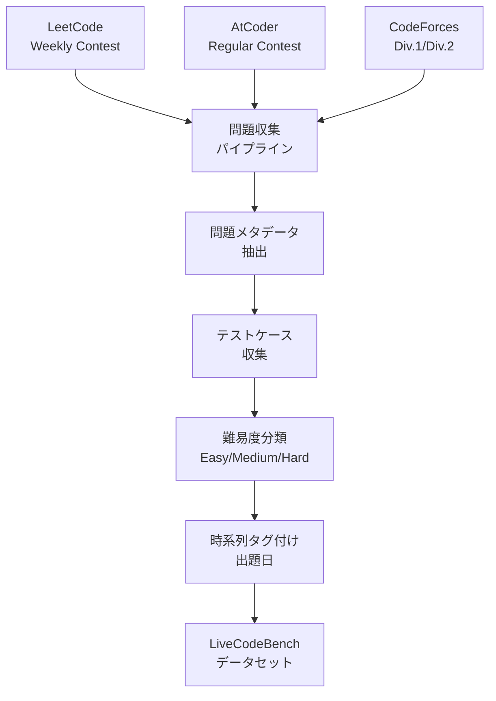

本記事は [LiveCodeBench: Holistic and Contamination Free Evaluation of Large Language Models for Code](https://arxiv.org/abs/2404.10952)（Jain et al., 2024）の解説記事です。

## 論文概要（Abstract）

LiveCodeBenchは、LeetCode・AtCoder・CodeForcesの新着問題を継続的に収集することで、データ汚染（data contamination）の影響を構造的に排除したコード生成ベンチマークである。従来のHumanEvalやMBPPはデータセットが固定されており、モデルの学習データに含まれる可能性が高かった。著者らは時系列スライド（temporal windowing）による汚染影響の定量化手法を提案し、GPT-4やClaude 3などのフロンティアモデルでカットオフ前後のスコア差が有意に存在することを実証している。さらに、コード生成だけでなく、セルフリペア・コード実行予測・テスト出力予測の4シナリオを統合評価する設計が特徴である。

この記事は [Zenn記事: SWE-Bench Proから自作評価まで LLMコーディングベンチマーク実践ガイド](https://zenn.dev/0h_n0/articles/e1722937bd269a) の深掘りです。

## 情報源

- **arXiv ID**: 2404.10952
- **URL**: [https://arxiv.org/abs/2404.10952](https://arxiv.org/abs/2404.10952)
- **著者**: Naman Jain, King Han, Alex Gu, Wen-Ding Li, Fanjia Yan, Tianjun Zhang, Sida Wang, Armando Solar-Lezama, Koushik Sen, Ion Stoica
- **発表年**: 2024年
- **分野**: cs.SE, cs.AI, cs.CL, cs.LG
- **コード**: [LiveCodeBench/LiveCodeBench](https://github.com/LiveCodeBench/LiveCodeBench)（Apache 2.0 License）

## 背景と動機（Background & Motivation）

LLMコーディングベンチマークにおけるデータ汚染は、2024年時点で最も深刻な信頼性問題の一つであった。HumanEval（164問）は2021年に公開されて以降、その問題文と解答がインターネット上に広く拡散し、多くのLLMの学習データに含まれている可能性が指摘されていた。OpenAIの調査では、SWE-Bench Verifiedにおいて一部のモデルが「ゴールドパッチを逐語的に再現」できたと報告されている。

著者らは、この問題に対する構造的な解決策として「ベンチマークを固定せず、継続的に更新する」アプローチを提案した。新着の競技プログラミング問題は出題時点では学習データに含まれ得ないため、時系列によって汚染の有無を制御できる。

## 主要な貢献（Key Contributions）

- **貢献1**: LeetCode・AtCoder・CodeForcesから新着問題を継続的に収集し、構造的にデータ汚染を排除したベンチマークを構築した（v6時点で1,055問以上）
- **貢献2**: 時系列スライド（temporal windowing）による汚染影響の定量化手法を提案し、モデルのカットオフ日前後でスコアに有意差があることを実証した
- **貢献3**: コード生成・セルフリペア・コード実行予測・テスト出力予測の4シナリオを統合した、包括的なコード能力評価フレームワークを設計した

## 技術的詳細（Technical Details）

### データ収集パイプライン

LiveCodeBenchのデータ収集は以下の流れで自動化されている。



各問題には以下の情報が付与される。
- **問題文**: 自然言語による問題記述
- **入出力形式**: 入力・出力の仕様
- **テストケース**: 公開テストケース（平均5-10個）
- **難易度**: Easy / Medium / Hard（プラットフォームの分類に準拠）
- **出題日**: 問題が公開された日時（汚染判定に使用）

### 4つの評価シナリオ

LiveCodeBenchは、コード生成だけでなく4つのシナリオでLLMを評価する。

| シナリオ | 入力 | 出力 | 評価方法 |
|:--|:--|:--|:--|
| **コード生成** | 問題文 | Pythonコード | テストケース通過率（pass@1） |
| **セルフリペア** | 問題文 + 初回コード + エラー出力 | 修正後コード | テストケース通過率 |
| **コード実行予測** | コード + 入力 | 実行結果 | 出力一致率 |
| **テスト出力予測** | 問題文 + コード + テスト入力 | テスト出力 | 出力一致率 |

セルフリペアシナリオでは、モデルが初回生成で失敗した場合にエラーメッセージをフィードバックとして与え、修正能力を測定する。これは実務におけるデバッグワークフローを模擬している。

### 時系列スライドによる汚染検出

著者らが提案した汚染検出手法の核心は、モデルの学習データカットオフ日を境界とした性能比較である。

モデル$M$の学習データカットオフ日を$t_M$とする。時刻$t$に出題された問題集合$\mathcal{P}_t$に対するpass@1スコアを$S(M, \mathcal{P}_t)$とすると、汚染の影響は以下の差分で定量化される。

$$
\Delta_{\text{contamination}}(M) = S(M, \mathcal{P}_{t < t_M}) - S(M, \mathcal{P}_{t > t_M})
$$

ここで、
- $S(M, \mathcal{P}_{t < t_M})$: カットオフ日**以前**に出題された問題でのスコア（汚染の可能性あり）
- $S(M, \mathcal{P}_{t > t_M})$: カットオフ日**以後**に出題された問題でのスコア（汚染なし）
- $\Delta_{\text{contamination}}(M) > 0$ の場合、汚染の影響が示唆される

著者らの実験では、GPT-4でこの差分が統計的に有意であることが確認されている。カットオフ前の問題では高スコアを記録する一方、カットオフ後の問題ではスコアが低下するパターンが観測された。

### 評価指標: pass@1

LiveCodeBenchではpass@1を主要指標として採用している。HumanEval論文（Chen et al., 2021）で定義された不偏推定量を用いる。

$$
\text{pass@}k = 1 - \frac{\binom{n-c}{k}}{\binom{n}{k}}
$$

ここで$n$は総サンプリング回数、$c$は正解回数、$k$は選択回数である。pass@1の場合は$k=1$で温度0（greedy decoding）が推奨される。

## 実装のポイント（Implementation）

**問題収集の自動化**: LeetCode・AtCoder・CodeForcesの各プラットフォームからAPI（またはスクレイピング）で新着問題を定期的に取得する。プラットフォームの利用規約に準拠する必要がある。

**テストケースの制約**: 多くのプラットフォームでは隠しテストケースにアクセスできないため、公開テストケースのみで評価する。公開テストケースはエッジケースを十分にカバーしていない場合があり、偽陽性（不正解コードがテストに通る）のリスクがある。

**多言語対応**: 論文時点ではPython中心だが、リポジトリでは他言語への対応も進められている。ただし、プラットフォームによって対応言語が異なるため、言語間の公平な比較には注意が必要である。

**温度設定**: pass@1評価では温度0（greedy decoding）を使用する。pass@k（k>1）評価では温度0.8が推奨されている（HumanEval論文の知見に準拠）。

## Production Deployment Guide

### AWS実装パターン（コスト最適化重視）

LiveCodeBenchスタイルの継続的コード評価基盤をAWSで構築する場合の推奨構成を示す。

| 規模 | 月間評価回数 | 推奨構成 | 月額コスト | 主要サービス |
|------|------------|---------|-----------|------------|
| **Small** | ~50回 | Serverless | $60-150 | Lambda + Step Functions + S3 |
| **Medium** | ~500回 | Hybrid | $400-900 | ECS Fargate + Step Functions + ElastiCache |
| **Large** | 5,000回+ | Container | $2,500-6,000 | EKS + EC2 Spot + SQS |

**Small構成の詳細**（月額$60-150）:
- **Lambda**: 問題収集・結果集約（$10/月）
- **Step Functions**: 評価ワークフロー制御（$5/月）
- **S3**: 問題データ・テストケース保存（$5/月）
- **Bedrock**: LLMコード生成（$80/月、Claude 3.5 Haiku使用）
- **DynamoDB**: 評価結果・時系列データ保存（$10/月）

**コスト試算の注意事項**: 上記は2026年4月時点のAWS ap-northeast-1（東京）リージョン料金に基づく概算値です。実際のコストは評価頻度、モデル選択、テスト実行時間により変動します。

### Terraformインフラコード

```hcl
resource "aws_lambda_function" "problem_collector" {
  filename      = "collector.zip"
  function_name = "livecodebench-collector"
  role          = aws_iam_role.collector_role.arn
  handler       = "index.handler"
  runtime       = "python3.12"
  timeout       = 300
  memory_size   = 512

  environment {
    variables = {
      S3_BUCKET      = aws_s3_bucket.problems.id
      DYNAMODB_TABLE = aws_dynamodb_table.results.name
    }
  }
}

resource "aws_cloudwatch_event_rule" "daily_collection" {
  name                = "livecodebench-daily"
  schedule_expression = "cron(0 15 * * ? *)"
}

resource "aws_dynamodb_table" "results" {
  name         = "livecodebench-results"
  billing_mode = "PAY_PER_REQUEST"
  hash_key     = "problem_id"
  range_key    = "model_id"

  attribute {
    name = "problem_id"
    type = "S"
  }
  attribute {
    name = "model_id"
    type = "S"
  }

  ttl {
    attribute_name = "expire_at"
    enabled        = true
  }
}
```

### コスト最適化チェックリスト

- [ ] 問題収集はEventBridgeで日次バッチ実行（リアルタイム不要）
- [ ] テスト実行はLambda（5分以内）またはFargate（長時間）で使い分け
- [ ] Bedrock Batch API使用で50%コスト削減
- [ ] DynamoDB On-Demandモードで低トラフィック時のコスト最適化
- [ ] S3ライフサイクルで90日超の古い評価ログをGlacierに移行
- [ ] CloudWatch アラームでBedrock使用量スパイク検知
- [ ] AWS Budgets: 月額予算設定（80%で警告）

## 実験結果（Results）

著者らは論文中で26モデルの評価結果を報告している。以下は主要モデルのコード生成シナリオにおけるpass@1スコアである（論文Figure 3より）。

| モデル | pass@1（Easy） | pass@1（Medium） | pass@1（Hard） | pass@1（全体） |
|:--|:--|:--|:--|:--|
| GPT-4-Turbo | 81.5% | 44.2% | 12.3% | 50.2% |
| Claude 3 Opus | 74.8% | 39.1% | 10.7% | 45.0% |
| GPT-3.5-Turbo | 58.3% | 21.4% | 3.8% | 29.5% |
| CodeLlama 34B | 42.1% | 12.8% | 1.5% | 20.1% |

**汚染影響の検出結果**: GPT-4について、カットオフ前の問題（2023年5月-11月）でのpass@1と、カットオフ後の問題（2024年1月-3月）でのpass@1を比較すると、カットオフ前のスコアが有意に高かった。著者らは「この差分はモデルの能力向上だけでは説明できない」と分析している。

**セルフリペアの効果**: 初回生成で失敗したケースに対し、エラーフィードバックを与えて再生成させると、GPT-4-Turboで約10%ポイントの改善が観測された。著者らは「セルフリペア能力はモデルのデバッグスキルの代理指標として有用である」と述べている。

**難易度別の分析**: Easy問題では上位モデル間の差が小さい一方、Hard問題では大きなスコア差が生じる。著者らは「Hard問題がモデル間の差別化に最も有効である」と報告している。

## 実運用への応用（Practical Applications）

**自社評価パイプラインへの応用**: LiveCodeBenchの時系列スライド手法は、社内で構築するLLM評価パイプラインにも適用できる。新しいテストケースを定期的に追加し、モデルの学習データカットオフ前後のスコア差を監視することで、自社ベンチマークの汚染度を定量的に把握できる。

**モデル選定への活用**: 汚染フリーなスコアを基準にモデルを選定することで、「ベンチマーク上は高性能だが実タスクでは期待通りに動かない」というリスクを軽減できる。Zenn記事で紹介したPromptfooの横並び比較と組み合わせると効果的である。

**コスト効率の観点**: LiveCodeBenchの問題数は1,000問超であり、全問評価にはAPI費用がかかる。Zenn記事で紹介したBedrock Batch APIを活用し、バッチ処理で50%割引を適用することが推奨される。

## 関連研究（Related Work）

- **HumanEval（Chen et al., 2021）**: LLMコード生成評価の先駆的研究。164問のPython関数生成タスクとpass@k指標を定義したが、データ汚染問題への対策は含まれていない
- **EvoEval（Yu et al., 2024）**: LLMを使ってHumanEvalの問題を変換・進化させることで汚染を回避するアプローチ。LiveCodeBenchの「新規問題収集」とは異なる戦略
- **SWE-bench（Jimenez et al., 2023）**: 実世界のGitHubイシューによる評価。LiveCodeBenchが競技プログラミング的な能力を測定するのに対し、SWE-benchは実務的なコード修正能力を評価する

## まとめと今後の展望

LiveCodeBenchは、データ汚染という構造的問題に対して「ベンチマークを固定せず継続的に更新する」という実践的な解決策を提示した研究である。時系列スライドによる汚染影響の定量化手法は、他のベンチマーク設計にも応用可能な汎用的な貢献である。

2026年4月時点では、v6として1,055問以上が収集されており、Gemini 3 Pro Previewが91.7%を記録するなどフロンティアモデルのスコアは上昇傾向にある。一方で平均スコアは67%程度であり、モデル間の差別化にはまだ有用なベンチマークである。今後の課題として、多言語対応の拡充、実務コーディングタスク（ライブラリ活用・API統合）の追加が挙げられる。

## 参考文献

- **arXiv**: [https://arxiv.org/abs/2404.10952](https://arxiv.org/abs/2404.10952)
- **Code**: [https://github.com/LiveCodeBench/LiveCodeBench](https://github.com/LiveCodeBench/LiveCodeBench)
- **公式サイト**: [https://livecodebench.github.io/](https://livecodebench.github.io/)
- **Related Zenn article**: [https://zenn.dev/0h_n0/articles/e1722937bd269a](https://zenn.dev/0h_n0/articles/e1722937bd269a)
