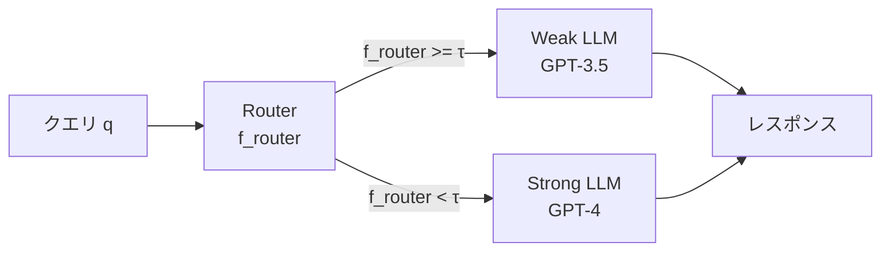

本記事は [arXiv:2404.14618 Hybrid LLM: Cost-Efficient and Quality-Aware Query Routing](https://arxiv.org/abs/2404.14618) の解説記事です。

## 論文概要（Abstract）

Hybrid LLMは、弱いが安価なモデルと強力だが高コストなモデルを組み合わせ、ルーターによってクエリごとにモデルを切り替える推論システムである。著者らは品質制約を明示的にモデル化した学習目的関数を提案し、複数のベンチマークにおいて品質低下を1%未満に抑えながら最大40%のAPIコスト削減を達成したと報告している。さらに、ルーター学習の最適条件と収束保証に関する理論的分析も提供されている。

この記事は [Zenn記事: Azure AI Foundry Model Routerで社内問い合わせBotのコストを50%削減する実装ガイド](https://zenn.dev/0h_n0/articles/3ec8fd39c09959) の深掘りです。Azure AI Foundry Model RouterのBalanced/Cost/Qualityモードの品質許容幅の概念は、Hybrid LLMの品質制約の理論に直接対応している。

## 情報源

- **arXiv ID**: 2404.14618
- **URL**: [https://arxiv.org/abs/2404.14618](https://arxiv.org/abs/2404.14618)
- **著者**: Dujian Ding, Ankur Mallick, Chi Wang, Robert Sim, Subhabrata Mukherjee, Victor Ruhle, Laks V.S. Lakshmanan, Ahmed Hassan Awadallah（University of British Columbia, Microsoft Research）
- **発表年**: 2024年（ICLR 2025に採択）
- **分野**: cs.CL, cs.LG

## 背景と動機（Background & Motivation）

LLMの推論コストは本番運用における主要なボトルネックである。GPT-4クラスのモデルはGPT-3.5と比較してトークン単価が10〜30倍高いが、すべてのクエリがGPT-4を必要とするわけではない。著者らの核心的な観察は「クエリの難易度に応じてモデルを切り替えれば、品質を維持しながらコストを大幅に削減できる」というものである。

既存手法にはいくつかの限界があった。ルールベースの分類（クエリ長、キーワードマッチング）はドメイン汎化性に欠ける。FrugalGPTのカスケード方式は強モデルの呼び出しが追加で発生するケースでコスト増になりうる。先行ルーティング研究の多くは品質制約を明示的にモデル化していない。

Hybrid LLMはこれらの課題に対し、品質制約を最適化問題に直接組み込むアプローチで解決を図っている。

## 主要な貢献（Key Contributions）

- **貢献1**: 弱モデルの出力品質を事前予測し、品質制約を満たしながらコストを最小化する「Quality-aware router」の設計
- **貢献2**: Neyman-Pearsonの補題を応用した最適ルーターの理論的条件の導出と、PAC learningフレームワークによる収束保証の証明
- **貢献3**: MMLU、GSM8K、MT-Benchを含む複数ベンチマークでの実証（品質低下1%未満、コスト40%削減）

## 技術的詳細（Technical Details）

### システム構成



ルーターはクエリを受け取り、弱モデル（Weak LLM）に送るか強モデル（Strong LLM）に送るかを2値分類で決定する。FrugalGPTのカスケードとは異なり、**1回のルーティング判断で完結する（1-pass routing）**ため、レイテンシのオーバーヘッドが小さい。

### ルーティング決定関数

ルーターの出力する予測品質スコア $f_{\text{router}}(x) \in [0, 1]$ と閾値 $\tau$ により、ルーティングが決定される。

$$
\text{route}(x) = \begin{cases} \text{Weak} & \text{if } f_{\text{router}}(x) \geq \tau \\ \text{Strong} & \text{if } f_{\text{router}}(x) < \tau \end{cases}
$$

ここで $f_{\text{router}}(x)$ は「弱モデルがクエリ $x$ に対して十分な品質の応答を生成できる確率」の予測値であり、クエリテキストのみから予測される。実際に弱モデルを呼び出すことなくルーティング判断を下す点がカスケード方式との本質的な差異である。

### 品質制約付き最適化問題

Hybrid LLMの目的関数は以下のように定式化される。

$$
\min_{\text{route}} \quad \mathbb{E}[\text{cost}(\text{route}(x))]
$$

$$
\text{subject to} \quad \mathbb{E}[\text{quality}(\text{route}(x))] \geq Q_{\text{target}}
$$

ここで $\text{cost}(\text{Weak}) \ll \text{cost}(\text{Strong})$（例: 1 vs 30）、$Q_{\text{target}}$ はユーザーが指定する品質下限である。

著者らはLagrangian緩和によりこの最適化問題を解くと、最適ルーターが品質スコアの閾値比較に帰着することを示している（Neyman-Pearsonの補題の応用）。

### 最適ルーターの理論的条件

最適ルーターの条件は以下で与えられる。

$$
\text{route}^*(x) = \text{Weak} \iff P(q_{\text{weak}}(x) \geq \tau \mid x) \cdot \Delta\text{cost} \geq \lambda \cdot \mathbb{E}[q_{\text{weak}}(x) - q_{\text{strong}}(x) \mid x]
$$

ここで $\lambda$ はラグランジュ乗数であり、品質制約の強さを制御する。$\lambda$ が大きいほど品質を重視し、強モデルへの振り分けが増加する。$\lambda$ が小さいほどコストを重視し、弱モデルへの振り分けが増加する。

この理論的結果は、Azure AI Foundry Model RouterのBalanced（$\lambda$ 中程度）、Cost（$\lambda$ 小）、Quality（$\lambda$ 大）の3モードの数学的根拠を与えている。

### Quality-Aware Training Objective

ルーターの学習は非対称なコストを持つ二値分類問題として定式化される。

- **False Positive（弱に送ったが品質不足）**: 品質ペナルティが大きい。ユーザー体験に直接影響する
- **False Negative（強に送ったが弱で十分だった）**: コストの無駄遣いだが品質は損なわない

この非対称性を反映した損失関数でDeBERTa-v3-largeをファインチューニングする。

### ルーターの実装

- **ベースモデル**: DeBERTa-v3-large（Microsoft製、高精度なテキスト分類モデル）
- **入力**: クエリテキストを直接エンコード
- **出力**: 品質スコア予測（回帰または2値分類）
- **オプティマイザ**: AdamW
- **閾値 $\tau$**: バリデーションセットで品質制約を満たしながらコスト最小化するよう選択

### アルゴリズム

```python
from dataclasses import dataclass
from enum import Enum
from typing import Protocol


class ModelTier(Enum):
    WEAK = "weak"
    STRONG = "strong"


class QualityRouter(Protocol):
    """品質予測ルーターのインターフェース"""
    def predict_weak_quality(self, query: str) -> float: ...


@dataclass
class HybridResult:
    """Hybrid LLMの推論結果"""
    answer: str
    model_tier: ModelTier
    predicted_quality: float


def hybrid_inference(
    router: QualityRouter,
    query: str,
    threshold: float,
    call_weak: callable,
    call_strong: callable,
) -> HybridResult:
    """Hybrid LLMの1-passルーティング推論。

    Args:
        router: 品質予測ルーター
        query: ユーザークエリ
        threshold: 品質閾値
        call_weak: 弱モデル呼び出し関数
        call_strong: 強モデル呼び出し関数

    Returns:
        推論結果（回答、使用モデル、予測品質スコア）
    """
    quality_score = router.predict_weak_quality(query)

    if quality_score >= threshold:
        answer = call_weak(query)
        return HybridResult(answer=answer, model_tier=ModelTier.WEAK, predicted_quality=quality_score)
    else:
        answer = call_strong(query)
        return HybridResult(answer=answer, model_tier=ModelTier.STRONG, predicted_quality=quality_score)
```

## 実装のポイント（Implementation）

- **品質評価の循環論法リスク**: GPT-4をJudgeとして品質ラベルを付与する場合、GPT-4が自身の品質を評価する循環論法のリスクがある。著者らはこの点を限界として認めている
- **分布シフトへの対応**: ルーターは学習分布外のクエリに対して品質予測精度が低下する可能性がある。本番環境では定期的なモニタリングと再学習が必要である
- **タスク固有の閾値調整**: 品質閾値 $\tau$ はタスクごとに再設定が必要であり、単一の $\tau$ で全タスクを均等にカバーすることは難しい

## 実験結果（Results）

著者らはGPT-4（強モデル）とGPT-3.5-turbo（弱モデル）のペアで評価を行っている（論文Table 1より）。

| ベンチマーク | コスト削減率 | 品質低下 |
|-------------|-------------|---------|
| MMLU | 約40% | < 1% |
| GSM8K | 約35% | < 1% |
| MT-Bench | 約40% | < 0.1点（5点満点） |
| HellaSwag | 約45% | < 1% |

MMLUでは約50-60%のクエリが弱モデル（GPT-3.5）に振り分けられた。品質予測のAUCは約0.80〜0.85と報告されている。

RouteLLMとの比較では、Hybrid LLMは品質制約を明示的にモデル化している点で安全性が高い一方、RouteLLMは嗜好データの活用により多様なモデルペアへの汎化性能に優れている。

## 実運用への応用（Practical Applications）

Hybrid LLMの品質制約モデルは、社内問い合わせBotにおいて特に有用である。人事・法務系の質問では品質低下が許容されないため、高い $Q_{\text{target}}$ を設定してほぼ全てのクエリを強モデルに送る（Azure Model RouterのQualityモードに相当）。一方、IT FAQ系の質問では若干の品質低下を許容し、コスト削減を優先する（Costモードに相当）。

Zenn記事で紹介されている「質問カテゴリ別にデプロイを分割する」パターンは、Hybrid LLMの品質閾値 $\tau$ をカテゴリごとに設定する実装に直接対応している。

## 関連研究（Related Work）

- **FrugalGPT**（Chen et al., 2023）: カスケード方式の代表的手法。Hybrid LLMとは異なり、強モデルを常に呼ぶリスクがある一方、回答品質を実際に確認してから判断する安全性がある
- **RouteLLM**（Ong et al., 2024）: 嗜好データベースで同様の問題を解くが、品質制約の明示的モデル化がない点がHybrid LLMとの差異である
- **BEST-Route**（Agarwal et al., 2025）: モデル選択とBest-of-Nサンプリングの同時最適化。Hybrid LLMの1-pass routingを拡張し、test-time computeの割り当ても最適化する

## まとめと今後の展望

Hybrid LLMは、品質制約を明示的にモデル化した1-passルーティングフレームワークにより、APIコストを40%削減しながら品質低下を1%未満に抑えることを実証した論文である。Neyman-Pearsonの補題を応用した理論的最適性の証明と、DeBERTa-v3-largeによる実用的なルーター実装の両面から貢献している。

今後の課題として、3つ以上のモデル階層への拡張（Multi-tier routing）、オンライン学習による逐次的ルーター更新、ストリーミング推論との統合が挙げられている。

## 参考文献

- **arXiv**: [https://arxiv.org/abs/2404.14618](https://arxiv.org/abs/2404.14618)
- **Related Zenn article**: [https://zenn.dev/0h_n0/articles/3ec8fd39c09959](https://zenn.dev/0h_n0/articles/3ec8fd39c09959)
