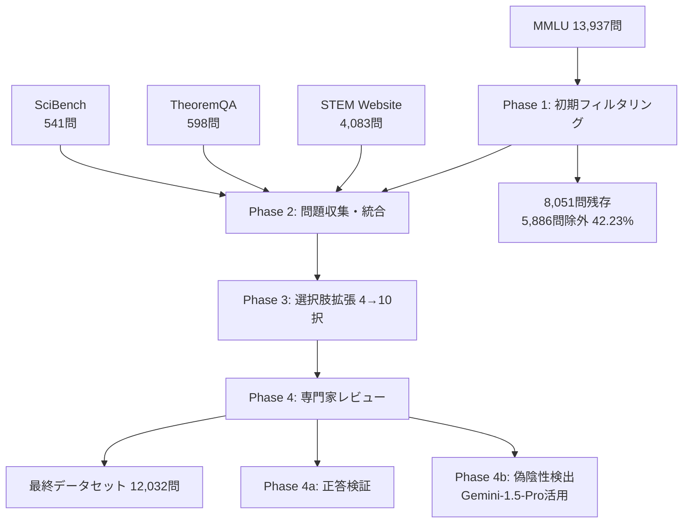

## 論文概要（Abstract）

MMLU-Pro（Massive Multitask Language Understanding Pro）は、既存のMMLUベンチマークの飽和問題・ノイズ問題・プロンプト感度問題を解決するために設計された強化版ベンチマークである。14分野12,032問で構成され、選択肢を4択から10択に拡張し、推論重視の問題を統合することで、モデル間の識別力を大幅に向上させている。著者らは、MMLUと比較して精度が16%〜33%低下し、プロンプト変動への感度が4-5%から2%に改善されたと報告している。NeurIPS 2024 Track Datasets and Benchmarks（Spotlight）に採択された。

本記事は [https://arxiv.org/abs/2406.01574](https://arxiv.org/abs/2406.01574) の解説記事です。

この記事は [Zenn記事: LLMベンチマーク完全ガイド 主要15指標の読み方と自宅で実行する方法](https://zenn.dev/0h_n0/articles/205a1900fbde2a) の深掘りです。

## 情報源

- **arXiv ID**: 2406.01574
- **URL**: [https://arxiv.org/abs/2406.01574](https://arxiv.org/abs/2406.01574)
- **著者**: Yubo Wang, Xueguang Ma, Ge Zhang, Yuansheng Ni, Abhranil Chandra, Shiguang Guo, Weiming Ren, Aaran Arulraj, Xuan He, Ziyan Jiang, Tianle Li, Max Ku, Kai Wang, Alex Zhuang, Rongqi Fan, Xiang Yue, Wenhu Chen
- **発表年**: 2024（arXiv: June 2024、NeurIPS 2024採択）
- **分野**: cs.CL（Computation and Language）
- **コード**: [https://github.com/TIGER-AI-Lab/MMLU-Pro](https://github.com/TIGER-AI-Lab/MMLU-Pro)（CC BY 4.0）

## 背景と動機（Background & Motivation）

MMLUは2020年にHendrycksらによって提案された57科目・約16,000問の4択多肢選択ベンチマークであり、LLMの知識と推論能力を測る標準指標として広く利用されてきた。しかし、GPT-4o、Claude-3-Opus、Gemini-1.5-Proといった最新のフロンティアモデルが86-87%のスコア帯に集中し、モデル間の差異を識別する能力（discriminative power）が低下している。

Wangらは、MMLUの課題を以下の3点に整理している。第一に、4択形式では偶然正答率が25%と高く、知識や推論能力が不十分なモデルでも高スコアを獲得できてしまう。第二に、元データセットにはノイズの多い問題（不正確な正答、複数正答が存在する選択肢、質の低い問題文）が含まれており、評価の信頼性を損なっている。第三に、プロンプトの微小な変更（指示文の表現変更、few-shot例の順序変更等）によってスコアが4-5%、最大で10.98%も変動するプロンプト感度問題が存在する。MMLU-Proはこれら3つの課題を同時に解決することを目指している。

## 主要な貢献（Key Contributions）

- **10択形式への拡張**: 選択肢を4択から10択に増やし、偶然正答率を25%から10%に低減。ショートカット（消去法や表層パターン）による正答を困難にした
- **推論重視問題の統合**: STEM Website、TheoremQA、SciBenchから推論を要する問題を追加し、単純な知識想起では解けない問題の比率を引き上げた
- **専門家レビューによるノイズ除去**: 不正確な正答・複数正答問題・低品質問題を体系的にフィルタリングし、元MMLUの42.23%（5,886問）を除外した
- **プロンプト頑健性の向上**: 24種類のプロンプトバリエーションで評価し、スコア変動を4-5%から2%に低減したことを実証した
- **Chain-of-Thought（CoT）推論の有効性実証**: CoTによる精度向上が顕著であることを示し、MMLU-Proが推論能力をより的確に測定することを確認した
- **50以上のモデルの包括的評価**: オープンソース・クローズドソースの主要モデルを網羅的にベンチマークした

## 技術的詳細（Technical Details）

### データセット構築パイプライン

MMLU-Proのデータセット構築は4段階のパイプラインで行われている。



**Phase 1: 初期フィルタリング**では、8つのモデル（Llama-2-7B/13B/70B、Mistral-7B、Gemma-7B、Yi-6B/34B等）で各問題を評価し、4モデル以上が正答した問題を「容易すぎる」として除外した。これにより元MMLUの13,937問から42.23%にあたる5,886問が除外され、8,051問が残存した。

**Phase 2: 問題収集・統合**では、STEM Website（4,083問）、TheoremQA（598問）、SciBench（541問）から推論重視の問題を追加した。GPT-4-Turboを用いて解答から短答形式の正答を抽出し、3つの追加ディストラクタ（誤答選択肢）を生成した。

**Phase 3: 選択肢拡張**では、GPT-4-Turboが元の4つの選択肢をもとに、もっともらしいが不正解の選択肢（ディストラクタ）を追加し、10択に拡張した。著者らは、この拡張手続きがモデルに有利に働かないことを検証している。GPT-4-Turboの精度は拡張前後で有意な差がなかったと報告されている。

**Phase 4: 専門家レビュー**は2段階で実施された。Phase 4aでは人間の専門家が正答の正確性を検証し、不適切な問題を除去した。Phase 4bではGemini-1.5-Proを用いて偽陰性（正答とされていないが実は正解である選択肢）を検出し、人間の専門家が最終判断を行った。

### データソースの構成

最終データセット12,032問のソース別構成は以下の通りである（論文Table 5より）。

| ソース | 問題数 | 割合 |
|--------|--------|------|
| MMLU（フィルタリング済） | 6,810 | 56.60% |
| STEM Website | 4,083 | 33.93% |
| TheoremQA | 598 | 4.97% |
| SciBench | 541 | 4.50% |
| **合計** | **12,032** | **100%** |

### 10択設計の理論的根拠

4択から10択への拡張は、偶然正答率 $P_{\text{chance}}$ を以下のように変化させる。

$$
P_{\text{chance}} = \frac{1}{k}
$$

ここで $k$ は選択肢数である。$k=4$ のとき $P_{\text{chance}} = 0.25$（25%）、$k=10$ のとき $P_{\text{chance}} = 0.10$（10%）となる。

この変更により、知識や推論能力が不十分なモデルがランダム推測で得られるスコアの上限が大幅に低下する。さらに、選択肢が増えることで消去法による正答が困難になり、問題の本質的な理解を要求する度合いが増す。

### Chain-of-Thought推論の効果

MMLU-ProはCoT推論の有効性が顕著に表れる設計となっている。以下にCoTと直接回答（Direct Answering, DA）の比較を示す（論文Table 3より）。

| モデル | MMLU CoT | MMLU DA | MMLU差分 | MMLU-Pro CoT | MMLU-Pro DA | MMLU-Pro差分 |
|--------|----------|---------|----------|--------------|-------------|--------------|
| GPT-4o | 88.7% | 87.2% | +1.5% | 72.6% | 53.5% | **+19.1%** |
| GPT-4-Turbo | 86.5% | 86.7% | -0.2% | 63.7% | 48.4% | **+15.3%** |
| Phi3-medium-4k | 79.4% | 78.0% | +1.4% | 55.7% | 47.5% | +8.2% |
| Llama-3-8B | 62.7% | 66.6% | -3.9% | 35.4% | 31.5% | +3.9% |
| Gemma-7B | 62.4% | 66.0% | -3.6% | 33.7% | 27.0% | +6.7% |

MMLUではCoTの効果が-3.9%〜+1.5%と限定的であるのに対し、MMLU-ProではCoTにより+3.9%〜+19.1%の精度向上が観察される。GPT-4oでは19.1ポイントの改善が報告されており、MMLU-Proの問題が単なる知識想起ではなく多段階の推論を要求していることを示している。

## 実装のポイント（Implementation）

### lm-evaluation-harnessによる評価実行

MMLU-Proは[EleutherAI/lm-evaluation-harness](https://github.com/EleutherAI/lm-evaluation-harness)に公式タスクとして組み込まれている。以下の手順で評価を実行できる。

```bash
# lm-evaluation-harnessのインストール
git clone --depth 1 https://github.com/EleutherAI/lm-evaluation-harness
cd lm-evaluation-harness
pip install -e .

# MMLU-Pro全科目の評価（5-shot CoT推奨）
lm-eval --model hf \
  --model_args pretrained=meta-llama/Llama-3-8B-Instruct \
  --tasks mmlu_pro \
  --num_fewshot 5 \
  --apply_chat_template \
  --batch_size auto \
  --output_path results/
```

タスク設定の主要パラメータは以下の通りである。

| パラメータ | 値 | 備考 |
|-----------|-----|------|
| `max_length` | 8192 | 10択+CoTで長いコンテキストが必要 |
| `max_gen_toks` | 2048 | CoT推論の出力長 |
| `stop_sequence` | `"Question:"` | few-shot間の区切り |
| `num_fewshot` | 5 | 論文推奨のfew-shot数 |

### 公式リポジトリでの評価

TIGER-AI-Labの[公式リポジトリ](https://github.com/TIGER-AI-Lab/MMLU-Pro)でも評価スクリプトが提供されている。

```bash
# 公式スクリプトによるローカルモデル評価
cd scripts/examples/
sh eval_llama_2_7b.sh

# API経由の評価（OpenAI互換エンドポイント）
python evaluate_from_apiX.py \
  --url "http://127.0.0.1:8001/v1" \
  -m "model-name" \
  -n 48 \
  -o "eval_results/"

# 精度計算
python compute_accuracy.py results/model-name/CoT/all/
```

### 科目別評価

個別科目の評価も可能である。14科目それぞれに`mmlu_pro_biology`、`mmlu_pro_math`等の個別タスクが用意されている。モデルの強み・弱みを分野別に分析する際に有用である。

```bash
# 数学のみ評価
lm-eval --model hf \
  --model_args pretrained=meta-llama/Llama-3-8B-Instruct \
  --tasks mmlu_pro_math \
  --num_fewshot 5 \
  --apply_chat_template
```

## Production Deployment Guide

LLMベンチマーク評価パイプラインをAWS上に構築し、MMLU-Proを含む複数ベンチマークでモデルを定期評価するための実践ガイドを以下に示す。コスト試算は2026年4月時点のap-northeast-1（東京リージョン）料金に基づく概算値であり、実際のコストはトラフィックパターン、評価頻度、モデルサイズにより変動する。最新料金はAWS料金計算ツールで確認を推奨する。

### AWS実装パターン（コスト最適化重視）

#### Small構成（月1-2回評価、1-3モデル）: Serverless

| サービス | 用途 | 月額概算 |
|----------|------|----------|
| Lambda | 評価ジョブのオーケストレーション | $5-10 |
| Amazon Bedrock | LLM推論（API経由モデル評価） | $30-80 |
| DynamoDB (On-Demand) | 評価結果・メトリクス保存 | $5-10 |
| S3 | 評価ログ・レポート保存 | $1-3 |
| CloudWatch | ログ・メトリクス | $5-10 |
| **合計** | | **$46-113/月** |

Lambda関数でlm-evaluation-harnessの評価ジョブを起動し、DynamoDBに結果を永続化する。Bedrockを通じたAPI経由のモデル評価に適しており、ローカルモデルの評価には不向きである。評価頻度が低い場合のコスト効率が高い。

#### Medium構成（週1回評価、5-10モデル）: ECS Fargate + GPU

| サービス | 用途 | 月額概算 |
|----------|------|----------|
| ECS Fargate (4 vCPU, 16GB) | 評価ハーネス実行 | $80-120 |
| Amazon Bedrock | API経由モデル評価 | $150-400 |
| SageMaker Inference | ローカルモデルホスティング | $200-500 |
| ElastiCache (Redis) | 評価結果キャッシュ | $50-80 |
| S3 | モデルアーティファクト・ログ | $10-20 |
| CloudWatch + X-Ray | 監視・トレーシング | $15-25 |
| **合計** | | **$505-1,145/月** |

ECS Fargateで評価ハーネスを実行し、SageMakerでローカルモデルをホスティングする。週次評価のスケジュールジョブとしてEventBridgeから起動し、評価完了後にFargateタスクを自動停止することでコストを最適化する。

#### Large構成（日次評価、10+モデル）: EKS + Karpenter + GPU

| サービス | 用途 | 月額概算 |
|----------|------|----------|
| EKS Control Plane | クラスタ管理 | $73 |
| EC2 Spot (g5.xlarge x 2-4) | GPU評価ワーカー | $400-800 |
| EC2 Spot (m6i.xlarge x 2) | CPUワーカー（前処理） | $60-120 |
| Amazon Bedrock | API経由モデル評価 | $800-2,000 |
| S3 + EFS | モデル・データ共有ストレージ | $30-60 |
| ElastiCache (Redis Cluster) | 分散結果キャッシュ | $150-250 |
| ALB + WAF | ダッシュボードアクセス | $50-80 |
| CloudWatch + X-Ray + Budgets | 監視・コスト管理 | $30-50 |
| **合計** | | **$1,593-3,433/月** |

Karpenterによる自動スケーリングでGPU Spot Instancesを優先的に使用し、On-Demand比で最大70%のコスト削減を実現する。日次の定期評価と新モデルリリース時のオンデマンド評価の両方に対応する。

### Terraformインフラコード

#### Small構成（Serverless）

```hcl
# LLM Benchmark Pipeline - Small構成 (Lambda + Bedrock + DynamoDB)
# 2026年4月時点 ap-northeast-1

terraform {
  required_version = ">= 1.9"
  required_providers {
    aws = {
      source  = "hashicorp/aws"
      version = "~> 5.80"
    }
  }
}

provider "aws" {
  region = "ap-northeast-1"
}

# DynamoDB: 評価結果保存（On-Demandでコスト最適化）
resource "aws_dynamodb_table" "benchmark_results" {
  name         = "llm-benchmark-results"
  billing_mode = "PAY_PER_REQUEST"
  hash_key     = "model_id"
  range_key    = "eval_timestamp"

  attribute {
    name = "model_id"
    type = "S"
  }
  attribute {
    name = "eval_timestamp"
    type = "S"
  }

  ttl {
    attribute_name = "expires_at"
    enabled        = true
  }

  server_side_encryption {
    enabled = true
  }

  tags = {
    Project = "llm-benchmark"
    Env     = "production"
  }
}

# S3: 評価ログ・詳細レポート保存
resource "aws_s3_bucket" "benchmark_reports" {
  bucket = "llm-benchmark-reports-${data.aws_caller_identity.current.account_id}"

  tags = {
    Project = "llm-benchmark"
  }
}

resource "aws_s3_bucket_lifecycle_configuration" "reports_lifecycle" {
  bucket = aws_s3_bucket.benchmark_reports.id

  rule {
    id     = "archive-old-reports"
    status = "Enabled"
    transition {
      days          = 90
      storage_class = "GLACIER"
    }
    expiration {
      days = 365
    }
  }
}

data "aws_caller_identity" "current" {}

# IAMロール: Lambda用（最小権限）
resource "aws_iam_role" "lambda_benchmark" {
  name = "llm-benchmark-lambda-role"
  assume_role_policy = jsonencode({
    Version = "2012-10-17"
    Statement = [{
      Action = "sts:AssumeRole"
      Effect = "Allow"
      Principal = { Service = "lambda.amazonaws.com" }
    }]
  })
}

resource "aws_iam_role_policy" "lambda_benchmark_policy" {
  name = "llm-benchmark-lambda-policy"
  role = aws_iam_role.lambda_benchmark.id
  policy = jsonencode({
    Version = "2012-10-17"
    Statement = [
      {
        Effect   = "Allow"
        Action   = ["bedrock:InvokeModel"]
        Resource = "arn:aws:bedrock:ap-northeast-1::foundation-model/*"
      },
      {
        Effect = "Allow"
        Action = [
          "dynamodb:PutItem",
          "dynamodb:GetItem",
          "dynamodb:Query",
          "dynamodb:UpdateItem"
        ]
        Resource = aws_dynamodb_table.benchmark_results.arn
      },
      {
        Effect = "Allow"
        Action = [
          "s3:PutObject",
          "s3:GetObject"
        ]
        Resource = "${aws_s3_bucket.benchmark_reports.arn}/*"
      },
      {
        Effect = "Allow"
        Action = [
          "logs:CreateLogGroup",
          "logs:CreateLogStream",
          "logs:PutLogEvents"
        ]
        Resource = "arn:aws:logs:ap-northeast-1:*:*"
      }
    ]
  })
}

# Lambda関数: ベンチマーク評価オーケストレーター
resource "aws_lambda_function" "benchmark_runner" {
  function_name = "llm-benchmark-runner"
  runtime       = "python3.12"
  handler       = "handler.lambda_handler"
  role          = aws_iam_role.lambda_benchmark.arn
  timeout       = 900 # 15分（MMLU-Pro全問評価の最大時間）
  memory_size   = 1024

  environment {
    variables = {
      DYNAMODB_TABLE  = aws_dynamodb_table.benchmark_results.name
      S3_BUCKET       = aws_s3_bucket.benchmark_reports.id
      BENCHMARK_TASKS = "mmlu_pro"
      NUM_FEWSHOT     = "5"
    }
  }

  tracing_config {
    mode = "Active" # X-Ray有効化
  }

  tags = {
    Project = "llm-benchmark"
  }

  filename = "lambda.zip"
}

# EventBridge: 月次スケジュール実行
resource "aws_cloudwatch_event_rule" "monthly_eval" {
  name                = "llm-benchmark-monthly"
  description         = "月次LLMベンチマーク評価"
  schedule_expression = "cron(0 15 1 * ? *)" # 毎月1日 00:00 JST
}

resource "aws_cloudwatch_event_target" "invoke_benchmark" {
  rule = aws_cloudwatch_event_rule.monthly_eval.name
  arn  = aws_lambda_function.benchmark_runner.arn
}

resource "aws_lambda_permission" "allow_eventbridge" {
  statement_id  = "AllowEventBridge"
  action        = "lambda:InvokeFunction"
  function_name = aws_lambda_function.benchmark_runner.function_name
  principal     = "events.amazonaws.com"
  source_arn    = aws_cloudwatch_event_rule.monthly_eval.arn
}

# CloudWatch アラーム: 評価実行異常検知
resource "aws_cloudwatch_metric_alarm" "benchmark_errors" {
  alarm_name          = "llm-benchmark-errors"
  comparison_operator = "GreaterThanThreshold"
  evaluation_periods  = 1
  metric_name         = "Errors"
  namespace           = "AWS/Lambda"
  period              = 300
  statistic           = "Sum"
  threshold           = 0
  alarm_description   = "ベンチマーク評価Lambda関数のエラー検知"

  dimensions = {
    FunctionName = aws_lambda_function.benchmark_runner.function_name
  }
}
```

#### Large構成（EKS + Karpenter + GPU）

```hcl
# LLM Benchmark Pipeline - Large構成 (EKS + Karpenter + GPU Spot)

module "eks" {
  source  = "terraform-aws-modules/eks/aws"
  version = "~> 20.31"

  cluster_name    = "llm-benchmark-cluster"
  cluster_version = "1.31"

  vpc_id     = module.vpc.vpc_id
  subnet_ids = module.vpc.private_subnets

  cluster_endpoint_public_access = false

  eks_managed_node_groups = {
    system = {
      instance_types = ["m6i.large"]
      min_size       = 1
      max_size       = 2
      desired_size   = 1
      labels         = { role = "system" }
    }
  }

  tags = {
    Project = "llm-benchmark"
    Env     = "production"
  }
}

# Karpenter: GPU Spot優先の自動スケーリング
resource "kubectl_manifest" "karpenter_nodepool_gpu" {
  yaml_body = yamlencode({
    apiVersion = "karpenter.sh/v1"
    kind       = "NodePool"
    metadata   = { name = "benchmark-gpu-workers" }
    spec = {
      template = {
        spec = {
          requirements = [
            { key = "karpenter.sh/capacity-type", operator = "In", values = ["spot", "on-demand"] },
            { key = "node.kubernetes.io/instance-type", operator = "In",
              values = ["g5.xlarge", "g5.2xlarge", "g6.xlarge"] },
          ]
          nodeClassRef = { name = "default" }
          taints = [
            { key = "nvidia.com/gpu", effect = "NoSchedule" }
          ]
        }
      }
      limits   = { cpu = "64", memory = "256Gi", "nvidia.com/gpu" = "8" }
      disruption = {
        consolidationPolicy = "WhenEmptyOrUnderutilized"
        consolidateAfter    = "60s"
      }
    }
  })
}

# Karpenter: CPU ワーカー（前処理・結果集約）
resource "kubectl_manifest" "karpenter_nodepool_cpu" {
  yaml_body = yamlencode({
    apiVersion = "karpenter.sh/v1"
    kind       = "NodePool"
    metadata   = { name = "benchmark-cpu-workers" }
    spec = {
      template = {
        spec = {
          requirements = [
            { key = "karpenter.sh/capacity-type", operator = "In", values = ["spot", "on-demand"] },
            { key = "node.kubernetes.io/instance-type", operator = "In",
              values = ["m6i.xlarge", "m6a.xlarge", "m5.xlarge"] },
          ]
          nodeClassRef = { name = "default" }
        }
      }
      limits   = { cpu = "32", memory = "128Gi" }
      disruption = {
        consolidationPolicy = "WhenEmptyOrUnderutilized"
        consolidateAfter    = "30s"
      }
    }
  })
}

# AWS Budgets: 月額予算アラート
resource "aws_budgets_budget" "benchmark_budget" {
  name         = "llm-benchmark-monthly"
  budget_type  = "COST"
  limit_amount = "3500"
  limit_unit   = "USD"
  time_unit    = "MONTHLY"

  notification {
    comparison_operator       = "GREATER_THAN"
    threshold                 = 80
    threshold_type            = "PERCENTAGE"
    notification_type         = "ACTUAL"
    subscriber_email_addresses = ["alerts@example.com"]
  }
}
```

### 運用・監視設定

#### CloudWatch Logs Insights クエリ

```
# ベンチマーク評価のモデル別精度トレンド（日次）
fields @timestamp, model_id, benchmark, accuracy
| filter event = "benchmark_result"
| stats avg(accuracy) as avg_accuracy by model_id, benchmark, bin(1d)
| sort model_id, benchmark

# Bedrockトークン使用量とレイテンシ分析
fields @timestamp, duration_ms, input_tokens, output_tokens, model_id
| filter event = "bedrock_invoke"
| stats avg(duration_ms) as avg_latency,
        pct(duration_ms, 95) as p95_latency,
        pct(duration_ms, 99) as p99_latency,
        sum(input_tokens) as total_input,
        sum(output_tokens) as total_output
  by model_id, bin(1h)
```

#### CloudWatch アラーム設定

```python
import boto3

cloudwatch = boto3.client("cloudwatch", region_name="ap-northeast-1")


def create_benchmark_alarms(sns_topic_arn: str) -> None:
    """LLMベンチマーク評価パイプライン用CloudWatchアラームを設定

    評価ジョブの失敗検知とBedrock呼び出しスパイクを監視する。

    Args:
        sns_topic_arn: 通知先SNSトピックのARN
    """
    # 評価ジョブ実行時間の異常検知
    cloudwatch.put_metric_alarm(
        AlarmName="benchmark-job-timeout",
        MetricName="Duration",
        Namespace="AWS/Lambda",
        Statistic="Maximum",
        Period=300,
        EvaluationPeriods=1,
        Threshold=840000,  # 14分（15分タイムアウトの93%）
        ComparisonOperator="GreaterThanThreshold",
        AlarmActions=[sns_topic_arn],
        AlarmDescription="ベンチマーク評価ジョブが14分を超過",
    )

    # Bedrock呼び出しエラー率の監視
    cloudwatch.put_metric_alarm(
        AlarmName="benchmark-bedrock-errors",
        MetricName="InvocationClientErrors",
        Namespace="AWS/Bedrock",
        Statistic="Sum",
        Period=600,
        EvaluationPeriods=2,
        Threshold=10,
        ComparisonOperator="GreaterThanThreshold",
        AlarmActions=[sns_topic_arn],
        AlarmDescription="Bedrock呼び出しエラーが10分間で10回を超過",
    )
```

#### X-Ray トレーシング設定

```python
from aws_xray_sdk.core import xray_recorder, patch_all

# boto3を含む全ライブラリの自動計装
patch_all()


def trace_benchmark_eval(
    model_id: str, benchmark: str, num_questions: int
) -> None:
    """ベンチマーク評価の各ステップをX-Rayでトレース

    Args:
        model_id: 評価対象モデルのID
        benchmark: ベンチマーク名（例: "mmlu_pro"）
        num_questions: 評価問題数
    """
    subsegment = xray_recorder.begin_subsegment(f"eval_{benchmark}")
    subsegment.put_annotation("model_id", model_id)
    subsegment.put_annotation("benchmark", benchmark)
    subsegment.put_metadata("num_questions", num_questions)
    xray_recorder.end_subsegment()
```

### コスト最適化チェックリスト

- [ ] **Spot Instance活用**: GPU評価ワーカーはSpot優先（On-Demand比60-70%削減）
- [ ] **評価ジョブのスケジューリング**: 深夜帯（Spot価格が安定する時間帯）に実行
- [ ] **結果キャッシュ**: 同一モデル・同一ベンチマークの再評価を防止（Redis/DynamoDB）
- [ ] **S3ライフサイクル**: 90日経過した評価ログをGlacierに移行
- [ ] **Bedrock Provisioned Throughput**: 大量評価時はオンデマンドよりPT契約が安価になる場合がある
- [ ] **AWS Budgets**: 月額予算の80%到達で自動アラート
- [ ] **タスクの分割実行**: MMLU-Pro 14科目を並列評価し、GPU利用効率を最大化
- [ ] **モデルキャッシュ**: EFSにモデルウェイトを永続化し、ダウンロード時間を削減
- [ ] **不要リソースの自動停止**: Karpenterの`consolidationPolicy`で未使用ノードを30-60秒で回収

## 実験結果（Experimental Results）

### 主要モデルの性能比較

著者らは50以上のモデルを評価している。主要モデルのMMLU-Pro CoTスコアを以下に示す（論文Table 2より）。

| モデル | Overall | Math | Physics | Engineering | History | Law | Psychology |
|--------|---------|------|---------|-------------|---------|-----|------------|
| GPT-4o | 72.6% | 76.1% | 74.7% | 55.0% | 70.1% | 51.0% | 79.2% |
| Gemini-1.5-Pro | 69.0% | 72.8% | 70.4% | 48.7% | 65.6% | 50.8% | 77.2% |
| Claude-3-Opus | 68.5% | 69.6% | 69.7% | 48.4% | 61.4% | 53.5% | 76.3% |
| GPT-4-Turbo | 63.7% | 62.8% | 61.0% | 35.9% | 67.7% | 51.2% | 78.3% |
| Gemini-1.5-Flash | 59.1% | 59.6% | 61.2% | 44.2% | 53.8% | 37.3% | 70.1% |
| Claude-3-Sonnet | 56.8% | 49.0% | 53.1% | 40.5% | 57.2% | 42.7% | 72.2% |
| Llama-3-70B-Instruct | 56.2% | 54.0% | 49.6% | 43.6% | 56.9% | 39.9% | 70.2% |

MMLUでは86-87%帯に集中していた上位モデル群が、MMLU-Proでは56.2%〜72.6%と16ポイント以上のスプレッドに拡散しており、ベンチマークとしての識別力が向上している。特にEngineering分野は全モデルで低スコアとなっており、実践的な工学問題の難易度の高さが反映されている。

### エラー分析

著者らはGPT-4o（当時の最高性能モデル）の誤答120件を分析し、以下のカテゴリに分類している。

| エラーカテゴリ | 割合 | 説明 |
|---------------|------|------|
| 推論エラー | 39% | 正しい知識を持ちながら論理的推論で誤りを犯す |
| 知識不足 | 35% | 特定分野の専門知識が欠如 |
| 計算エラー | 12% | 正しい公式を適用するが数値計算で誤る |
| その他 | 14% | 回答未選択(5%)、問題理解エラー(4%)、生成異常(2%)、アノテーションエラー(2%)、回答抽出エラー(1%) |

推論エラーが最大カテゴリであることは、MMLU-Proが単純な知識想起ではなく推論プロセスを評価するベンチマークとして機能していることを示唆している。

## 実運用への応用

### モデル選定での活用

MMLU-Proは以下のシナリオでモデル選定に活用できる。

**科目別スコアによる用途マッチング**: 14科目の個別スコアを参照することで、特定ドメイン（法律、医療、STEM等）に最適なモデルを選定できる。例えば法律分野ではClaude-3-Opus（53.5%）がGPT-4o（51.0%）を上回っており、用途によって最適なモデルが異なることが分かる。

**CoT推論能力の評価**: CoTと直接回答のスコア差を確認することで、モデルの推論能力を把握できる。推論が重要なアプリケーション（コード生成、数学問題解決等）では、CoTでの改善幅が大きいモデルが有利となる。

**プロンプト頑健性の確認**: MMLU-Proのスコアはプロンプトの微小な変更に対して安定しているため、本番環境でのプロンプト変更がスコアに与える影響を予測しやすい。MMLUでは4-5%の変動があったものが、MMLU-Proでは2%程度に抑えられている。

**ベンチマーク飽和への対策**: MMLUで86-87%に集中して差がつかなくなったモデル群を、MMLU-Proで再度ランキングすることで、継続的なモデル改善の進捗を追跡できる。

## 関連研究

MMLU-Proは、LLM評価ベンチマークの系譜に位置づけられる。**MMLU**（Hendrycks et al., 2020）は57科目のマルチタスク評価を確立したが、前述の飽和・ノイズ問題を抱える。**GPQA**（Rein et al., 2023）は大学院レベルの専門家でも困難な問題セットを提供するが、問題数が限定的である。**BIG-Bench**（Srivastava et al., 2023）は200以上のタスクで網羅性は高いが、難易度のばらつきが大きい。**ARC**（Clark et al., 2018）は科学問題に特化し、**HellaSwag**（Zellers et al., 2019）は常識推論に焦点を当てている。MMLU-Proは、MMLUの14分野の幅広いカバレッジを維持しつつ、10択形式と推論重視問題の導入によって識別力と頑健性を両立させた点に新規性がある。

## まとめと今後の展望

MMLU-Proは、MMLUの3つの根本的課題（飽和、ノイズ、プロンプト感度）を、10択拡張・推論重視問題統合・専門家レビューによるノイズ除去の3つのアプローチで解決した。50以上のモデルの評価により、精度の16-33%低下とプロンプト感度の大幅改善が実証されており、次世代LLM評価の有力な標準指標となりつつある。

一方で、著者らは多肢選択形式という制約が自由記述評価と比べて理解度の完全な測定には限界があることを認めている。また、マルチモーダルモデルの評価には対応しておらず、視覚・聴覚を含む統合的な能力測定は今後の課題として残されている。LLMの能力向上に伴い、MMLU-Proもいずれ飽和する可能性があるが、その時期と対応策は今後の研究に委ねられている。

## 参考文献

1. Wang, Y. et al. (2024). "MMLU-Pro: A More Robust and Challenging Multi-Task Language Understanding Benchmark." *NeurIPS 2024 Datasets and Benchmarks (Spotlight)*. arXiv:2406.01574.
2. Hendrycks, D. et al. (2020). "Measuring Massive Multitask Language Understanding." *ICLR 2021*. arXiv:2009.03300.
3. Rein, D. et al. (2023). "GPQA: A Graduate-Level Google-Proof Q&A Benchmark." arXiv:2311.12022.
4. Srivastava, A. et al. (2023). "Beyond the Imitation Game: Quantifying and extrapolating the capabilities of language models." *TMLR 2023*.
5. Clark, P. et al. (2018). "Think you have Solved Question Answering? Try ARC." arXiv:1803.05457.
6. Zellers, R. et al. (2019). "HellaSwag: Can a Machine Really Finish Your Sentence?" *ACL 2019*.
7. Wei, J. et al. (2022). "Chain-of-Thought Prompting Elicits Reasoning in Large Language Models." *NeurIPS 2022*. arXiv:2201.11903.
