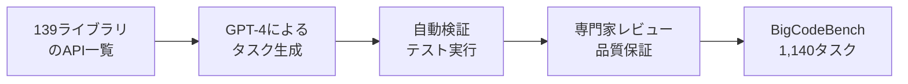

本記事は [BigCodeBench: Benchmarking Code Generation with Diverse Function Calls and Complex Instructions](https://arxiv.org/abs/2406.11931)（Zhuo et al., 2024）の解説記事です。

## 論文概要（Abstract）

BigCodeBenchは、HumanEvalの飽和問題に対処するために設計されたコード生成ベンチマークである。従来のベンチマークが自己完結的なアルゴリズム問題に限定されていたのに対し、BigCodeBenchは139の実用ライブラリ（NumPy、Pandas、requests等）から7,500以上のAPI呼び出しを組み合わせた1,140タスクで構成される。タスクはGPT-4を用いて生成した後、専門家がレビューするhuman-in-the-loop方式で品質を保証している。著者らは60以上のモデルを評価し、HumanEvalで高スコアを記録するモデルでもBigCodeBenchでは大幅にスコアが低下することを実証している。

この記事は [Zenn記事: SWE-Bench Proから自作評価まで LLMコーディングベンチマーク実践ガイド](https://zenn.dev/0h_n0/articles/e1722937bd269a) の深掘りです。

## 情報源

- **arXiv ID**: 2406.11931
- **URL**: [https://arxiv.org/abs/2406.11931](https://arxiv.org/abs/2406.11931)
- **著者**: Terry Yue Zhuo, Minh Chien Vu, Jenny Chim, Han Hu, Wenhao Yu, Ratnadira Widyasari, Imam Nur Bani Yusuf, Haolan Zhan, Junda He, Indraneil Paul, Simon Brunner, Chen Gong, Thong Hoang, Armel Randy Zebaze, Xiaoheng Hong, Wen-Ding Li, Jean Kaddour, Ming Xu, Zhihan Zhang, Prateek Yadav, Naman Jain, Alex Gu, Zhoujun Cheng, Jiawei Liu, Qian Liu, Zijian Wang, David Lo, Binyuan Hui, Niklas Muennighoff, Daniel Fried, Xiaoning Du, Harm de Vries, Leandro Von Werra（BigCode Project）
- **発表年**: 2024年
- **分野**: cs.SE, cs.AI, cs.CL
- **コード**: [bigcode-project/bigcodebench](https://github.com/bigcode-project/bigcodebench)（CC BY 4.0 License）

## 背景と動機（Background & Motivation）

2024年時点で、HumanEval（164問）はフロンティアモデルがpass@1で95%以上を記録し、モデル間の差別化が困難な「飽和」状態に達していた。BenchLM.aiの分析ではコーディングカテゴリが「フロンティアモデルを分離する最もクリーンなカテゴリの一つ」とされているが、これはHumanEvalのような旧世代ベンチマークではなく、新世代ベンチマークでの話である。

HumanEvalの根本的な問題は、タスクがアルゴリズム的な**単関数生成**に限定されている点にある。実務のPythonプログラミングでは、NumPy・Pandas・scikit-learn・requests・SQLAlchemy等の多様なライブラリを組み合わせてタスクを遂行する。こうした「ライブラリ統合能力」を測定するベンチマークが不在であった。

著者らは「実務的なPythonプログラミング能力を、多様なライブラリ呼び出しと複雑な指示の下で評価する」ことを目標にBigCodeBenchを設計した。

## 主要な貢献（Key Contributions）

- **貢献1**: 139ライブラリから7,500以上のAPI呼び出しを含む1,140タスクを構築し、HumanEvalの約7倍の規模と質的に異なる難易度の評価セットを提供した
- **貢献2**: GPT-4生成 + 専門家レビューのhuman-in-the-loop方式により、自動生成の効率と人手検証の品質を両立するタスク構築パイプラインを確立した
- **貢献3**: 「プログラマティックな指示」（関数シグネチャ+docstring）と「自然言語の指示」（BigCodeBench-Instruct）の2形式による評価を提供し、指示形式の違いがスコアに与える影響を定量化した

## 技術的詳細（Technical Details）

### タスク構築パイプライン

BigCodeBenchのタスク構築は、自動生成と人手検証を組み合わせた3段階で行われる。



1. **シード生成**: 139ライブラリのAPIドキュメントからGPT-4が問題文・解答コード・テストケースを生成する
2. **自動検証**: 生成されたテストケースをDocker sandbox内で実行し、解答コードが全テストをパスすることを確認する
3. **専門家レビュー**: 人間の開発者が問題文の明確性、テストケースの網羅性、解答の正しさを検証する

### 対象ライブラリの分布

BigCodeBenchは7つのドメインにまたがる139ライブラリをカバーしている（論文Table 1より）。

| ドメイン | 代表的なライブラリ | タスク数の割合 |
|:--|:--|:--|
| データ分析 | pandas, numpy, scipy | 約30% |
| 可視化 | matplotlib, seaborn, plotly | 約15% |
| Web/ネットワーク | requests, flask, beautifulsoup4 | 約12% |
| 機械学習 | scikit-learn, torch, tensorflow | 約10% |
| ファイル操作 | os, pathlib, shutil, csv | 約12% |
| テキスト処理 | re, json, xml, yaml | 約10% |
| その他 | datetime, collections, itertools等 | 約11% |

### 2つの評価形式

BigCodeBenchは同一タスクに対して2つの指示形式を提供する。

**BigCodeBench-Complete**（プログラマティック指示）:
```python
def task_123(data: pd.DataFrame) -> dict:
    """Given a DataFrame with columns 'name', 'age', 'salary',
    compute the mean salary grouped by age bracket (10-year intervals).
    
    Returns:
        dict mapping age bracket strings to mean salaries.
    
    Example:
        >>> df = pd.DataFrame({'name': ['A','B'], 'age': [25,35], 'salary': [50000,70000]})
        >>> task_123(df)
        {'20-29': 50000.0, '30-39': 70000.0}
    """
```

**BigCodeBench-Instruct**（自然言語指示）:
```
Write a Python function that takes a pandas DataFrame with columns
'name', 'age', and 'salary', and computes the mean salary grouped
by 10-year age brackets. Return the result as a dictionary.
```

著者らの実験では、BigCodeBench-InstructのスコアはBigCodeBench-Completeよりも一貫して低く、「自然言語からの関数仕様の解釈」という追加の認知負荷がモデルの性能に影響することが示されている。

### 評価指標

BigCodeBenchでもpass@1を主要指標として使用する。HumanEvalと同じく、Chen et al. (2021) の不偏推定量に準拠する。

$$
\text{pass@}k = 1 - \frac{\binom{n-c}{k}}{\binom{n}{k}}
$$

ただし、BigCodeBenchではテストケースの数が多いため（タスクあたり平均5.6個）、部分的な正解を許容する**部分スコア**は導入していない。全テストケースをパスした場合のみ正解と判定される。

### Docker Sandboxによる安全な評価

BigCodeBenchのテスト実行はDocker sandbox内で行われる。ライブラリの依存関係は`requirements.txt`で固定されており、バージョン不一致によるテスト破損を防止する。

```python
def evaluate_bigcodebench(
    model_output: str,
    task: dict,
    timeout: int = 60,
) -> bool:
    """BigCodeBenchタスクの評価

    Args:
        model_output: モデルが生成したPythonコード
        task: タスク定義（問題文、テストケース、依存関係）
        timeout: テスト実行のタイムアウト（秒）

    Returns:
        全テストケースをパスしたかどうか
    """
    sandbox = DockerSandbox(
        image="bigcodebench/sandbox:latest",
        requirements=task["requirements"],
    )

    combined_code = model_output + "\n\n" + task["test_code"]

    result = sandbox.execute(
        code=combined_code,
        timeout=timeout,
    )

    return result.exit_code == 0 and result.tests_passed == result.tests_total
```

## 実装のポイント（Implementation）

**ライブラリバージョンの固定**: BigCodeBenchの最大の技術的課題は、139ライブラリのバージョン互換性の維持である。ライブラリのアップデートによりAPIが変更されると、テストが破損するリスクがある。著者らはDocker イメージにバージョンを固定した環境を事前構築している。

**sandbox-evalツール**: 評価には`bigcodebench`パッケージが提供する`sandbox-eval`コマンドを使用する。HuggingFace Datasets経由でタスクを取得し、Docker内で安全にテストを実行する。

**GPT-4生成バイアス**: タスクがGPT-4で生成されているため、GPT-4ファミリーのモデルが有利になる可能性がある。著者らはこの点を認識しつつ、人手レビューによるバイアス軽減を行ったと述べている。

**依存関係の複雑さ**: 一部のタスクは複数ライブラリの複合的な利用を要求する。例えば「requestsでAPIを叩き、pandasでデータ加工し、matplotlibで可視化」のような横断的タスクでは、各ライブラリのAPI知識に加えてデータフローの設計能力が問われる。

## 実験結果（Results）

著者らは60以上のモデルを評価している。以下は主要モデルのBigCodeBench-Complete pass@1スコアである（論文Figure 4より）。

| モデル | BigCodeBench-Complete pass@1 | HumanEval pass@1 | 差分 |
|:--|:--|:--|:--|
| GPT-4o | 61.2% | 90.2% | -29.0pt |
| Claude 3.5 Sonnet | 56.8% | 92.0% | -35.2pt |
| GPT-4-Turbo | 55.1% | 87.1% | -32.0pt |
| Llama 3 70B | 42.3% | 81.7% | -39.4pt |
| CodeLlama 34B | 28.6% | 62.2% | -33.6pt |
| StarCoder2 15B | 24.1% | 46.3% | -22.2pt |

**HumanEvalとのスコアギャップ**: 全モデルでBigCodeBenchのスコアはHumanEvalより大幅に低い。この差はBigCodeBenchが要求する「ライブラリ知識」と「複合的なタスク遂行能力」がHumanEvalでは測定されていないことを示している。著者らは「HumanEvalのスコアだけでモデルの実務的なコーディング能力を判断すべきではない」と結論づけている。

**BigCodeBench-Complete vs Instruct**: BigCodeBench-Instruct（自然言語指示）のスコアは、Complete（関数シグネチャ指示）と比較して平均10-15%ポイント低い。著者らは「自然言語からの仕様解釈は、コード生成とは異なる能力を要求する」と分析している。

**オープンソースモデルのギャップ**: Llama 3 70BとGPT-4oの間には約19%ポイントの差がある。実務的なライブラリ活用能力では、オープンソースモデルとクローズドソースモデルの差がアルゴリズム問題よりも顕著に表れている。

## 実運用への応用（Practical Applications）

**自社コーディングアシスタントの評価**: BigCodeBenchの設計は、自社で使用するライブラリに特化した評価セットの構築に応用できる。例えば社内のAPI呼び出しパターンを収集し、タスクとテストケースを構築することで、コーディングアシスタントの実務適合性を測定できる。

**モデル選定の判断基準**: HumanEvalでは差別化が困難なフロンティアモデル間の比較に、BigCodeBenchは有効な追加指標となる。Zenn記事で紹介したPromptfooでBigCodeBenchのタスクを流用し、自社環境での横並び比較が可能である。

**教育・学習への活用**: 139ライブラリにまたがるタスクセットは、プログラミング学習のカリキュラム設計にも参考になる。ドメイン別のスコアを分析することで、学習者の弱点を特定できる。

## 関連研究（Related Work）

- **HumanEval（Chen et al., 2021）**: 164問の単関数生成タスク。BigCodeBenchが解決を目指した飽和問題の典型例であり、直接の比較対象
- **DS-1000（Lai et al., 2023）**: データサイエンス特化の評価セット。BigCodeBenchの7ドメインの一つ（データ分析）に対応するが、カバー範囲はBigCodeBenchの方が広い
- **LiveCodeBench（Jain et al., 2024）**: 汚染フリーの競技プログラミング型ベンチマーク。BigCodeBenchが実務ライブラリ活用を評価するのに対し、LiveCodeBenchはアルゴリズム能力を評価する

## まとめと今後の展望

BigCodeBenchは、HumanEvalの飽和問題に対して「実務で必要なライブラリ統合能力の評価」という新たな軸を提供した。139ライブラリ・1,140タスクという規模と、human-in-the-loop方式による品質保証は、今後のベンチマーク設計の参考になる。

今後の課題として、著者らはPython以外の言語への拡張、ライブラリバージョン更新への追従メカニズム、GPT-4生成バイアスのさらなる軽減を挙げている。HuggingFace Datasets上で公開されており、lm-evaluation-harnessとの統合も進められている。

## 参考文献

- **arXiv**: [https://arxiv.org/abs/2406.11931](https://arxiv.org/abs/2406.11931)
- **Code**: [https://github.com/bigcode-project/bigcodebench](https://github.com/bigcode-project/bigcodebench)
- **HuggingFace**: [https://huggingface.co/datasets/bigcode/bigcodebench](https://huggingface.co/datasets/bigcode/bigcodebench)
- **Related Zenn article**: [https://zenn.dev/0h_n0/articles/e1722937bd269a](https://zenn.dev/0h_n0/articles/e1722937bd269a)
