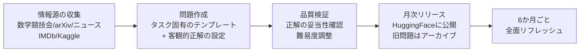
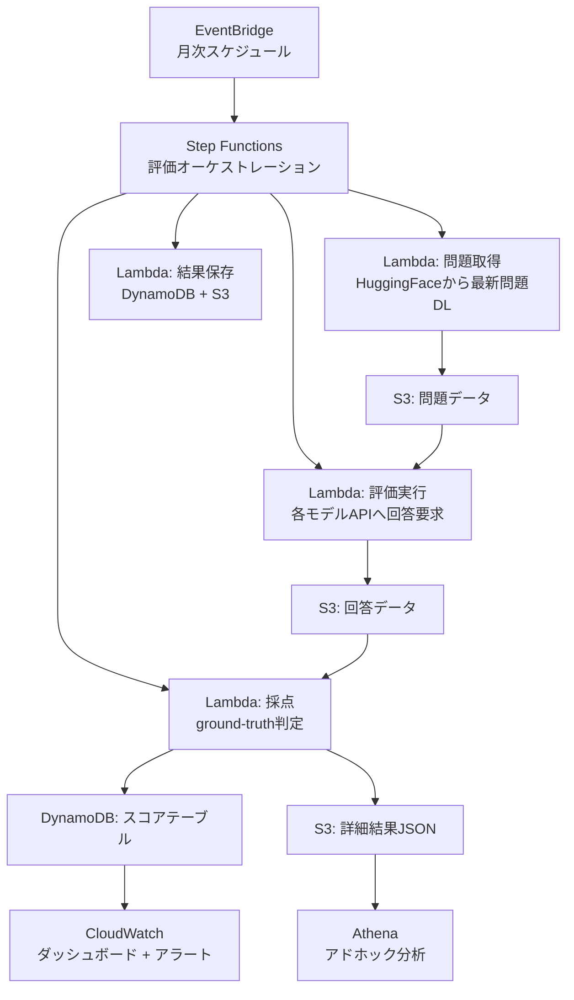

## 論文概要（Abstract）

LLMベンチマークにおけるテストセット汚染（contamination）とLLM-as-a-Judgeの主観性バイアスは、評価の信頼性を損なう深刻な課題である。LiveBenchは、(1) 最新の情報源から毎月問題を更新し、(2) 客観的な正解に基づく自動採点を行い、(3) 数学・コーディング・推論・データ分析・指示追従・言語理解の6カテゴリ18タスクで多面的に評価する、汚染耐性を備えた動的ベンチマークである。論文発表時点で49モデルを評価し、最高精度は65%未満と報告されており、既存ベンチマークの飽和問題にも対処している。ICLR 2025 Spotlightとして採択された。

本記事は [https://arxiv.org/abs/2406.19314](https://arxiv.org/abs/2406.19314) の解説記事です。関連する [Zenn記事: LLMベンチマーク完全ガイド 主要15指標の読み方と自宅で実行する方法](https://zenn.dev/0h_n0/articles/205a1900fbde2a) も参照されたい。

## 情報源

- **arXiv ID**: 2406.19314
- **URL**: [https://arxiv.org/abs/2406.19314](https://arxiv.org/abs/2406.19314)
- **著者**: Colin White, Samuel Dooley, Manley Roberts, Arka Pal, Ben Feuer, Siddhartha Jain, Ravid Shwartz-Ziv, Neel Jain, Khalid Saifullah, Sreemanti Dey, Shubh Agrawal, Sandeep Singh Sandha, Siddartha Naidu, Chinmay Hegde, Yann LeCun, Tom Goldstein, Willie Neiswanger, Micah Goldblum
- **発表年**: 2024（v1: 2024年6月27日、v2: 2025年4月18日）
- **採択**: ICLR 2025 Spotlight
- **分野**: cs.CL, cs.AI, cs.LG

## 背景と動機（Background & Motivation）

LLMベンチマークには2つの構造的問題が存在する。

**第一の問題：テストセット汚染**。MMLUやGSM8Kなどの静的ベンチマークは、問題と正解が固定されている。学習データにベンチマーク問題が混入するとスコアが不正に向上し、真の能力を反映しなくなる。著者らは、Codeforces問題においてトレーニングカットオフ前後でLLMの正答率に顕著な差が生じること、またGSM8Kの変形問題でスコアが大幅に低下するパターンを報告しており、汚染の影響が実証的に確認されている。

**第二の問題：LLM-as-a-Judgeのバイアス**。Chatbot ArenaのArena-Hardでは、GPT-4をジャッジとして採用しているが、著者らはGPT-4モデルがArena-Hard上で不自然に高いスコアを獲得する傾向を指摘している。LLMジャッジは自身の出力スタイルを好む自己バイアス（self-preference bias）を持つため、評価の公正性に疑念が生じる。

LiveBenchはこれらの課題に対し、「問題を定期的に刷新する」「客観的正解で自動採点し、LLMジャッジを排除する」という2つの設計方針で根本的に対処する。

## 主要な貢献（Key Contributions）

- **月次更新による汚染耐性**: 数学競技会、arXiv論文、ニュース記事、IMDb映画シノプシス、Kaggleデータセットなど、最新の情報源から問題を生成し、毎月更新する。6か月ごとにベンチマーク全体をリフレッシュする
- **LLMジャッジ不要の客観的採点**: すべての問題に検証可能な正解を設定し、自動採点を行う。数学は完全一致、コーディングはpass@1（テストケース通過率）、推論は論理的正解との照合で評価する
- **6カテゴリ18タスクの包括的設計**: 数学・コーディング・推論・データ分析・指示追従・言語理解の6カテゴリで、LLMの多面的能力を捕捉する
- **難易度の維持**: 既存ベンチマークの難化版を含み、論文発表時点で最高精度65%未満を維持。ベンチマーク飽和を回避する
- **49モデルの大規模評価**: 0.5Bから405Bパラメータまで、オープンソースとプロプライエタリの両方を網羅的に評価

## 技術的詳細（Technical Details）

### 6カテゴリ18タスクの設計

LiveBenchの各カテゴリとタスク構成を以下に示す。

```mermaid
graph TD
    LB[LiveBench] --> Math[Math]
    LB --> Coding[Coding]
    LB --> Reasoning[Reasoning]
    LB --> DA[Data Analysis]
    LB --> IF[Instruction Following]
    LB --> Lang[Language]

    Math --> M1[AMC12 / AIME / USAMO / IMO / SMC]
    Math --> M2[AMPS Hard Variants]

    Coding --> C1[LCB Generation<br>LeetCode / AtCoder]
    Coding --> C2[Code Completion]

    Reasoning --> R1[Web of Lies Hard]
    Reasoning --> R2[Zebra Puzzles]
    Reasoning --> R3[Spatial Reasoning]
    Reasoning --> R4[House Traversal]

    DA --> D1[Table Reformatting<br>JSON/CSV/HTML変換]
    DA --> D2[Column Type Annotation]
    DA --> D3[Table Joining]

    IF --> IF1[Paraphrase]
    IF --> IF2[Simplify]
    IF --> IF3[Summarize]
    IF --> IF4[Story Generation]

    Lang --> L1[Connections Puzzles]
    Lang --> L2[Typo Detection]
    Lang --> L3[Plot Unscrambling]
```



#### Math（数学）

2023年1月以降に出題された数学競技会の問題を使用する。AMC 12（2023年11月）、AIME（2024年1-2月）、USAMO（2024年3月）、IMO（2024年7月）、SMC（スウェーデン数学競技会）が情報源である。加えて、AMPSデータセットの問題を難化させたバリアントを含む。採点は数値回答の完全一致で行い、選択肢問題では指定フォーマットでの回答を要求する。

#### Coding（コーディング）

コード生成タスクはLiveCodeBench（LeetCodeおよびAtCoderの2023年11月以降出題分）から78問を採用し、コード補完タスクは50問で構成される。採点はpass@1、すなわちモデルが生成したコードが全テストケースを初回実行で通過するかどうかで判定する。エージェンティックなコーディングタスクの評価にはDockerが必要である。

#### Reasoning（推論）

Web of Liesは、Big-Bench Hardの同名タスクをより複雑にしたバリアントで、複数の人物間の「嘘つき/正直者」関係の論理的推論を問う。Zebra Puzzlesは制約充足に基づく論理パズルである。Spatial Reasoning（空間推論）とHouse Traversal（経路探索）もこのカテゴリに含まれる。いずれも客観的な正解が一意に定まる。

#### Data Analysis（データ分析）

Kaggle・Socrataから取得した最新データセットを使用する。(1) Table Reformatting: JSON/CSV/HTMLの相互変換、(2) Column Type Annotation: データ列の型（数値/カテゴリ/日時等）の推定、(3) Table Joining: 2つのテーブルを結合可能な列の予測。いずれも正解が客観的に検証可能な設計である。

#### Instruction Following（指示追従）

The Guardianの最近のニュース記事を題材に、パラフレーズ・要約・簡略化・物語生成を行う。各タスクには「語数制限」「特定キーワードの使用」「文体制約」などの具体的な指示が付随する。IFEvalの手法に着想を得ており、指示への準拠度を自動的に検証する。

#### Language（言語理解）

Connections（NYTスタイルのワードパズル）、Typo Detection（最新のarXiv論文アブストラクトに埋め込まれた誤字の検出）、Plot Unscrambling（IMDb/Wikipediaの最新映画シノプシスの段落並び替え）で構成される。最新のコンテンツを使用することで汚染を防止する。

### 問題生成パイプライン

LiveBenchの問題生成は以下のパイプラインに従う。



情報源は2023年1月以降に公開されたものに限定し、大半のLLMのトレーニングカットオフ以降のデータを使用する。これにより学習データへの混入リスクを構造的に低減する。

### 自動採点メカニズム

採点は2フェーズで実行される。

**Phase 1 — 回答生成**: `gen_api_answer.py` がモデルAPIを呼び出し、各問題に対する回答を収集する。

**Phase 2 — 正解判定**: `gen_ground_truth_judgment.py` がタスク固有のスコアリング関数を適用する。

各カテゴリの採点ロジックは `process_results/` ディレクトリにタスクごとに実装されている。全カテゴリ共通で、カテゴリスコアは配下タスクスコアの平均、全体スコアは6カテゴリスコアの平均として算出される。

$$
\text{Score}_{\text{category}} = \frac{1}{|\mathcal{T}_c|} \sum_{t \in \mathcal{T}_c} \text{Accuracy}_t
$$

$$
\text{Score}_{\text{overall}} = \frac{1}{6} \sum_{c=1}^{6} \text{Score}_{\text{category}_c}
$$

ここで、$\mathcal{T}_c$ はカテゴリ $c$ に属するタスクの集合、$\text{Accuracy}_t$ はタスク $t$ の正答率である。

## 実装のポイント（Implementation Guide）

### 環境構築とベンチマーク実行

LiveBenchはGitHubリポジトリ [https://github.com/LiveBench/LiveBench](https://github.com/LiveBench/LiveBench) で公開されている。Python 3.10以上が必要で、`pip install -e .` でインストールする。コーディングタスクの評価にはDocker環境も必要である。

```bash
# 特定モデル・カテゴリの評価
python run_livebench.py \
  --model gpt-4o \
  --bench-name live_bench/coding \
  --livebench-release-option 2024-11-25 \
  --max-tokens 4096

# 全カテゴリの評価
python run_livebench.py \
  --model claude-3-5-sonnet-20240620 \
  --bench-name live_bench

# 結果表示
python show_livebench_result.py \
  --bench-name live_bench \
  --model-list gpt-4o claude-3-5-sonnet \
  --livebench-release-option 2024-11-25
```

主要なパラメータは以下の通りである。

| パラメータ | 説明 |
|-----------|------|
| `--model` | 評価対象のモデルID |
| `--bench-name` | タスクの指定（`live_bench` で全カテゴリ） |
| `--livebench-release-option` | リリース日の指定（例: `2024-11-25`） |
| `--max-tokens` | 最大出力トークン数（デフォルト: 4096） |
| `--parallel-requests` | 並列リクエスト数 |
| `--resume` | 中断した実行の再開 |
| `--api-base` | OpenAI互換エンドポイントのURL |

ローカルモデルの場合は、vLLMやTGIでOpenAI互換サーバーを起動し、`--api-base` でエンドポイントを指定する。モデル設定は `livebench/model/model_configs/` にYAMLファイルとして配置する。

## Production Deployment Guide

AWS上で月次自動ベンチマーク評価パイプラインを構築し、モデルの性能推移を継続的に追跡するアーキテクチャを示す。

### アーキテクチャ概要



### トラフィック量別構成

| 構成 | 対象規模 | モデル数 | 月間コスト目安 |
|------|---------|---------|-------------|
| Small | PoC・個人研究 | 1-3モデル | $50-150 |
| Medium | チーム利用 | 5-10モデル | $300-800 |
| Large | 組織全体 | 10-20モデル | $1,500-4,000 |

コスト構成の大半はモデルAPI呼び出し費用であり、AWSインフラ自体のコストは月$20-50程度である。

### Terraformによるインフラ定義

主要リソースをTerraformで定義する。

```hcl
# terraform/main.tf
provider "aws" { region = "ap-northeast-1" }

resource "aws_s3_bucket" "livebench_data" {
  bucket = "livebench-evaluation-data"
}

resource "aws_s3_bucket_lifecycle_configuration" "archive" {
  bucket = aws_s3_bucket.livebench_data.id
  rule {
    id     = "archive-old-results"
    status = "Enabled"
    transition { days = 90; storage_class = "GLACIER" }
  }
}

resource "aws_dynamodb_table" "livebench_scores" {
  name         = "livebench-scores"
  billing_mode = "PAY_PER_REQUEST"
  hash_key     = "model_id"
  range_key    = "release_date"
  attribute { name = "model_id";     type = "S" }
  attribute { name = "release_date"; type = "S" }
}

resource "aws_cloudwatch_event_rule" "monthly_eval" {
  name                = "livebench-monthly-trigger"
  schedule_expression = "cron(0 0 1 * ? *)"
}

resource "aws_cloudwatch_event_target" "step_functions" {
  rule     = aws_cloudwatch_event_rule.monthly_eval.name
  arn      = aws_sfn_state_machine.livebench_pipeline.arn
  role_arn = aws_iam_role.eventbridge_sfn.arn
}
```

Step Functionsの状態定義は以下の構造を取る。FetchQuestions（問題取得）→ EvaluateModels（Map Stateで各モデルを並列評価、MaxConcurrency=3）→ SaveResults（結果保存）の3ステップ構成で、各ステップにRetry（指数バックオフ、最大3回）を設定する。

### Lambda関数の実装例

問題取得Lambdaの核となる処理を示す。

```python
import json
import os
from datetime import datetime, timezone
from typing import Any

import boto3
from huggingface_hub import snapshot_download


def fetch_questions_handler(
    event: dict[str, Any], context: Any
) -> dict[str, Any]:
    """HuggingFaceから最新のLiveBench問題を取得しS3に保存する.

    Args:
        event: EventBridgeからのイベント
        context: Lambda実行コンテキスト

    Returns:
        S3キーとモデルリストを含む辞書
    """
    release_date: str = datetime.now(tz=timezone.utc).strftime("%Y-%m-%d")
    local_path: str = f"/tmp/livebench-{release_date}"
    snapshot_download(
        repo_id="livebench/livebench",
        local_dir=local_path,
        repo_type="dataset",
    )

    s3 = boto3.client("s3")
    bucket: str = os.environ["DATA_BUCKET"]
    s3_key: str = f"questions/{release_date}/"
    for root, _dirs, files in os.walk(local_path):
        for f in files:
            if f.endswith(".jsonl"):
                path = os.path.join(root, f)
                s3.upload_file(path, bucket, f"{s3_key}{os.path.relpath(path, local_path)}")

    models: list[str] = json.loads(os.environ.get("TARGET_MODELS", "[]"))
    return {
        "release_date": release_date,
        "questions_s3_key": s3_key,
        "models": [{"model_id": m, "release_date": release_date} for m in models],
    }
```

結果保存Lambdaでは、DynamoDB（`model_id` + `release_date` をキー）にスコアサマリを、S3に詳細結果JSONを保存する。冪等性を確保するため、同一キーへのput_itemで上書きする設計とする。

### 監視設定

CloudWatchで以下の3種類のアラームを設定する。

| アラーム | メトリクス | 閾値 | 目的 |
|---------|-----------|------|------|
| パイプライン失敗 | `AWS/States` ExecutionsFailed | >= 1 | 実行失敗の即時検知 |
| 実行タイムアウト | `AWS/States` ExecutionTime | > 2時間 | 異常な長時間実行の検知 |
| スコア異常変動 | カスタム ScoreDeviation | > 15% | 前月比の急激な変動（問題品質の確認トリガー） |

アラート通知先はSNSトピック経由でSlackやメールに連携する。

### コスト最適化

| 最適化施策 | 効果 | 実装方法 |
|-----------|------|---------|
| S3 Glacier自動アーカイブ | ストレージコスト70%削減 | ライフサイクルルールで90日後に移行 |
| DynamoDB On-Demand | 月次実行に最適化 | Provisioned不要で待機コストゼロ |
| Lambda ARM64 | コンピュート20%削減 | `arm64` アーキテクチャ指定 |
| Step Functions Express | ワークフロー80%削減 | 実行時間が5分以内のステップに適用 |
| API呼び出しバッチ化 | API費用15-25%削減 | Batch APIの活用（対応モデルのみ） |
| 評価対象の段階的拡大 | 初期コスト抑制 | 主要3モデルから開始し段階的に追加 |

特にコストの大半を占めるモデルAPI呼び出しについては、OpenAI Batch APIやAnthropic Message Batchesを活用することで、標準料金の50%で評価を実行できる場合がある。ただし、レスポンスの取得に最大24時間を要するため、Step Functionsの待機ステート（Wait）と組み合わせる設計が必要である。

### セキュリティ考慮事項

- APIキーはAWS Secrets Managerで管理し、Lambda環境変数には直接埋め込まない
- S3バケットはサーバーサイド暗号化（SSE-S3）を有効化する
- IAMロールは最小権限の原則に従い、各Lambdaに必要なリソースアクセスのみを許可する
- VPC内でのLambda実行は不要（外部APIへのアクセスが主目的のため）

## 実験結果（Results）

### 主要モデルの性能比較

著者らは論文中で49モデルを評価している。以下は論文報告時点（2024年6月）の主要結果である。

| モデル | 全体スコア | 特筆点 |
|--------|-----------|--------|
| Claude 3.5 Sonnet | 約61% | 全6カテゴリで最高。2位に約6ポイント差 |
| GPT-4o (2024-05-13) | 約55% | 総合2位。Math・Languageで高スコア |
| Claude 3 Opus | 約51% | Codingカテゴリで上位 |
| GPT-4 Turbo | 約50% | GPT-4oと僅差 |
| Gemini 1.5 Pro | 約44% | Chatbot Arena順位と比較してやや低い |

著者らは、Claude 3.5 Sonnetが推論・コーディングカテゴリで他モデルを大幅に上回ると報告している。最高モデルでも全体の約65%未満の精度にとどまっており、ベンチマークの難易度が維持されていることを示している。

### Chatbot Arenaとの相関分析

著者らはLiveBenchの全体スコアとChatbot Arenaのランキングの間に0.91のPearson相関を報告している。Arena-Hardとの相関は0.88である。ただし以下の乖離パターンも指摘されている。

- **GPT-4モデルのArena-Hard過大評価**: Arena-HardがGPT-4をジャッジとして使用するため、GPT-4系モデルのスコアが不自然に高くなる。LiveBenchではこのバイアスが排除される
- **Gemini 1.5のスタイルプレミアム**: Gemini 1.5モデルはChatbot Arenaで比較的高い順位を獲得するが、LiveBenchでのスコアはそれよりも低い。著者らは、人間の選好投票では出力スタイル（冗長さ・フォーマット）が有利に働く可能性を指摘している

これらの乖離は、LLMジャッジや人間評価の持つ固有のバイアスを浮き彫りにしており、客観的ベンチマークの必要性を補強する結果である。

## 実運用への応用（Practical Applications）

LiveBenchの設計思想は、企業におけるLLMの継続的評価に直接応用できる。

**モデル選定の定量的根拠**: 新モデルのリリース時に、自社タスクに近いカテゴリのスコアを比較することで、採用判断を客観的に行える。特にコーディングタスクのpass@1やデータ分析タスクの精度は、実業務の性能予測に有用である。

**性能回帰の検知**: 月次でモデルAPIのスコアを記録することで、プロバイダ側のモデル更新による性能劣化を早期に検知できる。Production Deployment Guideで示したパイプラインはこの目的に適している。

**カスタムベンチマークの設計指針**: LiveBenchの「客観的正解 × 定期更新 × 自動採点」という原則は、社内のドメイン特化ベンチマークを構築する際の設計テンプレートとなる。例えば法律文書や医療テキストの分析タスクに同様のパターンを適用できる。

**制約と注意事項**: LiveBenchは一般的な能力を測定するものであり、特定のドメインやプロンプト設計への最適性を保証するものではない。また、月次更新のタイミングによっては最新モデルの評価結果が反映されていない場合がある。

## 関連研究（Related Work）

- **MMLU（Hendrycks et al., 2021）**: 57科目の多肢選択問題。広く採用されているが、静的であり汚染リスクが指摘されている
- **Chatbot Arena（Chiang et al., 2024）**: 人間の選好投票によるランキング。スケーラブルだがスタイルバイアスの影響を受ける
- **HELM（Liang et al., 2022）**: 多面的自動評価フレームワーク。包括的だが更新頻度が低い
- **Arena-Hard（Li et al., 2024）**: Chatbot Arenaの自動版。LLMジャッジの自己バイアス問題を内包する
- **LiveCodeBench（Jain et al., 2024）**: コーディングタスクに特化した汚染フリーベンチマーク。LiveBenchのコーディングカテゴリの一部として統合されている

LiveBenchは、これらの先行研究の限界（静的問題・ジャッジバイアス・単一ドメイン）を包括的に解決する位置づけにある。

## まとめと今後の展望

LiveBenchは、テストセット汚染とLLMジャッジバイアスという2つの構造的課題に、「月次更新 × 客観的正解 × 6カテゴリ多面評価」という設計で対処した動的ベンチマークである。Chatbot Arenaとの高い相関（Pearson 0.91）を維持しつつ、ジャッジバイアスを排除した公正な評価を実現している。今後は、マルチモーダル評価への拡張、エージェンティックタスクの拡充、およびコミュニティによるタスク提案の仕組みの整備が期待される。LiveBenchのリリースサイクルとオープンソースの枠組みにより、LLM評価のエコシステムが継続的に改善されていく基盤が構築されている。

## 参考文献

- **arXiv**: [https://arxiv.org/abs/2406.19314](https://arxiv.org/abs/2406.19314)
- **GitHub**: [https://github.com/LiveBench/LiveBench](https://github.com/LiveBench/LiveBench)
- **LiveBench公式サイト**: [https://livebench.ai/](https://livebench.ai/)
- **HuggingFace Dataset**: [https://huggingface.co/datasets/livebench](https://huggingface.co/datasets/livebench)
- **Related Zenn article**: [https://zenn.dev/0h_n0/articles/205a1900fbde2a](https://zenn.dev/0h_n0/articles/205a1900fbde2a)
