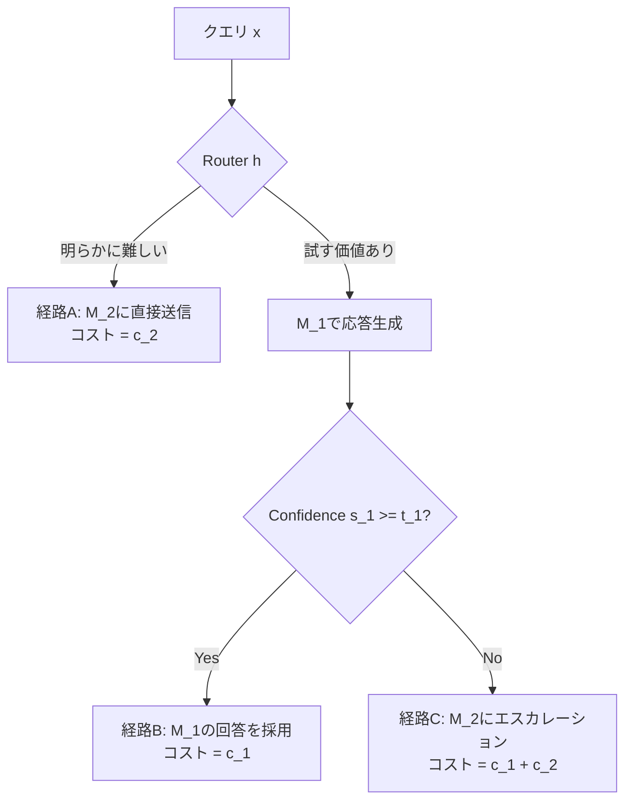

本記事は [arXiv:2410.10347 A Unified Approach to Routing and Cascading for LLMs](https://arxiv.org/abs/2410.10347) の解説記事です。

## 論文概要（Abstract）

本論文は、LLM推論コスト削減の2大戦略であるルーティングとカスケードを統合する理論的フレームワーク「UniRouter」を提案している。著者らは統合手法が各単独手法と少なくとも同等以上の性能を持つことを理論的に証明し、さらに統合手法が厳密に優越する（strictly dominate）設定が存在することも示している。著者らの実験では、2モデル・3モデル設定において最大40%のコスト削減（同一品質維持）を達成したと報告されている。

この記事は [Zenn記事: Azure AI Foundry Model Routerで社内問い合わせBotのコストを50%削減する実装ガイド](https://zenn.dev/0h_n0/articles/3ec8fd39c09959) の深掘りです。Azure AI Foundry Model Routerの内部アルゴリズムが「ルーティングのみ」か「カスケードのみ」か、あるいは両者の統合かは公開されていないが、本論文はその理論的最適解を示す。

## 情報源

- **arXiv ID**: 2410.10347
- **URL**: [https://arxiv.org/abs/2410.10347](https://arxiv.org/abs/2410.10347)
- **著者**: Jasper Dekoninck, Maximilian Baader, Ivo Petrov, Luca Beurer-Kellner, Martin Vechev（ETH Zurich, SRI Lab）
- **発表年**: 2024年
- **分野**: cs.LG, cs.CL

## 背景と動機（Background & Motivation）

LLM推論コスト削減には2つの基本戦略が存在する。

**ルーティング**: クエリの特徴のみを見て、1つのモデルを選択する。1回の判断で完結するが、判断材料はクエリテキストのみであり、モデルの出力を見る前に決定する必要がある。

**カスケード**: 最安モデルから順に呼び出し、confidence scoreが閾値を超えたら停止する。モデルの出力を確認してから判断できるが、安いモデルが失敗した場合に追加のAPI呼び出しが発生する。

従来、これら2つの戦略は独立に研究されてきた。著者らの核心的な洞察は、ルーティングとカスケードが**異なる情報源に基づいて意思決定を行っている**という点にある。

- ルーティング: クエリ特徴 $x$ のみ（モデル呼び出し前）
- カスケード: モデル出力の信頼度 $s_1(x)$（$M_1$ 呼び出し後）

これらを統合すれば、各クエリに対してより情報量の多い意思決定が可能になる。

## 主要な貢献（Key Contributions）

- **貢献1**: ルーティングとカスケードを特殊ケースとして含む統合フレームワークの提案。ルーティングは全閾値を $-\infty$ に設定、カスケードは全ルーティング判定を「常にスキップしない」に設定した場合に相当する
- **貢献2**: 統合手法が各単独手法と少なくとも同等（弱支配）であることの理論的証明（Theorem 1）
- **貢献3**: 統合手法が厳密に優越する設定の構成的証明（Theorem 2）
- **貢献4**: 2モデル・3モデル設定における最大40%（2モデル）・45%（3モデル）のコスト削減の実証

## 技術的詳細（Technical Details）

### 統合ポリシーの3つの経路

2モデル設定（$M_1$: 安価, $M_2$: 高コスト）における統合ポリシーでは、各クエリが3つの経路のいずれかを辿る。

- **経路A**: ルーターが「明らかに難しい」と判断 → $M_1$ をスキップして直接 $M_2$ へ
- **経路B**: $M_1$ で生成 → confidence scoreが十分 → $M_1$ の回答を採用
- **経路C**: $M_1$ で生成 → confidence scoreが不十分 → $M_2$ にエスカレーション

純粋なルーティングは経路AとBのみ（$M_1$ か $M_2$ かの二択）、純粋なカスケードは経路BとCのみ（常に $M_1$ から開始）を許容する。統合ポリシーはA/B/Cすべてを許容する。

### 数学的定式化

ルーティング関数 $h: \mathcal{X} \to \{0, 1\}$ と閾値 $t_1$ を同時に最適化する。

**期待コスト**:

$$
\mathbb{E}[C] = P(h(x)=1) \cdot c_2 + P(h(x)=0) \cdot \left[c_1 + P(s_1(x) < t_1 \mid h(x)=0) \cdot c_2\right]
$$

**期待品質**:

$$
\mathbb{E}[Q] = P(h(x)=1) \cdot p_2(x) + P(h(x)=0, s_1(x) \geq t_1) \cdot p_1(x) + P(h(x)=0, s_1(x) < t_1) \cdot p_2(x)
$$

ここで $p_i(x)$ はモデル $M_i$ がクエリ $x$ に正解する確率、$c_i$ はモデル $M_i$ のコストである。

最適化は $(h, t_1)$ について $\mathbb{E}[C]$ を最小化し、$\mathbb{E}[Q] \geq q^*$ を制約とする。

### 弱支配の証明（Theorem 1）

任意の品質目標 $q^*$ に対して:

$$
C_{\text{unified}}^*(q^*) \leq \min(C_{\text{routing}}^*(q^*), C_{\text{cascading}}^*(q^*))
$$

**証明の直観**: 統合ポリシーの実行可能集合 $\mathcal{F}_U$ は、ルーティングのみの集合 $\mathcal{F}_R$（全閾値を $-\infty$）とカスケードのみの集合 $\mathcal{F}_C$（$h(x) = 0\ \forall x$）の両方を部分集合として含む。つまり $\mathcal{F}_R \subset \mathcal{F}_U$ かつ $\mathcal{F}_C \subset \mathcal{F}_U$ であるため、$\mathcal{F}_U$ 上の最小値は各部分集合上の最小値以下となる。

### 厳密支配の構成的証明（Theorem 2）

著者らは統合手法が厳密に優越する具体的な問題設定を構成している。

$k = 2$, $c_1 = 1$, $c_2 = 3$ で2種類のクエリタイプ（各確率0.5）を考える。

**タイプA**: ルーターの特徴から「難しい」と識別可能。$M_1$ 精度 = 0.1、$M_2$ 精度 = 0.9。$M_1$ のconfidence scoreは一様分布（非情報的）。

**タイプB**: ルーターの特徴はタイプAと区別不能。$M_1$ 精度 = 0.8、$M_2$ 精度 = 0.9。$M_1$ のconfidence scoreは情報的（正解時は $s_1 \sim U[0.6, 1]$、誤答時は $s_1 \sim U[0, 0.4]$）。

品質目標: $q^* = 0.85$。

- **ルーティングのみ**: A/Bを区別できないため、全てを $M_2$ に送る → コスト = 3
- **カスケードのみ**: 常に $M_1$ から開始 → タイプAで無駄な $M_1$ 呼び出し → コスト ≈ 2.8
- **統合ポリシー**: タイプAは直接 $M_2$ へ（経路A）、タイプBは $M_1$ で試行し confidence で判断（経路B/C）→ コスト ≈ 2.3

$2.3 < 2.8 < 3$ であり、統合手法が厳密に優越する。

### 分離定理（Theorem 3）

著者らは、最適ポリシーにおいてルーティング判定 $h(x)$ とカスケード閾値 $t_1$ が独立に最適化可能である（分離する）ことを示している。この分離定理は実用上重要であり、ルーターとカスケード閾値を別々に学習する2段階アプローチが理論的に正当化される。

### 実装: UniRouterアルゴリズム

**Component 1 — ルーター**: BERT規模の分類器をクエリ難易度予測に使用。クエリテキスト $x$ を入力とし、$M_2$ に直接送るべき確率 $h_\theta(x) \in [0, 1]$ を出力する。

**Component 2 — カスケード閾値**: スカラー値 $t_1$ をバリデーションセットで調整。

**推論時**: $h_\theta(x) > \lambda_{\text{router}}$ なら $M_2$ に直接送信。そうでなければ $M_1$ を呼び出し、$s_1(x) < t_1$ なら $M_2$ にエスカレーション。

## 実装のポイント（Implementation）

- **Confidence scoreの品質**: カスケード成分は $M_1$ のconfidence scoreが意味のあるものである必要がある。calibration errorが大きいモデルでは性能が劣化し、ルーティングのみに退化する
- **分離学習の実用性**: Theorem 3により、ルーターと閾値を独立に学習できる。著者らの実験では、分離学習で38%、結合学習で40%のコスト削減であり、実用上の差は小さい
- **ルーターアーキテクチャの選択**: 線形プローブ（34%削減）、BERT規模（38%削減）、GPT-2規模（40%削減）と、ルーターの表現力に応じて改善するが、収穫逓減がある

## 実験結果（Results）

著者らはGPT-3.5-turbo（安価）+ GPT-4（高コスト）のペアで評価を行っている（論文Table 1より）。

**2モデル設定**:

| 手法 | MMLU削減率 | GSM8K削減率 | HellaSwag削減率 |
|------|-----------|-----------|---------------|
| カスケードのみ | 約25% | 約18% | 約20% |
| ルーティングのみ（RouteLLM） | 約30% | 約22% | 約22% |
| UniRouter（統合） | **約40%** | **約35%** | **約15-25%** |

**3モデル設定**（GPT-3.5 + Claude-2 + GPT-4）:

| 手法 | MMLU削減率 |
|------|-----------|
| カスケード-3 | 約32% |
| ルーティング-3 | 約28% |
| UniRouter-3 | **約45%** |

3モデル設定ではルーティングとカスケードの相補性が増大し、統合の利得が大きくなる。

**ルーティングがカスケードに勝つ場合**: MMLUの科目分類のように、クエリテキストから難易度が予測可能な場合。ルーターが信頼性の高いシグナルを持ち、$M_1$ のconfidenceが非情報的。

**カスケードがルーティングに勝つ場合**: TruthfulQAのように、事実の正確性がクエリ構造から推測できない場合。$M_1$ のconfidenceが「自分が知らないことを知っている」ため有効。

## 実運用への応用（Practical Applications）

UniRouterの知見は、社内問い合わせBotにおいて以下のように活用できる。

Azure AI Foundry Model Routerは現在ルーティング方式を採用しているが、UniRouterの研究は将来的にカスケードとの統合により追加のコスト削減が可能であることを示唆している。

実運用では、以下の3つの経路が自然に対応する。
- **経路A（直接gpt-5へ）**: 法務・コンプライアンス系の質問。ルーターが即座に高品質モデルを選択
- **経路B（gpt-5-nanoで完結）**: ITヘルプデスク系のFAQ。安価モデルが高confidence応答を生成
- **経路C（エスカレーション）**: 曖昧な質問。安価モデルのconfidenceが低い場合にのみ高コストモデルに切り替え

## 3モデル以上への拡張（Extension to $k \geq 3$）

本論文の重要な貢献の一つは、2モデル設定から $k$ モデル設定への一般化である。$k$ モデルの場合、統合ポリシーは以下の入れ子構造を持つ。

1. ルーター $h: \mathcal{X} \to \{1, 2, \ldots, k\}$ がクエリをいずれかのモデルに割り当て
2. 割り当てられたモデル $M_j$ から順に、confidence scoreを評価
3. $s_j(x) \geq t_j$ なら $M_j$ の回答を採用、そうでなければ $M_{j+1}$ にエスカレーション

$k = 3$ の場合、クエリが辿る可能性のある経路は以下の5つに増加する。

- **経路1**: $M_3$ に直接送信（ルーターが最難判定）
- **経路2**: $M_2$ に直接送信 → confidence十分 → 採用
- **経路3**: $M_2$ に直接送信 → confidence不十分 → $M_3$ にエスカレーション
- **経路4**: $M_1$ で開始 → confidence十分 → 採用
- **経路5**: $M_1$ で開始 → confidence不十分 → $M_2$ で再試行 → さらに $M_3$ にエスカレーションの可能性

著者らの実験では、3モデル設定（GPT-3.5-turbo + Claude-2 + GPT-4）でMMLU上45%のコスト削減を達成している。2モデル設定の40%からの改善は、中間コストモデル（Claude-2）の追加により、「$M_1$ では不足だが $M_3$ は過剰」なクエリに対する適切な割り当てが可能になったためであると著者らは分析している。

一般の $k$ モデル設定でも弱支配定理（Theorem 1）は成立する。分離定理（Theorem 3）も $k$ モデルに拡張され、各レベルの閾値 $t_j$ を独立に最適化可能である。

## 関連研究（Related Work）

- **RouteLLM**（Ong et al., 2024）: ルーティングのみのアプローチ。UniRouterの実験ではベースラインとして使用され、統合手法が10-15%の追加改善を達成している
- **FrugalGPT**（Chen et al., 2023）: カスケードのみのアプローチ。UniRouterのカスケード成分と類似するが、ルーティング成分との統合は行われていない
- **BEST-Route**（Agarwal et al., 2025）: モデル選択 × サンプル数の同時最適化。UniRouterのモデル選択 × カスケード判断の同時最適化とは異なる次元の拡張であり、理論的には両者の統合も可能である

## まとめと今後の展望

本論文は、LLMルーティングとカスケードの統合が理論的に最適であることを証明し、実装アルゴリズム（UniRouter）により最大40-45%のコスト削減を実証した。弱支配と厳密支配の証明は、統合アプローチの優位性を理論的に保証する。

分離定理により、ルーターとカスケード閾値を独立に学習できることが正当化されており、実装の複雑性はルーティング + カスケードの加算的な増加に留まる。Azure AI Foundry Model Routerのようなマネージドサービスにおいても、この統合アプローチの採用は技術的に実現可能であると考えられる。

今後の研究方向として、著者らは以下を挙げている。（1）confidence calibrationの自動化（現状は手動チューニングが必要）、（2）新しいモデルが追加された際のルーターの増分学習、（3）レイテンシを考慮したコスト関数への拡張。特に（3）については、カスケードの逐次呼び出しはレイテンシ増加を伴うため、レイテンシ制約下での最適ポリシーは本論文のフレームワークとは異なる解構造を持つ可能性がある。

## 参考文献

- **arXiv**: [https://arxiv.org/abs/2410.10347](https://arxiv.org/abs/2410.10347)
- **Related Zenn article**: [https://zenn.dev/0h_n0/articles/3ec8fd39c09959](https://zenn.dev/0h_n0/articles/3ec8fd39c09959)
