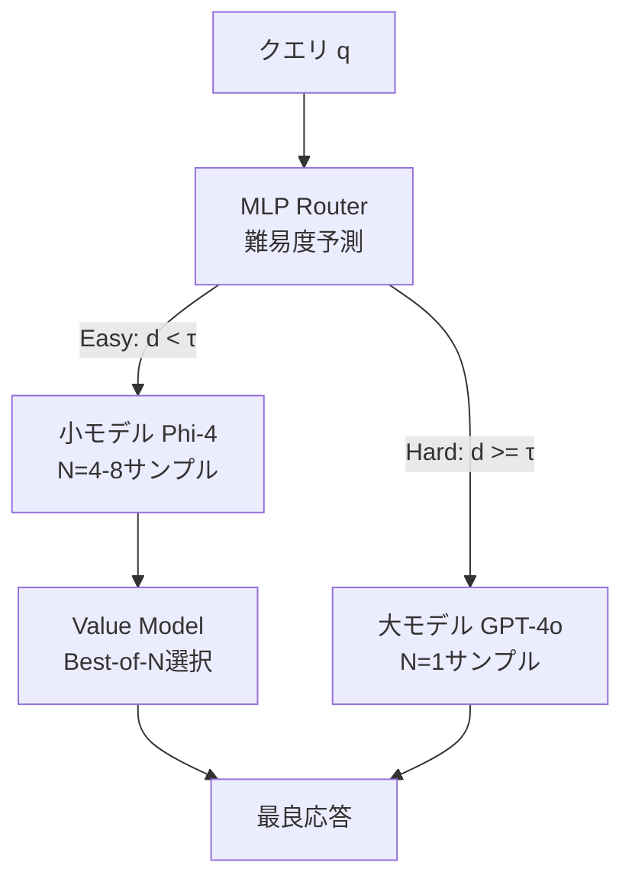

本記事は [arXiv:2506.22716 BEST-Route: Adaptive LLM Routing with Test-Time Optimal Compute](https://arxiv.org/abs/2506.22716) の解説記事です。

## 論文概要（Abstract）

BEST-Route（Best-of-N Efficient Sampling and Test-time Routing）は、LLMルーティングをモデル選択とサンプル数（test-time compute）の同時最適化問題として定式化するフレームワークである。著者らの実験によると、常に大規模モデルを使用する場合と比較して最大60%のコスト削減を達成し、同条件のRouteLLMと比較しても最大23%の追加コスト削減が可能であると報告されている。BEST-Routeは**Azure AI Model Routerに統合済み**であり、Microsoft Researchによる実用的な研究成果である。

この記事は [Zenn記事: Azure AI Foundry Model Routerで社内問い合わせBotのコストを50%削減する実装ガイド](https://zenn.dev/0h_n0/articles/3ec8fd39c09959) の深掘りです。Zenn記事で紹介されているAzure AI Foundry Model Routerの内部技術基盤としてBEST-Routeが統合されており、Model Routerの動作原理を理解するうえで最も直接的な論文である。

## 情報源

- **arXiv ID**: 2506.22716
- **URL**: [https://arxiv.org/abs/2506.22716](https://arxiv.org/abs/2506.22716)
- **著者**: Dhruv Agarwal, Arindam Mitra, Ramesh Nallapati, Sudipta Kar（Microsoft Research）
- **発表年**: 2025年
- **分野**: cs.AI, cs.LG

## 背景と動機（Background & Motivation）

既存のLLMルーティング手法（RouteLLM、FrugalGPT、Hybrid LLM）には共通の限界がある。それは「1回の推論（single pass）で答えを出す」前提で設計されており、**Best-of-N（BoN）サンプリング**という既知の品質向上手法を無視している点である。

Best-of-Nサンプリングとは、同一モデルから $N$ 個の応答を生成し、報酬モデル（value model）で最良のものを選択する手法である。この手法はコスト-品質のトレードオフを生む。小さいモデルで複数サンプルを生成しベストを選ぶことが、大きいモデルで1サンプル生成するより安く、かつ同等以上の品質になりうる。

BEST-Routeの問いは「**モデル選択とサンプル数を同時最適化できるか？**」であり、これに肯定的な回答を与えている。

## 主要な貢献（Key Contributions）

- **貢献1**: LLMルーティングを「モデル選択 + サンプル数（test-time compute）の同時最適化問題」として再定式化
- **貢献2**: Best-of-N value modelを使って各クエリの最適（モデル, $N$）ペアを推定する枠組みの提案
- **貢献3**: 推論モデル（o1, DeepSeek-R1系）への拡張（reasoning token数の最適化）
- **貢献4**: Azure AI Model Routerへの本番統合による実用性の実証

## 技術的詳細（Technical Details）

### 問題の数学的定式化

モデル集合を $\mathcal{M} = \{m_1, m_2, \ldots, m_K\}$（コスト昇順）、クエリ $q$ に対してルーターは以下を決定する。

**品質最大化（予算制約あり）**:

$$
\max_{m^*, N^*} \quad \mathbb{E}[V_{\text{BoN}}(m^*, N^*, q)] \quad \text{s.t.} \quad \mathbb{E}[C(m^*, N^*, q)] \leq B
$$

**コスト最小化（品質閾値あり）**:

$$
\min_{m^*, N^*} \quad \mathbb{E}[C(m^*, N^*, q)] \quad \text{s.t.} \quad \mathbb{E}[V_{\text{BoN}}(m^*, N^*, q)] \geq Q_{\text{target}}
$$

ここで $V_{\text{BoN}}(m, N, q)$ はBest-of-N品質値、$C(m, N, q)$ は推論コスト、$B$ は予算制約である。

### Best-of-N Value Function

$N$ サンプルの期待最大品質は以下で定義される。

$$
V_{\text{BoN}}(m, N, q) = \mathbb{E}_{s_1, \ldots, s_N \sim m(q)}\left[\max_{i=1}^{N} r(s_i, q)\right]
$$

ここで $r(s, q)$ は報酬関数（response $s$ のquery $q$ に対する品質評価）である。$N$ を増やすと品質は単調に向上するが、コストも線形に増加する。BEST-Routeの核心は、この品質-コストカーブの最適点をクエリごとに見つけることにある。

### ルーティングの仕組み

MLPルーターが難易度スコア $d(q) \in [0, 1]$ を出力し、閾値 $\tau$ で分岐する。

- **簡単なクエリ** ($d(q) < \tau$): 小モデルに送り、複数サンプルを生成してBest-of-Nで品質を補填する
- **難しいクエリ** ($d(q) \geq \tau$): 大モデルに送り、少ないサンプルで高品質な応答を得る

### 最適サンプル数 $N^*$ の決定

小モデルにルーティングされたクエリに対して、クエリごとのコストベネフィット分析で最適 $N$ を決定する。

$$
N^*(q) = \arg\max_{N \in \{1, \ldots, N_{\max}\}} \frac{V_{\text{BoN}}(m_{\text{small}}, N, q) - V_{\text{BoN}}(m_{\text{small}}, N-1, q)}{c_{\text{small}} \cdot \Delta N}
$$

限界品質改善が限界コストを上回る最大の $N$ を選択する。Value modelが各 $N$ における $V_{\text{BoN}}$ を予測し、品質-コスト曲線から最適点を求める。

論文では離散値 $N \in \{1, 2, 4, 8\}$ が使用されている。

### ルーターの学習

- **入力**: 事前学習済み埋め込みモデルが生成したクエリ埋め込みベクトル
- **アーキテクチャ**: MLP（Multi-Layer Perceptron）
- **出力**: 難易度スコア $d(q) \in [0, 1]$
- **損失関数**: Binary Cross-Entropy
- **訓練ラベル**: $V_{\text{BoN}}(m_{\text{large}}, 1, q) > V_{\text{BoN}}(m_{\text{small}}, N_{\max}, q)$ なら1（大モデル必要）、そうでなければ0

著者らの報告では、5,000〜10,000件のラベル付きサンプルで性能が飽和する。

### 推論モデルへの拡張

BEST-Routeは推論モデル（o1, DeepSeek-R1, QwQ等）にも自然に拡張できる。サンプル数 $N$ の代わりにreasoning token数（reasoning effort）を制御変数とする。

- 小推論モデル + 高コンピュート vs. 大推論モデル + 低コンピュート
- ルーターが「どちらの組み合わせがコスト効率が良いか」を判断する

## 実装のポイント（Implementation）

- **Value modelの学習**: BEST-Routeの効果はvalue/reward modelの品質に直接依存する。適切なvalue modelの構築にはラベル付きデータと追加のシステム複雑性が必要
- **レイテンシの考慮**: 複数サンプル生成（BoN）はコスト削減でもレイテンシを増加させる。インタラクティブ用途では $N = 2$ 程度に抑える設計が現実的
- **モデルペアの依存性**: Value modelは特定モデルペア（Phi-4, GPT-4o等）にキャリブレーションされており、異なるモデルペアへの転移可能性は未検証

## 実験結果（Results）

著者らはPhi-4（14Bパラメータ、小モデル）とGPT-4o（大モデル）のペアで評価を行っている。

**メイン結果（論文Table 1より）**:

| 手法 | コスト削減（対Always-Large） | 品質 |
|------|--------------------------|------|
| Always-Large | 0%（ベースライン） | 100% |
| RouteLLM | 30-40% | 95-98% |
| BEST-Route (N=1) | 40-50% | 97-99% |
| BEST-Route (BoN) | **最大60%** | **98-100%以上** |

RouteLLMと同一条件で比較した場合、BEST-Routeは最大23%の追加コスト削減を達成している。

**ベンチマーク別の傾向**:
- **MATH**: 約60%のクエリをPhi-4にルーティング。BoN $N=4$〜$8$ でGPT-4o相当精度
- **GSM8K**: 70%以上をPhi-4にルーティング可能。小モデル + BoNが大モデルに匹敵
- **LiveCodeBench**: 40-50%がGPT-4o必要。難易度が高く、BoNの効果が限定的
- **GPQA**: 大学院レベル問題はより多くがGPT-4oへルーティング

**Ablation: $N$ の効果（論文Section 5.2より）**:
- $N = 1 \to 2$: 5-10%の品質改善
- $N = 2 \to 4$: 追加3-7%改善
- $N = 4 \to 8$: 収穫逓減

### Azure AI Model Routerとの関係

論文に明示されている通り、BEST-RouteはAzure AI Model Routerに統合済みである。Zenn記事で紹介されているModel Routerの「プロンプトの複雑度・推論タイプ・タスク種別をリアルタイムに分析し、最適なLLMにリクエストを振り分ける」機能の背後に、BEST-Routeの技術が使われている。

具体的には以下の統合が行われている。
- Azure OpenAI APIエンドポイントとのAPI互換性
- Azure AIモデルカタログ内のモデル間でのルーティング
- Azureコスト管理との統合（メトリクス監視）
- Azure AI評価フレームワークを品質監視に使用

## RouteLLMとの詳細比較

| 特徴 | RouteLLM | BEST-Route |
|------|----------|------------|
| ルーティングシグナル | 人間嗜好データ（Bradley-Terry） | 差分性能 + value model |
| サンプル数 | 固定 $N=1$ | 適応的 $N$（Best-of-N） |
| Test-time compute | 固定 | 同時最適化 |
| コスト削減 | 30-40% | 50-60% |
| 訓練データ | Preferenceペア | クエリ性能差分 |
| アーキテクチャ | MF / BERT / SW / Causal LLM | MLP on query embeddings |
| 推論モデル対応 | なし | あり（拡張フレームワーク） |
| 商用統合 | なし（OSS） | Azure AI Model Router |

BEST-RouteがRouteLLMを上回る根本的理由は、従来の「モデル選択のみ」の最適化空間を「モデル選択 × サンプル数」に拡張している点にある。簡単なクエリでは小モデル + 複数サンプルという組み合わせが、大モデル1サンプルより費用対効果が高くなるケースが存在する。

## 実運用への応用（Practical Applications）

BEST-RouteのBest-of-N戦略は、社内問い合わせBotにおいて以下のように活用できる。

- **定型FAQ（簡単なクエリ）**: gpt-5-nanoで $N=4$ サンプル生成し、最良の回答を選択する。gpt-5で1サンプル生成するよりもコスト効率が高い可能性がある
- **複雑な規程解釈（難しいクエリ）**: gpt-5で $N=1$ サンプル生成する。Best-of-Nの恩恵よりもモデル能力の方が重要

ただし、Best-of-Nサンプリングはレイテンシを増加させるため、リアルタイム応答が求められるチャットBotでは注意が必要である。バッチ処理（例: メール自動回答）では $N$ を大きく設定し、インタラクティブなチャットでは $N = 1$ 〜 $2$ に制限する運用が現実的である。

## まとめと今後の展望

BEST-Routeは、LLMルーティングにBest-of-Nサンプリングという新しい次元を加え、モデル選択とtest-time computeの同時最適化を実現した論文である。著者らの実験では最大60%のコスト削減が報告されており、RouteLLMと比較しても23%の追加改善を達成している。

Azure AI Model Routerへの統合は、この研究が学術的な貢献にとどまらず、実プロダクションで検証済みであることを示している。Zenn記事で紹介されているModel Routerの内部技術を理解するうえで、BEST-Routeは最も直接的な論文である。

今後の課題として、2モデルの仮定の多モデルへの拡張、value modelのモデルペア間転移可能性、レイテンシとコストの同時最適化が挙げられている。

## 関連研究（Related Work）

- **RouteLLM**（Ong et al., 2024）: Chatbot Arenaの嗜好データからルーターを学習するフレームワーク。4種類のルーターアーキテクチャ（Matrix Factorization、BERT Classifier等）を提案している。BEST-Routeとの最大の違いは、RouteLLMが単一パス（$N=1$）のルーティングのみを対象としている点であり、Best-of-Nサンプリングとの統合は行われていない
- **FrugalGPT**（Chen et al., 2023）: LLMカスケードによるコスト最適化の先駆論文。安価モデルから順に試行するカスケード方式を採用しており、BEST-Routeの1-passルーティングとは異なるアプローチである。カスケード方式はレイテンシが増加する一方、回答品質を実際に確認してから判断できる安全性がある
- **Hybrid LLM**（Ding et al., 2024）: 品質制約を明示的にモデル化したルーティングフレームワーク。DeBERTaベースのルーターで弱モデルの品質を事前予測する。BEST-Routeと同じくMicrosoft Researchが関与しており、品質制約付きルーティングの理論的基盤を提供している

## 参考文献

- **arXiv**: [https://arxiv.org/abs/2506.22716](https://arxiv.org/abs/2506.22716)
- **Related Zenn article**: [https://zenn.dev/0h_n0/articles/3ec8fd39c09959](https://zenn.dev/0h_n0/articles/3ec8fd39c09959)
