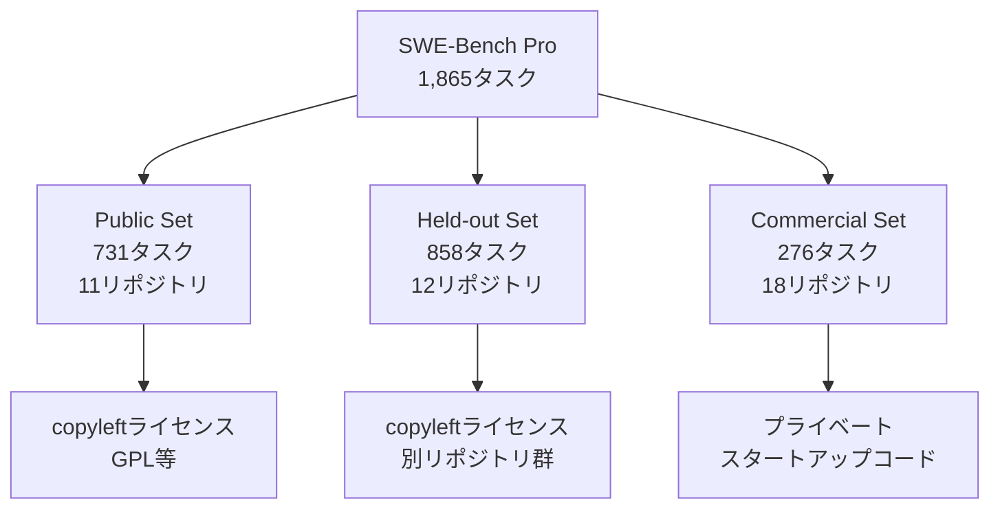

本記事は [SWE-Bench Pro: Raising the Bar for Agentic Coding](https://scale.com/blog/swe-bench-pro)（Scale Research Team, 2025年9月）の解説記事です。

## ブログ概要（Summary）

SWE-Bench Proは、Scale AIのResearchチームが2025年9月に公開したLLMコーディングベンチマークである。従来のSWE-Bench Verifiedではフロンティアモデルが80%以上を記録し差別化が困難になっていた問題に対し、copyleftライセンスのOSSリポジトリと商用スタートアップのプライベートコードベースを組み合わせることでデータ汚染を構造的に防止している。41リポジトリから4言語（Python、Go、TypeScript、JavaScript）にまたがる1,865タスクで構成され、タスクあたり平均107.4行・4.1ファイルの変更を要求する長期的なソフトウェアエンジニアリング課題である。フロンティアモデルのスコアはPublic Setで23%程度にとどまっており、実務的なコーディング能力の評価に十分な弁別力を持つ。

この記事は [Zenn記事: SWE-Bench Proから自作評価まで LLMコーディングベンチマーク実践ガイド](https://zenn.dev/0h_n0/articles/e1722937bd269a) の深掘りです。

## 情報源

- **種別**: 企業テックブログ
- **URL**: [https://scale.com/blog/swe-bench-pro](https://scale.com/blog/swe-bench-pro)
- **組織**: Scale AI Research Team
- **発表日**: 2025年9月19日
- **関連論文**: [https://arxiv.org/abs/2509.16941](https://arxiv.org/abs/2509.16941)

## 技術的背景（Technical Background）

### SWE-Bench Verifiedの限界

SWE-Bench Verified（OpenAIが2024年に公開）は、SWE-bench原版の2,294タスクから500タスクを人手で検証・厳選したサブセットである。品質は向上したものの、2025年にはフロンティアモデルが80%以上のスコアを記録し、差別化が困難になった。

Scale AIのブログでは、SWE-Bench Verifiedのスコアが高い理由として**データ汚染**を指摘している。SWE-Bench VerifiedのタスクはすべてGitHubの公開リポジトリから抽出されており、モデルの学習データに含まれている可能性が高い。OpenAI自身も、一部のモデルがゴールドパッチを逐語的に再現できたことを報告している。

### なぜcopyleftが効くのか

SWE-Bench Proのデータ汚染対策の中核は、**copyleftライセンス（GPL等）**の活用である。GPLライセンスのコードを学習データに含めた場合、モデルの出力物にもGPLが適用される可能性があり、商用LLMプロバイダーにとって法的リスクとなる。そのため、主要なLLMプロバイダーはGPLコードを学習データから除外する傾向がある。

Scale AIのブログでは「モデルが学習していないコードを使用する」ことをデータ汚染防止の基本方針として明示している。

## 実装アーキテクチャ（Architecture）

### データセット構成

SWE-Bench Proは3つのサブセットで構成されている。



| サブセット | タスク数 | リポジトリ数 | 言語 | 汚染対策 |
|:--|:--|:--|:--|:--|
| **Public Set** | 731 | 11 | Python, Go, TS, JS | copyleftによる法的抑止 |
| **Held-out Set** | 858 | 12 | Python, Go, TS, JS | Public Setと別のリポジトリで過学習検出 |
| **Commercial Set** | 276 | 18 | 非公開 | プライベートリポジトリのため学習データに含まれない |

**Public SetとHeld-out Setの分離の意図**: あるモデルがPublic Setでは高スコア、Held-out Setでは低スコアの場合、Public Setのリポジトリが学習データに含まれている（= 汚染されている）可能性が示唆される。この二重構造により、汚染の事後検出が可能になっている。

### タスクの特性

SWE-Bench Proのタスクは従来のSWE-benchと比較して以下の特性を持つ。

- **平均修正行数**: 107.4行（SWE-bench Verifiedの約3倍）
- **平均修正ファイル数**: 4.1ファイル
- **対応言語**: Python、Go、TypeScript、JavaScript（SWE-benchはPythonのみ）
- **タスク作成方法**: 人手による3段階アノテーション（問題文の明確化 → 要件定義 → インターフェース仕様策定）

### 評価スキャフォールディング

Scale AIのSEALリーダーボードでは、すべてのモデルに対して統一的な評価環境（スキャフォールディング）を提供する。ブログでは「SWE-Agent scaffold」の使用が言及されており、モデルがターミナルを操作してリポジトリを探索・修正するエージェント型の評価方式を採用している。

```python
class SWEBenchProEvaluator:
    """SWE-Bench Pro評価パイプラインの概念的構造"""

    def __init__(self, model_id: str, scaffold: str = "swe-agent"):
        self.model_id = model_id
        self.scaffold = scaffold

    def evaluate_task(self, task: dict) -> dict:
        """単一タスクの評価

        Args:
            task: タスク定義（問題文、リポジトリ、テスト）

        Returns:
            評価結果（resolved, fail2pass, pass2pass）
        """
        container = self._setup_container(task["repo"], task["base_commit"])
        agent = self._create_agent(self.model_id, self.scaffold)

        patch = agent.solve(
            issue_text=task["problem_statement"],
            repo=container,
        )

        fail2pass = self._run_tests(container, patch, task["fail2pass_tests"])
        pass2pass = self._run_tests(container, patch, task["pass2pass_tests"])

        return {
            "resolved": fail2pass and pass2pass,
            "fail2pass": fail2pass,
            "pass2pass": pass2pass,
            "patch_lines": len(patch.splitlines()),
        }
```

## パフォーマンス最適化（Performance）

### 言語別の難易度分析

Scale AIのブログによると、言語間で大きなスコア差が観測されている。

| 言語 | フロンティアモデルの解決率範囲 | 傾向 |
|:--|:--|:--|
| Python | 20-30% | 比較的安定 |
| Go | 25-35% | Pythonと同程度またはやや高い |
| TypeScript | 0-30% | モデル間のばらつきが大きい |
| JavaScript | 0-25% | 最も難易度が高い傾向 |

ブログでは「GoとPythonは30%を超える解決率が見られるが、JavaScript/TypeScriptではより変動的で低い傾向がある」と報告されている。

### モデル別のスコア

ブログが報告する主要モデルのPublic Setスコアは以下の通りである。

| モデル | Public Set解決率 | Commercial Set解決率 |
|:--|:--|:--|
| GPT-5 (OpenAI) | 23.3% | 14.9% |
| Claude Opus 4.1 (Anthropic) | 23.1% | 17.8% |
| GPT-4o (OpenAI) | 4.9% | — |
| DeepSeek Qwen-3 32B | 3.4% | — |

**Public Set vs Commercial Setのギャップ**: GPT-5はPublic Set（23.3%）からCommercial Set（14.9%）で8.4ポイント低下している。一方、Claude Opus 4.1は23.1%から17.8%と5.3ポイントの低下にとどまっている。ブログでは「Commercial Setの方がタスクの平均難易度が高い」と分析されているが、Public Setのリポジトリが一部学習データに含まれている可能性も示唆される。

**旧世代モデルとの差**: GPT-4o（4.9%）やDeepSeek Qwen-3 32B（3.4%）といった旧世代モデルは、フロンティアモデルと比較して大幅に低いスコアを記録している。ブログでは「SWE-Bench Proはフロンティアモデルの能力差を鮮明に浮き彫りにする」と述べられている。

## 運用での学び（Production Lessons）

### リポジトリ別の難易度分布

ブログでは、リポジトリごとの解決率に大きなばらつきがあることが報告されている。一部のリポジトリでは10%未満、別のリポジトリでは50%以上の解決率が観測されている。これは「タスクの難易度はリポジトリのコード品質、テストの厳密さ、ドメイン特化度に依存する」ことを示唆している。

### スキャフォールディングの影響

Scale AIは統一スキャフォールディング（SWE-Agent）を採用しているが、Zenn記事で言及されているSEALリーダーボードの250ターン制限スコア（最高59%程度）とは評価条件が異なる。スキャフォールディングの選択とパラメータ設定が結果に大きく影響するため、モデル間の公平な比較にはスキャフォールディングの統一が不可欠である。

### 商用コードのプライバシー保護

Commercial Setのタスクは一般公開されていないため、外部からの独立した検証が困難である。Scale AIのブログでは「第三者監査の仕組みを今後導入する予定」と言及されているが、現時点では詳細は不明である。

## SWE-Bench Proの制約と今後の課題

SWE-Bench Proは重要な進歩であるが、いくつかの制約が存在する。

**言語カバレッジの偏り**: Python、Go、TypeScript、JavaScriptの4言語のみをサポートしている。Rust、Java、C++、C#といった業務で広く使われる言語は含まれていない。著者らは今後の言語拡張を計画しているとブログで述べているが、具体的なロードマップは示されていない。

**タスクの偏り**: タスクはバグ修正と機能追加が中心であり、リファクタリング、パフォーマンス最適化、セキュリティ修正、設計判断といった上流工程のエンジニアリング能力は評価対象外である。実務のソフトウェアエンジニアリングにはこれらの能力も不可欠であり、ベンチマークとしての包括性に限界がある。

**再現性の制約**: Commercial Set（276タスク）とHeld-out Set（858タスク）は一般公開されていないため、外部からの独立した検証ができない。Public Set（731タスク）のみが再現可能である。学術研究の透明性の観点では、検証可能なサブセットが全体の約39%にとどまる点は課題と言える。

**評価コスト**: 1,865タスクの完全評価にはLLM APIの呼び出し回数が膨大になる。SWE-Agentスキャフォールディングでの各タスクは複数ターンのやり取りを必要とし、フル評価には数千ドルのAPI費用がかかる可能性がある。個人研究者や小規模チームにとっては、コスト面でのアクセシビリティに課題が残る。

**copyleft戦略の持続性**: GPLコードの学習データ除外はLLMプロバイダーの自主的な判断に依存している。将来的にcopyleftコードの学習に関する法的解釈が変わった場合、この汚染対策の有効性が低下するリスクがある。

## 学術研究との関連（Academic Connection）

SWE-Bench Proは、SWE-bench（Jimenez et al., 2023; ICLR 2024 Oral）の直接的な後継に位置づけられる。

| 特性 | SWE-bench | SWE-Bench Verified | SWE-Bench Pro |
|:--|:--|:--|:--|
| タスク数 | 2,294 | 500 | 1,865 |
| 言語 | Python | Python | Python, Go, TS, JS |
| 汚染対策 | なし | 人手検証 | copyleft + 商用コード |
| フロンティアスコア | ~5%（当時） | ~80%+ | ~23% |
| 公開年 | 2023 | 2024 | 2025 |

関連研究として、SWE-agent（NeurIPS 2024）はエージェント-コンピュータインターフェース設計の観点からSWE-benchタスクの解決を研究しており、SWE-smith（NeurIPS 2025 Spotlight）はSWE-benchエージェント向けの学習データ生成手法を提案している。

## まとめと実践への示唆

SWE-Bench Proは、データ汚染耐性・多言語対応・長期的タスクという3つの軸で、LLMコーディングベンチマークの水準を引き上げた。copyleftライセンスと商用コードの組み合わせによる汚染対策は、法的・技術的の両面から有効な設計である。

実務への示唆として、SWE-Bench Proのスコア（フロンティアモデルで23%程度）は、LLMが実世界のソフトウェアエンジニアリング課題を自律的に解決する能力にはまだ大きな改善余地があることを示している。コーディングアシスタントの評価にはHumanEvalだけでなく、SWE-Bench ProやLiveCodeBenchなど汚染耐性のあるベンチマークを組み合わせることが推奨される。

## 参考文献

- **Blog URL**: [https://scale.com/blog/swe-bench-pro](https://scale.com/blog/swe-bench-pro)
- **Leaderboard**: [https://labs.scale.com/leaderboard/swe_bench_pro_public](https://labs.scale.com/leaderboard/swe_bench_pro_public)
- **Related Paper**: [https://arxiv.org/abs/2509.16941](https://arxiv.org/abs/2509.16941)
- **Related Zenn article**: [https://zenn.dev/0h_n0/articles/e1722937bd269a](https://zenn.dev/0h_n0/articles/e1722937bd269a)
