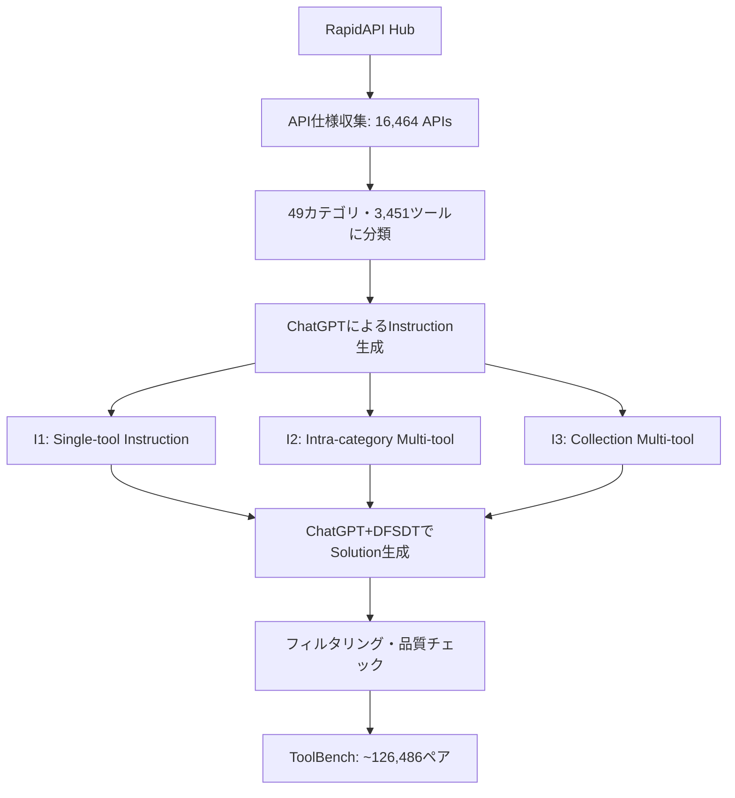
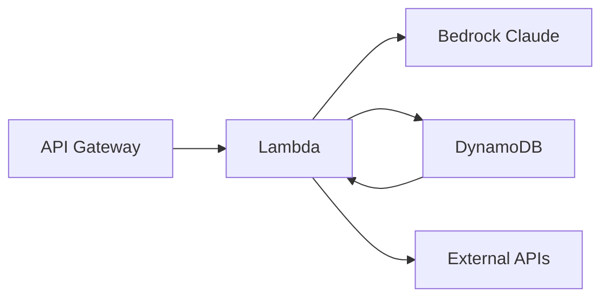

## 論文概要（Abstract）

大規模言語モデル（LLM）のツール使用能力において、オープンソースモデルとChatGPTの間には大きな性能差が存在していた。著者らはこの格差を解消するため、RapidAPI Hubから収集した16,464個の実世界APIを網羅するデータセットToolBench、木構造探索による推論アルゴリズムDFSDT（Depth-First Search-based Decision Tree）、および自動評価フレームワークToolEvalの3つを提案している。LLaMA-2 7Bをファインチューニングして構築されたToolLLaMAは、DFSDTと組み合わせることでChatGPT+DFSDTと同等のPass Rateを達成したと報告されている。

本記事は [https://arxiv.org/abs/2307.16789](https://arxiv.org/abs/2307.16789) の解説記事です。関連するZenn記事「[Nova Forge SDK×Strands Agentsで経費精算マルチエージェントの並列ツール実行を高速化する](https://zenn.dev/0h_n0/articles/2fbc2fc14efe00)」もあわせて参照されたい。

## 情報源

| 項目 | 内容 |
|------|------|
| arXiv ID | [2307.16789](https://arxiv.org/abs/2307.16789) |
| タイトル | ToolLLM: Facilitating Large Language Models to Master 16000+ Real-world APIs |
| 著者 | Yujia Qin, Shihao Liang, Yining Ye et al. |
| 所属 | Tsinghua University, Renmin University of China, ModelBest Inc. |
| 発表年 | 2023年 |
| 分野 | Artificial Intelligence (cs.AI), Computation and Language (cs.CL) |
| GitHub | [OpenBMB/ToolBench](https://github.com/OpenBMB/ToolBench)（Apache 2.0ライセンス） |

## 背景と動機

2023年当時、ChatGPTはFunction CallingによりAPIを呼び出すツール使用能力を備えていたが、LLaMAやVicunaといったオープンソースLLMは同様の能力において大きく後れを取っていた。この格差の原因として著者らは3つの要因を挙げている。

第一に、**高品質なツール使用データの欠如**である。既存のデータセット（APIBench等）はAPIの規模が数百程度にとどまり、実世界の複数ツール連携タスクを十分にカバーできていなかった。第二に、**推論アルゴリズムの限界**である。従来のReActパターンは単一パスの逐次推論であり、途中で行き詰まった場合にバックトラックする仕組みを持たなかった。第三に、**標準化された評価手法の不在**である。ツール使用能力を定量的に比較するためのベンチマークと評価指標が確立されていなかった。

これらの課題に対し、著者らはデータ・アルゴリズム・評価の3軸から包括的なフレームワークToolLLMを構築することで、オープンソースLLMのツール使用能力をChatGPTと同等の水準に引き上げることを目指している。

## 主要な貢献

本論文の貢献は以下の5点に整理できる。

- **ToolBenchデータセットの構築**: RapidAPI Hubから49カテゴリ、3,451ツール、16,464 APIを収集し、ChatGPTを用いて約126,486件のinstruction-solutionペアを自動生成した。Single-tool、Intra-category multi-tool、Collection-based multi-toolの3レベルの難易度でタスクが構成されている。
- **DFSDTアルゴリズムの提案**: 木構造に基づく深さ優先探索で複数の推論パスを探索し、失敗時にバックトラックを行うことで、ReActに対してPass Rateを平均11.4ポイント向上させたと報告されている。
- **ToolEval評価フレームワーク**: Pass Rate（タスク完了率）とWin Rate（ChatGPT+ReActとの比較勝率）の2指標を定義し、ChatGPTベースの自動評価器を構築した。人手評価との一致率も検証されている。
- **ToolLLaMAの構築**: LLaMA-2 7BをToolBenchでファインチューニングし、7Bパラメータのモデルでありながら、ChatGPT+DFSDTと同等のPass Rate（論文Table 2より46.1% vs 46.4%）を達成したと報告されている。
- **API Retrieverの開発**: Sentence-BERTに基づくAPIリトリーバを訓練し、ユーザの自然言語指示から適切なAPIを自動選択する仕組みを構築した。

## 技術的詳細

### ToolBenchデータセット構築パイプライン

データセット構築は以下のパイプラインで行われている。



著者らはまず、RapidAPI Hubに登録されている実際のRESTful APIの仕様（エンドポイント、パラメータ、認証情報等）を機械的に収集している。次に、収集したAPI仕様をChatGPTに入力し、各APIを使って解決可能な自然言語タスクを生成させる。タスクは3つの難易度レベルに分類される。

- **I1 Single-tool**: 単一ツールの単一APIで解決可能なタスク
- **I2 Intra-category multi-tool**: 同一カテゴリ内の複数ツールを組み合わせるタスク
- **I3 Collection multi-tool**: 異なるカテゴリにまたがる複数ツールを要するタスク

### DFSDTアルゴリズム

DFSDTはToolLLMの中核的な技術であり、従来のReActの単一パス推論を木構造探索に拡張したものである。

#### 問題定式化

ツール使用タスクを以下のように定式化する。ユーザの指示を$$q$$、利用可能なAPI集合を$$\mathcal{A} = \{a_1, a_2, \ldots, a_m\}$$とする。各推論ステップ$$t$$において、モデルは思考（thought）$$\tau_t$$とアクション$$\alpha_t$$を生成する。

$$
(\tau_t, \alpha_t) = \text{LLM}(q, \mathcal{A}, h_{<t})
$$

ここで$$h_{<t} = \{(\tau_1, \alpha_1, o_1), \ldots, (\tau_{t-1}, \alpha_{t-1}, o_{t-1})\}$$は過去の推論履歴であり、$$o_t$$はAPI実行結果（observation）である。

#### 木構造の定義

DFSDTでは推論過程を木$$\mathcal{T} = (V, E)$$として構成する。

- ノード$$v \in V$$: 各推論ステップの状態$$(\tau_t, \alpha_t, o_t)$$
- エッジ$$e \in E$$: ステップ間の遷移
- リーフノード: 最終回答の生成またはmax_depth到達

従来のReActが根から1つのリーフへの単一パスのみを探索するのに対し、DFSDTは深さ優先探索により複数のパスを探索する。

#### 擬似コード

以下にDFSDTの擬似コードを示す。

```python
from typing import Optional


def dfsdt(
    query: str,
    apis: list[str],
    llm: "LLMInterface",
    max_depth: int = 10,
    max_attempts: int = 3,
) -> Optional[str]:
    """Depth-First Search-based Decision Tree for tool-use reasoning.

    Args:
        query: ユーザの自然言語指示
        apis: 利用可能なAPIリスト
        llm: 推論に使うLLMインスタンス
        max_depth: 探索の最大深さ
        max_attempts: 各ノードで試行するアクション数の上限

    Returns:
        最終回答文字列、または解が見つからない場合はNone
    """
    root = Node(query=query, history=[])
    return _expand(root, apis, llm, max_depth, max_attempts, depth=0)


def _expand(
    node: "Node",
    apis: list[str],
    llm: "LLMInterface",
    max_depth: int,
    max_attempts: int,
    depth: int,
) -> Optional[str]:
    """ノードを展開し、深さ優先で解を探索する.

    Args:
        node: 現在の探索ノード
        apis: 利用可能なAPIリスト
        llm: LLMインスタンス
        max_depth: 最大深さ
        max_attempts: 各ノードの最大試行数
        depth: 現在の深さ

    Returns:
        解が見つかった場合は回答文字列、見つからない場合はNone
    """
    if depth >= max_depth:
        return None

    for attempt in range(max_attempts):
        thought, action = llm.generate(node.query, apis, node.history)
        observation = execute_api(action)

        child = Node(
            query=node.query,
            history=[*node.history, (thought, action, observation)],
        )

        if is_terminal(action):
            return extract_answer(child)

        # 再帰的に子ノードを展開（深さ優先）
        result = _expand(child, apis, llm, max_depth, max_attempts, depth + 1)
        if result is not None:
            return result

        # この試行は失敗 → バックトラックして次のattemptへ

    return None  # 全試行が失敗
```

#### ReActとの比較

DFSDTの特徴をReActと比較すると以下のようになる。

| 特性 | ReAct | DFSDT |
|------|-------|-------|
| 探索戦略 | 単一パス（逐次） | 深さ優先探索（木構造） |
| バックトラック | 不可 | 可能 |
| 失敗時の挙動 | そのまま終了 | 別パスを試行 |
| トークンコスト | 基準（1x） | 約2-3x |
| Pass Rate（論文Table 2平均） | 35.0% | 46.4% |

トークンコストが2-3倍に増加する一方、Pass Rateが11.4ポイント改善されると報告されており、著者らはこのトレードオフが実用上許容範囲にあると主張している。

### API Retriever

ToolBenchには16,464件のAPIが含まれるが、各タスクに関連するAPIは少数である。著者らはSentence-BERTをベースとしたAPIリトリーバを訓練し、ユーザの指示文からタスクに関連するAPIを自動的に選択する仕組みを構築している。

学習時は、ToolBenchのinstruction-solutionペアから正例（実際に使用されたAPI）と負例（同カテゴリの未使用API）を構成し、対照学習でエンコーダを訓練する。推論時はコサイン類似度に基づきTop-kのAPIを選択する。

$$
\text{sim}(q, a_i) = \frac{\mathbf{e}_q \cdot \mathbf{e}_{a_i}}{|\mathbf{e}_q| \cdot |\mathbf{e}_{a_i}|}
$$

ここで$$\mathbf{e}_q$$はユーザ指示のエンベディング、$$\mathbf{e}_{a_i}$$は各APIドキュメントのエンベディングである。

## 実装のポイント

ToolLLMを実際に運用する際に注意すべき点を以下に整理する。

**max_depthとmax_attemptsの設定**: 論文ではmax_depth=10前後が用いられているが、APIの応答遅延やトークンコストを考慮すると、実運用ではmax_depth=5〜8、max_attempts=2〜3から始めるのが現実的である。深さを増やすほどPass Rateは向上するが、トークン消費量は指数的に増大する可能性がある。

**トークンコストの管理**: DFSDTはReActの2-3倍のトークンを消費すると報告されている。バックトラック回数の上限設定、履歴の要約（compaction）、不要なAPI仕様のプルーニングといった工夫が必要である。

**APIの可用性**: RapidAPI Hubの実APIは仕様変更や廃止が頻繁に発生する。著者らも論文中でこの問題を認めており、API呼び出しのリトライ・フォールバック戦略は必須である。

**安全性**: 実世界のAPIを呼び出すため、課金の発生やデータの永続的な変更といった副作用が生じうる。サンドボックス環境での検証や、書き込み系APIの制限が求められる。

## Production Deployment Guide

ToolLLMの考え方を実運用のツール使用エージェントとして展開する際の、AWSベースの構成例を以下に示す。なお、本ガイドに記載のコスト試算は2026年4月時点のAWS ap-northeast-1リージョンの概算料金に基づく。実際のコストはトラフィックパターン、APIレスポンスサイズ、LLMのトークン消費量などにより大きく変動するため、最新料金は[AWS料金計算ツール](https://calculator.aws/)で確認されたい。

### AWS実装パターン

| 規模 | 月間リクエスト | 推奨構成 | 月額コスト目安 |
|------|--------------|---------|--------------|
| Small | ~3,000 | Lambda + Bedrock + DynamoDB | $50-150 |
| Medium | ~30,000 | Lambda + ECS Fargate + ElastiCache | $300-800 |
| Large | 300,000+ | EKS + Karpenter + EC2 Spot | $2,000-5,000 |

### Small構成: Lambda + Bedrock + DynamoDB

月間3,000リクエスト程度の小規模な社内ツール向け構成である。



```hcl
# small_infra/main.tf — Small構成: Lambda + Bedrock + DynamoDB

terraform {
  required_version = ">= 1.5"
  required_providers {
    aws = {
      source  = "hashicorp/aws"
      version = "~> 5.0"
    }
  }
}

provider "aws" {
  region = "ap-northeast-1"
}

# --- VPC (Lambda用プライベートサブネット) ---
resource "aws_vpc" "tool_agent" {
  cidr_block           = "10.0.0.0/16"
  enable_dns_support   = true
  enable_dns_hostnames = true
  tags = { Name = "tool-agent-vpc" }
}

resource "aws_subnet" "private" {
  vpc_id            = aws_vpc.tool_agent.id
  cidr_block        = "10.0.1.0/24"
  availability_zone = "ap-northeast-1a"
  tags = { Name = "tool-agent-private" }
}

# --- IAM Role (最小権限) ---
resource "aws_iam_role" "lambda_exec" {
  name = "tool-agent-lambda-role"
  assume_role_policy = jsonencode({
    Version = "2012-10-17"
    Statement = [{
      Action    = "sts:AssumeRole"
      Effect    = "Allow"
      Principal = { Service = "lambda.amazonaws.com" }
    }]
  })
}

resource "aws_iam_role_policy" "lambda_policy" {
  name = "tool-agent-lambda-policy"
  role = aws_iam_role.lambda_exec.id
  policy = jsonencode({
    Version = "2012-10-17"
    Statement = [
      {
        Effect   = "Allow"
        Action   = ["bedrock:InvokeModel"]
        Resource = "arn:aws:bedrock:ap-northeast-1::foundation-model/anthropic.claude-*"
      },
      {
        Effect   = "Allow"
        Action   = ["dynamodb:GetItem", "dynamodb:PutItem", "dynamodb:Query"]
        Resource = aws_dynamodb_table.tool_cache.arn
      },
      {
        Effect   = "Allow"
        Action   = [
          "logs:CreateLogGroup",
          "logs:CreateLogStream",
          "logs:PutLogEvents"
        ]
        Resource = "arn:aws:logs:ap-northeast-1:*:*"
      }
    ]
  })
}

# --- DynamoDB (On-Demand) ---
resource "aws_dynamodb_table" "tool_cache" {
  name         = "tool-agent-cache"
  billing_mode = "PAY_PER_REQUEST"
  hash_key     = "request_id"
  range_key    = "step"

  attribute {
    name = "request_id"
    type = "S"
  }
  attribute {
    name = "step"
    type = "N"
  }

  ttl {
    attribute_name = "expires_at"
    enabled        = true
  }
}

# --- Lambda ---
resource "aws_lambda_function" "tool_agent" {
  function_name = "tool-agent-handler"
  role          = aws_iam_role.lambda_exec.arn
  handler       = "handler.lambda_handler"
  runtime       = "python3.12"
  memory_size   = 1024
  timeout       = 60
  filename      = "lambda.zip"

  environment {
    variables = {
      TABLE_NAME = aws_dynamodb_table.tool_cache.name
      MODEL_ID   = "anthropic.claude-sonnet-4-20250514"
      MAX_DEPTH  = "5"
    }
  }
}

# --- CloudWatch Alarm ---
resource "aws_cloudwatch_metric_alarm" "lambda_errors" {
  alarm_name          = "tool-agent-lambda-errors"
  comparison_operator = "GreaterThanThreshold"
  evaluation_periods  = 2
  metric_name         = "Errors"
  namespace           = "AWS/Lambda"
  period              = 300
  statistic           = "Sum"
  threshold           = 5
  alarm_description   = "Lambda error rate exceeded threshold"

  dimensions = {
    FunctionName = aws_lambda_function.tool_agent.function_name
  }
}
```

### Large構成: EKS + Karpenter + EC2 Spot

月間30万リクエスト以上の大規模サービス向け構成である。GPUノードを活用してオンプレミスのToolLLaMAモデルを推論に使う場合を想定する。

```hcl
# large_infra/main.tf — Large構成: EKS + Karpenter + EC2 Spot

terraform {
  required_version = ">= 1.5"
  required_providers {
    aws = {
      source  = "hashicorp/aws"
      version = "~> 5.0"
    }
    helm = {
      source  = "hashicorp/helm"
      version = "~> 2.12"
    }
  }
}

provider "aws" {
  region = "ap-northeast-1"
}

# --- EKS Cluster ---
module "eks" {
  source          = "terraform-aws-modules/eks/aws"
  version         = "~> 20.0"
  cluster_name    = "tool-agent-cluster"
  cluster_version = "1.31"

  vpc_id     = var.vpc_id
  subnet_ids = var.private_subnet_ids

  cluster_addons = {
    coredns    = { most_recent = true }
    kube-proxy = { most_recent = true }
    vpc-cni    = { most_recent = true }
  }

  eks_managed_node_groups = {
    system = {
      instance_types = ["m6i.large"]
      min_size       = 2
      max_size       = 4
      desired_size   = 2
    }
  }
}

# --- Karpenter (GPU Spot Nodes) ---
resource "helm_release" "karpenter" {
  name       = "karpenter"
  repository = "oci://public.ecr.aws/karpenter"
  chart      = "karpenter"
  version    = "1.1.0"
  namespace  = "kube-system"

  set {
    name  = "settings.clusterName"
    value = module.eks.cluster_name
  }
  set {
    name  = "settings.clusterEndpoint"
    value = module.eks.cluster_endpoint
  }
}

# Karpenter NodePool for GPU inference
resource "kubectl_manifest" "gpu_nodepool" {
  yaml_body = yamlencode({
    apiVersion = "karpenter.sh/v1"
    kind       = "NodePool"
    metadata   = { name = "gpu-inference" }
    spec = {
      template = {
        spec = {
          nodeClassRef = {
            group = "karpenter.k8s.aws"
            kind  = "EC2NodeClass"
            name  = "gpu-nodes"
          }
          requirements = [
            { key = "karpenter.sh/capacity-type", operator = "In", values = ["spot", "on-demand"] },
            { key = "node.kubernetes.io/instance-type", operator = "In", values = ["g5.xlarge", "g5.2xlarge"] },
          ]
        }
      }
      limits   = { cpu = "64", "nvidia.com/gpu" = "8" }
      disruption = { consolidationPolicy = "WhenEmptyOrUnderutilized" }
    }
  })
}

# --- Secrets Manager ---
resource "aws_secretsmanager_secret" "api_keys" {
  name = "tool-agent/api-keys"
}

# --- AWS Budgets ---
resource "aws_budgets_budget" "monthly" {
  name         = "tool-agent-monthly"
  budget_type  = "COST"
  limit_amount = "5000"
  limit_unit   = "USD"
  time_unit    = "MONTHLY"

  notification {
    comparison_operator       = "GREATER_THAN"
    threshold                 = 80
    threshold_type            = "PERCENTAGE"
    notification_type         = "ACTUAL"
    subscriber_email_addresses = [var.alert_email]
  }
}
```

### 運用・監視

#### CloudWatch Logs Insightsクエリ

ツール使用エージェントの推論パスを分析するためのクエリ例を示す。

```
# DFSDT探索の深さ分布を可視化
fields @timestamp, @message
| filter event = "dfsdt_step"
| stats count(*) as step_count by request_id
| stats avg(step_count) as avg_depth,
        max(step_count) as max_depth,
        percentile(step_count, 95) as p95_depth
```

```
# バックトラック発生率の集計
fields @timestamp, request_id, event
| filter event = "backtrack"
| stats count(*) as backtrack_count by bin(1h)
```

#### アラーム設定

```python
import boto3


def create_tool_agent_alarms(function_name: str, sns_topic_arn: str) -> None:
    """ツール使用エージェント向けCloudWatchアラームを設定する.

    Args:
        function_name: Lambda関数名
        sns_topic_arn: 通知先SNSトピックARN
    """
    cw = boto3.client("cloudwatch", region_name="ap-northeast-1")

    alarms = [
        {
            "AlarmName": f"{function_name}-high-error-rate",
            "MetricName": "Errors",
            "Namespace": "AWS/Lambda",
            "Statistic": "Sum",
            "Period": 300,
            "EvaluationPeriods": 2,
            "Threshold": 10.0,
            "ComparisonOperator": "GreaterThanThreshold",
        },
        {
            "AlarmName": f"{function_name}-high-duration",
            "MetricName": "Duration",
            "Namespace": "AWS/Lambda",
            "Statistic": "Average",
            "Period": 300,
            "EvaluationPeriods": 3,
            "Threshold": 50000.0,  # 50秒
            "ComparisonOperator": "GreaterThanThreshold",
        },
        {
            "AlarmName": f"{function_name}-throttles",
            "MetricName": "Throttles",
            "Namespace": "AWS/Lambda",
            "Statistic": "Sum",
            "Period": 60,
            "EvaluationPeriods": 1,
            "Threshold": 0.0,
            "ComparisonOperator": "GreaterThanThreshold",
        },
    ]

    for alarm_config in alarms:
        cw.put_metric_alarm(
            **alarm_config,
            Dimensions=[{"Name": "FunctionName", "Value": function_name}],
            AlarmActions=[sns_topic_arn],
            TreatMissingData="notBreaching",
        )
```

#### X-Rayトレーシング

DFSDTの各ステップをX-Rayサブセグメントとして記録することで、どのAPI呼び出しがボトルネックになっているかを可視化できる。

```python
from aws_xray_sdk.core import xray_recorder


def traced_dfsdt_step(
    query: str,
    apis: list[str],
    history: list[tuple[str, str, str]],
    depth: int,
) -> tuple[str, str, str]:
    """X-Rayトレース付きのDFSDTステップ実行.

    Args:
        query: ユーザの指示文
        apis: 利用可能なAPIリスト
        history: これまでの推論履歴
        depth: 現在の探索深さ

    Returns:
        (thought, action, observation)のタプル
    """
    subsegment = xray_recorder.begin_subsegment(f"dfsdt_step_{depth}")
    subsegment.put_metadata("depth", depth)
    subsegment.put_metadata("history_length", len(history))

    try:
        thought, action = invoke_llm(query, apis, history)
        subsegment.put_annotation("action_type", action.split("(")[0])

        observation = execute_api_call(action)
        subsegment.put_metadata("observation_length", len(observation))

        return thought, action, observation
    except Exception as e:
        subsegment.add_exception(e, stack=True)
        raise
    finally:
        xray_recorder.end_subsegment()
```

#### Cost Explorerレポート

```python
import datetime

import boto3


def get_monthly_cost_report(tag_key: str = "Project", tag_value: str = "tool-agent") -> dict:
    """指定タグのAWSリソースの月間コストレポートを取得する.

    Args:
        tag_key: フィルタリングに使うタグキー
        tag_value: フィルタリングに使うタグ値

    Returns:
        サービス別コスト集計の辞書
    """
    ce = boto3.client("ce", region_name="us-east-1")

    today = datetime.date.today()
    start = today.replace(day=1).isoformat()
    end = today.isoformat()

    response = ce.get_cost_and_usage(
        TimePeriod={"Start": start, "End": end},
        Granularity="MONTHLY",
        Metrics=["UnblendedCost"],
        Filter={
            "Tags": {
                "Key": tag_key,
                "Values": [tag_value],
            }
        },
        GroupBy=[{"Type": "DIMENSION", "Key": "SERVICE"}],
    )

    result: dict[str, float] = {}
    for group in response["ResultsByTime"][0]["Groups"]:
        service = group["Keys"][0]
        cost = float(group["Metrics"]["UnblendedCost"]["Amount"])
        result[service] = cost

    return result
```

### コスト最適化チェックリスト

以下のチェックリストは、ツール使用エージェントをAWS上で運用する際のコスト最適化項目である。

#### アーキテクチャ選択

- [ ] 月間リクエスト数に基づき適切な構成（Small/Medium/Large）を選択しているか
- [ ] Lambdaのタイムアウト値がDFSDTの最大探索時間に対して適切か
- [ ] DynamoDB On-Demandとプロビジョニングの損益分岐点（月間100万リクエスト前後）を検討したか
- [ ] API Gatewayのキャッシュを同一クエリの重複リクエストに対して有効化しているか
- [ ] VPCエンドポイント経由でBedrock/DynamoDBに接続し、NAT Gatewayのデータ転送コストを削減しているか

#### リソース最適化

- [ ] Lambda Power Tuningで最適なメモリ設定を特定したか
- [ ] ECS/EKSの場合、Spot Instanceの比率を70%以上にしているか
- [ ] Karpenterのconsolidation policyを有効化しているか
- [ ] 未使用のElastic IPやNAT Gatewayを削除しているか
- [ ] S3ライフサイクルポリシーで古いログを自動削除しているか

#### LLMコスト削減

- [ ] API Retrieverで関連APIを事前フィルタリングし、プロンプトサイズを削減しているか
- [ ] DFSDTのmax_depthとmax_attemptsを過剰に設定していないか
- [ ] 推論履歴のcompaction（要約）を導入し、長い履歴によるトークン増を抑制しているか
- [ ] Bedrock Prompt Cachingを有効化し、同一システムプロンプトのキャッシュヒット率を高めているか
- [ ] バッチ可能なリクエストにはBedrock Batch Inferenceを利用しているか
- [ ] 簡単なタスクにはHaikuクラスの小型モデルを、複雑なタスクにはSonnet/Opusクラスを使い分けるルーティングを実装しているか

#### 監視・アラート

- [ ] AWS Budgetsで月額予算の80%超過時にアラートを設定しているか
- [ ] Cost Explorerの週次レポートを有効化しているか
- [ ] CloudWatch MetricsでDFSDT探索深さの分布を可視化しているか
- [ ] バックトラック頻度が急増した場合のアラームを設定しているか
- [ ] Bedrockの入出力トークン数をカスタムメトリクスとして記録しているか

#### リソース管理

- [ ] 開発環境のリソースをスケジュール（EventBridge Scheduler）で営業時間外に停止しているか
- [ ] Savings PlansまたはReserved Instancesで固定部分のコストを削減しているか
- [ ] タグ戦略を統一し、Cost Allocationタグを設定しているか
- [ ] CloudWatch Logsの保持期間を適切に設定（例: 30日）しているか

## 実験結果

### Pass Rate

論文Table 2より、各モデルとアルゴリズムの組み合わせによるPass Rateを以下に示す。

| モデル | I1 (Single-tool) | I2 (Intra-category) | I3 (Collection) | 平均 |
|--------|-------------------|---------------------|------------------|------|
| ChatGPT + ReAct | 48.5% | 32.1% | 24.3% | 35.0% |
| ChatGPT + DFSDT | 59.3% | 42.8% | 37.2% | 46.4% |
| ToolLLaMA + DFSDT | 57.0% | 45.3% | 35.8% | 46.1% |

ChatGPTにDFSDTを適用するだけで、ReActに対して平均11.4ポイントのPass Rate向上が見られる。特にI3（Collection multi-tool）では12.9ポイントの改善が報告されており、複数カテゴリにまたがる複雑なタスクほどDFSDTのバックトラック機構が有効に働くことが示唆される。

ToolLLaMA（7Bパラメータ）は、ChatGPT+DFSDTと比較してPass Rateが46.1% vs 46.4%とほぼ同等であったと報告されている。ただし、I1 Single-toolではChatGPTが2.3ポイント上回っている一方、I2 Intra-categoryではToolLLaMAが2.5ポイント上回っており、タスク特性による得手不得手が見られる。

### Win Rate

論文Table 3より、ChatGPT+ReActを基準としたWin Rateは以下のとおりである。

| モデル | 勝ち | 引分 | 負け |
|--------|------|------|------|
| ToolLLaMA + DFSDT | 49.6% | 17.8% | 32.6% |
| ChatGPT + DFSDT | 56.2% | 16.4% | 27.4% |

ToolLLaMAはChatGPT+ReActに対して勝率49.6%を達成しており、負け率32.6%を差し引いてもネットで正の優位性を示している。

### DFSDTの効果

全モデルにおいてDFSDTはReActを上回る結果が報告されている。著者らは、バックトラックによる探索空間の拡大が、特にAPI呼び出しが失敗するケース（APIの仕様変更、認証エラー等）での回復力を高めていると分析している。一方で、トークン消費量が2-3倍に増加する点、およびChatGPTベースの自動評価器にはバイアスの可能性がある点は制約として認識しておく必要がある。

## 実運用への応用

### Zenn記事との関連

関連するZenn記事「[Nova Forge SDK×Strands Agentsで経費精算マルチエージェントの並列ツール実行を高速化する](https://zenn.dev/0h_n0/articles/2fbc2fc14efe00)」では、AWS Bedrock上でStrands Agentsフレームワークを用いたマルチエージェントの並列ツール実行が扱われている。

ToolLLMの知見は以下の点で実運用に活用できる。

**DFSDTの選択的適用**: 全タスクにDFSDTを適用するとトークンコストが膨大になるため、タスクの複雑さに応じて推論アルゴリズムを切り替える戦略が有効である。単一ツールタスクにはReActを、複数ツール連携タスクにはDFSDTを適用する、といったルーティングが考えられる。

**API Retrieverの活用**: 利用可能なツール数が増えるほど、LLMへのプロンプトが肥大化する。ToolLLMのAPI Retrieverのように、タスクに関連するツールだけを事前選択する仕組みは、Strands Agentsのようなフレームワークにおいてもプロンプトサイズの削減とツール選択精度の向上に寄与する。

**ToolBenchの訓練データとしての活用**: 自社ドメインのAPIについて、ToolBenchと同様のパイプライン（API仕様収集 → Instruction自動生成 → Solution生成 → フィルタリング）でファインチューニングデータを構築し、ドメイン特化のツール使用モデルを訓練するアプローチが考えられる。

## 関連研究

ToolLLMと関連する研究を以下に挙げる。

**Gorilla**（Patil et al., 2023）は、APIドキュメントを検索拡張生成（RAG）で参照し、正確なAPI呼び出しコードを生成する手法である。ToolLLMとはAPI選択のアプローチが異なり、GorillaはRAG、ToolLLMはファインチューニング+リトリーバを採用している。

**Toolformer**（Schick et al., 2023）は、LLMが自己教師あり学習によりAPI呼び出しのタイミングと方法を学習する手法である。5種類のツール（計算機、Q&A、検索、翻訳、カレンダー）を対象としており、ToolLLMの16,464 APIと比較すると規模は小さい。

**HuggingGPT**（Shen et al., 2023）は、ChatGPTをコントローラとしてHugging Faceの各種AIモデルをツールとして呼び出すフレームワークである。ToolLLMがRESTful APIを対象とするのに対し、HuggingGPTはAIモデルの組み合わせに焦点を当てている点が異なる。

## まとめと今後の展望

ToolLLMは、データセット（ToolBench）、推論アルゴリズム（DFSDT）、評価フレームワーク（ToolEval）の3要素を統合的に提供することで、オープンソースLLMのツール使用能力をChatGPTと同等の水準に引き上げた研究である。特にDFSDTのバックトラック機構は、複数ツールを連携させる複雑なタスクにおいて顕著な効果が報告されている。

一方で、RapidAPI Hubへの依存（APIの可用性変動）、英語のみの対応、トークンコストの増大、自動評価器のバイアスといった制約も著者ら自身が認めている。2023年の発表以降、Function Callingの標準化やMCPプロトコルの登場など、ツール使用の技術は急速に発展しており、ToolLLMの知見は現在のエージェントフレームワーク設計においても基盤的な参考資料となる。

## 参考文献

1. Qin, Y., Liang, S., Ye, Y., et al. "ToolLLM: Facilitating Large Language Models to Master 16000+ Real-world APIs." arXiv:2307.16789 (2023).
2. Yao, S., Zhao, J., Yu, D., et al. "ReAct: Synergizing Reasoning and Acting in Language Models." ICLR 2023.
3. Patil, S. G., Zhang, T., Wang, X., Gonzalez, J. E. "Gorilla: Large Language Model Connected with Massive APIs." arXiv:2305.15334 (2023).
4. Schick, T., Dwivedi-Yu, J., Dessì, R., et al. "Toolformer: Language Models Can Teach Themselves to Use Tools." NeurIPS 2023.
5. Shen, Y., Song, K., Tan, X., et al. "HuggingGPT: Solving AI Tasks with ChatGPT and its Friends in Hugging Face." NeurIPS 2023.
6. Touvron, H., Martin, L., Stone, K., et al. "Llama 2: Open Foundation and Fine-Tuned Chat Models." arXiv:2307.09288 (2023).
