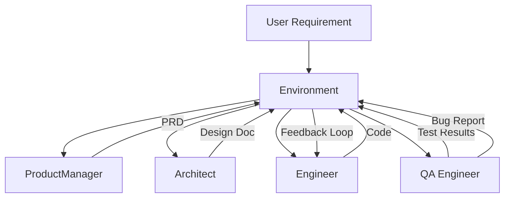
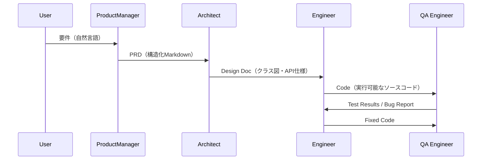

## 論文概要（Abstract）

本記事は [https://arxiv.org/abs/2308.00352](https://arxiv.org/abs/2308.00352) の解説記事です。

MetaGPTは、人間の組織運営で用いられるSOP（Standard Operating Procedures）をプログラム的に定義し、ProductManager・Architect・Engineer・QAといった役割を持つLLMエージェントが構造化メッセージを介して協調するマルチエージェントフレームワークである。著者らは、自由な会話ベースのマルチエージェント協調が抱える「無限ループ」や「成果物の不整合」の問題を、SOPによる決定的な実行フローと型安全な中間成果物で解決することを提案している。ソフトウェア開発タスクにおいて、単一エージェントおよび既存マルチエージェント手法を大幅に上回る成果が報告されている。

この記事は [Zenn記事: Nova Forge SDK×Strands Agentsで経費精算マルチエージェントの並列ツール実行を高速化する](https://zenn.dev/0h_n0/articles/2fbc2fc14efe00) の深掘りです。

## 情報源

- **arXiv ID**: 2308.00352
- **URL**: [https://arxiv.org/abs/2308.00352](https://arxiv.org/abs/2308.00352)
- **著者**: Sirui Hong, Xiawu Zheng, Jonathan Chen et al.
- **発表年**: 2023年
- **分野**: cs.AI, cs.MA
- **GitHub**: [https://github.com/geekan/MetaGPT](https://github.com/geekan/MetaGPT)（MIT License）

## 背景と動機（Background & Motivation）

### 自由会話型マルチエージェントの限界

LLMを複数エージェントとして協調させる試みは2023年時点で活発に研究されていたが、多くのフレームワークは「自由な自然言語会話」でエージェント間を接続していた。この方式には以下の問題が存在する。

1. **無限ループ・発散**: エージェント間の会話が収束せず、同じ論点を繰り返す
2. **成果物の不整合**: 上流エージェントの出力が曖昧なため、下流エージェントが意図と異なる解釈をする
3. **品質の非再現性**: 同じ入力に対して毎回異なる品質の出力が得られ、本番運用に不向き
4. **エラー検知の困難**: 自由テキスト中の誤りを構造的に検出する手段がない

著者らは、人間の組織がSOPと明確な役割分担によって上記の問題を解決していることに着目した。ソフトウェア開発企業では、プロダクトマネージャーがPRDを書き、アーキテクトが設計書を作成し、エンジニアが実装する。各ステップの入出力フォーマットが暗黙的に定義されており、これがチーム全体の品質を担保している。MetaGPTはこの構造をLLMエージェントに移植するアプローチである。

## 主要な貢献（Key Contributions）

- **貢献1: SOPのプログラム的定義**: 各エージェントの入出力スキーマをJSON/Markdownテンプレートとして形式化し、決定的な実行フローを実現
- **貢献2: 役割ベースのエージェント設計**: Role・Goal・Constraintsの3属性でエージェントを定義し、ProductManager→Architect→Engineer→QAのパイプラインを構築
- **貢献3: 構造化メッセージによる通信**: エージェント間の通信を構造化メッセージ（JSONまたはMarkdownテンプレート）に限定し、曖昧性を排除
- **貢献4: 共有メモリ（Environment）**: 全エージェントがアクセス可能な環境オブジェクトにコンテキストを蓄積し、情報の一貫性を維持
- **貢献5: ベンチマークでの優位性**: ソフトウェア開発タスクにおいて、ChatDev等の既存マルチエージェント手法および単一エージェント（GPT-4単体）を上回る成果を報告

## 技術的詳細（Technical Details）

### 全体アーキテクチャ

MetaGPTのアーキテクチャは、Role（役割）・Action（行動）・Environment（環境）の3層で構成される。



### ソフトウェア開発パイプライン



### Role定義の形式化

各エージェントは以下の3属性で定義される。

$$
\text{Agent}_i = (\text{Role}_i, \text{Goal}_i, \text{Constraints}_i)
$$

ここで、
- $\text{Role}_i$: エージェントの役割名（例: "Product Manager"）
- $\text{Goal}_i$: 達成すべき目標の自然言語記述
- $\text{Constraints}_i$: 出力フォーマット・禁止事項等の制約条件

各エージェントのAction（行動）は、入力スキーマ $S_{\text{in}}$ と出力スキーマ $S_{\text{out}}$ で型付けされる。

$$
\text{Action}_i: S_{\text{in}}^{(i)} \rightarrow S_{\text{out}}^{(i)}
$$

パイプライン全体は、上流の出力スキーマが下流の入力スキーマと一致する連鎖として表現される。

$$
S_{\text{out}}^{(i)} \subseteq S_{\text{in}}^{(i+1)}
$$

この型制約により、エージェント間の通信における曖昧性が構造的に排除される。

### 構造化メッセージの設計

MetaGPTでは、エージェント間のメッセージは`Message`型（content, role, cause_by, sent_from, send_to, metadata）として定義される。`cause_by`フィールドにより「どのActionがこのメッセージを生成したか」がトレース可能となり、デバッグ時のエラー追跡を容易にする。

ProductManagerが生成するPRDは、Project Goals / User Stories / Competitive Analysis / Requirements（機能・非機能）の各セクションを持つMarkdownテンプレートに従う。このテンプレート構造が「型」として機能し、Architectが受け取るPRDの品質を一定以上に保つ。

### 共有メモリ（Environment）

Environmentは全エージェントがアクセス可能な共有状態であり、以下の役割を果たす。

1. **メッセージバス**: 各Actionの出力をEnvironmentに登録し、下流エージェントがSubscribeする
2. **コンテキスト蓄積**: 過去の全成果物を保持し、エージェントが必要に応じて参照可能
3. **実行順序の制御**: SOPに基づいてActionの実行順序を決定論的に管理

## 実装のポイント（Implementation）

### MetaGPTのRole定義をPythonで再現する

MetaGPTのGitHubリポジトリ（MIT License）では、Role基底クラスを継承して各エージェントを定義する設計が採用されている。これをZenn記事で紹介されているStrands Agentsの経費精算マルチエージェントに応用する場合、SOPベースのパイプライン設計が有用である。

```python
from typing import Protocol


class ActionResult(Protocol):
    """Action出力の型プロトコル"""
    content: str
    metadata: dict[str, str]


class Role:
    """MetaGPT風のRole基底クラス

    Args:
        name: エージェント名
        goal: 達成目標
        constraints: 出力制約
    """
    def __init__(self, name: str, goal: str, constraints: list[str]) -> None:
        self.name = name
        self.goal = goal
        self.constraints = constraints

    def act(self, input_data: dict[str, str]) -> ActionResult:
        """SOPに基づく行動を実行"""
        raise NotImplementedError
```

経費精算の例では、申請者→承認者→経理担当のパイプラインをSOP的に構造化できる。各ステップの入出力を構造化JSONとして定義することで、Strands AgentsのSupervisorパターンにMetaGPTのSOP概念を導入し、承認フローの品質を安定させることが可能となる。

## Production Deployment Guide

SOPベースのマルチエージェント協調をAWS上で構築するための実践ガイドを以下に示す。Step Functions でパイプラインを管理し、Bedrock でLLM推論を実行し、DynamoDB で共有メモリ（Environment）を実現する構成である。

### AWS実装パターン（コスト最適化重視）

**コスト試算の注意事項**: 以下の料金はすべて2026年4月時点のAWS ap-northeast-1（東京）リージョンの概算値である。実際のコストはトラフィックパターン、リージョン、バースト使用量により変動する。最新料金はAWS料金計算ツール（AWS Pricing Calculator）での確認を推奨する。

| 構成 | トラフィック | 主要サービス | 月額コスト |
|------|-------------|-------------|-----------|
| Small | ~100 req/日 | Lambda + Bedrock + DynamoDB | $50-150 |
| Medium | ~1,000 req/日 | ECS Fargate + Bedrock + DynamoDB | $300-800 |
| Large | 10,000+ req/日 | EKS + Spot + Bedrock Batch | $2,000-5,000 |

**Small構成（~100 req/日）**:
- Lambda（256MB, 最大15分）: 各エージェントを個別Lambda関数として実装。月額~$5
- Step Functions Standard: SOPパイプラインのオーケストレーション。月額~$3
- Bedrock（Claude 3.5 Sonnet）: エージェントごとに1回呼び出し×4ステップ。入力1K+出力1Kトークン/req想定。月額~$30-100
- DynamoDB On-Demand: Environment（共有メモリ）。月額~$5
- CloudWatch Logs: ログ保存。月額~$2

**Medium構成（~1,000 req/日）**:
- ECS Fargate（0.5vCPU, 1GB RAM×2）+ALB: コールドスタート回避。月額~$85
- Bedrock + Prompt Caching（30-90%削減）: 月額~$200-500
- ElastiCache Redis t3.micro: セッション管理。月額~$15

**Large構成（10,000+ req/日）**:
- EKS + Karpenter + Spot（m5.xlarge）: 月額~$275-875
- Bedrock Batch API（50%削減）: 月額~$1,000-3,000
- DynamoDB Reserved Capacity（72%削減）

**コスト削減テクニック**: Spot活用で最大90%削減、Reserved 1年コミットで最大72%削減、Batch APIで50%削減、Prompt Cachingで30-90%削減。

### Terraformインフラコード

**Small構成（Serverless）**: Lambda + Step Functions + Bedrock + DynamoDB

```hcl
# --- Small構成: SOPマルチエージェント (Serverless) ---
# terraform >= 1.8, aws provider >= 5.40

provider "aws" { region = "ap-northeast-1" }

# DynamoDB: 共有メモリ (Environment)
resource "aws_dynamodb_table" "agent_environment" {
  name         = "metagpt-agent-environment"
  billing_mode = "PAY_PER_REQUEST" # On-Demand でコスト最適化
  hash_key     = "session_id"
  range_key    = "step_name"
  attribute { name = "session_id"; type = "S" }
  attribute { name = "step_name";  type = "S" }
  ttl { attribute_name = "expires_at"; enabled = true }
  server_side_encryption { enabled = true } # KMS暗号化
}

# IAMロール: Lambda用 (最小権限)
resource "aws_iam_role" "agent_lambda_role" {
  name = "metagpt-agent-lambda-role"
  assume_role_policy = jsonencode({
    Version = "2012-10-17"
    Statement = [{ Action = "sts:AssumeRole", Effect = "Allow",
                    Principal = { Service = "lambda.amazonaws.com" } }]
  })
}

resource "aws_iam_role_policy" "agent_lambda_policy" {
  name = "metagpt-agent-policy"
  role = aws_iam_role.agent_lambda_role.id
  policy = jsonencode({
    Version = "2012-10-17"
    Statement = [
      { Effect = "Allow", Action = ["bedrock:InvokeModel"],
        Resource = "arn:aws:bedrock:ap-northeast-1::foundation-model/anthropic.claude-3-5-sonnet-*" },
      { Effect = "Allow", Action = ["dynamodb:GetItem","dynamodb:PutItem","dynamodb:Query"],
        Resource = aws_dynamodb_table.agent_environment.arn },
      { Effect = "Allow", Action = ["logs:CreateLogGroup","logs:CreateLogStream","logs:PutLogEvents"],
        Resource = "arn:aws:logs:ap-northeast-1:*:*" },
    ]
  })
}

# Lambda: 各エージェント関数 (PM/Architect/Engineer/QA)
resource "aws_lambda_function" "agent" {
  for_each      = toset(["product_manager","architect","engineer","qa_engineer"])
  function_name = "metagpt-${each.key}"
  runtime       = "python3.12"
  handler       = "handler.lambda_handler"
  role          = aws_iam_role.agent_lambda_role.arn
  timeout       = 900   # 15分 (Bedrock呼び出し含む)
  memory_size   = 256
  filename      = "${path.module}/lambda/${each.key}.zip"
  environment {
    variables = {
      ENVIRONMENT_TABLE = aws_dynamodb_table.agent_environment.name
      BEDROCK_MODEL_ID  = "anthropic.claude-3-5-sonnet-20241022-v2:0"
    }
  }
}
```

**Large構成（Container）**: EKS + Karpenter + Spot Instances

```hcl
# --- Large構成: SOPマルチエージェント (Container) ---
# terraform-aws-modules/eks/aws ~> 20.8 (2026年4月時点最新安定版)

module "eks" {
  source          = "terraform-aws-modules/eks/aws"
  version         = "~> 20.8"
  cluster_name    = "metagpt-sop-cluster"
  cluster_version = "1.31"
  vpc_id          = module.vpc.vpc_id
  subnet_ids      = module.vpc.private_subnets
  cluster_endpoint_public_access = false # パブリックアクセス最小化
}

# Karpenter NodePool: Spot優先でm5.xlarge/m5a.xlarge/m6i.xlarge
# consolidationPolicy: WhenEmptyOrUnderutilized (30s)
# limits: cpu=100, memory=400Gi

# Secrets Manager: metagpt/bedrock-config (recovery 7日)
# AWS Budgets: $5,000/月, 80%到達でアラート
```

### 運用・監視設定

**CloudWatch Logs Insights クエリ**: コスト異常検知

```
fields @timestamp, @message
| filter @message like /bedrock/
| stats sum(input_tokens) as total_input, sum(output_tokens) as total_output by bin(1h)
| sort @timestamp desc
```

**CloudWatch Logs Insights クエリ**: レイテンシ分析

```
fields @timestamp, duration_ms, agent_role
| stats percentile(duration_ms, 95) as p95, percentile(duration_ms, 99) as p99 by agent_role
| sort p99 desc
```

**CloudWatch アラーム設定（Python）**:

```python
import boto3

def create_bedrock_token_alarm(sns_topic_arn: str) -> dict:
    """Bedrockトークン使用量スパイク検知アラームを作成"""
    cw = boto3.client("cloudwatch", region_name="ap-northeast-1")
    return cw.put_metric_alarm(
        AlarmName="metagpt-bedrock-token-spike",
        MetricName="InputTokenCount", Namespace="AWS/Bedrock",
        Statistic="Sum", Period=3600, EvaluationPeriods=1,
        Threshold=500000, ComparisonOperator="GreaterThanThreshold",
        AlarmActions=[sns_topic_arn],
    )
```

**X-Ray トレーシング設定（Python）**:

```python
from aws_xray_sdk.core import xray_recorder, patch_all


def setup_xray_tracing(service_name: str = "metagpt-agent") -> None:
    """X-Ray自動計装を設定（boto3含む全ライブラリを計装）"""
    xray_recorder.configure(service=service_name)
    patch_all()
```

**Cost Explorer自動レポート（Python）**:

```python
import datetime
import json
import boto3


def get_daily_cost_report() -> dict[str, float]:
    """日次コストレポートを取得。$100/日超過でSNS通知"""
    ce = boto3.client("ce", region_name="us-east-1")
    today = datetime.date.today()
    yesterday = today - datetime.timedelta(days=1)
    response = ce.get_cost_and_usage(
        TimePeriod={"Start": str(yesterday), "End": str(today)},
        Granularity="DAILY",
        Metrics=["UnblendedCost"],
        GroupBy=[{"Type": "DIMENSION", "Key": "SERVICE"}],
    )
    costs: dict[str, float] = {}
    for group in response["ResultsByTime"][0]["Groups"]:
        costs[group["Keys"][0]] = float(
            group["Metrics"]["UnblendedCost"]["Amount"]
        )
    if sum(costs.values()) > 100.0:
        sns = boto3.client("sns", region_name="ap-northeast-1")
        sns.publish(
            TopicArn="arn:aws:sns:ap-northeast-1:123456789012:cost-alert",
            Subject="MetaGPT Daily Cost Alert",
            Message=json.dumps(costs, indent=2),
        )
    return costs
```

### コスト最適化チェックリスト

**アーキテクチャ選択** (4項目):
- [ ] ~100 req/日→Serverless（Lambda+Step Functions）
- [ ] ~1,000 req/日→Hybrid（ECS Fargate+Step Functions）
- [ ] 10,000+ req/日→Container（EKS+Karpenter）
- [ ] バッチ処理が多い→Bedrock Batch API優先

**リソース最適化** (5項目):
- [ ] Spot Instances優先（最大90%削減）
- [ ] Reserved Instances 1年コミット（最大72%削減）
- [ ] Compute Savings Plans検討
- [ ] Lambda Power Tuningでメモリ最適化
- [ ] ECS/EKS夜間・週末スケールダウン

**LLMコスト削減** (5項目):
- [ ] Bedrock Batch API（50%削減）
- [ ] Prompt Caching: SOPテンプレートをキャッシュ（30-90%削減）
- [ ] モデル選択: 簡単ステップはHaiku、複雑はSonnet
- [ ] max_tokens設定で出力制限
- [ ] 入力プロンプトから不要コンテキスト削減

**監視・アラート** (5項目):
- [ ] AWS Budgets（80%到達アラート）
- [ ] CloudWatchアラーム（トークンスパイク検知）
- [ ] Cost Anomaly Detection有効化
- [ ] Cost Explorer API日次レポート
- [ ] QuickSightダッシュボード

**リソース管理** (5項目):
- [ ] Trusted Advisor週次確認
- [ ] Project/Environment/CostCenterタグ必須
- [ ] CloudWatch Logs保持30日
- [ ] 開発環境夜間停止（22:00-08:00 JST）
- [ ] ECR未使用イメージ30日自動削除

## 実験結果（Results）

### ソフトウェア開発タスクでの評価

著者らは、ソフトウェア開発タスク（自然言語の要件からコードを生成）においてMetaGPTを評価している。比較対象は以下の手法である。

| 手法 | タイプ | コード実行成功率 | 人間評価スコア |
|------|--------|----------------|---------------|
| GPT-4 (単体) | 単一エージェント | 低 | 中 |
| ChatDev | マルチエージェント（会話型） | 中 | 中 |
| **MetaGPT** | **マルチエージェント（SOP型）** | **高** | **高** |

著者らの報告によると、MetaGPTは以下の点で既存手法を上回っている（論文Table 1-3より）。

1. **コード実行成功率**: ChatDevと比較して有意に高い成功率を達成
2. **コスト効率**: 構造化メッセージにより不要なトークン消費を削減し、API呼び出しコストを抑制
3. **成果物の品質**: PRD・設計書・コード・テストの4段階の成果物が整合性を保つ

ただし、著者らはタスクの複雑さが増すとパイプラインのエラー伝播が問題になることも認めている。上流のPRDに誤りがあると、下流の全ステップに影響が波及するためである。

## 実運用への応用（Practical Applications）

### Zenn記事のSupervisor/Collaboratorパターンとの比較

Zenn記事で紹介されているStrands Agentsの経費精算マルチエージェントは、Supervisorパターン（監督エージェントが各ワーカーを動的に制御）を採用している。MetaGPTのSOPパターンとの主な違いは以下の通りである。

| 特性 | MetaGPT（SOP型） | Supervisor/Collaborator型 |
|------|-------------------|--------------------------|
| 実行フロー | 決定的（パイプライン） | 動的（監督者が判断） |
| 柔軟性 | 低い（SOP変更が必要） | 高い（実行時に分岐可能） |
| 再現性 | 高い | 低い |
| エラーハンドリング | 構造的（スキーマ検証） | 監督者依存 |
| 新ドメイン対応 | SOP再設計が必要 | プロンプト修正で対応可能 |

実運用では、経費精算のような定型業務（SOPが明確に定義可能）にはMetaGPT的アプローチが適し、カスタマーサポートのような非定型業務にはSupervisorパターンが適する。両パターンを組み合わせ、定型部分はSOP、例外処理はSupervisorに委譲するハイブリッド設計も有効である。

## 関連研究（Related Work）

- **AutoGen（Microsoft, 2023）**: 会話ベースのマルチエージェントフレームワーク。柔軟な会話パターンを定義可能だが、SOPのような決定的フローは持たない。MetaGPTとは「構造化 vs 柔軟性」のトレードオフで対比される
- **Strands Agents（AWS, 2025）**: Bedrock統合のエージェントフレームワーク。Supervisorパターンを標準でサポートし、AWSサービスとの親和性が高い。Zenn記事で扱われている並列ツール実行はMetaGPTのパイプライン型とは異なるアプローチ
- **ChatDev（Qian et al., 2023）**: MetaGPTと同時期に提案されたソフトウェア開発マルチエージェント。自由な会話ベースで協調するため柔軟性は高いが、著者らの報告ではMetaGPTに成果物品質で劣るとされている

## まとめと今後の展望

MetaGPTは、人間の組織構造（SOP・役割分担・構造化コミュニケーション）をLLMマルチエージェントに移植するアプローチにより、自由会話型の問題点（無限ループ・成果物不整合・非再現性）を構造的に解決した。AWS上ではStep Functions + Bedrock + DynamoDBの組み合わせでSOPパイプラインを実現可能であり、Strands AgentsのSupervisorパターンとの使い分けが実務上の重要な判断ポイントとなる。

今後の研究方向として、著者らはSOPの自動生成、動的パイプライン再構成、マルチモーダルエージェントへの拡張を示唆している。

## 参考文献

- **arXiv**: [https://arxiv.org/abs/2308.00352](https://arxiv.org/abs/2308.00352)
- **Code**: [https://github.com/geekan/MetaGPT](https://github.com/geekan/MetaGPT)（MIT License）
- **Related Zenn article**: [https://zenn.dev/0h_n0/articles/2fbc2fc14efe00](https://zenn.dev/0h_n0/articles/2fbc2fc14efe00)
- Hong, S. et al. (2023). MetaGPT: Meta Programming for a Multi-Agent Collaborative Framework. arXiv:2308.00352.
- Wu, Q. et al. (2023). AutoGen: Enabling Next-Gen LLM Applications via Multi-Agent Conversation. arXiv:2308.08155.
- Qian, C. et al. (2023). Communicative Agents for Software Development. arXiv:2307.07924.
