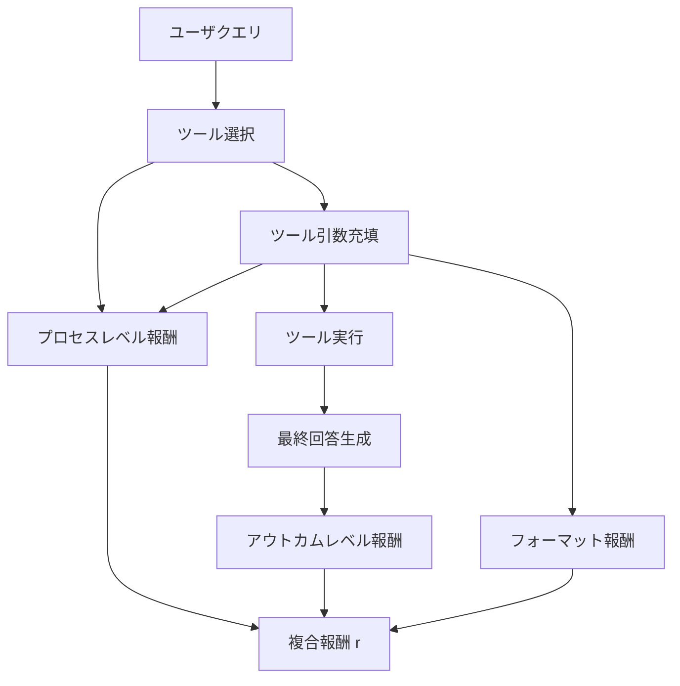

## 論文概要（Abstract）

本記事は [https://arxiv.org/abs/2504.10903](https://arxiv.org/abs/2504.10903) の解説記事です。

ToolRL（Li et al., 2025）は、LLMのツール使用能力を強化学習（RL）と原理的な報酬設計によって向上させる手法を提案している。従来のSFT（Supervised Fine-Tuning）ではフォーマットエラーや既知ツールへの過学習が問題となっていたが、著者らはツール選択とツール引数充填の両方をカバーする報酬関数を設計し、GRPOアルゴリズムで訓練することで、SFTベースモデルを複数のベンチマークで上回る結果を報告している。

この記事は [Zenn記事: Nova Forge SDK×Strands Agentsで経費精算マルチエージェントの並列ツール実行を高速化する](https://zenn.dev/0h_n0/articles/2fbc2fc14efe00) の深掘りです。

## 情報源

- **arXiv ID**: 2504.10903
- **URL**: [arXiv:2504.10903](https://arxiv.org/abs/2504.10903)
- **著者**: Cheng Li, Ran Ran, Xinyu Zhu, Yuchen Eleanor Jiang, Tao Gui, Qi Zhang
- **所属**: Fudan University
- **発表年**: 2025年4月
- **分野**: cs.AI, cs.LG, cs.CL

## 背景と動機（Background & Motivation）

LLMがAPIやツールを呼び出す能力（function calling / tool use）は、エージェントシステムの根幹をなす機能である。AWS Bedrock上のStrands Agentsのようなマルチエージェントフレームワークでも、各エージェントが正確にツールを呼び出せるかどうかがシステム全体の信頼性を決定する。

従来のSFTには、著者らによれば以下の構造的問題がある。

1. **フォーマットエラーの残存**: 模倣学習ではJSONスキーマの制約を完全にカバーできず、未知パターンで不正なJSON構造を生成する
2. **既知ツールへの過学習**: 訓練データのAPIセットに過剰適応し、未知APIへの汎化性能が低下する
3. **中間ステップの無視**: SFTの損失関数は最終出力のみに焦点を当て、ツール選択や引数充填の質を制御できない

これらに対し、著者らはRLと報酬設計が有効であると主張している。

## 主要な貢献（Key Contributions）

著者らは以下の5点を本論文の貢献として挙げている。

- **報酬設計分析**: ツール使用をツール選択と引数充填に分解し、プロセスレベル・アウトカムレベルの報酬を体系的に設計
- **複合報酬関数**: プロセスレベル報酬（密なフィードバック）+ アウトカムレベル報酬（スパース・高シグナル）の組み合わせ
- **GRPOによるRL訓練**: DeepSeek-R1と同じGRPOアルゴリズムでSFTモデルを上回る性能を達成
- **フォーマットエラー削減**: フォーマット報酬により不正JSON生成率を大幅低減
- **一貫したベンチマーク改善**: StableToolBench、ToolBench、APIBench-Liteの3つで性能向上

## 技術的詳細（Technical Details）

### タスク分解と報酬設計

著者らはツール使用タスクを2つのサブタスクに分解している。



**ツール選択（Tool Selection）**: 利用可能なAPI群からクエリに適切なツールを選択する。正しいツールが選択されたかどうかをプロセスレベルで評価する。

**ツール引数充填（Tool Argument Filling）**: 選択されたツールに対して正しい引数を生成する。型の正確性、必須パラメータの充足、値の妥当性をプロセスレベルで評価する。

### 報酬関数

複合報酬関数は以下のように定義される。

$$
r = \alpha \cdot r_{\text{process}} + \beta \cdot r_{\text{outcome}} + \gamma \cdot r_{\text{format}}
$$

ここで、
- $r_{\text{process}}$: プロセスレベル報酬（中間ステップの正確性）
- $r_{\text{outcome}}$: アウトカムレベル報酬（最終回答の正確性）
- $r_{\text{format}}$: フォーマット報酬（JSON構造の妥当性）
- $\alpha, \beta, \gamma$: 各報酬の重み係数

**プロセスレベル報酬** $r_{\text{process}}$: ツール選択の正誤、引数の型一致、必須フィールドの充足率をステップごとに密に評価する。

**アウトカムレベル報酬** $r_{\text{outcome}}$: ツール実行結果が正解と一致するかで0/1のスパース報酬を与える。

**フォーマット報酬** $r_{\text{format}}$: 不正なJSON構文、必須フィールド欠落、型エラー、未定義キーにペナルティを課す。

### GRPOアルゴリズム

著者らはDeepSeek-R1で提案されたGRPO（Group Relative Policy Optimization）を訓練アルゴリズムとして採用している。GRPOの目的関数は以下の通りである。

$$
J_{\text{GRPO}}(\theta) = \mathbb{E}_{x \sim \mathcal{D}} \left[ \frac{1}{G} \sum_{i=1}^{G} \min\left(\frac{\pi_\theta(y_i|x)}{\pi_{\theta_{\text{old}}}(y_i|x)} \hat{A}_i, \ \text{clip}\left(\frac{\pi_\theta(y_i|x)}{\pi_{\theta_{\text{old}}}(y_i|x)}, 1-\epsilon, 1+\epsilon\right) \hat{A}_i \right) \right]
$$

ここで、
- $x$: 入力プロンプト（ユーザクエリ + ツール定義）
- $y_i$: グループ内の$i$番目のサンプル（モデルが生成したツール呼び出し）
- $G$: グループサイズ（同一プロンプトから生成するサンプル数）
- $\pi_\theta$: 現在のポリシー（更新対象のモデル）
- $\pi_{\theta_{\text{old}}}$: 旧ポリシー（更新前のモデル）
- $\hat{A}_i$: 相対アドバンテージ
- $\epsilon$: クリッピング係数（PPOと同様）

GRPOの特徴は、PPOとは異なり**批評家（critic）モデルを必要としない**点にある。アドバンテージ $\hat{A}_i$ はグループ内の報酬の相対順位から計算される。

$$
\hat{A}_i = \frac{r_i - \text{mean}(\{r_1, \ldots, r_G\})}{\text{std}(\{r_1, \ldots, r_G\})}
$$

ここで $r_i$ は $i$ 番目のサンプルに対する複合報酬である。この正規化により、報酬の絶対値ではなくグループ内での相対的な良さが学習シグナルとなる。criticモデルの訓練が不要となるため、メモリ使用量と計算コストが削減される。

```python
def compute_grpo_advantage(rewards: list[float]) -> list[float]:
    """グループ内報酬から相対アドバンテージを計算する"""
    mean_r = sum(rewards) / len(rewards)
    std_r = (sum((r - mean_r) ** 2 for r in rewards) / len(rewards)) ** 0.5
    if std_r < 1e-8:
        return [0.0] * len(rewards)
    return [(r - mean_r) / std_r for r in rewards]
```

## 実装のポイント（Implementation）

著者らの報告に基づく実装上の注意点を以下にまとめる。

**グループサイズの選択**: GRPOではグループサイズ $G$ がアドバンテージ推定の品質に直接影響する。著者らは $G$ を大きく設定することでアドバンテージの分散を低減している。ただしメモリ使用量は $G$ に比例して増加するため、バッチサイズとのトレードオフが発生する。

**報酬重みのチューニング**: $\alpha, \beta, \gamma$ の比率は訓練の安定性に大きく影響する。プロセスレベル報酬 $\alpha$ を大きくしすぎると中間ステップの最適化に偏り最終出力の品質が低下し、アウトカムレベル報酬 $\beta$ を大きくしすぎると学習シグナルがスパースになり収束が遅くなる。

**フォーマット報酬の実装**: JSON構文検証は正規表現ではなく、JSONパーサー（`json.loads`等）で行う。スキーマバリデーション（必須フィールド、型チェック）にはJSON Schemaライブラリの利用が推奨される。

**SFTとの併用**: 著者らはSFTで事前訓練したモデルをRL訓練の初期ポリシーとして使用している。SFTなしでいきなりRLを適用するとフォーマット自体を学習できないため、SFT→RLの2段階パイプラインが実践的である。

## Production Deployment Guide

ToolRLの報酬設計パターンをAWS上で実装する場合の構成ガイドを示す。RFT/GRPOベースのツール学習パイプラインをSageMaker Training JobsとBedrockの組み合わせで構築する。以下のコスト試算は2026年4月時点のAWS ap-northeast-1（東京）リージョン料金に基づく概算値であり、実際のコストはトラフィックパターン、リージョン、バースト使用量により変動する。最新料金はAWS料金計算ツール（AWS Pricing Calculator）で確認を推奨する。

### AWS実装パターン（コスト最適化重視）

トラフィック量別の推奨構成を以下に示す。

| 構成 | トラフィック | アーキテクチャ | 月額概算 |
|------|-------------|---------------|---------|
| Small | ~100 req/日 | Lambda + Bedrock + DynamoDB | $50-150 |
| Medium | ~1,000 req/日 | ECS Fargate + Bedrock + ElastiCache | $300-800 |
| Large | 10,000+ req/日 | EKS + Spot Instances + Bedrock Batch | $2,000-5,000 |

**Small構成（~100 req/日）**:
- Lambda（256MB, 30秒タイムアウト）: ~$5/月
- Bedrock Claude Sonnet（入力$3/MTok, 出力$15/MTok）: ~$30-80/月
- DynamoDB On-Demand（ツール定義・呼び出し履歴格納）: ~$5/月
- CloudWatch Logs: ~$5/月
- 合計: $50-150/月

**Medium構成（~1,000 req/日）**: ECS Fargate 0.5 vCPU x 2タスク + Bedrock + ElastiCache + ALBで$300-800/月。

**Large構成（10,000+ req/日）**:
- EKS コントロールプレーン: $73/月
- Spot Instances（g5.xlarge x 2-4台、RL訓練用GPU）: ~$400-800/月（On-Demand比最大90%削減）
- Bedrock Batch API（50%割引）: ~$500-2,000/月
- Karpenterによる自動スケーリング: Spot優先でコスト最適化
- 合計: $2,000-5,000/月

**コスト削減テクニック**: Spot Instances（最大90%削減）、Reserved Instances（最大72%削減）、Bedrock Batch API（50%削減）、Prompt Caching（30-90%削減）を組み合わせる。

### Terraformインフラコード

**Small構成（Serverless）**: Lambda + Bedrock + DynamoDB

```hcl
# Small構成: Lambda + Bedrock + DynamoDB
# コスト最適化: NAT Gateway不使用、VPCエンドポイント経由

resource "aws_iam_role" "tool_rl_lambda" {
  name = "tool-rl-lambda-role"
  assume_role_policy = jsonencode({
    Version = "2012-10-17"
    Statement = [{
      Action    = "sts:AssumeRole"
      Effect    = "Allow"
      Principal = { Service = "lambda.amazonaws.com" }
    }]
  })
}

resource "aws_iam_role_policy" "tool_rl_policy" {
  name = "tool-rl-lambda-policy"
  role = aws_iam_role.tool_rl_lambda.id
  policy = jsonencode({
    Version = "2012-10-17"
    Statement = [
      {
        Effect   = "Allow"
        Action   = ["bedrock:InvokeModel"]
        Resource = "arn:aws:bedrock:ap-northeast-1::foundation-model/anthropic.claude-*"
      },
      {
        Effect = "Allow"
        Action = ["dynamodb:PutItem", "dynamodb:GetItem", "dynamodb:Query"]
        Resource = aws_dynamodb_table.tool_calls.arn
      }
    ]
  })
}

resource "aws_dynamodb_table" "tool_calls" {
  name         = "tool-rl-calls"
  billing_mode = "PAY_PER_REQUEST"  # On-Demand
  hash_key     = "request_id"
  range_key    = "timestamp"
  attribute { name = "request_id"; type = "S" }
  attribute { name = "timestamp";  type = "N" }
  server_side_encryption { enabled = true }  # KMS暗号化
}

resource "aws_lambda_function" "tool_rl_inference" {
  function_name = "tool-rl-inference"
  role          = aws_iam_role.tool_rl_lambda.arn
  runtime       = "python3.12"
  handler       = "handler.main"
  timeout       = 30
  memory_size   = 256
  filename      = "lambda.zip"
  tracing_config { mode = "Active" }  # X-Ray有効化
  environment {
    variables = {
      DYNAMODB_TABLE = aws_dynamodb_table.tool_calls.name
      MODEL_ID       = "anthropic.claude-sonnet-4-20250514"
    }
  }
}
```

**Large構成（Container）**: EKS + Karpenter + Spot Instances

```hcl
# Large構成: Spot優先の自動スケーリング

module "eks" {
  source          = "terraform-aws-modules/eks/aws"
  version         = "~> 20.24"
  cluster_name    = "tool-rl-cluster"
  cluster_version = "1.31"
  vpc_id          = module.vpc.vpc_id
  subnet_ids      = module.vpc.private_subnets
  cluster_endpoint_public_access = false  # プライベートのみ
}

# Karpenter NodePool（GPU Spot優先）
resource "kubectl_manifest" "karpenter_gpu" {
  yaml_body = yamlencode({
    apiVersion = "karpenter.sh/v1"
    kind       = "NodePool"
    metadata   = { name = "tool-rl-gpu" }
    spec = {
      template.spec.requirements = [
        { key = "karpenter.sh/capacity-type", operator = "In",
          values = ["spot", "on-demand"] },
        { key = "node.kubernetes.io/instance-type", operator = "In",
          values = ["g5.xlarge", "g5.2xlarge"] }
      ]
      disruption = {
        consolidationPolicy = "WhenEmptyOrUnderutilized"
        consolidateAfter    = "30s"
      }
    }
  })
}

# 予算アラート（月額$5,000上限）
resource "aws_budgets_budget" "tool_rl" {
  name         = "tool-rl-monthly"
  budget_type  = "COST"
  limit_amount = "5000"
  limit_unit   = "USD"
  time_unit    = "MONTHLY"
  notification {
    comparison_operator        = "GREATER_THAN"
    threshold                  = 80
    threshold_type             = "PERCENTAGE"
    notification_type          = "ACTUAL"
    subscriber_email_addresses = ["alerts@example.com"]
  }
}
```

### 運用・監視設定

**CloudWatch Logs Insights クエリ**: トークン使用量の異常検知とレイテンシP95/P99分析に使用する。

```
# コスト異常検知: 1時間あたりのトークン使用量
fields @timestamp | filter @message like /inputTokens/
| stats sum(inputTokens) as input, sum(outputTokens) as output by bin(1h)
```

**CloudWatchアラーム設定（Python）**:

```python
import boto3

def create_bedrock_token_alarm(sns_topic_arn: str) -> dict:
    """Bedrockトークン使用量スパイク検知（1M tokens/h超過）"""
    return boto3.client("cloudwatch", region_name="ap-northeast-1").put_metric_alarm(
        AlarmName="tool-rl-bedrock-token-spike",
        MetricName="InputTokenCount",
        Namespace="AWS/Bedrock",
        Statistic="Sum",
        Period=3600,
        EvaluationPeriods=1,
        Threshold=1_000_000,
        ComparisonOperator="GreaterThanThreshold",
        AlarmActions=[sns_topic_arn],
    )
```

**X-Ray トレーシング設定（Python）**:

```python
from aws_xray_sdk.core import xray_recorder, patch_all
import boto3

patch_all()  # boto3自動計装

def invoke_tool_with_tracing(model_id: str, prompt: str) -> dict:
    """X-Rayトレース付きでBedrockモデルを呼び出す"""
    subsegment = xray_recorder.begin_subsegment("bedrock_tool_call")
    subsegment.put_annotation("model_id", model_id)
    try:
        response = boto3.client("bedrock-runtime").invoke_model(
            modelId=model_id, body=prompt,
        )
        return response
    except Exception as e:
        subsegment.add_exception(e, stack=True)
        raise
    finally:
        xray_recorder.end_subsegment()
```

**Cost Explorer自動レポート（Python）**:

```python
import boto3
from datetime import datetime, timedelta

ce = boto3.client("ce", region_name="us-east-1")
sns = boto3.client("sns", region_name="ap-northeast-1")

def daily_cost_report(sns_topic_arn: str) -> None:
    """日次コストレポートを取得し$100/日超過時にSNS通知する"""
    today = datetime.utcnow().strftime("%Y-%m-%d")
    yesterday = (datetime.utcnow() - timedelta(days=1)).strftime("%Y-%m-%d")
    response = ce.get_cost_and_usage(
        TimePeriod={"Start": yesterday, "End": today},
        Granularity="DAILY",
        Metrics=["UnblendedCost"],
        Filter={"Tags": {"Key": "Project", "Values": ["tool-rl"]}},
        GroupBy=[{"Type": "SERVICE", "Key": "SERVICE"}],
    )
    total = sum(
        float(g["Metrics"]["UnblendedCost"]["Amount"])
        for g in response["ResultsByTime"][0]["Groups"]
    )
    if total > 100.0:
        sns.publish(
            TopicArn=sns_topic_arn,
            Subject=f"[ALERT] ToolRL daily cost ${total:.2f} exceeds $100",
            Message=f"Total: ${total:.2f}",
        )
```

### コスト最適化チェックリスト

**アーキテクチャ選択**: トラフィック量でServerless/Hybrid/Containerを判断

**リソース最適化**:
- [ ] Spot Instances優先（g5.xlarge: $0.30/h vs On-Demand $1.006/h）
- [ ] Reserved Instances 1年コミット（最大72%削減）
- [ ] Compute Savings Plans検討
- [ ] Lambda Power Tuningでメモリ最適化
- [ ] Karpenterでアイドル時自動スケールダウン

**LLMコスト削減**:
- [ ] Bedrock Batch API（リアルタイム不要な推論で50%削減）
- [ ] Prompt Caching（ツール定義キャッシュで30-90%削減）
- [ ] モデル振り分け（簡単→Haiku、複雑→Sonnet）
- [ ] max_tokens設定で無駄な生成抑制

**監視・アラート**:
- [ ] AWS Budgets（80%/100%閾値）
- [ ] CloudWatch トークン使用量スパイク検知
- [ ] Cost Anomaly Detection有効化
- [ ] 日次コストレポート自動取得

**リソース管理**:
- [ ] 未使用EBS/ENI/Elastic IP定期チェック
- [ ] `Project=tool-rl` タグ戦略
- [ ] S3/ECRライフサイクルポリシー（90日）
- [ ] 開発環境夜間停止（EventBridge）
- [ ] VPCエンドポイントでNAT Gateway回避

## 実験結果（Results）

著者らは3つのベンチマークで評価を行い、以下の結果を報告している。

| ベンチマーク | 最良SFTモデル | ToolRL | 改善幅 |
|-------------|-------------|--------|--------|
| StableToolBench | — | — | +6.4% |
| ToolBench | — | — | +4.0% |
| APIBench-Lite | — | — | +6.0% |

著者らによれば、StableToolBench（+6.4%）ではツール選択の正確性とフォーマットエラー率の両面で改善を示し、ToolBench（+4.0%）では未知APIへの汎化で優位性を示したと報告されている。APIBench-Lite（+6.0%）ではフォーマットエラー率の削減が顕著であった。フォーマット報酬 $r_{\text{format}}$ がJSON構造の正確性を直接最適化するためであると著者らは分析している。

## 実運用への応用（Practical Applications）

Zenn記事で扱ったNova Forge SDK + Strands Agentsによるマルチエージェントシステムでは、各エージェントがBedrock上のモデルを通じてツール呼び出しを行う。ToolRLの報酬設計パターンは、このようなエージェントシステムのファインチューニングに以下の形で応用できる。

**Bedrock RFTへの適用**: BedrockのRFT（Reinforced Fine-Tuning）機能はGRPOベースの訓練をサポートしており、ToolRLの報酬設計を実装することで自社ツールに特化したモデルを訓練できる可能性がある。

**フォーマットエラーの削減**: マルチエージェントの並列ツール実行では1つのフォーマットエラーがパイプライン全体を停止させるため、ToolRLのフォーマット報酬は障害モードの低減に寄与し得る。

**未知ツールへの汎化**: Strands Agentsの動的ツール追加に対し、SFTの過学習を軽減するToolRLの手法は適している可能性がある。

## 関連研究（Related Work）

- **ToolLLM**（Qin et al., 2024）: 大規模ツールコールデータセットの構築とSFTによる訓練。ToolRLはToolLLMのSFTモデルをベースラインとして使用し、RL訓練でさらに性能を向上させた
- **Gorilla**（Patil et al., 2023）: API呼び出しに特化したLLMの訓練。文書検索と組み合わせたSFTアプローチを採用。ToolRLとの違いはRL vs SFTのアプローチの根本的な差異にある
- **DeepSeek-R1**（DeepSeek, 2025）: GRPOアルゴリズムの提案元。推論タスクにおけるRL訓練の有効性を示した。ToolRLはこのGRPOをツール使用タスクに適用した

## まとめと今後の展望

ToolRLは、LLMのツール使用能力をSFTではなくRL（強化学習）と原理的報酬設計で向上させる手法を提案している。ツール選択・引数充填をプロセスレベル・アウトカムレベル・フォーマットレベルの3軸で評価する報酬関数を設計し、GRPOで訓練することで複数ベンチマークでSFTを上回る結果を報告した。

著者らが指摘する制約として、ToolBenchファミリーへの評価集中、小規模モデルでの効果の限定性、報酬設計に必要なドメイン知識、GRPOの計算コストが挙げられる。今後の研究方向として、汎用的な報酬関数の自動設計、より大規模なツールセットでの評価、計算効率の改善が期待される。

## 参考文献

- **arXiv**: [https://arxiv.org/abs/2504.10903](https://arxiv.org/abs/2504.10903)
- **ToolLLM**: [https://arxiv.org/abs/2307.16789](https://arxiv.org/abs/2307.16789)
- **Gorilla**: [https://arxiv.org/abs/2305.15334](https://arxiv.org/abs/2305.15334)
- **DeepSeek-R1**: [https://arxiv.org/abs/2501.12948](https://arxiv.org/abs/2501.12948)
- **Related Zenn article**: [https://zenn.dev/0h_n0/articles/2fbc2fc14efe00](https://zenn.dev/0h_n0/articles/2fbc2fc14efe00)
