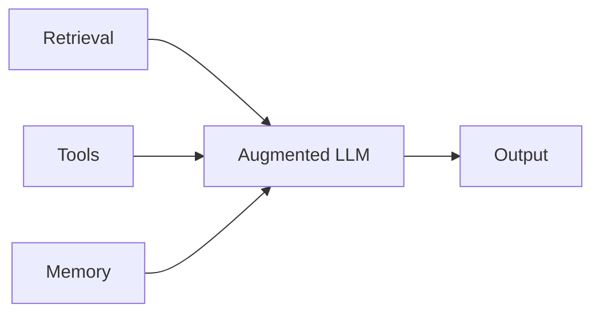
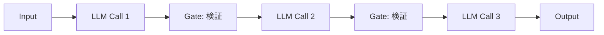
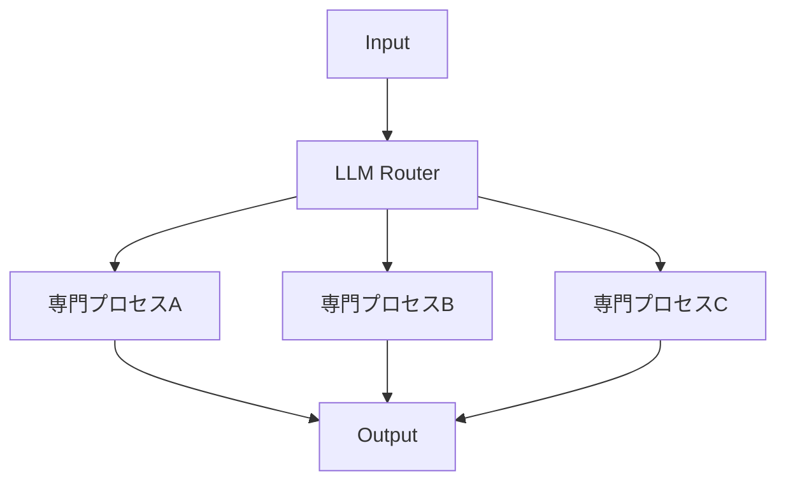
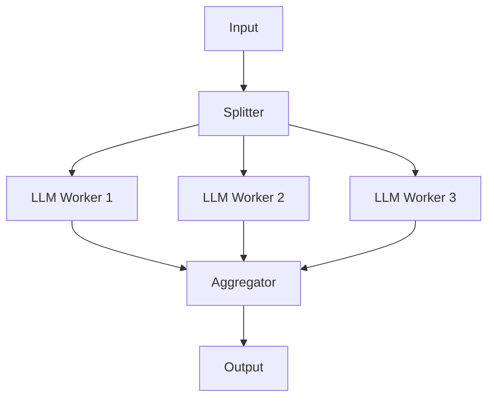
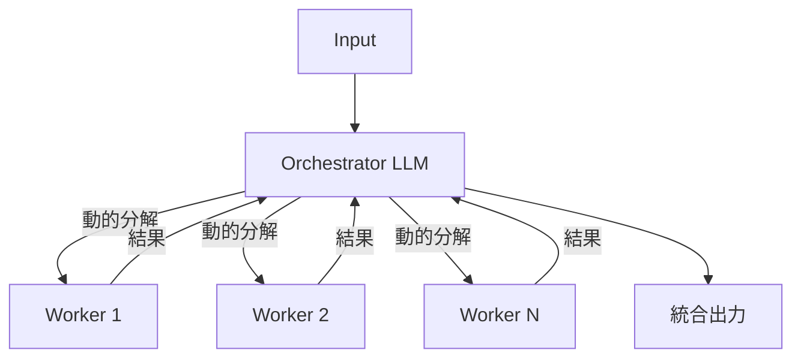
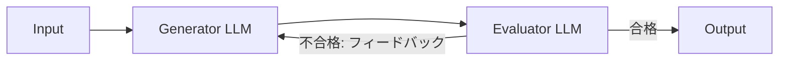

# Anthropic解説: Building Effective Agents

## ブログ概要（Summary）

本記事は [https://www.anthropic.com/research/building-effective-agents](https://www.anthropic.com/research/building-effective-agents) の解説記事です。

Anthropicが2024年12月に公開した **"Building Effective Agents"** は、LLMを活用したエージェントシステムの設計パターンを体系化した実践ガイドです。ブログでは、Workflowsとagentsの区別を起点に、Augmented LLM、Prompt Chaining、Routing、Parallelization、Orchestrator-Workers、Evaluator-Optimizerの6つの設計パターンを整理しています。Anthropicは「複雑さは測定可能な改善がある場合のみ追加すべき」と述べており、シンプルさを重視した段階的な設計アプローチを推奨しています。

この記事は [Zenn記事: Nova Forge SDK×Strands Agentsで経費精算マルチエージェントの並列ツール実行を高速化する](https://zenn.dev/0h_n0/articles/2fbc2fc14efe00) の深掘りです。

---

## 情報源

- **種別**: 企業テックブログ
- **URL**: [https://www.anthropic.com/research/building-effective-agents](https://www.anthropic.com/research/building-effective-agents)
- **組織**: Anthropic
- **発表日**: 2024年12月（推定）

---

## 技術的背景（Technical Background）

LLMエージェントの実装は2024年以降急速に普及しましたが、設計パターンの体系的な整理は十分ではありませんでした。複雑なフレームワークを導入した結果、デバッグ困難でコスト効率の悪いシステムが量産される状況が生まれていました。

Anthropicはこのブログで、**Workflows**（事前定義コードパスでLLMとツールが連携）と **Agents**（LLMが動的にプロセスとツール使用を決定）の区別を明確に定義しています。多くのユースケースではWorkflowで十分であり、Agentsが必要になるのは柔軟な判断が求められる場合に限られると述べています。

Zenn記事の経費精算マルチエージェントは、Parallelization（Sectioning）とOrchestrator-Workersの組み合わせとして理解できます。

---

## 実装アーキテクチャ（Architecture）

Anthropicは、6つの設計パターンを「Building Block（基盤）」から「Agentic Patterns（エージェント的パターン）」へと段階的に整理しています。以下、各パターンの構造を解説します。

### 1. Augmented LLM（基盤）

全てのパターンの出発点となる基盤です。LLM単体ではなく、Retrieval（検索）、Tools（外部API・計算実行）、Memory（過去のコンテキスト保持）で拡張されたLLMを指します。Anthropicは、この基盤の品質（ツールのドキュメント整備、検索精度の向上）がエージェント全体の性能を左右すると述べています。



### 2. Prompt Chaining

タスクをシーケンシャルなステップに分解し、各LLM呼び出しが前の出力を処理するパターンです。ブログでは、各ステップ間にプログラム的な **ゲート（Gate）** を設けて中間結果を検証することを推奨しています。



**適用例**: ドキュメント生成後にコンプライアンスチェックを行う、コード生成後にセキュリティレビューを行うなど。

### 3. Routing

入力を分類し、専門的なフォローアッププロセスに振り分けるパターンです。入力の種別ごとに最適化されたプロンプトやツールセットを用意できるため、汎用的な単一プロンプトよりも精度が向上します。



**適用例**: カスタマーサポートで問い合わせ種別（技術・請求・一般）に応じた処理フローへの振り分け。

### 4. Parallelization

独立したサブタスクを並列処理するパターンです。Anthropicは2つのバリエーションを示しています。

- **Sectioning**: タスクを独立したサブタスクに分解し、それぞれを並列に処理
- **Voting**: 同一タスクを複数回実行し、多数決やコンセンサスで最終結果を決定



Zenn記事のStrands Agentsによる並列ツール実行は、このSectioningパターンに該当します。

### 5. Orchestrator-Workers

中央のオーケストレータLLMが動的にタスクを分解し、ワーカーLLMに委任して結果を統合するパターンです。Parallelizationとの違いは、サブタスクが事前定義ではなく動的に決定される点です。



**適用例**: コーディングエージェントが複雑さに応じてファイル編集・テスト作成・ドキュメント更新を動的に振り分ける。Zenn記事のSupervisor-Collaboratorパターンはこの実装バリエーションです。

### 6. Evaluator-Optimizer

一方のLLMが生成、他方が評価してフィードバックをループするパターンです。生成と評価を分離することで、生成品質を反復的に改善できます。



**適用例**: 文学的翻訳の品質向上、コードレビュー自動化。

---

## Production Deployment Guide

Zenn記事で解説されたOrchestrator-Workers / Supervisor-Collaboratorパターンに対応するAWS構成を、トラフィック量別に示します。

### AWS実装パターン（コスト最適化重視）

**コスト試算の注意事項**: 以下は2026年4月時点のAWS ap-northeast-1（東京）リージョン料金に基づく概算値です。実際のコストはトラフィックパターン、リージョン、バースト使用量により変動します。最新料金は [AWS Pricing Calculator](https://calculator.aws/) で確認してください。

#### Small構成（~100 req/日）: Lambda + Bedrock Serverless

| サービス | 用途 | 月額概算 |
|----------|------|----------|
| Lambda | Orchestrator + Worker実行 | $5-15 |
| Bedrock (Claude 3.5 Sonnet) | LLM推論 | $30-80 |
| DynamoDB (On-Demand) | 会話履歴・タスク状態管理 | $5-10 |
| S3 | 入出力データ保存 | $1-3 |
| CloudWatch | ログ・メトリクス | $5-10 |
| **合計** | | **$46-118/月** |

Orchestrator Lambdaがリクエストを受け取り、Worker Lambdaを非同期Invokeで並列起動。Step Functionsで状態管理を行います。

#### Medium構成（~1,000 req/日）: ECS Fargate + Bedrock

ECS Fargate (0.5vCPU, 1GB x 2タスク) でOrchestrator常駐、Worker実行はLambdaでバースト対応。ElastiCache (t4g.micro) をタスクキュー・キャッシュとして使用。**月額概算: $290-635**。

#### Large構成（10,000+ req/日）: EKS + Karpenter + Spot

EKS ($73) + EC2 Spot m6i.xlarge 3-8台 ($200-600) + Bedrock ($1,200-3,000) + Aurora Serverless v2 ($100-200) + ElastiCache r7g.large ($80-120) + ALB/WAF ($50-80) + 監視 ($30-60)。**月額概算: $1,733-4,133**。

**コスト削減テクニック**: Spot Instances（最大90%削減）、Bedrock Batch API（50%割引）、Prompt Caching（30-90%トークンコスト削減）、Reserved Instances（最大72%削減）を組み合わせて適用します。

### Terraformインフラコード

#### Small構成（Serverless）

```hcl
# Small構成: Lambda + Bedrock + DynamoDB
# Orchestrator-Workers パターンのServerless実装
terraform {
  required_version = ">= 1.8"
  required_providers {
    aws = { source = "hashicorp/aws", version = "~> 5.80" }
  }
}

provider "aws" { region = "ap-northeast-1" }

# IAM: 最小権限（Bedrock + DynamoDB + Lambda Invoke + Logs）
resource "aws_iam_role" "orchestrator_lambda" {
  name               = "agent-orchestrator-role"
  assume_role_policy = jsonencode({
    Version = "2012-10-17"
    Statement = [{ Action = "sts:AssumeRole", Effect = "Allow",
                    Principal = { Service = "lambda.amazonaws.com" } }]
  })
}

resource "aws_iam_role_policy" "orchestrator_policy" {
  name = "orchestrator-policy"
  role = aws_iam_role.orchestrator_lambda.id
  policy = jsonencode({
    Version = "2012-10-17"
    Statement = [
      { Effect = "Allow", Action = ["bedrock:InvokeModel"],
        Resource = "arn:aws:bedrock:ap-northeast-1::foundation-model/anthropic.claude-3-5-sonnet-*" },
      { Effect = "Allow", Action = ["dynamodb:PutItem","dynamodb:GetItem","dynamodb:Query"],
        Resource = aws_dynamodb_table.task_state.arn },
      { Effect = "Allow", Action = ["lambda:InvokeFunction"],
        Resource = aws_lambda_function.worker.arn },
      { Effect = "Allow", Action = ["logs:CreateLogGroup","logs:CreateLogStream","logs:PutLogEvents"],
        Resource = "arn:aws:logs:ap-northeast-1:*:*" }
    ]
  })
}

# DynamoDB: On-Demand + KMS暗号化
resource "aws_dynamodb_table" "task_state" {
  name = "agent-task-state"; billing_mode = "PAY_PER_REQUEST"; hash_key = "task_id"
  attribute { name = "task_id"; type = "S" }
  server_side_encryption { enabled = true }
  point_in_time_recovery { enabled = true }
}

# Lambda: Orchestrator（Bedrock呼び出し含むため timeout=300s）
resource "aws_lambda_function" "orchestrator" {
  function_name = "agent-orchestrator"; runtime = "python3.12"
  handler = "orchestrator.handler"; role = aws_iam_role.orchestrator_lambda.arn
  timeout = 300; memory_size = 512
  filename = "orchestrator.zip"; source_code_hash = filebase64sha256("orchestrator.zip")
  environment { variables = {
    WORKER_FUNCTION_NAME = aws_lambda_function.worker.function_name
    TABLE_NAME           = aws_dynamodb_table.task_state.name
    BEDROCK_MODEL_ID     = "anthropic.claude-3-5-sonnet-20241022-v2:0"
  }}
}

# Lambda: Worker
resource "aws_lambda_function" "worker" {
  function_name = "agent-worker"; runtime = "python3.12"
  handler = "worker.handler"; role = aws_iam_role.orchestrator_lambda.arn
  timeout = 120; memory_size = 256
  filename = "worker.zip"; source_code_hash = filebase64sha256("worker.zip")
}
```

#### Large構成（Container）

```hcl
# Large構成: EKS + Karpenter + Spot Instances
module "eks" {
  source  = "terraform-aws-modules/eks/aws"; version = "~> 20.30"
  cluster_name = "agent-cluster"; cluster_version = "1.31"
  vpc_id = module.vpc.vpc_id; subnet_ids = module.vpc.private_subnets
  cluster_endpoint_public_access = false # セキュリティ: プライベートのみ
  enable_cluster_creator_admin_permissions = true
}

# Karpenter NodePool: Spot優先でコスト最大90%削減
resource "kubectl_manifest" "nodepool" {
  yaml_body = yamlencode({
    apiVersion = "karpenter.sh/v1"; kind = "NodePool"
    metadata = { name = "agent-workers" }
    spec = {
      template = { spec = { requirements = [
        { key = "karpenter.sh/capacity-type", operator = "In", values = ["spot","on-demand"] },
        { key = "node.kubernetes.io/instance-type", operator = "In",
          values = ["m6i.xlarge","m7i.xlarge","m6a.xlarge"] }
      ]}}
      limits = { cpu = "64", memory = "256Gi" }
      disruption = { consolidationPolicy = "WhenEmptyOrUnderutilized", consolidateAfter = "30s" }
    }
  })
}

# AWS Budgets: 月次$5000超過で80%到達アラート
resource "aws_budgets_budget" "agent_monthly" {
  name = "agent-monthly-budget"; budget_type = "COST"
  limit_amount = "5000"; limit_unit = "USD"; time_unit = "MONTHLY"
  notification {
    comparison_operator = "GREATER_THAN"; threshold = 80
    threshold_type = "PERCENTAGE"; notification_type = "ACTUAL"
    subscriber_email_addresses = ["ops-team@example.com"]
  }
}
```

### 運用・監視設定

#### CloudWatch Logs Insights クエリ

トークン使用量異常検知とレイテンシ分析（P95/P99）のクエリを設定します。

```
# コスト異常検知: 1時間あたりのBedrock トークン使用量
fields @timestamp, @message
| filter @message like /input_tokens|output_tokens/
| stats sum(input_tokens) as total_input, sum(output_tokens) as total_output by bin(1h)
```

#### CloudWatch アラーム・X-Ray設定

```python
import boto3
from aws_xray_sdk.core import xray_recorder, patch_all

patch_all()  # boto3自動計装

cloudwatch = boto3.client("cloudwatch", region_name="ap-northeast-1")

def create_bedrock_token_alarm(threshold: int = 100000) -> dict[str, str]:
    """Bedrockトークン使用量スパイク検知アラームを作成する。"""
    return cloudwatch.put_metric_alarm(
        AlarmName="bedrock-token-usage-spike",
        MetricName="InputTokenCount", Namespace="AWS/Bedrock",
        Statistic="Sum", Period=3600, EvaluationPeriods=1,
        Threshold=threshold, ComparisonOperator="GreaterThanThreshold",
        AlarmActions=["arn:aws:sns:ap-northeast-1:ACCOUNT_ID:ops-alerts"],
    )

def trace_orchestrator_step(task_id: str, pattern: str) -> None:
    """Orchestratorの各ステップをX-Rayサブセグメントとして記録する。"""
    subsegment = xray_recorder.begin_subsegment(f"orchestrator-{pattern}")
    subsegment.put_annotation("task_id", task_id)
    subsegment.put_annotation("pattern", pattern)
```

#### Cost Explorer 自動レポート

Cost Explorer APIで日次のサービス別コストを取得し、`Project=agent-system`タグでフィルタリングします。$100/日超過時にSNS通知を送信する設計とします。EventBridgeスケジュール（毎朝9:00 JST）でLambdaをトリガーし、自動化します。

### コスト最適化チェックリスト

**アーキテクチャ選択**:
- [ ] トラフィック量計測済み、Small/Medium/Large構成を選定
- [ ] 100 req/日以下ならServerless、1000以上ならContainer
- [ ] Spot + On-Demand混在比率をバーストパターンに基づき決定

**リソース最適化**:
- [ ] EC2/Fargate: Spot Instances優先（Karpenter capacity-type: spot先頭）
- [ ] Reserved Instances: 常時稼働分は1年コミットで最大72%削減
- [ ] Savings Plans: Compute Savings Plansで柔軟なコミットメント
- [ ] Lambda: Power Tuningでメモリサイズ最適化
- [ ] ECS/EKS: アイドル時スケールダウン設定
- [ ] VPCエンドポイント活用でNAT Gateway通信コスト削減

**LLMコスト削減**:
- [ ] Bedrock Batch API: 非同期タスクは50%割引
- [ ] Prompt Caching: Orchestratorプロンプトキャッシュで30-90%削減
- [ ] モデル選択ロジック: 簡易タスクはHaiku、複雑はSonnet
- [ ] max_tokens制限: Workerタスクに応じて最小化

**監視・アラート**:
- [ ] AWS Budgets: 月次予算80%到達でメール通知
- [ ] CloudWatch アラーム: トークンスパイク・実行時間異常
- [ ] Cost Anomaly Detection: ML検知で異常支出自動検知
- [ ] Cost Explorer API + SNS日次レポート

**リソース管理**:
- [ ] Trusted Advisorで未使用リソース検出・削除
- [ ] `Project`/`Environment`タグ必須化
- [ ] S3/ECRライフサイクルポリシーで自動削除
- [ ] EventBridgeで開発環境夜間停止

---

## パフォーマンス最適化（Performance）

各パターンはレイテンシとコストのトレードオフが異なります。Anthropicは「エージェントはレイテンシとコストを犠牲にしてタスク性能を向上させる」と述べています。

| パターン | レイテンシ特性 | コスト特性 | 適用判断基準 |
|----------|---------------|-----------|-------------|
| Prompt Chaining | LLM呼び出し回数に比例（直列） | 中程度（固定ステップ数） | タスクが明確に分解でき、ゲート検証が有効な場合 |
| Routing | 分類 + 1回の専門処理 | 低（1回追加分のみ） | 入力種別が明確に区分でき、専門化で精度が向上する場合 |
| Parallelization | 最も遅いWorkerに律速 | Worker数に比例 | 独立サブタスクが存在し、レイテンシ短縮が必要な場合 |
| Orchestrator-Workers | 分解 + Worker並列 + 統合 | 高（動的Worker数） | サブタスクが事前定義できず動的分解が必要な場合 |
| Evaluator-Optimizer | ループ回数に比例 | 高（反復コスト） | 品質の定量評価が可能で、反復改善が有効な場合 |

Zenn記事のStrands Agentsでは、事前にサブタスク構成が決まっている経費精算フローにParallelization（Sectioning）を適用し、Orchestrator-Workersより低コストでレイテンシを短縮しています。

---

## 運用での学び（Production Lessons）

Anthropicはブログ内で、エージェントが本番環境で実証済みの応用領域として **カスタマーサポート** と **コーディング** の2つを挙げています。

**カスタマーサポート**: Routing + Augmented LLM + ゲートを組み合わせたWorkflowが有効とされています。ブログでは、外部ツール統合にpoka-yoke原則（ミス防止設計）の適用を推奨しています。

**コーディング**: Evaluator-Optimizerパターンが自然に適合します。コード生成に対してテスト実行・静的解析がフィードバックを返し、反復的に品質を改善します。Anthropicはサンドボックス環境でのテストが必須と述べています。

**フレームワーク選択に関する注意**: Anthropicは、複雑なフレームワークよりもLLM APIの直接呼び出しから始めることを推奨しています。フレームワークはデバッグを困難にし、プロンプトの挙動を隠蔽するリスクがあるためです。

---

## 学術研究との関連（Academic Connection）

Anthropicのパターン分類は、以下の学術研究と関連しています。

- **ReAct** (Yao et al., 2023): Reasoning + Actingの統合。Augmented LLMの基盤的な考え方と対応。ツール使用とCoT推論の組み合わせ
- **Chain-of-Thought** (Wei et al., 2022): 段階的推論。Prompt Chainingの理論的背景として、推論ステップの分解が性能を向上させるという知見
- **Tree-of-Thoughts** (Yao et al., 2023): 探索ベースの推論。Evaluator-Optimizerのフィードバックループと、Voting（Parallelization）の多様な出力生成に通じる

ブログのパターン分類は、これらの学術的知見をプロダクション実装に落とし込む設計ガイドです。

---

## まとめと実践への示唆

Anthropicが提示した6パターンの核心は、「シンプルなパターンから始め、測定可能な改善がある場合にのみ複雑さを追加する」という設計原則です。Zenn記事の経費精算マルチエージェントはParallelizationとOrchestrator-Workersの組み合わせとして整合しています。本番導入ではトラフィック量に応じてSmall/Medium/Largeを選択し、Spot Instances・Prompt Caching・モデル選択ロジックでコスト最適化を段階的に適用することが重要です。

---

## 参考文献

- **Blog URL**: [Building Effective Agents - Anthropic](https://www.anthropic.com/research/building-effective-agents)
- **Related Zenn article**: [Nova Forge SDK×Strands Agentsで経費精算マルチエージェントの並列ツール実行を高速化する](https://zenn.dev/0h_n0/articles/2fbc2fc14efe00)
- **ReAct**: Yao, S., et al. (2023). "ReAct: Synergizing Reasoning and Acting in Language Models." ICLR 2023. [arXiv:2210.03629](https://arxiv.org/abs/2210.03629)
- **Chain-of-Thought**: Wei, J., et al. (2022). "Chain-of-Thought Prompting Elicits Reasoning in Large Language Models." NeurIPS 2022. [arXiv:2201.11903](https://arxiv.org/abs/2201.11903)
- **Tree-of-Thoughts**: Yao, S., et al. (2023). "Tree of Thoughts: Deliberate Problem Solving with Large Language Models." NeurIPS 2023. [arXiv:2305.10601](https://arxiv.org/abs/2305.10601)
- **AWS Bedrock Pricing**: [https://aws.amazon.com/bedrock/pricing/](https://aws.amazon.com/bedrock/pricing/)
- **Karpenter**: [https://karpenter.sh/](https://karpenter.sh/)
