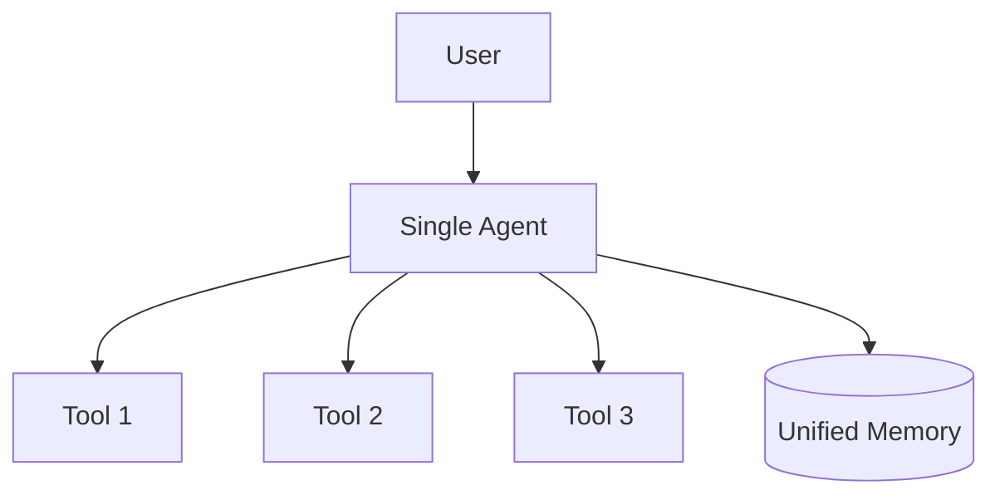
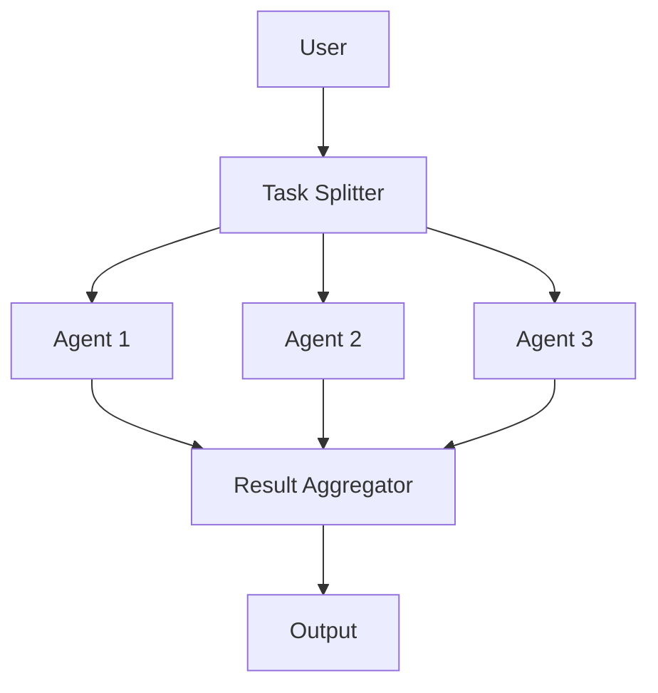
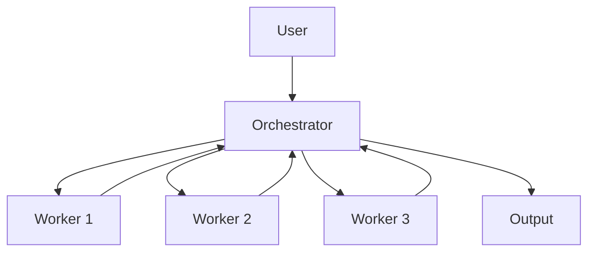
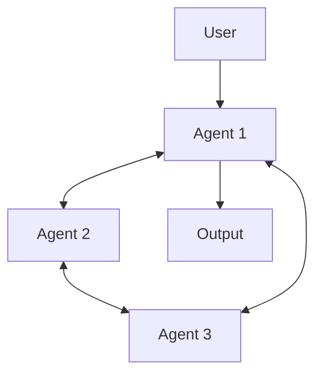
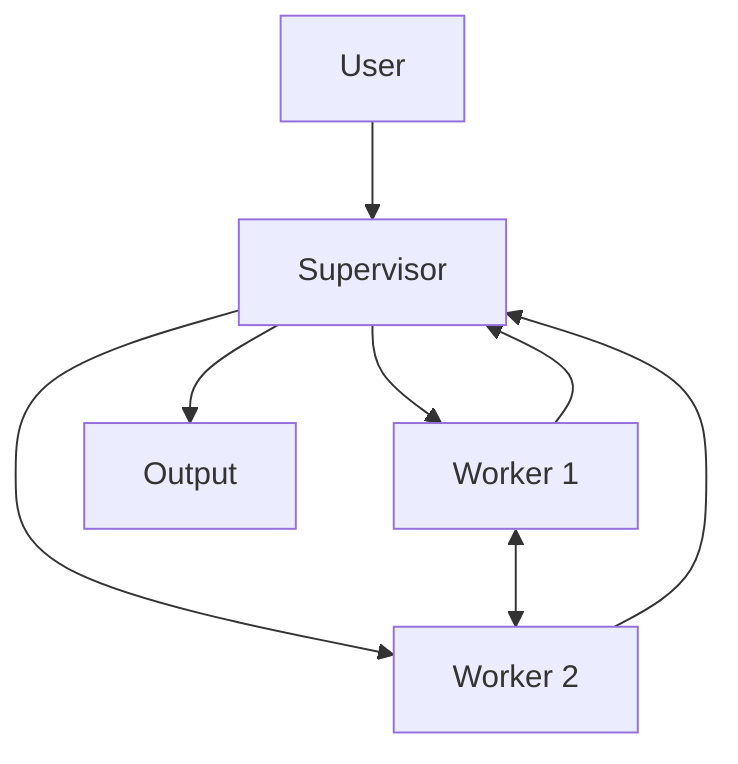

## ブログ概要（Summary）

Google Researchが2026年1月に公開したブログ記事「Towards a science of scaling agent systems」は、マルチエージェントシステムの設計選択を科学的に評価した大規模実験の報告である。180種類のエージェント構成を5つのアーキテクチャ（Single-Agent, Independent, Centralized, Decentralized, Hybrid）で評価し、タスク特性とアーキテクチャ選択の関係を定量的に明らかにしている。Google Researchは、並列化可能タスクでは集中協調により81%の性能改善を達成する一方、逐次推論タスクでは39-70%の性能低下が生じると報告している。独立型マルチエージェントはエラーを17.2倍に増幅するが、集中型は4.4倍に抑制できるとの実験結果も示されている。

この記事は [Zenn記事: Nova Forge SDK×Strands Agentsで経費精算マルチエージェントの並列ツール実行を高速化する](https://zenn.dev/0h_n0/articles/2fbc2fc14efe00) の深掘りです。

> **出典**: [Towards a science of scaling agent systems: When and why agent systems work](https://research.google/blog/towards-a-science-of-scaling-agent-systems-when-and-why-agent-systems-work/) — Google Research Blog

## 情報源

- **種別**: 企業テックブログ（Google Research公式）
- **URL**: [https://research.google/blog/towards-a-science-of-scaling-agent-systems-when-and-why-agent-systems-work/](https://research.google/blog/towards-a-science-of-scaling-agent-systems-when-and-why-agent-systems-work/)
- **組織**: Google Research
- **発表日**: 2026年1月（推定）

## 技術的背景（Technical Background）

### マルチエージェント設計のアドホックな現状

2025年以降、LLMエージェントの実用化が急速に進み、複数エージェントを協調させるマルチエージェントシステムへの関心が高まっている。OpenAIのSwarm、LangChainのLangGraph、AWSのStrands Agents SDK（Zenn記事で使用）など、マルチエージェントフレームワークが次々と登場し、エージェント間の協調を容易に構築できるようになった。しかし、Google Researchはブログ中で、現状の設計がほぼアドホック（場当たり的）であると指摘している。多くの開発者がフレームワークの提供するパターンをそのまま採用し、タスク特性との適合性を検証しないまま本番環境に投入しているという現実がある。「エージェントを増やせば性能が上がる」という直感的な仮定は、本研究の実験結果によれば、多くの場合で裏切られる。

従来の課題は以下の3点に集約される。

1. **アーキテクチャ選択の根拠不足**: Single-Agent、Independent、Centralized等の選択が開発者の経験則や直感に依存しており、タスク特性（並列度、逐次依存性、ツール数）に基づく定量的な指針が存在しなかった。チームの技術的好みやフレームワークの制約で選択されることが多く、性能面での根拠が乏しかった
2. **スケーリング則の未解明**: LLM単体のスケーリング則（Kaplan et al., 2020のScaling Laws、Hoffmann et al., 2022のChinchilla則等）は確立されつつあるが、エージェントシステムのスケーリング、すなわち「エージェント数を増やしたときに性能はどう変化するか」「どの構成でスケールするか」について体系的な研究がほとんど存在しなかった
3. **エラー伝搬の定量化不足**: マルチエージェントシステムでは個々のエージェントのエラーが複合的に伝搬・増幅される。しかし、そのメカニズムや増幅率がアーキテクチャによってどの程度異なるかは定量的に評価されていなかった。プロダクション環境でマルチエージェントを運用する際に、信頼性やエラーハンドリングの設計指針が欠如していた

本研究は180構成にわたる大規模実験により、これらの課題にデータドリブンで回答を試みている。GPT、Gemini、Claudeの3つのLLMファミリーを使用し、4つの異なるベンチマーク（金融推論、計画立案、コード生成等）で横断的に評価することで、特定のモデルやタスクに依存しない一般的な知見の抽出を目指している。

## 実装アーキテクチャ（Architecture）

### 5つのアーキテクチャの概要

Google Researchは以下の5つのアーキテクチャを定義し、体系的に評価している。各アーキテクチャの構造を以下に示す。

#### 1. Single-Agent System (SAS)

単一のLLMエージェントがすべてのタスクを逐次処理するアーキテクチャである。統一メモリを保持するため、推論の一貫性が担保される。ツール呼び出しと推論を1つのエージェントが担当するので、エージェント間通信のオーバーヘッドが発生しない。Google Researchの実験結果によれば、逐次推論が必要なタスク（計画立案、複数ステップの論理推論）ではマルチエージェント構成を一貫して上回る成績を示している。



#### 2. Independent（独立型）

タスクを独立したサブタスクに分割し、各エージェントが並列に処理するアーキテクチャである。エージェント間の通信は一切なく、最終段のAggregatorが各エージェントの出力を集約して最終結果を生成する。MapReduceのMap段に近い構造である。実装がシンプルでスケールしやすいが、Google Researchの実験ではエラーを17.2倍に増幅するという重大な弱点が報告されている。各エージェントの出力に矛盾があっても検出・修正する仕組みがないため、個々のエラーがそのまま最終結果に伝搬する。



#### 3. Centralized（集中型）

ハブ＆スポーク構造で、中央のオーケストレータが各ワーカーエージェントにタスクを委任し、結果を統合するアーキテクチャである。Zenn記事で実装されているSupervisorパターンに直接対応する。オーケストレータはタスクの分解、ワーカーへの割り当て、結果のバリデーション、矛盾の解消を一手に担う。Google Researchの実験では、並列化可能なタスクにおいて最も高い性能を示し、エラー増幅率も4.4倍と独立型の約4分の1に抑制された。金融推論タスク（Finance-Agent）では81%の性能改善が確認されている。



#### 4. Decentralized（分散型）

P2Pメッシュ構造で、各エージェントが直接通信してコンセンサスを構築するアーキテクチャである。中央の制御ノードを持たず、各エージェントが対等な関係で情報を交換する。リアルタイムでの合意形成が必要な場面（例: 複数視点からの同時評価、議論ベースの意思決定）に向いているが、通信量がエージェント数の二乗に比例して増大するため、スケーラビリティには制約がある。



#### 5. Hybrid（ハイブリッド型）

CentralizedとDecentralizedの長所を組み合わせたアーキテクチャである。階層的な監視機構（スーパーバイザー）を持ちつつ、ワーカー間でも必要に応じて直接通信が可能な構造を取る。スーパーバイザーは全体の進捗管理とエラー検知を担当し、ワーカー間の水平通信により局所的な情報共有を効率化する。複雑なタスクで階層的監視とピア間の柔軟な協調が同時に必要な場合に適しているが、設計・実装の複雑さが増す点はトレードオフとなる。



### Zenn記事との対応

Zenn記事「Nova Forge SDK×Strands Agentsで経費精算マルチエージェントの並列ツール実行を高速化する」で実装されているSupervisor/Collaboratorパターンは、本研究のCentralized（集中型）アーキテクチャに対応する。Zenn記事ではAWS Bedrock上でSupervisorエージェントが経費精算の各サブタスク（OCR処理、カテゴリ分類、承認ルール適用、金額検証）をWorkerに委任する構成を採用している。これはまさに本研究で高い評価を得たハブ＆スポーク型の実装例であり、Google Researchの実験結果が示す「並列化可能なサブタスクを持つタスクではCentralized構成が優位」という原則に合致している。

さらに、Zenn記事で使用されているツール数は4-5個程度であり、本研究が明らかにしたツール数16の閾値を大幅に下回っている。これは協調オーバーヘッドが線形範囲に収まることを意味し、マルチエージェント化の恩恵を最大限に享受できるユースケースであるといえる。

### モデル比較に関する注意点

Google Researchは、OpenAI GPT、Google Gemini、Anthropic Claudeの3つのモデルファミリーで実験を行い、興味深い知見を報告している。それは、LLM単体の性能向上がマルチエージェントシステムの性能向上に直結するとは限らないという点である。より高性能なモデルを使用しても、アーキテクチャの選択が不適切であれば性能は低下する。逆に、適切なアーキテクチャを選択すれば、比較的低コストなモデル（例: Haiku）でも高い性能を達成できる可能性がある。この知見はコスト最適化の観点からも重要であり、タスク難度に応じたモデル選択ロジック（後述のProduction Deployment Guideで詳述）の設計根拠となる。

## Production Deployment Guide

本セクションでは、Google Researchが評価したCentralized（集中型）アーキテクチャをAWS上で構築する際の実装パターンを解説する。Zenn記事のSupervisor/Collaboratorパターンとの対応を意識しつつ、トラフィック量に応じたSmall/Medium/Large構成を示す。

Google Researchの実験結果から、Centralizedアーキテクチャはオーケストレータがワーカーの出力品質を検証・統合できるため、エラー増幅を4.4倍に抑制する効果がある。この特性をAWSのマネージドサービスで実現する場合、オーケストレータ部分にはStep Functions（Small構成）またはECS/EKSのコントローラーPod（Medium/Large構成）を充て、ワーカー部分にはLambda関数またはECSタスクを割り当てるのが一般的なパターンである。Bedrock APIを通じてLLM推論を呼び出す構成では、LLMのトークンコストがインフラコストの大部分を占めるため、コスト最適化の焦点はLLM呼び出し回数とトークン量の削減に置くべきである。

### AWS実装パターン（コスト最適化重視）

**トラフィック量別の推奨構成**（2026年4月時点のap-northeast-1料金に基づく概算値）:

| 構成 | トラフィック | アーキテクチャ | 月額概算 |
|------|-------------|---------------|---------|
| Small | ~100 req/日 | Lambda + Bedrock + DynamoDB | $50-150 |
| Medium | ~1,000 req/日 | ECS Fargate + Bedrock + ElastiCache | $300-800 |
| Large | 10,000+ req/日 | EKS + Spot + Bedrock Batch | $2,000-5,000 |

**Small構成の内訳**:
- Lambda (Orchestrator + 3 Worker): 実行回数~9,000/日（1リクエストあたり約30回呼び出し）、メモリ512MB、~$5/月
- Bedrock (Claude 3.5 Haiku): 入力トークン~500K/日、出力トークン~100K/日、~$30-80/月
- DynamoDB (On-Demand): 読み書き~10,000 RCU+WCU/日、~$5/月
- Step Functions (オーケストレーション): ~3,000遷移/日、~$1/月
- CloudWatch Logs: ~$5/月

**Medium構成の内訳**:
- ECS Fargate (Orchestrator): 0.5 vCPU, 1GB RAM、常時1タスク、~$30/月
- ECS Fargate (Workers): 0.25 vCPU, 0.5GB RAM、オートスケーリング（0-6タスク）、~$50-150/月
- Bedrock (Claude 3.5 Sonnet): ~$150-400/月
- ElastiCache (Redis): cache.t3.micro、~$15/月
- ALB: ~$20/月

**Large構成の内訳**:
- EKS コントロールプレーン: ~$73/月
- EC2 Spot Instances (m5.xlarge x 3-10): ~$200-700/月（オンデマンド比最大90%削減）
- Bedrock Batch API: オンデマンド比50%削減、~$800-2,000/月
- その他（NAT Gateway, S3, CloudWatch）: ~$200/月

**コスト試算の注意事項**: 上記はap-northeast-1（東京）リージョンの2026年4月時点の概算値である。実際のコストはトラフィックパターン、バースト使用量、モデル選択により大きく変動する。最新料金は[AWS Pricing Calculator](https://calculator.aws/)で確認を推奨する。

### Terraformインフラコード

#### Small構成（Serverless）: Lambda + Bedrock + DynamoDB

```hcl
# Small構成: Centralized Agent Architecture (Serverless)
# Lambda Orchestrator + Worker Lambda + DynamoDB + Bedrock

terraform {
  required_version = ">= 1.8"
  required_providers {
    aws = {
      source  = "hashicorp/aws"
      version = "~> 5.70"
    }
  }
}

provider "aws" {
  region = "ap-northeast-1"
}

# --- IAM ---
resource "aws_iam_role" "orchestrator_lambda" {
  name = "agent-orchestrator-role"
  assume_role_policy = jsonencode({
    Version = "2012-10-17"
    Statement = [{
      Action = "sts:AssumeRole"
      Effect = "Allow"
      Principal = { Service = "lambda.amazonaws.com" }
    }]
  })
}

resource "aws_iam_role_policy" "orchestrator_bedrock" {
  name = "bedrock-invoke"
  role = aws_iam_role.orchestrator_lambda.id
  policy = jsonencode({
    Version = "2012-10-17"
    Statement = [
      {
        Effect   = "Allow"
        Action   = ["bedrock:InvokeModel"]
        Resource = "arn:aws:bedrock:ap-northeast-1::foundation-model/anthropic.claude-3-5-haiku-*"
      },
      {
        Effect   = "Allow"
        Action   = ["dynamodb:GetItem", "dynamodb:PutItem", "dynamodb:Query"]
        Resource = aws_dynamodb_table.agent_state.arn
      },
      {
        Effect   = "Allow"
        Action   = ["lambda:InvokeFunction"]
        Resource = "arn:aws:lambda:ap-northeast-1:*:function:agent-worker-*"
      }
    ]
  })
}

resource "aws_iam_role_policy_attachment" "orchestrator_logs" {
  role       = aws_iam_role.orchestrator_lambda.name
  policy_arn = "arn:aws:iam::aws:policy/service-role/AWSLambdaBasicExecutionRole"
}

# --- DynamoDB (On-Demand, KMS暗号化) ---
resource "aws_dynamodb_table" "agent_state" {
  name         = "agent-orchestrator-state"
  billing_mode = "PAY_PER_REQUEST"
  hash_key     = "session_id"
  range_key    = "task_id"

  attribute {
    name = "session_id"
    type = "S"
  }
  attribute {
    name = "task_id"
    type = "S"
  }

  server_side_encryption {
    enabled = true  # AWS managed KMS
  }

  ttl {
    attribute_name = "expires_at"
    enabled        = true
  }
}

# --- Lambda: Orchestrator ---
resource "aws_lambda_function" "orchestrator" {
  function_name = "agent-orchestrator"
  runtime       = "python3.12"
  handler       = "orchestrator.handler"
  role          = aws_iam_role.orchestrator_lambda.arn
  timeout       = 300
  memory_size   = 512
  filename      = "dist/orchestrator.zip"

  environment {
    variables = {
      STATE_TABLE    = aws_dynamodb_table.agent_state.name
      BEDROCK_MODEL  = "anthropic.claude-3-5-haiku-20250401-v1:0"
      WORKER_PREFIX  = "agent-worker"
    }
  }

  tracing_config {
    mode = "Active"  # X-Ray有効化
  }
}

# --- CloudWatch Alarm: コスト監視 ---
resource "aws_cloudwatch_metric_alarm" "lambda_duration" {
  alarm_name          = "agent-orchestrator-duration-high"
  comparison_operator = "GreaterThanThreshold"
  evaluation_periods  = 3
  metric_name         = "Duration"
  namespace           = "AWS/Lambda"
  period              = 300
  statistic           = "Average"
  threshold           = 60000  # 60秒超過でアラート
  alarm_description   = "Orchestrator Lambda duration exceeds 60s"
  dimensions = {
    FunctionName = aws_lambda_function.orchestrator.function_name
  }
}
```

#### Large構成（Container）: EKS + Karpenter + Spot

```hcl
# Large構成: Centralized Agent Architecture (Container)
# EKS + Karpenter (Spot優先) + Secrets Manager

module "eks" {
  source  = "terraform-aws-modules/eks/aws"
  version = "~> 20.24"

  cluster_name    = "agent-cluster"
  cluster_version = "1.31"

  vpc_id     = module.vpc.vpc_id
  subnet_ids = module.vpc.private_subnets

  # Karpenter用IAM
  enable_karpenter = true
  karpenter = {
    repository_username = data.aws_ecrpublic_authorization_token.token.user_name
    repository_password = data.aws_ecrpublic_authorization_token.token.password
  }

  # パブリックアクセス最小化
  cluster_endpoint_public_access = false
}

# --- Karpenter NodePool: Spot優先 ---
resource "kubectl_manifest" "karpenter_nodepool" {
  yaml_body = yamlencode({
    apiVersion = "karpenter.sh/v1"
    kind       = "NodePool"
    metadata   = { name = "agent-workers" }
    spec = {
      template = {
        spec = {
          requirements = [
            { key = "karpenter.sh/capacity-type", operator = "In", values = ["spot", "on-demand"] },
            { key = "node.kubernetes.io/instance-type", operator = "In",
              values = ["m5.xlarge", "m5.2xlarge", "m6i.xlarge", "m6i.2xlarge"] }
          ]
        }
      }
      limits   = { cpu = "100", memory = "400Gi" }
      disruption = {
        consolidationPolicy = "WhenEmptyOrUnderutilized"
        consolidateAfter    = "30s"
      }
    }
  })
}

# --- Secrets Manager: Bedrock設定 ---
resource "aws_secretsmanager_secret" "bedrock_config" {
  name                    = "agent/bedrock-config"
  recovery_window_in_days = 7
}

# --- AWS Budgets: 月額予算アラート ---
resource "aws_budgets_budget" "agent_monthly" {
  name         = "agent-system-monthly"
  budget_type  = "COST"
  limit_amount = "5000"
  limit_unit   = "USD"
  time_unit    = "MONTHLY"

  notification {
    comparison_operator       = "GREATER_THAN"
    threshold                 = 80
    threshold_type            = "PERCENTAGE"
    notification_type         = "ACTUAL"
    subscriber_email_addresses = ["ops-team@example.com"]
  }
}
```

### 運用・監視設定

#### CloudWatch Logs Insights クエリ

```
# コスト異常検知: 1時間あたりのBedrockトークン使用量
fields @timestamp, @message
| filter @message like /bedrock/
| stats sum(input_tokens) as total_input, sum(output_tokens) as total_output by bin(1h)
| sort @timestamp desc

# レイテンシ分析: Orchestrator P95/P99
fields @timestamp, duration_ms
| filter function_name = "agent-orchestrator"
| stats percentile(duration_ms, 95) as p95,
        percentile(duration_ms, 99) as p99,
        avg(duration_ms) as avg_ms
  by bin(1h)
```

#### CloudWatch アラーム設定

```python
"""CloudWatch Alarm: Bedrockトークン使用量スパイク検知"""
import boto3

cloudwatch = boto3.client("cloudwatch", region_name="ap-northeast-1")

def create_token_spike_alarm() -> None:
    """Bedrockのトークン使用量が閾値を超えた場合にアラートを発報する。"""
    cloudwatch.put_metric_alarm(
        AlarmName="bedrock-token-spike",
        MetricName="InputTokenCount",
        Namespace="AWS/Bedrock",
        Statistic="Sum",
        Period=3600,
        EvaluationPeriods=1,
        Threshold=500000,
        ComparisonOperator="GreaterThanThreshold",
        AlarmActions=["arn:aws:sns:ap-northeast-1:123456789012:ops-alerts"],
        Dimensions=[
            {"Name": "ModelId", "Value": "anthropic.claude-3-5-haiku-20250401-v1:0"}
        ],
    )
```

#### X-Ray トレーシング設定

```python
"""X-Ray自動計装: Orchestrator Lambda"""
from aws_xray_sdk.core import xray_recorder, patch_all
import boto3

# boto3を含む全ライブラリを自動計装
patch_all()

def handler(event: dict, context: object) -> dict:
    """Orchestrator Lambda handler with X-Ray tracing.

    Args:
        event: Lambda event payload
        context: Lambda context object

    Returns:
        Orchestration result with worker outputs
    """
    subsegment = xray_recorder.begin_subsegment("orchestrate_workers")
    subsegment.put_annotation("session_id", event.get("session_id", "unknown"))
    subsegment.put_metadata("worker_count", len(event.get("tasks", [])))

    try:
        result = dispatch_to_workers(event)
        subsegment.put_metadata("status", "success")
        return result
    except Exception as e:
        subsegment.put_metadata("error", str(e))
        raise
    finally:
        xray_recorder.end_subsegment()
```

#### Cost Explorer自動レポート

```python
"""日次コストレポート: Bedrock/Lambda/EKSコスト抽出"""
import datetime
import boto3

ce = boto3.client("ce", region_name="us-east-1")
sns = boto3.client("sns", region_name="ap-northeast-1")

COST_THRESHOLD_USD = 100.0
SNS_TOPIC_ARN = "arn:aws:sns:ap-northeast-1:123456789012:cost-alerts"

def get_daily_cost_report() -> dict[str, float]:
    """直近1日のサービス別コストを取得する。

    Returns:
        サービス名をキー、コスト(USD)を値とする辞書
    """
    today = datetime.date.today()
    yesterday = today - datetime.timedelta(days=1)

    response = ce.get_cost_and_usage(
        TimePeriod={"Start": str(yesterday), "End": str(today)},
        Granularity="DAILY",
        Metrics=["UnblendedCost"],
        GroupBy=[{"Type": "DIMENSION", "Key": "SERVICE"}],
    )

    costs: dict[str, float] = {}
    for group in response["ResultsByTime"][0]["Groups"]:
        service = group["Keys"][0]
        amount = float(group["Metrics"]["UnblendedCost"]["Amount"])
        if amount > 0:
            costs[service] = round(amount, 2)

    total = sum(costs.values())
    if total > COST_THRESHOLD_USD:
        sns.publish(
            TopicArn=SNS_TOPIC_ARN,
            Subject=f"[ALERT] Daily cost ${total:.2f} exceeds ${COST_THRESHOLD_USD}",
            Message=f"Service breakdown:\n" + "\n".join(
                f"  {svc}: ${amt:.2f}" for svc, amt in sorted(costs.items(), key=lambda x: -x[1])
            ),
        )
    return costs
```

### コスト最適化チェックリスト

**アーキテクチャ選択**:
- [ ] トラフィック量を計測し、Small/Medium/Large構成を決定した
- [ ] 逐次タスクはSingle-Agent、並列タスクはCentralized構成を選択した
- [ ] ツール数16未満に収まるようサブタスク分割を設計した

**リソース最適化**:
- [ ] EC2はSpot Instancesを優先利用している（最大90%削減）
- [ ] 安定ワークロードにReserved Instances（1年コミットで最大72%削減）を適用した
- [ ] Savings Plans（Compute）の適用を検討した
- [ ] Lambdaメモリサイズをpower tuningで最適化した（256MB-1024MB）
- [ ] ECS/EKSのアイドル時スケールダウン（最小タスク数0）を設定した
- [ ] NAT Gateway不使用構成（VPCエンドポイント利用）を検討した

**LLMコスト削減**:
- [ ] 大量バッチはBedrock Batch APIを使用した（50%削減）
- [ ] Prompt Cachingを有効化した（反復プロンプトで30-90%削減）
- [ ] タスク難度に応じたモデル選択ロジックを実装した（Haiku/Sonnet/Opus使い分け）
- [ ] 最大トークン数を制限し不要な出力を抑制した
- [ ] システムプロンプトの共通化でキャッシュヒット率を向上させた

**監視・アラート**:
- [ ] AWS Budgetsで月額上限アラートを設定した
- [ ] CloudWatchアラームでLambda実行時間・エラー率を監視している
- [ ] Cost Anomaly Detectionを有効化した
- [ ] 日次コストレポートをSNS/Slack通知している
- [ ] X-Rayトレーシングでボトルネックを可視化している

**リソース管理**:
- [ ] 未使用リソース（停止中インスタンス、未アタッチEBS）を定期削除している
- [ ] コスト配分タグ（Project, Environment, Team）を全リソースに付与した
- [ ] S3/CloudWatch Logsにライフサイクルポリシー（30日/90日）を設定した
- [ ] 開発環境の夜間・週末自動停止を設定した

## パフォーマンス最適化（Performance）

Google Researchの180構成にわたる実験から、マルチエージェントシステムの性能を左右する3つの重要な原則が明らかになっている。これらの原則は相互に関連しており、プロダクション環境でのアーキテクチャ設計判断の基盤となる。

### Alignment Principle（整合性原則）

Google Researchは、タスクの構造とアーキテクチャの構造が整合する場合に最大の性能を発揮すると報告している。ここでいう「整合性」とは、タスクが本質的に並列分解可能な構造を持つ場合には並列処理が可能なアーキテクチャ（Centralized, Independent）を、逐次依存構造を持つ場合にはSingle-Agentを選択するという、タスク構造とシステム構造の対応関係を意味する。

具体的には、並列化可能なサブタスクを持つ金融推論タスク（Finance-Agent）において、集中型協調（Centralized）により81%の性能改善が実験で確認されている。Finance-Agentでは、複数の金融商品の分析、リスク評価、市場データの取得といったサブタスクが互いに独立しており、並列処理との整合性が高い。

この知見はZenn記事の経費精算マルチエージェントにも直接当てはまる。OCR処理、カテゴリ分類、承認ルール適用、金額検証という並列可能なサブタスクを持つ経費精算タスクは、Centralizedアーキテクチャとの整合性が高い。各サブタスク間にデータ依存関係がなく、独立して実行可能であるため、並列化による速度向上とオーケストレータによるエラー検知の恩恵を同時に得られる。

### Sequential Penalty（逐次ペナルティ）

一方、逐次的な推論チェーンを必要とするタスク（例: 計画立案、多段階の論理推論）では、マルチエージェント化により39-70%の性能低下が生じるとGoogle Researchは報告している。この劣化は以下のメカニズムで発生する。

1. **コンテキスト分断**: 推論チェーンの途中でエージェントが切り替わると、前のエージェントが保持していた中間推論状態（暗黙の仮定、検討済みの代替案、部分的な結論）がコンテキストから失われる
2. **通信オーバーヘッド**: エージェント間でコンテキストを受け渡す際、全情報を明示的にテキストとして伝達する必要があり、情報の損失と遅延が生じる
3. **一貫性の喪失**: 複数のエージェントが異なるプロンプトや指示で動作するため、推論方針の一貫性が保たれない

プロダクション環境では、タスクの逐次依存度を事前に分析し、逐次依存が高いタスク（ステップ間にデータ依存関係がある場合）ではSingle-Agentを維持する設計判断が重要である。Zenn記事の経費精算においても、最終的な承認判定のように前段の全結果を踏まえた逐次推論が必要な部分はSupervisor（オーケストレータ）が一括して処理する設計が妥当である。

### Tool-Coordination Trade-off（ツール協調トレードオフ）

実験結果より、使用可能なツール数が16を超えると、エージェント間の協調オーバーヘッドが不均衡に増大することが確認されている。ツール数 $T$ とオーバーヘッド $C$ の関係は、ブログの実験データから概ね以下の傾向を示す。

$$
C(T) \propto T^{\alpha}, \quad \alpha > 1 \quad (\text{for } T > 16)
$$

ここで $T$ はツール数、$C$ は協調オーバーヘッド、$\alpha$ は超線形の増加率を示す指数である。ツール数が16未満であれば協調コストはほぼ線形に収まるが、16を超えると急激に増大する。この閾値は、各エージェントが利用可能なツールの選択・調整にかかるLLMの推論コストに起因すると考えられる。ツール数が多くなるほど、ツール選択の組み合わせ空間が指数的に拡大し、エージェント間でのツール使用計画の調整が困難になる。

Zenn記事のように3-5個程度のツール（OCR API、分類モデル、承認ルールエンジン、金額検証API等）であれば、マルチエージェント化の恩恵を最大限に享受できる範囲内にある。一方、ツール数が多い業務（例: 大規模なSaaSインテグレーション、20以上のAPIを呼び出すデータパイプライン）では、ツール群をサブセットに分割して各ワーカーに割り当てるか、Single-Agentでの処理を検討すべきである。

## 運用での学び（Production Lessons）

### エラー増幅への対策

Google Researchの実験結果において最も注目すべき発見の一つは、エラー増幅の定量的評価である。独立型（Independent）マルチエージェントはエラーを17.2倍に増幅するのに対し、集中型（Centralized）では4.4倍に抑制されると報告されている。この差はおよそ4倍であり、アーキテクチャ選択だけでエラーの影響度を劇的に変えられることを示している。

この差は、集中型オーケストレータが持つ3つの機能に起因するとGoogle Researchは分析している。

1. **エラー検知**: ワーカーの出力を統合する際に、複数のワーカー結果を比較して矛盾を検出できる。例えば、経費精算でOCRワーカーが抽出した金額と分類ワーカーが推定した金額カテゴリに不整合がある場合、オーケストレータがこれを検出して再処理を指示できる
2. **リトライ制御**: 失敗したサブタスクのみを選択的に再実行できる。独立型では全タスクを再実行するか、エラーを無視するかの二択になりやすいが、集中型ではオーケストレータが失敗箇所を特定して最小限のリトライを行える
3. **結果フィルタリング**: 品質の低い出力を最終結果から除外し、信頼度の高い出力のみで最終結果を構成できる。これは特に、ワーカーの出力に確信度スコアを付与する設計と組み合わせると効果的である

プロダクション環境では、オーケストレータに明示的なバリデーションステップを組み込むことが不可欠である。具体的には、ワーカー出力のJSON Schemaバリデーション、複数ワーカー間のクロスチェック（同一入力に対する異なるワーカーの結果比較）、出力の確信度スコアに基づくフィルタリングの3層防御を推奨する。

### 集中型 vs 分散型の選択基準

Google Researchの実験データに基づく選択基準を以下に整理する。新規にマルチエージェントシステムを構築する際は、まずこの表でタスク特性を確認し、適切なアーキテクチャを選定することを推奨する。

| 条件 | 推奨アーキテクチャ | 理由 |
|------|-------------------|------|
| サブタスクが独立・並列可能 | Centralized | オーケストレータによるエラー抑制（4.4倍）と並列処理の恩恵 |
| 逐次推論が必要 | Single-Agent (SAS) | 通信オーバーヘッドによる39-70%性能低下を回避 |
| ツール数 > 16 | Single-Agent or Hybrid | 協調オーバーヘッドの超線形増大を回避 |
| リアルタイム合意形成が必要 | Decentralized | P2Pでの即座な情報共有が可能 |
| 複雑なサブタスク + 監視が必要 | Hybrid | 階層的監視とピア間の柔軟な協調を両立 |
| コスト制約が厳しい | Single-Agent | LLM呼び出し回数が最小、インフラもシンプル |

注意すべき点として、上記は一般的な指針であり、実際のタスクでは複数の条件が重なる場合がある。例えば「並列可能なサブタスクだがツール数が20を超える」場合は、サブタスクごとにツールを4-5個に限定してCentralized構成を維持するか、ツール群をグループ化してHybrid構成にするといった工夫が必要になる。

### 予測モデルの活用

Google Researchは、タスク特性から最適アーキテクチャを予測するモデル（$R^2 = 0.513$）を構築し、87%の精度で最適構成を特定できると報告している。予測に用いる特徴量は以下の3つである。

- **逐次依存度**: タスク内のステップ間にどれだけのデータ依存関係があるか。値が高いほどSingle-Agentが有利
- **ツール数**: エージェントが利用可能なツールの総数。16を超えるとマルチエージェントの利点が減少
- **サブタスクの並列度**: タスクを何個の独立したサブタスクに分解できるか。値が高いほどCentralizedが有利

$R^2 = 0.513$ は決定係数としては中程度であり、約半分の分散を説明できる水準である。残りの分散はタスク固有の特性、プロンプト設計、モデルの特性など、この3つの特徴量では捕捉できない要因に起因すると考えられる。それでも実用的には87%の精度でアーキテクチャ選択を支援できるとされており、ランダム選択や開発者の直感に頼る場合と比較して有意に優れた指針を提供する。

## 学術研究との関連（Academic Connection）

本研究は、マルチエージェントシステムの分野において、スケーリング則を体系的に調査した先駆的な取り組みである。従来のマルチエージェント研究は個別のアーキテクチャの有効性を示すに留まっていた。例えば、Park et al. (2023) のGenerative Agentsは分散型エージェントによるシミュレーション環境での行動生成を、Hong et al. (2024) のMetaGPTはソフトウェア開発における役割分担型マルチエージェントの有効性をそれぞれ示したが、アーキテクチャ間の体系的な比較は行っていない。本研究は5つのアーキテクチャを同一条件で横断的に比較し、一般的な設計原則を抽出している点で学術的貢献が大きい。

また、Kaplan et al. (2020) が確立したLLMのスケーリング則（モデルサイズ、データ量、計算量と性能の関係）をエージェントシステムに拡張するという視点は、今後のマルチエージェント研究の重要な基盤となる可能性がある。ただし、LLMのスケーリング則がべき乗則で記述できる滑らかな関係であるのに対し、エージェントシステムのスケーリングはタスク特性によって正にも負にも作用するという非単調な関係であることは、本研究の重要な発見の一つである。

本研究の制約として、評価が特定の4ベンチマークに限定されている点、予測モデルの決定係数が0.513と中程度である点は留意が必要である。特に、実世界のプロダクション環境で発生する不確実性（ネットワーク遅延、API障害、入力データの品質ばらつき等）は本実験では考慮されていない。より多様なタスク・ドメインおよびプロダクション条件での検証が今後求められる。

## まとめと実践への示唆

Google Researchの180構成にわたる大規模実験は、マルチエージェントシステムの設計に対して明確かつ定量的な指針を与えている。本記事の要点を以下に整理する。

「エージェントを増やせば性能が上がる」という素朴な仮定は誤りであり、タスク特性とアーキテクチャの整合性（Alignment Principle）が決定的に重要である。Zenn記事のような経費精算タスク（並列可能サブタスク、ツール数4-5個）ではCentralized（集中型）構成が適しており、81%の性能改善とエラー増幅4.4倍への抑制が期待できる。一方、逐次推論タスクではSingle-Agentが依然として優位であり、マルチエージェント化は39-70%の性能低下を招く。ツール数が16を超える場合はアーキテクチャの再設計が必要である。

AWS上での実装では、トラフィック量に応じたServerless（Small）/Fargate（Medium）/EKS+Spot（Large）構成の使い分けが費用対効果を最大化する。LLMトークンコストがインフラコストの大部分を占めるため、Prompt Caching、Batch API、タスク難度に応じたモデル選択ロジックによるコスト最適化が不可欠である。

## 参考文献

- **Blog URL**: [Towards a science of scaling agent systems: When and why agent systems work](https://research.google/blog/towards-a-science-of-scaling-agent-systems-when-and-why-agent-systems-work/) — Google Research
- **Related Zenn article**: [Nova Forge SDK×Strands Agentsで経費精算マルチエージェントの並列ツール実行を高速化する](https://zenn.dev/0h_n0/articles/2fbc2fc14efe00)
- **Related papers**:
  - Kaplan, J. et al. (2020). "Scaling Laws for Neural Language Models." arXiv:2001.08361
  - Park, J. S. et al. (2023). "Generative Agents: Interactive Simulacra of Human Behavior." arXiv:2304.03442
  - Hong, S. et al. (2024). "MetaGPT: Meta Programming for A Multi-Agent Collaborative Framework." arXiv:2308.00352
