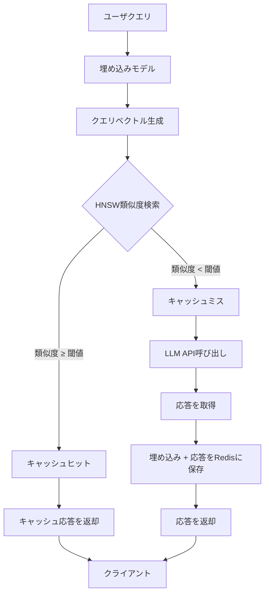

## 論文概要（Abstract）

本記事は [https://arxiv.org/abs/2411.05276](https://arxiv.org/abs/2411.05276) の解説記事です。

GPT Semantic Cache（Regmi & Pun, 2024）は、LLM APIコールのコストとレイテンシを削減するためにセマンティック埋め込みベースのキャッシュ機構を提案している。ユーザクエリを埋め込みベクトルに変換し、Redis上のインメモリストアで過去のクエリとの類似度を計算することで、意味的に同等な質問に対してキャッシュ済みの応答を返す。著者らは4カテゴリ8,000件のQ&Aデータセットで評価を行い、キャッシュヒット率61.6%〜68.8%、ポジティブヒット精度92.5%〜97.3%を報告している。

この記事は [Zenn記事: Portkey×LangChainでAIエージェントを本番運用する実践ガイド](https://zenn.dev/0h_n0/articles/7dcbfcb48d5672) の深掘りです。

## 情報源

- **arXiv ID**: 2411.05276
- **URL**: [arXiv:2411.05276](https://arxiv.org/abs/2411.05276)
- **著者**: Sajal Regmi, Chetan Phakami Pun
- **発表年**: 2024年11月（v1）、2024年12月（v3）
- **分野**: cs.LG（Machine Learning）
- **ライセンス**: CC BY 4.0

## 背景と動機（Background & Motivation）

LLMのAPI利用が拡大するにつれ、コストとレイテンシの最適化が本番運用の課題となっている。GPT-4やClaude等の大規模モデルでは、入出力トークン単位の課金モデルが採用されており、同一・類似のクエリが繰り返し発生するユースケースでは冗長なAPIコールがコストを押し上げる。

従来の完全一致キャッシュでは、同じ意味を持つが表現が異なるクエリ（例: 「Pythonでリストをソートする方法は？」と「Pythonのリストソートの書き方を教えて」）を同一視できない。この問題に対し、著者らはセマンティック埋め込みによる類似度ベースのキャッシュを提案している。

PortkeyやLangChainでもセマンティックキャッシュ機能が提供されているが、その精度特性は十分に分析されていない。本論文はセマンティックキャッシュの設計空間を体系的に整理し、実験的に評価した研究である。

## 主要な貢献（Key Contributions）

著者らは以下の点を本論文の貢献として挙げている。

- **セマンティックキャッシュアーキテクチャの設計**: Redis + 埋め込みベクトル + HNSWによる類似検索を統合したキャッシュシステムの提案
- **複数キャッシュ管理戦略の実装と評価**: LRU、LFU、FIFO、Random、TTLの各方式をサポートするモジュラーなキャッシュ管理
- **実データセットでの定量的評価**: 4カテゴリ8,000件のQ&Aペアで、キャッシュヒット率とポジティブヒット精度を測定
- **npmパッケージとしての公開**: `gpt-semantic-cache`として再利用可能な形で公開

## 技術的詳細（Technical Details）

### セマンティックキャッシュのアーキテクチャ

システム全体は3つのコンポーネントで構成される。(1) 埋め込み生成、(2) Redisインメモリストア、(3) 類似度検索エンジンである。



クエリが入力されると、まず埋め込みモデルでベクトル化される。このベクトルをHNSW（Hierarchical Navigable Small World）グラフで既存のキャッシュエントリと照合し、コサイン類似度が閾値以上であればキャッシュから応答を返す。閾値未満の場合はLLM APIを呼び出し、その結果を新たにキャッシュに格納する。

### 埋め込みモデルの選択

著者らは2種類の埋め込みモデルをサポートしている。

| モデル | ベクトル次元 | 特徴 |
|--------|-----------|------|
| OpenAI text-embedding-ada-002 | 1536次元 | 高精度、API課金 |
| all-MiniLM-L6-v2（ONNX） | 384次元 | ローカル実行、無料 |

本番環境ではtext-embedding-ada-002が推奨されるが、ローカルテストやコスト制約が厳しい場合にはHugging FaceのONNXモデルが選択肢となる。

### 類似度計算

2つのクエリ $q_1$, $q_2$ の意味的類似度は、それぞれの埋め込みベクトル $\mathbf{e}_1$, $\mathbf{e}_2$ のコサイン類似度で定義される。

$$
\text{sim}(q_1, q_2) = \frac{\mathbf{e}_1 \cdot \mathbf{e}_2}{\|\mathbf{e}_1\| \|\mathbf{e}_2\|}
$$

ここで、
- $\mathbf{e}_i \in \mathbb{R}^d$: クエリ $q_i$ の $d$ 次元埋め込みベクトル（$d = 1536$ for ada-002、$d = 384$ for MiniLM）
- $\mathbf{e}_1 \cdot \mathbf{e}_2$: 内積
- $\|\mathbf{e}_i\|$: L2ノルム

閾値 $\tau$ はデフォルトで $\tau = 0.8$ に設定されており、$\text{sim}(q_1, q_2) \geq \tau$ の場合にキャッシュヒットと判定する。この閾値は精度とヒット率のトレードオフを制御するハイパーパラメータである。閾値を高くするとヒット率は下がるが精度は上がり、低くすると逆の傾向を示す。

### 近似最近傍探索（ANN）

大規模なキャッシュに対して全探索を行うと $O(n)$ の計算量が必要になる。著者らはHNSW（Hierarchical Navigable Small World）アルゴリズムをhnswlib-nodeライブラリ経由で使用し、$O(\log n)$ の計算量でk近傍探索を実現している。HNSWは複数の層からなるグラフ構造を構築し、上位層で大域的な探索を行い、下位層で局所的な精密探索を行う階層的アプローチである。

### キャッシュ管理戦略

著者らは以下の5つのキャッシュ管理（eviction）戦略を実装している。

| 戦略 | 説明 | 適用場面 |
|------|------|---------|
| LRU（Least Recently Used） | 最も長くアクセスされていないエントリを削除 | 汎用的、時間的局所性が高い場合 |
| LFU（Least Frequently Used） | アクセス頻度が最も低いエントリを削除 | 人気クエリが集中する場合 |
| FIFO（First In, First Out） | 最も古いエントリを削除 | 時系列データ、情報の鮮度重視 |
| Random | ランダムにエントリを削除 | ベースライン比較用 |
| TTL（Time To Live） | 一定時間経過後に自動削除 | 情報の鮮度が重要な場合 |

これらはRedisのネイティブ機能と組み合わせて実装されている。TTLはRedisの`EXPIRE`コマンドで直接サポートされるため、実装が最も容易である。

### 実装アルゴリズム

キャッシュ検索の中核ロジックを以下の擬似コードで示す。

```python
import numpy as np


def semantic_cache_lookup(
    query_embedding: np.ndarray,
    cache_entries: list[dict],
    threshold: float = 0.8,
) -> dict | None:
    """セマンティックキャッシュから類似クエリを検索する

    Args:
        query_embedding: 入力クエリの埋め込みベクトル (d次元)
        cache_entries: キャッシュエントリのリスト (各要素はembedding, responseを持つ)
        threshold: キャッシュヒット判定のコサイン類似度閾値

    Returns:
        閾値以上の類似度を持つエントリ、存在しない場合はNone
    """
    best_match: dict | None = None
    best_sim: float = -1.0
    for entry in cache_entries:
        dot = np.dot(query_embedding, entry["embedding"])
        norm_q = np.linalg.norm(query_embedding)
        norm_e = np.linalg.norm(entry["embedding"])
        sim = float(dot / (norm_q * norm_e)) if norm_q > 1e-10 and norm_e > 1e-10 else 0.0
        if sim >= threshold and sim > best_sim:
            best_sim = sim
            best_match = entry
    return best_match
```

> **注**: 上記は理解のための簡易実装である。実際のシステムではhnswlib-nodeによるHNSWインデックスとRedisストレージが使用される。

## 実装のポイント（Implementation）

著者らの報告に基づく実装上の注意点を以下にまとめる。

**類似度閾値のチューニング**: デフォルト閾値 $\tau = 0.8$ は汎用的な値であるが、ドメインによって最適値は異なる。閾値を下げすぎると意味的に異なるクエリに誤った応答を返す（偽陽性）リスクが増大し、上げすぎるとヒット率が低下してキャッシュの効果が薄れる。著者らはバリデーションセットで閾値をチューニングすることを推奨している。

**埋め込みモデルの選択**: OpenAI text-embedding-ada-002は高精度だが、API呼び出しごとにコストが発生する。キャッシュ導入の目的がコスト削減である以上、埋め込み生成自体のコストを無視することはできない。ローカルモデル（all-MiniLM-L6-v2等）は初期セットアップコストのみで運用できるため、大量のクエリを処理する場合に有利である。

**Redisのメモリ管理**: 埋め込みベクトルは1536次元 × 4バイト（float32）= 約6KBのストレージを消費する。100万エントリのキャッシュでは約6GBのメモリが必要となるため、キャッシュサイズの上限設定とeviction戦略の選択が重要である。

**キャッシュの一貫性**: LLMの応答はモデルバージョンのアップデートで変化する可能性がある。TTLを設定して古いエントリを自動的に無効化するか、モデルバージョンをキャッシュキーに含めることで一貫性を確保する必要がある。

**HNSWパラメータ**: `ef_construction`と`M`は検索精度とメモリのトレードオフを制御する。著者らの実装ではhnswlib-nodeのデフォルト値が使用されている。

## Production Deployment Guide

セマンティックキャッシュをAWS上で本番運用する場合の構成ガイドを示す。以下のコスト試算は2026年4月時点のAWS ap-northeast-1料金に基づく概算値であり、最新料金はAWS Pricing Calculatorで確認を推奨する。

### AWS実装パターン（コスト最適化重視）

トラフィック量別の推奨構成を以下に示す。

| 構成 | トラフィック | アーキテクチャ | 月額概算 |
|------|-------------|---------------|---------|
| Small | ~100 req/日 | Lambda + ElastiCache Redis + Bedrock | $80-200 |
| Medium | ~1,000 req/日 | ECS Fargate + ElastiCache Redis + Bedrock | $400-1,000 |
| Large | 10,000+ req/日 | EKS + Redis Cluster + Bedrock Batch | $2,500-6,000 |

**Small構成（~100 req/日）**:
- Lambda（512MB, 30秒タイムアウト）: ~$5/月
- ElastiCache Redis（cache.t4g.micro, 1ノード）: ~$12/月
- Bedrock Embeddings（Titan Embeddings V2）: ~$3/月
- Bedrock Claude Sonnet（入力$3/MTok, 出力$15/MTok）: ~$30-80/月（キャッシュミス分のみ）
- CloudWatch Logs: ~$5/月
- 合計: $80-200/月（キャッシュにより従来の$250-600と比較して50-70%削減）

**Medium構成（~1,000 req/日）**: ECS Fargate 0.5 vCPU x 2タスク + ElastiCache Redis（cache.r7g.large, 2ノード）+ Bedrock + ALBで$400-1,000/月。

**Large構成（10,000+ req/日）**:
- EKS コントロールプレーン: $73/月
- EC2 Spot Instances（c6i.xlarge x 2-4台）: ~$100-200/月（推論用、GPU不要）
- ElastiCache Redis Cluster（cache.r7g.xlarge x 3ノード）: ~$800/月
- Bedrock Batch API（50%割引）: ~$500-2,000/月
- Karpenterによる自動スケーリング: Spot優先でコスト最適化
- 合計: $2,500-6,000/月

### Terraformインフラコード

**Small構成（Serverless）**: Lambda + ElastiCache Redis + Bedrock

```hcl
# Small構成: Lambda + ElastiCache Redis + Bedrock

resource "aws_elasticache_replication_group" "semantic_cache" {
  replication_group_id = "semantic-cache"
  description          = "Semantic cache for LLM query embeddings"
  node_type            = "cache.t4g.micro"
  num_cache_clusters   = 1
  engine               = "redis"
  engine_version       = "7.1"
  port                 = 6379
  at_rest_encryption_enabled = true
  transit_encryption_enabled = true
  subnet_group_name    = aws_elasticache_subnet_group.private.name
  security_group_ids   = [aws_security_group.redis.id]
}

resource "aws_lambda_function" "semantic_cache_inference" {
  function_name = "semantic-cache-inference"
  role          = aws_iam_role.semantic_cache_lambda.arn
  runtime       = "python3.12"
  handler       = "handler.main"
  timeout       = 30
  memory_size   = 512
  filename      = "lambda.zip"
  tracing_config { mode = "Active" }  # X-Ray有効化
  vpc_config {
    subnet_ids         = module.vpc.private_subnets
    security_group_ids = [aws_security_group.lambda.id]
  }
  environment {
    variables = {
      REDIS_HOST           = aws_elasticache_replication_group.semantic_cache.primary_endpoint_address
      REDIS_PORT           = "6379"
      SIMILARITY_THRESHOLD = "0.8"
      EMBEDDING_MODEL      = "amazon.titan-embed-text-v2:0"
      LLM_MODEL_ID         = "anthropic.claude-sonnet-4-20250514"
      CACHE_TTL_SECONDS    = "86400"  # 24時間
    }
  }
}
```

**Large構成（Container）**: EKS + Redis Cluster + Spot Instances

```hcl
# Large構成: EKS + Redis Cluster（Multi-AZ + 自動フェイルオーバー）

resource "aws_elasticache_replication_group" "semantic_cache_cluster" {
  replication_group_id       = "semantic-cache-prod"
  description                = "Redis Cluster for semantic cache vectors"
  node_type                  = "cache.r7g.xlarge"
  num_cache_clusters         = 3
  engine                     = "redis"
  engine_version             = "7.1"
  at_rest_encryption_enabled = true
  transit_encryption_enabled = true
  automatic_failover_enabled = true
  multi_az_enabled           = true
  snapshot_retention_limit    = 7
}

resource "aws_budgets_budget" "semantic_cache" {
  name         = "semantic-cache-monthly"
  budget_type  = "COST"
  limit_amount = "6000"
  limit_unit   = "USD"
  time_unit    = "MONTHLY"
  notification {
    comparison_operator        = "GREATER_THAN"
    threshold                  = 80
    threshold_type             = "PERCENTAGE"
    notification_type          = "ACTUAL"
    subscriber_email_addresses = ["alerts@example.com"]
  }
}
```

### 運用・監視設定

**CloudWatch Logs Insights クエリ**: キャッシュヒット率とレイテンシの監視に使用する。

```
# キャッシュヒット率の時間別推移
fields @timestamp
| filter @message like /cache_result/
| stats count(*) as total,
        sum(case when cache_hit = 1 then 1 else 0 end) as hits
        by bin(1h)
| display hits / total * 100 as hit_rate_pct
```

**CloudWatchアラーム設定（Python）**:

```python
import boto3


def create_cache_hit_rate_alarm(sns_topic_arn: str) -> dict:
    """キャッシュヒット率低下アラーム（30%を下回った場合に通知）

    Args:
        sns_topic_arn: 通知先SNSトピックのARN

    Returns:
        put_metric_alarm APIのレスポンス
    """
    return boto3.client("cloudwatch", region_name="ap-northeast-1").put_metric_alarm(
        AlarmName="semantic-cache-hit-rate-low",
        MetricName="CacheHitRate",
        Namespace="SemanticCache",
        Statistic="Average",
        Period=3600,
        EvaluationPeriods=3,
        Threshold=30.0,
        ComparisonOperator="LessThanThreshold",
        AlarmActions=[sns_topic_arn],
        TreatMissingData="breaching",
    )
```

**X-Ray トレーシング**: `aws_xray_sdk.core`の`patch_all()`でboto3を自動計装し、キャッシュ検索のレイテンシをサブセグメントで追跡する。`put_annotation`でキャッシュヒット/ミスをフィルタ可能な属性として記録する。

**Cost Explorer**: `Project=semantic-cache`タグでフィルタした日次コスト取得とSNS通知を設定する。$100/日超過でアラート発報するLambdaをEventBridgeで日次実行する構成が推奨される。

### コスト最適化チェックリスト

**アーキテクチャ選択**: トラフィック量でServerless/Hybrid/Containerを判断

**リソース最適化**:
- [ ] ElastiCache Reserved Nodes 1年コミット（最大55%削減）
- [ ] Spot Instances優先（c6i.xlarge: $0.05/h vs On-Demand $0.17/h）
- [ ] Lambda Power Tuningでメモリ最適化（512MB推奨）
- [ ] Karpenterでアイドル時自動スケールダウン
- [ ] VPCエンドポイントでNAT Gateway回避

**LLMコスト削減（キャッシュ効果）**:
- [ ] セマンティックキャッシュ導入で60-70%のAPIコール削減（論文実績ベース）
- [ ] Bedrock Batch API（リアルタイム不要な推論で50%削減）
- [ ] Prompt Caching（システムプロンプトキャッシュで30-90%削減）
- [ ] モデル振り分け（簡単→Haiku、複雑→Sonnet）
- [ ] max_tokens設定で無駄な生成抑制

**キャッシュ運用**:
- [ ] TTL設定（モデルバージョン更新に追従）
- [ ] キャッシュサイズ上限設定（メモリ使用量 = エントリ数 x 6KB）
- [ ] キャッシュヒット率の継続モニタリング（30%未満でアラート）
- [ ] 類似度閾値のA/Bテスト（0.75-0.85の範囲で最適化）
- [ ] キャッシュウォームアップ戦略（高頻度クエリの事前登録）

**監視・アラート**:
- [ ] AWS Budgets（80%/100%閾値）
- [ ] CloudWatch キャッシュヒット率モニタリング
- [ ] Cost Anomaly Detection有効化
- [ ] 日次コストレポート自動取得
- [ ] X-Ray でキャッシュ検索レイテンシ追跡

**リソース管理**:
- [ ] 未使用EBS/ENI/Elastic IP定期チェック
- [ ] `Project=semantic-cache` タグ戦略
- [ ] S3/ECRライフサイクルポリシー（90日）
- [ ] 開発環境夜間停止（EventBridge）
- [ ] Redis Slow Logで遅いクエリを特定

## 実験結果（Results）

著者らは4カテゴリにわたる8,000件のQ&Aペアで評価を行い、2,000件のテストクエリ（各カテゴリ500件）で性能を測定している。テストクエリはキャッシュ内のクエリとコサイン類似度0.8以上を持つように構成されている。

### カテゴリ別キャッシュヒット率（論文Table 1より）

| カテゴリ | テストクエリ数 | キャッシュヒット数 | ヒット率 | ポジティブヒット数 | ポジティブヒット率 |
|---------|-------------|-----------------|---------|-----------------|-----------------|
| Python Basics | 500 | 335 | 67.0% | 310 | 92.5% |
| Network Support | 500 | 335 | 67.0% | 326 | 97.3% |
| Order/Shipping | 500 | 344 | 68.8% | 331 | 96.2% |
| Shopping QA | 500 | 308 | 61.6% | 298 | 96.8% |

ポジティブヒットとは、キャッシュから返された応答が実際にテストクエリに対して適切であると判定されたケースを指す。この検証にはGPT-4o Miniが使用されており、キャッシュされた応答がテストクエリに対して意味的に正しいかどうかのバイナリ判定を行っている。

著者らによれば、Network Supportカテゴリで最も高いポジティブヒット率（97.3%）を達成している。これは技術サポート系のクエリが比較的定型的で、類似した質問に同じ応答が有効であるためと考えられる。一方、Shopping QAではヒット率が61.6%と最も低く、商品に関するクエリは多様性が高いためキャッシュの恩恵を受けにくい傾向が示されている。

著者らは「up to 68.8%」のAPIコール削減と報告している。キャッシュヒットしたクエリについてはAPIコールが不要になるため、ヒット率がそのままAPIコール削減率に等しくなる。

## 実運用への応用（Practical Applications）

Zenn記事で扱ったPortkey AI Gatewayでは、`cache.mode: "semantic"`を設定することでセマンティックキャッシュを利用できる。本論文の知見は、Portkeyのキャッシュ機能を理解・チューニングする上で以下の点で有用である。

**Portkey Semantic Cacheとの対応**: Portkeyの`cache.mode: "semantic"`は、本論文と同様にクエリの埋め込みベクトル間のコサイン類似度に基づくキャッシュヒット判定を行っている。本論文の実験結果（ヒット率61.6%〜68.8%）は、Portkeyのキャッシュ効果の期待値を見積もる際の参考指標となり得る。

**LangChainとの統合**: LangChainの`RedisSemanticCache`は本論文と類似した構成をとる。`score_threshold`パラメータは本論文の類似度閾値 $\tau$ に対応し、0.8前後が適切な初期値であることが実験から示唆される。

**コスト見積もり**: 本論文の結果に基づけば60%前後のAPIコール削減が期待できる。ただし定型的なFAQ系クエリほど効果が高く、多様な自由記述クエリでは効果が限定的となる。

**マルチエージェントでの応用**: Portkeyを介した複数エージェントの運用では、共有キャッシュプールによりエージェント間でクエリ結果を再利用できる。

## 関連研究（Related Work）

セマンティックキャッシュに関する関連研究として以下が挙げられる。

- **GPTCache**（Bang, 2023）: LangChain統合のセマンティックキャッシュライブラリ。本論文はRedisベースのストレージと複数eviction戦略の体系的評価で差別化される
- **SCALM**（Li et al., 2024）: 分散環境でのキャッシュ一貫性に焦点を当てたスケーラブルなLLMキャッシングフレームワーク
- **Portkey AI Gateway**: 商用AIゲートウェイ。セマンティックキャッシュをAPIレベルで提供
- **Redis Vector Search**: Redis Stack 7.2以降のネイティブベクトル検索。HNSWベースの類似度検索をRedis内部で完結可能

## まとめと今後の展望

GPT Semantic Cacheは、セマンティック埋め込みとRedisベースのインメモリキャッシュを組み合わせることで、LLM APIコールの削減を実現する手法を提案している。4カテゴリのQ&Aデータセットで最大68.8%のキャッシュヒット率、92.5%〜97.3%のポジティブヒット精度を報告した。

著者らが今後の課題として挙げている点は、(1) 動的な類似度閾値の自動チューニング、(2) 分散キャッシュ環境でのフォールトトレランス、(3) ドメイン特化型埋め込みモデルの開発である。なお、評価はGPT-4o Miniによる自動判定に依存しており、人間評価との比較は行われていない。

## 参考文献

- **arXiv**: [https://arxiv.org/abs/2411.05276](https://arxiv.org/abs/2411.05276)
- **npmパッケージ**: [gpt-semantic-cache](https://www.npmjs.com/package/gpt-semantic-cache)
- **テストデータセット**: [sajalregmi/gpt-semantic-cache-test](https://github.com/sajalregmi/gpt-semantic-cache-test)
- **GPTCache**: [https://github.com/zilliztech/GPTCache](https://github.com/zilliztech/GPTCache)
- **Portkey AI Gateway**: [https://portkey.ai/](https://portkey.ai/)
- **Related Zenn article**: [https://zenn.dev/0h_n0/articles/7dcbfcb48d5672](https://zenn.dev/0h_n0/articles/7dcbfcb48d5672)
