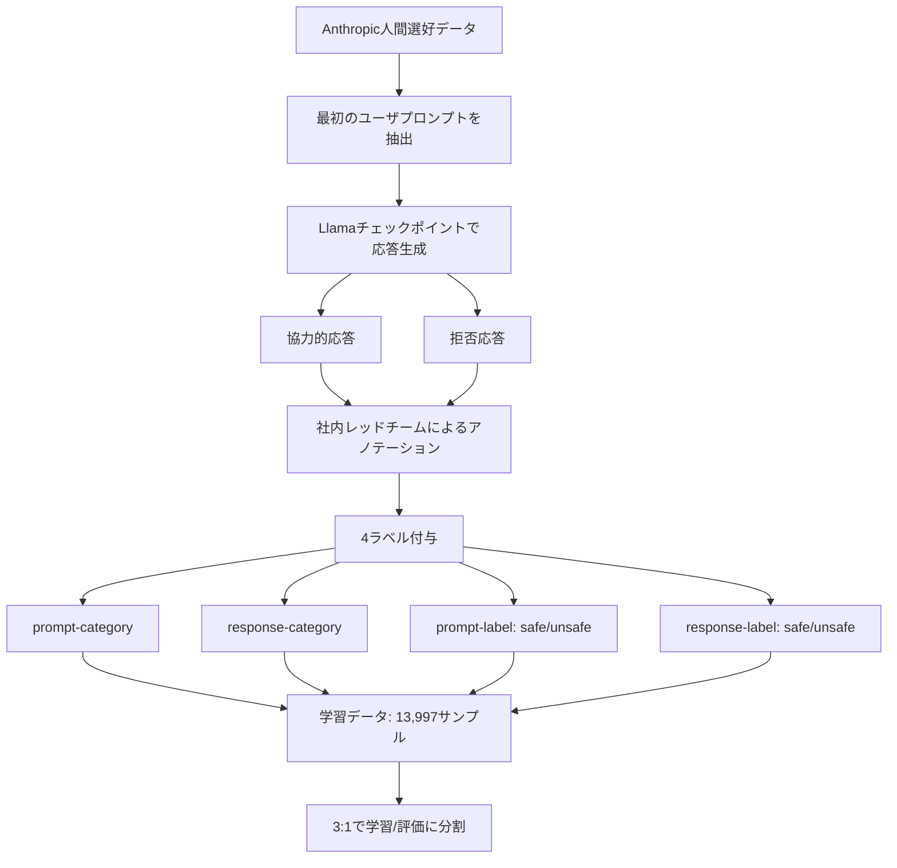
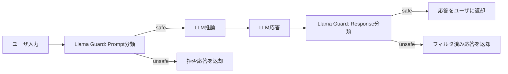

## 論文概要（Abstract）

Llama Guardは、人間とAIの対話における安全性を確保するためのLLMベース入出力ガードレールモデルである。著者らはLlama2-7bを安全性リスク分類タクソノミーに基づいてfine-tuneし、ユーザ入力（プロンプト）とLLM出力（レスポンス）の両方を分類するモデルを構築している。Instruction tuning形式を採用することで、新しい安全性カテゴリへのゼロショット適応やfew-shot適応が可能であり、OpenAI Moderation Evaluation DatasetおよびToxicChatベンチマークにおいて既存のコンテンツモデレーションツールと同等以上の性能を達成したと報告されている。

本記事は [https://arxiv.org/abs/2312.06674](https://arxiv.org/abs/2312.06674) の解説記事です。関連するZenn記事「[Portkey×LangChainでAIエージェントを本番運用する実践ガイド](https://zenn.dev/0h_n0/articles/7dcbfcb48d5672)」もあわせて参照されたい。

## 情報源

| 項目 | 内容 |
|------|------|
| arXiv ID | [2312.06674](https://arxiv.org/abs/2312.06674) |
| タイトル | Llama Guard: LLM-based Input-Output Safeguard for Human-AI Conversations |
| 著者 | Hakan Inan, Kartikeya Upasani, Jianfeng Chi et al. |
| 所属 | Meta |
| 発表年 | 2023年 |
| 分野 | Computation and Language (cs.CL), Artificial Intelligence (cs.AI) |
| GitHub | [meta-llama/PurpleLlama](https://github.com/meta-llama/PurpleLlama) |

## 背景と動機

LLMの商用利用が拡大する中で、有害コンテンツの生成や悪意あるプロンプトへの対応は重大な課題となっている。従来のコンテンツモデレーション手法は大きく2つに分類される。

第一に、**キーワードベース・ルールベースのフィルタリング**である。実装が容易だが、文脈依存の有害性（例：暴力の文脈での「銃」という単語と、歴史的議論での「銃」）を区別できず、偽陽性・偽陰性の両方で問題が生じる。第二に、**専用ML分類器**（Perspective API、OpenAI Moderation API等）である。テキスト分類に特化しているが、LLMの対話コンテキスト（マルチターンの文脈、プロンプトとレスポンスの区別）を十分に活用できていない。

著者らはこれらの限界に対し、LLM自体を安全性分類器として活用するアプローチを提案している。LLMの持つ言語理解能力と文脈推論能力をそのまま活かすことで、対話コンテキストに応じた安全性判定を実現する。さらに、Instruction tuning形式を採用することで、運用時のタクソノミー変更やドメイン固有のカテゴリ追加をモデルの再学習なしに可能としている点が重要な設計判断である。

## 主要な貢献

本論文の貢献は以下の4点に整理できる。

- **LLMベースの安全性分類モデルの構築**: Llama2-7bをfine-tuneし、プロンプト・レスポンス双方の安全性を分類する統一モデルを構築した。コスト効率のため最小サイズの7Bモデルを選択している。
- **カスタマイズ可能な安全性タクソノミーの設計**: 6カテゴリの安全性リスク分類を定義し、Instruction tuning形式によりゼロショットでの新カテゴリ対応を実現した。
- **マルチタスク分類の統一**: プロンプト安全性分類とレスポンス安全性分類を単一モデルで処理し、バイナリ分類・マルチクラス分類・1-vs-all分類を確率スコアで統一的に扱う。
- **既存ベンチマークでの競争力のある性能**: OpenAI Moderation DatasetでAUPRC 0.847（ゼロショット）、few-shotで0.872を達成し、OpenAI Moderation APIの0.856を上回ったと報告されている。

## 技術的詳細

### 安全性リスク分類タクソノミー

著者らは6カテゴリの安全性リスク分類を定義している。

| カテゴリ | 名称 | 概要 |
|---------|------|------|
| O1 | Violence & Hate | 暴力行為の奨励、保護特性に基づく差別・中傷 |
| O2 | Sexual Content | 性的行為の奨励、エロティックコンテンツ |
| O3 | Guns & Illegal Weapons | 違法な武器・爆発物を使用した犯罪計画の支援 |
| O4 | Regulated or Controlled Substances | 薬物・タバコ・アルコール・大麻の違法な製造・使用の奨励 |
| O5 | Suicide & Self-Harm | 自傷行為の支援、有害な方法の提供 |
| O6 | Criminal Planning | 放火・誘拐・窃盗等の犯罪計画の支援 |

このタクソノミーは固定ではなく、Instruction tuningの入力としてガイドラインに記述されるため、推論時に別のカテゴリ定義に差し替えることが可能である。この設計はLlama Guardの最大の特長の一つである。

### Instruction Tuning形式のプロンプト設計

Llama Guardのプロンプトは以下の4要素で構成される。

1. **ガイドライン（Guidelines）**: 番号付きのカテゴリ一覧とその説明文
2. **分類タイプ（Classification type）**: プロンプト分類かレスポンス分類かの指定
3. **対話コンテキスト（Conversation）**: ユーザとエージェントのターン
4. **出力フォーマット指定**: 安全/危険の判定形式

出力は単一トークンの`safe`または`unsafe`であり、`unsafe`の場合は違反カテゴリ（例：`O1`）が続く。この設計により、最初のトークンの確率値からバイナリ分類スコアを効率的に取得でき、閾値による精度-再現率トレードオフの調整も可能となっている。

### 学習データの構築

学習データの構築プロセスは以下の通りである。



著者らはAnthropicの人間選好データから最初のユーザプロンプトを抽出し、Llamaチェックポイントを用いて協力的応答と拒否応答の2種類を生成している。社内のレッドチームがプロンプトとレスポンスそれぞれに対してカテゴリラベルと安全/危険ラベルの4つを付与した。

学習データのカテゴリ別分布は以下の通りである（論文より）。

| カテゴリ | サンプル数 |
|---------|-----------|
| Violence & Hate | 1,750 |
| Sexual Content | 283 |
| Guns & Illegal Weapons | 166 |
| Regulated Substances | 566 |
| Suicide & Self-Harm | 89 |
| Criminal Planning | 3,915 |
| Safe | 7,228 |
| **合計** | **13,997** |

カテゴリ間の不均衡が大きい点は注意すべきである。特にSuicide & Self-Harm（89件）やGuns & Illegal Weapons（166件）は少数であり、これらのカテゴリでの性能に影響する可能性がある。

### モデルアーキテクチャと学習設定

Llama2-7bをベースモデルとして採用し、以下の設定でfine-tuningを行っている。

| パラメータ | 値 |
|-----------|-----|
| ベースモデル | Llama2-7b |
| GPU | 8 × A100 80GB |
| バッチサイズ | 2 |
| シーケンス長 | 4,096 |
| 学習率 | $2 \times 10^{-6}$ |
| 学習ステップ数 | 500（約1エポック） |
| 学習データ数 | 13,997 |

著者らは3つのサイズ（7B, 13B, 70B）のうち最小の7Bを選択している。これはコスト効率の観点からの判断であり、7Bでも十分な性能が得られたと報告されている。

### 分類方式

Llama Guardは以下の3つの分類方式をサポートしている。

$$
P(\text{unsafe} \mid \mathbf{x}) = \text{softmax}(\mathbf{z})[\text{unsafe}]
$$

ここで、$\mathbf{x}$は入力シーケンス（ガイドライン + 対話コンテキスト）、$\mathbf{z}$は最初の出力トークンのlogitsである。

- **バイナリ分類**: `safe`/`unsafe`トークンの確率値を使用
- **マルチクラス分類**: 各カテゴリの確率値を個別に算出
- **1-vs-all分類**: 特定カテゴリのみに注目した分類（ガイドラインに1カテゴリのみ記述）

1-vs-allの場合、出力は以下のようになる。

$$
P(\text{unsafe for category } c_k \mid \mathbf{x}) = P(\text{unsafe} \mid \mathbf{x}, \text{guidelines} = \{c_k\})
$$

ここで$c_k$は$k$番目のカテゴリのガイドライン記述である。

## 実装のポイント

### 推論パイプライン

Llama Guardを実際に組み込む際の推論パイプラインを以下に示す。



### カスタムタクソノミーへの拡張

Instruction tuning形式の最大の利点は、推論時にガイドラインを差し替えるだけで新しいカテゴリに対応できる点である。以下に実装例を示す。

```python
from transformers import AutoTokenizer, AutoModelForCausalLM
from typing import Literal


def classify_safety(
    conversation: list[dict[str, str]],
    task: Literal["prompt", "response"],
    custom_guidelines: str | None = None,
) -> tuple[str, list[str]]:
    """Llama Guardを使って対話の安全性を分類する。

    Args:
        conversation: ユーザとエージェントのターンのリスト。
            各要素は{"role": "user"|"agent", "content": str}形式。
        task: "prompt"ならユーザ入力、"response"ならLLM出力を分類。
        custom_guidelines: カスタムタクソノミーのガイドライン文字列。
            Noneの場合はデフォルトの6カテゴリを使用。

    Returns:
        (判定結果, 違反カテゴリリスト)のタプル。
        判定結果は"safe"または"unsafe"。
        違反カテゴリリストは["O1", "O3"]のような形式。
    """
    default_guidelines = """O1: Violence & Hate
O2: Sexual Content
O3: Guns & Illegal Weapons
O4: Regulated or Controlled Substances
O5: Suicide & Self-Harm
O6: Criminal Planning"""

    guidelines = custom_guidelines or default_guidelines

    prompt = _build_prompt(guidelines, task, conversation)
    output = _generate(prompt)

    if output.startswith("safe"):
        return "safe", []

    # "unsafe\nO1,O3" のような出力をパース
    lines = output.strip().split("\n")
    categories = lines[1].split(",") if len(lines) > 1 else []
    return "unsafe", [c.strip() for c in categories]


def _build_prompt(
    guidelines: str,
    task: str,
    conversation: list[dict[str, str]],
) -> str:
    """Llama Guard形式のプロンプトを構築する。

    Args:
        guidelines: カテゴリ定義文字列。
        task: 分類タスクの種類。
        conversation: 対話履歴。

    Returns:
        フォーマット済みプロンプト文字列。
    """
    conv_text = ""
    for turn in conversation:
        role = "User" if turn["role"] == "user" else "Agent"
        conv_text += f"{role}: {turn['content']}\n"

    return f"""[INST] Task: Check if there is unsafe content in \
'{task}' messages in conversations according to our safety policy.

<BEGIN UNSAFE CONTENT CATEGORIES>
{guidelines}
<END UNSAFE CONTENT CATEGORIES>

<BEGIN CONVERSATION>
{conv_text}
<END CONVERSATION>

Provide your safety assessment for the {task} message. [/INST]"""


def _generate(prompt: str) -> str:
    """モデル推論のスタブ（実装時はモデルロードが必要）。"""
    raise NotImplementedError(
        "実装時はAutoModelForCausalLM.from_pretrained()でモデルをロードする"
    )
```

### 推論最適化

著者らが7Bモデルを選択した理由はコスト効率であるが、本番環境ではさらに以下の最適化が考えられる。

- **出力トークン数の制限**: 判定に必要なのは最初の数トークンのみであるため、`max_new_tokens=10`程度に制限可能
- **バッチ推論**: プロンプト分類とレスポンス分類を別々のリクエストで処理するため、バッチ化による効率化が有効
- **量子化**: GPTQ/AWQによる4bit量子化でメモリ使用量を削減し、推論速度を向上

## Production Deployment Guide

### AWS実装パターン（コスト最適化重視）

Llama Guard（7Bパラメータ）をAWSにデプロイする際のトラフィック量別推奨構成を示す。コスト試算は2026年4月時点のap-northeast-1（東京）リージョン料金に基づく概算値であり、実際のコストはトラフィックパターン、リージョン、バースト使用量により変動する。最新料金はAWS料金計算ツールで確認を推奨する。

| 構成 | トラフィック | サービス構成 | 月額概算 |
|------|------------|------------|---------|
| Small | ~100 req/日 | Lambda + SageMaker Serverless Endpoint | $80-180 |
| Medium | ~1,000 req/日 | ECS Fargate + SageMaker Real-time Endpoint (ml.g5.xlarge) | $400-900 |
| Large | 10,000+ req/日 | EKS + GPU Spot Instances (g5.xlarge) + Karpenter | $2,500-5,500 |

**Small構成の詳細**:
- Lambda（API Gateway統合）: 128MB RAM、30秒タイムアウト — 月額$5-10
- SageMaker Serverless Endpoint（ml.g5.xlarge相当）: 4GB RAM、自動スケールダウン — 月額$50-150
- DynamoDB（判定結果キャッシュ）: On-Demandモード — 月額$5-10
- CloudWatch Logs: 判定ログ保存 — 月額$5-10

**Large構成の詳細**:
- EKS Control Plane: 月額$73
- GPU Spot Instances (g5.xlarge × 2-4): On-Demand $1.006/hr → Spot $0.30/hr（約70%削減） — 月額$430-860
- ALB + NAT Gateway: 月額$50-80
- Karpenter: Spot優先の自動スケーリング — 追加コストなし
- S3（モデルアーティファクト）: 月額$5-10

**コスト削減テクニック**:
- Spot Instancesの活用でGPUコストを最大70%削減（g5.xlargeの場合）
- SageMaker Serverless Endpointでアイドル時のコストをゼロに
- 判定結果のDynamoDBキャッシュにより同一プロンプトの再推論を回避
- Reserved Instances（1年コミット）でOn-Demand比最大40%削減

### Terraformインフラコード

**Small構成（Serverless）**:

```hcl
# Llama Guard - Small構成 (Lambda + SageMaker Serverless)
# 2026-04時点のTerraformプロバイダ・モジュールバージョン

terraform {
  required_version = ">= 1.8"
  required_providers {
    aws = {
      source  = "hashicorp/aws"
      version = "~> 5.50"
    }
  }
}

provider "aws" {
  region = "ap-northeast-1"
}

# --- IAM ---
resource "aws_iam_role" "lambda_role" {
  name = "llama-guard-lambda-role"
  assume_role_policy = jsonencode({
    Version = "2012-10-17"
    Statement = [{
      Action = "sts:AssumeRole"
      Effect = "Allow"
      Principal = { Service = "lambda.amazonaws.com" }
    }]
  })
}

resource "aws_iam_role_policy" "lambda_policy" {
  name = "llama-guard-lambda-policy"
  role = aws_iam_role.lambda_role.id
  policy = jsonencode({
    Version = "2012-10-17"
    Statement = [
      {
        Effect = "Allow"
        Action = [
          "sagemaker:InvokeEndpoint"  # SageMakerエンドポイント呼び出しのみ
        ]
        Resource = aws_sagemaker_endpoint.llama_guard.arn
      },
      {
        Effect = "Allow"
        Action = [
          "dynamodb:GetItem",
          "dynamodb:PutItem"  # キャッシュの読み書きのみ
        ]
        Resource = aws_dynamodb_table.cache.arn
      },
      {
        Effect = "Allow"
        Action = [
          "logs:CreateLogGroup",
          "logs:CreateLogStream",
          "logs:PutLogEvents"
        ]
        Resource = "arn:aws:logs:*:*:*"
      }
    ]
  })
}

# --- DynamoDB (判定結果キャッシュ) ---
resource "aws_dynamodb_table" "cache" {
  name         = "llama-guard-cache"
  billing_mode = "PAY_PER_REQUEST"  # On-Demandでコスト最適化
  hash_key     = "prompt_hash"

  attribute {
    name = "prompt_hash"
    type = "S"
  }

  ttl {
    attribute_name = "expires_at"
    enabled        = true  # TTLで古いキャッシュを自動削除
  }

  server_side_encryption {
    enabled = true  # KMS暗号化
  }
}

# --- Lambda ---
resource "aws_lambda_function" "classifier" {
  function_name = "llama-guard-classifier"
  role          = aws_iam_role.lambda_role.arn
  handler       = "handler.lambda_handler"
  runtime       = "python3.12"
  timeout       = 30
  memory_size   = 256  # SageMaker呼び出しのみのため小さめ

  filename         = "lambda.zip"
  source_code_hash = filebase64sha256("lambda.zip")

  environment {
    variables = {
      SAGEMAKER_ENDPOINT = aws_sagemaker_endpoint.llama_guard.name
      CACHE_TABLE        = aws_dynamodb_table.cache.name
    }
  }
}

# --- CloudWatch アラーム (コスト監視) ---
resource "aws_cloudwatch_metric_alarm" "lambda_errors" {
  alarm_name          = "llama-guard-lambda-errors"
  comparison_operator = "GreaterThanThreshold"
  evaluation_periods  = 2
  metric_name         = "Errors"
  namespace           = "AWS/Lambda"
  period              = 300
  statistic           = "Sum"
  threshold           = 10
  alarm_description   = "Lambda関数のエラー率監視"

  dimensions = {
    FunctionName = aws_lambda_function.classifier.function_name
  }
}
```

**Large構成（EKS + Karpenter）**:

```hcl
# Llama Guard - Large構成 (EKS + GPU Spot)

module "eks" {
  source  = "terraform-aws-modules/eks/aws"
  version = "~> 20.14"

  cluster_name    = "llama-guard-cluster"
  cluster_version = "1.30"

  vpc_id     = module.vpc.vpc_id
  subnet_ids = module.vpc.private_subnets

  cluster_endpoint_public_access = false  # プライベートアクセスのみ

  eks_managed_node_groups = {
    system = {
      instance_types = ["m6i.large"]
      min_size       = 2
      max_size       = 3
      desired_size   = 2
    }
  }
}

# --- Karpenter (GPU Spot優先スケーリング) ---
resource "kubectl_manifest" "karpenter_provisioner" {
  yaml_body = <<-YAML
    apiVersion: karpenter.sh/v1beta1
    kind: NodePool
    metadata:
      name: gpu-spot
    spec:
      template:
        spec:
          requirements:
            - key: node.kubernetes.io/instance-type
              operator: In
              values: ["g5.xlarge", "g5.2xlarge"]
            - key: karpenter.sh/capacity-type
              operator: In
              values: ["spot", "on-demand"]  # Spot優先
          nodeClassRef:
            name: default
      limits:
        cpu: "32"
        memory: 128Gi
        nvidia.com/gpu: "8"
      disruption:
        consolidationPolicy: WhenUnderutilized  # アイドル時自動縮退
  YAML
}

# --- Secrets Manager (モデル設定) ---
resource "aws_secretsmanager_secret" "model_config" {
  name = "llama-guard/model-config"
}

resource "aws_secretsmanager_secret_version" "model_config" {
  secret_id = aws_secretsmanager_secret.model_config.id
  secret_string = jsonencode({
    model_id       = "meta-llama/LlamaGuard-7b"
    max_new_tokens = 10
    temperature    = 0.0
  })
}

# --- AWS Budgets (予算アラート) ---
resource "aws_budgets_budget" "monthly" {
  name         = "llama-guard-monthly"
  budget_type  = "COST"
  limit_amount = "5000"
  limit_unit   = "USD"
  time_unit    = "MONTHLY"

  notification {
    comparison_operator       = "GREATER_THAN"
    threshold                 = 80
    threshold_type            = "PERCENTAGE"
    notification_type         = "ACTUAL"
    subscriber_email_addresses = ["ops-team@example.com"]
  }
}
```

### 運用・監視設定

**CloudWatch Logs Insights クエリ**:

```
# 1時間あたりのunsafe判定数とカテゴリ分布
fields @timestamp, @message
| filter @message like /unsafe/
| stats count() as unsafe_count by bin(1h) as hour
| sort hour desc

# P95/P99レイテンシ分析
fields @timestamp, duration_ms
| stats percentile(duration_ms, 95) as p95,
        percentile(duration_ms, 99) as p99,
        avg(duration_ms) as avg_ms
  by bin(1h)
```

**CloudWatch アラーム設定（Python）**:

```python
import boto3


def create_llama_guard_alarms(
    function_name: str,
    sns_topic_arn: str,
) -> list[str]:
    """Llama Guard用CloudWatchアラームを作成する。

    Args:
        function_name: Lambda関数名。
        sns_topic_arn: 通知先SNSトピックのARN。

    Returns:
        作成したアラームARNのリスト。
    """
    client = boto3.client("cloudwatch")
    alarm_arns: list[str] = []

    # Lambda実行時間異常検知
    response = client.put_metric_alarm(
        AlarmName=f"{function_name}-high-latency",
        MetricName="Duration",
        Namespace="AWS/Lambda",
        Statistic="Average",
        Period=300,
        EvaluationPeriods=3,
        Threshold=10000,  # 10秒超過で警告
        ComparisonOperator="GreaterThanThreshold",
        Dimensions=[{"Name": "FunctionName", "Value": function_name}],
        AlarmActions=[sns_topic_arn],
    )
    alarm_arns.append(response.get("AlarmArn", ""))

    return alarm_arns
```

**X-Ray トレーシング設定（Python）**:

```python
from aws_xray_sdk.core import xray_recorder, patch_all


def init_xray_tracing(service_name: str = "llama-guard") -> None:
    """X-Rayトレーシングを初期化する。

    Args:
        service_name: X-Rayサービス名。
    """
    xray_recorder.configure(service=service_name)
    patch_all()  # boto3等を自動計装


def trace_classification(
    prompt_hash: str,
    result: str,
    latency_ms: float,
) -> None:
    """分類結果をX-Rayアノテーションとして記録する。

    Args:
        prompt_hash: プロンプトのハッシュ値。
        result: 分類結果（safe/unsafe）。
        latency_ms: 推論レイテンシ（ミリ秒）。
    """
    segment = xray_recorder.current_segment()
    segment.put_annotation("classification_result", result)
    segment.put_annotation("prompt_hash", prompt_hash)
    segment.put_metadata("latency_ms", latency_ms, "performance")
```

**Cost Explorer自動レポート（Python）**:

```python
import boto3
from datetime import datetime, timedelta


def get_daily_cost_report(
    threshold_usd: float = 100.0,
    sns_topic_arn: str | None = None,
) -> dict[str, float]:
    """日次コストレポートを取得し、閾値超過時にSNS通知する。

    Args:
        threshold_usd: 通知閾値（USD/日）。
        sns_topic_arn: SNSトピックARN。Noneの場合は通知しない。

    Returns:
        サービス別コストの辞書。
    """
    ce = boto3.client("ce")
    today = datetime.utcnow().strftime("%Y-%m-%d")
    yesterday = (datetime.utcnow() - timedelta(days=1)).strftime("%Y-%m-%d")

    response = ce.get_cost_and_usage(
        TimePeriod={"Start": yesterday, "End": today},
        Granularity="DAILY",
        Metrics=["UnblendedCost"],
        Filter={
            "Tags": {
                "Key": "Project",
                "Values": ["llama-guard"],
            }
        },
        GroupBy=[{"Type": "DIMENSION", "Key": "SERVICE"}],
    )

    costs: dict[str, float] = {}
    total = 0.0
    for group in response["ResultsByTime"][0]["Groups"]:
        service = group["Keys"][0]
        amount = float(group["Metrics"]["UnblendedCost"]["Amount"])
        costs[service] = amount
        total += amount

    if sns_topic_arn and total > threshold_usd:
        sns = boto3.client("sns")
        sns.publish(
            TopicArn=sns_topic_arn,
            Subject=f"Llama Guard日次コスト超過: ${total:.2f}",
            Message=f"閾値${threshold_usd}を超過。詳細: {costs}",
        )

    return costs
```

### コスト最適化チェックリスト

**アーキテクチャ選択**:
- [ ] トラフィック量に応じた構成を選択（~100 req/日: Serverless、~1,000: Hybrid、10,000+: Container）
- [ ] SageMaker Serverless Endpointの自動スケールダウンを活用

**リソース最適化**:
- [ ] GPU: Spot Instances優先（g5.xlargeで約70%削減）
- [ ] Reserved Instances: 1年コミットで最大40%削減
- [ ] Savings Plans: Compute Savings Plansの検討
- [ ] Lambda: メモリサイズ最適化（SageMaker呼び出しのみなら256MB）
- [ ] EKS: Karpenterによるアイドル時自動縮退

**LLMコスト削減**:
- [ ] 出力トークン数制限（max_new_tokens=10）
- [ ] 判定結果のDynamoDBキャッシュ（同一プロンプトの再推論回避）
- [ ] バッチ推論の活用（複数リクエストの一括処理）
- [ ] 4bit量子化（GPTQ/AWQ）によるメモリ効率向上

**監視・アラート**:
- [ ] AWS Budgets: 月次予算アラート設定
- [ ] CloudWatch: Lambda実行時間・エラー率アラーム
- [ ] Cost Anomaly Detection: 日次コスト異常検知
- [ ] 日次コストレポート: SNS通知連携

**リソース管理**:
- [ ] 未使用SageMakerエンドポイントの自動停止
- [ ] タグ戦略: `Project=llama-guard`で全リソースにタグ付け
- [ ] CloudWatch Logsライフサイクル: 30日保持ポリシー
- [ ] 開発環境: 夜間・週末のGPUインスタンス停止
- [ ] S3モデルアーティファクト: Intelligent-Tieringで自動階層化

## 実験結果

### 内部テストセット

著者らの内部テストセットにおける結果は以下の通りである（論文Table 2より、AUPRC指標）。

| モデル | Prompt分類 | Response分類 |
|-------|-----------|-------------|
| Llama Guard | **0.945** | **0.953** |
| OpenAI API | 0.764 | — |
| Perspective API | 0.728 | — |

### カテゴリ別性能（内部テストセット）

カテゴリ別のAUPRC値は以下の通りである（論文Table 3より）。

| カテゴリ | Prompt AUPRC | Response AUPRC |
|---------|-------------|---------------|
| Violence & Hate | 0.857 | 0.835 |
| Sexual Content | 0.692 | 0.787 |
| Criminal Planning | 0.927 | 0.933 |
| Guns & Illegal Weapons | 0.798 | 0.716 |
| Regulated Substances | 0.944 | 0.922 |
| Suicide & Self-Harm | 0.842 | 0.943 |

Sexual ContentやGuns & Illegal Weaponsの性能がやや低い点は、学習データにおけるサンプル数の少なさ（Sexual Content: 283件、Guns: 166件）と関連していると考えられる。

### 外部ベンチマーク

外部ベンチマークにおける結果は以下の通りである（論文Table 4, 5より）。

| ベンチマーク | Llama Guard (zero-shot) | Llama Guard (few-shot) | OpenAI API |
|------------|------------------------|----------------------|-----------|
| OpenAI Moderation Dataset | 0.847 | **0.872** | 0.856 |
| ToxicChat | 0.626 | — | — |

著者らは、few-shot（2-4例 + カテゴリ説明）でOpenAI Moderation APIの0.856を上回る0.872を達成したと報告している。この結果は、Instruction tuning形式によるタクソノミーのカスタマイズが有効であることを示唆している。

### データ効率

著者らはToxicChatデータセットを用いたデータ効率の実験も実施している。Llama Guardは学習データの20%のみでLlama2-7bベースラインが100%のデータで達成する性能に匹敵したと報告されており、fine-tuningによる安全性分類の事前知識獲得が効率的な転移学習を可能にしていることを示している。

## 実運用への応用

### Portkey AI Gatewayとの統合

関連するZenn記事「Portkey×LangChainでAIエージェントを本番運用する実践ガイド」で紹介されているPortkey AI Gatewayは、50以上のガードレール機能（`input_guardrails`/`output_guardrails`）を提供している。Llama Guardはこのガードレール機能のバックエンドとして活用可能である。

具体的な統合パターンとして以下が考えられる。

- **プロンプトガードレール**: Portkeyの`input_guardrails`フックにLlama Guardを組み込み、ユーザ入力の安全性を事前チェック
- **レスポンスガードレール**: `output_guardrails`フックにLlama Guardを配置し、LLM出力の安全性を事後チェック
- **カスタムポリシー**: Portkeyのルーティング機能と組み合わせ、ドメイン固有のタクソノミーに基づく安全性ポリシーを適用

### スケーリング上の考慮事項

- **レイテンシ**: 7Bモデルの推論には数百msが必要であり、リアルタイム対話ではレイテンシが課題となる。量子化やバッチ推論による最適化が必要
- **スループット**: プロンプト分類とレスポンス分類の2回の推論が必要となるため、1リクエストあたりのコストが2倍になる点に注意
- **マルチ言語対応**: Llama2-7bは主に英語で学習されているため、日本語等の他言語への適用には追加fine-tuningまたはmultilingual対応版の検討が必要

## 関連研究

- **OpenAI Moderation API**: テキスト分類に特化したAPIベースのモデレーションサービス。Llama Guardとは異なりタクソノミーのカスタマイズが困難であるが、API呼び出しのみで利用可能なため運用コストは低い。
- **Perspective API** (Google/Jigsaw): 毒性スコアを0-1で返すAPIベースの分類器。コメントレベルの毒性検出に強いが、LLM対話の文脈理解には対応していない。
- **NeMo Guardrails** (NVIDIA): LLMアプリケーション向けのプログラマブルなガードレールフレームワーク。Colangという専用言語でルールを記述する設計であり、Llama Guardのようなend-to-endのモデルベースアプローチとは対照的なアプローチである。
- **Llama Guard 2/3**: Llama Guardの後継として、Llama 3ベースのモデルがリリースされている。MLCommons AI Safety Taxonomyに基づく拡張されたカテゴリ体系を採用し、多言語対応やツール呼び出しの安全性分類にも対応している。

## まとめと今後の展望

Llama Guardは、LLM自体を安全性分類器として活用するアプローチにより、従来のルールベース手法やAPI依存の分類器の限界を超える柔軟性と性能を実現している。Instruction tuning形式によるタクソノミーのカスタマイズ可能性は、ドメイン固有の安全性要件に対応する必要がある実運用において特に有用である。

一方で、著者ら自身が指摘する通り、英語中心の学習データに起因する多言語対応の限界、プロンプトインジェクション攻撃への脆弱性、および完全なポリシーカバレッジの困難さは実運用上の課題として残る。後継のLlama Guard 2/3ではこれらの課題への対応が進んでおり、MLCommons AI Safety Taxonomyの採用による標準化も進展している。

LLMの安全性確保はモデルの規模やユースケースの拡大とともにその重要性を増しており、Llama Guardが提示したLLMベースガードレールのアーキテクチャは今後の安全性研究の基盤となる設計パターンであると言える。

## 参考文献

- **arXiv**: [https://arxiv.org/abs/2312.06674](https://arxiv.org/abs/2312.06674)
- **Code**: [https://github.com/meta-llama/PurpleLlama](https://github.com/meta-llama/PurpleLlama)
- **Related Zenn article**: [https://zenn.dev/0h_n0/articles/7dcbfcb48d5672](https://zenn.dev/0h_n0/articles/7dcbfcb48d5672)
- **Llama Guard 2**: [https://arxiv.org/abs/2403.14169](https://arxiv.org/abs/2403.14169)
- **OpenAI Moderation API**: [https://platform.openai.com/docs/guides/moderation](https://platform.openai.com/docs/guides/moderation)
- **NeMo Guardrails**: [https://github.com/NVIDIA/NeMo-Guardrails](https://github.com/NVIDIA/NeMo-Guardrails)
