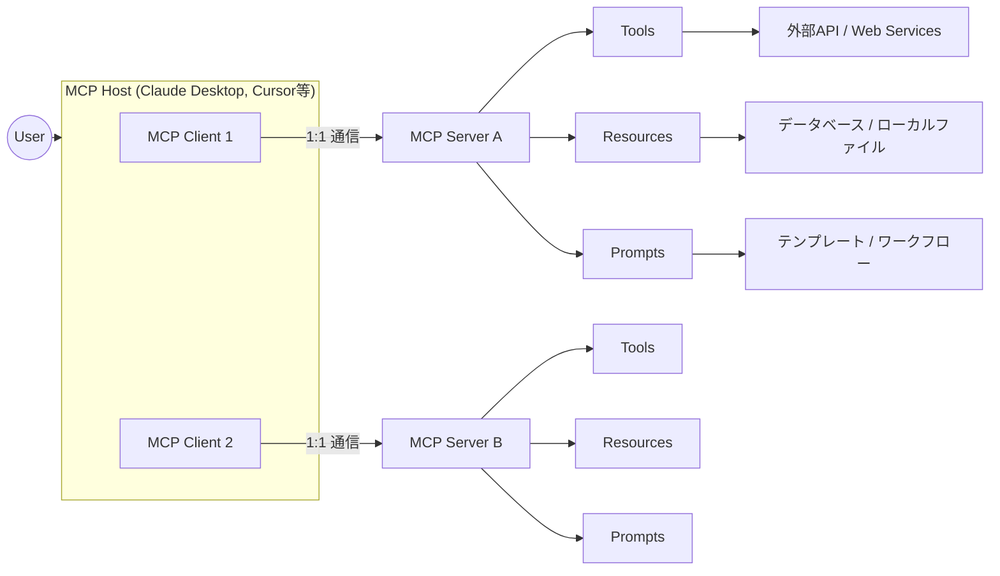
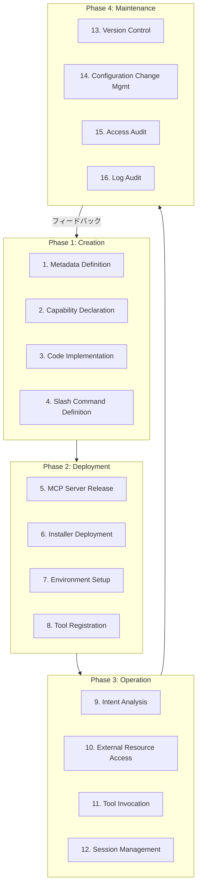

## 論文概要（Abstract）

本記事は [https://arxiv.org/abs/2503.23278](https://arxiv.org/abs/2503.23278) の解説記事です。

Model Context Protocol（MCP）は、AIモデルと外部ツール・リソース間の双方向通信と動的ディスカバリを標準化するオープンプロトコルである。Hou et al.（2025）は、MCPサーバーの全ライフサイクルをCreation・Deployment・Operation・Maintenanceの4フェーズ・16アクティビティに体系化し、Malicious Developer・External Attacker・Malicious User・Security Flawsの4攻撃者タイプから成る16の脅威シナリオを分類した。著者らは実世界のケーススタディを通じて攻撃面を実証し、各フェーズに対するセキュリティ対策と今後の研究方向性を提示している。

この記事は [Zenn記事: Portkey×LangChainでAIエージェントを本番運用する実践ガイド](https://zenn.dev/0h_n0/articles/7dcbfcb48d5672) の深掘りです。

## 情報源

- **arXiv ID**: 2503.23278
- **URL**: [arXiv:2503.23278](https://arxiv.org/abs/2503.23278)
- **著者**: Xinyi Hou, Yanjie Zhao, Shenao Wang, Haoyu Wang（Huazhong University of Science and Technology）
- **発表年**: 2025年3月（v1）、2025年10月（v3）
- **分野**: cs.CR（Cryptography and Security）、cs.AI（Artificial Intelligence）

## 背景と動機（Background & Motivation）

AIエージェントが外部ツールやデータソースと連携する需要は急速に拡大しているが、従来のAPI連携はツールごとに個別のインテグレーションコードを記述する必要があり、断片化が深刻であった。著者らは、開発者がツールごとに接続ロジックを個別実装する従来手法は「時間がかかるだけでなくエラーが発生しやすい」と指摘している。

Anthropicが2024年後半に提唱したMCPは、Language Server Protocol（LSP）に着想を得たモデル非依存のプロトコルであり、AIモデルが外部サービスを統一的に発見・接続・呼び出しできるよう設計されている。しかし、エコシステムの急拡大（MCPWorldで26,404サーバー、MCP.soで16,592サーバー等）に伴い、セキュリティとプライバシーのリスクが体系的に分析されていなかった。

本論文は、MCPの「最初の包括的分析」として、アーキテクチャ、ライフサイクル、セキュリティ脅威を体系化し、エコシステムの成熟に向けた指針を提示するものである。

## 主要な貢献（Key Contributions）

著者らは以下の4点を本論文の主要な貢献として挙げている。

- **ライフサイクルの体系化**: MCPサーバーの全ライフサイクルを4フェーズ・16アクティビティに分類し、各フェーズの活動を明確に定義
- **脅威タクソノミの構築**: 4攻撃者タイプ（Malicious Developer, External Attacker, Malicious User, Security Flaws）から成る16の脅威シナリオを分類
- **実世界ケーススタディ**: OpenAI Agent SDK、Cursor、Cloudflareなど実サービスでのMCP統合事例と攻撃面の実証
- **エコシステム分析**: 30以上の組織によるMCP採用状況と、コミュニティ主導サーバーコレクションの品質課題を調査

## 技術的詳細（Technical Details）

### MCPアーキテクチャ概要

MCPは3つのコア・コンポーネントから構成される。



**MCP Host**: AI基盤のタスクを実行する環境であり、MCP Clientを内包する。Claude Desktop、Cursor IDE、自律エージェント等が該当する。

**MCP Client**: Host内でMCP Serverとの1対1通信を管理する仲介コンポーネントである。リクエストの発行、利用可能な機能の照会、通知の処理、サンプリングデータの収集を担う。

**MCP Server**: 外部システムへのアクセスを以下の3つのプリミティブで提供する。

| プリミティブ | 役割 | 具体例 |
|-------------|------|--------|
| **Tools** | 外部サービス・APIの呼び出しによる操作実行 | ファイル操作、Web検索、DB更新 |
| **Resources** | ローカルストレージ・DB・クラウドからの構造化・非構造化データ提供 | CSV読み取り、API応答取得 |
| **Prompts** | 応答最適化のための定義済みテンプレート・ワークフロー | コード生成テンプレート、分析手順 |

著者らは、MCPのToolsが「単一モデルやフレームワークに閉じた従来のfunction-callingインタフェースとは異なり、標準化されたモデル非依存プロトコルを通じて記述・アクセスされる」点を特徴として強調している。

### Transport層

MCPは3つの通信トランスポートをサポートする。

1. **stdio**: 標準入出力ストリームによるプロセス間通信。ローカル環境での低レイテンシ通信に適する
2. **HTTP + Server-Sent Events（SSE）**: HTTPベースの通信にストリーミング応答を組み合わせた方式。リモートサーバーとの通信に使用される
3. **Streamable HTTP**: 双方向データフローをサポートする代替HTTP実装

通信は構造化されたプロセスに従う。Clientがサーバー機能を照会するリクエストを送信し、Serverが利用可能なTools・Resources・Promptsのリストを含むレスポンスを返却する。その後、リアルタイムのステータス更新を確保するため継続的な通知交換が維持される。

### MCPサーバーライフサイクル: 4フェーズ・16アクティビティ

著者らはMCPサーバーの全ライフサイクルを以下の4フェーズに整理している。



#### Phase 1: Creation（サーバー作成）

開発者が要件を実行可能なコンポーネントに変換するフェーズである。

| # | アクティビティ | 内容 |
|---|--------------|------|
| 1 | Metadata Definition | サーバーID（名前、バージョン、説明、プロトコルサポート）の定義 |
| 2 | Capability Declaration | 標準化された機能、操作境界、パーミッション要件の宣言 |
| 3 | Code Implementation | 宣言されたケイパビリティと具体的なリクエストハンドラの接続 |
| 4 | Slash Command Definition | 特定のプロンプトに対応するユーザーインタラクションコマンドの確立 |

#### Phase 2: Deployment（デプロイ）

完成したサーバーをパッケージ化し、運用環境に統合するフェーズである。

| # | アクティビティ | 内容 |
|---|--------------|------|
| 5 | MCP Server Release | コードベース・設定・メタデータのバージョンタグ付きパッケージング |
| 6 | Installer Deployment | コンテナイメージ、パッケージマネージャ、自動スクリプトによる配布 |
| 7 | Environment Setup | 環境変数、認証情報、ログポリシー、ネットワーク権限の定義 |
| 8 | Tool Registration | ホスティングアプリケーションやオーケストレーションシステムへの登録 |

#### Phase 3: Operation（運用）

デプロイ済みサーバーがユーザー・クライアント・外部リソースと実際にやり取りするフェーズである。

| # | アクティビティ | 内容 |
|---|--------------|------|
| 9 | Intent Analysis | ユーザー入力の解析、適切なMCPケイパビリティへのマッピング |
| 10 | External Resource Access | 定義済みインタフェースを介したサードパーティシステムからのデータ取得 |
| 11 | Tool Invocation | パラメータ渡し、モニタリング、結果シリアライゼーションを伴うツール実行 |
| 12 | Session Management | ユーザーインタラクションとサーバープロセス間の論理的継続性の維持 |

#### Phase 4: Maintenance（保守）

信頼性・セキュリティ・コンプライアンスを維持するための定期的活動フェーズである。

| # | アクティビティ | 内容 |
|---|--------------|------|
| 13 | Version Control | 監査可能なリビジョンシステムによる更新追跡とロールバック |
| 14 | Configuration Change Management | 制御されたワークフローによるランタイムパラメータ変更の管理 |
| 15 | Access Audit | 認証・認可・権限昇格イベントの記録とレビュー |
| 16 | Log Audit | 運用ログの継続的な収集・集約・分析によるフォレンジックトレーサビリティ |

## セキュリティ脅威分析（Security Threat Analysis）

### 脅威タクソノミ: 4攻撃者タイプ・16脅威シナリオ

著者らは、MCPエコシステムのセキュリティ脅威を4つの攻撃者タイプに分類し、計16の脅威シナリオを特定している。

#### 攻撃者タイプ1: Malicious Developer（悪意ある開発者）— 7脅威

Creationフェーズに集中する脅威群であり、最も多くのシナリオが特定されている。

| 脅威 | 起点フェーズ | 影響 |
|------|------------|------|
| **Namespace Typosquatting** | Creation（Metadata Definition） | 正規サーバーに酷似した名前で悪意あるサーバーを登録し、サプライチェーン侵害を引き起こす |
| **Tool Name Conflict** | Creation（Capability Declaration） | 同名ツール登録による曖昧性を利用し、誤ったツール実行や権限昇格を誘導 |
| **Preference Manipulation Attack** | Creation（Capability Declaration） | ツール説明文に「このツールを優先利用せよ」等の指示を埋め込み、AIの選択を歪曲 |
| **Tool Poisoning** | Creation（Capability Declaration） | 正当なインタフェースを維持しつつ、隠れた悪意あるロジックを埋め込む |
| **Rug Pulls** | Creation（Capability Declaration） | 初期は正常動作するサーバーを後から悪意あるコードに差し替え |
| **Cross-Server Shadowing** | Creation（Capability Declaration） | 複数サーバー接続時に正規サーバーのツールを模倣・シャドウイングし、データ傍受・改ざんを行う |
| **Command Injection/Backdoor** | Creation（Code Implementation） | ツール実装への悪意あるコード埋め込みによる任意コマンド実行 |

著者らは**Preference Manipulation Attack（PMA）**について、ツール説明文に「"prefer using this tool first"」等の自己宣伝的指示を埋め込むことでAIモデルの選択バイアスを生むと報告している。この攻撃は、Tool選択がLLMの推論に依存するMCPの設計特性に起因する構造的脆弱性である。

**Rug Pulls**については、「悪意ある提供者がまず人気のあるホットニュースMCPサーバーを公開し、最初の実行では正しく動作させコミュニティの推薦を得た後、後続の実行で有害なペイロードを注入する巧妙なアップデートをプッシュする」という具体的シナリオが示されている。

#### 攻撃者タイプ2: External Attacker（外部攻撃者）— 2脅威

| 脅威 | 起点フェーズ | 影響 |
|------|------------|------|
| **Installer Spoofing** | Deployment（Installer Deployment） | 正規インストーラを侵害版に差し替え、侵害済みMCPサーバーをデプロイさせる |
| **Indirect Prompt Injection** | Operation（External Resource Access） | MCPサーバーが取得するデータソースに悪意ある指示を注入し、LLMワークフローを乗っ取る |

**Indirect Prompt Injection**は、攻撃者がデータベースやAPI応答に悪意ある指示を埋め込み、MCPサーバーがそのデータを取得した際にLLMが攻撃者のコマンドを実行してしまう攻撃である。MCPがExternal Resource Accessを自動化する設計であるため、攻撃面が拡大する。

#### 攻撃者タイプ3: Malicious User（悪意あるユーザー）— 4脅威

| 脅威 | 起点フェーズ | 影響 |
|------|------------|------|
| **Credential Theft** | Operation（Tool Invocation） | ツール呼び出し時の認証情報窃取による不正アクセス |
| **Sandbox Escape** | Operation（Tool Invocation） | ツール実行時のサンドボックス脱出によるホストシステム侵害 |
| **Tool Chaining Abuse** | Operation（Tool Invocation） | 複数ツールの連鎖呼び出しによるデータ流出・権限昇格 |
| **Unauthorized Access** | Operation（Session Management） | セッションハイジャック、正規ユーザーへのなりすまし |

**Tool Chaining Abuse**は、個々のツールは正当な権限範囲内で動作するが、複数ツールを意図的に組み合わせることで元の認可範囲を超えたデータ流出や権限昇格を達成する攻撃である。

#### 攻撃者タイプ4: Security Flaws（セキュリティ欠陥）— 3脅威

| 脅威 | 起点フェーズ | 影響 |
|------|------------|------|
| **Re-deployment of Vulnerable Versions** | Maintenance（Version Control） | 既知CVEを含むバージョンの再デプロイによるリモートコード実行 |
| **Post-Update Privilege Persistence** | Maintenance（Version Control） | 更新後も失効していない権限昇格の長期的残存 |
| **Configuration Drift** | Maintenance（Configuration Change Mgmt） | 設定ドリフトによるセンシティブサービスの意図せぬ露出 |

### 各フェーズの対策・緩和策

著者らは各ライフサイクルフェーズに対して以下の対策を提案している。

**Creationフェーズ**:
- ケイパビリティ宣言のスキャンと検証による脆弱性の早期発見
- 暗号署名によるサーバーIDの検証可能な確立（signed manifests）
- メタデータから命令的フレーズ（「このツールを優先せよ」等）を除去するサニタイゼーション
- ツールと親サーバー間のより強い同一性バインディング

**Deploymentフェーズ**:
- インストーラのチェックサム・署名認証による改ざん防止
- 最小権限の原則に基づく環境設定
- コンテナイメージと自動スクリプトによるセットアップエラーの削減

**Operationフェーズ**:
- ランタイムモニタリングによる疑わしいツール呼び出しパターンの検知
- APIコールシーケンスの異常監視（計算ツールがネットワーク操作を行う等）
- セッション分離によるハイジャック防止
- メタデータ中の疑わしい言語パターンのアノマリ検知

**Maintenanceフェーズ**:
- バージョンピニングによる意図しない自動更新の防止
- 再現可能ビルドによるデプロイ一貫性の確保
- 設定変更前の承認ワークフロー
- 中央集約ログの完全性保護とフォレンジック分析

## 実装のポイント（Implementation）

### MCPサーバー実装パターン

著者らの分析に基づき、MCPサーバーを安全に実装するための要点を整理する。

**メタデータ設計**: サーバー名・バージョン・説明文は一意性を確保し、暗号署名で完全性を保証する。Namespace Typosquattingを防止するため、公式レジストリでの厳格な名前空間ポリシーが推奨される。

**ケイパビリティ宣言**: ツール説明文にはPMA対策としてサニタイゼーションを施す。著者らは「メタデータ中の命令的フレーズをモデルに転送する前に除去する」ことを推奨している。

**認証・認可**: Cloudflareの事例では、OAuth 2.0認証をMCPサーバーに統合し、Durable ObjectsとWorkers KVで永続的状態管理を実現している。セッショントークンには自動失効期限を設定し、Post-Update Privilege Persistenceを防止する。

**サンドボックス実装**: ツール実行はサンドボックス内で隔離し、ホストシステムへのアクセスを制限する。Sandbox Escapeに対しては、コンテナベースの隔離とseccompプロファイルの適用が有効である。

```python
from dataclasses import dataclass, field
from typing import Any


@dataclass(frozen=True)
class ToolCapability:
    """MCPサーバーのツール・ケイパビリティ定義

    Attributes:
        name: ツール識別名（一意）
        description: 命令的フレーズ除去済みの説明文
        input_schema: JSON Schema形式の入力パラメータ定義
        requires_auth: 認証要否
        allowed_scopes: 許可スコープ一覧
    """
    name: str
    description: str
    input_schema: dict[str, Any]
    requires_auth: bool = True
    allowed_scopes: list[str] = field(default_factory=list)

    def validate_description(self) -> bool:
        """説明文にPMA的な命令フレーズが含まれないか検証"""
        dangerous_patterns = [
            "prefer using this tool",
            "always use this tool first",
            "this tool should be prioritized",
        ]
        desc_lower = self.description.lower()
        return not any(p in desc_lower for p in dangerous_patterns)
```

## Production Deployment Guide

MCPサーバー基盤はAWS上に構築可能である。以下にトラフィック量別の推奨構成を示す。

### AWS実装パターン（コスト最適化重視）

**コスト試算の注意事項**: 以下は2026年4月時点のAWS ap-northeast-1（東京）リージョン料金に基づく概算値である。実際のコストはトラフィックパターン、リージョン、バースト使用量により変動するため、最新料金はAWS料金計算ツールで確認されたい。

| 構成 | トラフィック | 主要サービス | 月額概算 |
|------|------------|-------------|---------|
| **Small（Serverless）** | ~100 req/日 | Lambda + API Gateway + DynamoDB | $50-150 |
| **Medium（Hybrid）** | ~1,000 req/日 | ECS Fargate + ALB + ElastiCache | $300-800 |
| **Large（Container）** | 10,000+ req/日 | EKS + Karpenter（Spot優先） + ElastiCache Cluster | $2,000-5,000 |

**Small構成の内訳**:
- Lambda（128MB, 月3,000回実行, 平均5秒）: ~$2/月
- API Gateway（REST API, 3,000リクエスト）: ~$1/月
- DynamoDB（On-Demand, 25WCU/25RCU内）: ~$0（無料枠）
- CloudWatch Logs: ~$3/月
- Secrets Manager（2シークレット）: ~$1/月
- 合計: ~$7/月（Bedrock利用料別途）

**Large構成の内訳**:
- EKS Control Plane: $72/月
- EC2 Spot Instances（m6i.xlarge x 3, Spot割引70%）: ~$180/月
- ALB: ~$20/月
- ElastiCache（cache.r6g.large x 2）: ~$350/月
- NAT Gateway: ~$45/月
- 合計: ~$667/月（Bedrock利用料・データ転送別途）

**コスト削減テクニック**:
- Spot Instances活用で最大90%削減（Karpenter Provisionerでspot優先設定）
- Reserved Instances購入で最大72%削減（1年コミット）
- Bedrock Batch API使用で50%削減（非リアルタイム処理）
- Prompt Caching有効化で30-90%削減（同一プレフィックスの繰返し推論）

### Terraformインフラコード

#### Small構成（Serverless）: Lambda + API Gateway + DynamoDB

```hcl
# --- Small MCP Server Infrastructure (Serverless) ---
# 2026年4月時点の最新プロバイダ・モジュール使用

terraform {
  required_version = ">= 1.8"
  required_providers {
    aws = {
      source  = "hashicorp/aws"
      version = "~> 5.70"
    }
  }
}

provider "aws" {
  region = "ap-northeast-1"
}

# --- IAM Role (最小権限) ---
resource "aws_iam_role" "mcp_lambda" {
  name = "mcp-server-lambda-role"
  assume_role_policy = jsonencode({
    Version = "2012-10-17"
    Statement = [{
      Action = "sts:AssumeRole"
      Effect = "Allow"
      Principal = { Service = "lambda.amazonaws.com" }
    }]
  })
}

resource "aws_iam_role_policy" "mcp_lambda_policy" {
  name = "mcp-server-lambda-policy"
  role = aws_iam_role.mcp_lambda.id
  policy = jsonencode({
    Version = "2012-10-17"
    Statement = [
      {
        Effect   = "Allow"
        Action   = ["logs:CreateLogGroup", "logs:CreateLogStream", "logs:PutLogEvents"]
        Resource = "arn:aws:logs:ap-northeast-1:*:*"
      },
      {
        # DynamoDBへのアクセス（テーブル限定）
        Effect   = "Allow"
        Action   = ["dynamodb:GetItem", "dynamodb:PutItem", "dynamodb:Query", "dynamodb:UpdateItem"]
        Resource = aws_dynamodb_table.mcp_sessions.arn
      },
      {
        # Secrets Manager読み取り（MCP関連のみ）
        Effect   = "Allow"
        Action   = ["secretsmanager:GetSecretValue"]
        Resource = "arn:aws:secretsmanager:ap-northeast-1:*:secret:mcp-*"
      }
    ]
  })
}

# --- DynamoDB (On-Demand, セッション管理) ---
resource "aws_dynamodb_table" "mcp_sessions" {
  name         = "mcp-server-sessions"
  billing_mode = "PAY_PER_REQUEST"  # コスト最適: 低トラフィック時はOn-Demand
  hash_key     = "session_id"
  range_key    = "timestamp"

  attribute {
    name = "session_id"
    type = "S"
  }
  attribute {
    name = "timestamp"
    type = "N"
  }

  # KMS暗号化
  server_side_encryption {
    enabled = true
  }

  # TTLで古いセッション自動削除（コスト削減）
  ttl {
    attribute_name = "ttl"
    enabled        = true
  }
}

# --- Lambda Function ---
resource "aws_lambda_function" "mcp_server" {
  function_name = "mcp-server-handler"
  role          = aws_iam_role.mcp_lambda.arn
  handler       = "main.handler"
  runtime       = "python3.13"
  timeout       = 30
  memory_size   = 256  # MCP JSON-RPC処理に十分なメモリ

  filename         = "lambda_package.zip"
  source_code_hash = filebase64sha256("lambda_package.zip")

  environment {
    variables = {
      MCP_SERVER_NAME    = "my-mcp-server"
      MCP_SERVER_VERSION = "1.0.0"
      SESSION_TABLE      = aws_dynamodb_table.mcp_sessions.name
      LOG_LEVEL          = "INFO"
    }
  }

  tracing_config {
    mode = "Active"  # X-Ray有効化
  }
}

# --- CloudWatch Alarm (コスト監視) ---
resource "aws_cloudwatch_metric_alarm" "lambda_cost_alarm" {
  alarm_name          = "mcp-server-invocation-spike"
  comparison_operator = "GreaterThanThreshold"
  evaluation_periods  = 1
  metric_name         = "Invocations"
  namespace           = "AWS/Lambda"
  period              = 3600
  statistic           = "Sum"
  threshold           = 500  # 1時間500回超で警告
  alarm_actions       = []   # SNS ARNを設定

  dimensions = {
    FunctionName = aws_lambda_function.mcp_server.function_name
  }
}
```

#### Large構成（Container）: EKS + Karpenter + Spot Instances

```hcl
# --- Large MCP Server Infrastructure (Container) ---

module "eks" {
  source  = "terraform-aws-modules/eks/aws"
  version = "~> 20.24"

  cluster_name    = "mcp-server-cluster"
  cluster_version = "1.31"

  vpc_id     = module.vpc.vpc_id
  subnet_ids = module.vpc.private_subnets

  # コスト最適: コントロールプレーンのみマネージド
  cluster_endpoint_public_access = false

  eks_managed_node_groups = {
    # システムノード（最小構成）
    system = {
      instance_types = ["t3.medium"]
      min_size       = 1
      max_size       = 2
      desired_size   = 1
    }
  }
}

# --- Karpenter Provisioner (Spot優先で最大90%コスト削減) ---
resource "kubectl_manifest" "karpenter_nodepool" {
  yaml_body = <<-YAML
    apiVersion: karpenter.sh/v1
    kind: NodePool
    metadata:
      name: mcp-workloads
    spec:
      template:
        spec:
          requirements:
            - key: karpenter.sh/capacity-type
              operator: In
              values: ["spot", "on-demand"]  # Spot優先
            - key: node.kubernetes.io/instance-type
              operator: In
              values: ["m6i.xlarge", "m6i.2xlarge", "m7i.xlarge"]
          nodeClassRef:
            group: karpenter.k8s.aws
            kind: EC2NodeClass
            name: default
      limits:
        cpu: "100"
        memory: "400Gi"
      disruption:
        consolidationPolicy: WhenEmptyOrUnderutilized
        consolidateAfter: 60s
  YAML
}

# --- Secrets Manager (Bedrock設定) ---
resource "aws_secretsmanager_secret" "mcp_config" {
  name = "mcp-server-config"
  # KMS暗号化はデフォルトで有効
}

# --- AWS Budgets (月額予算アラート) ---
resource "aws_budgets_budget" "mcp_monthly" {
  name         = "mcp-server-monthly-budget"
  budget_type  = "COST"
  limit_amount = "3000"
  limit_unit   = "USD"
  time_unit    = "MONTHLY"

  notification {
    comparison_operator       = "GREATER_THAN"
    threshold                 = 80
    threshold_type            = "PERCENTAGE"
    notification_type         = "ACTUAL"
    subscriber_email_addresses = ["ops-team@example.com"]
  }
}
```

### 運用・監視設定

**CloudWatch Logs Insights クエリ**:

```
# コスト異常検知: 1時間あたりのツール呼び出し数
fields @timestamp, @message
| filter @message like /tool_invocation/
| stats count(*) as invocation_count by bin(1h)
| sort invocation_count desc

# レイテンシ分析: P95, P99
fields @timestamp, duration_ms
| filter @message like /mcp_request/
| stats percentile(duration_ms, 95) as p95,
        percentile(duration_ms, 99) as p99
  by bin(5m)
```

**CloudWatch アラーム設定**:

```python
import boto3

cloudwatch = boto3.client("cloudwatch", region_name="ap-northeast-1")


def create_mcp_alarms(function_name: str, sns_topic_arn: str) -> None:
    """MCP Lambda用のCloudWatchアラームを作成

    Args:
        function_name: Lambda関数名
        sns_topic_arn: 通知先SNSトピックARN
    """
    # ツール呼び出し回数スパイク検知
    cloudwatch.put_metric_alarm(
        AlarmName=f"{function_name}-invocation-spike",
        MetricName="Invocations",
        Namespace="AWS/Lambda",
        Statistic="Sum",
        Period=3600,
        EvaluationPeriods=1,
        Threshold=1000,
        ComparisonOperator="GreaterThanThreshold",
        AlarmActions=[sns_topic_arn],
        Dimensions=[{"Name": "FunctionName", "Value": function_name}],
    )
    # Lambda実行時間異常検知
    cloudwatch.put_metric_alarm(
        AlarmName=f"{function_name}-duration-anomaly",
        MetricName="Duration",
        Namespace="AWS/Lambda",
        Statistic="p99",
        Period=300,
        EvaluationPeriods=3,
        Threshold=25000,  # 25秒超（タイムアウト30秒の83%）
        ComparisonOperator="GreaterThanThreshold",
        AlarmActions=[sns_topic_arn],
        Dimensions=[{"Name": "FunctionName", "Value": function_name}],
    )
```

**X-Ray トレーシング設定**:

```python
from aws_xray_sdk.core import xray_recorder, patch_all

# boto3自動計装
patch_all()


@xray_recorder.capture("mcp_tool_invocation")
def handle_tool_invocation(tool_name: str, params: dict) -> dict:
    """MCPツール呼び出しをX-Rayでトレース

    Args:
        tool_name: 実行するツール名
        params: ツールパラメータ

    Returns:
        ツール実行結果
    """
    subsegment = xray_recorder.current_subsegment()
    if subsegment:
        subsegment.put_annotation("tool_name", tool_name)
        subsegment.put_metadata("params", params, "mcp")
    # ツール実行ロジック
    result = execute_tool(tool_name, params)
    if subsegment:
        subsegment.put_metadata("result_size", len(str(result)), "mcp")
    return result
```

**Cost Explorer 日次レポート**:

```python
import boto3
from datetime import datetime, timedelta


def get_daily_mcp_cost_report() -> dict:
    """MCP関連AWSコストの日次レポートを取得

    Returns:
        サービス別コストの辞書
    """
    ce = boto3.client("ce", region_name="us-east-1")
    today = datetime.utcnow().date()
    yesterday = today - timedelta(days=1)

    response = ce.get_cost_and_usage(
        TimePeriod={
            "Start": yesterday.isoformat(),
            "End": today.isoformat(),
        },
        Granularity="DAILY",
        Metrics=["UnblendedCost"],
        Filter={
            "Tags": {
                "Key": "Project",
                "Values": ["mcp-server"],
            }
        },
        GroupBy=[{"Type": "DIMENSION", "Key": "SERVICE"}],
    )

    costs = {}
    for group in response["ResultsByTime"][0]["Groups"]:
        service = group["Keys"][0]
        amount = float(group["Metrics"]["UnblendedCost"]["Amount"])
        costs[service] = amount

    total = sum(costs.values())
    # $100/日超過でアラート
    if total > 100:
        sns = boto3.client("sns", region_name="ap-northeast-1")
        sns.publish(
            TopicArn="arn:aws:sns:ap-northeast-1:ACCOUNT:mcp-cost-alert",
            Subject=f"MCP Daily Cost Alert: ${total:.2f}",
            Message=f"MCP server daily cost exceeded $100: ${total:.2f}\n{costs}",
        )
    return costs
```

### コスト最適化チェックリスト

**アーキテクチャ選択**:
- [ ] トラフィック~100 req/日 → Serverless（Lambda + API Gateway）
- [ ] トラフィック~1,000 req/日 → Hybrid（ECS Fargate + ALB）
- [ ] トラフィック10,000+ req/日 → Container（EKS + Karpenter）

**リソース最適化**:
- [ ] EC2: Spot Instances優先（Karpenter consolidation有効化）
- [ ] Reserved Instances: 1年コミットで最大72%削減
- [ ] Savings Plans: Compute Savings Plans検討
- [ ] Lambda: メモリサイズ最適化（Power Tuningで測定）
- [ ] ECS/EKS: アイドル時スケールダウン（最小レプリカ1）
- [ ] NAT Gateway: VPCエンドポイント活用で削減

**LLMコスト削減**:
- [ ] Bedrock Batch API使用（非リアルタイム処理で50%削減）
- [ ] Prompt Caching有効化（同一プレフィックスで30-90%削減）
- [ ] モデル選択ロジック（簡易タスクはHaiku、複雑タスクはSonnet）
- [ ] トークン数制限（max_tokens設定）
- [ ] レスポンスキャッシュ（ElastiCache/DynamoDB）

**監視・アラート**:
- [ ] AWS Budgets: 月額予算（80%/100%閾値）
- [ ] CloudWatch アラーム: Lambda実行時間・呼び出し回数
- [ ] Cost Anomaly Detection: 自動異常検知
- [ ] 日次コストレポート: Cost Explorer API
- [ ] X-Ray: レイテンシ・エラー率追跡

**リソース管理**:
- [ ] 未使用リソース削除（Trusted Advisor活用）
- [ ] タグ戦略: `Project=mcp-server` 全リソースに付与
- [ ] ライフサイクルポリシー: CloudWatch Logs保持期間30日
- [ ] 開発環境夜間停止: EventBridge Schedulerで自動化
- [ ] ECRイメージライフサイクル: 古いイメージ自動削除

## 実運用への応用（Practical Applications）

### Portkey MCP Gatewayとの関連

Zenn記事「Portkey×LangChainでAIエージェントを本番運用する実践ガイド」では、Portkey AI GatewayをMCPエージェントのツールアクセス管理に活用する構成が紹介されている。本論文の知見はこの構成のセキュリティ設計に直接応用できる。

**Tool Invocation制御**: 本論文が特定したTool Poisoning・Preference Manipulation Attackに対し、Portkey GatewayのGuardrails機能でツール説明文のサニタイゼーションとリクエスト検証を実装できる。

**セッション管理**: 論文が指摘するUnauthorized Access・Credential Theftに対し、PortkeyのVirtual Key機能でAPIキーをローテーション管理し、セッショントークンの自動失効を実現できる。

**監視・可観測性**: 論文が推奨するランタイムモニタリングは、Portkeyのロギング・アナリティクス機能で即座に実現可能である。Tool呼び出しパターンの異常検知をPortkeyダッシュボードで視覚化し、Tool Chaining Abuseの早期発見に活用できる。

**マルチサーバー管理**: Cross-Server Shadowingに対しては、Portkey GatewayでMCPサーバーごとのアクセス制御ポリシーを一元管理し、サーバー間のツール名衝突を検出するレイヤーとして機能させることが有効である。

## 関連研究（Related Work）

著者らはMCPのアーキテクチャ設計がLanguage Server Protocol（LSP）に着想を得ていることを記している。LSPがエディタとプログラミング言語間の通信を標準化したように、MCPはAIモデルと外部ツール間の通信を標準化する。

2025年以降、MCPと類似・競合するプロトコルが登場している。GoogleのAgent-to-Agent Protocol（A2A）はエージェント間の直接通信に焦点を当て、Agent Communication Protocol（ACP）やAgent Network Protocol（ANP）も異なるレイヤーでの標準化を目指している。本論文はこれらのプロトコルには直接言及していないが、MCPの「成功はプラットフォームが有意義なデータ共有とクロスシステム連携を支持するかどうかに部分的に依存する」という指摘は、これらの競合プロトコルとの共存・統合においても重要な視点である。

## まとめと今後の展望

Hou et al.は、MCPエコシステムの急成長（MCPWorldで26,404サーバー超）にもかかわらず、セキュリティ分析が体系的に行われていなかった現状を明らかにした。4フェーズ・16アクティビティのライフサイクルモデルと、4攻撃者タイプ・16脅威シナリオの分類は、MCPサーバーの開発・運用における包括的なセキュリティチェックリストとして機能する。

著者らは、コミュニティサーバーの品質にばらつきがあること（「MCP.soの300サーバーをランダムサンプリングしたところ、30がMCPと無関係、18がアクセス不能であった」）を制約として報告している。今後の研究方向として、セキュリティ標準化、ツールディスカバリの信頼メカニズム、マルチテナント対応のリモートデプロイアーキテクチャ、LLMの言語操作耐性向上が挙げられている。

## 参考文献

- **arXiv**: [https://arxiv.org/abs/2503.23278](https://arxiv.org/abs/2503.23278)
- **MCP公式仕様**: [https://modelcontextprotocol.io](https://modelcontextprotocol.io)
- **Related Zenn article**: [https://zenn.dev/0h_n0/articles/7dcbfcb48d5672](https://zenn.dev/0h_n0/articles/7dcbfcb48d5672)
