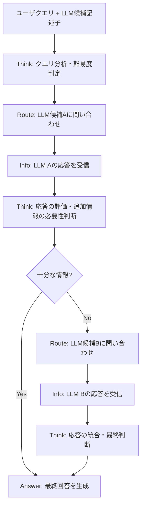

## 論文概要（Abstract）

本記事は [https://arxiv.org/abs/2506.09033](https://arxiv.org/abs/2506.09033) の解説記事です。

Router-R1（Zhang et al., 2025）は、LLM自体をルーターとして訓練し、複数のLLM候補に対するマルチラウンドルーティングと応答集約を強化学習（RL）で最適化する手法を提案している。従来のLLMルーティングは1対1のマッピング（1クエリ→1モデル）に限定されていたが、著者らはthinkアクション（内部推論）とrouteアクション（モデル呼び出し）をインターリーブすることで、タスク難易度に応じた動的なマルチモデル活用を実現している。7つのQAベンチマークでSOTA性能を達成し、未知のLLM候補に対しても再学習なしで汎化することが報告されている。

この記事は [Zenn記事: Portkey×LangChainでAIエージェントを本番運用する実践ガイド](https://zenn.dev/0h_n0/articles/7dcbfcb48d5672) の深掘りです。

## 情報源

- **arXiv ID**: 2506.09033
- **URL**: [arXiv:2506.09033](https://arxiv.org/abs/2506.09033)
- **著者**: Haozhen Zhang, Tao Feng, Jiaxuan You
- **所属**: University of Illinois at Urbana-Champaign（UIUC）
- **発表年**: 2025年6月（v3: 2025年10月）
- **分野**: cs.AI, cs.LG, cs.CL
- **コード**: [github.com/ulab-uiuc/Router-R1](https://github.com/ulab-uiuc/Router-R1)

## 背景と動機（Background & Motivation）

複数のLLMが利用可能な環境では、クエリごとに最適なモデルを選択する「LLMルーティング」が重要な課題となっている。GPT-4oのような高性能モデルは高コスト・高レイテンシである一方、小規模モデルは安価だが単純なタスクにしか対応できない。Portkey AI GatewayやLangChainのルーティング機能のように、プロダクション環境ではコストと品質のバランスが不可欠である。

しかし、従来のルーティング手法には著者らによれば以下の構造的限界がある。

1. **1対1マッピングの制約**: RouteLLM、FrugalGPTなどの既存手法は、1つのクエリを1つのモデルに割り当てる。複雑なマルチホップ質問では単一モデルの回答が不十分な場合があり、複数モデルの知識を統合する手段がない
2. **推論能力の欠如**: MLPやBERTベースの分類器ルーターは、クエリの難易度やモデルの特性を深く推論する能力を持たない。パターンマッチングに依存するため、分布外のクエリに対して脆弱である
3. **静的なモデルプール**: 新しいLLMが追加された場合に再学習が必要となり、急速に変化するLLM市場への対応が困難である

Router-R1は、LLMの推論能力をルーティング判断に直接活用することで、これらの限界を克服することを目指している。

## 主要な貢献（Key Contributions）

著者らは以下の貢献を報告している。

- **LLMベースルーター**: LLM自体をルーターとして使用し、推論能力を活かした動的ルーティングを実現。3Bパラメータの小規模モデル（Qwen2.5-3B, LLaMA-3.2-3B）で訓練可能
- **Think-Route アクション空間**: 内部推論（think）とモデル呼び出し（route）をインターリーブするアクション設計。最大4ラウンドのマルチステップルーティングを許容
- **3パート報酬関数**: フォーマット報酬、正答報酬、コスト報酬の階層的組み合わせにより、精度とコストのトレードオフを制御
- **LLM候補の記述子**: pricing、latency、example performanceなどの自然言語記述子でLLM候補を条件付けし、未知モデルへの汎化を実現
- **SOTA性能**: 7つのQAベンチマークで既存のルーティング手法を上回る性能を達成

## 技術的詳細（Technical Details）

### Think-Route アクション空間

Router-R1の中核は、thinkアクションとrouteアクションのインターリーブにある。ルーターLLMは以下のフローに従ってクエリを処理する。



具体的には、以下のXMLライクなタグでアクションが構造化される。

- `<think>...</think>`: 内部推論ブロック。クエリの難易度分析、どのLLM候補が適切かの判断、受信した応答の評価を行う
- `<search>LLM_name: query</search>`: ルーティングアクション。指定したLLM候補にクエリを送信する
- `<info>...</info>`: ルーティング先LLMからの応答が格納される（環境から返される）
- `<answer>...</answer>`: 最終回答ブロック。収集した情報を統合して回答を生成する

最大4回のルーティングステップが許容され、ルーターは必要に応じて複数のモデルに問い合わせることができる。単純なクエリでは1回のルーティングで済む一方、マルチホップ質問では2-3回のルーティングが行われることが実験で確認されている。

### 強化学習の報酬設計

著者らは3つの報酬を階層的に組み合わせた報酬関数を設計している。

**フォーマット報酬** $R_f$:

$$
R_f = \begin{cases} -1 & \text{タグ構造が不正な場合} \\ 0 & \text{タグ構造が正しい場合} \end{cases}
$$

全てのXMLタグが正しく開閉され、ネストが正しく、必須の `<think>` と `<answer>` ブロックが存在することを検証する。フォーマット違反時は他の報酬を無効化する階層構造を持つ。

**正答報酬（Outcome Reward）** $R_o$:

$$
R_o = \text{EM}(y_a, g_t)
$$

ここで $y_a$ は生成された回答、$g_t$ は正解（ground truth）である。Exact Match（EM）スコアで評価され、正答なら1、不正答なら0となる。

**コスト報酬** $R_c$:

$$
R_c \propto -m(P_{\text{LLM}}) \cdot T_{\text{out}}
$$

ここで $m(P_{\text{LLM}})$ はモデルのパラメータ数に基づくコスト係数、$T_{\text{out}}$ は出力トークン数である。大規模モデルの使用や長い応答にペナルティを課す。スライディングウィンドウ（1000サンプル）で正規化され、平方根変換と5th/95thパーセンタイルでクリッピングされる。

**総合報酬**:

$$
r_\phi(x, y) = R_f + (1 - \alpha) R_o + \alpha \cdot R_c
$$

$\alpha$ はコスト重視度を制御するハイパーパラメータである。$\alpha = 0$ で精度最優先、$\alpha$ を大きくするとコスト削減を優先する。メイン実験では $\alpha = 0.0$（精度最優先）で評価されている。

### PPOによる訓練

著者らはPPO（Proximal Policy Optimization）をveRLフレームワーク上で実装し、以下のKL正則化付き目的関数を最適化している。

$$
\max_\pi \mathbb{E}\left[r_\phi(x, y) - \beta \log \frac{\pi(y|x; P)}{\pi_{\text{ref}}(y|x; P)}\right]
$$

ここで $\pi$ は現在のポリシー、$\pi_{\text{ref}}$ は参照ポリシー（初期モデル）、$P$ はLLM候補の記述子セット、$\beta$ はKLペナルティ係数である。

**訓練設定**:
- ベースモデル: Qwen2.5-3B-Instruct / LLaMA-3.2-3B-Instruct
- 訓練データ: NQ（7K）+ HotpotQA（7K）= 14Kサンプル
- バッチサイズ: 64
- 最大ステップ: 225
- バッチバジェット: 200Kトークン

### LLM候補の記述子

各LLM候補は自然言語の記述子で条件付けされる。記述子にはパラメータ数、タスク特化領域、多言語対応、コンテキストウィンドウ長、API料金ティアなどの情報が含まれる。これらの記述子はNVIDIAモデルカードからGPT-4oで要約・生成されている。

**ルーティングプール**（6モデル）:

| モデル | パラメータ数 | 特徴 |
|--------|------------|------|
| Qwen2.5-7B-Instruct | 7B | 多言語・コーディング |
| LLaMA-3.1-8B-Instruct | 8B | 汎用・多言語 |
| LLaMA-3.1-70B-Instruct | 70B | 高性能・大規模 |
| Mistral-7B-Instruct | 7B | 効率的推論 |
| Mixtral-8x22B-Instruct | 8x22B | MoE・高スループット |
| Gemma-2-27B-Instruct | 27B | Google製・高品質 |

記述子による条件付けの利点は、新しいLLM候補を追加する際に記述子を追加するだけで済み、ルーターモデルの再学習が不要な点にある。

### マルチラウンドルーティングアルゴリズム

```python
from dataclasses import dataclass


@dataclass
class LLMCandidate:
    """LLM候補の記述子"""
    name: str
    description: str  # pricing, latency, performance等の自然言語記述


def multi_round_routing(
    query: str,
    candidates: list[LLMCandidate],
    router_llm: object,
    max_rounds: int = 4,
) -> str:
    """Router-R1のマルチラウンドルーティング（概念実装）

    Args:
        query: ユーザクエリ
        candidates: LLM候補のリスト（記述子付き）
        router_llm: 訓練済みルーターLLM
        max_rounds: 最大ルーティングラウンド数

    Returns:
        最終回答文字列
    """
    # LLM候補の記述子をプロンプトに含める
    candidate_descriptions = "\n".join(
        f"- {c.name}: {c.description}" for c in candidates
    )
    context = f"Query: {query}\nAvailable LLMs:\n{candidate_descriptions}\n"
    collected_responses: list[dict[str, str]] = []

    for round_idx in range(max_rounds):
        # Think: ルーターが内部推論を実行
        router_output = router_llm.generate(context)

        if "<answer>" in router_output:
            # 最終回答が生成された場合、ルーティング終了
            answer = extract_tag(router_output, "answer")
            return answer

        if "<search>" in router_output:
            # Route: 指定されたLLM候補にクエリを送信
            target_llm, sub_query = parse_search_tag(router_output)
            response = call_llm(target_llm, sub_query)
            collected_responses.append({
                "model": target_llm,
                "response": response,
            })
            # 応答をコンテキストに追加
            context += f"\n<info>{response}</info>\n"

    # 最大ラウンド到達時はフォールバック
    return aggregate_responses(collected_responses)
```

## 実装のポイント（Implementation）

著者らの報告に基づく実装上の注意点を以下にまとめる。

**フォーマット報酬の階層化**: フォーマット違反が発生した場合、正答報酬・コスト報酬を一切付与しない設計となっている。これにより訓練初期にフォーマットの正確性が急速に学習され、100ステップ以内にフォーマットエラーがほぼ解消されると報告されている。

**コスト正規化**: コスト報酬はスライディングウィンドウ（直近1000サンプル）内で正規化される。平方根変換を適用した上で5th/95thパーセンタイルでクリッピングし、外れ値の影響を抑制している。ただし、著者らはマルチタスク訓練では異なるドメイン間でコストスケールが不均一になる可能性を制約として指摘している。

**記述子の自動生成**: LLM候補の記述子はNVIDIAモデルカードからGPT-4oで要約・生成されている。手動での記述子作成は不要であり、新しいモデルのリリース時にもモデルカードから自動的に記述子を生成できる。

**訓練の収束**: 報酬の増加とエントロピーの減少が100ステップ以内に安定化すると報告されている。バッチサイズ64、最大225ステップという比較的小規模な訓練で十分な性能が得られる点は実用上の利点である。

**APIコール数の適応**: 実験の分析から、マルチホップQAタスク（HotpotQA, 2WikiMultiHopQA等）では平均2.5-3.0回のAPIコールが行われる一方、一般的なQAタスク（NQ, TriviaQA等）では1.5-2.0回に留まると報告されている。ルーターがタスク難易度を適切に判断し、必要に応じてマルチラウンドルーティングを活用していることが示唆される。

## Production Deployment Guide

Router-R1のマルチLLMルーティングパターンをAWS上で実装する場合の構成ガイドを示す。LLMルーターを中心としたマルチモデルオーケストレーション基盤をBedrock + ECS/Lambdaの組み合わせで構築する。以下のコスト試算は2026年4月時点のAWS ap-northeast-1（東京）リージョン料金に基づく概算値であり、実際のコストはトラフィックパターン、リージョン、バースト使用量により変動する。最新料金はAWS料金計算ツール（AWS Pricing Calculator）で確認を推奨する。

### AWS実装パターン（マルチLLMルーター基盤）

トラフィック量別の推奨構成を以下に示す。

| 構成 | トラフィック | アーキテクチャ | 月額概算 |
|------|-------------|---------------|---------|
| Small | ~100 req/日 | Lambda + Bedrock + DynamoDB | $80-200 |
| Medium | ~1,000 req/日 | ECS Fargate + Bedrock + ElastiCache | $500-1,200 |
| Large | 10,000+ req/日 | EKS + SageMaker Endpoint + Bedrock | $3,000-8,000 |

**Small構成（~100 req/日）**:
- Lambda（512MB, 60秒タイムアウト）: ~$10/月（マルチラウンドルーティングは処理時間が長い）
- Bedrock Claude Sonnet（ルーター推論）: ~$20-50/月
- Bedrock Haiku/Mistral（ルーティング先候補）: ~$15-40/月
- DynamoDB On-Demand（ルーティング履歴・記述子格納）: ~$5/月
- CloudWatch Logs: ~$5/月
- 合計: $80-200/月

**Medium構成（~1,000 req/日）**: ECS Fargate 1 vCPU x 2タスク + Bedrock（複数モデル）+ ElastiCache（記述子・応答キャッシュ）+ ALBで$500-1,200/月。キャッシュにより同一クエリパターンのルーティング結果を再利用できる。

**Large構成（10,000+ req/日）**:
- EKS コントロールプレーン: $73/月
- SageMaker Endpoint（ルーターモデル Qwen2.5-3B）: ~$300-600/月（ml.g5.xlarge）
- Bedrock 複数モデル: ~$1,500-4,000/月
- Karpenterによる自動スケーリング: Spot優先でコスト最適化
- 合計: $3,000-8,000/月

**コスト削減テクニック**: Spot Instances（最大90%削減）、SageMaker Savings Plans（最大64%削減）、Bedrock Batch API（50%削減）、Prompt Caching（30-90%削減）を組み合わせる。Router-R1のコスト報酬機能自体がルーティングコストを最適化するため、高性能モデルの不必要な呼び出しを自動的に抑制する。

### Terraformインフラコード

**Small構成（Serverless）**: Lambda + Bedrock + DynamoDB

```hcl
# Small構成: マルチLLMルーター（Serverless）
# Lambda → Bedrock（複数モデル）+ DynamoDB（ルーティング履歴）

resource "aws_iam_role" "router_r1_lambda" {
  name = "router-r1-lambda-role"
  assume_role_policy = jsonencode({
    Version = "2012-10-17"
    Statement = [{
      Action    = "sts:AssumeRole"
      Effect    = "Allow"
      Principal = { Service = "lambda.amazonaws.com" }
    }]
  })
}

resource "aws_iam_role_policy" "router_r1_policy" {
  name = "router-r1-policy"
  role = aws_iam_role.router_r1_lambda.id
  policy = jsonencode({
    Version = "2012-10-17"
    Statement = [
      {
        Effect   = "Allow"
        Action   = ["bedrock:InvokeModel"]
        Resource = [
          "arn:aws:bedrock:ap-northeast-1::foundation-model/anthropic.claude-*",
          "arn:aws:bedrock:ap-northeast-1::foundation-model/mistral.*",
          "arn:aws:bedrock:ap-northeast-1::foundation-model/meta.llama*"
        ]
      },
      {
        Effect = "Allow"
        Action = ["dynamodb:PutItem", "dynamodb:GetItem", "dynamodb:Query"]
        Resource = aws_dynamodb_table.routing_history.arn
      }
    ]
  })
}

resource "aws_dynamodb_table" "routing_history" {
  name         = "router-r1-history"
  billing_mode = "PAY_PER_REQUEST"
  hash_key     = "query_hash"
  range_key    = "timestamp"
  attribute { name = "query_hash"; type = "S" }
  attribute { name = "timestamp";  type = "N" }
  server_side_encryption { enabled = true }

  ttl {
    attribute_name = "expire_at"
    enabled        = true
  }
}

resource "aws_lambda_function" "router_r1" {
  function_name = "router-r1-inference"
  role          = aws_iam_role.router_r1_lambda.arn
  runtime       = "python3.12"
  handler       = "handler.main"
  timeout       = 60  # マルチラウンドのため長め
  memory_size   = 512
  filename      = "lambda.zip"
  tracing_config { mode = "Active" }
  environment {
    variables = {
      DYNAMODB_TABLE    = aws_dynamodb_table.routing_history.name
      ROUTER_MODEL_ID   = "anthropic.claude-sonnet-4-20250514"
      MAX_ROUTING_ROUNDS = "4"
      COST_ALPHA         = "0.0"
    }
  }
}
```

**Large構成（Container + SageMaker）**: EKS + SageMaker Endpoint + Bedrock

```hcl
# Large構成: ルーターモデルをSageMakerにデプロイ
# SageMaker（Router-R1 Qwen2.5-3B）→ Bedrock（候補LLM群）

module "eks" {
  source          = "terraform-aws-modules/eks/aws"
  version         = "~> 20.24"
  cluster_name    = "router-r1-cluster"
  cluster_version = "1.31"
  vpc_id          = module.vpc.vpc_id
  subnet_ids      = module.vpc.private_subnets
  cluster_endpoint_public_access = false
}

resource "aws_sagemaker_model" "router_r1" {
  name               = "router-r1-qwen25-3b"
  execution_role_arn = aws_iam_role.sagemaker_role.arn
  primary_container {
    image          = "763104351884.dkr.ecr.ap-northeast-1.amazonaws.com/huggingface-pytorch-tgi-inference:2.3.0-tgi2.3.0-gpu-py311-cu121-ubuntu22.04"
    model_data_url = "s3://${aws_s3_bucket.models.id}/router-r1-qwen25-3b/model.tar.gz"
    environment = {
      HF_MODEL_ID       = "ulab-uiuc/Router-R1-Qwen"
      SM_NUM_GPUS        = "1"
      MAX_INPUT_TOKENS   = "4096"
      MAX_TOTAL_TOKENS   = "8192"
    }
  }
}

resource "aws_sagemaker_endpoint_configuration" "router_r1" {
  name = "router-r1-endpoint-config"
  production_variants {
    variant_name           = "primary"
    model_name             = aws_sagemaker_model.router_r1.name
    instance_type          = "ml.g5.xlarge"
    initial_instance_count = 1
  }
}

# Karpenter NodePool（Spot優先）
resource "kubectl_manifest" "karpenter_router" {
  yaml_body = yamlencode({
    apiVersion = "karpenter.sh/v1"
    kind       = "NodePool"
    metadata   = { name = "router-r1-workers" }
    spec = {
      template.spec.requirements = [
        { key = "karpenter.sh/capacity-type", operator = "In",
          values = ["spot", "on-demand"] },
        { key = "node.kubernetes.io/instance-type", operator = "In",
          values = ["m6i.xlarge", "m6i.2xlarge", "c6i.xlarge"] }
      ]
      disruption = {
        consolidationPolicy = "WhenEmptyOrUnderutilized"
        consolidateAfter    = "30s"
      }
    }
  })
}

# 予算アラート
resource "aws_budgets_budget" "router_r1" {
  name         = "router-r1-monthly"
  budget_type  = "COST"
  limit_amount = "8000"
  limit_unit   = "USD"
  time_unit    = "MONTHLY"
  notification {
    comparison_operator        = "GREATER_THAN"
    threshold                  = 80
    threshold_type             = "PERCENTAGE"
    notification_type          = "ACTUAL"
    subscriber_email_addresses = ["alerts@example.com"]
  }
}
```

### 運用・監視設定

**CloudWatch Logs Insights クエリ**: ルーティングラウンド数とモデル選択傾向の分析に使用する。

```
# ルーティングラウンド数の分布
fields @timestamp, routing_rounds, selected_models
| filter @message like /routing_complete/
| stats count(*) as cnt by routing_rounds
| sort routing_rounds asc
```

**ルーティング監視アラーム（Python）**:

```python
import boto3


def create_routing_latency_alarm(sns_topic_arn: str) -> dict:
    """マルチラウンドルーティングのP95レイテンシ監視（10秒超過で通知）"""
    return boto3.client("cloudwatch", region_name="ap-northeast-1").put_metric_alarm(
        AlarmName="router-r1-p95-latency",
        MetricName="RoutingLatency",
        Namespace="RouterR1/Custom",
        ExtendedStatistic="p95",
        Period=300,
        EvaluationPeriods=3,
        Threshold=10_000,  # 10秒（ミリ秒）
        ComparisonOperator="GreaterThanThreshold",
        AlarmActions=[sns_topic_arn],
        TreatMissingData="notBreaching",
    )
```

**ルーティングメトリクス送信（Python）**:

```python
import time
from typing import Any

import boto3


cloudwatch = boto3.client("cloudwatch", region_name="ap-northeast-1")


def publish_routing_metrics(
    routing_rounds: int,
    selected_models: list[str],
    total_cost: float,
    latency_ms: float,
) -> None:
    """ルーティング結果のカスタムメトリクスをCloudWatchに送信する"""
    cloudwatch.put_metric_data(
        Namespace="RouterR1/Custom",
        MetricData=[
            {
                "MetricName": "RoutingRounds",
                "Value": routing_rounds,
                "Unit": "Count",
            },
            {
                "MetricName": "RoutingLatency",
                "Value": latency_ms,
                "Unit": "Milliseconds",
            },
            {
                "MetricName": "RoutingCost",
                "Value": total_cost,
                "Unit": "None",
            },
            {
                "MetricName": "ModelsUsed",
                "Value": len(selected_models),
                "Unit": "Count",
            },
        ],
    )
```

**Cost Explorer自動レポート（Python）**:

```python
import boto3
from datetime import datetime, timedelta


ce = boto3.client("ce", region_name="us-east-1")
sns = boto3.client("sns", region_name="ap-northeast-1")


def daily_routing_cost_report(sns_topic_arn: str) -> None:
    """日次ルーティングコストレポートを取得し$200/日超過時にSNS通知する"""
    today = datetime.utcnow().strftime("%Y-%m-%d")
    yesterday = (datetime.utcnow() - timedelta(days=1)).strftime("%Y-%m-%d")
    response = ce.get_cost_and_usage(
        TimePeriod={"Start": yesterday, "End": today},
        Granularity="DAILY",
        Metrics=["UnblendedCost"],
        Filter={"Tags": {"Key": "Project", "Values": ["router-r1"]}},
        GroupBy=[{"Type": "SERVICE", "Key": "SERVICE"}],
    )
    total = sum(
        float(g["Metrics"]["UnblendedCost"]["Amount"])
        for g in response["ResultsByTime"][0]["Groups"]
    )
    if total > 200.0:
        sns.publish(
            TopicArn=sns_topic_arn,
            Subject=f"[ALERT] Router-R1 daily cost ${total:.2f} exceeds $200",
            Message=f"Total: ${total:.2f}\nModels billed separately via Bedrock.",
        )
```

### コスト最適化チェックリスト

**アーキテクチャ選択**: トラフィック量でServerless/Hybrid/Containerを判断

**リソース最適化**:
- [ ] SageMaker Savings Plans（最大64%削減、ルーターモデル用）
- [ ] Spot Instances優先（EKSワーカーノード: On-Demand比最大90%削減）
- [ ] Lambda Power Tuningでメモリ・タイムアウト最適化
- [ ] Karpenterでアイドル時自動スケールダウン

**LLMコスト削減**:
- [ ] Router-R1のコスト報酬（$\alpha$）チューニングで高コストモデルの呼び出し頻度を制御
- [ ] Bedrock Batch API（リアルタイム不要な推論で50%削減）
- [ ] Prompt Caching（LLM候補記述子のキャッシュで30-90%削減）
- [ ] ルーティング結果キャッシュ（ElastiCache: 同一クエリパターンの再ルーティング回避）
- [ ] max_tokens設定でルーティング先モデルの無駄な生成抑制

**監視・アラート**:
- [ ] AWS Budgets（80%/100%閾値）
- [ ] ルーティングラウンド数の異常検知（平均ラウンド数の急増）
- [ ] モデル別コスト比率の監視（特定モデルへの偏り検出）
- [ ] Cost Anomaly Detection有効化
- [ ] 日次コストレポート自動取得

**リソース管理**:
- [ ] `Project=router-r1` タグ戦略
- [ ] SageMaker Endpoint自動スケーリング（DesiredInstanceCount動的調整）
- [ ] DynamoDB TTLでルーティング履歴の自動削除
- [ ] S3/ECRライフサイクルポリシー（90日）
- [ ] 開発環境夜間停止（EventBridge + SageMaker Endpoint削除/再作成）
- [ ] VPCエンドポイントでNAT Gateway回避

## 実験結果（Results）

著者らは7つのQAベンチマークで評価を行い、以下の結果を報告している。NQとHotpotQAは訓練データに含まれるベンチマーク（†印）であり、残り5つは未見のベンチマークである。

| ベンチマーク | Router-R1-Qwen | Router-R1-Llama | 最良ベースライン | ベースライン手法 |
|-------------|---------------|-----------------|----------------|---------------|
| NQ† | 0.388 | 0.384 | 0.300 | Prompt LLM |
| HotpotQA† | 0.352 | 0.338 | 0.268 | Prompt LLM |
| TriviaQA | 0.706 | 0.696 | 0.592 | RouterDC |
| PopQA | 0.384 | 0.376 | 0.354 | Largest LLM |
| 2WikiMultiHopQA | 0.434 | 0.428 | 0.410 | RouterDC |
| Musique | 0.138 | 0.132 | 0.080 | RouterDC |
| BamboogleQA | 0.512 | 0.500 | 0.504 | RouterDC |

Router-R1-Qwenの平均EMスコアは0.416であり、全ベースラインを上回っている。特にTriviaQAで+0.114、NQで+0.088、HotpotQAで+0.084の改善が顕著である。

**ベースライン比較**: 著者らは以下のカテゴリのベースラインと比較している。
- **直接推論**: Direct Inference, CoT（Chain-of-Thought）
- **分類器ルーター**: KNN Router, MLP Router, BERT Router
- **学習ベースルーター**: RouterDC, GraphRouter, RouteLLM
- **LLMベースルーター**: Prompt LLM（プロンプトのみ、学習なし）, FrugalGPT

著者らは「Router-R1はマルチラウンドルーティングとインターリーブ推論の組み合わせにより、全てのLLMルーターベースラインを大幅に上回っている」と報告している。

**コストと精度のトレードオフ**: $\alpha$ パラメータの効果について、$\alpha = 0.0$ で最高精度（平均EM 0.416）、$\alpha = 0.6$ でバランスの取れたパフォーマンス、$\alpha = 0.9$ で最小コスト（約5-6コスト単位）が得られると報告されている。

**未知LLMへの汎化**: Palmyra-Creative-122BとLLaMA3-ChatQA-1.5-8Bを再学習なしで追加した場合、平均EMが0.458から0.463に改善したと報告されている。ルーターが記述子に基づいて未知モデルの能力を推定し、適切にルーティングできることが示唆されている。

## 実運用への応用（Practical Applications）

Zenn記事で扱ったPortkey AI Gateway + LangChainによるマルチLLMオーケストレーションでは、`strategy.mode: "loadbalance"` や `strategy.mode: "fallback"` といった静的なルーティング戦略が主流である。Router-R1の知見は、このようなプロダクション環境に以下の形で応用できる。

**動的ルーティングへの拡張**: Portkeyの現行ルーティングはラウンドロビンやフォールバックといった静的戦略に基づく。Router-R1のように、クエリの内容・難易度に応じて動的にモデルを選択する機能が将来的に統合される可能性がある。PortkeyのConditional Routingは現在ユーザ定義ルールに基づくが、LLMベースの推論を組み込むことでより高度な判断が可能になる。

**コスト最適化**: Router-R1のコスト報酬メカニズムは、Portkeyのコスト管理機能と補完的である。ルーターレベルでのコスト最適化（高性能モデルの不必要な呼び出しを抑制）とゲートウェイレベルでのコスト管理（使用量モニタリング、バジェット制御）を組み合わせることで、多層的なコスト最適化が実現できる。

**マルチモデル応答集約**: Router-R1の最大の差別化点であるマルチラウンドルーティングは、複雑なクエリに対して複数モデルの回答を統合する。LangChainの `EnsembleRetriever` やPortkeyの複数プロバイダ管理と組み合わせることで、回答品質の向上が期待できる。

## 関連研究（Related Work）

- **RouteLLM**（Ong et al., 2024）: LLMルーティングの先駆的研究。強いモデルと弱いモデルの2者間ルーティングに焦点。Router-R1との主な違いは1対1マッピングに限定される点にある
- **FrugalGPT**（Chen et al., 2023）: カスケード方式でコスト削減を図る手法。安価なモデルから順に試行し、信頼度が低い場合に上位モデルにエスカレーション。Router-R1はカスケードではなく自由なマルチラウンドルーティングを採用
- **Hybrid LLM**（Ding et al., 2024）: 小規模・大規模モデル間のルーティング。Router-R1が6モデル以上の候補プールを扱うのに対し、2モデル間の選択に限定される
- **RouterDC**（Chen et al., 2024）: 訓練ベースの分類器ルーター。Router-R1の実験で最も競合するベースラインであったが、マルチラウンドルーティングと推論能力の欠如により劣後すると報告されている

## まとめと今後の展望

Router-R1は、LLM自体をルーターとして訓練し、think-routeアクションのインターリーブによるマルチラウンドルーティングを強化学習で最適化する手法を提案している。3パート報酬関数（フォーマット・正答・コスト）と自然言語記述子による条件付けにより、7つのQAベンチマークでSOTA性能を達成し、未知LLMへの汎化も確認されている。

著者らが指摘する制約として、マルチタスク訓練でのコストスケールの不均一性、QAタスクに限定された評価（コード生成やクリエイティブタスクは未評価）が挙げられる。今後の研究方向として、タスクレベルのコスト正規化、より多様なタスクでの評価、ルーティングプール規模の拡大が期待される。Portkey AI Gatewayのようなプロダクション環境への統合においても、クエリ難易度に応じた動的ルーティングの実現が今後の課題となる。

## 参考文献

- **arXiv（本論文）**: [https://arxiv.org/abs/2506.09033](https://arxiv.org/abs/2506.09033)
- **GitHub**: [https://github.com/ulab-uiuc/Router-R1](https://github.com/ulab-uiuc/Router-R1)
- **RouteLLM**: [https://arxiv.org/abs/2406.18665](https://arxiv.org/abs/2406.18665)
- **FrugalGPT**: [https://arxiv.org/abs/2305.05176](https://arxiv.org/abs/2305.05176)
- **RouterDC**: [https://arxiv.org/abs/2410.03373](https://arxiv.org/abs/2410.03373)
- **Related Zenn article**: [https://zenn.dev/0h_n0/articles/7dcbfcb48d5672](https://zenn.dev/0h_n0/articles/7dcbfcb48d5672)
