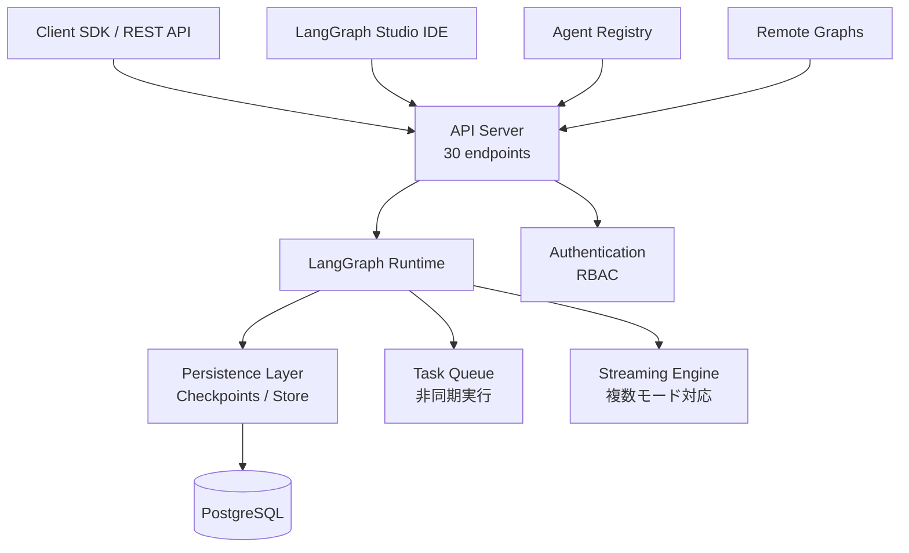

# LangGraph Platform GA解説: ステートフルAIエージェントの本番デプロイ基盤

## ブログ概要（Summary）

本記事は [https://www.langchain.com/blog/langgraph-platform-ga](https://www.langchain.com/blog/langgraph-platform-ga) の解説記事です。

LangChainが2025年5月に発表した **LangGraph Platform** のGeneral Availability（GA）リリースは、ステートフルAIエージェントの本番運用に必要なインフラ基盤を包括的に提供するプラットフォームです。ベータ期間中に約400社が利用し、30のAPIエンドポイント、3つのデプロイオプション（Cloud / Hybrid / Self-Hosted）、永続化レイヤー、水平スケーリング、Agent Registryなどの機能を備えています。LangChain公式ブログによると、2025年10月にLangSmith Deploymentへリブランドされる予定であり、LangSmith（評価・オブザーバビリティ）との統合がさらに強化されます。

この記事は [Zenn記事: Portkey×LangChainでAIエージェントを本番運用する実践ガイド](https://zenn.dev/0h_n0/articles/7dcbfcb48d5672) の深掘りです。

---

## 情報源

- **種別**: 企業テックブログ
- **URL**: [https://www.langchain.com/blog/langgraph-platform-ga](https://www.langchain.com/blog/langgraph-platform-ga)
- **組織**: LangChain
- **発表日**: 2025年5月14日

---

## 技術的背景（Technical Background）

AIエージェントを本番環境で運用する際には、ステート管理、長時間実行タスクの耐障害性、水平スケーリング、Human-in-the-Loopワークフローの実現という複数の課題が同時に発生します。LangGraphフレームワーク自体はエージェントのロジックをグラフ構造で定義する開発フレームワークですが、開発したエージェントを本番環境にデプロイし、運用するためのインフラ基盤は別途必要です。

LangChain公式ブログによると、LangGraph Platformはこの「開発から本番」のギャップを埋めるために設計されました。具体的には、チェックポイントによるステート永続化、非同期タスクキュー、ストリーミング応答、マルチテナントアクセス制御といったプロダクション要件をプラットフォームレベルで提供します。Zenn記事で解説したPortkey×LangChainの構成は、LLMプロバイダのゲートウェイ層での最適化（フォールバック、キャッシュ、レート制限）に焦点を当てていますが、LangGraph Platformはその下位層であるエージェントランタイムとデプロイインフラを担当する位置づけです。

---

## 実装アーキテクチャ（Architecture）

### LangGraph Platformの全体構成

LangGraph Platformは、APIサーバー、LangGraphランタイム、永続化レイヤーの3層で構成されています。



### 3つのデプロイモデル

LangChain公式ブログによると、LangGraph Platformは利用者のセキュリティ・運用要件に応じて3つのデプロイモデルを提供しています。

| デプロイモデル | コントロールプレーン | データプレーン | 対象プラン | ユースケース |
|---------------|---------------------|---------------|-----------|-------------|
| **Cloud (SaaS)** | LangChain管理 | LangChain管理 | Plus / Enterprise | 最速デプロイ、プロトタイプ |
| **Hybrid** | LangChain管理 | 顧客VPC内 | Enterprise | データ主権、規制対応 |
| **Self-Hosted** | 顧客管理 | 顧客管理 | Enterprise / Developer | 完全制御、オンプレミス |

**Developer Tier**（無料）は Self-Hosted モデルの一部であり、月間100,000ノード実行までの制限付きで利用可能です。ホビーユーザーや検証目的での利用を想定しています。

### 永続化レイヤーの設計

LangGraph Platformの永続化レイヤーは、Threads（会話スレッド）、Checkpoints（実行状態のスナップショット）、Store（長期記憶）の3つの概念で構成されています。

- **Threads API**: 会話の文脈を管理するスレッド単位のステート管理。各スレッドは一連のチェックポイントを保持し、任意の時点への巻き戻し（time-travel debugging）が可能
- **Checkpoints**: グラフ実行の各ノード通過時にステートを自動保存。障害発生時にはチェックポイントから再開でき、長時間実行エージェントの耐障害性を確保
- **Store API**: スレッドを跨いだ長期記憶の永続化。ユーザーの好みや過去のインタラクション履歴を保持し、パーソナライズされたエージェント応答を実現

### ストリーミング対応

LangGraph Platformは複数のストリーミングモードを提供しています。LLMのトークン生成をリアルタイムにクライアントへ配信するだけでなく、グラフの各ノード実行状態の更新もストリーミングで取得できます。これにより、クライアント側でエージェントの思考過程を可視化するUIを構築できます。

### Task Queues

非同期タスクキューにより、長時間実行タスク（数分〜数時間）をバックグラウンドで処理できます。クライアントはタスクを投入した後、ポーリングまたはWebhookで完了通知を受け取る設計です。Double-texting（ユーザーが待機中に追加入力を送信するケース）にも対応しており、既存のRunをキャンセルして新しいRunを開始する、またはキューに追加するなどのポリシーを設定可能です。

---

## Production Deployment Guide

LangGraph Platformの Self-Hosted デプロイをAWS上で構築する際の実装パターンを示します。

### AWS実装パターン（コスト最適化重視）

**コスト試算の注意事項**: 以下は2026年4月時点のAWS ap-northeast-1（東京）リージョン料金に基づく概算値です。実際のコストはトラフィックパターン、リージョン、バースト使用量により変動します。最新料金は [AWS Pricing Calculator](https://calculator.aws/) で確認してください。

#### Small構成（~100 req/日）: ECS Fargate + RDS

| サービス | 用途 | 月額概算 |
|----------|------|----------|
| ECS Fargate (0.25vCPU, 0.5GB x 1) | LangGraph Server | $10-15 |
| RDS PostgreSQL (db.t4g.micro) | Checkpoints/Store永続化 | $15-25 |
| ALB | ロードバランサ | $20-25 |
| Bedrock (Claude 3.5 Sonnet) | LLM推論 | $30-80 |
| CloudWatch | ログ・メトリクス | $5-10 |
| **合計** | | **$80-155/月** |

LangGraph ServerをFargateタスクとして起動し、PostgreSQLにCheckpointsとStoreデータを永続化。ALBでHTTPS終端とヘルスチェックを行います。

#### Medium構成（~1,000 req/日）: ECS Fargate + Aurora Serverless

ECS Fargate (0.5vCPU, 1GB x 2タスク) でLangGraph Server稼働、Aurora Serverless v2 (0.5-4 ACU) でデータベース自動スケーリング。Redis (ElastiCache t4g.micro) をタスクキューのブローカーとして使用。**月額概算: $250-550**。

#### Large構成（10,000+ req/日）: EKS + Aurora + ElastiCache

EKS ($73) + EC2 Spot m6i.xlarge 3-8台 ($200-600) + Aurora Serverless v2 2-16 ACU ($150-400) + ElastiCache r7g.large ($80-120) + Bedrock ($1,200-3,000) + ALB/WAF ($50-80) + 監視 ($30-60)。**月額概算: $1,783-4,333**。

**コスト削減テクニック**: Spot Instances（最大90%削減）、Bedrock Batch API（50%割引）、Prompt Caching（30-90%トークンコスト削減）、Reserved Instances（最大72%削減）を組み合わせて適用します。

### Terraformインフラコード

#### Small構成（ECS Fargate + RDS）

```hcl
# Small構成: LangGraph Platform Self-Hosted on ECS Fargate + RDS
# ステートフルエージェントのServerless実装
terraform {
  required_version = ">= 1.8"
  required_providers {
    aws = { source = "hashicorp/aws", version = "~> 5.80" }
  }
}

provider "aws" { region = "ap-northeast-1" }

# IAM: ECSタスク用ロール（最小権限: Bedrock + RDS + Logs）
resource "aws_iam_role" "langgraph_task" {
  name               = "langgraph-server-task-role"
  assume_role_policy = jsonencode({
    Version = "2012-10-17"
    Statement = [{ Action = "sts:AssumeRole", Effect = "Allow",
                    Principal = { Service = "ecs-tasks.amazonaws.com" } }]
  })
}

resource "aws_iam_role_policy" "langgraph_policy" {
  name = "langgraph-server-policy"
  role = aws_iam_role.langgraph_task.id
  policy = jsonencode({
    Version = "2012-10-17"
    Statement = [
      { Effect = "Allow", Action = ["bedrock:InvokeModel", "bedrock:InvokeModelWithResponseStream"],
        Resource = "arn:aws:bedrock:ap-northeast-1::foundation-model/anthropic.claude-*" },
      { Effect = "Allow", Action = ["secretsmanager:GetSecretValue"],
        Resource = aws_secretsmanager_secret.db_credentials.arn },
      { Effect = "Allow", Action = ["logs:CreateLogGroup","logs:CreateLogStream","logs:PutLogEvents"],
        Resource = "arn:aws:logs:ap-northeast-1:*:*" }
    ]
  })
}

# RDS PostgreSQL: Checkpoints/Store永続化 + KMS暗号化
resource "aws_db_instance" "langgraph_db" {
  identifier           = "langgraph-checkpoints"
  engine               = "postgres"
  engine_version       = "16.4"
  instance_class       = "db.t4g.micro"
  allocated_storage    = 20
  db_name              = "langgraph"
  username             = "langgraph_admin"
  manage_master_user_password = true
  storage_encrypted    = true
  skip_final_snapshot  = false
  final_snapshot_identifier = "langgraph-final"
  backup_retention_period = 7
  vpc_security_group_ids = [aws_security_group.db.id]
  db_subnet_group_name = aws_db_subnet_group.main.name
}

# Secrets Manager: DB接続情報
resource "aws_secretsmanager_secret" "db_credentials" {
  name = "langgraph/db-credentials"
}

# ECS Fargate: LangGraph Server
resource "aws_ecs_task_definition" "langgraph" {
  family                   = "langgraph-server"
  network_mode             = "awsvpc"
  requires_compatibilities = ["FARGATE"]
  cpu                      = "256"   # 0.25 vCPU
  memory                   = "512"   # 0.5 GB
  task_role_arn            = aws_iam_role.langgraph_task.arn
  execution_role_arn       = aws_iam_role.ecs_execution.arn

  container_definitions = jsonencode([{
    name  = "langgraph-server"
    image = "langchain/langgraph-api:latest"
    portMappings = [{ containerPort = 8000, protocol = "tcp" }]
    environment = [
      { name = "LANGGRAPH_POSTGRES_URI", value = "postgresql://${aws_db_instance.langgraph_db.endpoint}/langgraph" },
      { name = "LANGSMITH_API_KEY_SECRET_ARN", value = aws_secretsmanager_secret.db_credentials.arn },
      { name = "BEDROCK_MODEL_ID", value = "anthropic.claude-3-5-sonnet-20241022-v2:0" }
    ]
    logConfiguration = {
      logDriver = "awslogs"
      options   = { "awslogs-group" = "/ecs/langgraph", "awslogs-region" = "ap-northeast-1", "awslogs-stream-prefix" = "server" }
    }
    healthCheck = {
      command = ["CMD-SHELL", "curl -f http://localhost:8000/ok || exit 1"]
      interval = 30, timeout = 5, retries = 3
    }
  }])
}

resource "aws_ecs_service" "langgraph" {
  name            = "langgraph-server"
  cluster         = aws_ecs_cluster.main.id
  task_definition = aws_ecs_task_definition.langgraph.arn
  desired_count   = 1
  launch_type     = "FARGATE"

  network_configuration {
    subnets         = var.private_subnet_ids
    security_groups = [aws_security_group.langgraph.id]
  }

  load_balancer {
    target_group_arn = aws_lb_target_group.langgraph.arn
    container_name   = "langgraph-server"
    container_port   = 8000
  }
}
```

#### Large構成（EKS + Aurora）

```hcl
# Large構成: LangGraph Platform on EKS + Aurora + ElastiCache
module "eks" {
  source  = "terraform-aws-modules/eks/aws"; version = "~> 20.30"
  cluster_name = "langgraph-cluster"; cluster_version = "1.31"
  vpc_id = module.vpc.vpc_id; subnet_ids = module.vpc.private_subnets
  cluster_endpoint_public_access = false # セキュリティ: プライベートのみ
  enable_cluster_creator_admin_permissions = true
}

# Aurora Serverless v2: Checkpoints永続化（自動スケーリング）
module "aurora" {
  source  = "terraform-aws-modules/rds-aurora/aws"; version = "~> 9.0"
  name           = "langgraph-checkpoints"
  engine         = "aurora-postgresql"
  engine_version = "16.4"
  serverlessv2_scaling_configuration = {
    min_capacity = 0.5
    max_capacity = 16
  }
  instance_class = "db.serverless"
  instances      = { one = {}, two = {} } # Multi-AZ
  storage_encrypted = true
}

# Karpenter NodePool: Spot優先でコスト最大90%削減
resource "kubectl_manifest" "nodepool" {
  yaml_body = yamlencode({
    apiVersion = "karpenter.sh/v1"; kind = "NodePool"
    metadata = { name = "langgraph-workers" }
    spec = {
      template = { spec = { requirements = [
        { key = "karpenter.sh/capacity-type", operator = "In", values = ["spot","on-demand"] },
        { key = "node.kubernetes.io/instance-type", operator = "In",
          values = ["m6i.xlarge","m7i.xlarge","m6a.xlarge"] }
      ]}}
      limits = { cpu = "64", memory = "256Gi" }
      disruption = { consolidationPolicy = "WhenEmptyOrUnderutilized", consolidateAfter = "30s" }
    }
  })
}

# ElastiCache: Task Queueブローカー
resource "aws_elasticache_replication_group" "langgraph_queue" {
  replication_group_id = "langgraph-task-queue"
  description          = "LangGraph task queue broker"
  engine               = "redis"
  node_type            = "cache.r7g.large"
  num_cache_clusters   = 2
  at_rest_encryption_enabled = true
  transit_encryption_enabled = true
}

# AWS Budgets: 月次$5000超過で80%到達アラート
resource "aws_budgets_budget" "langgraph_monthly" {
  name = "langgraph-monthly-budget"; budget_type = "COST"
  limit_amount = "5000"; limit_unit = "USD"; time_unit = "MONTHLY"
  notification {
    comparison_operator = "GREATER_THAN"; threshold = 80
    threshold_type = "PERCENTAGE"; notification_type = "ACTUAL"
    subscriber_email_addresses = ["ops-team@example.com"]
  }
}
```

### 運用・監視設定

#### CloudWatch Logs Insights クエリ

LangGraph Serverのパフォーマンスとコストを分析するクエリを設定します。

```
# エージェント実行レイテンシ分析（ノード単位）
fields @timestamp, node_name, duration_ms
| filter @message like /node_complete/
| stats avg(duration_ms) as avg_ms, pct(duration_ms, 95) as p95_ms, pct(duration_ms, 99) as p99_ms by node_name
| sort p95_ms desc
```

```
# Checkpoint書き込み頻度とサイズ
fields @timestamp, checkpoint_size_bytes, thread_id
| filter @message like /checkpoint_write/
| stats count() as writes, avg(checkpoint_size_bytes) as avg_size by bin(1h)
```

#### CloudWatch アラーム・X-Ray設定

```python
import boto3
from aws_xray_sdk.core import xray_recorder, patch_all

patch_all()  # boto3自動計装

cloudwatch = boto3.client("cloudwatch", region_name="ap-northeast-1")


def create_langgraph_alarms(account_id: str) -> list[dict]:
    """LangGraph Platform運用に必要なCloudWatchアラームを作成する。

    Args:
        account_id: AWSアカウントID

    Returns:
        作成されたアラームのレスポンスリスト
    """
    alarms = []

    # Bedrockトークン使用量スパイク検知
    alarms.append(cloudwatch.put_metric_alarm(
        AlarmName="langgraph-bedrock-token-spike",
        MetricName="InputTokenCount", Namespace="AWS/Bedrock",
        Statistic="Sum", Period=3600, EvaluationPeriods=1,
        Threshold=100000, ComparisonOperator="GreaterThanThreshold",
        AlarmActions=[f"arn:aws:sns:ap-northeast-1:{account_id}:ops-alerts"],
    ))

    # ECSタスク異常停止検知
    alarms.append(cloudwatch.put_metric_alarm(
        AlarmName="langgraph-ecs-task-failures",
        MetricName="RunningTaskCount", Namespace="ECS/ContainerInsights",
        Statistic="Minimum", Period=300, EvaluationPeriods=2,
        Threshold=1, ComparisonOperator="LessThanThreshold",
        Dimensions=[{"Name": "ServiceName", "Value": "langgraph-server"}],
        AlarmActions=[f"arn:aws:sns:ap-northeast-1:{account_id}:ops-alerts"],
    ))

    return alarms


def trace_agent_execution(thread_id: str, node_name: str) -> None:
    """エージェント実行の各ノードをX-Rayサブセグメントとして記録する。

    Args:
        thread_id: LangGraphスレッドID
        node_name: 実行中のグラフノード名
    """
    subsegment = xray_recorder.begin_subsegment(f"langgraph-node-{node_name}")
    subsegment.put_annotation("thread_id", thread_id)
    subsegment.put_annotation("node_name", node_name)
```

#### Cost Explorer 自動レポート

Cost Explorer APIで日次のサービス別コストを取得し、`Project=langgraph-platform`タグでフィルタリングします。$100/日超過時にSNS通知を送信する設計とします。EventBridgeスケジュール（毎朝9:00 JST）でLambdaをトリガーし、自動化します。

### コスト最適化チェックリスト

**アーキテクチャ選択**:
- [ ] トラフィック量計測済み、Small/Medium/Large構成を選定
- [ ] 100 req/日以下ならFargate単体、1000以上ならEKS
- [ ] Spot + On-Demand混在比率をバーストパターンに基づき決定

**リソース最適化**:
- [ ] EC2/Fargate: Spot Instances優先（Karpenter capacity-type: spot先頭）
- [ ] Reserved Instances: 常時稼働分は1年コミットで最大72%削減
- [ ] Savings Plans: Compute Savings Plansで柔軟なコミットメント
- [ ] Aurora Serverless v2: 最小ACUを0.5に設定しアイドルコスト削減
- [ ] VPCエンドポイント活用でNAT Gateway通信コスト削減

**LLMコスト削減**:
- [ ] Bedrock Batch API: 非同期タスクは50%割引
- [ ] Prompt Caching: システムプロンプトキャッシュで30-90%削減
- [ ] モデル選択ロジック: 簡易タスクはHaiku、複雑はSonnet
- [ ] max_tokens制限: ノードごとに最小化

**監視・アラート**:
- [ ] AWS Budgets: 月次予算80%到達でメール通知
- [ ] CloudWatch アラーム: トークンスパイク・ECSタスク異常停止
- [ ] Cost Anomaly Detection: ML検知で異常支出自動検知
- [ ] Cost Explorer API + SNS日次レポート

**リソース管理**:
- [ ] Trusted Advisorで未使用リソース検出・削除
- [ ] `Project`/`Environment`タグ必須化
- [ ] RDSスナップショット・Checkpointデータのライフサイクルポリシー
- [ ] EventBridgeで開発環境夜間停止

---

## パフォーマンス最適化（Performance）

LangGraph Platformは水平スケーリングに対応しており、LangGraph Serverインスタンスを複数起動してトラフィックを分散できます。ステートレスなAPIサーバーとステートフルな永続化レイヤーが分離されているため、APIサーバー層のみを独立してスケールアウト可能です。

| 最適化手法 | 効果 | 適用シーン |
|-----------|------|-----------|
| 水平スケーリング（ECS/EKS AutoScaling） | スループット向上 | バーストトラフィック対応 |
| Task Queue非同期処理 | レスポンス時間短縮 | 長時間実行タスクのオフロード |
| ストリーミング応答 | 体感レイテンシ低減 | ユーザー向けチャットUI |
| Checkpoint間隔調整 | DB書き込み負荷低減 | 高頻度ノード実行グラフ |
| Portkey Gateway統合 | LLMコスト削減・フォールバック | マルチLLMプロバイダ環境 |

Zenn記事で解説されたPortkeyゲートウェイとの組み合わせにより、LLM呼び出し層でのキャッシュ・フォールバック・レート制限をLangGraph Platformの上位レイヤーとして適用できます。LangGraph Platformがエージェントランタイムとステート管理を担い、PortkeyがLLMプロバイダへのリクエスト最適化を担うという役割分担です。

---

## 運用での学び（Production Lessons）

### Agent Registry

LangChain公式ブログによると、Agent Registryはデプロイ済みエージェントのカタログ機能です。組織内で利用可能なエージェントを発見し、バージョン管理された「Assistants」として登録・管理できます。エンタープライズ環境では、部門横断でエージェントを共有する際のガバナンス基盤として機能します。

### Remote Graphs

Remote Graphsは、異なるLangGraph Serverインスタンスにデプロイされたグラフを、ローカルグラフと同じインターフェースで呼び出す機能です。これにより、分散マルチエージェントアーキテクチャを構築できます。例えば、調査エージェント、コード生成エージェント、レビューエージェントをそれぞれ独立したサーバーにデプロイし、オーケストレータからRemote Graphsで連携させる構成が可能です。

### オブザーバビリティとLangSmith統合

LangGraph PlatformはLangSmith（評価・オブザーバビリティプラットフォーム）と統合されており、エージェントの実行トレース、LLM呼び出しの入出力、ツール使用の詳細をLangSmithダッシュボードで確認できます。LangGraph Studio IDEでは、グラフの実行状態をビジュアルにデバッグでき、各ノードのステートを検査できます。

### ベンダーロックインと制約

LangGraph Platformの採用にあたっては、以下の制約を考慮する必要があります。

- **ベンダーロックイン**: LangGraphフレームワークへの依存が生じる。Self-Hostedであればインフラレイヤーの制御は可能だが、アプリケーションコードのポータビリティは制限される
- **コスト透明性**: Cloud (SaaS) プランの従量課金体系は、エージェントの実行パターンにより予測困難な場合がある。Developer Tierの月間100,000ノード制限は、本番ワークロードには不十分
- **マルチベンダー対応**: LangChain公式ブログではQualtrics VP Phil McKennan氏が「AIエージェントの未来はマルチベンダー」と述べている一方、プラットフォーム自体のエコシステムはLangChain中心

---

## 学術研究との関連（Academic Connection）

LangGraph Platformが提供するステートフルエージェント基盤は、以下の学術研究の知見をプロダクション実装に落とし込んだものです。

- **ReAct** (Yao et al., 2023): Reasoning + Actingの統合パターン。LangGraphのグラフ構造は、ReActの推論-行動ループをノードとエッジで明示的にモデル化する
- **Tool Use / Function Calling**: LangGraph Platformの30 APIエンドポイントは、エージェントがツールとして外部サービスを呼び出すインターフェースを標準化する設計思想に基づく
- **Multi-Agent Systems**: Remote Graphsによる分散エージェント連携は、マルチエージェントシステムの研究（AutoGen, CrewAI等）で提唱されたオーケストレーションパターンのインフラ実装

---

## まとめと実践への示唆

LangGraph Platformは、ステートフルAIエージェントの本番デプロイに必要な永続化、スケーリング、オブザーバビリティを統合的に提供するプラットフォームです。Zenn記事で解説したPortkeyゲートウェイとの組み合わせにより、LLMプロバイダ層の最適化とエージェントランタイム層の運用を分離した堅牢なアーキテクチャを構築できます。ただし、ベンダーロックインとコスト予測の不確実性は採用判断時に慎重に評価すべきです。Self-Hosted + Developer Tierから開始し、ワークロードの特性を把握した上でCloud/Hybridへ移行する段階的アプローチが現実的です。

---

## 参考文献

- **Blog URL**: [LangGraph Platform is now Generally Available - LangChain](https://www.langchain.com/blog/langgraph-platform-ga)
- **Related Zenn article**: [Portkey×LangChainでAIエージェントを本番運用する実践ガイド](https://zenn.dev/0h_n0/articles/7dcbfcb48d5672)
- **LangGraph Documentation**: [https://langchain-ai.github.io/langgraph/](https://langchain-ai.github.io/langgraph/)
- **LangSmith Platform**: [https://www.langchain.com/langsmith](https://www.langchain.com/langsmith)
- **ReAct**: Yao, S., et al. (2023). "ReAct: Synergizing Reasoning and Acting in Language Models." ICLR 2023. [arXiv:2210.03629](https://arxiv.org/abs/2210.03629)
