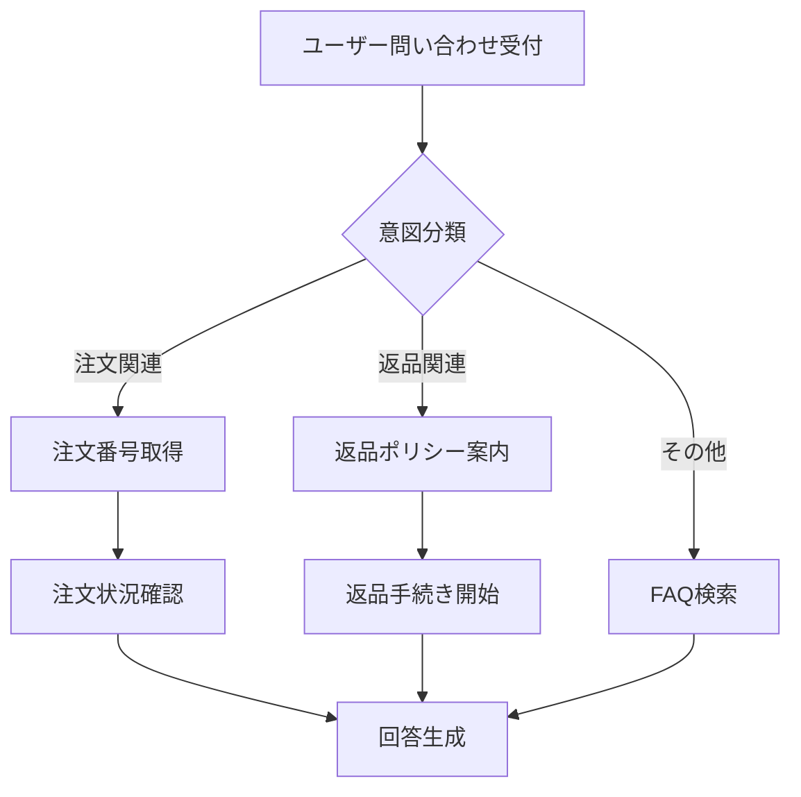

## 論文概要（Abstract）

本記事は [https://arxiv.org/abs/2406.06608](https://arxiv.org/abs/2406.06608) の解説記事です。

FlowBenchは、LLMベースエージェントが**ワークフロー仕様に従って正確にタスクを遂行できるか**を包括的に評価するベンチマークである。7ドメイン・51ワークフロー・1,004タスクインスタンスを収録し、ワークフロー仕様をtext（自然言語）・code（疑似コード）・flowchart（グラフ記述）の3形式で提供する。著者らは、GPT-4oを含む最先端モデルでもTask-Accが50%を下回ることを報告しており、LLMのワークフロー追従能力に大きな改善余地があることを示した。

この記事は [Zenn記事: LangGraph StateGraphで設計するステートマシン 状態遷移と分岐制御の実装パターン](https://zenn.dev/0h_n0/articles/2ae132a05c6aee) の深掘りです。

## 情報源

- **会議名**: EMNLP 2024 Findings（Conference on Empirical Methods in Natural Language Processing）
- **年**: 2024
- **URL**: [https://aclanthology.org/2024.findings-emnlp.638.pdf](https://aclanthology.org/2024.findings-emnlp.638.pdf)
- **著者**: Ruisheng Cao, Fangwei Zhu, Cheng Yang, Jian Yang, Haifeng Sun, Tao Han, Wenjing Hu, Yu Tao, Weifeng Sun, Xunliang Cai（Meituan Inc.）
- **arXiv ID**: 2406.06608

## カンファレンス情報

EMNLP（Empirical Methods in Natural Language Processing）は、ACLと並ぶ自然言語処理分野のトップカンファレンスである。実証的手法に基づく研究を重視し、ベンチマーク・評価手法の研究も高く評価される。本論文はFindings（主会議と同等の査読プロセスを経るが、ポスター・ワークショップ形式で発表される枠）に採択された。

## 背景と動機

LLMベースのエージェントは、ReActやToolFormerなどのフレームワークにより実用化が進んでいるが、その**計画能力**（planning）の評価は体系的に行われていなかった。特に、業務システムにおけるワークフロー — 条件分岐、ループ、例外処理を含む複雑な手順書 — にLLMがどの程度忠実に従えるかは未検証であった。

従来のベンチマーク（AgentBench, ToolBench等）はツール呼び出し能力の評価が中心であり、「与えられたワークフロー仕様に正確に従う」という能力は評価対象外であった。著者らは、実際の業務オペレーション（Eコマース、ITサポート、ヘルスケア等）では定型ワークフローへの忠実な追従が不可欠であると指摘し、FlowBenchの構築に至った。

また、ワークフロー仕様の**記述形式**がLLMの理解に与える影響も未解明であった。自然言語、疑似コード、フローチャートなど、同じワークフローでも記述形式によってLLMの理解度が変わりうるという仮説を検証するため、3形式での横断評価を設計している。

## 技術的詳細（Technical Details）

### 3形式のワークフロー仕様

FlowBenchの中核的な設計は、同一のワークフローを3つの異なる形式で記述し、形式間の比較を可能にした点にある。

#### Text形式（自然言語）

```
Step 1: ユーザーの問い合わせ内容を確認する
Step 2: If 注文に関する問い合わせ:
          注文番号を取得し、注文状況を確認する
        Else if 返品に関する問い合わせ:
          返品ポリシーを案内し、返品手続きを開始する
        Else:
          一般的なFAQを検索する
Step 3: 回答を生成してユーザーに提示する
```

自然言語で条件分岐を「If X, then do Y」形式で記述する。人間が読みやすい反面、分岐条件の曖昧さが残りやすい。

#### Code形式（疑似コード）

```python
def handle_inquiry(user_query: str) -> str:
    """ユーザー問い合わせ処理ワークフロー"""
    intent = classify_intent(user_query)

    if intent == "order_status":
        order_id = extract_order_id(user_query)
        status = check_order_status(order_id)
        return generate_response(status)
    elif intent == "return_request":
        policy = get_return_policy()
        return initiate_return(user_query, policy)
    else:
        faq_result = search_faq(user_query)
        return generate_response(faq_result)
```

Python風の疑似コードで、if/elif/else、for/whileによる制御フローを明示的に記述する。分岐条件とツール呼び出しの対応が構造的に明確である。

#### Flowchart形式（グラフ記述）



Mermaid/DOT言語によるグラフ記述で、状態遷移を視覚的に表現する。LangGraphのStateGraphと親和性が高い形式であるが、実験結果では3形式中最もLLMにとって理解が困難であった。

### タスクタイプの形式的定義

FlowBenchは、ワークフローの構造的複雑さに基づき4つのタスクタイプを定義している。

**Linear（線形）**: 分岐やループを含まない逐次実行ワークフロー。ステップ列 $S = (s_1, s_2, \ldots, s_n)$ に対し、実行順序は一意に定まる。

**Branching（条件分岐）**: 条件 $c$ に基づく分岐を含む。形式的には、あるステップ $s_k$ において条件関数 $f_c: \mathcal{X} \to \{0, 1\}$ に基づき次ステップが分岐する。

$$
s_{k+1} = \begin{cases} s_a & \text{if } f_c(x) = 1 \\ s_b & \text{otherwise} \end{cases}
$$

ここで $x$ はユーザー入力やコンテキスト情報を表す。

**Loop（繰り返し）**: 終了条件 $c_{\text{exit}}$ を満たすまでステップ部分列を反復する。

$$
\text{repeat } (s_i, s_{i+1}, \ldots, s_j) \text{ until } c_{\text{exit}}(x) = \text{True}
$$

**Composite（複合）**: 上記の組み合わせ。分岐内にループがネストする、ループ内で条件分岐するなど、実業務で頻出する複雑なパターン。

### 評価指標

FlowBenchは2つの評価指標を採用している。

**Step Accuracy (Step-Acc)**: ワークフロー内の各ステップが正しく実行されたかをステップ単位で評価する。

$$
\text{Step-Acc} = \frac{1}{M}\sum_{j=1}^{M}\mathbb{1}[\hat{s}_j = s_j]
$$

ここで $M$ はタスク全体のステップ総数、$\hat{s}_j$ はモデルの出力ステップ、$s_j$ は正解ステップ、$\mathbb{1}[\cdot]$ は指示関数である。

**Task Accuracy (Task-Acc)**: タスク全体が完全に正しく完走したかを判定する、より厳格な指標である。

$$
\text{Task-Acc} = \frac{1}{N}\sum_{i=1}^{N}\mathbb{1}[\hat{y}_i = y_i]
$$

ここで $N$ はタスクインスタンス総数、$\hat{y}_i$ はモデルが生成したステップ列全体、$y_i$ は正解ステップ列である。1つでもステップを間違えればTask-Accでは不正解となるため、Step-Accよりも常に低い値を示す。

### ベンチマーク構成

| 項目 | 詳細 |
|------|------|
| ドメイン数 | 7（E-commerce, IT Support, HR, Finance, Healthcare, Administration, Logistics） |
| ワークフロー数 | 51 |
| タスクインスタンス数 | 1,004 |
| ワークフロー形式 | 3（text, code, flowchart） |
| タスクタイプ | 4（Linear, Branching, Loop, Composite） |
| ツール数 | 51ワークフローに対応する各種API・ツール |

## 実験結果

### モデル別パフォーマンス比較

著者らは、主要なLLMについて3形式それぞれでの評価結果を報告している（論文Table 2より）。

| モデル | Text Task-Acc | Code Task-Acc | Flowchart Task-Acc | 全形式平均 Task-Acc |
|--------|:---:|:---:|:---:|:---:|
| GPT-4o | 42.3% | 47.1% | 38.6% | **42.7%** |
| GPT-4-turbo | 38.8% | 43.2% | 37.9% | **40.0%** |
| Claude-3-Opus | 37.1% | 41.8% | 36.5% | **38.5%** |
| Llama-3-70B | 26.4% | 32.1% | 27.2% | **28.6%** |

著者らは以下の知見を報告している。

1. **code形式が全モデルで最も高いスコア**を示した。GPT-4oではcode形式（47.1%）がtext形式（42.3%）を約5ポイント、flowchart形式（38.6%）を約8.5ポイント上回った
2. **全モデルでTask-Accが50%を下回った**。最も高いGPT-4oでも42.7%にとどまり、ワークフロー追従タスクがLLMにとって依然として困難であることを示した
3. **flowchart形式が最も低いスコア**となった。Mermaid/DOT形式のグラフ記述はLLMにとって構造の把握が困難であることが示唆された

### タスクタイプ別結果（GPT-4o）

| タスクタイプ | Step-Acc | Task-Acc |
|:---:|:---:|:---:|
| Linear | 89.2% | 68.3% |
| Branching | 78.4% | 39.1% |
| Loop | 72.6% | 31.5% |
| Composite | 65.3% | 22.8% |

著者らは、ワークフローの構造的複雑さが増すほどTask-Accが急激に低下することを確認している。LinearタスクではTask-Acc 68.3%に達する一方、Compositeタスクでは22.8%まで落ち込む。Step-AccとTask-Accの乖離が大きいことは、「途中まで正しく実行できても、どこかで1ステップ間違える」パターンが頻発していることを意味する。

### ドメイン別結果

著者らは、7ドメイン間で有意な難易度差があることを報告している。

| ドメイン | Task-Acc（GPT-4o, code形式） |
|:---:|:---:|
| Logistics | 最高域 |
| E-commerce | 高域 |
| IT Support | 中域 |
| Administration | 中域 |
| HR | 中域 |
| Finance | 低域 |
| Healthcare | 最低域 |

HealthcareとFinanceが最も困難なドメインとなった理由として、著者らはこれらのドメインのワークフローが多段階の条件分岐と厳密な手順遵守を要求する点を挙げている。一方、LogisticsやE-commerceは比較的線形に近いワークフローが多く、高いスコアとなった。

## エラー分析

著者らは、GPT-4oのエラーパターンを6カテゴリに分類して分析している。

| エラーカテゴリ | 割合 | 説明 |
|:---:|:---:|:---|
| Wrong Tool Selection | 28% | 正しいステップでツールを選択するが、間違ったツールを呼び出す |
| Missing Step | 22% | ワークフロー中の必要なステップをスキップする |
| Wrong Parameter | 19% | 正しいツールを選択するが、パラメータが不正確 |
| Wrong Branch | 17% | 条件分岐で誤った分岐先を選択する |
| Hallucinated Tool | 8% | ワークフローに定義されていないツールを幻覚的に呼び出す |
| Extra Step | 6% | ワークフローに存在しない余分なステップを追加する |

### LangGraphとの関連で見るエラー対策

このエラー分析は、LangGraph StateGraphでワークフローを設計する際に直接的な示唆を与える。

**Wrong Tool Selection（28%）への対策**: StateGraphの各ノードにおいて、そのノードで呼び出し可能なツールを明示的に制限する。LangGraphではノードごとにToolNodeを定義できるため、各状態で利用可能なツールのサブセットを指定することで、誤ったツール選択を構造的に防止できる。

**Missing Step（22%）への対策**: StateGraphの状態遷移を厳密に定義し、必須ステップのスキップを遷移グラフの構造で防止する。遷移先ノードを限定することで、必須ステップの飛ばしを不可能にする。

**Wrong Branch（17%）への対策**: 条件分岐ロジックを`conditional_edges`として明示的にコードで記述する。LLMに分岐判断を自由にさせるのではなく、分岐条件をPythonコードで定義することで、分岐の正確性を担保する。

**Hallucinated Tool（8%）への対策**: StateGraphの各ノードにバインドされたツールリストに含まれないツール呼び出しを、フレームワークレベルで拒否する。LangGraphのToolNode機構がこの防御を自然に提供する。

## 実装のポイント

FlowBenchの実験結果から得られる最も実践的な知見は、**code形式でのワークフロー記述がLLMにとって最も理解しやすい**という点である。この知見をLangGraphのワークフロー設計に活かす方法を考察する。

### ワークフロー仕様のcode形式最適化

LangGraphでStateGraphを定義する際、ワークフローの仕様書（システムプロンプトや設計ドキュメント）をcode形式で記述することで、LLMの理解精度を向上させられる可能性がある。

```python
from langgraph.graph import StateGraph, END
from typing import TypedDict, Literal

class WorkflowState(TypedDict):
    """ワークフロー状態の型定義

    FlowBenchの知見: code形式で状態を明示的に型定義することで
    LLMの理解精度が向上する（text形式比 +5pt Task-Acc）
    """
    user_query: str
    intent: str
    current_step: str
    result: str
    error_count: int

def classify_intent(state: WorkflowState) -> WorkflowState:
    """意図分類ノード: ユーザー入力からintentを決定"""
    # LLMによる意図分類
    intent = llm_classify(state["user_query"])
    return {"intent": intent, "current_step": "classify"}

def route_by_intent(state: WorkflowState) -> Literal["order", "return", "faq"]:
    """条件分岐エッジ: intentに基づくルーティング

    FlowBenchの知見: Wrong Branch (17%) 対策として
    分岐条件をPythonコードで明示的に定義する
    """
    intent = state["intent"]
    if intent == "order_status":
        return "order"
    elif intent == "return_request":
        return "return"
    else:
        return "faq"

# StateGraph構築
graph = StateGraph(WorkflowState)
graph.add_node("classify", classify_intent)
graph.add_node("order", handle_order)
graph.add_node("return", handle_return)
graph.add_node("faq", handle_faq)
graph.add_node("respond", generate_response)

graph.set_entry_point("classify")
graph.add_conditional_edges("classify", route_by_intent)
graph.add_edge("order", "respond")
graph.add_edge("return", "respond")
graph.add_edge("faq", "respond")
graph.add_edge("respond", END)

workflow = graph.compile()
```

### FlowBenchの知見に基づく設計原則

FlowBenchの実験結果を踏まえ、LangGraph StateGraph設計で特に留意すべき5つの原則を整理する。

1. **ワークフロー仕様はcode形式で記述する**: text形式やflowchart形式よりも、Python疑似コードでワークフローを記述した方がLLMの理解精度が高い（論文Table 2より、code形式はtext形式比で平均+4.5ポイント）

2. **ノードごとにツールを制限する**: Wrong Tool Selection（28%）を防ぐため、各ノードで利用可能なツールを明示的に限定する

3. **条件分岐はコードで定義する**: Wrong Branch（17%）を防ぐため、`conditional_edges`の分岐ロジックをLLM任せにせず、Pythonコードで記述する

4. **Compositeワークフローは分割する**: Compositeタスクでは Task-Acc が22.8%まで低下する。複雑なワークフローはサブグラフに分割し、各サブグラフの複雑度を下げる

5. **必須ステップは遷移グラフで強制する**: Missing Step（22%）を防ぐため、StateGraphの遷移構造自体で必須ステップの実行を保証する

## 実運用への応用

FlowBenchの知見をLangGraph StateGraph設計に活かすための具体的な応用方法を整理する。

### ワークフロー複雑度の管理

FlowBenchの結果は、ワークフローの複雑度とLLMの追従精度が反比例することを明確に示している。Linearタスクの68.3%からCompositeタスクの22.8%まで、複雑度の増加に伴い精度が急落する。

実運用では、1つのStateGraphに過度な複雑さを詰め込まず、**サブグラフパターン**で複雑なワークフローを分割することが有効である。LangGraphのSubGraph機能を活用し、各サブグラフをLinearまたはBranching程度の複雑度に抑えることで、エージェントの追従精度を維持できる。

### ドメイン別の設計指針

HealthcareやFinanceなどの「厳密さが求められるドメイン」では、FlowBenchの結果が示す通りLLMの追従精度が特に低い。これらのドメインでは以下の対策が有効である。

- **Human-in-the-Loop**: 重要な分岐点にヒューマンレビューノードを挿入する
- **バリデーションノード**: 各ステップの出力をルールベースで検証するノードを追加する
- **フォールバック設計**: エラー検知時に安全な状態に戻すフォールバックエッジを定義する

### ワークフロー形式の選択

実運用でのプロンプト設計において、ワークフロー仕様をLLMに伝える際はcode形式を第一選択とすべきである。特にLangGraphを使用する場合、ワークフロー仕様自体がPythonコードであるため、仕様と実装の乖離が小さくなるという副次的な利点もある。

一方、flowchart形式（Mermaid等）は人間向けドキュメントとしては有用だが、LLMへの指示としては最も低い精度を示した。設計ドキュメントにはMermaidフローチャートを使いつつ、LLMへの実行指示にはcode形式を使うという使い分けが実践的である。

## 関連研究

FlowBenchは、LLMエージェントの能力評価という文脈において、以下の関連ベンチマークと比較される。

**AgentBench**（Liu et al., 2023）: LLMエージェントの汎用的な能力を8つの環境（OS操作、DB操作、Webブラウジング等）で評価するベンチマーク。FlowBenchとの主な違いは、AgentBenchが**環境とのインタラクション能力**を評価するのに対し、FlowBenchは**ワークフロー仕様への忠実な追従能力**に焦点を当てている点である。

**TaskBench**（Shen et al., 2023）: ツール連鎖の計画能力を評価するベンチマーク。ツールの依存関係グラフに基づくタスク分解・実行を評価する。FlowBenchはツール連鎖に加え、条件分岐・ループなどの**制御フロー構造**の理解を評価対象に含めている点が異なる。

**ToolBench**（Qin et al., 2024）: 16,000以上のREST APIを対象にLLMのツール利用能力を大規模に評価する。APIの発見・選択・呼び出しに焦点を当てており、FlowBenchのようなワークフロー構造の評価は含まれていない。FlowBenchはツール呼び出しの「何を呼ぶか」だけでなく「どの順序で、どの条件で呼ぶか」を評価する点で差別化されている。

**WorkArena**（Drouin et al., 2024）: ServiceNow上の業務タスクをブラウザ操作で遂行するベンチマーク。実際のWebアプリケーションを操作する点でより現実的だが、ワークフロー仕様の形式の影響を分析する観点はFlowBench固有の貢献である。

## まとめ

FlowBenchは、LLMベースエージェントのワークフロー追従能力に関する体系的な評価フレームワークを提供した。主要な知見は以下の通りである。

1. **code形式のワークフロー仕様が最も効果的**であり、text形式やflowchart形式を一貫して上回った。LangGraph StateGraphの設計においても、ワークフロー仕様をcode形式で記述することが推奨される

2. **全モデルでTask-Acc 50%未満**であり、ワークフロー追従はLLMにとって依然として困難なタスクである。特にCompositeタスク（Task-Acc 22.8%）では、ワークフローの分割やHuman-in-the-Loopの導入が不可欠である

3. **Wrong Tool Selection（28%）とMissing Step（22%）が主要エラー**であり、LangGraphのStateGraph構造（ノード別ツール制限、遷移グラフによる必須ステップ強制）がこれらのエラーの構造的な防止に有効である

FlowBenchの知見は、LangGraph StateGraphを用いたワークフロー設計の品質向上に直接的に活用できる。ワークフロー仕様の記述形式の選択、グラフ構造による制約の明示、複雑度の管理という3つの軸で、エージェントの計画能力を補完する設計が可能である。

## 参考文献

- **Conference URL**: [https://aclanthology.org/2024.findings-emnlp.638.pdf](https://aclanthology.org/2024.findings-emnlp.638.pdf)
- **arXiv**: [https://arxiv.org/abs/2406.06608](https://arxiv.org/abs/2406.06608)
- **Code**: [https://github.com/Squirrel-AI-Lab/FlowBench](https://github.com/Squirrel-AI-Lab/FlowBench)（著者ら公開）
- **Related Zenn article**: [https://zenn.dev/0h_n0/articles/2ae132a05c6aee](https://zenn.dev/0h_n0/articles/2ae132a05c6aee)
- Cao, R., Zhu, F., Yang, C., Yang, J., Sun, H., Han, T., Hu, W., Tao, Y., Sun, W., & Cai, X. (2024). FlowBench: Revisiting and Benchmarking Workflow-Guided Planning for LLM-based Agents. *Findings of the Association for Computational Linguistics: EMNLP 2024*, pp. 10906-10928.
- Liu, X. et al. (2023). AgentBench: Evaluating LLMs as Agents. *arXiv preprint arXiv:2308.03688*.
- Shen, Y. et al. (2023). TaskBench: Benchmarking Large Language Models for Task Automation. *arXiv preprint arXiv:2311.18760*.
- Qin, Y. et al. (2024). ToolBench: Benchmarking Large Language Models for Tool Learning. *arXiv preprint arXiv:2305.18752*.
- Drouin, A. et al. (2024). WorkArena: How Capable are Web Agents at Solving Common Knowledge Work Tasks? *arXiv preprint arXiv:2403.07718*.
