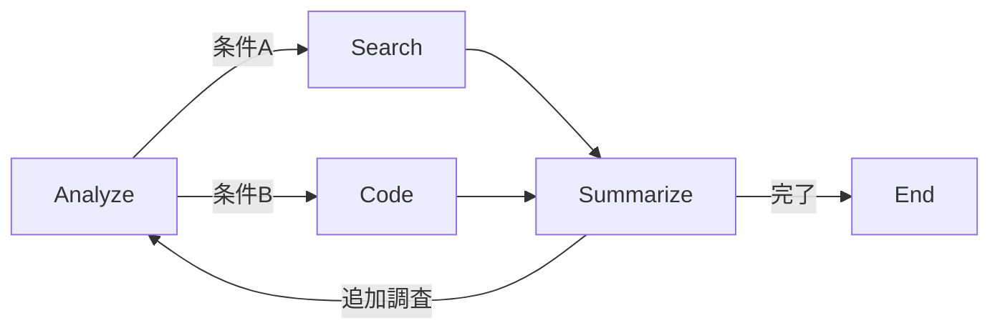

## 論文概要（Abstract）

本記事は [https://arxiv.org/abs/2309.02427](https://arxiv.org/abs/2309.02427) の解説記事です。

Agentsフレームワークは、LLMベースの自律エージェント構築のためのオープンソースライブラリである。著者らは、Standard Operating Procedures（SOP）をYAMLで宣言的に定義し、エージェントのワークフローをステートマシンとして制御する手法を提案している。Long-Short Term Memory、ツール使用、マルチエージェント通信、人間-エージェントインタラクション、自動評価を統合した汎用設計により、複雑なタスクの分解と制御を宣言的に記述できる点が特徴である。

この記事は [Zenn記事: LangGraph StateGraphで設計するステートマシン 状態遷移と分岐制御の実装パターン](https://zenn.dev/0h_n0/articles/2ae132a05c6aee) の深掘りです。

## 情報源

- **arXiv ID**: 2309.02427
- **URL**: [https://arxiv.org/abs/2309.02427](https://arxiv.org/abs/2309.02427)
- **著者**: Wangchunshu Zhou, Yuchen Eleanor Jiang, Long Li, et al.
- **発表年**: 2023
- **分野**: cs.AI, cs.CL

## 背景と動機（Background & Motivation）

2023年以降、LLMを核としたエージェントフレームワークが急速に増加した。LangChain、AutoGen、MetaGPTなど多数のフレームワークが登場したが、各フレームワークは独自のAPIと設計思想を持ち、ワークフロー定義の方法がバラバラであった。特に以下の課題が顕在化していた。

第一に、エージェントの振る舞いをPython等のプログラムとしてハードコードする方式では、ワークフローの変更に都度コード修正が必要であり、非エンジニアの参加が困難であった。第二に、エラーリカバリーや状態遷移のロジックがコード内に分散し、ワークフロー全体の見通しが悪化していた。第三に、マルチエージェント間の通信やメモリ管理、ツール使用、人間介入といった横断的関心事を統一的に扱うフレームワークが不足していた。

著者らは、SOPという概念を導入し、ワークフローをYAMLファイルで宣言的に定義することで、これらの課題を解決するアプローチを提案している。

## 主要な貢献（Key Contributions）

- **SOP（Standard Operating Procedures）**: YAMLファイルでステートマシンの状態・遷移・条件分岐を宣言的に記述する機構。コード変更なしにワークフロー制御を変更可能
- **3層メモリアーキテクチャ**: ShortTermMemory（会話履歴）、LongTermMemory（外部ストア）、PrivateMemory（エージェント固有）の3層構造で、コンテキスト管理を体系化
- **ツール登録機構**: `@tool`デコレータによる宣言的なツール登録。エラーハンドリングを含む実行制御を標準化
- **Human Feedback統合**: `HumanAgent`クラスにより、任意のステップに人間の介入点を挿入可能
- **自動評価ログ**: JSON形式での構造化ログ出力による自動評価基盤
- **マルチエージェント通信**: エージェント間メッセージパッシングプロトコルの標準化

## 技術的詳細（Technical Details）

### SOP YAMLスキーマと状態遷移

AgentsフレームワークのコアであるSOPは、有限オートマトン（FSA）の形式化に基づいている。状態遷移関数を以下のように定義する。

$$
\delta: S \times \Sigma \to S
$$

ここで、
- $S$: 状態集合（SOPで定義される各フェーズ）
- $\Sigma$: 入力集合（ユーザ入力、LLM出力、ツール結果など）
- $\delta$: 状態遷移関数（条件分岐のロジック）

SOP YAMLでは、各状態に`begin_role`、`begin_query`、遷移条件を記述する。著者らは、このYAML定義により、ステートマシンの状態遷移グラフを非プログラマでも理解・編集可能な形式で表現できると報告している。



### 3層メモリアーキテクチャ

メモリシステムは3つの階層で構成される。

1. **ShortTermMemory**: 直近の会話履歴を保持。トークンウィンドウの管理を含む
2. **LongTermMemory**: Vector DB等の外部ストアとの連携。RAG（Retrieval-Augmented Generation）パターンに対応
3. **PrivateMemory**: エージェント固有の内部状態。マルチエージェント環境で他のエージェントからは不可視

この設計により、コンテキスト管理の責務を明確に分離している。

### LangGraphとの対比: SOP YAML vs StateGraph Python API

AgentsフレームワークのSOP方式とLangGraphのStateGraph方式は、いずれもステートマシンによるワークフロー制御という共通の設計思想を持つが、定義方式に根本的な違いがある。

| 比較項目 | Agents (SOP YAML) | LangGraph (StateGraph) |
|----------|-------------------|----------------------|
| **定義方式** | YAML宣言的記述 | Python API（命令的） |
| **状態遷移** | YAML内の条件式 | `add_conditional_edges` / `Command` API |
| **メモリ** | 3層メモリ（Short/Long/Private） | `TypedDict`によるState管理 |
| **ツール統合** | `@tool`デコレータ | `ToolNode` + `tools_condition` |
| **人間介入** | `HumanAgent`クラス | `interrupt()` / `Command(resume=)` |
| **マルチエージェント** | メッセージパッシング | `Command(goto=)` によるハンドオフ |
| **設定変更** | YAMLファイル編集のみ | コード修正が必要 |
| **型安全性** | なし（YAML） | `TypedDict`による型チェック |
| **デバッグ** | ログベース | LangSmithによるトレース |
| **エコシステム** | 独立 | LangChainエコシステムと統合 |

SOP YAML方式はワークフローの可視性と非エンジニアの参加容易性に優れる一方、LangGraphのPython API方式はIDEサポートや型安全性の面で優位である。

## 実装のポイント（Implementation）

### SOP YAMLの定義例

以下はカスタマーサポートボットのSOP定義例である（著者らのリポジトリの設計パターンを参考に構成）。

```yaml
sop:
  states:
    greeting:
      begin_role: "assistant"
      begin_query: "ユーザの問い合わせを受け付けてください"
      transitions:
        - condition: "技術的な質問"
          target: "technical_support"
        - condition: "billing関連"
          target: "billing_support"
        - condition: "その他"
          target: "general_support"

    technical_support:
      begin_role: "assistant"
      begin_query: "技術的な問題を診断してください"
      tools: ["search_docs", "run_diagnostic"]
      transitions:
        - condition: "解決"
          target: "closing"
        - condition: "エスカレーション"
          target: "human_escalation"

    human_escalation:
      begin_role: "human"
      begin_query: "人間のオペレータが対応します"
      transitions:
        - condition: "完了"
          target: "closing"

    closing:
      begin_role: "assistant"
      begin_query: "サポート結果をまとめてください"
      is_end: true
```

### @toolデコレータによるツール登録

```python
from agents import tool, ToolResult

@tool(
    name="search_docs",
    description="技術ドキュメントを検索する",
    error_handling="retry",  # retry / skip / raise
    max_retries=3,
)
def search_docs(query: str, top_k: int = 5) -> ToolResult:
    """ドキュメント検索ツール

    Args:
        query: 検索クエリ
        top_k: 返却する上位件数

    Returns:
        ToolResult: 検索結果
    """
    # 検索ロジックの実装
    results = vector_store.similarity_search(query, k=top_k)
    return ToolResult(
        success=True,
        data=results,
        metadata={"query": query, "num_results": len(results)},
    )
```

SOP YAMLの`tools`フィールドで登録済みツールを参照するだけで、各状態でのツール利用が有効化される。エラーハンドリングポリシーもデコレータで宣言的に指定できる点が特徴的である。

## Production Deployment Guide

SOPベースのエージェントシステムをAWS上にデプロイする際の構成パターンを、トラフィック量別に整理する。

### AWS実装パターン（コスト最適化重視）

SOPベースエージェントは状態遷移ごとにLLM呼び出しが発生するため、1リクエストあたりのLLM呼び出し回数がトラフィック量と同様にコストを左右する。以下の構成はSOP平均5ステップ/リクエストを前提としたコスト試算である。

**注意**: 以下のコスト試算は2026年4月時点のAWS ap-northeast-1（東京）リージョン料金に基づく概算値である。実際のコストはトラフィックパターン、バースト使用量、モデル選択により変動する。最新料金は[AWS Pricing Calculator](https://calculator.aws/)で確認を推奨する。

| 構成 | トラフィック | 主要サービス | 月額概算 |
|------|------------|------------|---------|
| Small | ~100 req/日 | Lambda + Bedrock + DynamoDB | $50-150 |
| Medium | ~1,000 req/日 | ECS Fargate + Bedrock + ElastiCache | $300-800 |
| Large | 10,000+ req/日 | EKS + Karpenter + Bedrock Batch | $2,000-5,000 |

**Small構成（~100 req/日、月額$50-150）**:
- Lambda（1024MB、タイムアウト300秒）: SOPステートマシンの実行エンジン
- Bedrock（Claude 3.5 Sonnet / Haiku）: LLM推論。入力トークン$0.003/1K、出力$0.015/1K
- DynamoDB On-Demand: SOP状態とメモリの永続化。WCU/RCU従量課金
- S3: SOP YAML定義ファイルの格納
- CloudWatch Logs: 構造化ログ出力
- コスト内訳: Bedrock $30-80、Lambda $5-15、DynamoDB $5-20、その他 $10-35

**Medium構成（~1,000 req/日、月額$300-800）**:
- ECS Fargate（2vCPU、4GB RAM x 2タスク）: 常駐プロセスでコールドスタート回避
- Bedrock: Claude 3.5 Sonnet。Prompt Caching有効化で30-90%削減
- ElastiCache（Redis t4g.micro）: ShortTermMemoryのキャッシュ。セッション管理
- DynamoDB: LongTermMemoryの永続化
- ALB: リクエスト分散
- コスト内訳: Bedrock $150-400、Fargate $80-160、ElastiCache $30-60、その他 $40-180

**Large構成（10,000+ req/日、月額$2,000-5,000）**:
- EKS（コントロールプレーン$74/月）+ Karpenter: Spot優先の自動スケーリング
- Bedrock Batch API: 非同期処理で50%コスト削減
- ElastiCache（Redis r7g.large）: 3層メモリの高速アクセス
- OpenSearch Serverless: LongTermMemoryのベクトル検索
- Karpenter Provisioner: Spot Instances優先で最大90%削減（m6i.xlarge $0.192/h → Spot $0.058/h）
- コスト内訳: Bedrock $800-2,000、EKS+EC2 $500-1,500、データストア $300-800、その他 $400-700

**コスト削減テクニック**:
- Spot Instances活用: EKSワーカーノードで最大90%削減
- Reserved Instances: 1年コミットで最大72%削減（Fargate/ElastiCache）
- Bedrock Batch API: 非リアルタイム処理で50%削減
- Prompt Caching: SOP定義テンプレートのキャッシュで30-90%削減

### Terraformインフラコード

**Small構成（Serverless）**: Lambda + Bedrock + DynamoDB

```hcl
# small-sop-agent/main.tf
# SOPベースエージェント - Small構成（Serverless）

terraform {
  required_version = ">= 1.8"
  required_providers {
    aws = {
      source  = "hashicorp/aws"
      version = "~> 5.50"
    }
  }
}

provider "aws" {
  region = "ap-northeast-1"
}

# --- DynamoDB: SOP状態 + メモリ永続化 ---
resource "aws_dynamodb_table" "sop_state" {
  name         = "sop-agent-state"
  billing_mode = "PAY_PER_REQUEST"  # On-Demand: 低トラフィックでコスト最適
  hash_key     = "session_id"
  range_key    = "state_name"

  attribute {
    name = "session_id"
    type = "S"
  }
  attribute {
    name = "state_name"
    type = "S"
  }

  ttl {
    attribute_name = "expires_at"
    enabled        = true  # 古いセッションの自動削除
  }

  server_side_encryption {
    enabled = true  # KMS暗号化
  }

  tags = {
    Project = "sop-agent"
    Env     = "prod"
  }
}

# --- IAMロール: 最小権限 ---
resource "aws_iam_role" "lambda_role" {
  name = "sop-agent-lambda-role"
  assume_role_policy = jsonencode({
    Version = "2012-10-17"
    Statement = [{
      Action = "sts:AssumeRole"
      Effect = "Allow"
      Principal = { Service = "lambda.amazonaws.com" }
    }]
  })
}

resource "aws_iam_role_policy" "lambda_policy" {
  name = "sop-agent-lambda-policy"
  role = aws_iam_role.lambda_role.id
  policy = jsonencode({
    Version = "2012-10-17"
    Statement = [
      {
        Effect   = "Allow"
        Action   = ["bedrock:InvokeModel"]
        Resource = "arn:aws:bedrock:ap-northeast-1::foundation-model/anthropic.claude-*"
      },
      {
        Effect = "Allow"
        Action = [
          "dynamodb:GetItem", "dynamodb:PutItem",
          "dynamodb:UpdateItem", "dynamodb:Query"
        ]
        Resource = aws_dynamodb_table.sop_state.arn
      },
      {
        Effect = "Allow"
        Action = [
          "logs:CreateLogGroup", "logs:CreateLogStream",
          "logs:PutLogEvents"
        ]
        Resource = "arn:aws:logs:*:*:*"
      },
      {
        Effect   = "Allow"
        Action   = ["s3:GetObject"]
        Resource = "${aws_s3_bucket.sop_definitions.arn}/*"
      }
    ]
  })
}

# --- S3: SOP YAML定義ファイル格納 ---
resource "aws_s3_bucket" "sop_definitions" {
  bucket = "sop-agent-definitions-${data.aws_caller_identity.current.account_id}"
  tags   = { Project = "sop-agent" }
}

resource "aws_s3_bucket_server_side_encryption_configuration" "sop_enc" {
  bucket = aws_s3_bucket.sop_definitions.id
  rule {
    apply_server_side_encryption_by_default {
      sse_algorithm = "aws:kms"
    }
  }
}

resource "aws_s3_bucket_public_access_block" "sop_block" {
  bucket                  = aws_s3_bucket.sop_definitions.id
  block_public_acls       = true
  block_public_policy     = true
  ignore_public_acls      = true
  restrict_public_buckets = true
}

# --- Lambda: SOPステートマシン実行エンジン ---
resource "aws_lambda_function" "sop_agent" {
  function_name = "sop-agent-handler"
  role          = aws_iam_role.lambda_role.arn
  handler       = "handler.lambda_handler"
  runtime       = "python3.12"
  timeout       = 300  # SOP 5ステップ分のLLM呼び出し
  memory_size   = 1024

  filename         = "lambda_package.zip"
  source_code_hash = filebase64sha256("lambda_package.zip")

  environment {
    variables = {
      DYNAMODB_TABLE = aws_dynamodb_table.sop_state.name
      S3_BUCKET      = aws_s3_bucket.sop_definitions.id
      BEDROCK_MODEL  = "anthropic.claude-3-5-sonnet-20241022-v2:0"
      LOG_LEVEL      = "INFO"
    }
  }

  tracing_config {
    mode = "Active"  # X-Ray有効化
  }

  tags = { Project = "sop-agent" }
}

# --- CloudWatch アラーム: コスト監視 ---
resource "aws_cloudwatch_metric_alarm" "lambda_duration" {
  alarm_name          = "sop-agent-high-duration"
  comparison_operator = "GreaterThanThreshold"
  evaluation_periods  = 3
  metric_name         = "Duration"
  namespace           = "AWS/Lambda"
  period              = 300
  statistic           = "Average"
  threshold           = 60000  # 60秒超過でアラート
  alarm_actions       = [aws_sns_topic.alerts.arn]

  dimensions = {
    FunctionName = aws_lambda_function.sop_agent.function_name
  }
}

resource "aws_sns_topic" "alerts" {
  name = "sop-agent-alerts"
}

data "aws_caller_identity" "current" {}
```

**Large構成（Container）**: EKS + Karpenter + Spot Instances

```hcl
# large-sop-agent/main.tf
# SOPベースエージェント - Large構成（Container）

module "eks" {
  source  = "terraform-aws-modules/eks/aws"
  version = "~> 20.0"

  cluster_name    = "sop-agent-cluster"
  cluster_version = "1.30"

  vpc_id     = module.vpc.vpc_id
  subnet_ids = module.vpc.private_subnets

  # コントロールプレーンのみ（$74/月）
  cluster_endpoint_public_access = false

  eks_managed_node_groups = {
    system = {
      instance_types = ["m6i.large"]
      min_size       = 2
      max_size       = 2
      desired_size   = 2
      # システムPod用（CoreDNS, Karpenter等）
    }
  }

  tags = { Project = "sop-agent" }
}

# --- Karpenter: Spot優先の自動スケーリング ---
resource "kubectl_manifest" "karpenter_nodepool" {
  yaml_body = yamlencode({
    apiVersion = "karpenter.sh/v1"
    kind       = "NodePool"
    metadata   = { name = "sop-agent-pool" }
    spec = {
      template = {
        spec = {
          requirements = [
            { key = "karpenter.sh/capacity-type", operator = "In", values = ["spot", "on-demand"] },
            { key = "node.kubernetes.io/instance-type", operator = "In",
              values = ["m6i.xlarge", "m6i.2xlarge", "m7i.xlarge", "m7i.2xlarge"] },
          ]
          nodeClassRef = { name = "default" }
        }
      }
      limits   = { cpu = "100", memory = "400Gi" }
      disruption = {
        consolidationPolicy = "WhenEmptyOrUnderutilized"
        consolidateAfter    = "30s"
      }
    }
  })
}

# --- Secrets Manager: Bedrock設定 ---
resource "aws_secretsmanager_secret" "bedrock_config" {
  name = "sop-agent/bedrock-config"
}

resource "aws_secretsmanager_secret_version" "bedrock_config" {
  secret_id     = aws_secretsmanager_secret.bedrock_config.id
  secret_string = jsonencode({
    model_id         = "anthropic.claude-3-5-sonnet-20241022-v2:0"
    max_tokens       = 4096
    prompt_cache_ttl = 300
  })
}

# --- AWS Budgets: 月次予算アラート ---
resource "aws_budgets_budget" "monthly" {
  name         = "sop-agent-monthly"
  budget_type  = "COST"
  limit_amount = "5000"
  limit_unit   = "USD"
  time_unit    = "MONTHLY"

  notification {
    comparison_operator       = "GREATER_THAN"
    threshold                 = 80
    threshold_type            = "PERCENTAGE"
    notification_type         = "FORECASTED"
    subscriber_email_addresses = ["alerts@example.com"]
  }

  notification {
    comparison_operator       = "GREATER_THAN"
    threshold                 = 100
    threshold_type            = "PERCENTAGE"
    notification_type         = "ACTUAL"
    subscriber_email_addresses = ["alerts@example.com"]
  }
}
```

### 運用・監視設定

**CloudWatch Logs Insights クエリ**: SOPステートマシンの実行状況とコスト異常を検知する。

```
# 1時間あたりのBedrockトークン使用量（コスト異常検知）
fields @timestamp, @message
| filter @message like /bedrock_invoke/
| stats sum(input_tokens) as total_input, sum(output_tokens) as total_output,
        count() as invocations by bin(1h)
| sort @timestamp desc

# SOP状態遷移のレイテンシ分析（P95, P99）
fields @timestamp, sop_state, duration_ms
| filter event = "state_transition"
| stats percentile(duration_ms, 95) as p95,
        percentile(duration_ms, 99) as p99,
        avg(duration_ms) as avg_ms by sop_state
| sort p99 desc
```

**CloudWatch アラーム設定（Python）**:

```python
import boto3

cloudwatch = boto3.client("cloudwatch", region_name="ap-northeast-1")

def create_bedrock_token_alarm() -> None:
    """Bedrockトークン使用量スパイク検知アラームを作成する"""
    cloudwatch.put_metric_alarm(
        AlarmName="sop-agent-bedrock-token-spike",
        MetricName="InputTokenCount",
        Namespace="AWS/Bedrock",
        Statistic="Sum",
        Period=3600,
        EvaluationPeriods=1,
        Threshold=500000,  # 1時間50万トークン超過
        ComparisonOperator="GreaterThanThreshold",
        AlarmActions=["arn:aws:sns:ap-northeast-1:ACCOUNT:sop-agent-alerts"],
        Dimensions=[
            {"Name": "ModelId", "Value": "anthropic.claude-3-5-sonnet-20241022-v2:0"},
        ],
    )
```

**X-Ray トレーシング設定（Python）**:

```python
from aws_xray_sdk.core import xray_recorder, patch_all

# boto3自動計装
patch_all()

@xray_recorder.capture("sop_state_transition")
def execute_sop_state(
    session_id: str,
    current_state: str,
    user_input: str,
) -> dict:
    """SOP状態遷移を実行し、X-Rayでトレースする

    Args:
        session_id: セッション識別子
        current_state: 現在のSOP状態名
        user_input: ユーザ入力

    Returns:
        dict: 次の状態と出力
    """
    subsegment = xray_recorder.current_subsegment()
    subsegment.put_annotation("session_id", session_id)
    subsegment.put_annotation("sop_state", current_state)
    subsegment.put_metadata("input_length", len(user_input))

    # Bedrock呼び出し（X-Rayが自動トレース）
    response = bedrock_client.invoke_model(
        modelId="anthropic.claude-3-5-sonnet-20241022-v2:0",
        body=build_prompt(current_state, user_input),
    )

    subsegment.put_metadata("output_tokens", response["usage"]["output_tokens"])
    return {"next_state": response["next_state"], "output": response["output"]}
```

**Cost Explorer自動レポート（Python）**:

```python
import boto3
from datetime import datetime, timedelta

ce = boto3.client("ce", region_name="us-east-1")
sns = boto3.client("sns", region_name="ap-northeast-1")

def daily_cost_report() -> dict:
    """日次コストレポートを生成し、閾値超過時にSNS通知する

    Returns:
        dict: サービス別コスト内訳
    """
    end = datetime.utcnow().strftime("%Y-%m-%d")
    start = (datetime.utcnow() - timedelta(days=1)).strftime("%Y-%m-%d")

    result = ce.get_cost_and_usage(
        TimePeriod={"Start": start, "End": end},
        Granularity="DAILY",
        Metrics=["UnblendedCost"],
        Filter={
            "Tags": {
                "Key": "Project",
                "Values": ["sop-agent"],
            }
        },
        GroupBy=[{"Type": "DIMENSION", "Key": "SERVICE"}],
    )

    total = 0.0
    breakdown = {}
    for group in result["ResultsByTime"][0]["Groups"]:
        service = group["Keys"][0]
        cost = float(group["Metrics"]["UnblendedCost"]["Amount"])
        breakdown[service] = cost
        total += cost

    if total > 100:  # $100/日超過でSNS通知
        sns.publish(
            TopicArn="arn:aws:sns:ap-northeast-1:ACCOUNT:sop-agent-alerts",
            Subject=f"SOP Agent Cost Alert: ${total:.2f}/day",
            Message=f"日次コスト${total:.2f}が閾値$100を超過。内訳: {breakdown}",
        )

    return breakdown
```

### コスト最適化チェックリスト

**アーキテクチャ選択**:
- [ ] トラフィック量を計測し、適切な構成を選択（~100 req/日: Serverless、~1,000 req/日: Hybrid、10,000+ req/日: Container）
- [ ] SOPの平均ステップ数を計測し、1リクエストあたりのLLM呼び出し回数を把握

**リソース最適化**:
- [ ] EC2/EKS: Spot Instances優先（m6i/m7i系、最大90%削減）
- [ ] Reserved Instances: 1年コミットで最大72%削減（安定ワークロード）
- [ ] Savings Plans: Compute Savings Plansの検討
- [ ] Lambda: メモリサイズを1024MB-2048MBで最適値を探索（Power Tuning）
- [ ] ECS/EKS: Karpenterでアイドル時の自動スケールダウン（consolidateAfter: 30s）

**LLMコスト削減**:
- [ ] Bedrock Batch API: 非リアルタイム処理で50%削減
- [ ] Prompt Caching: SOPテンプレート部分をキャッシュ（30-90%削減）
- [ ] モデル選択ロジック: 簡単なステップはHaiku、複雑なステップはSonnetを使い分け
- [ ] トークン数制限: `max_tokens`を状態ごとに最適化
- [ ] SOP設計最適化: 不要な状態遷移を削除し、LLM呼び出し回数を削減

**監視・アラート**:
- [ ] AWS Budgets: 月次予算アラート（80%/100%で通知）
- [ ] CloudWatch アラーム: Bedrockトークンスパイク、Lambda実行時間異常
- [ ] Cost Anomaly Detection: ML検知の有効化
- [ ] 日次コストレポート: Cost Explorer APIで自動取得、$100/日超過で通知

**リソース管理**:
- [ ] 未使用リソース: 週次でIdle Lambda/ECSタスクの棚卸し
- [ ] タグ戦略: `Project=sop-agent`タグの徹底（コスト配分有効化）
- [ ] ライフサイクルポリシー: DynamoDB TTLで古いセッションを自動削除
- [ ] 開発環境: 夜間・休日の自動停止（EventBridge Scheduler）
- [ ] CloudWatch Logs: 保持期間を30日に設定（デフォルト無期限を回避）

## 実験結果（Results）

著者らは、HotpotQA（マルチホップ質問応答）、ソフトウェア開発、ロールプレイシナリオの3タスクでAgentsフレームワークを評価している。

| タスク | ベースモデル | 比較対象 | Agents (SOP) | 改善点 |
|--------|------------|---------|--------------|--------|
| HotpotQA | GPT-3.5 | LangChain ReAct | SOP制御で構造化推論 | エラーリカバリー改善 |
| ソフトウェア開発 | GPT-4 | 単一エージェント | マルチエージェントSOP | タスク分解の明確化 |
| ロールプレイ | GPT-3.5/4 | 直接プロンプト | SOP状態遷移 | 一貫性のあるキャラクター維持 |

著者らは、SOP設計によるワークフロー制御が特にエラーリカバリーの場面で有効であったと報告している。HotpotQAでは、検索結果が不十分な場合にSOPの遷移条件に基づいて自動的に追加検索ステップに遷移する設計が、LangChainのReActパターンと比較してより安定した推論を実現したとされる。ソフトウェア開発タスクでは、要件分析・設計・実装・テストの各フェーズをSOP状態として定義することで、マルチエージェント間の責務分担が明確化されたと報告されている。

ただし、著者らはベンチマーク数値の詳細な比較表を論文中で限定的にしか提示しておらず、定量的な優位性の検証は今後の課題として残されている点に留意が必要である。

## 実運用への応用（Practical Applications）

AgentsフレームワークのSOP方式は、LangGraphの`add_conditional_edges`や`Command` APIと設計思想を共有している。実運用においては、以下の使い分けが考えられる。

**SOP YAML方式が適するケース**:
- ワークフロー定義を非エンジニア（ドメインエキスパート、PM）が管理する必要がある場合
- ワークフローの変更頻度が高く、コードデプロイなしに更新したい場合
- 複数プロジェクトで類似のワークフローパターンを再利用する場合

**LangGraph Python API方式が適するケース**:
- 複雑な条件分岐ロジックが必要で、YAMLでは表現が困難な場合
- 型安全性やIDEサポートによる開発生産性を重視する場合
- LangChainエコシステム（LangSmithトレース、LangServeデプロイ等）との統合が必要な場合

実運用では、SOP YAMLでワークフローの骨格を定義し、複雑なロジックはPythonで実装するハイブリッド方式も有効である。LangGraphの`StateGraph`でグラフ構造を構築しつつ、各ノードの振る舞いを設定ファイルで外部化するパターンは、両者の長所を活かしたアプローチとなる。

## 関連研究（Related Work）

- **AutoGen (Microsoft, 2023)**: マルチエージェント会話フレームワーク。エージェント間の対話プロトコルに焦点を当てている。Agentsフレームワークとの違いは、SOPのような宣言的ワークフロー定義を持たない点にある
- **MetaGPT (Hong et al., 2023)**: ソフトウェア開発に特化したマルチエージェントフレームワーク。SOPの概念をソフトウェア工学のプロセスに限定して適用している。Agentsフレームワークはより汎用的なSOP定義を目指している
- **LangGraph (LangChain, 2024)**: Python APIでステートマシンを構築するフレームワーク。Agentsフレームワークと同様にグラフベースの状態遷移を採用するが、定義方式がPythonコード（命令的）である点で対照的。2024-2025年のエコシステム拡充（LangSmith、LangServe）により、プロダクション採用が進んでいる

## まとめと今後の展望

AgentsフレームワークはSOP YAMLによる宣言的ワークフロー定義、3層メモリアーキテクチャ、ツール統合、マルチエージェント通信を統合した汎用エージェントフレームワークである。著者らの実験により、SOP設計がエラーリカバリーとタスク分解の改善に寄与することが示されている。

実務的な観点では、LangGraphのPython API方式との対比が重要である。SOP YAML方式は可読性と設定駆動型ワークフローに優れ、Python API方式は型安全性とエコシステム統合に優れる。プロジェクトの要件に応じた選択、あるいはハイブリッド方式の採用が望ましい。

今後の研究方向として、SOPの自動生成（タスク記述からのSOP YAML生成）、SOP間の合成（複数SOPの自動統合）、実行時のSOP動的最適化が挙げられる。

## 参考文献

- **arXiv**: [https://arxiv.org/abs/2309.02427](https://arxiv.org/abs/2309.02427)
- **Code**: [https://github.com/aiwaves-cn/agents](https://github.com/aiwaves-cn/agents)（Apache-2.0）
- **Related Zenn article**: [https://zenn.dev/0h_n0/articles/2ae132a05c6aee](https://zenn.dev/0h_n0/articles/2ae132a05c6aee)
- Zhou, W., Jiang, Y. E., Li, L., et al. (2023). "Agents: An Open-source Framework for Autonomous Language Agents." arXiv:2309.02427.
- Wu, Q., et al. (2023). "AutoGen: Enabling Next-Gen LLM Applications via Multi-Agent Conversation." arXiv:2308.08155.
- Hong, S., et al. (2023). "MetaGPT: Meta Programming for Multi-Agent Collaborative Framework." arXiv:2308.00352.
