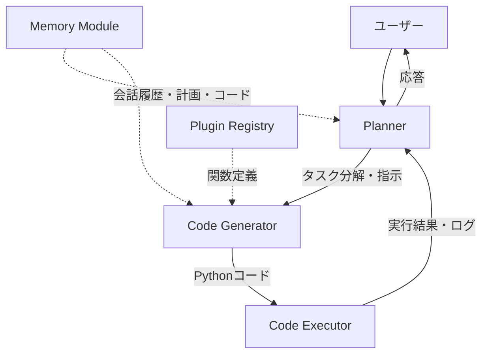

## 論文概要（Abstract）

本記事は [https://arxiv.org/abs/2311.17541](https://arxiv.org/abs/2311.17541) の解説記事です。

TaskWeaverは、Microsoft Researchが提案するコードファーストのエージェントフレームワークである。従来のエージェントシステムがツール呼び出しをJSON/文字列ベースで行うのに対し、TaskWeaverはユーザーのリクエストを実行可能なPythonコードに変換し、ユーザー定義のプラグインを呼び出し可能な関数として扱う。これにより、DataFrameなどの複雑なデータ構造を自然に扱え、ドメイン知識をサンプルコードとして体系的に組み込める。セッション単位でステートフルな実行環境を維持し、前のステップの結果を次のステップで直接参照できる設計となっている。

この記事は [Zenn記事: LangGraph StateGraphで設計するステートマシン 状態遷移と分岐制御の実装パターン](https://zenn.dev/0h_n0/articles/2ae132a05c6aee) の深掘りです。

## 情報源

- **arXiv ID**: 2311.17541
- **URL**: [https://arxiv.org/abs/2311.17541](https://arxiv.org/abs/2311.17541)
- **著者**: Bo Qiao, Liqun Li, Xu Zhang, et al.（Microsoft Research）
- **発表年**: 2023（初版: 2023年11月29日、最終改訂: 2024年6月20日）
- **分野**: Artificial Intelligence (cs.AI)

## 背景と動機（Background & Motivation）

LLMベースのエージェントフレームワークは、外部ツールを呼び出すことでLLM単体では不可能なタスクを実行する。しかし、著者らは既存フレームワークに3つの制約があると指摘している。

第一に、**データ構造の制約**である。LangChainやAutoGenなど既存フレームワークでは、ツール間のデータ受け渡しが文字列やJSONに限定される。pandasのDataFrameのような複雑なデータ構造をツール間で受け渡す場合、シリアライズ/デシリアライズのオーバーヘッドが生じ、大規模データでは実用に耐えない。

第二に、**ドメイン知識の統合が困難**である。特定業務領域のデータ分析タスクでは、LLMに業務固有の知識を与える体系的な仕組みが求められるが、既存フレームワークにはこうしたガイダンス機構が不足している。

第三に、**ステートフル実行の欠如**である。会話の中で段階的にデータを加工していくワークフローでは、前のステップで定義した変数や読み込んだデータを次のステップで再利用する必要がある。しかし、多くのフレームワークはステートレスな設計であり、各ステップが独立して実行されるため、コンテキストの継続が困難である。

## 主要な貢献（Key Contributions）

- **コードファーストアプローチ**: ユーザーリクエストを実行可能なPythonコードに変換し、プラグインを関数呼び出しとして統合。これにより、DataFrameやNumPy配列といったリッチなデータ構造をそのまま扱える
- **ステートフルなセッション管理**: Jupyterカーネルプロセスによるセッション単位の状態保持。変数、インポート、データがラウンド（会話ターン）をまたいで永続化される
- **体系的なドメイン知識統合**: プラグインスキーマとサンプルコードを通じて、業務固有の知識をLLMに提供する仕組みを実装
- **セキュアなコード実行**: AST解析によるコード検証と、プロセス分離/Docker分離による安全な実行環境

## 技術的詳細（Technical Details）

### Planner-Code Generator-Code Executorの3層アーキテクチャ

TaskWeaverの中核は、Planner、Code Generator（CG）、Code Executor（CE）の3つのコンポーネントで構成される。



**Planner**はユーザーとの対話エントリポイントであり、タスクを複数のサブタスクに分解し、実行計画を生成する。著者らは**Two-Phase Planning**を採用しており、初期計画を生成した後、逐次的に依存するサブタスクを統合（マージ）して、LLM呼び出し回数を削減している。

**Code Generator**はPlannerからのサブタスク記述を受け取り、プラグイン関数とカスタムロジックを組み合わせたPythonコードを合成する。動的プラグイン選択により、リクエストに関連するプラグインのみをプロンプトにロードし、コンテキストウィンドウの消費を抑えている。

**Code Executor**は生成されたコードを分離されたJupyterカーネルプロセスで実行する。実行結果（リターンコード、ログ、出力、アーティファクト）はPlannerに返され、必要に応じてCGによるコード再生成が行われる（最大3回の自動リトライ）。

### Session State Management: LangGraphのcheckpointerとの対比

TaskWeaverの状態管理は、Session-Round-Postの3層階層構造で設計されている。

$$
\text{Session} = \{R_1, R_2, \ldots, R_n\}, \quad R_i = \{P_1^{(i)}, P_2^{(i)}, \ldots, P_{m_i}^{(i)}\}
$$

ここで、
- $R_i$: 第$i$ラウンド（1回のユーザーリクエスト〜エージェント応答）
- $P_j^{(i)}$: 第$i$ラウンドの第$j$ポスト（Planner-CG間の個別メッセージ）
- $n$: セッション内のラウンド数
- $m_i$: 第$i$ラウンドのポスト数

TaskWeaverでは、Jupyterカーネルプロセスがセッション全体を通じて生存するため、Pythonインタープリタの状態（変数、インポート、メモリ上のデータ）が自動的に保持される。これはJupyter Notebookのセル実行と同じモデルである。

対照的に、LangGraphではcheckpointerがグラフの状態をシリアライズして外部ストレージ（SQLite, PostgreSQL等）に保存する。LangGraphの状態は明示的に定義されたTypedDictであり、シリアライズ可能なデータのみを扱える。TaskWeaverのインメモリ状態保持は、大規模なDataFrameやモデルオブジェクトの受け渡しに適している一方、プロセス障害時の永続性はLangGraphのcheckpointerが優れている。

### Plugin System: LangGraphのノード定義との対比

TaskWeaverのプラグインは、YAMLスキーマとPython実装の2ファイルで構成される。

```yaml
# anomaly_detection.yaml
name: anomaly_detection
enabled: true
required: false
description: >
  Detect anomalies in time series data using IsolationForest.
parameters:
  - name: df
    type: DataFrame
    required: true
    description: Input DataFrame with timestamp and value columns
  - name: contamination
    type: float
    required: false
    description: Expected proportion of anomalies (default 0.1)
returns:
  - name: result
    type: DataFrame
    description: DataFrame with anomaly labels added
```

LangGraphでは、ノードは状態を受け取り状態を返す関数として定義される。ノード間のデータフローはグラフのエッジで明示的に制御される。TaskWeaverのプラグインとLangGraphのノードの設計思想を比較すると以下の通りである。

| 設計項目 | TaskWeaver Plugin | LangGraph Node |
|---------|-------------------|----------------|
| 定義方法 | YAML + Python | Python関数 + デコレータ |
| データ受け渡し | インメモリ（変数参照） | State辞書経由 |
| 型制約 | YAMLスキーマで記述 | TypedDictで型定義 |
| 実行順序 | Plannerが動的に決定 | グラフエッジで静的に定義 |
| 並列実行 | 非対応（逐次実行） | 条件分岐・並列エッジ対応 |
| 再利用性 | 関数として汎用的に呼び出し可能 | グラフ内のノードとして再利用 |

LangGraphのグラフベース設計は、実行フローの可視化と再現性に優れる。一方、TaskWeaverのコードファースト設計は、複雑なデータ変換ロジックを自然なPythonコードとして表現できるため、データサイエンス領域での柔軟性が高い。

### 実行フローの形式化

TaskWeaverの1ラウンドの実行フローを形式的に記述する。

$$
\text{Response}(r) = \text{Planner}\left(\text{CE}\left(\text{Verify}\left(\text{CG}(r, \mathcal{P}, \mathcal{E})\right)\right), \mathcal{H}\right)
$$

ここで、
- $r$: ユーザーリクエスト
- $\mathcal{P}$: 利用可能なプラグイン集合
- $\mathcal{E}$: ドメイン知識サンプル集合
- $\mathcal{H}$: 会話履歴
- $\text{Verify}$: ASTベースのコード検証関数

コード検証関数$\text{Verify}$は、生成されたコードを構文木（AST）レベルで解析し、設定可能なルールに基づいて危険な操作（ファイル削除、環境変数アクセス、禁止パッケージのインポート等）を検出する。

## 実装のポイント（Implementation）

### Pythonプラグインの作成方法

TaskWeaverでカスタムプラグインを作成する手順を示す。

```python
# plugins/stock_analyzer/stock_analyzer.py
"""株価分析プラグイン

TaskWeaverプラグインとして株価データの取得と
テクニカル分析を行う。
"""
import pandas as pd
import yfinance as yf


def stock_analyzer(
    ticker: str,
    period: str = "1y",
    indicators: list[str] | None = None,
) -> pd.DataFrame:
    """株価データを取得しテクニカル指標を計算する。

    Args:
        ticker: 銘柄コード（例: "AAPL", "7203.T"）
        period: 取得期間（例: "1y", "6mo", "1d"）
        indicators: 計算する指標のリスト（例: ["sma_20", "rsi"]）

    Returns:
        テクニカル指標を付与したDataFrame
    """
    if indicators is None:
        indicators = ["sma_20", "sma_50", "rsi"]

    # データ取得
    df = yf.download(ticker, period=period)

    # 移動平均
    if "sma_20" in indicators:
        df["SMA_20"] = df["Close"].rolling(window=20).mean()
    if "sma_50" in indicators:
        df["SMA_50"] = df["Close"].rolling(window=50).mean()

    # RSI (Relative Strength Index)
    if "rsi" in indicators:
        delta = df["Close"].diff()
        gain = delta.where(delta > 0, 0).rolling(window=14).mean()
        loss = (-delta.where(delta < 0, 0)).rolling(window=14).mean()
        rs = gain / loss
        df["RSI"] = 100 - (100 / (1 + rs))

    return df
```

対応するYAMLスキーマは以下の通りである。

```yaml
# plugins/stock_analyzer/stock_analyzer.yaml
name: stock_analyzer
enabled: true
required: false
description: >
  Fetch stock price data and compute technical indicators
  (SMA, RSI) for a given ticker symbol.
parameters:
  - name: ticker
    type: str
    required: true
    description: Stock ticker symbol (e.g., "AAPL", "7203.T")
  - name: period
    type: str
    required: false
    description: Data period (e.g., "1y", "6mo"). Default "1y"
  - name: indicators
    type: list
    required: false
    description: List of indicators to compute (e.g., ["sma_20", "rsi"])
returns:
  - name: result
    type: DataFrame
    description: DataFrame with OHLCV data and computed indicators
```

実装時の注意点として、プラグイン関数は**純粋関数として設計**すべきである。副作用（ファイル書き込み、DB更新等）がある場合は、関数のDocstringに明記する。また、TaskWeaverのCode Generatorは関数シグネチャとDocstringをプロンプトに含めるため、引数の説明が不十分だとLLMが誤った呼び出しコードを生成する原因となる。

## Production Deployment Guide

TaskWeaverはPython製のセルフホスト型フレームワークであり、Jupyterカーネルプロセスの管理が運用上の要点となる。以下にAWS上でのデプロイパターンを示す。

### AWS実装パターン（コスト最適化重視）

**トラフィック量別の推奨構成**:

| 構成 | トラフィック | AWSサービス | 月額コスト概算 |
|------|-------------|------------|--------------|
| Small | ~100 req/日 | Lambda + Bedrock + DynamoDB | $50-150 |
| Medium | ~1,000 req/日 | ECS Fargate + Bedrock + ElastiCache | $300-800 |
| Large | 10,000+ req/日 | EKS + Karpenter + Spot Instances | $2,000-5,000 |

**Small構成 (~100 req/日): Lambda + Bedrock**

TaskWeaverのセッション管理をDynamoDBに永続化し、LambdaからBedrock APIを呼び出す構成。Jupyterカーネルの常駐が不要な軽量ワークロード向け。コード実行はLambdaのランタイム上で行い、セッション状態はDynamoDBに保存する。

- Lambda (256MB, 平均30秒): ~$15/月
- Bedrock (Claude Sonnet, ~50K tokens/req): ~$80/月
- DynamoDB (On-Demand): ~$5/月
- CloudWatch Logs: ~$5/月
- **合計: $105/月**

**Medium構成 (~1,000 req/日): ECS Fargate**

TaskWeaverプロセスをFargateタスクとして実行し、セッション単位でJupyterカーネルを管理する。ElastiCacheでセッション状態のキャッシュを行い、レスポンスタイムを改善する。

- Fargate (2vCPU/4GB x 2タスク): ~$200/月
- Bedrock (Claude Sonnet): ~$400/月
- ElastiCache (cache.t3.micro): ~$15/月
- ALB + NAT Gateway: ~$80/月
- **合計: $695/月**

**Large構成 (10,000+ req/日): EKS + Karpenter**

EKSクラスタ上でTaskWeaverポッドを水平スケーリングし、KarpenterでSpot Instancesを優先的にプロビジョニングする。セッションアフィニティにより同一セッションのリクエストを同一ポッドにルーティングする。

- EKS コントロールプレーン: $73/月
- EC2 Spot (m5.xlarge x 5-10): ~$400-800/月
- Bedrock (Claude Sonnet): ~$2,500/月
- ALB + NAT Gateway: ~$150/月
- **合計: $3,123-3,523/月**

**コスト削減テクニック**:
- Spot Instancesの活用でEC2コストを最大90%削減
- Reserved Instances（1年コミット）で最大72%削減
- Bedrock Batch API使用で50%削減（非同期処理が許容される場合）
- Prompt Caching有効化で30-90%削減（プラグインスキーマ等の固定プロンプト部分）

> **注意**: 上記コスト試算は2026年4月時点のAWS ap-northeast-1（東京）リージョン料金に基づく概算値です。実際のコストはトラフィックパターン、リージョン、バースト使用量により変動します。最新料金は[AWS料金計算ツール](https://calculator.aws/)で確認を推奨します。

### Terraformインフラコード

**Small構成（Serverless）**: Lambda + Bedrock + DynamoDB

```hcl
# main.tf - TaskWeaver Serverless Deployment
terraform {
  required_version = ">= 1.8"
  required_providers {
    aws = {
      source  = "hashicorp/aws"
      version = "~> 5.40"
    }
  }
}

provider "aws" {
  region = "ap-northeast-1"
}

# --- VPC基盤（NAT Gateway不使用でコスト削減） ---
resource "aws_vpc" "main" {
  cidr_block           = "10.0.0.0/16"
  enable_dns_hostnames = true
  tags = { Name = "taskweaver-vpc", Project = "taskweaver" }
}

resource "aws_subnet" "private" {
  count             = 2
  vpc_id            = aws_vpc.main.id
  cidr_block        = cidrsubnet("10.0.0.0/16", 8, count.index)
  availability_zone = data.aws_availability_zones.available.names[count.index]
  tags = { Name = "taskweaver-private-${count.index}" }
}

data "aws_availability_zones" "available" {
  state = "available"
}

# --- IAMロール（最小権限原則） ---
resource "aws_iam_role" "lambda" {
  name = "taskweaver-lambda-role"
  assume_role_policy = jsonencode({
    Version = "2012-10-17"
    Statement = [{
      Action = "sts:AssumeRole"
      Effect = "Allow"
      Principal = { Service = "lambda.amazonaws.com" }
    }]
  })
}

resource "aws_iam_role_policy" "lambda" {
  name = "taskweaver-lambda-policy"
  role = aws_iam_role.lambda.id
  policy = jsonencode({
    Version = "2012-10-17"
    Statement = [
      {
        Effect   = "Allow"
        Action   = ["bedrock:InvokeModel", "bedrock:InvokeModelWithResponseStream"]
        Resource = "arn:aws:bedrock:ap-northeast-1::foundation-model/anthropic.claude-*"
      },
      {
        Effect   = "Allow"
        Action   = ["dynamodb:GetItem", "dynamodb:PutItem", "dynamodb:UpdateItem", "dynamodb:DeleteItem", "dynamodb:Query"]
        Resource = aws_dynamodb_table.sessions.arn
      },
      {
        Effect   = "Allow"
        Action   = ["logs:CreateLogGroup", "logs:CreateLogStream", "logs:PutLogEvents"]
        Resource = "arn:aws:logs:ap-northeast-1:*:*"
      }
    ]
  })
}

# --- DynamoDB（セッション状態保存、On-Demand） ---
resource "aws_dynamodb_table" "sessions" {
  name         = "taskweaver-sessions"
  billing_mode = "PAY_PER_REQUEST"
  hash_key     = "session_id"
  range_key    = "round_id"

  attribute {
    name = "session_id"
    type = "S"
  }
  attribute {
    name = "round_id"
    type = "N"
  }

  ttl {
    attribute_name = "expires_at"
    enabled        = true
  }

  server_side_encryption { enabled = true }  # KMS暗号化
  tags = { Project = "taskweaver" }
}

# --- Lambda関数 ---
resource "aws_lambda_function" "taskweaver" {
  function_name = "taskweaver-agent"
  runtime       = "python3.12"
  handler       = "handler.lambda_handler"
  role          = aws_iam_role.lambda.arn
  timeout       = 300  # 5分（コード生成+実行）
  memory_size   = 512  # pandas/numpy使用のため512MB推奨

  filename         = "lambda_package.zip"
  source_code_hash = filebase64sha256("lambda_package.zip")

  environment {
    variables = {
      DYNAMODB_TABLE    = aws_dynamodb_table.sessions.name
      BEDROCK_MODEL_ID  = "anthropic.claude-sonnet-4-20250514"
      MAX_CODE_RETRIES  = "3"
    }
  }

  tracing_config { mode = "Active" }  # X-Ray有効化
  tags = { Project = "taskweaver" }
}

# --- CloudWatchアラーム（コスト監視） ---
resource "aws_cloudwatch_metric_alarm" "lambda_duration" {
  alarm_name          = "taskweaver-lambda-duration-high"
  comparison_operator = "GreaterThanThreshold"
  evaluation_periods  = 3
  metric_name         = "Duration"
  namespace           = "AWS/Lambda"
  period              = 300
  statistic           = "Average"
  threshold           = 120000  # 120秒
  alarm_description   = "Lambda execution time exceeds 120s"
  dimensions = { FunctionName = aws_lambda_function.taskweaver.function_name }
}
```

**Large構成（Container）**: EKS + Karpenter + Spot Instances

```hcl
# eks.tf - TaskWeaver Container Deployment
module "eks" {
  source  = "terraform-aws-modules/eks/aws"
  version = "~> 20.8"

  cluster_name    = "taskweaver-cluster"
  cluster_version = "1.31"

  vpc_id     = aws_vpc.main.id
  subnet_ids = aws_subnet.private[*].id

  cluster_endpoint_public_access = false  # プライベートアクセスのみ

  # Karpenter用IAMロール
  enable_cluster_creator_admin_permissions = true
}

# --- Karpenter Provisioner（Spot優先） ---
resource "kubectl_manifest" "karpenter_nodepool" {
  yaml_body = <<-YAML
    apiVersion: karpenter.sh/v1
    kind: NodePool
    metadata:
      name: taskweaver-pool
    spec:
      template:
        spec:
          requirements:
            - key: karpenter.sh/capacity-type
              operator: In
              values: ["spot", "on-demand"]  # Spot優先
            - key: node.kubernetes.io/instance-type
              operator: In
              values: ["m5.xlarge", "m5.2xlarge", "m6i.xlarge"]
          nodeClassRef:
            group: karpenter.k8s.aws
            kind: EC2NodeClass
            name: default
      limits:
        cpu: "80"
        memory: "320Gi"
      disruption:
        consolidationPolicy: WhenEmptyOrUnderutilized
        consolidateAfter: 60s
  YAML
}

# --- Secrets Manager（Bedrock設定） ---
resource "aws_secretsmanager_secret" "bedrock_config" {
  name = "taskweaver/bedrock-config"
  tags = { Project = "taskweaver" }
}

# --- AWS Budgets（予算アラート） ---
resource "aws_budgets_budget" "taskweaver" {
  name         = "taskweaver-monthly"
  budget_type  = "COST"
  limit_amount = "5000"
  limit_unit   = "USD"
  time_unit    = "MONTHLY"

  notification {
    comparison_operator       = "GREATER_THAN"
    threshold                 = 80
    threshold_type            = "PERCENTAGE"
    notification_type         = "ACTUAL"
    subscriber_email_addresses = ["ops-team@example.com"]
  }
}
```

### 運用・監視設定

**CloudWatch Logs Insights クエリ**: コスト異常検知

```
# 1時間あたりのBedrock APIトークン使用量
fields @timestamp, @message
| filter @message like /bedrock/
| stats sum(input_tokens) as total_input, sum(output_tokens) as total_output by bin(1h)
| sort @timestamp desc
```

```
# レイテンシ分析（P95, P99）
fields @timestamp, duration_ms
| stats percentile(duration_ms, 95) as p95,
        percentile(duration_ms, 99) as p99,
        avg(duration_ms) as avg_ms
  by bin(1h)
```

**CloudWatch アラーム設定（Python）**:

```python
import boto3

cloudwatch = boto3.client("cloudwatch", region_name="ap-northeast-1")

def create_token_usage_alarm(function_name: str, threshold: float = 100000) -> None:
    """Bedrockトークン使用量スパイク検知アラームを作成する。

    Args:
        function_name: 監視対象のLambda関数名
        threshold: 5分間の最大トークン数
    """
    cloudwatch.put_metric_alarm(
        AlarmName=f"{function_name}-token-spike",
        MetricName="InputTokenCount",
        Namespace="AWS/Bedrock",
        Statistic="Sum",
        Period=300,
        EvaluationPeriods=2,
        Threshold=threshold,
        ComparisonOperator="GreaterThanThreshold",
        AlarmActions=["arn:aws:sns:ap-northeast-1:ACCOUNT:ops-alerts"],
    )
```

**X-Ray トレーシング設定（Python）**:

```python
from aws_xray_sdk.core import xray_recorder, patch_all

# boto3自動計装
patch_all()

@xray_recorder.capture("taskweaver_execute")
def execute_agent_round(session_id: str, user_input: str) -> dict:
    """1ラウンドのエージェント実行をトレースする。

    Args:
        session_id: セッション識別子
        user_input: ユーザー入力テキスト

    Returns:
        実行結果を含む辞書
    """
    subsegment = xray_recorder.current_subsegment()
    subsegment.put_annotation("session_id", session_id)
    subsegment.put_metadata("input_length", len(user_input))

    # Planner -> CG -> CE の実行フロー
    plan = planner.generate_plan(user_input)
    code = code_generator.generate(plan)
    result = code_executor.execute(code)

    subsegment.put_metadata("code_length", len(code))
    return result
```

**Cost Explorer自動レポート（Python）**:

```python
import boto3
from datetime import datetime, timedelta

ce = boto3.client("ce", region_name="ap-northeast-1")
sns = boto3.client("sns", region_name="ap-northeast-1")

def daily_cost_report(sns_topic_arn: str, threshold_usd: float = 100.0) -> None:
    """日次コストレポートを生成し、閾値超過時にSNS通知する。

    Args:
        sns_topic_arn: 通知先SNSトピックARN
        threshold_usd: 日次コスト閾値（USD）
    """
    today = datetime.utcnow().strftime("%Y-%m-%d")
    yesterday = (datetime.utcnow() - timedelta(days=1)).strftime("%Y-%m-%d")

    response = ce.get_cost_and_usage(
        TimePeriod={"Start": yesterday, "End": today},
        Granularity="DAILY",
        Metrics=["UnblendedCost"],
        Filter={
            "Tags": {"Key": "Project", "Values": ["taskweaver"]}
        },
        GroupBy=[{"Type": "DIMENSION", "Key": "SERVICE"}],
    )

    total = sum(
        float(g["Metrics"]["UnblendedCost"]["Amount"])
        for r in response["ResultsByTime"]
        for g in r["Groups"]
    )

    if total > threshold_usd:
        sns.publish(
            TopicArn=sns_topic_arn,
            Subject=f"TaskWeaver日次コスト超過: ${total:.2f}",
            Message=f"閾値${threshold_usd}を超過しました。詳細はCost Explorerで確認してください。",
        )
```

### コスト最適化チェックリスト

**アーキテクチャ選択**:
- [ ] トラフィック量に応じた構成を選択（~100 req/日: Serverless、~1K: Hybrid、10K+: Container）
- [ ] セッション永続性の要件を確認（インメモリ vs 外部ストア）

**リソース最適化**:
- [ ] EC2: Spot Instancesを優先的に使用（最大90%削減）
- [ ] Reserved Instances: 1年コミットで最大72%削減
- [ ] Savings Plans: Compute Savings Plansの適用を検討
- [ ] Lambda: メモリサイズをPower Tuningで最適化（512MB推奨）
- [ ] ECS/EKS: 夜間・休日のスケールダウン設定
- [ ] Fargate: ARM64（Graviton）でコスト20%削減

**LLMコスト削減**:
- [ ] Bedrock Batch API: 非同期処理で50%削減
- [ ] Prompt Caching: プラグインスキーマ等の固定部分をキャッシュ（30-90%削減）
- [ ] モデル選択ロジック: 簡易タスクにはHaiku、複雑タスクにはSonnetを動的選択
- [ ] トークン数制限: maxTokensを適切に設定
- [ ] 出力長の最適化: 不要な説明文を抑制するプロンプト設計

**監視・アラート**:
- [ ] AWS Budgets: 月額予算アラート設定（80%/100%で通知）
- [ ] CloudWatchアラーム: Lambda実行時間、Bedrockトークン使用量
- [ ] Cost Anomaly Detection: 異常コストの自動検出
- [ ] 日次コストレポート: Cost Explorer APIで自動集計・通知
- [ ] X-Ray: エンドツーエンドのレイテンシ分析

**リソース管理**:
- [ ] 未使用リソースの定期削除（使われていないEBSボリューム、古いECRイメージ）
- [ ] タグ戦略: Projectタグで全リソースを追跡
- [ ] ライフサイクルポリシー: S3/ECRの古いオブジェクト自動削除
- [ ] 開発環境: 夜間・休日のインスタンス自動停止
- [ ] DynamoDB TTL: セッションデータの自動有効期限設定

## 実験結果（Results）

著者らは、4つのベンチマークでTaskWeaverの性能を評価している（論文Table 4, Table 5より）。

| ベンチマーク | GPT-3.5 | GPT-4 | 特徴 |
|-------------|---------|-------|------|
| Eval-Cases | 0.42 | 0.87 | 独自評価セット（23ケース） |
| DS-1000 | 0.40 | 0.60 | データサイエンスコード補完 |
| InfiAgent-DABench | 0.70 | 0.88 | データ分析ベンチマーク |
| DSEval | 0.36 | 0.72 | データサイエンス総合評価 |

スコアは0-1の正規化値である。GPT-4はGPT-3.5に対して全ベンチマークで一貫して高い性能を示している。特にInfiAgent-DABenchでは0.88と高スコアであり、これはTaskWeaverのデータ分析タスクにおける設計上の強みを反映していると著者らは報告している。

DS-1000ベンチマークのライブラリ別分析（論文Figure 6-9）では、pandasやnumpy関連のタスクで特に高い正答率を達成しており、DataFrameをネイティブに扱えるコードファーストアプローチの利点が確認されている。一方、複雑な依存関係を持つタスクではコード生成の失敗率が上昇する傾向も報告されている。

## 実運用への応用（Practical Applications）

### LangGraphとの使い分け指針

TaskWeaverとLangGraphはエージェントフレームワークとして共通の目的を持つが、設計思想が根本的に異なる。以下の基準で使い分けることが推奨される。

**TaskWeaverが適する場面**:
- データ分析パイプライン（pandas/NumPy中心のワークフロー）
- 探索的データ分析（対話的にデータを加工・可視化）
- 大規模データのインメモリ処理（DataFrameのシリアライズ不要）
- ドメイン専門家がプラグインとして業務ロジックを提供する構成

**LangGraphが適する場面**:
- 複雑な条件分岐・並列処理を含むワークフロー
- 永続的な状態管理が必要なマルチターン対話（checkpointer）
- 実行フローの可視化・デバッグが重要な場面
- Human-in-the-loopの組み込み

LangGraphのStateGraphにおけるノード間の状態遷移は、Zenn記事で解説されているように明示的なエッジ定義で制御される。TaskWeaverではPlannerがこの制御を動的に行うため、柔軟性は高いがフローの予測可能性はLangGraphに劣る。プロダクション環境では、実行フローの再現性と監査性が求められるケースが多く、LangGraphのグラフベース設計が有利に働く場面が多い。

## 関連研究（Related Work）

- **LangGraph**: LangChainが提供するグラフベースのエージェントフレームワーク。状態遷移を有向グラフとして明示的に定義し、checkpointerによる永続的な状態管理を実現する。TaskWeaverのコードファーストアプローチとは対照的な設計思想である
- **AutoGen (Microsoft)**: 同じくMicrosoftが開発するマルチエージェント会話フレームワーク。エージェント間の対話を通じてタスクを協調的に解決する。TaskWeaverがコード生成に特化しているのに対し、AutoGenはエージェント間の会話パターンに焦点を当てている
- **Agents Framework (Hugging Face)**: Transformersライブラリに統合されたエージェント機能。ツール呼び出しベースの設計であり、TaskWeaverのようなコード生成アプローチは採用していないが、HuggingFaceエコシステムとの親和性が高い

## まとめと今後の展望

TaskWeaverは、コードファーストという独自のアプローチにより、データ分析領域におけるLLMエージェントの柔軟性を大幅に向上させた。Jupyterカーネルによるステートフル実行、YAMLベースのプラグインシステム、ASTによるコード検証は、実用的なエージェントフレームワークに必要な要素を体系的に提供している。

一方で、並列実行やグラフベースのフロー制御はLangGraphが優れており、TaskWeaverのPlanner依存の動的制御は複雑なワークフローでは予測可能性が低下する課題がある。今後の研究方向として、著者らはマルチエージェント拡張、コスト最適化（ロール別LLMモデル選択）、セキュリティ強化（Docker分離の標準化）を挙げている。なお、GitHubリポジトリは2026年3月にアーカイブされており、現在はメンテナンスされていない点に留意が必要である。

## 参考文献

- **arXiv**: [https://arxiv.org/abs/2311.17541](https://arxiv.org/abs/2311.17541)
- **Code**: [https://github.com/microsoft/TaskWeaver](https://github.com/microsoft/TaskWeaver)（2026年3月アーカイブ済み）
- **Related Zenn article**: [https://zenn.dev/0h_n0/articles/2ae132a05c6aee](https://zenn.dev/0h_n0/articles/2ae132a05c6aee)
- **LangGraph Documentation**: [https://langchain-ai.github.io/langgraph/](https://langchain-ai.github.io/langgraph/)
- **AutoGen**: [https://github.com/microsoft/autogen](https://github.com/microsoft/autogen)
