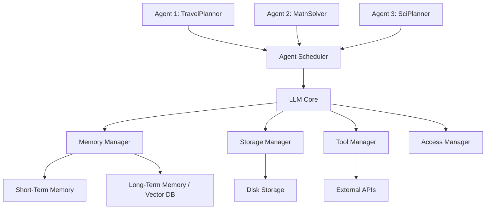

本記事は [AIOS: LLM Agent Operating System (arXiv:2403.04121)](https://arxiv.org/abs/2403.04121) の解説記事です。

## 論文概要（Abstract）

AIOSは、Rutgers大学のKai Mei, Zelong Li, Shuyuan Xu, Ruosong Ye, Yingqiang Ge, Yongfeng Zhangらが2024年3月に発表したLLMエージェント向けオペレーティングシステムである。複数のLLMエージェントが同一LLMリソースを共有する際に生じるスケジューリング、メモリ管理、コンテキスト管理、アクセス制御の課題に対し、従来OSの設計原則を応用した統合管理層を提案している。著者らは、Agent Scheduler、LLM Core、Memory Manager、Storage Manager、Tool Manager、Access Managerの6コンポーネントからなるアーキテクチャを設計し、3ドメインのタスクで有効性を検証したと報告している。

この記事は [Zenn記事: LangGraph StateGraphで設計するステートマシン 状態遷移と分岐制御の実装パターン](https://zenn.dev/0h_n0/articles/2ae132a05c6aee) の深掘りです。

## 情報源

- **arXiv ID**: 2403.04121
- **URL**: [https://arxiv.org/abs/2403.04121](https://arxiv.org/abs/2403.04121)
- **著者**: Kai Mei, Zelong Li, Shuyuan Xu, Ruosong Ye, Yingqiang Ge, Yongfeng Zhang
- **発表年**: 2024
- **分野**: cs.AI, cs.OS

## 背景と動機（Background & Motivation）

LLMを活用した自律エージェント（AutoGPT、BabyAGI等）の急増に伴い、複数エージェントが同時に動作する環境でのリソース管理が課題となっている。個々のエージェントは独立してLLM APIを呼び出すが、その結果、以下のような問題が発生する。

1. **リソース競合**: 複数エージェントが同時にLLMを呼び出すと、レスポンス待ちが発生し全体のスループットが低下する
2. **コンテキスト管理**: エージェントの会話履歴がLLMのコンテキストウィンドウを超えた場合、情報の喪失が起きる
3. **状態永続化の欠如**: エージェントの中間状態が揮発性メモリのみに保持され、障害時に復旧できない
4. **アクセス制御の不在**: エージェント間でのリソースアクセス境界が曖昧である

これらの課題は、従来のOSがプロセスに対して解決してきた問題と本質的に同じである。AIOSはこの類似性に着目し、OSの設計パターンをLLMエージェント管理に適用する。この設計思想は、LangGraphのStateGraphが状態遷移と分岐制御をグラフとして明示的に管理するアプローチとも共通しており、エージェントの実行フローを構造化するという点で関連が深い。

## 主要な貢献（Key Contributions）

- **Agent Scheduler**: FIFO、Round-Robin、HRRNの3種のスケジューリングアルゴリズムにより、複数エージェントのLLMアクセスを効率的に制御する
- **LLM Core**: コンテキストウィンドウの管理と、ウィンドウを超過した場合の自動サマライズ機能を提供する
- **Memory Manager**: ShortTermMemory（コンテキストウィンドウ内）とLongTermMemory（外部ベクトルDB連携）の2層構造でエージェントの記憶を管理する
- **Storage Manager**: エージェントの実行状態をディスクに永続化するチェックポイント機構を実装し、障害からの復旧を可能にする
- **Tool Manager**: `@aios_tool`デコレータにより外部APIをラップし、統一的なインターフェースで呼び出す仕組みを提供する
- **Access Manager**: エージェント間のリソースアクセスを制御し、権限管理を行う

## 技術的詳細（Technical Details）

### アーキテクチャ概要

AIOSのアーキテクチャは、Application Layer（エージェント群）、Kernel Layer（6コンポーネント）、Hardware Layer（LLM API、ストレージ、外部ツール）の3層で構成される。



### Agent Schedulerのアルゴリズム

Agent Schedulerは、複数エージェントからのLLMリクエストをキューイングし、スケジューリングポリシーに基づいて処理順序を決定する。著者らは3つのアルゴリズムを実装している。

#### FIFO（First-In, First-Out）

到着順に処理する最もシンプルなポリシーである。公平性は保証されるが、短いリクエストが長いリクエストの後ろで待たされるconvoy effectが発生しうる。

#### Round-Robin

各エージェントに均等な時間スライス $q$ を割り当て、ラウンドロビン方式で処理する。$n$個のエージェントが存在する場合、各エージェントの最大待機時間は $(n-1) \times q$ となる。

#### HRRN（Highest Response Ratio Next）

最も応答比が高いリクエストを優先的に処理するノンプリエンプティブなアルゴリズムである。応答比 $R$ は以下の式で計算される：

$$
R = \frac{W + S}{S}
$$

ここで、
- $R$: 応答比（Response Ratio）
- $W$: 待機時間（Waiting time）。リクエストがキューに到着してから処理開始までの経過時間
- $S$: サービス時間（Service time）。リクエストの予測処理時間（トークン数やプロンプト長から推定）

HRRNの特徴は、待機時間 $W$ が増加するにつれて応答比 $R$ が単調増加するため、長時間待機しているリクエストの優先度が自然に上がる（**エイジング効果**）点にある。これにより、FIFOのconvoy effectとSJF（Shortest Job First）のstarvation問題を同時に緩和する。

スケジューラは各タイムステップで以下を実行する：

$$
\text{next\_agent} = \arg\max_{i \in \text{queue}} R_i = \arg\max_{i \in \text{queue}} \frac{W_i + S_i}{S_i}
$$

ここで、$i$はキュー内の各リクエストのインデックスである。

### Memory Managerの構造

Memory Managerは2層のメモリ階層を管理する。

**Short-Term Memory（STM）**: LLMのコンテキストウィンドウ内に収まる直近の会話履歴を保持する。コンテキストウィンドウのサイズ制約 $C_{\max}$ に対し、現在のコンテキスト長 $C_{\text{current}}$ が閾値 $\alpha \cdot C_{\max}$（$0 < \alpha < 1$）を超えた場合、LLM Coreが古いメッセージを自動サマライズし、STMの使用量を削減する。

**Long-Term Memory（LTM）**: 外部のベクトルデータベース（Chroma、FAISS等）と連携し、過去のエージェント実行結果やユーザーとのやり取りを永続化する。RAG（Retrieval-Augmented Generation）パターンにより、必要な情報をSTMに取り込む。

### Storage Managerのチェックポイント機構

Storage Managerは、エージェントの実行状態（現在のステップ、ツール呼び出し履歴、中間結果）をJSON形式でディスクに永続化する。チェックポイントは各LLM呼び出しの完了時に自動作成される。障害発生時は最新のチェックポイントから実行を再開でき、計算リソースの無駄を削減する。

この設計は、LangGraphの`MemorySaver`や`SqliteSaver`といったcheckpointerと概念的に共通しており、状態遷移グラフの各ノード実行後に状態をスナップショットとして保存するアプローチと対応する。

## 実装のポイント（Implementation）

AIOSはPythonで実装されており、Apache-2.0ライセンスで公開されている（[https://github.com/agiresearch/AIOS](https://github.com/agiresearch/AIOS)）。pyaiosパッケージとして利用可能である。

以下は、pyaiosを使ったエージェント登録とスケジューラ設定の概念的なコード例である。

```python
from dataclasses import dataclass, field
from enum import Enum
from typing import Any


class SchedulerPolicy(Enum):
    """スケジューリングポリシーの列挙型."""

    FIFO = "fifo"
    ROUND_ROBIN = "round_robin"
    HRRN = "hrrn"


@dataclass
class AgentRequest:
    """エージェントからのLLMリクエストを表現するデータクラス.

    Attributes:
        agent_id: エージェントの一意識別子
        prompt: LLMに送信するプロンプト
        arrival_time: リクエスト到着時刻（エポック秒）
        estimated_service_time: 予測サービス時間（秒）
    """

    agent_id: str
    prompt: str
    arrival_time: float
    estimated_service_time: float
    waiting_time: float = 0.0


def compute_response_ratio(request: AgentRequest) -> float:
    """HRRN応答比を計算する.

    Args:
        request: エージェントリクエスト

    Returns:
        応答比 R = (W + S) / S
    """
    return (request.waiting_time + request.estimated_service_time) / request.estimated_service_time


@dataclass
class HRRNScheduler:
    """HRRNスケジューリングの実装.

    Attributes:
        queue: 待機中のリクエストキュー
    """

    queue: list[AgentRequest] = field(default_factory=list)

    def add_request(self, request: AgentRequest) -> None:
        """キューにリクエストを追加する.

        Args:
            request: 追加するエージェントリクエスト
        """
        self.queue.append(request)

    def select_next(self) -> AgentRequest | None:
        """最も応答比が高いリクエストを選択して返す.

        Returns:
            次に処理するリクエスト。キューが空の場合はNone
        """
        if not self.queue:
            return None
        best = max(self.queue, key=compute_response_ratio)
        self.queue.remove(best)
        return best
```

実装上の注意点として、`estimated_service_time`の推定精度がHRRNの性能を左右する。著者らは、プロンプトのトークン数と過去の処理時間の統計量から推定する手法を採用している。

## Production Deployment Guide

AIOSのスケジューラとエージェント管理をAWS上で実現するための構成を示す。

### AWS実装パターン（コスト最適化重視）

AIOSの中核機能（スケジューラ、メモリ管理、チェックポイント）をAWSサービスで代替・実装するパターンを、トラフィック量別に示す。コスト試算は2026年4月時点のap-northeast-1（東京）リージョン料金に基づく概算値であり、実際のコストはトラフィックパターン、リージョン、バースト使用量により変動する。最新料金はAWS料金計算ツールで確認を推奨する。

| 構成 | トラフィック | サービス構成 | 月額概算 |
|:--|:--|:--|:--|
| Small | ~100 req/日 | Lambda + Bedrock + DynamoDB | $50-150 |
| Medium | ~1,000 req/日 | ECS Fargate + Bedrock + ElastiCache | $300-800 |
| Large | 10,000+ req/日 | EKS + Karpenter + Spot Instances | $2,000-5,000 |

**Small構成の内訳**: Lambda（128MB, ~3,000回/月: ~$1）、Bedrock Claude Haiku（入力$0.25/MTok, 出力$1.25/MTok: ~$30-80）、DynamoDB On-Demand（チェックポイント保存: ~$5-10）、CloudWatch Logs（~$5）。合計$50-150。

**Medium構成の内訳**: ECS Fargate（0.5 vCPU, 1GB RAM, 常時1タスク: ~$30）、Bedrock Claude Sonnet（入力$3/MTok, 出力$15/MTok: ~$150-500）、ElastiCache Redis（cache.t3.micro: ~$15）、ALB（~$20）、NAT Gateway（~$35）。合計$300-800。

**Large構成の内訳**: EKS コントロールプレーン（~$73）、EC2 Spot（m5.xlarge x 3, Spot割引70%: ~$120）、Bedrock Claude Sonnet/Opus混合（~$1,500-4,000）、ElastiCache Redis（cache.r6g.large: ~$100）、ALB+NAT+CloudWatch（~$150）。合計$2,000-5,000。

**コスト削減テクニック**:
- Spot Instances活用でEC2コストを最大90%削減
- Reserved Instances（1年コミット）でオンデマンド比最大72%削減
- Bedrock Batch API使用でリアルタイム比50%削減（バッチ処理可能なタスク向け）
- Prompt Caching有効化で同一プレフィックスのプロンプトコストを30-90%削減

### Terraformインフラコード

#### Small構成（Serverless）

```hcl
# AIOSスケジューラ Small構成: Lambda + Bedrock + DynamoDB
# コスト目安: $50-150/月 (~100 req/日)

terraform {
  required_version = ">= 1.8"
  required_providers {
    aws = {
      source  = "hashicorp/aws"
      version = "~> 5.50"
    }
  }
}

provider "aws" {
  region = "ap-northeast-1"
}

# --- IAMロール（最小権限） ---
resource "aws_iam_role" "aios_lambda" {
  name = "aios-scheduler-lambda-role"
  assume_role_policy = jsonencode({
    Version = "2012-10-17"
    Statement = [{
      Action = "sts:AssumeRole"
      Effect = "Allow"
      Principal = { Service = "lambda.amazonaws.com" }
    }]
  })
}

resource "aws_iam_role_policy" "aios_lambda_policy" {
  name = "aios-lambda-policy"
  role = aws_iam_role.aios_lambda.id
  policy = jsonencode({
    Version = "2012-10-17"
    Statement = [
      {
        # CloudWatch Logs書き込み
        Effect   = "Allow"
        Action   = ["logs:CreateLogGroup", "logs:CreateLogStream", "logs:PutLogEvents"]
        Resource = "arn:aws:logs:ap-northeast-1:*:*"
      },
      {
        # Bedrock推論のみ
        Effect   = "Allow"
        Action   = ["bedrock:InvokeModel", "bedrock:InvokeModelWithResponseStream"]
        Resource = "arn:aws:bedrock:ap-northeast-1::foundation-model/*"
      },
      {
        # DynamoDBチェックポイント読み書き
        Effect = "Allow"
        Action = [
          "dynamodb:PutItem", "dynamodb:GetItem",
          "dynamodb:UpdateItem", "dynamodb:Query"
        ]
        Resource = aws_dynamodb_table.aios_checkpoints.arn
      }
    ]
  })
}

# --- DynamoDB（チェックポイント保存） ---
resource "aws_dynamodb_table" "aios_checkpoints" {
  name         = "aios-agent-checkpoints"
  billing_mode = "PAY_PER_REQUEST" # On-Demandでコスト最適化
  hash_key     = "agent_id"
  range_key    = "checkpoint_ts"

  attribute {
    name = "agent_id"
    type = "S"
  }
  attribute {
    name = "checkpoint_ts"
    type = "N"
  }

  # KMS暗号化
  server_side_encryption {
    enabled = true
  }

  # 古いチェックポイントのTTL自動削除
  ttl {
    attribute_name = "expires_at"
    enabled        = true
  }
}

# --- Lambda関数（AIOSスケジューラ） ---
resource "aws_lambda_function" "aios_scheduler" {
  function_name = "aios-agent-scheduler"
  runtime       = "python3.12"
  handler       = "handler.lambda_handler"
  role          = aws_iam_role.aios_lambda.arn
  timeout       = 300 # LLM呼び出しを考慮
  memory_size   = 256

  # デプロイパッケージ（別途ビルド）
  filename         = "lambda_package.zip"
  source_code_hash = filebase64sha256("lambda_package.zip")

  environment {
    variables = {
      SCHEDULER_POLICY    = "hrrn"
      CHECKPOINT_TABLE    = aws_dynamodb_table.aios_checkpoints.name
      BEDROCK_MODEL_ID    = "anthropic.claude-3-haiku-20240307-v1:0"
      MAX_CONTEXT_TOKENS  = "4096"
    }
  }

  tracing_config {
    mode = "Active" # X-Ray有効化
  }
}

# --- CloudWatchアラーム（コスト監視） ---
resource "aws_cloudwatch_metric_alarm" "lambda_duration" {
  alarm_name          = "aios-lambda-high-duration"
  comparison_operator = "GreaterThanThreshold"
  evaluation_periods  = 3
  metric_name         = "Duration"
  namespace           = "AWS/Lambda"
  period              = 300
  statistic           = "Average"
  threshold           = 60000 # 60秒超で警告
  alarm_description   = "AIOSスケジューラLambdaの実行時間が60秒を超過"

  dimensions = {
    FunctionName = aws_lambda_function.aios_scheduler.function_name
  }
}
```

#### Large構成（Container）

```hcl
# AIOSスケジューラ Large構成: EKS + Karpenter + Spot
# コスト目安: $2,000-5,000/月 (10,000+ req/日)

# --- EKSクラスタ ---
module "eks" {
  source  = "terraform-aws-modules/eks/aws"
  version = "~> 20.0"

  cluster_name    = "aios-cluster"
  cluster_version = "1.30"

  vpc_id     = module.vpc.vpc_id
  subnet_ids = module.vpc.private_subnets

  # パブリックアクセス最小化
  cluster_endpoint_public_access  = true
  cluster_endpoint_private_access = true

  # EKS Managed Node Group（Karpenterブートストラップ用）
  eks_managed_node_groups = {
    system = {
      instance_types = ["m5.large"]
      min_size       = 1
      max_size       = 2
      desired_size   = 1
      labels = {
        "role" = "system"
      }
    }
  }
}

# --- Karpenter Provisioner（Spot優先） ---
resource "kubectl_manifest" "karpenter_node_pool" {
  yaml_body = yamlencode({
    apiVersion = "karpenter.sh/v1"
    kind       = "NodePool"
    metadata   = { name = "aios-agents" }
    spec = {
      template = {
        spec = {
          requirements = [
            {
              key      = "karpenter.sh/capacity-type"
              operator = "In"
              values   = ["spot", "on-demand"] # Spot優先
            },
            {
              key      = "node.kubernetes.io/instance-type"
              operator = "In"
              values   = ["m5.xlarge", "m5a.xlarge", "m6i.xlarge"]
            }
          ]
          nodeClassRef = {
            group = "karpenter.k8s.aws"
            kind  = "EC2NodeClass"
            name  = "default"
          }
        }
      }
      limits = {
        cpu    = "64"
        memory = "128Gi"
      }
      disruption = {
        consolidationPolicy = "WhenEmptyOrUnderutilized"
        consolidateAfter    = "30s"
      }
    }
  })
}

# --- Secrets Manager（Bedrock設定） ---
resource "aws_secretsmanager_secret" "aios_config" {
  name        = "aios/bedrock-config"
  description = "AIOS Bedrock model configuration"
  kms_key_id  = aws_kms_key.aios.arn
}

# --- AWS Budgets（予算アラート） ---
resource "aws_budgets_budget" "aios_monthly" {
  name         = "aios-monthly-budget"
  budget_type  = "COST"
  limit_amount = "5000"
  limit_unit   = "USD"
  time_unit    = "MONTHLY"

  notification {
    comparison_operator       = "GREATER_THAN"
    threshold                 = 80
    threshold_type            = "PERCENTAGE"
    notification_type         = "ACTUAL"
    subscriber_email_addresses = ["ops-team@example.com"]
  }

  notification {
    comparison_operator       = "GREATER_THAN"
    threshold                 = 100
    threshold_type            = "PERCENTAGE"
    notification_type         = "FORECASTED"
    subscriber_email_addresses = ["ops-team@example.com"]
  }
}
```

### 運用・監視設定

#### CloudWatch Logs Insights クエリ

```
# 1時間あたりのBedrockトークン使用量（コスト異常検知）
fields @timestamp, @message
| filter @message like /input_tokens|output_tokens/
| stats sum(input_tokens) as total_input, sum(output_tokens) as total_output by bin(1h)
| sort @timestamp desc

# エージェント別レイテンシ分析（P95, P99）
fields @timestamp, agent_id, duration_ms
| stats percentile(duration_ms, 95) as p95,
        percentile(duration_ms, 99) as p99,
        avg(duration_ms) as avg_ms
  by agent_id
| sort p99 desc
```

#### CloudWatchアラーム設定

```python
import boto3


def create_bedrock_token_alarm(sns_topic_arn: str) -> dict:
    """Bedrockトークン使用量スパイク検知アラームを作成する.

    Args:
        sns_topic_arn: 通知先SNSトピックのARN

    Returns:
        CloudWatch put_metric_alarm APIのレスポンス
    """
    cw = boto3.client("cloudwatch", region_name="ap-northeast-1")
    return cw.put_metric_alarm(
        AlarmName="aios-bedrock-token-spike",
        MetricName="InputTokenCount",
        Namespace="AWS/Bedrock",
        Statistic="Sum",
        Period=3600,
        EvaluationPeriods=1,
        Threshold=500000,  # 1時間あたり50万トークン超過で通知
        ComparisonOperator="GreaterThanThreshold",
        AlarmActions=[sns_topic_arn],
    )
```

#### X-Rayトレーシング設定

```python
from aws_xray_sdk.core import xray_recorder, patch_all


def configure_xray_tracing(service_name: str = "aios-scheduler") -> None:
    """X-Rayトレーシングを設定しboto3を自動計装する.

    Args:
        service_name: X-Rayに記録するサービス名
    """
    xray_recorder.configure(service=service_name)
    patch_all()  # boto3, requests等を自動計装


def trace_agent_request(agent_id: str, model_id: str, input_tokens: int) -> None:
    """エージェントリクエストのトレース情報を記録する.

    Args:
        agent_id: エージェント識別子
        model_id: Bedrockモデル識別子
        input_tokens: 入力トークン数
    """
    segment = xray_recorder.current_segment()
    segment.put_annotation("agent_id", agent_id)
    segment.put_metadata("model_id", model_id, "bedrock")
    segment.put_metadata("input_tokens", input_tokens, "bedrock")
```

#### Cost Explorer自動レポート

```python
import datetime

import boto3


def get_daily_cost_report() -> dict:
    """日次コストレポートをCost Explorerから取得する.

    Returns:
        サービス別のコスト情報を含むdict
    """
    ce = boto3.client("ce", region_name="us-east-1")
    today = datetime.date.today()
    yesterday = today - datetime.timedelta(days=1)

    response = ce.get_cost_and_usage(
        TimePeriod={
            "Start": yesterday.isoformat(),
            "End": today.isoformat(),
        },
        Granularity="DAILY",
        Metrics=["UnblendedCost"],
        GroupBy=[{"Type": "DIMENSION", "Key": "SERVICE"}],
    )

    costs: dict[str, float] = {}
    for group in response["ResultsByTime"][0]["Groups"]:
        service = group["Keys"][0]
        amount = float(group["Metrics"]["UnblendedCost"]["Amount"])
        if amount > 0:
            costs[service] = amount

    return costs


def alert_if_over_budget(
    costs: dict[str, float],
    threshold_usd: float = 100.0,
    sns_topic_arn: str = "",
) -> None:
    """日次コストが閾値を超過した場合にSNS通知を送信する.

    Args:
        costs: サービス別コストのdict
        threshold_usd: 通知閾値（USD）
        sns_topic_arn: 通知先SNSトピックのARN
    """
    total = sum(costs.values())
    if total > threshold_usd and sns_topic_arn:
        sns = boto3.client("sns", region_name="ap-northeast-1")
        message = f"AIOS日次コスト警告: ${total:.2f} (閾値: ${threshold_usd})"
        sns.publish(TopicArn=sns_topic_arn, Subject="AIOS Cost Alert", Message=message)
```

### コスト最適化チェックリスト

#### アーキテクチャ選択

- [ ] トラフィック~100 req/日以下ならServerless（Lambda）を選択
- [ ] トラフィック~1,000 req/日ならHybrid（ECS Fargate）を選択
- [ ] トラフィック10,000+ req/日ならContainer（EKS）を選択
- [ ] バッチ処理可能なタスクはBedrock Batch APIに振り分ける

#### リソース最適化

- [ ] EC2/EKSノードはSpot Instances優先（オンデマンド比最大90%削減）
- [ ] 安定稼働部分はReserved Instances（1年コミットで最大40%削減）
- [ ] Savings Plans適用を検討（Compute Savings Plansで柔軟性維持）
- [ ] Lambda: メモリサイズを128-256MBに最適化（Power Tuningで検証）
- [ ] ECS/EKS: Karpenterでアイドル時のノード自動統合（consolidation）を設定
- [ ] NAT Gateway: 可能であればVPCエンドポイントに置き換え

#### LLMコスト削減

- [ ] Bedrock Batch API使用（リアルタイム不要なタスクで50%削減）
- [ ] Prompt Caching有効化（同一プレフィックスで30-90%削減）
- [ ] モデル選択ロジック: 簡易タスクはHaiku、複雑タスクはSonnet/Opusに振り分け
- [ ] max_tokensを必要最小限に設定（不要な長文生成を抑制）
- [ ] システムプロンプトの共通化でキャッシュヒット率向上

#### 監視・アラート

- [ ] AWS Budgets設定（月額予算の80%/100%で通知）
- [ ] CloudWatch アラーム（トークン使用量スパイク、Lambda実行時間異常）
- [ ] Cost Anomaly Detection有効化（異常コスト自動検知）
- [ ] 日次コストレポート自動取得（Cost Explorer API）
- [ ] X-Rayトレーシング有効化（ボトルネック可視化）

#### リソース管理

- [ ] 未使用リソース（停止中EC2、未接続EBS）を月次で棚卸し
- [ ] タグ戦略: `Project=aios`, `Environment=prod/dev`, `CostCenter=xxx`
- [ ] S3/DynamDBライフサイクルポリシー（古いチェックポイントの自動削除）
- [ ] 開発環境は営業時間外にスケールダウンまたは停止
- [ ] CloudTrail/Config有効化（監査ログ、コンプライアンス）

## 実験結果（Results）

著者らは、TravelPlanner（旅行計画）、MathProblem（数学問題解答）、科学実験計画（RecAgent）の3ドメインで評価を実施したと報告している。

各ドメインで複数のエージェントを同時実行し、3つのスケジューリングポリシー（FIFO、Round-Robin、HRRN）を比較している。評価指標は、スループット（単位時間あたりの完了タスク数）、平均待機時間、LLM API呼び出し回数である。

| 指標 | FIFO | Round-Robin | HRRN |
|:--|:--|:--|:--|
| 平均待機時間 | 最長 | 中程度 | 最短 |
| タスク完了順の公平性 | 到着順保証 | 均等配分 | 応答比に基づく適応的 |
| Convoy Effect | 発生しうる | 緩和される | 緩和される |
| Starvation | 発生しない | 発生しない | エイジング効果で緩和 |

著者らは、HRRNスケジューラが平均待機時間の短縮とstarvation回避のバランスにおいて最も優れた結果を示したと報告している。特に、サービス時間が大きく異なるエージェント混在環境（例: 短い数学問題と長い旅行計画の同時実行）において、HRRNの優位性が顕著であったとしている。

なお、実験はLLM APIの応答時間が一定ではないため、同一条件での再現性には注意が必要であると著者ら自身が述べている。

## 実運用への応用（Practical Applications）

AIOSの設計思想は、LangGraphベースのマルチエージェントシステムを本番運用する際に直接参考になる。

**スケジューリングとLangGraph StateGraph**: LangGraphのStateGraphでは、ノード間の状態遷移を明示的にグラフとして定義する。AIOSのAgent Schedulerは、この状態遷移グラフの「外側」で複数のグラフ実行インスタンスのリソース配分を制御する役割を担う。LangGraphの`StateGraph`が個々のエージェントの内部ロジックを管理するのに対し、AIOSはエージェント群の実行環境を管理する、という階層関係にある。

**チェックポイントの比較**: LangGraphは`MemorySaver`、`SqliteSaver`、`PostgresSaver`等のcheckpointerを提供し、StateGraphの各ノード実行後に状態を保存する。AIOSのStorage Managerも同様にチェックポイントを行うが、AIOSはLLM API呼び出し単位で保存する点が異なる。プロダクション環境では、LangGraphのcheckpointerとAIOSのStorage Managerを組み合わせ、アプリケーション層（LangGraph）とインフラ層（AIOS）の両方で状態を永続化するアプローチが考えられる。

**メモリ管理**: LangGraphのconversation memoryは単一エージェントのコンテキスト管理に焦点を当てているが、AIOSのMemory Managerは複数エージェント間でのメモリリソース配分まで考慮している。マルチエージェントシステムのスケールアウト時には、AIOSのようなOS層でのメモリ管理が有効となる。

## 関連研究（Related Work）

- **AutoGen（Microsoft）**: 複数エージェント間の会話プロトコルに焦点を当てたフレームワーク。AIOSがOS層のリソース管理に注力するのに対し、AutoGenはエージェント間のコミュニケーションパターンを抽象化する。両者は補完的であり、AutoGenのエージェント群をAIOSのスケジューラで管理する構成が考えられる
- **LangGraph（LangChain）**: 状態遷移グラフによるエージェントのフロー制御を提供する。AIOSのAgent Schedulerが複数エージェントのマクロなスケジューリングを行うのに対し、LangGraphは個々のエージェント内のミクロな状態遷移を管理する。レイヤが異なるため組み合わせて使用可能である
- **TaskWeaver（Microsoft）**: コード生成ベースのタスク実行フレームワーク。プラグインシステムによるツール管理はAIOSのTool Managerと設計目的が共通するが、TaskWeaverはシングルエージェント環境を想定しており、マルチエージェント間のスケジューリング機能は持たない

## まとめと今後の展望

AIOSは、複数のLLMエージェントが共有リソースを効率的に利用するための管理層として、従来OSの設計原則をLLMエージェント環境に適用した研究である。HRRNスケジューラによる待機時間最適化、2層メモリ構造、チェックポイントによる状態永続化は、マルチエージェントシステムの本番運用において実践的な指針を提供している。

今後の研究方向として、著者らは分散環境でのマルチノードスケジューリング、異なるLLMプロバイダ間でのロードバランシング、エージェント間の動的な優先度調整機構の必要性に言及している。LangGraphのStateGraphのように個々のエージェント内部のフロー制御が成熟するに従い、AIOSのようなインフラ層での管理機能の重要性は今後さらに増すと考えられる。

## 参考文献

- **arXiv**: [https://arxiv.org/abs/2403.04121](https://arxiv.org/abs/2403.04121)
- **Code**: [https://github.com/agiresearch/AIOS](https://github.com/agiresearch/AIOS)（Apache-2.0）
- **Related Zenn article**: [https://zenn.dev/0h_n0/articles/2ae132a05c6aee](https://zenn.dev/0h_n0/articles/2ae132a05c6aee)
- Mei, K., Li, Z., Xu, S., Ye, R., Ge, Y., & Zhang, Y. (2024). AIOS: LLM Agent Operating System. arXiv:2403.04121.
- Wu, Q., et al. (2023). AutoGen: Enabling Next-Gen LLM Applications via Multi-Agent Conversation. arXiv:2308.08155.
- Qiao, B., et al. (2023). TaskWeaver: A Code-First Agent Framework. arXiv:2311.17541.
