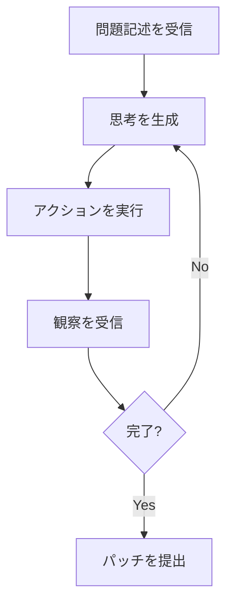

本記事は [SWE-agent: Agent-Computer Interfaces Enable Automated Software Engineering (arXiv:2403.07974)](https://arxiv.org/abs/2403.07974) の解説記事です。

## 論文概要（Abstract）

SWE-agentは、Princeton NLPグループが2024年3月に発表し、NeurIPS 2024に採択されたコーディングエージェントシステムである。著者ら（John Yang, Carlos E. Jimenez, Alexander Weinstein-Raun, Kilian Lieret, Ofir Press, Karthik Narasimhan）は、LMエージェントが標準的なLinuxシェルを介してコンピュータと対話する際、インターフェース設計がタスク解決率に決定的な影響を与えることを実験的に示した。SWE-agentは「Agent-Computer Interface（ACI）」という概念を導入し、LMエージェント専用に設計されたカスタムコマンドとフィードバック機構を提供する。Claude 3 OpusをバックボーンLLMとして使用した場合、SWE-benchで12.47%、SWE-bench Liteで23.7%の解決率を達成したと報告されている。

この記事は [Zenn記事: SWE-bench Pro完全解説 設計思想・タスク構成・失敗モード分析まで](https://zenn.dev/0h_n0/articles/fdf05c90ae9035) の深掘りです。

## 情報源

- **arXiv ID**: 2403.07974
- **URL**: [https://arxiv.org/abs/2403.07974](https://arxiv.org/abs/2403.07974)
- **著者**: John Yang, Carlos E. Jimenez, Alexander Weinstein-Raun, Kilian Lieret, Ofir Press, Karthik Narasimhan
- **発表年**: 2024
- **分野**: cs.SE, cs.AI, cs.CL
- **カンファレンス**: NeurIPS 2024

## 背景と動機（Background & Motivation）

ソフトウェアエンジニアリングタスク（バグ修正、機能実装）では、複数ファイルにわたるコードの読み書きと実行が要求される。しかし、LMエージェントが使用するインターフェースはこれまで十分に検討されてこなかった。

著者らは、人間向けのインターフェース（GUI、CLIシェル）はHCI（Human-Computer Interaction）の研究を通じて注意深く設計されてきたが、LMエージェント向けのインターフェース設計には同等の注意が払われていないと指摘している。著者らの表現を借りれば、「LMエージェントに標準シェルを使わせることは、人間プログラマにバイナリでコーディングさせるのに等しい」とのことである。

この洞察に基づき、SWE-agentは「Agent-Computer Interface（ACI）」という概念を提案し、LMの能力と制約に合わせたインターフェースを設計することで、タスク解決率の大幅な向上を目指している。

## 主要な貢献（Key Contributions）

- **ACI（Agent-Computer Interface）の概念提案**: LMエージェント専用のインターフェース設計パラダイムを提案。HCIの対概念として位置付けている
- **カスタムコマンド群の設計**: ファイル閲覧、検索、編集のための8つのカスタムコマンドを実装し、標準シェル比で最大3倍の性能向上を実証
- **ACI設計決定のアブレーション分析**: ガードレール、コンテキスト管理、アクション空間効率、フィードバック簡潔性の4要素がそれぞれ性能に与える影響を定量化
- **オープンソース公開**: システム全体を[https://swe-agent.com](https://swe-agent.com)で公開

## 技術的詳細（Technical Details）

### ACIの3要素

著者らが設計したACIは、以下の3つのコンポーネントで構成される：

1. **コマンド（Commands）**: エージェントが実行可能なbashコマンドとカスタムコマンドの集合
2. **観察（Observations）**: 各アクション実行後にエージェントが受け取るフィードバック
3. **対話履歴（Interaction History）**: アクションと観察の履歴を会話形式で保持

### カスタムコマンド群

SWE-agentは以下の8つのカスタムコマンドを提供する：

| コマンド | 機能 | 設計意図 |
|:--|:--|:--|
| `open` | ファイルを開き、100行ウィンドウで表示 | コンテキスト溢れ防止 |
| `scroll_down` / `scroll_up` | 表示ウィンドウのスクロール | ファイルナビゲーション |
| `goto` | 指定行へジャンプ | 効率的な移動 |
| `search_dir` | ディレクトリ全体で文字列検索 | コードベース探索 |
| `search_file` | 開いているファイル内で検索 | ファイル内探索 |
| `find_file` | ファイル名で検索 | ファイル発見 |
| `edit` | 指定行範囲を編集（リンター統合） | 安全な編集 |
| `create` | 新規ファイル作成 | ファイル生成 |

### リンター統合の仕組み

`edit`コマンドの設計で最も重要な決定は、**リンター（flake8）の統合**である。エージェントが`edit`コマンドを実行すると、ACIは即座にflake8でファイルを検証する。構文エラーが検出された場合、**編集は拒否され**、エージェントにエラー情報が返される。

```python
def edit_command(file_path: str, start_line: int, end_line: int, new_content: str) -> str:
    """edit コマンドの概念的な実装"""
    original = read_file(file_path)
    modified = apply_edit(original, start_line, end_line, new_content)
    write_file(file_path, modified)

    lint_result = run_flake8(file_path)
    if lint_result.has_errors:
        write_file(file_path, original)  # ロールバック
        return f"Edit rejected: {lint_result.errors}"

    return f"Edit applied successfully (lines {start_line}-{end_line})"
```

この機構により、構文的に不正な編集が蓄積することを防ぎ、エージェントに即座の修正フィードバックを提供する。著者らの報告によれば、リンター統合の有無でSWE-bench Liteの解決率が18.3%から15.0%へ低下する（-3.3ポイント）。

### ファイルビューアの設計

標準的な`cat`コマンドはファイル全体をダンプするため、大きなファイルではコンテキストウィンドウを浪費する。SWE-agentのファイルビューアは**100行ウィンドウ**で表示し、ヘッダーにファイル名、行範囲、総行数を表示する。

著者らのアブレーション実験では、ファイルビューアの除去（`cat`への置換）で解決率が18.3%から8.3%へ低下する（-10.0ポイント）。これは個別の設計要素として最大の影響を持つ。

### エージェントアーキテクチャ

SWE-agentは**ReActスタイルのループ**で動作する。各ステップで、エージェントは以下を生成する：

1. **思考（Thought）**: 次に何をするかの簡潔な説明
2. **アクション（Action）**: ACIで実行するコマンド

システムプロンプトにはACIコマンドの文書が含まれ、各ステップでLLM APIに完全な会話履歴（すべての先行アクションと観察）が渡される。実行はDockerコンテナ内でサンドボックス化されている。



## 実装のポイント（Implementation）

### Docker サンドボックス

各タスクの評価はDockerコンテナ内で実行される。コンテナには対象リポジトリの特定バージョン、依存関係、テストスイートが事前にインストールされている。エージェントのアクション（ファイル編集、コマンド実行）はすべてコンテナ内で行われ、ホストシステムへの影響を防止している。

### LLM統合

各ステップで完全な会話履歴をLLM APIに送信する設計を採用している。これにより、エージェントは先行するすべてのアクションと観察にアクセスできるが、長いセッションではコンテキストウィンドウの制約に直面する。

著者らはClaude 3 Opus、GPT-4、GPT-4 Turbo、Llama 3（8B）をバックボーンとしてテストしている。

### 観察の切り詰め

コマンド出力が非常に長い場合、ACIは先頭と末尾のみを表示し、中間部分を切り詰める。これにより、コンテキストウィンドウの浪費を防ぎつつ、重要な情報（エラーメッセージは通常先頭か末尾に出現）を保持する設計となっている。

## Production Deployment Guide

SWE-agentは実行可能なコーディングエージェントシステムであるため、本番環境への展開パターンを以下に示す。

### AWS実装パターン（コスト最適化重視）

| 規模 | 月間タスク数 | 推奨構成 | 月額コスト | 主要サービス |
|------|-----------|---------|-----------|------------|
| **Small** | ~100 | Serverless | $200-500 | Lambda + Bedrock + ECR |
| **Medium** | ~1,000 | Hybrid | $1,000-3,000 | ECS Fargate + Bedrock |
| **Large** | 10,000+ | Container | $5,000-15,000 | EKS + EC2 + Bedrock |

**Small構成の詳細**（月額$200-500）:
- **Lambda**: タスクディスパッチ、結果収集（$20/月）
- **ECS Fargate（Spot）**: Docker評価環境のオンデマンド実行（$80/月）
- **Bedrock**: Claude 3.5 Haiku、Prompt Caching有効（$100-300/月）
- **ECR**: Dockerイメージ保存（$5/月）
- **S3**: パッチ・ログ保存（$5/月）

**コスト削減テクニック**:
- Fargate Spot使用で最大70%削減
- Bedrock Prompt Caching有効化で30-90%削減
- モデル選択ロジック（簡易タスクはHaiku、複雑タスクはSonnet）

**コスト試算の注意事項**: 上記は2026年4月時点のAWS ap-northeast-1リージョン料金に基づく概算値です。実際のコストはタスク複雑度、モデル使用量により変動します。最新料金は[AWS料金計算ツール](https://calculator.aws/)で確認してください。

### Terraformインフラコード（Small構成）

```hcl
module "vpc" {
  source  = "terraform-aws-modules/vpc/aws"
  version = "~> 5.0"

  name = "swe-agent-vpc"
  cidr = "10.0.0.0/16"
  azs  = ["ap-northeast-1a", "ap-northeast-1c"]
  private_subnets = ["10.0.1.0/24", "10.0.2.0/24"]
  enable_nat_gateway = true
  single_nat_gateway = true
}

resource "aws_iam_role" "swe_agent_task" {
  name = "swe-agent-task-role"
  assume_role_policy = jsonencode({
    Version = "2012-10-17"
    Statement = [{
      Action = "sts:AssumeRole"
      Effect = "Allow"
      Principal = { Service = "ecs-tasks.amazonaws.com" }
    }]
  })
}

resource "aws_iam_role_policy" "bedrock_invoke" {
  role = aws_iam_role.swe_agent_task.id
  policy = jsonencode({
    Version = "2012-10-17"
    Statement = [{
      Effect   = "Allow"
      Action   = ["bedrock:InvokeModel", "bedrock:InvokeModelWithResponseStream"]
      Resource = "arn:aws:bedrock:ap-northeast-1::foundation-model/anthropic.claude-*"
    }]
  })
}

resource "aws_ecs_cluster" "swe_agent" {
  name = "swe-agent-cluster"
  setting {
    name  = "containerInsights"
    value = "enabled"
  }
}

resource "aws_ecs_task_definition" "swe_agent" {
  family                   = "swe-agent-task"
  requires_compatibilities = ["FARGATE"]
  network_mode             = "awsvpc"
  cpu                      = "2048"
  memory                   = "4096"
  task_role_arn            = aws_iam_role.swe_agent_task.arn
  execution_role_arn       = aws_iam_role.swe_agent_task.arn

  container_definitions = jsonencode([{
    name  = "swe-agent"
    image = "${aws_ecr_repository.swe_agent.repository_url}:latest"
    environment = [
      { name = "BEDROCK_MODEL_ID", value = "anthropic.claude-3-5-haiku-20241022-v1:0" },
      { name = "MAX_STEPS", value = "50" }
    ]
    logConfiguration = {
      logDriver = "awslogs"
      options = {
        "awslogs-group"  = "/ecs/swe-agent"
        "awslogs-region" = "ap-northeast-1"
      }
    }
  }])
}

resource "aws_ecr_repository" "swe_agent" {
  name                 = "swe-agent"
  image_tag_mutability = "MUTABLE"
  image_scanning_configuration { scan_on_push = true }
}
```

### 運用・監視設定

```python
import boto3

cloudwatch = boto3.client('cloudwatch')

cloudwatch.put_metric_alarm(
    AlarmName='swe-agent-task-failure-rate',
    ComparisonOperator='GreaterThanThreshold',
    EvaluationPeriods=1,
    MetricName='TaskFailureRate',
    Namespace='SWEAgent/ECS',
    Period=3600,
    Statistic='Average',
    Threshold=0.5,
    AlarmDescription='SWE-agentタスク失敗率50%超過'
)
```

### コスト最適化チェックリスト

- [ ] Fargate Spot使用（最大70%削減）
- [ ] Bedrock Prompt Caching有効化（30-90%削減）
- [ ] タスク複雑度に応じたモデル選択（Haiku/Sonnet切替）
- [ ] max_steps制限でトークン使用量上限設定
- [ ] アイドル時ECSタスク数0へスケールダウン
- [ ] ECRイメージライフサイクルポリシー設定
- [ ] CloudWatch Logs保持期間の最適化

## 実験結果（Results）

### メインの結果

著者らが報告しているSWE-bench（全2,294タスク）での結果：

| 手法 | 解決率 |
|:--|--:|
| SWE-agent (Claude 3 Opus) | 12.47% |
| SWE-agent (GPT-4) | 12.29% |
| SWE-agent (GPT-4 Turbo) | 11.57% |
| AutoCodeRover | 10.00% |
| Devin (サブセット) | 13.86% |
| RAG ベースライン | 1.31% |

SWE-bench Lite（300タスク）での結果：

| 手法 | 解決率 |
|:--|--:|
| SWE-agent (Claude 3 Opus) | 23.7% |
| SWE-agent (GPT-4 Turbo) | 21.7% |
| SWE-agent (GPT-4) | 18.3% |
| AutoCodeRover | 16.0% |
| RAG ベースライン | 3.00% |

### アブレーション実験

ACIの各設計要素の寄与を定量化したアブレーション結果（SWE-bench Lite、GPT-4）：

| 構成 | 解決率 | 差分 |
|:--|--:|--:|
| SWE-agent（フル） | 18.3% | — |
| リンターなし | 15.0% | -3.3pt |
| ファイルビューアなし | 8.3% | -10.0pt |
| Raw Shell | 6.7% | -11.6pt |

**ファイルビューアの除去が最大の影響**（-10.0ポイント）を持ち、Raw Shellへの後退で約2.7倍の性能低下が生じる。この結果は、インターフェース設計がモデル選択と同程度以上にタスク解決率に影響することを示している。

### モデル比較

同一ACI（SWE-agent）を使用した場合のバックボーンLLMの比較（SWE-bench Lite）：

| LLM | 解決率 |
|:--|--:|
| Claude 3 Opus | 23.7% |
| GPT-4 Turbo | 21.7% |
| GPT-4 | 18.3% |
| Llama 3 (8B) | 3.3% |

フロンティアモデルとオープンソースモデル（Llama 3 8B）の間に約20ポイントの差が存在し、LLMの能力がACI設計と同等に重要であることが示されている。

## 実運用への応用（Practical Applications）

SWE-agentの知見は、SWE-bench Proの文脈で特に重要な意味を持つ。SWE-bench Proの評価では、「エージェントスキャフォールディングの違いだけで同一モデルに5ポイント以上のスコア差が生じる」ことが報告されている。SWE-agentが示したACI設計の重要性は、この現象の理論的基盤を提供している。

具体的には、以下の設計原則が実務のエージェント開発に適用可能である：
- **コンテキスト管理の最適化**: ファイル全体のダンプを避け、ウィンドウ表示で関連部分のみを提示
- **即時フィードバックの提供**: 編集時のリンター統合により、構文エラーの蓄積を防止
- **アクション空間の効率化**: 複雑な操作を単一コマンドで表現し、必要ステップ数を削減

## 関連研究（Related Work）

- **Devin (Cognition Labs)**: プロプライエタリなコーディングエージェント。Webブラウザ、コードエディタ、ターミナルを使用。SWE-benchサブセットで13.86%を報告
- **AutoCodeRover**: プログラム解析技術とLMを組み合わせてパッチを生成。SWE-benchで10.00%
- **Agentless (2024)**: エージェントではなく、多段パイプラインでソフトウェアエンジニアリングタスクを解決する非エージェント的アプローチ

## まとめと今後の展望

SWE-agentは、ACIという概念を導入し、インターフェース設計がLMエージェントの性能に決定的な影響を与えることを実験的に実証した。Raw Shell比で約2.7倍の性能向上は、モデル性能の向上と同等以上にインターフェース設計が重要であることを示している。

著者らは、今後の改善はより大きく能力の高いLLMからだけでなく、注意深いインターフェース設計からも得られると結論付けている。SWE-bench Proの評価結果がこの主張を裏付けており、エージェントシステム設計の研究はコーディングエージェント開発における中核的テーマとなっている。

## 参考文献

- **arXiv**: [https://arxiv.org/abs/2403.07974](https://arxiv.org/abs/2403.07974)
- **Code**: [https://swe-agent.com](https://swe-agent.com)
- **NeurIPS 2024**: [https://papers.nips.cc/paper_files/paper/2024/file/5a7c947568c1b1328ccc5230172e1e7c-Paper-Conference.pdf](https://papers.nips.cc/paper_files/paper/2024/file/5a7c947568c1b1328ccc5230172e1e7c-Paper-Conference.pdf)
- **Related Zenn article**: [https://zenn.dev/0h_n0/articles/fdf05c90ae9035](https://zenn.dev/0h_n0/articles/fdf05c90ae9035)

---

:::message
本記事はAI（Claude Code）により自動生成された、arXiv論文の解説記事です。論文の主張を客観的に紹介することを目的としており、筆者独自の実験は行っていません。内容の正確性については原論文もご確認ください。
:::
