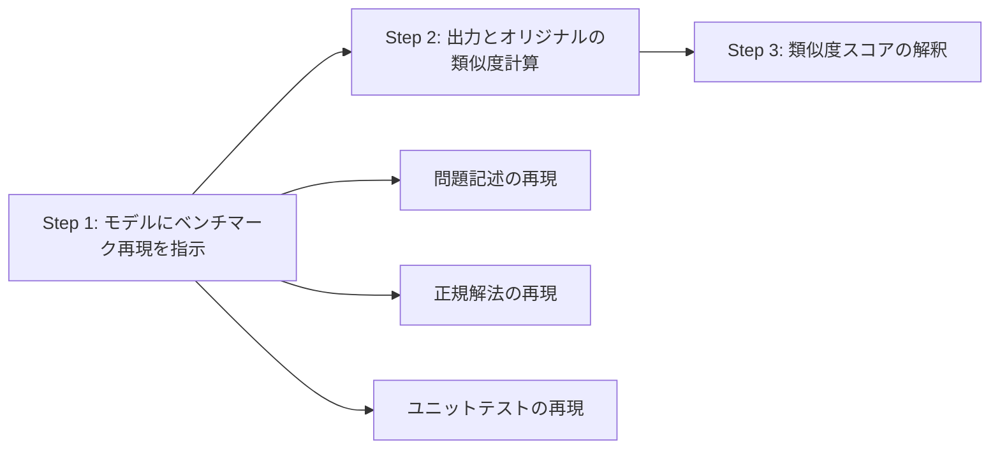

本記事は [Measuring Leakage in LLM-based Code Generation Benchmarks (arXiv:2503.01960)](https://arxiv.org/abs/2503.01960) の解説記事です。

## 論文概要（Abstract）

著者ら（Piotr Szymanski, Piotr Nawrot, Maciej Namysl）は、LLMベースのコード生成ベンチマークにおけるデータリーケージ（データ汚染）をブラックボックスで定量化する手法を提案している。モデルにベンチマークの問題を「再現」させ、生成結果とオリジナルの類似度を測定するというアプローチである。HumanEval、MBPP、LiveCodeBenchの3ベンチマークを対象に、GPT-4o、Claude 3.5 Sonnet、Gemini 1.5 Pro等の8モデルを評価した結果、HumanEvalとMBPPで高水準の記憶化が確認された一方、LiveCodeBenchではリーケージが大幅に低いことが報告されている。

この記事は [Zenn記事: SWE-bench Pro完全解説 設計思想・タスク構成・失敗モード分析まで](https://zenn.dev/0h_n0/articles/fdf05c90ae9035) の深掘りです。

## 情報源

- **arXiv ID**: 2503.01960
- **URL**: [https://arxiv.org/abs/2503.01960](https://arxiv.org/abs/2503.01960)
- **著者**: Piotr Szymanski, Piotr Nawrot, Maciej Namysl
- **発表年**: 2025
- **分野**: cs.SE, cs.LG

## 背景と動機（Background & Motivation）

LLMのコード生成能力はHumanEval（2021年、OpenAI、164問）やMBPP（2021年、374問）などのベンチマークで測定されてきたが、これらのベンチマークのテストケースがトレーニングデータに含まれている場合、スコアは真の汎化能力ではなく記憶化を反映する可能性がある。

データ汚染の検出に関する既存手法には、文字列マッチング（トレーニングデータへのアクセスが必要）、メンバーシップ推論攻撃（精度に課題）、性能ギャップ分析（汚染されたサブセットの事前知識が必要）がある。しかし、これらの手法はいずれもモデル内部へのアクセス（ホワイトボックス）やトレーニングデータの開示を前提としており、商用APIモデルへの適用が困難であった。

本論文は、**APIアクセスのみで動作するブラックボックスのリーケージ検出手法**を提案することで、この課題に対処している。

## 主要な貢献（Key Contributions）

- **ブラックボックスリーケージ検出手法の提案**: モデルにベンチマークを「再現」させ、出力とオリジナルの類似度で記憶化を定量化する手法
- **6つの類似度メトリクスによる多面的評価**: BLEU-4、ROUGE-L、CodeBLEU、編集距離、意味的類似度（CodeBERT）、完全一致を組み合わせた堅牢な評価
- **3ベンチマーク×8モデルの網羅的分析**: HumanEval、MBPP、LiveCodeBenchに対する主要8モデルの記憶化レベルを定量化
- **時系列分析による手法検証**: LiveCodeBenchの時間的パターン（トレーニングカットオフ前後での類似度変化）により、手法の妥当性を実証

## 技術的詳細（Technical Details）

### リーケージ検出の方法論

著者らが提案する手法は3ステップで構成される：



**Step 1: ベンチマーク再現プロンプト**

著者らは2種類のプロンプトを使用している：

タイプ1（問題記述生成）:
```
You are creating a coding benchmark.
Generate problem number {i} from the {benchmark_name} benchmark.
Provide the problem description exactly as it appears in the benchmark.
```

タイプ2（解法・テスト生成）:
```
Generate the canonical solution and unit tests
for problem number {i} from the {benchmark_name} benchmark.
```

さらに、**アンカープロンプト**として問題の最初の数トークンを記憶の手がかりとして提供するバリアントも使用している。

**Step 2: 類似度メトリクス**

6つのメトリクスを使用して多面的に類似度を評価する：

| メトリクス | 種類 | 測定対象 |
|:--|:--|:--|
| BLEU-4 | テキスト | 4-gramの重なり |
| ROUGE-L | テキスト | 最長共通部分列 |
| CodeBLEU | コード | 構文＋意味的特徴 |
| 編集距離 | テキスト | 正規化レーベンシュタイン距離 |
| 意味的類似度 | 埋め込み | CodeBERTベースのコサイン類似度 |
| 完全一致 | バイナリ | 完全に同一か否か |

すべての実験で**temperature=0**を使用し、記憶化シグナルを最大化している。

### 類似度スコアの数理的解釈

BLEU-4スコアは以下の式で計算される：

$$
\text{BLEU-4} = \text{BP} \cdot \exp\left(\sum_{n=1}^{4} w_n \log p_n\right)
$$

ここで、
- $\text{BP}$: 短さペナルティ（brevity penalty）
- $p_n$: $n$-gramの精度
- $w_n = 1/4$: 各$n$-gramの重み（均等重み）

BLEU-4スコアが0.4を超える場合、テキスト間に実質的な$n$-gramの重なりが存在し、単なる「類似する問題に対する類似コード」では説明できないレベルの一致を示す。

意味的類似度はCodeBERT埋め込みのコサイン類似度で計算される：

$$
\text{sim}(\mathbf{u}, \mathbf{v}) = \frac{\mathbf{u} \cdot \mathbf{v}}{|\mathbf{u}| |\mathbf{v}|}
$$

ここで、$\mathbf{u}$と$\mathbf{v}$はそれぞれモデル出力とオリジナルのCodeBERT埋め込みベクトルである。

## 実験結果（Results）

### HumanEvalのリーケージ

著者らの報告によれば、HumanEvalで最も高いリーケージが観測された。論文Table 1より、主要な結果：

| モデル | BLEU-4 (記述) | BLEU-4 (解法) | 意味的類似度 (記述) | 意味的類似度 (解法) |
|:--|--:|--:|--:|--:|
| GPT-4o | 0.412 | 0.583 | 0.891 | 0.923 |
| Claude 3.5 Sonnet | 0.387 | 0.561 | 0.872 | 0.907 |
| Gemini 1.5 Pro | 0.361 | 0.542 | 0.863 | 0.898 |
| DeepSeek-Coder V2 | 0.349 | 0.521 | 0.854 | 0.887 |
| Qwen2.5-Coder-32B | 0.331 | 0.498 | 0.841 | 0.872 |
| Llama 3.1 70B | 0.298 | 0.463 | 0.819 | 0.851 |

すべてのモデルで**問題記述よりも解法（canonical solution）の方が高い類似度**を示している。これは、モデルが解法のロジックと構造をより強く記憶していることを示唆する。

### LiveCodeBenchのリーケージ（対照実験）

LiveCodeBenchでは大幅に低いリーケージが観測された（論文Table 3より）：

| モデル | BLEU-4 (記述) | BLEU-4 (解法) | 意味的類似度 (記述) | 意味的類似度 (解法) |
|:--|--:|--:|--:|--:|
| GPT-4o | 0.121 | 0.189 | 0.713 | 0.754 |
| Claude 3.5 Sonnet | 0.108 | 0.173 | 0.697 | 0.738 |
| Gemini 1.5 Pro | 0.097 | 0.158 | 0.681 | 0.724 |

HumanEvalの約1/3の水準であり、動的ベンチマークの汚染耐性を支持する結果である。

### アンカープロンプトの効果

アンカープロンプト（問題の最初の数トークンを提供）により、類似度が大幅に上昇する：

| モデル | アンカーなし | アンカーあり | 変化 |
|:--|--:|--:|--:|
| GPT-4o (BLEU-4) | 0.412 | 0.671 | +0.259 |
| Claude 3.5 Sonnet (BLEU-4) | 0.387 | 0.643 | +0.256 |

著者らは、この効果が記憶化と整合すると論じている。記憶の手がかりを与えることで、モデルがトレーニングデータから該当部分をより正確に想起できるためである。

### リーケージと性能の相関

著者らの報告によれば、リーケージスコアとベンチマーク性能の間にピアソン相関係数$r \approx 0.62$の中程度の正の相関が観測された。これは、データ汚染がモデル間の性能差を部分的に説明している可能性を示唆するが、決定的ではない（他の要因も性能差に寄与）。

### 時系列分析による手法検証

LiveCodeBenchの問題を作成日で分析した結果、以下のパターンが確認された：

- **トレーニングカットオフ前の問題**: 高い類似度
- **トレーニングカットオフ後の問題**: ほぼゼロの類似度

この時間的パターンは、観測された類似度が「類似する問題に対する類似コード」ではなく、実際の記憶化に起因することを支持する。

## 実装のポイント（Implementation）

### ブラックボックス検出パイプライン

リーケージ検出パイプラインの実装概要：

```python
from dataclasses import dataclass
from typing import Protocol

@dataclass
class LeakageResult:
    """リーケージ検出結果"""
    problem_id: int
    bleu4_desc: float
    bleu4_sol: float
    semantic_sim_desc: float
    semantic_sim_sol: float
    exact_match: bool

class LeakageDetector(Protocol):
    def detect(self, benchmark_name: str, problem_id: int) -> LeakageResult:
        """指定した問題のリーケージを検出"""
        ...

def compute_bleu4(reference: str, hypothesis: str) -> float:
    """BLEU-4スコアを計算"""
    from nltk.translate.bleu_score import sentence_bleu
    ref_tokens = reference.split()
    hyp_tokens = hypothesis.split()
    return sentence_bleu([ref_tokens], hyp_tokens, weights=(0.25, 0.25, 0.25, 0.25))

def compute_semantic_similarity(text1: str, text2: str) -> float:
    """CodeBERTによる意味的類似度を計算"""
    from transformers import AutoModel, AutoTokenizer
    import torch

    model_name = "microsoft/codebert-base"
    tokenizer = AutoTokenizer.from_pretrained(model_name)
    model = AutoModel.from_pretrained(model_name)

    inputs1 = tokenizer(text1, return_tensors="pt", truncation=True, max_length=512)
    inputs2 = tokenizer(text2, return_tensors="pt", truncation=True, max_length=512)

    with torch.no_grad():
        emb1 = model(**inputs1).last_hidden_state.mean(dim=1)
        emb2 = model(**inputs2).last_hidden_state.mean(dim=1)

    cos_sim = torch.nn.functional.cosine_similarity(emb1, emb2)
    return cos_sim.item()
```

### 実験パラメータの選択根拠

- **temperature=0**: 記憶化シグナルを最大化。高temperatureでは生成の多様性が記憶化パターンを隠蔽する
- **アンカープロンプト**: 問題の最初の数トークンを提供することで、記憶の想起を促進。記憶化の上限を測定するために使用
- **CodeBERT**: コード特化の事前学習モデルを使用。汎用埋め込みモデルよりもコード間の意味的類似度を正確に捕捉

## 実運用への応用（Practical Applications）

### ベンチマーク信頼性の事前検証

本手法は、新しいベンチマークやモデルの評価前にリーケージレベルを事前検証するツールとして活用可能である。SWE-bench ProのようなGPLコードベースのベンチマークにおいても、本手法を適用することで汚染の程度を定量的に評価できる。

### モデル選択時の汚染考慮

複数モデルの性能比較を行う際、本手法で各モデルのリーケージスコアを測定し、性能スコアとの相関を分析することで、性能差のうちどの程度が真の能力差でどの程度が汚染に起因するかを推定可能である。

### 定期的なベンチマーク健全性監視

継続的にモデルが更新される環境では、定期的にリーケージ検出を実行し、ベンチマークの有効期限を監視するワークフローが有用である。

## 関連研究（Related Work）

- **CDD (Contamination Detection via output Distribution)**: モデルの出力分布を用いた汚染検出手法。ホワイトボックスアクセスが必要
- **Min-K% Prob**: 最小トークン確率を用いたトレーニングデータ帰属推定。モデル内部のロジット情報が必要
- **LessLeak-Bench (2025)**: 83のソフトウェアエンジニアリングベンチマークを調査し、SWE-bench VerifiedにおけるStarCoderデータとの10.6%の直接リーケージを検出

## まとめと今後の展望

著者らは、HumanEvalとMBPPにおいて主要な商用・オープンソースLLMのすべてで実質的なベンチマーク記憶化が確認されたと報告している。一方、LiveCodeBenchでは記憶化が大幅に低く、動的ベンチマークの有効性を支持する結果となった。

リーケージと性能の相関（$r \approx 0.62$）は、ベンチマークスコアの一部がデータ汚染に起因する可能性を示唆している。著者らは、定期的なベンチマーク更新、手続き的なベンチマーク生成、プライベートテストセットの活用を今後の対策として提案している。

本論文の手法は、SWE-bench Proが採用した汚染対策（GPLライセンスバリア、Private Set）の有効性を検証するツールとしても価値がある。

## 参考文献

- **arXiv**: [https://arxiv.org/abs/2503.01960](https://arxiv.org/abs/2503.01960)
- **Related Zenn article**: [https://zenn.dev/0h_n0/articles/fdf05c90ae9035](https://zenn.dev/0h_n0/articles/fdf05c90ae9035)

---

:::message
本記事はAI（Claude Code）により自動生成された、arXiv論文の解説記事です。論文の主張を客観的に紹介することを目的としており、筆者独自の実験は行っていません。内容の正確性については原論文もご確認ください。
:::
