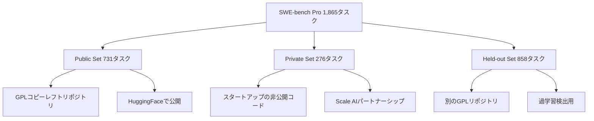

本記事は [SWE-bench Pro: Can AI Agents Solve Long-Horizon Software Engineering Tasks? (arXiv:2509.16941)](https://arxiv.org/abs/2509.16941) の解説記事です。

## 論文概要（Abstract）

SWE-bench Proは、Scale AIが2025年9月に公開したコーディングエージェント評価ベンチマークである。著者らは、従来のSWE-bench Verifiedが抱えていたデータ汚染・タスク難易度の不足・テスト信頼性の問題に対処するため、41のリポジトリから1,865タスクを収集し、Python・Go・TypeScript・JavaScriptの4言語をカバーする新たなベンチマークを構築したと報告している。

この記事は [Zenn記事: SWE-bench Pro完全解説 設計思想・タスク構成・失敗モード分析まで](https://zenn.dev/0h_n0/articles/fdf05c90ae9035) の深掘りです。

## 情報源

- **arXiv ID**: 2509.16941
- **URL**: [https://arxiv.org/abs/2509.16941](https://arxiv.org/abs/2509.16941)
- **OpenReview**: [https://openreview.net/forum?id=9R2iUHhVfr](https://openreview.net/forum?id=9R2iUHhVfr)
- **著者**: Scale AI Research Team
- **発表年**: 2025
- **分野**: cs.SE, cs.AI

## 背景と動機（Background & Motivation）

SWE-bench Verifiedは2024年6月にOpenAIが公開した500問の人間検証済みデータセットであるが、公開から1年半が経過する中で、複数の構造的問題が露呈した。

第一に、データ汚染の問題がある。OpenAIが2026年2月に実施した監査では、GPT-5.2、Claude Opus 4.5、Gemini 3 Flashのすべてにおいて、一部のVerifiedタスクに対してゴールドパッチをそのまま再現できることが確認された（OpenAI, 2026年2月発表）。汚染経路はCommon Crawl、The Stack、解法ブログ記事など複数にわたる。

第二に、タスクの難易度が不足していた。Verifiedの約90%のタスクは、エキスパートエンジニアが1時間以内に解決できるレベルと推定されており（OpenAI監査報告より）、フロンティアモデルのスコアが80%前後で飽和していた。

第三に、エージェントスキャフォールディングの非標準化により、同一モデルでもスキャフォールディングの有無で12ポイントの差が生じていた。

これらの問題に対し、SWE-bench Proは汚染耐性・タスク複雑度・評価の再現性を同時に改善することを目的として設計された。

## 主要な貢献（Key Contributions）

著者らが報告している本論文の主要な貢献は以下の通りである：

- **3層サブセット構成**: Public（731タスク/11リポジトリ）、Private（276タスク/18リポジトリ）、Held-out（858タスク/12リポジトリ）の3層構造により、データ汚染に対する多層防御を実現
- **タスク複雑度の引き上げ**: 平均107.4行の変更を4.1ファイルにわたって行う高難度タスクを収集。最小変更行数を10行に設定し、些末な修正を排除
- **多言語対応**: Python、Go、TypeScript、JavaScriptの4言語を対象とし、タスクの多様性を確保
- **人間による拡張プロセス**: エキスパートアノテーターが問題記述と要件仕様を標準化し、曖昧なIssueを自己完結的なタスクに変換

## 技術的詳細（Technical Details）

### 3層サブセット設計の仕組み

SWE-bench Proの汚染対策は、3つのサブセットを異なるアクセスレベルで運用することで実現されている。

**Public Set（731タスク）**は、GPL等の強力なコピーレフトライセンスを持つ11のリポジトリから構成される。著者らは、GPLコードの「ウイルス的」性質と法的複雑性により、商用LLMのトレーニングコーパスから除外されている可能性が高いと主張している。このサブセットはHuggingFaceで公開されており、SEAL リーダーボードの主要評価対象となっている。

**Private Set（276タスク）**は、本ベンチマークで最もユニークなサブセットである。Scale AIが18社のスタートアップとパートナーシップを組み、プロプライエタリな非公開コードベースから276タスクを収集している。コードが公開されていないため、トレーニングデータへの混入は原理的に排除される。著者らの報告によれば、Private Setではフロンティアモデルのスコアがさらに低下し、Claude Opus 4.1はPublic Setの22.7%からPrivate Setの17.8%へ、GPT-5は23.1%から14.9%へ低下した。

**Held-out Set（858タスク）**は、Public Setとは異なるGPLリポジトリから収集されたもので、結果は非公開である。Public Setでのスコア向上が汎化能力の改善を反映しているか、特定タスクへの過学習であるかを検証するために使用される。

### タスク作成プロセスの詳細

著者らが報告しているタスク作成は4段階のプロセスで行われる：

**ステップ1: リポジトリ選定**。消費者向けアプリケーション、B2Bプラットフォーム、開発者ツールなど多様なドメインから41のアクティブに保守されているリポジトリを選定する。各リポジトリから50-100タスクを収集し、特定プロジェクトへの過学習を防止する設計となっている。

**ステップ2: Docker環境構築**。プロのエンジニアが各リポジトリのビルド・テスト環境をDockerコンテナとして構築する。これにより評価の再現性を保証する。

**ステップ3: コミット分析による問題抽出**。コミット履歴を分析し、fail-to-passテスト遷移を持つコミットを特定する。具体的には、パッチ適用前に失敗し、適用後に成功するテストが存在するコミットを抽出する。1〜10行の些末な修正は除外され、実質的なエンジニアリング作業を要するタスクのみが残される。

**ステップ4: 人間による拡張**。このステップが品質の根幹である。アノテーターは以下を作成する：

- **問題記述（Problem Statement）**: コミットやIssueから合成された標準化された問題文
- **要件仕様（Requirements Specification）**: ユニットテストとゴールドパッチに基づく期待動作の詳細。実装方法は指定せず、期待される振る舞いのみを記述
- **インターフェースドキュメント**: 命名の不一致を防ぐためのAPI仕様

Verifiedでは「未指定のIssue（underspecified issues）」がそのまま残されていたのに対し、Proではこの人間による拡張によって情報が補完され、自己完結的なタスクとなっている。

### タスク複雑度の定量分析

著者らが報告しているVerifiedとProのタスク規模比較を以下に示す：

| 指標 | SWE-bench Verified | SWE-bench Pro |
|:--|:--|:--|
| タスク数 | 500 | 1,865 |
| 対応言語 | Python | Python, Go, TS, JS |
| リポジトリ数 | 12 | 41 |
| 変更行数（中央値） | 4行 | — |
| 変更行数（平均） | — | 107.4行 |
| 変更ファイル数（平均） | 約1 | 4.1 |
| 最小変更行数 | 1行 | 10行 |

この複雑度の差は、エージェントに以下の能力を要求する：
1. **クロスファイル依存関係の把握**: あるファイルの変更が別のファイルにどう影響するかの理解
2. **長期的な計画立案**: 数十ステップにわたる修正計画の一貫性維持
3. **多様なドメイン知識**: ビジネスアプリケーション、B2Bサービス、開発者ツール等の規約理解

## 実験結果（Results）

### 初期評価結果（2025年9月・論文発表時）

著者らはSWE-agentスキャフォールドを用いてフロンティアモデルを評価した。論文Table 1（推定）より、Public Setでの主要結果は以下の通りである：

| モデル | Resolve Rate | プロバイダ |
|:--|:--|:--|
| GPT-5 | 23.3% | OpenAI |
| Claude Opus 4.1 | 23.1% | Anthropic |
| GPT-4o | 4.9% | OpenAI |
| DeepSeek Qwen-3 32B | 3.4% | DeepSeek |

フロンティアモデルと小規模モデルの間に約20ポイントの大きな差が存在し、著者らはこれを「高度なソフトウェアエンジニアリング能力がフロンティアモデルに集中している」証拠として解釈している。

### Private Setでのさらなる低下

Private Set（プロプライエタリコード）での評価では、さらなるスコア低下が観測された：

| モデル | Public Set | Private Set | 差 |
|:--|:--|:--|:--|
| Claude Opus 4.1 | 22.7% | 17.8% | -4.9pt |
| GPT-5 | 23.1% | 14.9% | -8.2pt |

著者らは、未知のコードベースへの汎化能力を測定するうえで、Private Setがより現実的な指標を提供すると主張している。

### プログラミング言語別の差異

モデルの成功率はプログラミング言語によって異なることが報告されている。GoとPythonのタスクでは比較的高い解決率（一部モデルで30%超）が得られる一方、JavaScriptとTypeScriptでは成功率にばらつきが大きく、0%近くから30%超までの範囲であった。著者らは、JavaScriptとTypeScriptのエコシステム固有の複雑性が主要な障壁であると分析している。

### 2026年4月時点のリーダーボード推移

論文発表後、SEALリーダーボードの最新スコア（mini-swe-agentハーネス、250ターン制限）は以下のように推移している：

| モデル | スコア | 発表時期 |
|:--|:--|:--|
| GPT-5.4 (xHigh) | 59.10±3.56% | 2026 |
| Muse Spark | 55.00±3.60% | 2026 |
| Claude Opus 4.6 (thinking) | 51.90±3.61% | 2026 |
| GPT-5.5 | 58.6% (BenchLM.ai) | 2026 |

論文発表時の23%台から、約7ヶ月で59%台まで向上している。ただし、これにはモデル性能の向上とスキャフォールディングの改善の両方が含まれており、純粋なモデル能力の向上分を分離することは困難である。

## 失敗モード分析

著者らはエージェントの実行軌跡（trajectory）を分析し、失敗モードのクラスタリングを行っている。モデルの種類によって支配的な失敗モードが異なることが報告されている：

| 失敗モード | Opus 4.1 | Sonnet 4 | Qwen3 32B |
|:--|--:|--:|--:|
| セマンティック理解エラー | 35.9% | 23.4% | 18.0% |
| コンテキストオーバーフロー | 24.2% | 35.6% | 28.0% |
| ツール使用エラー | 15.3% | 17.0% | 42.0% |
| シンタックスエラー | 24.2% | 8.0% | 12.0% |
| 無限ファイル読み込み | 0.4% | 17.0% | — |

**セマンティック理解エラー**（Opus 4.1で35.9%）は、複数ファイルにまたがる依存関係やドメイン固有の規約の理解に失敗するパターンである。著者らは、コードの表面的な修正に注力しがちなエージェントが、ビジネスロジック全体の文脈を把握できないことが原因であると分析している。

**コンテキストオーバーフロー**（Sonnet 4で35.6%）は、関連コードの探索にコンテキストウィンドウを使い果たし、修正にたどり着けないパターンである。著者らの報告によれば、エージェントは実行時間の60%以上をコンテキスト探索に費やしている。

**ツール使用エラー**（Qwen3 32Bで42.0%）は、ファイル操作やコマンド実行の誤りが支配的なパターンで、オープンソースモデルで顕著である。

## 実運用への応用（Practical Applications）

SWE-bench Proの知見は、コーディングエージェントの開発・評価に直接的な示唆を与える。

**エージェント開発者向け**: フロンティアモデルではセマンティック理解の向上が最優先課題であり、コードベース全体の意味把握能力の改善が求められる。中規模モデルではコンテキスト管理の効率化、オープンソースモデルではツール使用（function calling）の信頼性向上が重要となる。

**エンジニアリングリーダー向け**: 著者らは、エージェントの成功率がプログラミング言語やリポジトリの複雑度によって大きく変動するため、導入先は最も効果が高い特定のチーム・コードベースに絞ることを推奨している。トップエージェントでも非自明なタスクの過半数に失敗するため、人間によるレビューは引き続き不可欠である。

**ベンチマーク設計者向け**: Private Setの導入は、他のベンチマークでも応用可能な汚染対策パラダイムである。ただし、企業パートナーシップの維持コストやNDA管理の運用負荷は考慮すべき制約となる。

## 関連研究（Related Work）

- **SWE-bench（Carlos E. Jimenez et al., 2023）**: 12のPythonリポジトリから2,294タスクを収集したオリジナルベンチマーク。ProはVerifiedの後継として位置付けられる
- **SWE-bench Verified（OpenAI, 2024）**: 93名のエンジニアが検証した500問のサブセット。データ汚染が確認されたため、OpenAIが2026年2月にスコア報告を停止
- **LiveCodeBench（Jain et al., 2024）**: 競技プログラミングプラットフォームから毎月新問題を追加する動的ベンチマーク。汚染対策の別アプローチとして注目される
- **Multi-SWE-bench（ByteDance）**: 7-9言語をカバーする多言語版SWE-bench

## まとめと今後の展望

SWE-bench Proは、3層サブセット構成（Public/Private/Held-out）と人間による拡張プロセスにより、データ汚染とタスク複雑度の両面で従来のVerifiedを改善したベンチマークである。同一モデルでVerified比33-35ポイントのスコア低下が生じることから、著者らはVerifiedでのスコアがデータ汚染により膨張していた可能性を示唆している。

今後の課題として、著者らはPrivate Setの拡充（より多くの企業パートナーの参加）、対象言語のさらなる拡大、そしてエージェントスキャフォールディングの標準化を挙げている。四半期ごとのデータ更新により、静的データセットの陳腐化リスクにも対処する方針が示されている。

## 参考文献

- **arXiv**: [https://arxiv.org/abs/2509.16941](https://arxiv.org/abs/2509.16941)
- **OpenReview**: [https://openreview.net/forum?id=9R2iUHhVfr](https://openreview.net/forum?id=9R2iUHhVfr)
- **SEAL Leaderboard**: [https://labs.scale.com/leaderboard/swe_bench_pro_public](https://labs.scale.com/leaderboard/swe_bench_pro_public)
- **Dataset**: [https://huggingface.co/datasets/ScaleAI/SWE-bench_Pro](https://huggingface.co/datasets/ScaleAI/SWE-bench_Pro)
- **Related Zenn article**: [https://zenn.dev/0h_n0/articles/fdf05c90ae9035](https://zenn.dev/0h_n0/articles/fdf05c90ae9035)

---

:::message
本記事はAI（Claude Code）により自動生成された、arXiv論文の解説記事です。論文の主張を客観的に紹介することを目的としており、筆者独自の実験は行っていません。内容の正確性については原論文もご確認ください。
:::
