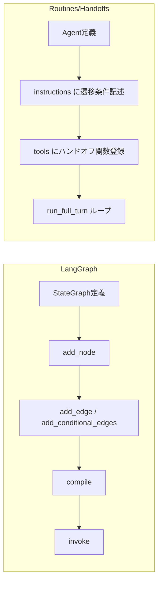

## ブログ概要（Summary）

本記事は [https://cookbook.openai.com/examples/orchestrating_agents](https://cookbook.openai.com/examples/orchestrating_agents) の解説記事です。

OpenAIは「Orchestrating Agents: Routines and Handoffs」において、LLMベースのマルチエージェントシステムを構築するための2つの基本パターン――**Routines**（system prompt + tools の組み合わせ）と**Handoffs**（エージェント間の会話転送）――を提案している。これらのパターンは、複雑なフレームワークに依存することなく、数十行のPythonコードでマルチエージェント協調を実現する軽量な設計思想に基づいている。本記事では、このパターンの技術的詳細を解説し、LangGraphのStateGraphアプローチとの設計思想の違いを比較したうえで、AWS上でのプロダクション実装ガイドを提供する。

この記事は [Zenn記事: LangGraph StateGraphで設計するステートマシン 状態遷移と分岐制御の実装パターン](https://zenn.dev/0h_n0/articles/2ae132a05c6aee) の深掘りです。

## 情報源

- **種別**: 企業テックブログ（Cookbook）
- **URL**: [https://cookbook.openai.com/examples/orchestrating_agents](https://cookbook.openai.com/examples/orchestrating_agents)
- **組織**: OpenAI
- **発表日**: 2024年

## 技術的背景（Technical Background）

LLMを使ったエージェントシステムの構築には、大きく2つの設計パラダイムが存在する。1つは**明示的な状態遷移グラフ**で制御するアプローチ（LangGraphのStateGraph等）、もう1つは**自然言語の指示と関数呼び出し**で暗黙的に制御するアプローチである。

LangGraphのStateGraphは、ノード（処理）とエッジ（遷移）を明示的に定義し、`add_conditional_edges` で条件分岐を実装する。状態は `TypedDict` で型安全に管理され、遷移ロジックはグラフ構造として可視化・検証できる。一方で、分岐条件の追加やエージェント間の動的な連携には、グラフ構造の再設計が必要になる場合がある。

OpenAIが提案するRoutines/Handoffsパターンは、この問題に対して異なるアプローチを取る。状態遷移グラフを明示的に構築するのではなく、各エージェントのsystem promptに自然言語で「いつ、どのエージェントに転送するか」を記述する。LLMがその指示を解釈し、適切なタイミングでハンドオフ関数を呼び出すことで、動的な遷移を実現する。OpenAIはこのアプローチの利点として、新しいエージェントの追加が既存のエージェントに影響を与えないスケーラビリティを挙げている。

## 実装アーキテクチャ（Architecture）

### Agent クラス

OpenAIが提示するAgentクラスは、Pydanticの `BaseModel` を継承した極めてシンプルな構造体である。

```python
from pydantic import BaseModel
from typing import Callable


class Agent(BaseModel):
    """Routines/Handoffsパターンにおけるエージェント定義.

    Attributes:
        name: エージェントの識別名
        model: 使用するLLMモデル名
        instructions: system promptとして与える自然言語の指示
        tools: エージェントが利用可能なツール関数のリスト
    """

    name: str = "Agent"
    model: str = "gpt-4o-mini"
    instructions: str = "You are a helpful Agent"
    tools: list[Callable] = []
```

ここで注目すべきは、**状態（state）を保持するフィールドが存在しない**点である。LangGraphでは `TypedDict` や `dataclass` で明示的に状態スキーマを定義するが、Routines/Handoffsパターンでは会話履歴（messages）自体が唯一の状態となる。

### run_full_turn 関数

エージェントの実行ループは `run_full_turn` 関数に集約される。

```python
from openai import OpenAI
from typing import Any


def run_full_turn(
    agent: Agent,
    messages: list[dict[str, Any]],
) -> Agent:
    """エージェントの1ターンを実行する.

    1. ツールをOpenAI Function Callingスキーマに変換
    2. LLMを呼び出し
    3. ツール呼び出しがあれば実行
    4. ツールがAgentを返した場合はハンドオフとして認識
    5. ツール呼び出しがなくなるまでループ

    Args:
        agent: 実行するエージェント
        messages: 会話履歴

    Returns:
        次に実行すべきエージェント（ハンドオフが発生した場合は新しいAgent）
    """
    current_agent = agent
    client = OpenAI()

    while True:
        # ツールをFunction Callingスキーマに変換
        tool_schemas = [
            function_to_schema(tool) for tool in current_agent.tools
        ]

        response = client.chat.completions.create(
            model=current_agent.model,
            messages=[
                {"role": "system", "content": current_agent.instructions},
                *messages,
            ],
            tools=tool_schemas if tool_schemas else None,
        )

        message = response.choices[0].message
        messages.append(message.model_dump())

        # ツール呼び出しがなければ終了
        if not message.tool_calls:
            break

        # ツール実行
        for tool_call in message.tool_calls:
            result = execute_tool(tool_call, current_agent.tools)

            # Agentオブジェクトが返された場合はハンドオフ
            if isinstance(result, Agent):
                current_agent = result
                result = f"Handed off to {current_agent.name}"

            messages.append(
                {
                    "role": "tool",
                    "tool_call_id": tool_call.id,
                    "content": str(result),
                }
            )

    return current_agent
```

### ハンドオフ機構

ハンドオフの実装は、ツール関数が `Agent` オブジェクトを返すという規約に基づいている。

```python
def transfer_to_sales_agent() -> Agent:
    """会話をSales Agentに転送する.

    Returns:
        Sales Agent のインスタンス
    """
    return sales_agent


def transfer_back_to_triage() -> Agent:
    """会話をTriage Agentに戻す.

    Returns:
        Triage Agent のインスタンス
    """
    return triage_agent
```

この設計により、エージェント間の遷移は単なる関数の戻り値として表現される。LangGraphの `add_conditional_edges` が遷移先をグラフ定義時に静的に決定するのに対し、Handoffパターンでは**LLMが実行時に動的に遷移先を決定**する。

### LangGraph StateGraph との設計比較



| 比較項目 | LangGraph StateGraph | Routines/Handoffs |
|---------|---------------------|-------------------|
| **状態管理** | `TypedDict` で明示的に定義 | 会話履歴（messages）のみ |
| **遷移定義** | `add_edge` / `add_conditional_edges` | system prompt + ハンドオフ関数 |
| **遷移タイミング** | グラフ構造で静的に決定 | LLMが実行時に動的に決定 |
| **可視化** | グラフとして可視化可能 | 暗黙的（system promptの読解が必要） |
| **型安全性** | TypedDict / Pydantic で保証 | 会話履歴の構造に依存 |
| **テスタビリティ** | ノード単位でユニットテスト可能 | エージェント単位でのテストが必要 |
| **新規エージェント追加** | グラフ構造の再設計が必要な場合あり | 既存エージェントに影響なし |
| **デバッグ** | 状態遷移のトレースが容易 | LLMの判断をトレースする必要あり |
| **適用規模** | 中〜大規模、複雑な分岐に強い | 小〜中規模、動的な遷移に強い |
| **フレームワーク依存** | langgraph パッケージ必須 | 標準ライブラリ＋OpenAI SDK のみ |

## Production Deployment Guide

OpenAIのRoutines/Handoffsパターンをプロダクション環境にデプロイするためのAWS実装ガイドを以下に示す。

### AWS実装パターン（コスト最適化重視）

**コスト試算の注意事項**: 以下の金額は2026年4月時点のAWS ap-northeast-1（東京）リージョンの概算値である。実際のコストはトラフィックパターン、リージョン、バースト使用量により変動する。最新料金は [AWS料金計算ツール](https://calculator.aws/) で確認を推奨する。

#### Small構成（~100 req/日）: Lambda + Bedrock

| サービス | スペック | 月額概算 |
|---------|--------|---------|
| Lambda | 256MB, 30秒タイムアウト | $5-10 |
| Bedrock (Claude Sonnet) | ~100 req/日, ~2000 tokens/req | $20-60 |
| DynamoDB (On-Demand) | 会話履歴保存 | $5-10 |
| API Gateway | REST API | $5-10 |
| CloudWatch | ログ・メトリクス | $5-10 |
| **合計** | | **$40-100/月** |

マルチエージェント構成のため、1リクエストあたり複数のLLM呼び出し（Triage + 転送先Agent）が発生する点を考慮し、Bedrockのトークンコストは平均2回の呼び出しを想定している。

#### Medium構成（~1,000 req/日）: ECS Fargate + Bedrock

| サービス | スペック | 月額概算 |
|---------|--------|---------|
| ECS Fargate | 0.5 vCPU / 1GB RAM x 2タスク | $50-80 |
| Bedrock (Claude Sonnet) | ~1,000 req/日, Prompt Caching有効 | $150-400 |
| ElastiCache (Redis) | cache.t3.micro | $15-25 |
| ALB | Application Load Balancer | $25-30 |
| DynamoDB (On-Demand) | 会話履歴 + エージェント状態 | $20-40 |
| CloudWatch + X-Ray | 監視・トレーシング | $15-25 |
| **合計** | | **$275-600/月** |

Prompt Cachingにより、同一system promptのエージェントへの繰り返し呼び出しコストを30-90%削減できる。

#### Large構成（10,000+ req/日）: EKS + Karpenter

| サービス | スペック | 月額概算 |
|---------|--------|---------|
| EKS コントロールプレーン | マネージド | $75 |
| EC2 (Spot Instances) | m6i.xlarge x 3-10 (Karpenter管理) | $200-700 |
| Bedrock (Claude Sonnet) | Batch API + Prompt Caching | $800-2,500 |
| ElastiCache (Redis) | cache.r6g.large クラスタ | $150-200 |
| ALB + WAF | 負荷分散 + セキュリティ | $50-80 |
| DynamoDB (Provisioned) | 会話履歴 + セッション管理 | $100-200 |
| CloudWatch + X-Ray + Budgets | フル監視 | $50-80 |
| **合計** | | **$1,425-3,835/月** |

**コスト削減テクニック**:
- **Spot Instances**: Karpenterで自動的にSpot優先配置。On-Demand比で最大90%削減
- **Reserved Instances**: ベースライン分を1年コミットで最大72%削減
- **Bedrock Batch API**: 非リアルタイム処理に適用し50%削減
- **Prompt Caching**: Routinesパターンでは各Agentのsystem promptが固定のため、キャッシュヒット率が高い。30-90%削減

### Terraformインフラコード

#### Small構成（Serverless）

```hcl
# small-serverless/main.tf
# Routines/Handoffs マルチエージェント - Lambda + Bedrock構成

terraform {
  required_version = ">= 1.9"
  required_providers {
    aws = {
      source  = "hashicorp/aws"
      version = "~> 5.80"
    }
  }
}

provider "aws" {
  region = "ap-northeast-1"
}

# --- VPC基盤（NAT Gateway不使用でコスト削減）---
resource "aws_vpc" "main" {
  cidr_block           = "10.0.0.0/16"
  enable_dns_hostnames = true
  enable_dns_support   = true

  tags = { Name = "agent-orchestrator-vpc" }
}

resource "aws_subnet" "private" {
  count             = 2
  vpc_id            = aws_vpc.main.id
  cidr_block        = cidrsubnet("10.0.0.0/16", 8, count.index)
  availability_zone = data.aws_availability_zones.available.names[count.index]

  tags = { Name = "agent-orchestrator-private-${count.index}" }
}

data "aws_availability_zones" "available" {
  state = "available"
}

# --- VPCエンドポイント（NAT Gateway代替）---
resource "aws_vpc_endpoint" "bedrock" {
  vpc_id              = aws_vpc.main.id
  service_name        = "com.amazonaws.ap-northeast-1.bedrock-runtime"
  vpc_endpoint_type   = "Interface"
  subnet_ids          = aws_subnet.private[*].id
  private_dns_enabled = true

  tags = { Name = "bedrock-endpoint" }
}

resource "aws_vpc_endpoint" "dynamodb" {
  vpc_id       = aws_vpc.main.id
  service_name = "com.amazonaws.ap-northeast-1.dynamodb"

  tags = { Name = "dynamodb-endpoint" }
}

# --- IAMロール（最小権限）---
resource "aws_iam_role" "lambda_role" {
  name = "agent-orchestrator-lambda"

  assume_role_policy = jsonencode({
    Version = "2012-10-17"
    Statement = [{
      Action = "sts:AssumeRole"
      Effect = "Allow"
      Principal = { Service = "lambda.amazonaws.com" }
    }]
  })
}

resource "aws_iam_role_policy" "lambda_policy" {
  name = "agent-orchestrator-policy"
  role = aws_iam_role.lambda_role.id

  policy = jsonencode({
    Version = "2012-10-17"
    Statement = [
      {
        # Bedrock: 特定モデルのみInvoke許可
        Effect   = "Allow"
        Action   = ["bedrock:InvokeModel"]
        Resource = "arn:aws:bedrock:ap-northeast-1::foundation-model/anthropic.claude-*"
      },
      {
        # DynamoDB: 特定テーブルのみCRUD許可
        Effect = "Allow"
        Action = [
          "dynamodb:GetItem",
          "dynamodb:PutItem",
          "dynamodb:UpdateItem",
          "dynamodb:Query"
        ]
        Resource = aws_dynamodb_table.conversations.arn
      },
      {
        # CloudWatch Logs
        Effect = "Allow"
        Action = [
          "logs:CreateLogGroup",
          "logs:CreateLogStream",
          "logs:PutLogEvents"
        ]
        Resource = "arn:aws:logs:ap-northeast-1:*:*"
      }
    ]
  })
}

# --- DynamoDB（On-Demand、KMS暗号化）---
resource "aws_dynamodb_table" "conversations" {
  name         = "agent-conversations"
  billing_mode = "PAY_PER_REQUEST"
  hash_key     = "session_id"
  range_key    = "timestamp"

  attribute {
    name = "session_id"
    type = "S"
  }

  attribute {
    name = "timestamp"
    type = "N"
  }

  server_side_encryption {
    enabled = true  # AWS managed KMS
  }

  ttl {
    attribute_name = "expires_at"
    enabled        = true
  }

  tags = { Name = "agent-conversations" }
}

# --- Lambda関数 ---
resource "aws_lambda_function" "orchestrator" {
  function_name = "agent-orchestrator"
  role          = aws_iam_role.lambda_role.arn
  handler       = "handler.lambda_handler"
  runtime       = "python3.12"
  timeout       = 30
  memory_size   = 256

  # ソースコードは別途S3またはローカルパッケージを指定
  filename = "lambda_package.zip"

  environment {
    variables = {
      DYNAMODB_TABLE = aws_dynamodb_table.conversations.name
      BEDROCK_MODEL  = "anthropic.claude-sonnet-4-20250514"
      LOG_LEVEL      = "INFO"
    }
  }

  tracing_config {
    mode = "Active"  # X-Ray有効化
  }

  tags = { Name = "agent-orchestrator" }
}

# --- CloudWatchアラーム（コスト監視）---
resource "aws_cloudwatch_metric_alarm" "lambda_duration" {
  alarm_name          = "agent-orchestrator-high-duration"
  comparison_operator = "GreaterThanThreshold"
  evaluation_periods  = 3
  metric_name         = "Duration"
  namespace           = "AWS/Lambda"
  period              = 300
  statistic           = "Average"
  threshold           = 25000  # 25秒（タイムアウト30秒の83%）
  alarm_description   = "Lambda実行時間がタイムアウトに近づいている"

  dimensions = {
    FunctionName = aws_lambda_function.orchestrator.function_name
  }
}
```

#### Large構成（Container）

```hcl
# large-container/main.tf
# Routines/Handoffs マルチエージェント - EKS + Karpenter構成

terraform {
  required_version = ">= 1.9"
  required_providers {
    aws = {
      source  = "hashicorp/aws"
      version = "~> 5.80"
    }
    helm = {
      source  = "hashicorp/helm"
      version = "~> 2.17"
    }
  }
}

# --- EKSクラスタ ---
module "eks" {
  source  = "terraform-aws-modules/eks/aws"
  version = "~> 20.31"

  cluster_name    = "agent-orchestrator"
  cluster_version = "1.31"

  vpc_id     = aws_vpc.main.id
  subnet_ids = aws_subnet.private[*].id

  # パブリックアクセス最小化
  cluster_endpoint_public_access  = true
  cluster_endpoint_private_access = true

  # マネージドノードグループ（ベースライン）
  eks_managed_node_groups = {
    baseline = {
      instance_types = ["m6i.large"]
      min_size       = 1
      max_size       = 2
      desired_size   = 1

      labels = { role = "baseline" }
    }
  }

  tags = { Name = "agent-orchestrator-eks" }
}

# --- Karpenter（Spot優先、自動スケーリング）---
resource "helm_release" "karpenter" {
  name       = "karpenter"
  repository = "oci://public.ecr.aws/karpenter"
  chart      = "karpenter"
  version    = "1.1.1"
  namespace  = "karpenter"

  create_namespace = true

  set {
    name  = "settings.clusterName"
    value = module.eks.cluster_name
  }

  set {
    name  = "settings.clusterEndpoint"
    value = module.eks.cluster_endpoint
  }
}

# --- Karpenter NodePool（Spot Instance優先）---
resource "kubectl_manifest" "karpenter_nodepool" {
  yaml_body = yamlencode({
    apiVersion = "karpenter.sh/v1"
    kind       = "NodePool"
    metadata   = { name = "agent-workers" }
    spec = {
      template = {
        spec = {
          requirements = [
            {
              key      = "karpenter.sh/capacity-type"
              operator = "In"
              values   = ["spot", "on-demand"]  # Spot優先
            },
            {
              key      = "node.kubernetes.io/instance-type"
              operator = "In"
              values   = ["m6i.xlarge", "m6i.2xlarge", "m7i.xlarge"]
            }
          ]
          nodeClassRef = {
            group = "karpenter.k8s.aws"
            kind  = "EC2NodeClass"
            name  = "default"
          }
        }
      }
      limits = {
        cpu    = "100"
        memory = "400Gi"
      }
      disruption = {
        consolidationPolicy = "WhenEmptyOrUnderutilized"
        consolidateAfter    = "30s"
      }
    }
  })
}

# --- Secrets Manager（Bedrock設定）---
resource "aws_secretsmanager_secret" "agent_config" {
  name        = "agent-orchestrator/config"
  description = "Agent Orchestrator設定"

  tags = { Name = "agent-orchestrator-config" }
}

# --- AWS Budgets（予算アラート）---
resource "aws_budgets_budget" "monthly" {
  name         = "agent-orchestrator-monthly"
  budget_type  = "COST"
  limit_amount = "5000"
  limit_unit   = "USD"
  time_unit    = "MONTHLY"

  notification {
    comparison_operator       = "GREATER_THAN"
    threshold                 = 80
    threshold_type            = "PERCENTAGE"
    notification_type         = "ACTUAL"
    subscriber_email_addresses = ["ops-team@example.com"]
  }

  notification {
    comparison_operator       = "GREATER_THAN"
    threshold                 = 100
    threshold_type            = "PERCENTAGE"
    notification_type         = "FORECASTED"
    subscriber_email_addresses = ["ops-team@example.com"]
  }
}
```

### 運用・監視設定

#### CloudWatch Logs Insights クエリ

```
# コスト異常検知：1時間あたりのBedrock呼び出し回数
fields @timestamp, agent_name, model, input_tokens, output_tokens
| stats sum(input_tokens) as total_input, sum(output_tokens) as total_output,
        count(*) as invocations
  by bin(1h) as hour, agent_name
| filter invocations > 500
| sort hour desc

# レイテンシ分析：ハンドオフを含むリクエストのP95/P99
fields @timestamp, request_id, duration_ms, handoff_count
| stats pct(duration_ms, 95) as p95, pct(duration_ms, 99) as p99,
        avg(duration_ms) as avg_ms
  by bin(1h)
| sort @timestamp desc
```

#### CloudWatch アラーム設定

```python
import boto3
from typing import Any


def create_bedrock_token_alarm(
    cloudwatch: boto3.client,
    sns_topic_arn: str,
    threshold: int = 100000,
) -> dict[str, Any]:
    """Bedrockトークン使用量のスパイク検知アラームを作成する.

    Args:
        cloudwatch: CloudWatchクライアント
        sns_topic_arn: 通知先SNSトピックARN
        threshold: 5分間のトークン閾値

    Returns:
        CloudWatch put_metric_alarm のレスポンス
    """
    return cloudwatch.put_metric_alarm(
        AlarmName="bedrock-token-spike",
        MetricName="InputTokenCount",
        Namespace="AWS/Bedrock",
        Statistic="Sum",
        Period=300,
        EvaluationPeriods=2,
        Threshold=threshold,
        ComparisonOperator="GreaterThanThreshold",
        AlarmActions=[sns_topic_arn],
        AlarmDescription="Bedrockトークン使用量が閾値を超過",
    )
```

#### X-Ray トレーシング設定

```python
from aws_xray_sdk.core import xray_recorder, patch_all
from typing import Any


def setup_xray_tracing() -> None:
    """X-Rayトレーシングを初期化する.

    boto3の自動計装を有効化し、Bedrockおよび
    DynamoDBの呼び出しをトレースする。
    """
    xray_recorder.configure(
        service="agent-orchestrator",
        sampling=True,
    )
    patch_all()  # boto3自動計装


def trace_agent_handoff(
    from_agent: str,
    to_agent: str,
    session_id: str,
) -> None:
    """エージェント間ハンドオフをX-Rayアノテーションとして記録する.

    Args:
        from_agent: 転送元エージェント名
        to_agent: 転送先エージェント名
        session_id: セッション識別子
    """
    subsegment = xray_recorder.begin_subsegment("agent_handoff")
    subsegment.put_annotation("from_agent", from_agent)
    subsegment.put_annotation("to_agent", to_agent)
    subsegment.put_metadata("session_id", session_id)
    xray_recorder.end_subsegment()
```

#### Cost Explorer 自動レポート

```python
import boto3
import json
from datetime import datetime, timedelta
from typing import Any


def get_daily_cost_report(
    ce_client: boto3.client,
    sns_client: boto3.client,
    sns_topic_arn: str,
    cost_threshold: float = 100.0,
) -> dict[str, Any]:
    """日次コストレポートを取得し、閾値超過時にSNS通知する.

    Args:
        ce_client: Cost Explorerクライアント
        sns_client: SNSクライアント
        sns_topic_arn: 通知先SNSトピックARN
        cost_threshold: 日次コスト閾値（USD）

    Returns:
        コストレポートのサマリー
    """
    today = datetime.utcnow().strftime("%Y-%m-%d")
    yesterday = (datetime.utcnow() - timedelta(days=1)).strftime("%Y-%m-%d")

    response = ce_client.get_cost_and_usage(
        TimePeriod={"Start": yesterday, "End": today},
        Granularity="DAILY",
        Metrics=["UnblendedCost"],
        GroupBy=[
            {"Type": "DIMENSION", "Key": "SERVICE"},
        ],
        Filter={
            "Tags": {
                "Key": "project",
                "Values": ["agent-orchestrator"],
            }
        },
    )

    total_cost = sum(
        float(group["Metrics"]["UnblendedCost"]["Amount"])
        for result in response["ResultsByTime"]
        for group in result["Groups"]
    )

    report = {
        "date": yesterday,
        "total_cost_usd": round(total_cost, 2),
        "services": {
            group["Keys"][0]: float(
                group["Metrics"]["UnblendedCost"]["Amount"]
            )
            for result in response["ResultsByTime"]
            for group in result["Groups"]
        },
    }

    if total_cost > cost_threshold:
        sns_client.publish(
            TopicArn=sns_topic_arn,
            Subject=f"[ALERT] Agent Orchestrator日次コスト${total_cost:.2f}",
            Message=json.dumps(report, indent=2, ensure_ascii=False),
        )

    return report
```

### コスト最適化チェックリスト

#### アーキテクチャ選択

- [ ] トラフィック量に応じた構成を選択（~100 req/日: Serverless、~1,000 req/日: Hybrid、10,000+ req/日: Container）
- [ ] 各エージェントのLLM呼び出し頻度を計測し、適切なモデルサイズを選択

#### リソース最適化

- [ ] EC2: Spot Instancesを優先配置（Karpenterの `capacity-type` 設定）
- [ ] Reserved Instances: ベースラインのEKSノードに1年コミット適用
- [ ] Savings Plans: Compute Savings Plansの検討
- [ ] Lambda: メモリサイズをPower Tuningで最適化（128MB〜1024MBを検証）
- [ ] ECS/EKS: アイドル時にKarpenterの `consolidationPolicy` でスケールダウン

#### LLMコスト削減

- [ ] Bedrock Batch API: 非リアルタイム処理（レポート生成、分析等）に適用し50%削減
- [ ] Prompt Caching: Routinesのsystem promptは固定なので高キャッシュヒット率が期待できる
- [ ] モデル選択ロジック: Triage AgentにはClaude Haiku、専門AgentにはClaude Sonnetを使い分け
- [ ] トークン数制限: 各エージェントの `max_tokens` を用途に応じて設定
- [ ] 会話履歴の圧縮: 長い会話はサマリー化してトークン消費を抑制

#### 監視・アラート

- [ ] AWS Budgets: 月額予算アラート（80%、100%の2段階）
- [ ] CloudWatch アラーム: Bedrockトークンスパイク、Lambda実行時間異常
- [ ] Cost Anomaly Detection: 自動異常検知を有効化
- [ ] 日次コストレポート: Cost Explorer APIで自動取得、$100/日超過でSNS通知
- [ ] X-Ray: ハンドオフのレイテンシ分布を監視

#### リソース管理

- [ ] 未使用リソース削除: 月次でVPCエンドポイント、ENI、EBSボリュームを棚卸し
- [ ] タグ戦略: `project=agent-orchestrator`、`environment=prod/dev`、`cost-center` を全リソースに付与
- [ ] ライフサイクルポリシー: DynamoDBのTTLで古い会話履歴を自動削除
- [ ] 開発環境夜間停止: EKSノードのスケジュールスケーリングで業務時間外は最小構成
- [ ] CloudWatch Logsの保持期間: 本番30日、開発7日に設定

## パフォーマンス最適化（Performance）

Routines/Handoffsパターンでは、1リクエストあたり複数のLLM呼び出しが発生するため、レイテンシの管理が重要になる。

**ボトルネックの特定**:
- **ハンドオフ回数**: Triage Agent → 専門Agentの1回転送で、最低2回のLLM呼び出しが発生する。多段ハンドオフ（A → B → C）は避け、最大2段に制限することがOpenAIのCookbookでも暗示されている
- **ツール実行時間**: 外部API呼び出しを含むツールはタイムアウトを設定する。LLMの呼び出し自体が5-15秒かかるため、ツール側は3秒以内に収めることを目標とする
- **会話履歴の肥大化**: 各ターンの全メッセージがLLMに送られるため、会話が長くなるとトークン数が増大する。一定ターン数を超えたらサマリー化する機構を組み込む

**最適化手法**:
- Prompt Cachingにより、固定のsystem promptに対するTTFT（Time to First Token）を短縮
- Streaming応答を活用し、ユーザーへのレスポンスを体感的に高速化
- Triage Agentには軽量モデル（Claude Haiku）を使用し、判定の高速化とコスト削減を両立

## 運用での学び（Production Lessons）

OpenAIはRoutines/Handoffsパターンの実装として**Swarm**フレームワークをproof of conceptとして公開しているが、OpenAI自身がSwarmを「実験的・教育目的」と位置づけている点に注意が必要である。

**Swarmの制約**:
- **本番サポートなし**: PyPIへの公開なし、SLAなし、バージョン管理なし
- **状態の永続化なし**: 会話履歴はインメモリのみ。プロダクションでは外部ストア（DynamoDB等）への保存が必須
- **エラーハンドリング**: ハンドオフ失敗時のフォールバック機構がない。タイムアウト、リトライ、デッドレターキューの実装が必要
- **認証・認可**: マルチテナント環境での権限分離が未実装

**本番適用の注意点**:
- ハンドオフ先のエージェントが存在しない場合のフォールバックを必ず実装する
- 会話履歴の最大長を制限し、トークン爆発を防止する
- ハンドオフのループ（A → B → A → B ...）を検知・遮断するガードレールを設ける
- 各エージェントのsystem promptをバージョン管理し、A/Bテスト可能な設計にする

## 学術研究との関連（Academic Connection）

Routines/Handoffsパターンは、学術分野で提案されたエージェント設計手法と密接に関連している。

- **ReAct** (Yao et al., 2022): Reasoning + Acting の統合パターン。Routinesの「自然言語で推論し、ツールを実行する」ループはReActの思想を直接的に体現している
- **AutoGen** (Wu et al., 2023, Microsoft Research): 複数エージェントの会話による問題解決フレームワーク。Handoffsパターンとの違いは、AutoGenが「複数エージェントの同時対話」を想定するのに対し、HandoffsはSingle-thread（1人のエージェントがアクティブ）である点にある
- **Toolformer** (Schick et al., 2023, Meta AI): LLMが自律的にツール呼び出しタイミングを学習する手法。Routinesのツール呼び出しはFunction Callingに依存するが、思想的には同じ方向性である

## まとめと実践への示唆

OpenAIのRoutines/Handoffsパターンは、マルチエージェントシステムの設計を「system prompt + tools + transfer function」という3つの要素に簡潔化した。LangGraphのStateGraphが明示的なグラフ構造で制御の可視性を重視するのに対し、このパターンはLLMの柔軟な判断力を活かした動的な遷移を特徴とする。

実践的な選択基準として、以下を提案する。

- **遷移ロジックが明確で検証可能性が重要な場合**: LangGraph StateGraphを選択。金融取引、医療判断など、誤った遷移が重大な影響を持つドメインに適している
- **動的な分岐と拡張性が重要な場合**: Routines/Handoffsを選択。カスタマーサポート、情報検索など、ユーザーの多様な要求に柔軟に対応する必要があるドメインに適している
- **両者の組み合わせ**: LangGraphのStateGraph内の各ノードでRoutines/Handoffsパターンを使用するハイブリッド構成も有効である。全体のフローはグラフで制御しつつ、各ノード内でのエージェント協調はHandoffsで実現する

## 参考文献

- **Blog URL**: [https://cookbook.openai.com/examples/orchestrating_agents](https://cookbook.openai.com/examples/orchestrating_agents)
- **Swarm (GitHub)**: [https://github.com/openai/swarm](https://github.com/openai/swarm)
- **ReAct**: Yao, S. et al. (2022). "ReAct: Synergizing Reasoning and Acting in Language Models." [arXiv:2210.03629](https://arxiv.org/abs/2210.03629)
- **AutoGen**: Wu, Q. et al. (2023). "AutoGen: Enabling Next-Gen LLM Applications via Multi-Agent Conversation." [arXiv:2308.08155](https://arxiv.org/abs/2308.08155)
- **Toolformer**: Schick, T. et al. (2023). "Toolformer: Language Models Can Teach Themselves to Use Tools." [arXiv:2302.04761](https://arxiv.org/abs/2302.04761)
- **Related Zenn article**: [https://zenn.dev/0h_n0/articles/2ae132a05c6aee](https://zenn.dev/0h_n0/articles/2ae132a05c6aee)
