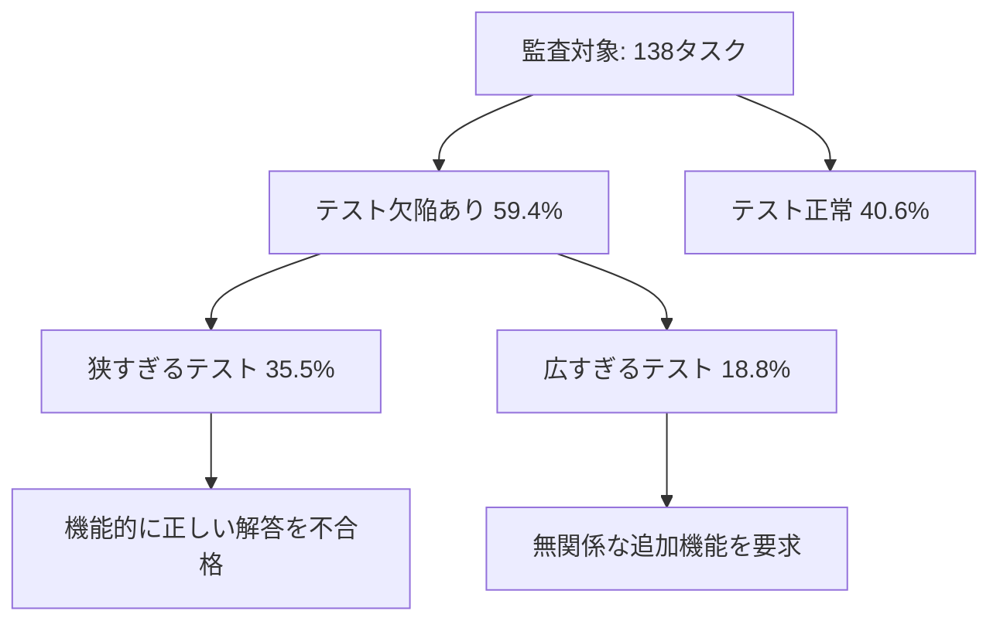

本記事は [Why we no longer evaluate SWE-bench Verified (OpenAI, 2026年2月23日)](https://openai.com/index/why-we-no-longer-evaluate-swe-bench-verified/) の解説記事です。

## ブログ概要（Summary）

2026年2月23日、OpenAIのFrontier Evalsチーム（Olivia Watkins、Mia Glaese（VP of Research））は、SWE-bench Verifiedのスコア報告を停止し、SWE-bench Proへの移行を推奨する声明を発表した。同社の独自監査により、SWE-bench Verifiedが「飽和し、かつ高度に汚染されている」ことが確認されたためである。本ブログ記事はOpenAIが実施した監査の方法論と結果を詳述しており、ベンチマーク評価の信頼性に関する重要な知見を提供している。

この記事は [Zenn記事: SWE-bench Pro完全解説 設計思想・タスク構成・失敗モード分析まで](https://zenn.dev/0h_n0/articles/fdf05c90ae9035) の深掘りです。

## 情報源

- **種別**: 企業テックブログ
- **URL**: [https://openai.com/index/why-we-no-longer-evaluate-swe-bench-verified/](https://openai.com/index/why-we-no-longer-evaluate-swe-bench-verified/)
- **組織**: OpenAI Frontier Evals Team
- **著者**: Olivia Watkins, Mia Glaese
- **発表日**: 2026年2月23日

## 技術的背景（Technical Background）

SWE-bench Verifiedは、2024年6月（公式ローンチは2024年8月）にOpenAIが公開した500問のベンチマークである。93名のソフトウェアエンジニアが原版SWE-bench（2,294問）からタスクをフィルタリングし、設計不良や不可能なタスクを除去した検証済みサブセットであった。公開後、主要AIラボのフロンティアモデル評価における事実上の標準指標となり、Claude Opus 4で72.5%、Gemini 2.5 Proで63.2%、GPT-4.1で54.6%等のスコアが報告されていた。

しかし、公開から約1年半の間に、ベンチマークの信頼性に関する複数の懸念が蓄積していた。OpenAIはこれらの懸念を体系的に調査する監査を実施し、その結果を本ブログ記事で公開した。

## OpenAIの監査方法論（Audit Methodology）

### 監査の設計

OpenAIの監査は、GPT-5.2が**64回の独立実行にわたって一貫して失敗した138タスク**に焦点を当てている。これらのタスクを**6名のエンジニアがそれぞれ独立にレビュー**し、失敗の原因を分析した。

この設計は、モデルが「真に解決できない」タスクを特定し、その原因がモデルの能力不足ではなくベンチマーク側の欠陥にあるケースを洗い出すことを目的としている。

### 発見1: テスト品質の問題（59.4%のタスクに欠陥）

監査の結果、失敗タスク138件のうち**59.4%がテスト自体に欠陥がある**ことが判明した。欠陥は2つのカテゴリに分類される：

**「狭すぎる」テスト（49件、35.5%）**: テストが過度に限定的で、機能的に正しい提出を不合格にしてしまうパターンである。OpenAIは具体例として、「GPT-5.2のchain-of-thoughtが、問題記述には一切言及されていない特定の引数名をテストが要求していることを認識した」ケースを挙げている。これは、テストが実装の内部詳細に依存しており、問題の仕様（what）ではなく実装の詳細（how）を検証してしまっていることを意味する。

**「広すぎる」テスト（26件、18.8%）**: テストが元の問題にない追加機能を検証しているパターンである。これは、テストが無関係なプルリクエストから取り込まれたケースに起因する。

### 発見2: データ汚染の確認

OpenAIは、**GPT-5.2、Claude Opus 4.5、Gemini 3 Flash Preview**の3モデルに対してデータ汚染の検証を実施した。その結果、**全3モデルにおいて、タスクIDのみをプロンプトとして提示するだけで、ゴールドパッチ（正解パッチ）をそのまま再現できる**ケースが確認された。

汚染経路として、OpenAIは以下を指摘している：
- SWE-benchの問題はオープンソースリポジトリ（Djangoなど）から収集されており、モデルプロバイダがトレーニングに使用する可能性がある
- 2024年6月以降にGitHubデータでトレーニングされたモデルは、500問のVerifiedタスクの一部（解答を含む）をトレーニングデータに含んでいる可能性が高い

OpenAIは、同社の汚染監査エージェントが「SWE-bench Proでは、テストしたすべてのフロンティアモデルにおいて汚染シグナルが大幅に少なかった」とも報告している。

### 発見3: ベンチマーク飽和

監査の時点で、フロンティアモデルのスコアは一貫して**約80%**に達しており、モデル間の差は**0.1%以下**にまで縮小していた。さらに、残る未解決タスクの**60%以上がテスト欠陥により解決不可能**と判定されたため、改善の余地がほぼ残されていない状態であった。

OpenAIは、Verifiedのタスクの約90%がエキスパートエンジニアにとって1時間以内で解決可能なレベルであり、複数ファイルにまたがる変更を要求するタスクが少ないことも指摘している。

### 発見4: スキャフォールディング膨張

同一モデルにおいて、スキャフォールディングの有無で**12ポイントの差**（スタンドアロンで69%、スキャフォールディングありで81%）が生じていたことが報告されている。リトライループ、テスト駆動フィードバック、特殊なファイル探索戦略など、エージェントインフラの違いがスコアに反映されており、モデル単体の能力比較としての信頼性が損なわれていた。

## SWE-bench Proへの移行推奨

### 移行の根拠

OpenAIは、SWE-bench Proが以下の点でVerifiedの問題を解決していると評価している：

- **より大規模・複雑なタスク**: Verifiedの1時間以内の問題に対し、Proは1〜4時間以上を要する問題を収集
- **多様なリポジトリと言語**: 41リポジトリ、4言語をカバー
- **汚染耐性**: コピーレフトライセンスとプロプライエタリコードの二重防御
- **有意な差別化能力**: フロンティアモデル間でスコアの分散が十分に大きい

### Verified → Pro のスコア変動

同一モデルでのスコア比較は、Verifiedでの汚染によるスコア膨張を示唆している：

| モデル | Verified | Pro (Public) | 差 |
|:--|--:|--:|--:|
| Claude Opus 4.5 | 80.9% | 45.89% | -35.0pt |
| GPT-5 (High) | 74.9% | 41.78% | -33.1pt |
| Gemini 3 Pro | 76.2% | 43.30% | -32.9pt |

すべてのフロンティアモデルで33-35ポイントの低下が観測されている。OpenAIは、この差がデータ汚染によるスコア膨張とタスク複雑度の違いの両方に起因すると報告しているが、各要因の寄与度を正確に分離することは現時点では困難であると認めている。

## 関連する先行研究

OpenAIは、自社の発見を裏付ける先行研究も引用している：

- **2024年の研究**: 成功パッチの32.67%にソリューションリーケージが関与していたと報告
- **2025年3月の研究**: 「SWE-benchで正解とマークされたパッチの7.8%が、適切な検証では不合格となる」ことを文書化
- **2025年2月（LessLeak-Bench）**: 83のソフトウェアエンジニアリングベンチマークを調査し、SWE-bench VerifiedにおいてStarCoderトレーニングデータとの10.6%の直接データリーケージを検出
- **差分テスト研究**: パッチの29.6%が意図した動作と異なる振る舞いを示すことを確認

## 今後の評価の方向性

Mia Glaese（VP of Research）は、今後の評価フレームワークが以下の特性を備えるべきであると述べている：

1. **長期的なタスク**: 数時間〜数日にわたる作業
2. **オープンエンドな設計判断**: 単一の正解が存在しない問題
3. **コード品質と保守性の評価**: 合否テストに還元できない品質指標
4. **実際のプロダクト構築**: 現実のプロダクト開発タスク
5. **人間集約的な評価**: ドメイン知識を持つ専門家による採点

これらの特性は「単純な合否テストスイートに還元できないため、意図的にゲームしにくい」設計であるとGlaese氏は述べている。

OpenAIは、専門家が作成しトレーニング済みの人間レビュアーが採点する独自タスクを使用する**GDPValプロジェクト**を開発中であるとも報告している。

## 学術研究との関連（Academic Connection）

本ブログ記事は、LLMベンチマークの信頼性に関する広範な学術的議論の中に位置付けられる。Burnell et al. (2024) の「Benchmarks as Microscopes」が提起したベンチマーク方法論の問題、Szymanski et al. (2025) の「Measuring Leakage in LLM-based Code Generation Benchmarks」が示したリーケージ定量化手法、そしてSWE-bench Goes Live (2024) が提案した動的ベンチマークの設計はいずれも、静的ベンチマークの限界に対する異なるアプローチを示している。

OpenAIの声明は、これらの学術的知見を実業界の評価実践に反映させた最初の主要な事例であり、AIモデル評価のパラダイム転換を促進する契機となった。

## まとめと実践への示唆

OpenAIの監査は、SWE-bench Verifiedの3つの構造的問題（テスト品質の欠陥、データ汚染、ベンチマーク飽和）を実証的に示した。この結果を受けて、OpenAIは2026年2月にVerifiedのスコア報告を停止し、SWE-bench Proの使用を公式に推奨している。

実務者にとっての示唆は明確である。2025年中盤以降のSWE-bench Verifiedスコアは、モデル能力の指標として懐疑的に扱うべきである。Proへの移行に伴うスコア低下（33-35ポイント）は能力の後退ではなく、測定精度の補正として解釈すべきである。

## 参考文献

- **Blog URL**: [https://openai.com/index/why-we-no-longer-evaluate-swe-bench-verified/](https://openai.com/index/why-we-no-longer-evaluate-swe-bench-verified/)
- **OpenAI Developers (X/Twitter)**: [OpenAIDevs post](https://x.com/OpenAIDevs/status/2026002219909427270)
- **Related Zenn article**: [https://zenn.dev/0h_n0/articles/fdf05c90ae9035](https://zenn.dev/0h_n0/articles/fdf05c90ae9035)

---

:::message
本記事はAI（Claude Code）により自動生成された、OpenAIブログ記事の解説記事です。ブログの主張を客観的に紹介することを目的としており、筆者独自の実験は行っていません。内容の正確性については原記事もご確認ください。
:::
