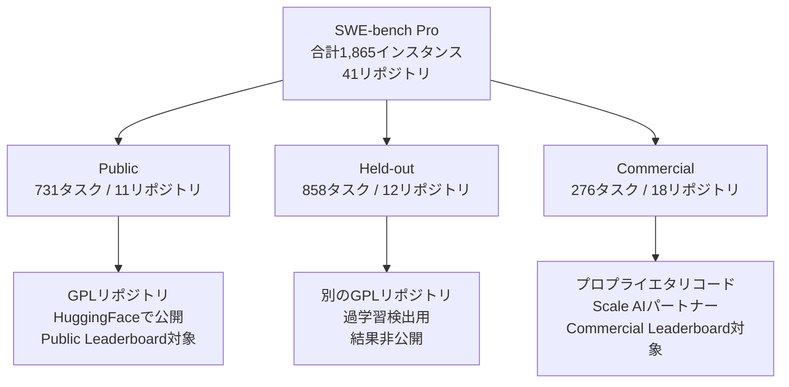

本記事は [SWE-Bench Pro: Raising the Bar for Agentic Coding (Scale AI Blog, 2025年9月19日)](https://scale.com/blog/swe-bench-pro) の解説記事です。

## ブログ概要（Summary）

2025年9月19日、Scale AI Research Teamは、コーディングエージェント評価のための新ベンチマーク「SWE-Bench Pro」を発表した。Scale AIは、フロンティアモデルがSWE-bench Verifiedで高スコアを記録する中、「ベンチマークは現在のコーディングニーズに追いついているか」という問題意識から、より現実的で汚染耐性の高いベンチマークの構築に取り組んだ。本ブログ記事では、ベンチマークの設計上の4つの課題とそれぞれの解決策、初期評価結果、実務への示唆が述べられている。

この記事は [Zenn記事: SWE-bench Pro完全解説 設計思想・タスク構成・失敗モード分析まで](https://zenn.dev/0h_n0/articles/fdf05c90ae9035) の深掘りです。

## 情報源

- **種別**: 企業テックブログ
- **URL**: [https://scale.com/blog/swe-bench-pro](https://scale.com/blog/swe-bench-pro)
- **組織**: Scale AI Research Team
- **発表日**: 2025年9月19日

## 技術的背景（Technical Background）

Scale AIは、AI評価インフラとデータラベリングを専門とする企業であり、SEAL（Systematic Evaluation of AI Language models）リーダーボードの運営元でもある。同社はLLMの能力評価において、ベンチマークの品質が測定結果の信頼性を直接決定するという立場から、既存ベンチマークの限界を特定し、その改善に取り組んでいる。

SWE-bench Verifiedは500問の人間検証済みデータセットとして標準化されていたが、フロンティアモデルのスコアが70%を超え飽和傾向にあった。Scale AIは、この飽和が「モデル能力の完成」ではなく「ベンチマーク側の制約」に起因すると分析し、SWE-bench Proの開発に着手した。

## ベンチマーク設計の4課題と解決策

Scale AIは、ブログ記事の中で既存ベンチマークが抱える4つの課題を特定し、それぞれに対する解決策を提示している。

### 課題1: データ汚染

**問題**: 多くのベンチマークが、モデルのトレーニングデータに含まれている可能性のあるコードを使用している。モデルが問題を真に解決しているのか、記憶した解答を再現しているのかを区別することが困難であった。

**Scale AIの解決策**: トレーニングデータに含まれていないコードを使用する。具体的には以下の2つの手段を採用している：

1. **コピーレフトライセンス（GPL等）**: 「ウイルス的」性質と法的複雑性により、商用LLMのトレーニングコーパスから除外されている可能性が高い公開コードベースを使用
2. **プロプライエタリコード**: Scale AIの社内資産および18社のスタートアップパートナーから提供された完全に非公開のコードベースを使用

### 課題2: タスク多様性の不足

**問題**: 既存ベンチマークが単純なユーティリティライブラリに偏り、実世界のソフトウェアエンジニアリングの全範囲をカバーしていなかった。

**Scale AIの解決策**: 消費者向けアプリケーション、B2Bサービス、開発者ツールなど多様なドメインからタスクを収集。各リポジトリから50-100タスクを収集し、特定プロジェクトへの過学習を防止する設計としている。

### 課題3: 過度に簡易化された問題

**問題**: 従来のベンチマークでは曖昧なIssueや不明確な問題がフィルタリングされる傾向にあり、実際の開発者のワークフローを反映していなかった。

**Scale AIの解決策**: 曖昧なタスクを排除するのではなく保持しつつ、人間による拡張プロセスで問題記述を標準化する。エキスパートが明確な問題文と要件仕様を作成するが、実装方法は指定せず、期待される振る舞いのみを記述する。タスクは平均107.4行のコード変更を4.1ファイルにわたって要求する規模である。

### 課題4: テストの信頼性と再現性

**問題**: 一貫した評価環境がなければ、解答が正しいのか環境設定が不正なのかを判断することが困難であった。

**Scale AIの解決策**: Docker環境を用いた再現可能な評価インフラを構築し、すべてのタスクで一貫したビルド・テスト環境を提供している。

## データセット構成

ブログ記事で報告されているSWE-bench Proのデータセット構成は以下の通りである：

| サブセット | タスク数 | リポジトリ数 | 目的 |
|:--|--:|--:|:--|
| Public | 731 | 11 | リーダーボード評価 |
| Held-out | 858 | 12 | 過学習検出 |
| Commercial | 276 | 18 | 汎化能力の真の測定 |

## 初期評価結果（2025年9月）

### Verified → Pro での大幅なスコア低下

Scale AIは、SWE-agentスキャフォールドを用いてフロンティアモデルを評価した。ブログ記事で報告されている主要な結果：

**Public Setでの結果**:

| モデル | SWE-bench Pro スコア | プロバイダ |
|:--|--:|:--|
| GPT-5 | 23.3% | OpenAI |
| Claude Opus 4.1 | 23.1% | Anthropic |
| GPT-4o | 4.9% | OpenAI |
| DeepSeek Qwen-3 32B | 3.4% | DeepSeek |

Verifiedで70%超のスコアを記録していたモデルが、Proでは23%台にまで低下している。Scale AIはこれを「より現実的で汚染耐性のあるベンチマークへの移行に伴う、期待される結果」と位置付けている。

### Commercial Setでのさらなる低下

非公開コードベースでの評価では、さらにスコアが低下する：

| モデル | Public Set | Commercial Set | 差 |
|:--|--:|--:|--:|
| Claude Opus 4.1 | 22.7% | 17.8% | -4.9pt |
| GPT-5 | 23.1% | 14.9% | -8.2pt |

Scale AIは、「未知のコードベースにおける評価が、汎化能力のより現実的な指標を提供する」と述べている。

### モデル間の性能格差

テストされたモデル間に大きな性能格差が存在する。フロンティアモデル（GPT-5、Claude Opus 4.1）と旧世代モデル（GPT-4oの4.9%、DeepSeek Qwen-3 32Bの3.4%）の間には約20ポイントの差がある。Scale AIは、「最新モデルの高度な能力が、これらの複雑な実世界タスクへの対処に不可欠である」と分析している。

### プログラミング言語別の差異

言語別の成功率にばらつきがあることが報告されている：
- **Go、Python**: 比較的高い解決率（一部モデルで30%超）
- **JavaScript、TypeScript**: 成功率にばらつきが大きく（0%近く〜30%超）

### リポジトリ固有の難易度

モデルの性能は対象リポジトリによって大きく変動する。一部のリポジトリでは全モデルの解決率が10%未満である一方、特定のリポジトリでは50%超の成功率を達成するモデルも存在する。Scale AIは、コードベースの複雑度、問題の種類、ドキュメントの品質がエージェントの成功率に大きく影響すると分析している。

### トップモデルの安定性

上位モデル（Claude Opus 4.1、GPT-5）は、最高スコアを達成するだけでなく、言語やリポジトリをまたいだ性能の安定性も示している。Scale AIは、小規模モデルは一部のリポジトリで中程度の成功率を示す一方、他のリポジトリではほぼ完全に失敗する「不安定な」性能を示す傾向があると報告している。

## リーダーボードの運用方針

Scale AIは、モデル性能の可能な限り明確な全体像を提供するため、2つのリーダーボードを別々に運用する方針を示している：

1. **Public Leaderboard**: コピーレフトリポジトリのタスクでの性能を表示
2. **Commercial Leaderboard**: プロプライエタリコードベースのタスクでの結果を報告。真の汎化能力の指標として位置付け

## 実務への示唆

### 開発者・エンジニアリングリーダー向け

Scale AIは以下の実務的提言を行っている：

- エージェントの成功率は言語・リポジトリの複雑度によって大きく変動するため、**最も効果が高い特定のチームとコードベース**に導入を絞ることを推奨
- トップエージェントでも非自明なタスクの過半数に失敗するため、**人間によるレビューとオーバーサイト**を引き続き維持すべき
- エージェントの有用性の唯一の真の尺度は、**自社内部のリポジトリでの性能**である

### AI研究者向け

- SWE-bench Proは「記憶化ではなく真の汎化を測定する」新たな基準を確立
- Commercial Setでのスコア低下は、「現在のモデルが未知の商用コードベースでの新規問題解決において能力が低い」ことを示す重要な発見
- 今後の研究は以下の主要な失敗モードを優先すべき：(1) 大規模で不慣れなコードベースのナビゲーション、(2) 複数ファイルにまたがる高精度な編集、(3) JavaScriptやTypeScriptのエコシステム固有の複雑性の克服
- **旧ベンチマークでの進歩は、もはや前進の十分な指標ではない**

## 学術研究との関連（Academic Connection）

本ブログ記事は、同時にarXiv論文（arXiv:2509.16941）としても発表されている学術研究に基づいている。論文ではブログ記事よりも詳細な方法論、タスク作成プロセスのアルゴリズム記述、統計的分析が提供されている。

SWE-agentスキャフォールド（Yang et al., 2024, NeurIPS 2024）を評価に使用している点も注目に値する。SWE-agentのACI設計がベースラインのスキャフォールディングとして標準化されており、後のSEALリーダーボードではmini-swe-agentハーネスへと発展している。

## まとめと実践への示唆

Scale AIのブログ記事は、SWE-bench Proの設計動機と初期評価結果を簡潔にまとめている。ベンチマーク設計者の視点から、データ汚染・タスク多様性・問題複雑度・テスト信頼性の4課題に対する解決策が提示されており、コーディングエージェント評価の新たな基準を示している。

発表から約7ヶ月が経過した2026年4月時点では、SEALリーダーボードのトップスコアが59.10%（GPT-5.4 xHigh）まで向上しており、フロンティアモデルとエージェントシステムの進化が継続している。ただし、Commercial Setでの汎化能力の課題は依然として残されており、真の実務能力の測定としてPrivate/Commercialサブセットの重要性はますます高まっている。

## 参考文献

- **Blog URL**: [https://scale.com/blog/swe-bench-pro](https://scale.com/blog/swe-bench-pro)
- **Research Paper**: [https://scale.com/research/swe_bench_pro](https://scale.com/research/swe_bench_pro)
- **Dataset (HuggingFace)**: [https://huggingface.co/datasets/ScaleAI/SWE-bench_Pro](https://huggingface.co/datasets/ScaleAI/SWE-bench_Pro)
- **SEAL Leaderboard**: [https://labs.scale.com/leaderboard/swe_bench_pro_public](https://labs.scale.com/leaderboard/swe_bench_pro_public)
- **Related Zenn article**: [https://zenn.dev/0h_n0/articles/fdf05c90ae9035](https://zenn.dev/0h_n0/articles/fdf05c90ae9035)

---

:::message
本記事はAI（Claude Code）により自動生成された、Scale AIブログ記事の解説記事です。ブログの主張を客観的に紹介することを目的としており、筆者独自の実験は行っていません。内容の正確性については原記事もご確認ください。
:::
