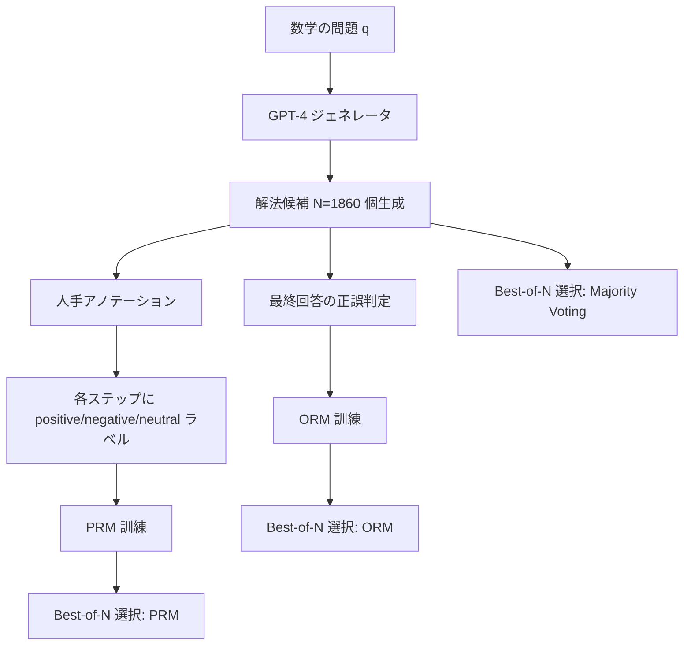
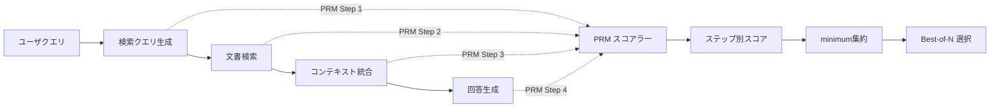

本記事は [Let's Verify Step by Step (arXiv:2305.20050)](https://arxiv.org/abs/2305.20050) の解説記事です。

## 論文概要（Abstract）

大規模言語モデル（LLM）の数学的推論能力を向上させるために、推論プロセスに対するフィードバック手法を比較した研究である。著者らは、最終回答の正誤のみを評価する**Outcome supervision（結果監督）**と、各推論ステップを個別に評価する**Process supervision（プロセス監督）**の2手法を体系的に比較している。MATHベンチマークにおいて、Process Reward Model（PRM）がOutcome Reward Model（ORM）を大幅に上回ることを実証し、80万件のステップレベル人手アノテーションを含むPRM800Kデータセットを公開した。

この記事は [Zenn記事: ProRAGプロセス監督強化学習で社内検索のハルシネーションを削減する実装](https://zenn.dev/0h_n0/articles/a92324327155d5) の深掘りです。

## 情報源

- **arXiv ID**: 2305.20050
- **URL**: [arXiv:2305.20050](https://arxiv.org/abs/2305.20050)
- **著者**: Hunter Lightman, Vineet Kosaraju, Yura Burda et al.（OpenAI）
- **発表年**: 2023年（ICLR 2024 採択）
- **分野**: cs.LG, cs.AI, cs.CL

## 背景と動機（Background & Motivation）

LLMは自然言語による数学的推論（chain-of-thought reasoning）において、途中のステップで論理的な誤りを犯すことがある。従来のRLHF（Reinforcement Learning from Human Feedback）パイプラインでは、最終回答の正誤のみに基づいてモデルを訓練するOutcome supervisionが主流であった。しかし、この手法には根本的な問題がある。最終回答が偶然正しくても途中の推論が誤っている場合（false positive）や、正しい推論を経ても計算ミスで最終回答を誤る場合（false negative）に、不適切な報酬が付与される。

著者らはこの課題に対し、各推論ステップの正誤を個別に評価するProcess supervisionの有効性を検証している。これは、AlphaGoにおける盤面評価（各手ごとの評価）と勝敗評価（結果のみ）の関係に類似する構造である。Uesato et al. (2022) が先行研究として両手法を比較していたが、結果は同等であった。本論文では、より大規模・精密な実験設定で両手法を比較し、Process supervisionの優位性を明確に示した。

## 主要な貢献（Key Contributions）

- **貢献1**: MATHベンチマークにおいて、PRMがORMを大幅に上回ることの実証（Best-of-N選択でPRM 78.2% vs ORM 72.4%）
- **貢献2**: PRM800Kデータセットの公開（約80万件のステップレベル人手アノテーション、75Kの数学問題解法に対する詳細なラベル）
- **貢献3**: PRMスコアの集約戦略としてminimumが最良であることの発見（product、meanより優位）
- **貢献4**: Process supervisionがアラインメント上も好ましいこと（報酬ハッキングへの耐性、解釈可能性の向上）の議論
- **貢献5**: Scalable oversight（人間の監督を効率的にスケールさせる手法）への貢献

## 技術的詳細（Technical Details）

### Outcome Reward Model（ORM）

ORMは、生成された解法全体に対して最終回答の正誤のみでラベルを付与し、報酬モデルを訓練する。

$$
r_{\text{ORM}}(s) = f_\theta(s_1, s_2, \ldots, s_n)
$$

ここで、
- $s = (s_1, s_2, \ldots, s_n)$: 推論ステップの系列（$n$ステップ）
- $r_{\text{ORM}}$: 解法全体に対する報酬スコア
- $f_\theta$: パラメータ$\theta$を持つ報酬モデル

ORM訓練では、最終回答が正解であれば全ステップにpositive、不正解であればnegativeのラベルが付与される。この粗いラベリングにより、途中で誤った推論をしていても最終回答が正しければ高報酬が得られるという問題がある。

### Process Reward Model（PRM）

PRMは、各推論ステップ$s_i$に対して個別に正誤ラベル（positive / negative / neutral）を付与し、ステップごとの報酬を出力する。

$$
r_{\text{PRM}}(s_i \mid s_1, \ldots, s_{i-1}, q) = g_\phi(q, s_1, \ldots, s_i)
$$

ここで、
- $q$: 数学の問題文
- $s_i$: $i$番目の推論ステップ
- $r_{\text{PRM}}(s_i \mid \cdot)$: ステップ$s_i$に対する報酬スコア
- $g_\phi$: パラメータ$\phi$を持つプロセス報酬モデル

各ステップのラベルは以下の3値で付与される：
- **positive**: このステップは論理的に正しい
- **negative**: このステップに誤りが含まれる
- **neutral**: 判断が曖昧（正しくも誤りとも言えない）

### アーキテクチャと訓練



著者らは、ベースモデルとしてGPT-4を使用している。訓練データの生成では、各問題に対してGPT-4で大量の解法候補（最大N=1860）を生成し、人手でステップレベルのアノテーションを行っている。

### Best-of-N 選択

Best-of-N選択は、$N$個の候補解法からreward modelのスコアが最も高い解法を選択する手法である。

$$
s^* = \arg\max_{s \in \{s^{(1)}, \ldots, s^{(N)}\}} R(s)
$$

ここで、
- $s^{(k)}$: $k$番目の候補解法
- $R(s)$: 解法$s$に対するreward modelのスコア
- $s^*$: 選択された最良の解法

PRMの場合、解法全体のスコア$R(s)$はステップごとのスコアを集約して算出する。著者らは以下の集約方法を比較している。

### スコア集約方法

PRMの各ステップスコアから解法全体のスコアを算出する集約方法として、以下の4つが比較されている。

**Minimum（最小値）**:

$$
R_{\min}(s) = \min_{i=1}^{n} r_{\text{PRM}}(s_i)
$$

**Product（積）**:

$$
R_{\text{prod}}(s) = \prod_{i=1}^{n} r_{\text{PRM}}(s_i)
$$

**Mean（平均）**:

$$
R_{\text{mean}}(s) = \frac{1}{n} \sum_{i=1}^{n} r_{\text{PRM}}(s_i)
$$

著者らの実験では、minimum戦略が他の集約方法を上回ると報告されている。これは直感的にも理解しやすい。推論チェーンにおいて1つでも誤ったステップがあれば、その後の推論は信頼できない。minimumは「最も弱いステップ」で解法を評価するため、誤りステップを含む解法を効果的に排除できる。

### アルゴリズム

PRMを用いたBest-of-N推論パイプラインの擬似コードを以下に示す。

```python
from dataclasses import dataclass
import math


@dataclass
class SolutionStep:
    """推論の1ステップを表すデータクラス

    Attributes:
        text: ステップのテキスト
        score: PRMによるスコア（0.0-1.0）
    """
    text: str
    score: float = 0.0


@dataclass
class Solution:
    """数学問題の解法を表すデータクラス

    Attributes:
        steps: 推論ステップのリスト
        final_answer: 最終回答
    """
    steps: list[SolutionStep]
    final_answer: str


def aggregate_prm_score(
    step_scores: list[float],
    method: str = "minimum"
) -> float:
    """PRMのステップスコアを集約して解法全体のスコアを算出する

    Args:
        step_scores: 各ステップのPRMスコアのリスト
        method: 集約方法（"minimum", "product", "mean"）

    Returns:
        集約された解法全体のスコア

    Raises:
        ValueError: 不明な集約方法が指定された場合
    """
    if not step_scores:
        return 0.0

    if method == "minimum":
        return min(step_scores)
    elif method == "product":
        return math.prod(step_scores)
    elif method == "mean":
        return sum(step_scores) / len(step_scores)
    else:
        raise ValueError(f"Unknown aggregation method: {method}")


def best_of_n_selection(
    solutions: list[Solution],
    prm_scorer: "PRMScorer",
    aggregation: str = "minimum"
) -> Solution:
    """Best-of-N選択: N個の候補からPRMスコアが最も高い解法を選択する

    Args:
        solutions: 候補解法のリスト（N個）
        prm_scorer: PRMスコアラー（各ステップのスコアを算出）
        aggregation: スコア集約方法

    Returns:
        最もスコアが高い解法
    """
    best_solution: Solution | None = None
    best_score: float = -1.0

    for solution in solutions:
        step_scores: list[float] = [
            prm_scorer.score_step(
                solution.steps[:i + 1]  # ステップi までのコンテキスト
            )
            for i in range(len(solution.steps))
        ]
        overall_score = aggregate_prm_score(step_scores, method=aggregation)

        if overall_score > best_score:
            best_score = overall_score
            best_solution = solution

    assert best_solution is not None, "No solutions provided"
    return best_solution
```

## 実装のポイント（Implementation）

### PRMのアノテーション設計

PRM800Kのアノテーションでは、人手によるステップレベルのラベリングが行われている。著者らは以下の点に注意を払ったと報告している。

1. **ステップの粒度**: 1つの「ステップ」は、改行で区切られた1つの推論単位。細かすぎると判断が困難になり、粗すぎるとエラーの局所化ができない
2. **neutralラベルの導入**: positive/negativeの2値ではなく、曖昧なステップにneutralラベルを導入することで、アノテーション品質を向上
3. **アクティブラーニング**: 全ステップをアノテーションするのではなく、PRMが誤りやすいステップを優先的にアノテーション

### アノテーションコスト

論文では、1ステップあたりのアノテーションコストについて直接的な数値は記載されていないが、80万ステップのアノテーションには相当なコストがかかることが推測される。この点は、PRM手法の実用的な課題の一つである。

### Best-of-N のサンプル数

著者らは$N=1860$という大きなサンプル数を使用している。実運用では計算コストの制約から$N$を小さくする必要があるが、論文のFigure 2では$N$の増加に伴うPRM/ORMの精度変化が示されており、$N$が増えるほどPRMとORMの差が拡大する傾向が確認されている。

### ORMとPRMの訓練の違い

ORMは最終回答の正誤のみで訓練するため、大量の解法を自動ラベリングできるという利点がある。一方、PRMはステップレベルの人手ラベルが必要であり、データ収集コストが高い。著者らは、このコスト差を考慮してもPRMが優位であると結論づけている。

## Production Deployment Guide

PRMを用いたBest-of-N推論パイプラインをAWS上で構築するための実装ガイドを示す。Zenn記事で紹介されているProRAGのPRM構築（Stage 2）の基盤として、本パイプラインを活用できる。

### AWS実装パターン（コスト最適化重視）

PRMベースの推論パイプラインは、LLMで複数の候補を生成し、PRMでスコアリングした上でBest-of-N選択を行う構成となる。トラフィック量別の推奨構成を以下に示す。

| 構成 | トラフィック | アーキテクチャ | 月額コスト概算 |
|------|------------|--------------|--------------|
| Small | ~100 req/日 | Lambda + Bedrock + DynamoDB | $80-200 |
| Medium | ~1,000 req/日 | ECS Fargate + Bedrock + ElastiCache | $400-900 |
| Large | 10,000+ req/日 | EKS + Spot + 自前PRMモデル(SageMaker) | $2,500-6,000 |

**Small構成の内訳**（ap-northeast-1、2026年4月時点の概算）:
- Lambda（推論オーケストレーション）: ~$5/月（100 req/日、各30秒）
- Bedrock（Claude 3.5 Sonnet、N=5候補生成）: ~$50-150/月（入出力トークン量に依存）
- DynamoDB（スコアキャッシュ）: ~$5/月（On-Demand）
- CloudWatch: ~$10/月

**Medium構成の内訳**:
- ECS Fargate（PRMスコアリングサーバ）: ~$100-200/月（0.5 vCPU, 1GB RAM, 常時起動）
- Bedrock: ~$200-500/月
- ElastiCache（Redis、スコアキャッシュ）: ~$50/月（cache.t3.micro）
- ALB: ~$30/月

**コスト削減テクニック**:
- Bedrock Batch APIを使用してN個の候補生成を一括処理（50%削減）
- Prompt Cachingを活用し、同一問題形式での入力プレフィクスを再利用（30-90%削減）
- PRMスコアのキャッシュ（同一ステップパターンの再計算を回避）
- N値の適応的制御: 容易な問題ではN=5、難問ではN=50に動的調整

注意: コスト試算はAWS ap-northeast-1（東京）リージョンの2026年4月時点の概算値である。実際のコストはトラフィックパターン、リージョン、バースト使用量により変動する。最新料金は[AWS料金計算ツール](https://calculator.aws/)で確認を推奨する。

### Terraformインフラコード

#### Small構成（Serverless: Lambda + Bedrock + DynamoDB）

```hcl
# PRM Best-of-N パイプライン - Small構成
# Lambda + Bedrock + DynamoDB（~100 req/日向け）

terraform {
  required_version = ">= 1.9.0"
  required_providers {
    aws = {
      source  = "hashicorp/aws"
      version = "~> 5.80"
    }
  }
}

provider "aws" {
  region = "ap-northeast-1"
}

# --- IAMロール（最小権限） ---
resource "aws_iam_role" "prm_lambda_role" {
  name = "prm-pipeline-lambda-role"

  assume_role_policy = jsonencode({
    Version = "2012-10-17"
    Statement = [{
      Action = "sts:AssumeRole"
      Effect = "Allow"
      Principal = { Service = "lambda.amazonaws.com" }
    }]
  })
}

resource "aws_iam_role_policy" "prm_lambda_policy" {
  name = "prm-pipeline-lambda-policy"
  role = aws_iam_role.prm_lambda_role.id

  policy = jsonencode({
    Version = "2012-10-17"
    Statement = [
      {
        # Bedrock推論のみ許可
        Effect   = "Allow"
        Action   = ["bedrock:InvokeModel", "bedrock:InvokeModelWithResponseStream"]
        Resource = "arn:aws:bedrock:ap-northeast-1::foundation-model/*"
      },
      {
        # DynamoDB スコアキャッシュ
        Effect   = "Allow"
        Action   = ["dynamodb:GetItem", "dynamodb:PutItem", "dynamodb:Query"]
        Resource = aws_dynamodb_table.prm_score_cache.arn
      },
      {
        # CloudWatch Logs
        Effect   = "Allow"
        Action   = ["logs:CreateLogGroup", "logs:CreateLogStream", "logs:PutLogEvents"]
        Resource = "arn:aws:logs:ap-northeast-1:*:*"
      }
    ]
  })
}

# --- DynamoDB（スコアキャッシュ、On-Demand） ---
resource "aws_dynamodb_table" "prm_score_cache" {
  name         = "prm-score-cache"
  billing_mode = "PAY_PER_REQUEST"  # On-Demand: 低トラフィックでコスト最適
  hash_key     = "solution_hash"

  attribute {
    name = "solution_hash"
    type = "S"
  }

  ttl {
    attribute_name = "expire_at"
    enabled        = true  # 24時間でキャッシュ失効
  }

  server_side_encryption {
    enabled = true  # KMS暗号化
  }
}

# --- Lambda関数（PRMパイプライン） ---
resource "aws_lambda_function" "prm_pipeline" {
  function_name = "prm-best-of-n-pipeline"
  runtime       = "python3.12"
  handler       = "handler.lambda_handler"
  role          = aws_iam_role.prm_lambda_role.arn
  timeout       = 120  # N個の候補生成 + スコアリング
  memory_size   = 512  # スコア計算に必要

  filename         = "lambda_package.zip"
  source_code_hash = filebase64sha256("lambda_package.zip")

  environment {
    variables = {
      SCORE_CACHE_TABLE = aws_dynamodb_table.prm_score_cache.name
      BEDROCK_MODEL_ID  = "anthropic.claude-3-5-sonnet-20241022-v2:0"
      N_CANDIDATES      = "10"
      AGGREGATION       = "minimum"  # 論文推奨の集約方法
    }
  }

  tracing_config {
    mode = "Active"  # X-Ray トレーシング有効
  }
}

# --- CloudWatchアラーム（コスト監視） ---
resource "aws_cloudwatch_metric_alarm" "lambda_duration" {
  alarm_name          = "prm-pipeline-duration-high"
  comparison_operator = "GreaterThanThreshold"
  evaluation_periods  = 3
  metric_name         = "Duration"
  namespace           = "AWS/Lambda"
  period              = 300
  statistic           = "Average"
  threshold           = 90000  # 90秒超過でアラート
  alarm_description   = "PRM pipeline Lambda execution time exceeds 90s"

  dimensions = {
    FunctionName = aws_lambda_function.prm_pipeline.function_name
  }
}
```

#### Large構成（Container: EKS + Karpenter + Spot Instances）

```hcl
# PRM Best-of-N パイプライン - Large構成
# EKS + Karpenter + Spot + SageMaker（10,000+ req/日向け）

# --- EKSクラスタ ---
module "eks" {
  source  = "terraform-aws-modules/eks/aws"
  version = "~> 20.31"

  cluster_name    = "prm-pipeline-cluster"
  cluster_version = "1.31"

  vpc_id     = module.vpc.vpc_id
  subnet_ids = module.vpc.private_subnets

  # コントロールプレーンのみ（ノードはKarpenterで管理）
  cluster_endpoint_public_access = false

  eks_managed_node_groups = {
    # Karpenter用の最小ノードグループ
    karpenter = {
      instance_types = ["m7i.large"]
      min_size       = 1
      max_size       = 2
      desired_size   = 1
    }
  }
}

# --- Karpenter Provisioner（Spot優先、自動スケーリング） ---
resource "kubectl_manifest" "karpenter_node_pool" {
  yaml_body = yamlencode({
    apiVersion = "karpenter.sh/v1"
    kind       = "NodePool"
    metadata   = { name = "prm-workers" }
    spec = {
      template = {
        spec = {
          requirements = [
            { key = "karpenter.sh/capacity-type", operator = "In", values = ["spot", "on-demand"] },
            { key = "node.kubernetes.io/instance-type", operator = "In",
              values = ["m7i.xlarge", "m6i.xlarge", "m5.xlarge", "c7i.xlarge"] },
          ]
          nodeClassRef = { name = "default" }
        }
      }
      limits   = { cpu = "100", memory = "400Gi" }
      disruption = {
        consolidationPolicy = "WhenEmptyOrUnderutilized"
        consolidateAfter    = "30s"
      }
    }
  })
}

# --- Secrets Manager（Bedrock設定） ---
resource "aws_secretsmanager_secret" "prm_config" {
  name        = "prm-pipeline/config"
  description = "PRM pipeline configuration"
}

# --- AWS Budgets（月次予算アラート） ---
resource "aws_budgets_budget" "prm_monthly" {
  name         = "prm-pipeline-monthly"
  budget_type  = "COST"
  limit_amount = "5000"
  limit_unit   = "USD"
  time_unit    = "MONTHLY"

  notification {
    comparison_operator       = "GREATER_THAN"
    threshold                 = 80  # 80%到達で通知
    threshold_type            = "PERCENTAGE"
    notification_type         = "ACTUAL"
    subscriber_email_addresses = ["alerts@example.com"]
  }
}
```

### 運用・監視設定

#### CloudWatch Logs Insights クエリ

```
# PRMスコアリングのレイテンシ分析（P95, P99）
fields @timestamp, @message
| filter @message like /prm_score/
| stats
    avg(duration_ms) as avg_ms,
    percentile(duration_ms, 95) as p95_ms,
    percentile(duration_ms, 99) as p99_ms,
    count(*) as request_count
  by bin(1h)

# Bedrockトークン使用量の異常検知
fields @timestamp, input_tokens, output_tokens
| filter @message like /bedrock_invoke/
| stats sum(input_tokens) as total_input, sum(output_tokens) as total_output by bin(1h)
| filter total_input > 500000
```

#### CloudWatch アラーム設定

```python
import boto3


def create_prm_alarms(function_name: str, sns_topic_arn: str) -> None:
    """PRM パイプライン用の CloudWatch アラームを作成する

    Args:
        function_name: Lambda関数名
        sns_topic_arn: 通知先のSNSトピックARN
    """
    cw = boto3.client("cloudwatch", region_name="ap-northeast-1")

    # Bedrock トークン使用量スパイク検知
    cw.put_metric_alarm(
        AlarmName=f"{function_name}-token-spike",
        MetricName="InputTokenCount",
        Namespace="AWS/Bedrock",
        Statistic="Sum",
        Period=3600,
        EvaluationPeriods=1,
        Threshold=100000,
        ComparisonOperator="GreaterThanThreshold",
        AlarmActions=[sns_topic_arn],
        AlarmDescription="Bedrock token usage spike detected",
    )
```

#### X-Ray トレーシング設定

```python
from aws_xray_sdk.core import xray_recorder, patch_all


def setup_xray_tracing() -> None:
    """X-Rayトレーシングを初期化し、boto3を自動計装する"""
    xray_recorder.configure(service="prm-pipeline")
    patch_all()  # boto3, requests等を自動計装


@xray_recorder.capture("prm_score_solution")
def score_solution_with_tracing(
    solution_steps: list[str],
    problem: str,
) -> float:
    """PRMスコアリングをX-Rayトレース付きで実行する

    Args:
        solution_steps: 推論ステップのリスト
        problem: 数学問題のテキスト

    Returns:
        集約されたPRMスコア
    """
    subsegment = xray_recorder.current_subsegment()
    if subsegment:
        subsegment.put_annotation("num_steps", len(solution_steps))
        subsegment.put_metadata("problem_preview", problem[:200])

    # スコアリングロジック（実装は省略）
    score = 0.0  # PRMスコア計算
    return score
```

#### Cost Explorer 自動レポート

```python
import boto3
from datetime import datetime, timedelta


def get_daily_cost_report() -> dict[str, float]:
    """日次コストレポートを取得し、Bedrock/Lambda/EKSのコストを抽出する

    Returns:
        サービス別のコスト辞書
    """
    ce = boto3.client("ce", region_name="us-east-1")
    today = datetime.utcnow().date()
    yesterday = today - timedelta(days=1)

    response = ce.get_cost_and_usage(
        TimePeriod={
            "Start": yesterday.isoformat(),
            "End": today.isoformat(),
        },
        Granularity="DAILY",
        Metrics=["UnblendedCost"],
        GroupBy=[{"Type": "DIMENSION", "Key": "SERVICE"}],
    )

    costs: dict[str, float] = {}
    for group in response["ResultsByTime"][0]["Groups"]:
        service = group["Keys"][0]
        amount = float(group["Metrics"]["UnblendedCost"]["Amount"])
        costs[service] = amount

    # $100/日超過でアラート
    total = sum(costs.values())
    if total > 100.0:
        sns = boto3.client("sns", region_name="ap-northeast-1")
        sns.publish(
            TopicArn="arn:aws:sns:ap-northeast-1:ACCOUNT_ID:cost-alert",
            Subject="PRM Pipeline Cost Alert",
            Message=f"Daily cost exceeded $100: ${total:.2f}",
        )

    return costs
```

### コスト最適化チェックリスト

**アーキテクチャ選択**:
- [ ] トラフィック~100 req/日: Serverless構成（Lambda + Bedrock）
- [ ] トラフィック~1,000 req/日: Hybrid構成（ECS + Bedrock）
- [ ] トラフィック10,000+ req/日: Container構成（EKS + 自前モデル）

**リソース最適化**:
- [ ] EC2/EKSノード: Spot Instances優先（最大90%削減）
- [ ] Reserved Instances: 1年コミットで最大72%削減
- [ ] Savings Plans: Compute Savings Plans検討
- [ ] Lambda: メモリサイズ最適化（512MB推奨、Power Tuning Tool活用）
- [ ] ECS/EKS: Karpenterによるアイドル時自動スケールダウン

**LLMコスト削減**:
- [ ] Bedrock Batch API: N個の候補を一括生成（50%削減）
- [ ] Prompt Caching: 同一問題形式のプレフィクス再利用（30-90%削減）
- [ ] モデル選択ロジック: 容易な問題はHaiku、難問はSonnetを動的選択
- [ ] トークン数制限: max_tokens制御で不要な長文生成を抑制
- [ ] N値の適応的制御: 問題難易度に応じてN=5〜50を動的調整

**監視・アラート**:
- [ ] AWS Budgets: 月次予算$5,000でアラート設定
- [ ] CloudWatch アラーム: Bedrock token使用量、Lambda実行時間
- [ ] Cost Anomaly Detection: 異常コストの自動検知
- [ ] 日次コストレポート: Cost Explorer APIで自動取得

**リソース管理**:
- [ ] 未使用リソース: 不要なSageMakerエンドポイント削除
- [ ] タグ戦略: `project:prm-pipeline`, `env:prod/dev`で全リソースタグ付け
- [ ] ライフサイクルポリシー: DynamoDBキャッシュTTL 24時間
- [ ] 開発環境: 夜間・週末のEKSノード停止

## 実験結果（Results）

### MATHベンチマーク

MATHベンチマークのテストサブセットにおける各手法の正答率を以下に示す（論文Table 1, Figure 2より）。

| 手法 | 正答率 |
|------|--------|
| Majority Voting（多数決） | 69.6% |
| ORM Best-of-N | 72.4% |
| PRM Best-of-N（minimum集約） | **78.2%** |

PRMはORMに対して+5.8ポイント、Majority Votingに対して+8.6ポイントの改善を達成している。

### スコア集約方法の比較

PRMのステップスコアを解法全体のスコアに集約する方法の比較結果を示す（論文より）。

| 集約方法 | MATH正答率 |
|---------|----------|
| minimum | **78.2%** |
| product | 76.8% |
| mean | 74.1% |

minimum戦略がproductを+1.4ポイント、meanを+4.1ポイント上回っている。著者らはこの結果について、推論チェーンの「最も弱いリンク」で評価することが、誤りを含む解法の排除に効果的であると考察している。

### Nの増加による精度変化

論文のFigure 2では、候補数$N$の増加に伴うPRM/ORMの精度変化が示されている。$N$が小さい場合（$N \leq 10$程度）ではPRMとORMの差は小さいが、$N$が100を超えると差が顕著に拡大する。これは、候補数が増えるほど「見かけ上正しいが実際は誤った解法」（reward hacking）が混入しやすくなり、ORMがこれを識別できないのに対し、PRMはステップレベルの検証によりこれを排除できることを示唆している。

## 実運用への応用（Practical Applications）

### ProRAGとの接続

Zenn記事で紹介されているProRAGのPRM構築（Stage 2）は、本論文のProcess supervision手法を検索拡張生成（RAG）に応用したものである。RAGにおける各推論ステップ（検索クエリ生成 → 文書取得 → コンテキスト統合 → 回答生成）を個別に評価することで、ハルシネーションの発生箇所を特定できる。



### 実運用での考慮事項

1. **レイテンシ**: Best-of-Nは$N$個の候補生成が必要なため、レイテンシが$N$倍になる。並列生成（Bedrock Batch APIやasync呼び出し）で緩和可能
2. **コスト効率**: $N$の増加はコスト増に直結する。問題の難易度推定を前段に配置し、容易な問題ではN=1（PRMなし）、難問ではN=10-50とする適応的制御が実用的
3. **PRMの汎化**: 本論文は数学ドメインのみで検証されている。RAGや他のドメインへの適用には、ドメイン固有のPRM訓練データが必要となる
4. **Scalable oversight**: 人手アノテーションのコストを削減するため、PRMの自己学習やAIフィードバック（RLAIF）との組み合わせが今後の方向性として考えられる

## 関連研究（Related Work）

- **Uesato et al. (2022)**: Process supervisionとOutcome supervisionを最初に比較した研究。GSM8Kデータセットで両手法は同等の性能を示したと報告。本論文は、より大規模な実験設定（MATHベンチマーク、GPT-4ベース、大量アノテーション）で、Process supervisionの優位性を明確にした
- **Cobbe et al. (2021)**: GSM8Kデータセットを公開し、数学的推論におけるverifierの有効性を実証。ORMベースのverifierを提案。本論文のORMベースラインの基礎
- **Wang et al. (2023) - Self-Consistency**: 複数の推論パスを生成し、多数決で最終回答を決定する手法。本論文のMajority Votingベースラインに対応。PRMは多数決より高精度だが、計算コストも高い
- **RLHF (Christiano et al., 2017)**: 人間のフィードバックに基づく強化学習の基礎フレームワーク。本論文はRLHFにおけるフィードバック粒度（outcome vs process）の影響を分析した研究と位置づけられる

## 制限事項

著者らは以下の制限を認識していると報告している。

1. **人手アノテーションコスト**: 80万ステップのアノテーションには大きなコストがかかる。自動化されたProcess supervisionの手法は今後の課題
2. **ドメイン限定**: 数学推論タスクのみで検証されており、コーディング、論理推論、科学的推論等の他ドメインへの汎化は検証されていない
3. **報酬ハッキング**: PRMもORMと同様に報酬ハッキングの対象となりうる。ステップレベルで高スコアを得るが実質的に無意味な推論パターンが学習される可能性がある
4. **ベースモデル依存**: 実験はGPT-4をベースモデルとして使用しており、他のモデルでの再現性は保証されていない

## まとめと今後の展望

本論文は、LLMの数学的推論において、各推論ステップを個別に評価するProcess supervision（PRM）が、最終回答のみを評価するOutcome supervision（ORM）を大幅に上回ることを実証した研究である。MATHベンチマークでPRM 78.2% vs ORM 72.4%という結果は、フィードバック粒度の重要性を示している。

PRM800Kデータセットの公開は、Process supervision研究のベンチマークとして広く活用されている。minimum集約戦略の優位性は、推論チェーンにおける「最も弱いリンク」の重要性を示唆しており、RAGパイプラインのハルシネーション検出（ProRAG等）にも応用可能な知見である。

今後は、人手アノテーションに依存しない自動Process supervision手法（Math-Shepherd、自己学習PRM等）や、数学以外のドメインへの展開が研究の方向性として期待される。

## 参考文献

- **arXiv**: [https://arxiv.org/abs/2305.20050](https://arxiv.org/abs/2305.20050)
- **PRM800K Dataset**: [https://github.com/openai/prm800k](https://github.com/openai/prm800k)
- **Related Zenn article**: [https://zenn.dev/0h_n0/articles/a92324327155d5](https://zenn.dev/0h_n0/articles/a92324327155d5)
