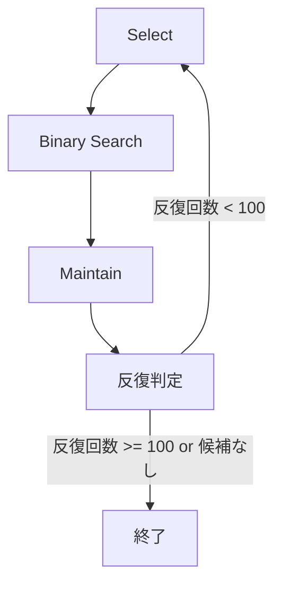

本記事は [OmegaPRM (arXiv:2406.06592)](https://arxiv.org/abs/2406.06592) の解説記事です。

## 論文概要（Abstract）

大規模言語モデル（LLM）の数学的推論において、中間ステップの正誤を評価する**プロセス監督**（Process Supervision）は有効だが、アノテーション収集のコストが課題であった。Luo et al. は、分割統治型の Monte Carlo Tree Search（MCTS）アルゴリズム **OmegaPRM** を提案し、人手を介さずに150万件以上のプロセスレベルアノテーションを自動生成する手法を報告している。著者らによれば、Gemini Pro の MATH500 精度を51%から69.4%へ改善したとされる（論文 Table 1 より）。

この記事は [Zenn記事: ProRAGプロセス監督強化学習で社内検索のハルシネーションを削減する実装](https://zenn.dev/0h_n0/articles/a92324327155d5) の深掘りです。

## 情報源

- **arXiv ID**: 2406.06592
- **URL**: [https://arxiv.org/abs/2406.06592](https://arxiv.org/abs/2406.06592)
- **著者**: Liangchen Luo, Yinxiao Liu, Rosanne Liu et al.（Google DeepMind）
- **発表年**: 2024（v2: 2024年12月）
- **分野**: cs.CL, cs.LG
- **投稿先**: ICLR 2025 に投稿

## 背景と動機（Background & Motivation）

LLM の数学的推論では、最終回答の正誤のみを評価する **Outcome Reward Model（ORM）** と、各推論ステップの正誤を評価する **Process Reward Model（PRM）** の2つのアプローチがある。PRM は誤りの箇所を特定できるため、多段推論タスクにおいて ORM より優位であることが先行研究で示されている。

しかし、PRM の訓練に必要なステップレベルのアノテーションは収集コストが高い。人手による方法（PRM800K）はスケーラビリティに限界があり、ブルートフォースによる Monte Carlo 推定（Math-Shepherd）は各ステップごとにロールアウトを実行するため $O(kM)$ の計算コストを要する（$k$: ロールアウト数、$M$: ステップ数）。

OmegaPRM は、二分探索を活用した分割統治型 MCTS により計算量を $O(k \log M)$ に削減し、同一の計算予算で従来手法の**75倍**のアノテーションを生成できると著者らは報告している。

## 主要な貢献（Key Contributions）

- **分割統治型 MCTS アルゴリズム**: 二分探索によるエラー境界の効率的特定。計算量を $O(kM)$ から $O(k \log M)$ に削減
- **150万件以上の自動プロセスアノテーション**: 12K の MATH 訓練問題から人手を介さず生成
- **Soft Label による PRM 訓練**: Monte Carlo 推定値を連続ラベルとして使用し、Hard Label や Pairwise Loss より高精度を達成
- **Weighted Self-Consistency**: PRM スコアの積による解の重み付け投票で、Best-of-N および多数決投票を上回る性能

## 技術的詳細（Technical Details）

### ORM と PRM の定式化

**Outcome Reward Model（ORM）** は、問題 $q$ と解答 $x$ に対して最終回答の正しさを予測する。

$$
p = \text{ORM}(q, x)
$$

**Process Reward Model（PRM）** は、問題 $q$、推論ステップ列 $x_{1:t-1}$、次のステップ $x_t$ に対してステップレベルの正しさを予測する。

$$
p_t = \text{PRM}([q, x_{1:t-1}], x_t)
$$

ここで、
- $q$: 数学問題
- $x$: 解答全体
- $x_t$: $t$ 番目の推論ステップ
- $p_t$: ステップ $t$ の正しさスコア

### Monte Carlo 推定

各ステップの正しさは、そのステップ以降からロールアウトを実行し、正解に到達した割合で推定する。

$$
\text{MC}(q, x_{1:t}) = \frac{\text{正解ロールアウト数}}{\text{総ロールアウト数}}
$$

MC 値が1に近いほどそのステップまでの推論は正しく、0に近いほど誤りを含む可能性が高い。

### 分割統治型 MCTS アルゴリズム

OmegaPRM の MCTS は以下の4フェーズで構成される。



#### Phase 1: Select（選択）

MC 推定値が $0 < \text{MC}(s) < 1$ を満たすロールアウトのプールから、以下のスコアが最大の (状態, ロールアウト) ペア $(s, r)$ を選択する。

$$
(s, r) = \arg\max_{(s,r)} \left[ Q(s, r) + U(s) \right]
$$

**Q 関数**は以下のように定義される。

$$
Q(s, r) = \alpha^{(1 - \text{MC}(s))} \cdot \beta^{\text{len}(r) / L}
$$

ここで、
- $\alpha, \beta \in (0, 1]$: 定数ハイパーパラメータ（論文では $\alpha = 0.5$, $\beta = 0.9$）
- $L > 0$: 正規化定数（論文では $L = 500$）
- $\text{len}(r)$: ロールアウトのトークン長
- $\text{MC}(s)$: 状態 $s$ の Monte Carlo 推定値

**探索項 U(s)** は PUCT（Predictor + Upper Confidence bounds applied to Trees）に基づく。

$$
U(s) = c_{\text{puct}} \cdot \frac{\sqrt{\sum_i N(s_i)}}{1 + N(s)}
$$

ここで、
- $c_{\text{puct}}$: 探索係数（論文では $c_{\text{puct}} = 0.125$）
- $N(s)$: 状態 $s$ の訪問回数
- $\sum_i N(s_i)$: 全候補状態の訪問回数の合計

Q 関数の設計意図として、$\text{MC}(s)$ が中間的な値（正解と不正解のロールアウトが混在）を持つ状態が優先される。これにより、エラー境界を含む有望なノードが探索される。$\beta^{\text{len}(r)/L}$ の項は短いロールアウト（早期に分岐点が見つかる）を優先するバイアスを与える。

#### Phase 2: Binary Search（二分探索）

選択されたロールアウトに対して、エラーが発生した最初のステップを二分探索で特定する。

```python
def binary_search_error(
    solution: list[str],
    question: str,
    golden_answer: str,
    k: int = 8,
    min_length_ratio: float = 1 / 16,
) -> int:
    """二分探索によるエラーステップの特定

    Args:
        solution: 推論ステップのリスト
        question: 数学問題
        golden_answer: 正解
        k: 各位置でのロールアウト数
        min_length_ratio: 平均解答長に対する終了閾値

    Returns:
        エラーが発生した最初のステップのインデックス
    """
    left: int = 0
    right: int = len(solution)
    avg_length: int = len(solution)

    while (right - left) > avg_length * min_length_ratio:
        mid: int = (left + right) // 2
        # midまでのステップからk回ロールアウトを実行
        prefix = solution[:mid]
        correct_count: int = sum(
            1 for _ in range(k)
            if rollout_from(question, prefix) == golden_answer
        )

        if correct_count > 0:
            # midまでは正解到達可能 → エラーは後半
            left = mid + 1
        else:
            # midから正解到達不可 → エラーは前半
            right = mid

    return left
```

二分探索の終了条件は、探索区間の長さが「平均解答長 / 16」未満になった時点である。この粒度により、実用上十分なステップレベルの精度が得られると著者らは述べている。

#### Phase 3: Maintain（更新）

二分探索で得られた新しいロールアウト結果を用いて、ツリーの統計情報を更新する。

1. 訪問回数 $N(s)$ をインクリメント
2. MC 推定値 $\text{MC}(s)$ を新しいロールアウト結果で更新
3. Q 値 $Q(s, r)$ を再計算

#### Phase 4: 反復判定

探索回数が上限（論文では100回/問題）に達するか、$0 < \text{MC}(s) < 1$ を満たす候補がなくなるまで Phase 1-3 を繰り返す。

### 質問フィルタリング

訓練データの品質を確保するため、MATH の12K 問題に対して $k = 32$ のロールアウトを実行し、以下の条件で問題をフィルタリングしている。

- **除外: 難しすぎる問題** — 32回のロールアウトで正解が1つも得られない問題
- **除外: 簡単すぎる問題** — 32回のロールアウトで不正解が1つもない問題

これにより、偽陽性・偽陰性のノイズが低減される。

### PRM 訓練目的関数

著者らは3種類の訓練目的関数を比較している。

#### Pointwise Soft Label（論文の主要手法）

MC 推定値をそのまま連続ラベルとして使用する。

$$
\mathcal{L}_{\text{soft}} = \sum_{i} \left[ \hat{y}_i \log y_i + (1 - \hat{y}_i) \log(1 - y_i) \right]
$$

ここで、$\hat{y}_i = \text{MC}(s_i)$（連続値）、$y_i$ はモデルの予測確率。

#### Pointwise Hard Label

MC 推定値を二値化してラベルとする。

$$
\hat{y}_i = \mathbb{1}[\text{MC}(s_i) > 0]
$$

#### Pairwise Loss（Bradley-Terry モデル）

MC 値が $p$ と $q$ の2つのアクションに対して、選好確率を以下のように定義する。

$$
P(X \succ Y) = \frac{1}{2}(1 + p - q)
$$

#### 訓練目的関数の比較結果

著者らの実験結果（論文 Table 2 より）:

| 訓練目的関数 | MATH500 精度 |
|---|---|
| Pointwise Soft Label | 70.1% |
| Pairwise Loss | 64.2% |
| Pointwise Hard Label | 63.3% |

Soft Label が他の手法を大幅に上回っている。著者らは、MC 推定値の連続的な情報（「どの程度正しいか」）を保持することで、より豊かな監督信号が得られると分析している。

### 推論時の Weighted Self-Consistency

推論時には、問題に対して $k$ 個の解答候補を生成し、PRM により各ステップのスコアを算出する。解答全体のスコアは各ステップスコアの**積**で計算される。

$$
\text{Score}(x) = \prod_{t=1}^{T} \text{PRM}([q, x_{1:t-1}], x_t)
$$

ここで、$T$ は解答のステップ数。スコアが最大の解答を最終回答として選択する。

この方法は、1ステップでも信頼度が低い推論を含む解答のスコアが大幅に下がるため、全ステップが高品質な解答を選好する効果がある。

## 実装のポイント（Implementation）

### ロールアウト戦略

- ロールアウト数 $k = 8$ を各 MC 推定に使用。計算コストと推定精度のバランスを取っている
- 正解判定は最終回答と正解の文字列比較で実施

### ステップの定義

本論文では、ルールベースのステップ区切り（改行等）ではなく、「解答中の任意の連続トークン列」をステップとして扱う。二分探索が任意の位置で分割できるため、固定のステップ定義が不要となる。

### MCTS ハイパーパラメータ

| パラメータ | 値 | 役割 |
|---|---|---|
| $\alpha$ | 0.5 | MC 値による状態優先度の制御 |
| $\beta$ | 0.9 | ロールアウト長によるバイアス |
| $L$ | 500 | ロールアウト長の正規化定数 |
| $c_{\text{puct}}$ | 0.125 | 探索と活用のバランス |
| $k$ | 8 | MC 推定のロールアウト数 |
| 探索上限 | 100回/問題 | 計算予算の制御 |

### 実装上の注意点

1. **MC 推定のバリアンス**: $k = 8$ は比較的少ないため、個別のステップの MC 推定にはノイズが含まれる。著者らは「自動プロセスアノテーションにはノイズ（偽陽性・偽陰性）が含まれる」と認めているが、大量データによる平均化効果で全体としては有効に機能すると述べている
2. **質問フィルタリングの重要性**: 難しすぎる/簡単すぎる問題を除外しないと、全ステップが同一ラベルとなり訓練信号が得られない
3. **ステップ粒度の制御**: 二分探索の終了閾値（平均解答長 / 16）は、ステップの粒度と計算コストのトレードオフを制御する

## Production Deployment Guide

OmegaPRM のアプローチは、PRM を訓練して推論時にリランキングに使用するパイプラインとして本番環境に応用できる。

### AWS 実装パターン（コスト最適化重視）

**トラフィック量別の推奨構成**:

| 構成 | 規模 | サービス | 月額コスト概算 |
|---|---|---|---|
| Small | ~100 req/日 | Lambda + Bedrock + DynamoDB | $50-150 |
| Medium | ~1,000 req/日 | ECS Fargate + Bedrock + ElastiCache | $300-800 |
| Large | 10,000+ req/日 | EKS + Spot Instances + SageMaker Endpoint | $2,000-5,000 |

**Small 構成の詳細（Serverless）**:
- API Gateway + Lambda（メモリ 1024MB、タイムアウト 30秒）で PRM 推論を実行
- Bedrock で解答候補の生成（Claude 3.5 Haiku 等）
- DynamoDB に推論結果キャッシュ（On-Demand モード）
- S3 にモデルアーティファクト保管

**Large 構成の詳細（Container）**:
- EKS クラスタ上で PRM モデルを SageMaker Endpoint にデプロイ
- Karpenter による Spot Instances の自動スケーリング（最大90%コスト削減）
- ElastiCache（Redis）で解答候補のキャッシュ
- CloudFront でAPI エッジキャッシュ

**コスト削減テクニック**:
- Spot Instances 活用で最大90%削減（PRM 推論は中断耐性あり）
- Reserved Instances 1年コミットで最大72%削減（SageMaker Endpoint）
- Bedrock Batch API 使用で50%削減（バッチ推論時）
- Prompt Caching 有効化で30-90%削減（同一問題の再推論時）

> **注意**: 上記コストは2026年4月時点の AWS ap-northeast-1（東京）リージョン料金に基づく概算値です。実際のコストはトラフィックパターン、リージョン、バースト使用量により変動します。最新料金は [AWS 料金計算ツール](https://calculator.aws/) で確認を推奨します。

### Terraform インフラコード

**Small 構成（Serverless）**:

```hcl
# OmegaPRM PRM Inference - Small構成 (Serverless)
# Lambda + Bedrock + DynamoDB

terraform {
  required_version = ">= 1.9"
  required_providers {
    aws = {
      source  = "hashicorp/aws"
      version = "~> 5.80"
    }
  }
}

provider "aws" {
  region = "ap-northeast-1"
}

# --- IAM Role (最小権限) ---
resource "aws_iam_role" "prm_lambda" {
  name = "prm-inference-lambda-role"
  assume_role_policy = jsonencode({
    Version = "2012-10-17"
    Statement = [{
      Action = "sts:AssumeRole"
      Effect = "Allow"
      Principal = { Service = "lambda.amazonaws.com" }
    }]
  })
}

resource "aws_iam_role_policy" "prm_lambda_policy" {
  name = "prm-inference-policy"
  role = aws_iam_role.prm_lambda.id
  policy = jsonencode({
    Version = "2012-10-17"
    Statement = [
      {
        Effect   = "Allow"
        Action   = ["bedrock:InvokeModel"]
        Resource = "arn:aws:bedrock:ap-northeast-1::foundation-model/*"
      },
      {
        Effect   = "Allow"
        Action   = ["dynamodb:GetItem", "dynamodb:PutItem", "dynamodb:Query"]
        Resource = aws_dynamodb_table.prm_cache.arn
      },
      {
        Effect   = "Allow"
        Action   = ["s3:GetObject"]
        Resource = "${aws_s3_bucket.model_artifacts.arn}/*"
      },
      {
        Effect = "Allow"
        Action = [
          "logs:CreateLogGroup",
          "logs:CreateLogStream",
          "logs:PutLogEvents"
        ]
        Resource = "arn:aws:logs:*:*:*"
      }
    ]
  })
}

# --- DynamoDB (On-Demand, KMS暗号化) ---
resource "aws_dynamodb_table" "prm_cache" {
  name         = "prm-inference-cache"
  billing_mode = "PAY_PER_REQUEST"
  hash_key     = "question_hash"

  attribute {
    name = "question_hash"
    type = "S"
  }

  server_side_encryption {
    enabled = true
  }

  ttl {
    attribute_name = "expires_at"
    enabled        = true
  }
}

# --- S3 (モデルアーティファクト, KMS暗号化) ---
resource "aws_s3_bucket" "model_artifacts" {
  bucket = "prm-model-artifacts-${data.aws_caller_identity.current.account_id}"
}

resource "aws_s3_bucket_server_side_encryption_configuration" "model_enc" {
  bucket = aws_s3_bucket.model_artifacts.id
  rule {
    apply_server_side_encryption_by_default {
      sse_algorithm = "aws:kms"
    }
  }
}

resource "aws_s3_bucket_public_access_block" "model_block" {
  bucket                  = aws_s3_bucket.model_artifacts.id
  block_public_acls       = true
  block_public_policy     = true
  ignore_public_acls      = true
  restrict_public_buckets = true
}

# --- Lambda ---
resource "aws_lambda_function" "prm_inference" {
  function_name = "prm-weighted-voting"
  role          = aws_iam_role.prm_lambda.arn
  handler       = "handler.lambda_handler"
  runtime       = "python3.12"
  timeout       = 30
  memory_size   = 1024
  filename      = "lambda_package.zip"

  environment {
    variables = {
      CACHE_TABLE = aws_dynamodb_table.prm_cache.name
      MODEL_BUCKET = aws_s3_bucket.model_artifacts.id
    }
  }

  tracing_config {
    mode = "Active"  # X-Ray有効化
  }
}

# --- CloudWatch Alarm (コスト監視) ---
resource "aws_cloudwatch_metric_alarm" "lambda_duration" {
  alarm_name          = "prm-lambda-high-duration"
  comparison_operator = "GreaterThanThreshold"
  evaluation_periods  = 3
  metric_name         = "Duration"
  namespace           = "AWS/Lambda"
  period              = 300
  statistic           = "p95"
  threshold           = 25000  # 25秒 (タイムアウト30秒の83%)
  alarm_actions       = []     # SNS ARNを設定

  dimensions = {
    FunctionName = aws_lambda_function.prm_inference.function_name
  }
}

data "aws_caller_identity" "current" {}
```

**Large 構成（Container）**:

```hcl
# OmegaPRM PRM Inference - Large構成 (EKS + Spot)

module "eks" {
  source  = "terraform-aws-modules/eks/aws"
  version = "~> 20.31"

  cluster_name    = "prm-inference-cluster"
  cluster_version = "1.31"

  vpc_id     = module.vpc.vpc_id
  subnet_ids = module.vpc.private_subnets

  cluster_endpoint_public_access = false  # プライベートアクセスのみ

  eks_managed_node_groups = {
    # Spot優先でコスト最大90%削減
    gpu_spot = {
      instance_types = ["g5.xlarge", "g5.2xlarge"]
      capacity_type  = "SPOT"
      min_size       = 1
      max_size       = 10
      desired_size   = 2
    }
  }
}

# --- Karpenter Provisioner (Spot優先) ---
resource "kubectl_manifest" "karpenter_provisioner" {
  yaml_body = yamlencode({
    apiVersion = "karpenter.sh/v1"
    kind       = "NodePool"
    metadata   = { name = "prm-gpu-pool" }
    spec = {
      template = {
        spec = {
          requirements = [
            { key = "karpenter.sh/capacity-type", operator = "In", values = ["spot", "on-demand"] },
            { key = "node.kubernetes.io/instance-type", operator = "In", values = ["g5.xlarge", "g5.2xlarge", "g5.4xlarge"] }
          ]
        }
      }
      limits   = { cpu = "100", memory = "400Gi" }
      disruption = {
        consolidationPolicy = "WhenEmptyOrUnderutilized"
        consolidateAfter    = "30s"
      }
    }
  })
}

# --- AWS Budgets (予算アラート) ---
resource "aws_budgets_budget" "monthly" {
  name         = "prm-inference-monthly"
  budget_type  = "COST"
  limit_amount = "5000"
  limit_unit   = "USD"
  time_unit    = "MONTHLY"

  notification {
    comparison_operator       = "GREATER_THAN"
    threshold                 = 80
    threshold_type            = "PERCENTAGE"
    notification_type         = "ACTUAL"
    subscriber_email_addresses = ["admin@example.com"]
  }
}
```

### 運用・監視設定

**CloudWatch Logs Insights クエリ（コスト異常検知）**:

```
# 1時間あたりのPRM推論トークン使用量
fields @timestamp, @message
| filter @message like /token_count/
| stats sum(token_count) as total_tokens by bin(1h)
| sort @timestamp desc
```

**CloudWatch アラーム設定（Python）**:

```python
import boto3

def create_prm_alarms(function_name: str, sns_topic_arn: str) -> None:
    """PRM推論のCloudWatchアラームを作成

    Args:
        function_name: Lambda関数名
        sns_topic_arn: 通知先SNSトピックARN
    """
    cw = boto3.client("cloudwatch")

    # Bedrock トークン使用量スパイク検知
    cw.put_metric_alarm(
        AlarmName="prm-bedrock-token-spike",
        MetricName="InputTokenCount",
        Namespace="AWS/Bedrock",
        Statistic="Sum",
        Period=3600,
        EvaluationPeriods=1,
        Threshold=100000,
        ComparisonOperator="GreaterThanThreshold",
        AlarmActions=[sns_topic_arn],
    )
```

**X-Ray トレーシング設定（Python）**:

```python
from aws_xray_sdk.core import xray_recorder, patch_all
import boto3

# boto3自動計装
patch_all()

def trace_prm_inference(question: str, solutions: list[str]) -> dict:
    """PRM推論をX-Rayでトレース

    Args:
        question: 数学問題
        solutions: 解答候補のリスト

    Returns:
        最高スコアの解答と各ステップスコア
    """
    with xray_recorder.in_subsegment("prm_scoring") as subsegment:
        subsegment.put_annotation("question_length", len(question))
        subsegment.put_annotation("num_solutions", len(solutions))

        scores: list[float] = [score_solution(q=question, s=s) for s in solutions]
        best_idx: int = max(range(len(scores)), key=lambda i: scores[i])

        subsegment.put_metadata("best_score", scores[best_idx])
        return {"solution": solutions[best_idx], "score": scores[best_idx]}
```

**Cost Explorer 自動レポート（Python）**:

```python
import boto3
from datetime import datetime, timedelta

def daily_cost_report(sns_topic_arn: str) -> None:
    """日次コストレポートを取得しSNS通知

    Args:
        sns_topic_arn: 通知先SNSトピックARN
    """
    ce = boto3.client("ce")
    today = datetime.utcnow().strftime("%Y-%m-%d")
    yesterday = (datetime.utcnow() - timedelta(days=1)).strftime("%Y-%m-%d")

    response = ce.get_cost_and_usage(
        TimePeriod={"Start": yesterday, "End": today},
        Granularity="DAILY",
        Metrics=["UnblendedCost"],
        Filter={
            "Tags": {
                "Key": "project",
                "Values": ["prm-inference"],
            }
        },
        GroupBy=[{"Type": "SERVICE", "Key": "SERVICE"}],
    )

    total: float = sum(
        float(g["Metrics"]["UnblendedCost"]["Amount"])
        for r in response["ResultsByTime"]
        for g in r["Groups"]
    )

    if total > 100:
        sns = boto3.client("sns")
        sns.publish(
            TopicArn=sns_topic_arn,
            Subject="PRM Inference Cost Alert",
            Message=f"日次コスト: ${total:.2f} (閾値: $100)",
        )
```

### コスト最適化チェックリスト

**アーキテクチャ選択**:
- [ ] トラフィック量に応じた構成を選択（Small: Serverless / Medium: Hybrid / Large: Container）
- [ ] PRM モデルサイズに応じた GPU インスタンスタイプを選定

**リソース最適化**:
- [ ] EC2/EKS: Spot Instances を優先使用（PRM 推論は中断耐性あり）
- [ ] Reserved Instances: SageMaker Endpoint に1年コミット
- [ ] Savings Plans: Compute Savings Plans の検討
- [ ] Lambda: メモリサイズ最適化（Power Tuning で測定）
- [ ] ECS/EKS: アイドル時のスケールダウン設定（Karpenter consolidation）

**LLM コスト削減**:
- [ ] Bedrock Batch API: バッチ推論で50%削減
- [ ] Prompt Caching: 同一問題テンプレートのキャッシュ有効化
- [ ] モデル選択ロジック: 簡単な問題は小型モデル、難問は大型モデル
- [ ] トークン数制限: 解答候補の最大長を制限

**監視・アラート**:
- [ ] AWS Budgets: 月次予算アラート設定（80%/100%閾値）
- [ ] CloudWatch アラーム: トークン使用量スパイク検知
- [ ] Cost Anomaly Detection: 異常コスト自動検知の有効化
- [ ] 日次コストレポート: SNS 通知による日次集計

**リソース管理**:
- [ ] 未使用リソース削除: 不要な SageMaker Endpoint の停止
- [ ] タグ戦略: `project:prm-inference` タグの徹底
- [ ] ライフサイクルポリシー: S3 モデルアーティファクトの世代管理
- [ ] 開発環境夜間停止: EKS ノードの夜間・週末スケールダウン
- [ ] DynamoDB TTL: キャッシュの自動削除

## 実験結果（Results）

### ベンチマーク比較（論文 Table 1 より）

著者らは、PRM-weighted majority voting（$k = 64$ 解答候補）で以下の結果を報告している。

| 手法 | MATH500 (Gemini Pro) | MATH500 (Gemma2 27B) | GSM8K (Gemini Pro) | GSM8K (Gemma2 27B) |
|---|---|---|---|---|
| Majority Vote@64 | 67.2% | 54.7% | 92.7% | 90.6% |
| + Math-Shepherd | 67.2% | 57.4% | 92.7% | 90.5% |
| + Math-Shepherd (著者ら実装) | 67.2% | 55.2% | 91.8% | 91.4% |
| + PRM800K | 67.6% | 57.2% | 92.9% | 91.7% |
| **+ OmegaPRM** | **69.4%** | **58.2%** | **93.6%** | **92.2%** |

OmegaPRM は全ベンチマーク・全モデルにおいて既存手法を上回っている。特に Gemini Pro の MATH500 では、ベースラインの51%（pass@1）から69.4%（weighted voting@64）への改善が報告されている。

### 分析ポイント

**Math-Shepherd との比較**: Math-Shepherd はブルートフォースで各ステップの MC 推定を行う手法であり、同一計算予算では OmegaPRM の75分の1のアノテーションしか得られない。OmegaPRM のデータ効率の優位性がベンチマーク結果に直接反映されている。

**PRM800K との比較**: PRM800K は OpenAI の研究者が人手でアノテーションしたデータセットであり、規模は約80万件。OmegaPRM の150万件の自動アノテーションが人手アノテーションを上回る性能を示した点は、自動プロセス監督の実用性を示す根拠として著者らが強調している。

**サンプル数に対するスケーリング**: 著者らは $k = 128$ での実験結果も報告しており、OmegaPRM は解答候補数の増加に対して安定した性能向上を示す一方、Math-Shepherd 等の手法は多数決投票の精度に収束する傾向があるとしている。

## 実運用への応用（Practical Applications）

### 数学推論以外への展開

OmegaPRM のフレームワークは、正解が明確に判定できるタスクであれば数学以外にも適用可能である。

- **コード生成**: テストケースの通過/不通過を正解判定に使用し、コード生成の中間ステップに対する PRM を訓練できる
- **RAG パイプライン**: 関連する Zenn 記事で解説されている ProRAG のように、検索結果の各ステップ（クエリ生成、文書選択、回答生成）に対するプロセス監督に応用可能
- **論理推論**: 法的文書の分析や科学的仮説検証など、多段推論を要するドメインへの適用

### プロダクション視点での課題

- **計算コスト**: MCTS による自動アノテーションは PRM 訓練の前段階で大量の推論を必要とする。訓練データの作成は一度きりだが、モデル更新のたびに再実行が必要
- **閉じた問題への制約**: 著者らが認めているように、OmegaPRM は「正解が一意に決まる問題」を前提としている。自由記述型タスクへの適用には追加の工夫が必要
- **ノイズ耐性**: $k = 8$ のロールアウトによる MC 推定にはバリアンスが含まれる。本番環境では $k$ を増やすか、アンサンブルによるノイズ低減を検討する価値がある

## 関連研究（Related Work）

- **PRM800K** (Lightman et al., 2023): OpenAI による人手プロセスアノテーション。約80万件のステップレベルラベルを収集し PRM の有効性を実証した先駆的研究。OmegaPRM はこれを自動化し、規模を約2倍に拡大
- **Math-Shepherd** (Wang et al., 2024): ブルートフォース MC 推定による自動プロセスアノテーション。各ステップで独立にロールアウトを実行するため $O(kM)$ のコストを要する。OmegaPRM は二分探索により $O(k \log M)$ に削減
- **AlphaGo / AlphaZero** (Silver et al., 2016, 2017): MCTS を用いた探索手法の原型。OmegaPRM は囲碁の MCTS を数学推論のプロセスアノテーション収集に適応させた
- **Self-Consistency** (Wang et al., 2023): 複数の推論パスを生成し多数決で最終回答を選択する手法。OmegaPRM の weighted self-consistency は、PRM スコアによる重み付けで多数決を改良したもの

## まとめと今後の展望

OmegaPRM は、分割統治型 MCTS と二分探索を組み合わせることで、プロセス監督データの収集効率を大幅に改善した手法である。著者らの報告によれば、同一計算予算で従来手法の75倍のアノテーションを生成し、Gemini Pro の MATH500 精度を18.4ポイント向上させている。

実務への示唆として、PRM によるリランキングは既存の LLM パイプラインに追加しやすく、推論精度の向上と誤りの特定を同時に実現できる。ProRAG のようなプロセス監督型 RAG システムにおいても、OmegaPRM のアプローチで PRM の訓練データを効率的に収集できる可能性がある。

今後の研究方向として、著者らは閉じた問題以外への拡張と、より大規模なモデルでの検証を課題として挙げている。また、MCTS のハイパーパラメータ（$\alpha$, $\beta$, $c_{\text{puct}}$ 等）の自動チューニングや、ドメイン適応の手法も重要な研究課題である。

## 参考文献

- **arXiv**: [https://arxiv.org/abs/2406.06592](https://arxiv.org/abs/2406.06592)
- **OpenReview**: [https://openreview.net/forum?id=KwPUQOQIKt](https://openreview.net/forum?id=KwPUQOQIKt)
- **Related Zenn article**: [https://zenn.dev/0h_n0/articles/a92324327155d5](https://zenn.dev/0h_n0/articles/a92324327155d5)
