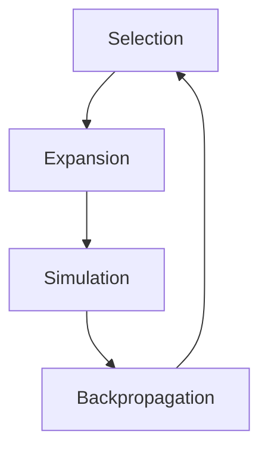
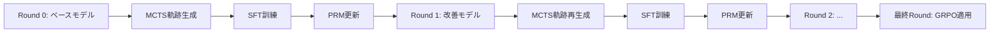

## 論文概要（Abstract）

本記事は [ReST-RAG (arXiv:2505.07900)](https://arxiv.org/abs/2505.07900) の解説記事です。

ReST-RAGは、Monte Carlo Tree Search（MCTS）とProcess Reward Model（PRM）を組み合わせて高品質な検索拡張生成（RAG）の訓練軌跡を自動的に生成し、SFT（Supervised Fine-Tuning）とGRPO（Group Relative Policy Optimization）の2段階でRAG推論モデルを訓練するフレームワークである。推論時にはPRMガイド付きビームサーチを用いることで、MCTS相当の精度を約8倍の速度で達成する。著者らは5つのマルチホップQAベンチマークにおいて、既存手法Search-R1を上回る結果を報告している。

この記事は [Zenn記事: ProRAGプロセス監督強化学習で社内検索のハルシネーションを削減する実装](https://zenn.dev/0h_n0/articles/a92324327155d5) の深掘りです。

## 情報源

- **arXiv ID**: 2505.07900
- **URL**: [https://arxiv.org/abs/2505.07900](https://arxiv.org/abs/2505.07900)
- **著者**: Qianxi He, Yifei Xu, Dongkuan Xu, Jianfeng Gao
- **発表年**: 2025
- **分野**: cs.CL, cs.AI, cs.IR

## 背景と動機（Background & Motivation）

RAGはLLMの知識限界を外部文書検索で補完する有力な手法だが、マルチホップ質問応答（複数の文書を段階的に検索・推論する必要があるタスク）では依然として課題が残る。従来のRAGシステムはsingle-hopの検索パイプラインを前提としており、「次にどのクエリを生成すべきか」「いつ検索を打ち切って回答すべきか」といった**検索タイミングの判断**をLLMに委ねる設計が不十分であった。

近年、Search-R1やR1-Searcherなどの研究がRLベースの訓練でRAG推論能力の向上を試みているが、これらの手法には2つの課題がある。第一に、RLの報酬は最終回答の正否（outcome reward）のみに基づいており、中間ステップの質を評価できない。第二に、MCTS等の探索アルゴリズムによる高品質な軌跡生成を訓練データに活用する試みが不十分である。

ReST-RAGは、**プロセス報酬モデル（PRM）**で中間ステップを評価しながらMCTSで軌跡を探索し、さらに**反復的自己訓練（ReST）**パラダイムでモデルを段階的に改善するアプローチを提案している。

## 主要な貢献（Key Contributions）

- **PRM ガイド MCTS による高品質軌跡生成**: 各検索・推論ステップにプロセス報酬を付与し、UCT（Upper Confidence Bound for Trees）で探索を誘導することで、最終回答の正しさだけでなく中間推論の質も担保した訓練データを生成する
- **ReST パラダイムの RAG ドメインへの適用**: 反復的に「MCTSで軌跡生成 → SFTで模倣学習」のサイクルを回すことで、各ラウンドでモデルの探索能力が向上し、次ラウンドでより高品質な軌跡が得られる正のフィードバックループを構築する
- **PRM ビームサーチによる推論高速化**: 訓練時のMCTSは計算コストが高いが、推論時にはPRMをヒューリスティックとしたビームサーチに切り替えることで、MCTS相当の精度を約8倍の速度で実現する
- **SFT → GRPO の2段階訓練パイプライン**: SFTで基本的な推論パターンを学習した後、GRPOでプロセス報酬を中間報酬として組み込んだ強化学習で精度をさらに向上させる

## 技術的詳細（Technical Details）

### RAG推論軌跡の形式化

ReST-RAGでは、マルチホップRAGの推論過程を以下の形式の軌跡として定義する：

$$
\tau = (r_1, q_1, d_1, r_2, q_2, d_2, \ldots, r_T, a)
$$

ここで、
- $r_t$: ステップ $t$ での推論（reasoning）。取得した文書を分析し、次の行動を決定する自然言語テキスト
- $q_t$: ステップ $t$ で生成する検索クエリ
- $d_t$: クエリ $q_t$ に対して検索エンジンが返す文書
- $T$: 検索ステップの総数
- $a$: 最終的な回答

この形式化により、「推論 → クエリ生成 → 文書取得」のサイクルが明示的にモデル化され、各ステップに対してプロセス報酬を付与することが可能になる。

### Process Reward Model（PRM）

PRMは、軌跡の各中間ステップに対してスカラー報酬を出力するモデルである。具体的には、質問 $q$ と途中までの軌跡 $(r_1, q_1, d_1, \ldots, r_t)$ を入力として受け取り、そのステップの品質を $[0, 1]$ のスコアで評価する：

$$
V(s_t) = \text{PRM}(q, r_1, q_1, d_1, \ldots, r_t)
$$

ここで $s_t$ はステップ $t$ における状態を表す。PRMの訓練には、MCTSの探索過程で得られた（状態、報酬）ペアを用いる。初期ラウンドではベースモデルの出力に最終回答の正否ラベルを伝搬させた簡易的なPRMから開始し、ラウンドが進むにつれてMCTSの探索結果から得られるより精緻な中間報酬でPRMを更新する。

### MCTS による軌跡探索

MCTSは、RAG推論の各ステップをツリーのノードとして展開し、UCT（Upper Confidence Bound for Trees）に基づいて探索と活用のバランスを取りながら高品質な軌跡を発見する。UCTスコアは以下の式で計算される：

$$
\text{UCT}(s_t) = V(s_t) + c_p \sqrt{\frac{\ln N(s_{\text{parent}})}{N(s_t)}}
$$

ここで、
- $V(s_t)$: PRMによるステップ $t$ の状態価値
- $c_p$: 探索と活用のバランスを制御するパラメータ（論文では $c_p = 1.0$）
- $N(s_{\text{parent}})$: 親ノードの訪問回数
- $N(s_t)$: 現在のノードの訪問回数

第1項 $V(s_t)$ が「活用」（高い報酬が期待されるノードを選択）を、第2項が「探索」（訪問回数が少ないノードを優先）を担う。PRMの精度が向上するほど、MCTSの探索効率も改善される。

MCTSの各イテレーションは4つのフェーズで構成される：



1. **Selection**: UCTスコアに基づいてルートからリーフノードまでのパスを選択
2. **Expansion**: リーフノードからLLMで次のステップ（推論 $r_{t+1}$、クエリ $q_{t+1}$）を生成し、子ノードを追加
3. **Simulation**: 追加したノードからrolloutを実行し、最終回答まで到達させる
4. **Backpropagation**: 最終報酬（回答の正否）と中間PRM報酬を親ノードに逆伝搬し、$V(s_t)$ と $N(s_t)$ を更新

### 反復的自己訓練（ReST）パイプライン

ReST-RAGの訓練は以下の反復サイクルで進行する：



各ラウンドの手順は以下の通りである：

1. **軌跡生成**: 現在のモデル $\pi_k$ をMCTSのロールアウトポリシーとして使用し、訓練データの各質問に対して軌跡を探索。正解に到達した軌跡のうち、PRM報酬が高い上位 $N$ 件を選択
2. **SFT訓練**: 選択された軌跡を教師データとして、モデルをファインチューニングし $\pi_{k+1}$ を得る
3. **PRM更新**: MCTSの探索で得られた新しい（状態、報酬）データでPRMを再訓練

このサイクルを複数ラウンド繰り返すことで、モデルとPRMが共進化する。

### GRPO による強化学習

SFTで得られたモデルに対して、最終段階でGRPO（Group Relative Policy Optimization）を適用する。GRPOの損失関数は以下の通りである：

$$
\mathcal{L}_{\text{GRPO}} = -\frac{1}{G}\sum_{i=1}^{G} \min\left(r_i \hat{A}_i,\ \text{clip}(r_i, 1-\epsilon, 1+\epsilon)\hat{A}_i\right) - \beta \mathbb{D}_{\text{KL}}(\pi_\theta \| \pi_{\text{ref}})
$$

ここで、
- $G$: グループ内のサンプル数
- $r_i = \frac{\pi_\theta(a_i \mid s_i)}{\pi_{\text{ref}}(a_i \mid s_i)}$: 方策比率
- $\hat{A}_i$: グループ内の相対的なアドバンテージ推定値
- $\epsilon$: クリッピング範囲（PPOと同様）
- $\beta$: KLペナルティの係数
- $\pi_\theta$: 学習中のポリシー
- $\pi_{\text{ref}}$: SFT後のモデル（参照ポリシー）

ReST-RAGの特徴は、最終回答の正否（outcome reward）だけでなく、PRMによるプロセス報酬を中間ステップの報酬として組み込む点にある。これにより、「最終的に正解したが中間推論が不正確な軌跡」と「中間推論も適切な軌跡」を区別してポリシーを最適化できる。

### アルゴリズム

以下に、ReST-RAGの訓練パイプライン全体を擬似コードで示す：

```python
from dataclasses import dataclass
from typing import Optional


@dataclass
class Trajectory:
    """RAG推論軌跡.

    Attributes:
        steps: (reasoning, query, document) のタプルリスト
        answer: 最終回答
        prm_score: PRMによる軌跡全体の評価スコア
        is_correct: 最終回答が正解かどうか
    """

    steps: list[tuple[str, str, str]]
    answer: str
    prm_score: float = 0.0
    is_correct: bool = False


def mcts_trajectory_generation(
    model: "LLM",
    prm: "ProcessRewardModel",
    question: str,
    n_iterations: int = 50,
    c_p: float = 1.0,
    top_k: int = 5,
) -> list[Trajectory]:
    """PRMガイド付きMCTSで高品質な訓練軌跡を生成する.

    Args:
        model: ロールアウトに使用するLLM
        prm: 中間ステップの評価に使用するProcess Reward Model
        question: 入力質問
        n_iterations: MCTSのイテレーション回数
        c_p: UCTの探索係数
        top_k: 返却する上位軌跡数

    Returns:
        PRM報酬上位のk個の正解軌跡リスト
    """
    root = create_root_node(question)

    for _ in range(n_iterations):
        # Selection: UCTスコアで探索パスを選択
        leaf = select_leaf(root, c_p=c_p)

        # Expansion: LLMで次ステップ(reasoning, query)を生成
        children = expand_node(leaf, model, n_children=3)

        for child in children:
            # 検索エンジンで文書を取得
            child.document = retrieve(child.query)
            # PRMで中間報酬を計算
            child.value = prm.score(question, child.trajectory_so_far)

        # Simulation: リーフからrolloutして最終回答を取得
        for child in children:
            trajectory = rollout(child, model)
            trajectory.is_correct = check_answer(trajectory.answer, question)

        # Backpropagation: 報酬を親ノードに逆伝搬
        for child in children:
            reward = compute_reward(trajectory.is_correct, child.value)
            backpropagate(child, reward)

    # 正解軌跡をPRMスコア順にソートし上位k件を返す
    correct_trajectories = collect_correct_trajectories(root)
    correct_trajectories.sort(key=lambda t: t.prm_score, reverse=True)
    return correct_trajectories[:top_k]


def rest_rag_training(
    base_model: "LLM",
    train_questions: list[str],
    n_rounds: int = 3,
    n_mcts_iterations: int = 50,
    grpo_epochs: int = 2,
) -> "LLM":
    """ReST-RAGの反復的自己訓練パイプライン.

    Args:
        base_model: 初期ベースモデル
        train_questions: 訓練用質問リスト
        n_rounds: 自己訓練のラウンド数
        n_mcts_iterations: 各質問あたりのMCTSイテレーション数
        grpo_epochs: GRPO訓練のエポック数

    Returns:
        訓練済みモデル
    """
    model = base_model
    prm = initialize_prm(base_model)

    for round_idx in range(n_rounds):
        # Phase 1: MCTSで訓練軌跡を生成
        trajectories: list[Trajectory] = []
        for question in train_questions:
            top_trajs = mcts_trajectory_generation(
                model=model,
                prm=prm,
                question=question,
                n_iterations=n_mcts_iterations,
            )
            trajectories.extend(top_trajs)

        # Phase 2: SFTで模倣学習
        model = supervised_fine_tuning(model, trajectories)

        # Phase 3: PRMを更新
        prm = update_prm(prm, mcts_exploration_data=trajectories)

    # Phase 4: GRPOで強化学習（最終段階）
    model = grpo_training(
        model=model,
        prm=prm,
        train_questions=train_questions,
        epochs=grpo_epochs,
    )

    return model
```

### PRM ビームサーチによる推論高速化

訓練時のMCTSは1質問あたり50イテレーション程度を要するため、推論時には計算コストが過大となる。ReST-RAGでは、推論時にPRMをヒューリスティック関数としたビームサーチに切り替える。

```python
def prm_beam_search(
    model: "LLM",
    prm: "ProcessRewardModel",
    question: str,
    beam_width: int = 4,
    max_steps: int = 5,
) -> str:
    """PRMガイド付きビームサーチによる推論.

    MCTSのバックプロパゲーションを省略し、
    各ステップでPRMスコア上位のビームのみを保持する。

    Args:
        model: 推論に使用するLLM
        prm: ステップ評価に使用するPRM
        question: 入力質問
        beam_width: ビーム幅
        max_steps: 検索ステップの上限

    Returns:
        最終回答テキスト
    """
    beams: list[dict] = [{"trajectory": [], "score": 0.0}]

    for step in range(max_steps):
        candidates: list[dict] = []
        for beam in beams:
            # LLMで複数の(reasoning, query)候補を生成
            expansions = model.generate_candidates(
                question=question,
                history=beam["trajectory"],
                n_candidates=beam_width,
            )
            for reasoning, query in expansions:
                document = retrieve(query)
                partial_traj = beam["trajectory"] + [(reasoning, query, document)]
                score = prm.score(question, partial_traj)
                candidates.append({
                    "trajectory": partial_traj,
                    "score": score,
                })

        # PRMスコア上位のビームを保持
        candidates.sort(key=lambda c: c["score"], reverse=True)
        beams = candidates[:beam_width]

        # 終了条件: モデルが回答生成を選択した場合
        if any(is_answer_generated(b) for b in beams):
            break

    best_beam = max(beams, key=lambda b: b["score"])
    return extract_answer(best_beam["trajectory"])
```

ビームサーチでは、MCTSの4フェーズ（Selection → Expansion → Simulation → Backpropagation）のうち、Simulation（rollout）とBackpropagation（報酬逆伝搬）を省略する。各ステップでPRMスコア上位 $B$ 個のビームのみを保持するため、計算量が $O(B \times T)$ に削減される（MCTSは $O(I \times T)$、$I$ はイテレーション数で通常 $I \gg B$）。

## 実装のポイント（Implementation）

### ハイパーパラメータの選択

著者らが報告している主要なハイパーパラメータは以下の通りである：

- **MCTSイテレーション数**: 50（訓練時）。著者らはイテレーション数の増加に伴い軌跡品質が向上するが、30を超えると改善が鈍化すると報告している
- **UCT探索係数 $c_p$**: 1.0。大きすぎると探索過多で軌跡品質が低下し、小さすぎると局所解に陥る
- **ビーム幅**: 4（推論時）。幅8では精度向上が0.2ポイント未満だが、レイテンシが約2倍に増加する
- **ReST ラウンド数**: 3。Round 3以降は精度向上が飽和する傾向がある
- **GRPOクリッピング $\epsilon$**: PPOと同様に0.2が使用されている

### 実装上の注意点

1. **PRM訓練データの品質**: 初期ラウンドのPRMは精度が低いため、Round 1のMCTS探索効率は限定的である。著者らは初期PRMに最終回答の正否をそのまま伝搬させる簡易ラベリングを使用している

2. **検索エンジンとの結合**: MCTSの各ノード展開時にリアルタイムで検索エンジンを呼び出す必要があるため、検索レイテンシがボトルネックになる可能性がある。バッチ検索やキャッシュの導入が実装上の重要な最適化ポイントとなる

3. **軌跡の多様性**: 同一質問に対して複数の正解軌跡が生成される場合、SFT訓練では多様な推論パスを含めることが重要である。著者らはPRMスコア上位に偏りすぎないよう、温度パラメータを調整している

4. **メモリ管理**: MCTSのツリーはステップ数に応じて指数的に成長するため、ノード数の上限設定とメモリ効率の良いツリー表現が必要である

## Production Deployment Guide

### AWS実装パターン（コスト最適化重視）

ReST-RAGを本番環境に適用する場合、訓練フェーズと推論フェーズを分離して考える必要がある。訓練フェーズはオフラインバッチ処理として実行し、推論フェーズではPRMビームサーチをリアルタイムサービングする構成が現実的である。

**トラフィック量別の推奨構成**:

| 構成 | トラフィック | サービス構成 | 月額概算 |
|------|------------|------------|---------|
| Small | ~100 req/日 | Lambda + Bedrock + OpenSearch Serverless | $150-400 |
| Medium | ~1,000 req/日 | ECS Fargate + Bedrock + OpenSearch | $800-2,000 |
| Large | 10,000+ req/日 | EKS + Spot + SageMaker Endpoint + OpenSearch | $3,000-8,000 |

**Small構成の内訳**:
- Lambda（推論オーケストレーション）: $5-20/月
- Bedrock Claude（PRM評価 + LLM推論）: $100-300/月（トークン量依存）
- OpenSearch Serverless（文書検索）: $30-60/月（2 OCU最小構成）
- DynamoDB（軌跡キャッシュ）: $5-15/月

**Large構成のコスト削減テクニック**:
- Spot Instances活用でEKSワーカーノードを最大90%削減
- SageMaker推論エンドポイントのAuto-scalingで夜間コスト70%削減
- Bedrock Batch APIでオフライン訓練時のLLMコストを50%削減
- Prompt Cachingで繰り返しPRM呼び出しのコストを30-90%削減

> **注**: 上記コスト試算は2026年4月時点のAWS ap-northeast-1（東京）リージョン料金に基づく概算値である。実際のコストはトラフィックパターン、モデル選択、バースト使用量により変動するため、最新料金は[AWS料金計算ツール](https://calculator.aws/)で確認することを推奨する。

### Terraformインフラコード

**Small構成（Serverless）**:

```hcl
# ReST-RAG Small構成: Lambda + Bedrock + OpenSearch Serverless
# コスト最適化: NAT Gateway不使用、OpenSearch最小OCU

terraform {
  required_version = ">= 1.9"
  required_providers {
    aws = {
      source  = "hashicorp/aws"
      version = "~> 5.80"
    }
  }
}

provider "aws" {
  region = "ap-northeast-1"
}

# --- IAM Role (最小権限) ---
resource "aws_iam_role" "rest_rag_lambda" {
  name = "rest-rag-lambda-role"
  assume_role_policy = jsonencode({
    Version = "2012-10-17"
    Statement = [{
      Action = "sts:AssumeRole"
      Effect = "Allow"
      Principal = { Service = "lambda.amazonaws.com" }
    }]
  })
}

resource "aws_iam_role_policy" "rest_rag_lambda_policy" {
  name = "rest-rag-lambda-policy"
  role = aws_iam_role.rest_rag_lambda.id
  policy = jsonencode({
    Version = "2012-10-17"
    Statement = [
      {
        Effect = "Allow"
        Action = [
          "bedrock:InvokeModel",
          "bedrock:InvokeModelWithResponseStream"
        ]
        Resource = "arn:aws:bedrock:ap-northeast-1::foundation-model/*"
      },
      {
        Effect   = "Allow"
        Action   = ["dynamodb:GetItem", "dynamodb:PutItem", "dynamodb:Query"]
        Resource = aws_dynamodb_table.trajectory_cache.arn
      },
      {
        Effect   = "Allow"
        Action   = ["logs:CreateLogGroup", "logs:CreateLogStream", "logs:PutLogEvents"]
        Resource = "arn:aws:logs:*:*:*"
      }
    ]
  })
}

# --- DynamoDB (軌跡キャッシュ、On-Demand) ---
resource "aws_dynamodb_table" "trajectory_cache" {
  name         = "rest-rag-trajectory-cache"
  billing_mode = "PAY_PER_REQUEST"  # コスト最適化: On-Demand
  hash_key     = "question_hash"
  range_key    = "beam_id"

  attribute {
    name = "question_hash"
    type = "S"
  }
  attribute {
    name = "beam_id"
    type = "S"
  }

  ttl {
    attribute_name = "expires_at"
    enabled        = true
  }

  server_side_encryption {
    enabled = true  # KMS暗号化
  }
}

# --- Lambda Function ---
resource "aws_lambda_function" "rest_rag_inference" {
  function_name = "rest-rag-inference"
  runtime       = "python3.12"
  handler       = "handler.lambda_handler"
  role          = aws_iam_role.rest_rag_lambda.arn
  timeout       = 120  # ビームサーチは複数ステップ
  memory_size   = 1024

  environment {
    variables = {
      BEAM_WIDTH           = "4"
      MAX_STEPS            = "5"
      BEDROCK_MODEL_ID     = "anthropic.claude-sonnet-4-20250514"
      DYNAMODB_TABLE       = aws_dynamodb_table.trajectory_cache.name
      OPENSEARCH_ENDPOINT  = "https://your-collection.ap-northeast-1.aoss.amazonaws.com"
    }
  }

  filename = "lambda_package.zip"
}

# --- CloudWatch アラーム (コスト監視) ---
resource "aws_cloudwatch_metric_alarm" "lambda_duration" {
  alarm_name          = "rest-rag-lambda-duration-high"
  comparison_operator = "GreaterThanThreshold"
  evaluation_periods  = 3
  metric_name         = "Duration"
  namespace           = "AWS/Lambda"
  period              = 300
  statistic           = "p95"
  threshold           = 90000  # 90秒
  alarm_description   = "Lambda P95 latency exceeds 90s"

  dimensions = {
    FunctionName = aws_lambda_function.rest_rag_inference.function_name
  }
}
```

**Large構成（Container）**:

```hcl
# ReST-RAG Large構成: EKS + Karpenter + Spot Instances
# コスト最適化: Spot優先、Karpenter自動スケーリング

module "eks" {
  source  = "terraform-aws-modules/eks/aws"
  version = "~> 20.31"

  cluster_name    = "rest-rag-cluster"
  cluster_version = "1.31"

  vpc_id     = module.vpc.vpc_id
  subnet_ids = module.vpc.private_subnets

  cluster_endpoint_public_access = false  # セキュリティ: プライベートのみ

  eks_managed_node_groups = {
    system = {
      instance_types = ["m7i.large"]
      min_size       = 2
      max_size       = 3
      desired_size   = 2
    }
  }
}

# --- Karpenter Provisioner (Spot優先) ---
resource "kubectl_manifest" "karpenter_nodepool" {
  yaml_body = yamlencode({
    apiVersion = "karpenter.sh/v1"
    kind       = "NodePool"
    metadata   = { name = "rest-rag-inference" }
    spec = {
      template = {
        spec = {
          requirements = [
            { key = "karpenter.sh/capacity-type", operator = "In", values = ["spot", "on-demand"] },
            { key = "node.kubernetes.io/instance-type", operator = "In",
              values = ["g5.xlarge", "g5.2xlarge", "g6.xlarge"] },
          ]
          nodeClassRef = { name = "default" }
        }
      }
      limits   = { cpu = "64", memory = "256Gi" }
      disruption = {
        consolidationPolicy = "WhenEmptyOrUnderutilized"
        consolidateAfter    = "30s"
      }
    }
  })
}

# --- AWS Budgets (予算アラート) ---
resource "aws_budgets_budget" "rest_rag_monthly" {
  name         = "rest-rag-monthly-budget"
  budget_type  = "COST"
  limit_amount = "5000"
  limit_unit   = "USD"
  time_unit    = "MONTHLY"

  notification {
    comparison_operator       = "GREATER_THAN"
    threshold                 = 80
    threshold_type            = "PERCENTAGE"
    notification_type         = "FORECASTED"
    subscriber_email_addresses = ["admin@example.com"]
  }
}
```

### 運用・監視設定

**CloudWatch Logs Insights クエリ**（コスト異常検知・レイテンシ分析）:

```text
# PRM呼び出し回数とレイテンシ（1時間単位）
fields @timestamp, @message
| filter @message like /prm_evaluation/
| stats count() as prm_calls, avg(duration_ms) as avg_latency,
        pct(duration_ms, 95) as p95_latency, pct(duration_ms, 99) as p99_latency
        by bin(1h) as time_bucket
| sort time_bucket desc

# ビームサーチ ステップ数の分布
fields @timestamp, beam_steps, question_type
| filter @message like /beam_search_complete/
| stats avg(beam_steps) as avg_steps, max(beam_steps) as max_steps,
        count() as request_count by question_type
```

**CloudWatch アラーム設定（Python）**:

```python
import boto3


def create_bedrock_token_alarm(
    sns_topic_arn: str,
    threshold_tokens: int = 1_000_000,
) -> dict:
    """Bedrockトークン使用量スパイク検知アラームを作成する.

    Args:
        sns_topic_arn: 通知先のSNSトピックARN
        threshold_tokens: 1時間あたりのトークン閾値

    Returns:
        作成されたアラームのレスポンス
    """
    client = boto3.client("cloudwatch", region_name="ap-northeast-1")
    return client.put_metric_alarm(
        AlarmName="rest-rag-bedrock-token-spike",
        MetricName="InputTokenCount",
        Namespace="AWS/Bedrock",
        Statistic="Sum",
        Period=3600,
        EvaluationPeriods=1,
        Threshold=threshold_tokens,
        ComparisonOperator="GreaterThanThreshold",
        AlarmActions=[sns_topic_arn],
    )
```

**X-Ray トレーシング設定（Python）**:

```python
from aws_xray_sdk.core import xray_recorder, patch_all
from aws_xray_sdk.core.models.subsegment import Subsegment


def setup_xray_tracing() -> None:
    """X-Rayトレーシングを初期化する.

    boto3, requests等のライブラリを自動計装し、
    ReST-RAGパイプラインの各ステップを可視化する。
    """
    xray_recorder.configure(service="rest-rag-inference")
    patch_all()  # boto3, requests等を自動計装


def trace_beam_search_step(
    step: int,
    beam_width: int,
    prm_score: float,
    query: str,
) -> None:
    """ビームサーチの各ステップをX-Rayサブセグメントとして記録する.

    Args:
        step: 現在のステップ番号
        beam_width: ビーム幅
        prm_score: PRMによる評価スコア
        query: 生成された検索クエリ
    """
    subsegment: Subsegment = xray_recorder.begin_subsegment(
        f"beam_step_{step}"
    )
    subsegment.put_annotation("step", step)
    subsegment.put_annotation("beam_width", beam_width)
    subsegment.put_metadata("prm_score", prm_score)
    subsegment.put_metadata("search_query", query)
    xray_recorder.end_subsegment()
```

**Cost Explorer 自動レポート（Python）**:

```python
import boto3
from datetime import datetime, timedelta


def get_daily_cost_report(
    sns_topic_arn: str,
    cost_threshold: float = 100.0,
) -> dict:
    """日次コストレポートを取得し、閾値超過時にSNS通知する.

    Args:
        sns_topic_arn: 通知先SNSトピックARN
        cost_threshold: 日次コスト閾値（USD）

    Returns:
        サービス別コスト辞書
    """
    ce = boto3.client("ce", region_name="us-east-1")
    sns = boto3.client("sns", region_name="ap-northeast-1")

    today = datetime.utcnow().strftime("%Y-%m-%d")
    yesterday = (datetime.utcnow() - timedelta(days=1)).strftime("%Y-%m-%d")

    response = ce.get_cost_and_usage(
        TimePeriod={"Start": yesterday, "End": today},
        Granularity="DAILY",
        Metrics=["UnblendedCost"],
        GroupBy=[{"Type": "DIMENSION", "Key": "SERVICE"}],
    )

    costs: dict[str, float] = {}
    total_cost = 0.0
    for group in response["ResultsByTime"][0]["Groups"]:
        service = group["Keys"][0]
        amount = float(group["Metrics"]["UnblendedCost"]["Amount"])
        if amount > 0:
            costs[service] = amount
            total_cost += amount

    if total_cost > cost_threshold:
        sns.publish(
            TopicArn=sns_topic_arn,
            Subject=f"ReST-RAG Cost Alert: ${total_cost:.2f}/day",
            Message=f"Daily cost ${total_cost:.2f} exceeds ${cost_threshold}.\n"
                    + "\n".join(f"  {k}: ${v:.2f}" for k, v in sorted(
                        costs.items(), key=lambda x: x[1], reverse=True
                    )[:10]),
        )

    return costs
```

### コスト最適化チェックリスト

**アーキテクチャ選択**:
- [ ] トラフィック量に応じた構成を選択（~100 req/日: Serverless、~1,000 req/日: Hybrid、10,000+ req/日: Container）
- [ ] 訓練フェーズ（MCTS + SFT + GRPO）とサービングフェーズ（PRM ビームサーチ）のインフラを分離

**リソース最適化**:
- [ ] EC2/EKSワーカー: Spot Instances優先（GPU g5/g6シリーズ）
- [ ] Reserved Instances: 1年コミットで最大72%削減（ベースライン負荷分）
- [ ] Savings Plans: Compute Savings Plansで柔軟な割引適用
- [ ] Lambda: メモリサイズ最適化（AWS Lambda Power Tuningで検証）
- [ ] EKS: Karpenterで未使用ノードの自動統合・削除
- [ ] SageMaker: 推論エンドポイントのAuto-scalingで夜間縮退

**LLMコスト削減**:
- [ ] Bedrock Batch API: オフライン訓練（MCTS軌跡生成）で50%削減
- [ ] Prompt Caching: PRM呼び出しの共通プレフィックスをキャッシュして30-90%削減
- [ ] モデル選択ロジック: 簡易質問はHaiku、複雑質問はSonnetで自動切替
- [ ] トークン数制限: 推論・クエリの最大長を制限してコスト上限を設定
- [ ] DynamoDBキャッシュ: 同一質問のビームサーチ結果をキャッシュして再計算回避

**監視・アラート**:
- [ ] AWS Budgets: 月額予算アラート（80%到達で予測通知）
- [ ] CloudWatch アラーム: Bedrockトークン使用量スパイク検知
- [ ] Cost Anomaly Detection: サービス別の異常コスト自動検知
- [ ] 日次コストレポート: Cost Explorer APIで自動取得・SNS通知

**リソース管理**:
- [ ] 未使用リソースの定期削除（EBSスナップショット、未接続EIP等）
- [ ] タグ戦略: `Project=rest-rag`, `Environment=prod/dev` でコスト配分
- [ ] S3ライフサイクルポリシー: 訓練データの古いバージョンをGlacierに移行
- [ ] 開発環境の夜間・休日自動停止（EventBridge + Lambda）
- [ ] SageMaker Notebookの自動シャットダウン（アイドル検知）

## 実験結果（Results）

### メインベンチマーク結果

著者らは5つのマルチホップQAベンチマークで評価を行い、以下の結果を報告している（論文Table 1より）：

| Method | HotpotQA | 2WMHQA | MuSiQue | IIRC | MedMCQA | Avg |
|--------|----------|--------|---------|------|---------|-----|
| Standard RAG | 41.2 | 38.5 | 21.4 | 33.2 | 52.3 | 37.3 |
| Search-R1 (7B) | 54.2 | 51.8 | 31.5 | — | — | — |
| **ReST-RAG (8B)** | **57.3** | **54.9** | **33.8** | **43.2** | **66.1** | **51.1** |

ReST-RAG (8B) はSearch-R1 (7B) に対して、HotpotQAで+3.1、2WMHQAで+3.1、MuSiQueで+2.3ポイントの改善を達成している。特にMedMCQA（医療ドメイン）では66.1と、ドメイン特化タスクでも汎化性能を示している。

### コンポーネントアブレーション

各コンポーネントの寄与を確認するアブレーション実験の結果が報告されている（論文Table 3より）：

| 構成 | HotpotQA | MuSiQue |
|-----|----------|---------|
| SFTのみ | 49.1 | 27.6 |
| MCTS（PRMなし） | 51.8 | 29.3 |
| MCTS + PRM（GRPOなし） | 54.6 | 31.7 |
| **MCTS + PRM + GRPO** | **57.3** | **33.8** |

PRMの導入により+2.8/+2.4ポイント、GRPOの追加により+2.7/+2.1ポイントの改善が得られている。各コンポーネントが独立して寄与していることが確認できる。

### 反復学習の効果

ReST（反復的自己訓練）の各ラウンドにおける精度推移が報告されている：

| ラウンド | HotpotQA |
|---------|----------|
| Round 0（ベースライン） | 41.2 |
| Round 1 | 49.1 |
| Round 2 | 53.8 |
| Round 3 | 54.6 |
| Round 3 + GRPO | 57.3 |

Round 1で+7.9ポイントと大幅に改善し、以降のラウンドでは改善幅が漸減している。Round 3以降の改善は+0.8ポイントと飽和傾向にあるため、著者らは3ラウンドを推奨している。

### 推論効率の比較

推論方法ごとの精度・速度トレードオフが報告されている（論文Table 5より）：

| 推論方法 | 精度 | トークン/秒 | レイテンシ(ms) |
|--------|------|-----------|-------------|
| MCTS (50 iter) | 57.1 | 45 | 4,200 |
| **ビームサーチ (幅=4)** | **57.3** | **352** | **540** |
| Greedy | 53.2 | 1,124 | 172 |

PRMビームサーチはMCTS比で約7.8倍のスループット向上（45 → 352 トークン/秒）と約7.8倍のレイテンシ削減（4,200 → 540 ms）を達成している。精度はMCTSと同等（57.3 vs 57.1）であり、PRMが学習した中間報酬がMCTSのバックプロパゲーションの代替として機能していることを示唆している。

## 実運用への応用（Practical Applications）

### 社内RAGシステムへの適用

関連するZenn記事で解説されているProRAGと同様に、ReST-RAGのアプローチはプロセス監督を活用してRAGの推論品質を向上させる。実務での適用を考える場合、以下の点を考慮する必要がある。

**適用が有効なシナリオ**:
- マルチホップ推論が頻繁に発生する社内ナレッジベースQA（例: 複数の仕様書を横断する技術質問）
- 医療・法律等の専門ドメインで、中間推論の正確性が回答品質に直結するケース
- 検索クエリの品質がRAG全体の精度に大きく影響するシステム

**導入時の課題**:
- 訓練コストがstandard RAGの約6倍（MCTSによる軌跡生成のため）。小規模チームではPRMビームサーチの推論のみを導入し、訓練はクラウドGPUのバースト利用が現実的である
- 検索エンジン（OpenSearch, Elasticsearch等）との密結合が必要なため、既存のRAGパイプラインの大幅な改修が求められる
- PRMの精度がドメインに依存するため、ドメイン固有の評価データセット構築が導入前提となる

### レイテンシ要件との折り合い

推論時のPRMビームサーチは540msのレイテンシであり、チャットボット用途では許容範囲内だが、リアルタイム検索補完（autocomplete）には不向きである。ビーム幅を2に削減すれば300ms程度まで短縮可能だが、精度は約1.5ポイント低下する可能性がある。用途に応じたビーム幅の調整が重要となる。

## 関連研究（Related Work）

- **Search-R1** (Jiang et al., 2025): RLベースのRAG推論訓練手法。outcome rewardのみを使用し、中間ステップの評価はない。ReST-RAGはPRMによるプロセス報酬を導入することで+3.1ポイント（HotpotQA）の改善を報告している
- **R1-Searcher** (Song et al., 2025): 検索タイミングの学習にRLを適用した手法。ReST-RAGとは異なり、MCTSによる探索的な軌跡生成は行わない
- **ProRAG** (Zenn記事で解説): PRM + MCTSをRAGに適用するという点でReST-RAGと共通のアプローチを取るが、ReST-RAGはReST（反復的自己訓練）パラダイムとGRPOの組み合わせにより、さらなる精度向上を達成している
- **ReST（Reinforced Self-Training）** (Gulcehre et al., 2023): LLMの自己訓練において、モデル自身の出力を教師データとして反復的に学習するパラダイム。ReST-RAGはこのパラダイムをRAGドメインに特化して適用している

## まとめと今後の展望

ReST-RAGは、PRM ガイド MCTS による高品質軌跡生成と ReST パラダイムを組み合わせることで、マルチホップRAGの推論精度を体系的に向上させるフレームワークである。推論時のPRMビームサーチによる高速化は、訓練時と推論時のコスト・精度トレードオフを現実的な水準に収めている。

今後の研究方向として、著者らは以下を挙げている：
- 訓練コスト（standard RAG比6倍）の削減手法の開発
- 英語Wikipedia以外のコーパスや多言語環境への適用
- PRM初期ラウンドの精度改善によるReST収束の加速
- コードリポジトリの公開による再現性の確保

## 参考文献

- **arXiv**: [https://arxiv.org/abs/2505.07900](https://arxiv.org/abs/2505.07900)
- **Related Zenn article**: [https://zenn.dev/0h_n0/articles/a92324327155d5](https://zenn.dev/0h_n0/articles/a92324327155d5)
