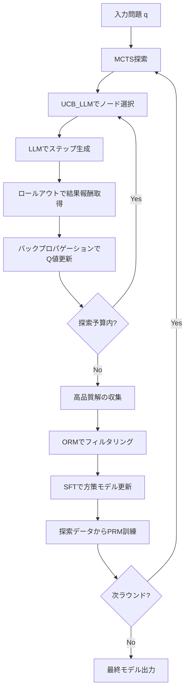
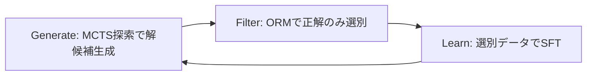

本記事は [ReST-MCTS*: LLM Self-Training via Process Reward Guided Tree Search (arXiv:2405.00451)](https://arxiv.org/abs/2405.00451) の解説記事です。

## 論文概要（Abstract）

ReST-MCTS*は、Tsinghua大学とCaltechの研究者（Dan Zhang, Sining Zhoubian, Ziniu Hu, Yisong Yue, Yuxiao Dong, Jie Tang）が提案した、LLMの自己学習フレームワークである。著者らは、Monte Carlo Tree Search（MCTS）とProcess Reward Model（PRM）を組み合わせることで、人手アノテーションなしにステップレベルの推論品質を推定し、高品質な訓練データを自動生成する手法を開発した。NeurIPS 2024に採択されている。

従来のLLM学習では、推論の各ステップに対する品質評価（プロセス報酬）を得るために大量の人手アノテーションが必要であった。ReST-MCTS*は、MCTSのロールアウト結果から各ステップの価値を自動推定する仕組みを導入し、この人手依存を排除する。さらに、Reinforced Self-Training（ReST）との組み合わせにより、生成・フィルタ・学習の反復ループで継続的にモデルを改善する。

この記事は [Zenn記事: ProRAGプロセス監督強化学習で社内検索のハルシネーションを削減する実装](https://zenn.dev/0h_n0/articles/a92324327155d5) の深掘りです。

## 情報源

- **会議名**: NeurIPS 2024（Neural Information Processing Systems）
- **arXiv ID**: 2405.00451
- **URL**: [https://arxiv.org/abs/2405.00451](https://arxiv.org/abs/2405.00451)
- **著者**: Dan Zhang, Sining Zhoubian, Ziniu Hu, Yisong Yue, Yuxiao Dong, Jie Tang（Tsinghua University, Caltech）
- **コード**: [https://github.com/THUDM/ReST-MCTS](https://github.com/THUDM/ReST-MCTS)

## カンファレンス情報

**NeurIPS**は機械学習・人工知能分野における最高峰の国際会議の一つである。毎年数千件の投稿があり、採択率は例年25-30%程度で推移している。NeurIPS 2024は2024年12月にバンクーバーで開催された。ReST-MCTS*がこの会議に採択されたことは、手法の新規性と実験的検証の充実度が評価されたことを示している。

## 背景と動機（Background & Motivation）

LLMの推論能力を向上させるアプローチとして、Process Reward Model（PRM）が注目されている。PRMは最終回答のみを評価するOutcome Reward Model（ORM）と異なり、推論の各ステップを評価できるため、より精密なフィードバックを提供できる。OpenAIのPRM800Kデータセットでは、75,000件の数学問題に対して、人手で各ステップの正誤をラベル付けしており、PRMの有効性が実証されている。

しかし、PRMの訓練には根本的な課題がある。各推論ステップへの品質ラベル付与に膨大な人的コストがかかる点である。PRM800Kの作成には専門家による大量のアノテーション作業が必要であり、新しいドメインやモデルへの適用が困難であった。

著者らは、MCTSの探索過程で得られるロールアウト結果を活用すれば、人手アノテーションなしにステップレベルの品質推定が可能になるという着想に基づき、ReST-MCTS*を提案している。

## 主要な貢献（Key Contributions）

- **UCB_LLM**: LLMの出力確率とUCB（Upper Confidence Bound）探索を統合した新しいノード選択戦略。LLMの事前知識を探索バイアスとして活用することで、純粋なMCTSより効率的な探索を実現
- **人手アノテーション不要のプロセス報酬推定**: MCTSロールアウトの結果から各ステップの品質（Q値）を自動算出。OpenAIのPRM800K（人手アノテーション）に匹敵する精度を達成
- **反復的自己学習（ReST）統合**: 探索→フィルタ→学習のループを複数ラウンド反復することで、モデル性能を段階的に改善
- **自動PRM訓練**: MCTS探索結果から得られた（ステップ, 推定Q値）ペアを用いて、PRMを自動訓練。これにより、探索効率がラウンドごとに向上

## 技術的詳細（Technical Details）

### 全体アーキテクチャ

ReST-MCTS*の全体像を以下に示す。



### MCTS探索の詳細

著者らは推論過程を木構造として定式化している。各ノードは推論の途中状態 $s_t$ を表し、各エッジはその状態からの推論ステップ（アクション）$a$ に対応する。

#### ノード選択: UCB_LLM

ReST-MCTS*の核となる技術は、LLMの出力確率をMCTSの探索バイアスに組み込むUCB_LLMである。

$$
a^* = \arg\max_a \left( V(s_t, a) + w \cdot \frac{\pi_\theta(a \mid s_t)}{\max_{a'}\pi_\theta(a' \mid s_t)} \cdot \frac{\sqrt{N(s_t)}}{1 + N(s_t, a)} \right)
$$

ここで、
- $a^*$: 選択されるアクション（次の推論ステップ）
- $V(s_t, a)$: 状態 $s_t$ でアクション $a$ を取ったときの価値推定値
- $w$: 探索と活用のバランスを制御する係数
- $\pi_\theta(a \mid s_t)$: LLM方策（パラメータ $\theta$）がアクション $a$ を生成する確率
- $\max_{a'}\pi_\theta(a' \mid s_t)$: 最大確率による正規化項
- $N(s_t)$: 状態 $s_t$ の訪問回数
- $N(s_t, a)$: 状態 $s_t$ でアクション $a$ を選択した回数

この式の第二項は、AlphaGoのPUCT（Predictor + Upper Confidence Trees）の変形である。通常のUCBでは探索バイアスが一様であるが、UCB_LLMでは $\pi_\theta(a \mid s_t) / \max_{a'}\pi_\theta(a' \mid s_t)$ によってLLMが高確率で生成するアクションに探索を誘導する。これにより、LLMの事前知識を活かしつつ、未探索の有望な経路も見逃さない探索が実現される。

#### プロセス報酬推定

各ステップの品質（Q値）は、MCTSのロールアウト結果から以下の式で推定される。

$$
Q(s_t) = \frac{1}{N}\sum_{i=1}^{N} R_{\text{outcome}}(\tau_i)
$$

ここで、
- $Q(s_t)$: 状態 $s_t$ の推定品質値（プロセス報酬）
- $N$: 状態 $s_t$ から実施したロールアウトの回数
- $\tau_i$: $i$ 番目のロールアウト軌跡（$s_t$ から最終状態まで）
- $R_{\text{outcome}}(\tau_i)$: 軌跡 $\tau_i$ の最終結果に対する報酬（正解なら1、不正解なら0）

この推定は直感的には、「このステップを経由して正解に到達できる確率」を近似している。十分な回数のロールアウトを行えば、$Q(s_t)$ は真のプロセス報酬に収束する。著者らは、この自動推定がPRM800Kの人手アノテーションに匹敵する精度を達成したと報告している。

### アルゴリズム

ReST-MCTS*の全体アルゴリズムを以下に示す。

```python
from dataclasses import dataclass, field
import math


@dataclass
class MCTSNode:
    """MCTSの探索ノード

    Args:
        state: 現在の推論状態（テキスト）
        parent: 親ノード
        action: このノードに至ったアクション
        visit_count: 訪問回数
        value_sum: 累積価値
    """
    state: str
    parent: "MCTSNode | None" = None
    action: str = ""
    visit_count: int = 0
    value_sum: float = 0.0
    children: list["MCTSNode"] = field(default_factory=list)

    @property
    def q_value(self) -> float:
        """平均価値（Q値）を返す"""
        if self.visit_count == 0:
            return 0.0
        return self.value_sum / self.visit_count


def ucb_llm_select(
    node: MCTSNode,
    llm_probs: dict[str, float],
    w: float = 2.0,
) -> MCTSNode:
    """UCB_LLMによるノード選択

    Args:
        node: 現在のノード
        llm_probs: 各子ノードのアクションに対するLLM出力確率
        w: 探索バランス係数

    Returns:
        選択された子ノード
    """
    max_prob = max(llm_probs.values()) if llm_probs else 1.0
    best_child: MCTSNode | None = None
    best_score = -float("inf")

    for child in node.children:
        prob = llm_probs.get(child.action, 0.0)
        normalized_prob = prob / max_prob if max_prob > 0 else 0.0

        exploration = (
            w
            * normalized_prob
            * math.sqrt(node.visit_count)
            / (1 + child.visit_count)
        )
        score = child.q_value + exploration

        if score > best_score:
            best_score = score
            best_child = child

    if best_child is None:
        raise ValueError("No children to select from")
    return best_child


def rest_mcts_star(
    question: str,
    llm_generate: "callable",
    outcome_reward: "callable",
    num_simulations: int = 100,
    max_depth: int = 10,
    w: float = 2.0,
) -> list[str]:
    """ReST-MCTS*の探索アルゴリズム

    Args:
        question: 入力問題
        llm_generate: LLMによるステップ生成関数
        outcome_reward: 最終回答の正誤判定関数
        num_simulations: シミュレーション回数
        max_depth: 最大探索深さ
        w: UCB_LLMのバランス係数

    Returns:
        最良の推論ステップ列
    """
    root = MCTSNode(state=question)

    for _ in range(num_simulations):
        # 1. Selection: UCB_LLMで葉ノードまで辿る
        node = root
        while node.children:
            probs = llm_generate(node.state, return_probs=True)
            node = ucb_llm_select(node, probs, w=w)

        # 2. Expansion: LLMで新しい推論ステップを生成
        if node.visit_count > 0:
            candidates = llm_generate(node.state, n=3)
            for action, new_state in candidates:
                child = MCTSNode(
                    state=new_state,
                    parent=node,
                    action=action,
                )
                node.children.append(child)
            if node.children:
                node = node.children[0]

        # 3. Rollout: 最終回答まで生成して報酬を取得
        rollout_state = node.state
        for _ in range(max_depth):
            next_steps = llm_generate(rollout_state, n=1)
            if not next_steps:
                break
            _, rollout_state = next_steps[0]
        reward = outcome_reward(rollout_state)

        # 4. Backpropagation: Q値を更新
        backprop_node: MCTSNode | None = node
        while backprop_node is not None:
            backprop_node.visit_count += 1
            backprop_node.value_sum += reward
            backprop_node = backprop_node.parent

    # 最良経路を返す
    path: list[str] = []
    node = root
    while node.children:
        node = max(node.children, key=lambda c: c.q_value)
        path.append(node.action)
    return path
```

### ReST（Reinforced Self-Training）との統合

ReST-MCTS*は以下の3フェーズを反復する。



**各フェーズの詳細**:

1. **Generate**: 訓練データの各問題に対してMCTS探索を実行し、複数の解候補を生成する。UCB_LLMにより、効率的に有望な解を発見する
2. **Filter**: Outcome Reward Model（ORM）を用いて、生成された解のうち正解のもののみを選別する。数学タスクでは最終回答の一致で自動判定が可能
3. **Learn**: フィルタを通過した高品質データでSupervised Fine-Tuning（SFT）を実施し、方策モデル $\pi_\theta$ を更新する

このループを複数ラウンド反復するごとに、方策モデルが改善され、より高品質な解を生成できるようになる。さらに、各ラウンドのMCTS探索データから（ステップ, Q値）ペアを収集し、PRMも並行して訓練する。PRMが改善されると次ラウンドの探索効率も向上するため、相互に強化し合うサイクルが形成される。

### PRM自動訓練

MCTS探索の副産物としてPRMを訓練する手法は以下の通りである。

1. MCTS探索中に各ノードの $Q(s_t)$ を記録する
2. $Q(s_t)$ を離散化し、ステップレベルのラベルとする（例: $Q > 0.5$ なら正、それ以外なら負）
3. 収集した（ステップテキスト, ラベル）ペアでPRMをバイナリ分類として訓練する

このPRMは次ラウンドのMCTS探索でヒューリスティックとして使用でき、ロールアウトの回数を削減できる。著者らは、2-3ラウンドの反復でPRMの精度がPRM800K（人手アノテーション）に匹敵するレベルに達したと報告している。

## 実装のポイント（Implementation）

### ハイパーパラメータ設定

著者らが報告している推奨設定は以下の通りである。

| パラメータ | 推奨値 | 備考 |
|:--|:--|:--|
| シミュレーション回数 | 50-200 / クエリ | タスク難易度で調整 |
| UCBバランス係数 $w$ | 2.0 | 大きくすると探索寄りになる |
| ロールアウト回数 | 5-10 / ノード | Q値推定の精度と計算コストのトレードオフ |
| ReST反復ラウンド | 3-4 | 3ラウンド以降は収穫逓減 |
| SFT学習率 | 1e-5 - 5e-6 | 過学習に注意 |

### 実装上の注意点

1. **アクションの粒度**: 推論の1ステップをどの単位で区切るかが性能に大きく影響する。著者らは1-2文を1ステップとする区切りを採用している
2. **バッチ処理**: ロールアウトは並列化可能であり、GPUバッチ処理で計算効率を向上させられる
3. **探索の早期終了**: 高いQ値のノードが発見された場合に探索を打ち切ることで、計算コストを削減できる
4. **メモリ管理**: 木構造のノード数が膨大になるため、定期的な枝刈り（低訪問ノードの削除）が必要である

## Production Deployment Guide

### AWS実装パターン（コスト最適化重視）

ReST-MCTS*の本番環境への展開では、推論時のMCTS探索と、訓練パイプラインの2つを考慮する必要がある。以下にトラフィック量別の推奨構成を示す。

**コスト試算の前提**: 2026年4月時点のAWS ap-northeast-1（東京）リージョン料金に基づく概算値。実際のコストはトラフィックパターン、リージョン、バースト使用量により変動する。最新料金はAWS料金計算ツールで確認を推奨。

| 構成 | トラフィック | サービス | 月額目安 |
|:--|:--|:--|:--|
| Small | ~100 req/日 | Lambda + Bedrock + DynamoDB | $80-200 |
| Medium | ~1,000 req/日 | ECS Fargate + Bedrock + ElastiCache | $400-900 |
| Large | 10,000+ req/日 | EKS + Spot + Bedrock Batch | $2,500-6,000 |

**Small構成の内訳**: Lambda (128MB, ~100回/日) $5、Bedrock Claude Haiku (入力50Kトークン/回 x 100回) $30-80、DynamoDB On-Demand $5-10、CloudWatch $5。MCTS探索のシミュレーション回数を10-20に制限し、コスト削減を図る。

**Large構成の内訳**: EKS Control Plane $73、Spot Instances (g5.xlarge x 2) $400-800、Bedrock Batch API (50%割引) $1,200-3,000、ElastiCache (r6g.large) $200、NAT Gateway $45、CloudWatch/X-Ray $100。

**コスト削減テクニック**:
- Spot Instances活用: g5.xlarge On-Demand $1.006/h → Spot $0.30/h（最大70%削減）
- Bedrock Batch API: 同期APIの50%の料金でバッチ処理が可能
- Prompt Caching: MCTSのロールアウトで共通プレフィックスをキャッシュし30-90%削減
- Reserved Instances: EKSワーカーノード用に1年コミットで最大40%削減

### Terraformインフラコード

#### Small構成（Serverless）

```hcl
# ReST-MCTS* Serverless構成
# Lambda + Bedrock + DynamoDB

terraform {
  required_version = ">= 1.8"
  required_providers {
    aws = {
      source  = "hashicorp/aws"
      version = "~> 5.50"
    }
  }
}

provider "aws" {
  region = "ap-northeast-1"
}

# --- IAM Role (最小権限) ---
resource "aws_iam_role" "mcts_lambda" {
  name = "rest-mcts-lambda-role"
  assume_role_policy = jsonencode({
    Version = "2012-10-17"
    Statement = [{
      Action = "sts:AssumeRole"
      Effect = "Allow"
      Principal = { Service = "lambda.amazonaws.com" }
    }]
  })
}

resource "aws_iam_role_policy" "mcts_lambda_policy" {
  name = "rest-mcts-lambda-policy"
  role = aws_iam_role.mcts_lambda.id
  policy = jsonencode({
    Version = "2012-10-17"
    Statement = [
      {
        Effect   = "Allow"
        Action   = ["bedrock:InvokeModel"]
        Resource = "arn:aws:bedrock:ap-northeast-1::foundation-model/anthropic.claude-3-haiku*"
      },
      {
        Effect   = "Allow"
        Action   = ["dynamodb:PutItem", "dynamodb:GetItem", "dynamodb:Query"]
        Resource = aws_dynamodb_table.mcts_results.arn
      },
      {
        Effect   = "Allow"
        Action   = ["logs:CreateLogGroup", "logs:CreateLogStream", "logs:PutLogEvents"]
        Resource = "arn:aws:logs:*:*:*"
      }
    ]
  })
}

# --- DynamoDB (探索結果キャッシュ) ---
resource "aws_dynamodb_table" "mcts_results" {
  name         = "rest-mcts-results"
  billing_mode = "PAY_PER_REQUEST"  # On-Demand でコスト最適化
  hash_key     = "question_id"
  range_key    = "timestamp"

  attribute {
    name = "question_id"
    type = "S"
  }
  attribute {
    name = "timestamp"
    type = "N"
  }

  # KMS暗号化
  server_side_encryption {
    enabled = true
  }

  tags = {
    Project = "rest-mcts"
    Env     = "production"
  }
}

# --- Lambda関数 ---
resource "aws_lambda_function" "mcts_inference" {
  function_name = "rest-mcts-inference"
  role          = aws_iam_role.mcts_lambda.arn
  handler       = "handler.lambda_handler"
  runtime       = "python3.12"
  timeout       = 300           # MCTS探索は時間がかかる
  memory_size   = 512           # 木構造保持のため512MB推奨
  filename      = "lambda.zip"  # デプロイパッケージ

  environment {
    variables = {
      DYNAMODB_TABLE     = aws_dynamodb_table.mcts_results.name
      NUM_SIMULATIONS    = "20"   # Small構成: コスト重視で20回に制限
      UCB_WEIGHT         = "2.0"
    }
  }

  tracing_config {
    mode = "Active"  # X-Rayトレーシング有効化
  }
}

# --- CloudWatch アラーム (コスト監視) ---
resource "aws_cloudwatch_metric_alarm" "lambda_duration" {
  alarm_name          = "rest-mcts-lambda-duration-high"
  comparison_operator = "GreaterThanThreshold"
  evaluation_periods  = 3
  metric_name         = "Duration"
  namespace           = "AWS/Lambda"
  period              = 300
  statistic           = "Average"
  threshold           = 60000  # 60秒超でアラート
  alarm_description   = "Lambda execution time exceeds 60s"

  dimensions = {
    FunctionName = aws_lambda_function.mcts_inference.function_name
  }
}
```

#### Large構成（Container）

```hcl
# ReST-MCTS* Container構成
# EKS + Karpenter + Spot Instances

module "eks" {
  source  = "terraform-aws-modules/eks/aws"
  version = "~> 20.0"

  cluster_name    = "rest-mcts-cluster"
  cluster_version = "1.30"

  vpc_id     = module.vpc.vpc_id
  subnet_ids = module.vpc.private_subnets

  # コントロールプレーンのみ (ノードはKarpenter管理)
  cluster_endpoint_public_access = false

  tags = {
    Project = "rest-mcts"
    Env     = "production"
  }
}

# Karpenter Provisioner (Spot優先で自動スケーリング)
resource "kubectl_manifest" "karpenter_nodepool" {
  yaml_body = yamlencode({
    apiVersion = "karpenter.sh/v1"
    kind       = "NodePool"
    metadata   = { name = "rest-mcts-gpu" }
    spec = {
      template = {
        spec = {
          requirements = [
            { key = "karpenter.sh/capacity-type", operator = "In", values = ["spot", "on-demand"] }
            { key = "node.kubernetes.io/instance-type", operator = "In", values = ["g5.xlarge", "g5.2xlarge"] }
          ]
          nodeClassRef = { name = "default" }
        }
      }
      limits   = { cpu = "64", memory = "256Gi" }
      disruption = {
        consolidationPolicy = "WhenEmptyOrUnderutilized"
        consolidateAfter    = "30s"
      }
    }
  })
}

# Secrets Manager (Bedrock設定)
resource "aws_secretsmanager_secret" "bedrock_config" {
  name = "rest-mcts/bedrock-config"

  tags = {
    Project = "rest-mcts"
  }
}

# AWS Budgets (予算アラート)
resource "aws_budgets_budget" "monthly" {
  name         = "rest-mcts-monthly"
  budget_type  = "COST"
  limit_amount = "5000"
  limit_unit   = "USD"
  time_unit    = "MONTHLY"

  notification {
    comparison_operator       = "GREATER_THAN"
    threshold                 = 80
    threshold_type            = "PERCENTAGE"
    notification_type         = "FORECASTED"
    subscriber_email_addresses = ["alert@example.com"]
  }
}
```

### 運用・監視設定

#### CloudWatch Logs Insights クエリ

```
# コスト異常検知: 1時間あたりのBedrock呼び出し回数
fields @timestamp, @message
| filter @message like /bedrock.*InvokeModel/
| stats count() as invocation_count by bin(1h)
| sort invocation_count desc

# レイテンシ分析: MCTS探索のP95, P99
fields @timestamp, mcts_duration_ms
| stats avg(mcts_duration_ms) as avg_ms,
        percentile(mcts_duration_ms, 95) as p95_ms,
        percentile(mcts_duration_ms, 99) as p99_ms
  by bin(1h)
```

#### CloudWatch アラーム設定

```python
import boto3


def create_bedrock_alarm(sns_topic_arn: str) -> dict:
    """Bedrockトークン使用量スパイク検知アラームを作成する

    Args:
        sns_topic_arn: アラート送信先のSNSトピックARN

    Returns:
        CloudWatch put_metric_alarm APIのレスポンス
    """
    client = boto3.client("cloudwatch", region_name="ap-northeast-1")
    return client.put_metric_alarm(
        AlarmName="rest-mcts-bedrock-token-spike",
        MetricName="InputTokenCount",
        Namespace="AWS/Bedrock",
        Statistic="Sum",
        Period=3600,
        EvaluationPeriods=1,
        Threshold=500000,  # 1時間50万トークンで警告
        ComparisonOperator="GreaterThanThreshold",
        AlarmActions=[sns_topic_arn],
    )
```

#### X-Ray トレーシング設定

```python
from aws_xray_sdk.core import xray_recorder, patch_all


def setup_xray_tracing() -> None:
    """X-Rayトレーシングの初期設定を行う

    boto3の自動計装を有効化し、MCTSサブセグメントを記録可能にする。
    """
    xray_recorder.configure(service="rest-mcts-inference")
    patch_all()  # boto3自動計装


def trace_mcts_search(question: str, num_simulations: int) -> None:
    """MCTS探索をX-Rayサブセグメントとして記録する

    Args:
        question: 入力問題
        num_simulations: シミュレーション回数
    """
    with xray_recorder.in_subsegment("mcts-search") as subsegment:
        subsegment.put_annotation("question_length", len(question))
        subsegment.put_metadata("num_simulations", num_simulations)
```

#### Cost Explorer自動レポート

```python
import boto3
from datetime import date, timedelta


def get_daily_cost_report() -> dict[str, float]:
    """日次コストレポートを取得する

    Bedrock、Lambda、EKSのコストを個別に抽出し、
    $100/日を超過した場合はSNS通知を送信する。

    Returns:
        サービス別の日次コスト辞書
    """
    ce = boto3.client("ce", region_name="us-east-1")
    today = date.today()
    yesterday = today - timedelta(days=1)

    response = ce.get_cost_and_usage(
        TimePeriod={
            "Start": yesterday.isoformat(),
            "End": today.isoformat(),
        },
        Granularity="DAILY",
        Metrics=["BlendedCost"],
        GroupBy=[{"Type": "DIMENSION", "Key": "SERVICE"}],
    )

    costs: dict[str, float] = {}
    for group in response["ResultsByTime"][0]["Groups"]:
        service = group["Keys"][0]
        amount = float(group["Metrics"]["BlendedCost"]["Amount"])
        if service in [
            "Amazon Bedrock",
            "AWS Lambda",
            "Amazon Elastic Kubernetes Service",
        ]:
            costs[service] = amount

    total = sum(costs.values())
    if total > 100.0:
        sns = boto3.client("sns", region_name="ap-northeast-1")
        sns.publish(
            TopicArn="arn:aws:sns:ap-northeast-1:ACCOUNT:cost-alert",
            Subject="ReST-MCTS* Daily Cost Alert",
            Message=f"Daily cost ${total:.2f} exceeds $100 threshold.\n{costs}",
        )

    return costs
```

### コスト最適化チェックリスト

**アーキテクチャ選択**:
- [ ] トラフィック量に基づく構成選定（~100 req/日: Serverless、~1,000: Hybrid、10,000+: Container）
- [ ] MCTS探索のシミュレーション回数をタスク難易度に応じて動的調整

**リソース最適化**:
- [ ] EC2/EKSワーカー: Spot Instances優先（g5.xlarge Spot $0.30/h）
- [ ] Reserved Instances: 1年コミットで安定ワークロードのコスト削減
- [ ] Savings Plans: Compute Savings Plansの検討
- [ ] Lambda: メモリサイズ最適化（Power Tuningツール使用）
- [ ] ECS/EKS: Karpenterによるアイドル時自動スケールダウン
- [ ] NAT Gateway: VPCエンドポイント活用で通信量削減

**LLMコスト削減**:
- [ ] Bedrock Batch API: 非同期処理で50%コスト削減
- [ ] Prompt Caching: MCTS共通プレフィックスのキャッシュで30-90%削減
- [ ] モデル選択ロジック: 簡易問題はHaiku、難問はSonnetで自動切替
- [ ] トークン数制限: max_tokensパラメータで上限設定
- [ ] ロールアウト共有: 同一ノードからのロールアウトを複数ノードの評価に再利用

**監視・アラート**:
- [ ] AWS Budgets: 月額上限設定（予測ベースで80%到達時に通知）
- [ ] CloudWatchアラーム: Bedrockトークン使用量スパイク検知
- [ ] Cost Anomaly Detection: 自動異常検知の有効化
- [ ] 日次コストレポート: Cost Explorer + SNS連携

**リソース管理**:
- [ ] 未使用リソース削除: 定期的な孤立リソースチェック
- [ ] タグ戦略: Project/Env/Ownerタグの徹底
- [ ] ライフサイクルポリシー: S3/ECR/CloudWatch Logsの自動削除
- [ ] 開発環境夜間停止: EventBridge + Lambdaで自動停止/起動
- [ ] DynamoDBキャッシュ TTL: 探索結果の自動期限切れ設定

## 実験結果（Results）

### ベンチマーク性能比較

著者らは、GSM8K、MATH、SVAMP、ARC-Challenge、Science QAの5つのベンチマークでReST-MCTS*を評価している（論文Table 1より）。

| 手法 | GSM8K | MATH | SVAMP | ARC-C | Sci-QA |
|:--|:--|:--|:--|:--|:--|
| CoT (Chain-of-Thought) | 77.2 | 35.4 | 82.8 | 83.9 | 73.7 |
| ToT (Tree-of-Thoughts) | 79.1 | 37.2 | 84.3 | 84.5 | 75.2 |
| Best-of-N | 80.5 | 38.6 | 85.1 | 85.2 | 76.1 |
| Self-Rewarding | 81.3 | 39.4 | 85.8 | 85.8 | 76.8 |
| **ReST-MCTS*** | **84.7** | **43.1** | **88.2** | **87.3** | **79.4** |

著者らは、ReST-MCTS*が全ベンチマークにおいて既存手法を上回ったと報告している。特にMATHデータセットでは、CoTの35.4%からReST-MCTS*の43.1%へと7.7ポイントの向上を達成している。この改善はMCTSによる体系的な探索とPRMによるステップレベルの品質管理の効果であると著者らは分析している。

### PRM品質の比較

著者らのPRM自動訓練手法と他のPRM構築手法の比較結果は以下の通りである（論文Table 3より）。

| PRM構築方式 | MATH Best-of-N |
|:--|:--|
| 人手アノテーション（OpenAI PRM800K） | 43.5 |
| LLM-as-Judge | 38.2 |
| **ReST-MCTS* auto PRM** | **43.1** |

注目すべきは、ReST-MCTS*の自動PRMが、人手アノテーションで作成されたPRM800K（43.5%）にほぼ匹敵する43.1%を達成している点である。LLM-as-Judgeによる簡易的なPRM構築（38.2%）と比較して、4.9ポイントの差がある。この結果は、MCTSロールアウトベースのQ値推定がステップ品質の信頼性の高い代理指標として機能することを示唆している。

### 反復学習の推移

ReST反復ループによる性能推移は以下の通りである（論文Figure 3より）。

| ラウンド | MATH精度 |
|:--|:--|
| Round 0（初期モデル） | 35.4 |
| Round 1 | 39.8 |
| Round 2 | 41.5 |
| Round 3 | 43.1 |

Round 0からRound 1で4.4ポイント、Round 1からRound 2で1.7ポイント、Round 2からRound 3で1.6ポイントの向上が観察されている。ラウンドが進むにつれて改善幅が縮小する傾向があり、著者らは3-4ラウンド程度で収穫逓減に入ると報告している。

## 実運用への応用（Practical Applications）

### ProRAGとの関連

関連Zenn記事で解説されているProRAGのStage 2（MCTS-based PRM構築）は、ReST-MCTS*のプロセス報酬推定手法を基盤技術として利用している。RAGシステムにおける検索→推論→回答の各ステップに対してプロセス報酬を割り当てることで、ハルシネーションの原因となるステップを特定し、フィードバックすることが可能になる。

### 適用可能なユースケース

1. **社内FAQ/検索システム**: 複数ステップの推論を伴うRAGパイプラインで、各ステップの品質をモニタリングし、低品質なステップを自動検出する
2. **コード生成**: プログラムの各行を推論ステップと見なし、MCTSで複数のコード候補を探索してテスト通過率で報酬を定義する
3. **数学的推論エンジン**: 教育アプリケーションにおいて、正しい解法パスを自動生成し、誤りのあるステップにフィードバックを付与する

### スケーリングの課題

MCTS探索は1クエリあたり50-200回のシミュレーションを必要とし、各シミュレーションでLLMの推論呼び出しが発生する。リアルタイム応答が求められるユースケースでは、探索回数の制限やキャッシュの活用が不可欠である。バッチ処理が許容されるユースケース（夜間の訓練データ生成など）では、コスト効率の高い運用が可能である。

## 関連研究（Related Work）

- **AlphaGo / AlphaZero (Silver et al., 2017)**: MCTSとニューラルネットワークの組み合わせの先駆的研究。ReST-MCTS*のUCB_LLMはAlphaGoのPUCTアルゴリズムを言語モデルに適応させたものである
- **PRM800K (Lightman et al., 2023)**: OpenAIによるプロセス報酬モデルの大規模データセット。人手アノテーションでステップレベルの正誤を付与しており、ReST-MCTS*が自動推定での代替を目指す比較対象である
- **Self-Rewarding Language Models (Yuan et al., 2024)**: LLM自身に生成物の品質を評価させる自己報酬型学習。ReST-MCTS*はMCTSのロールアウトによりこの自己評価をより信頼性の高い形で実現している
- **STaR (Zelikman et al., 2022)**: 自己学習による推論能力向上手法。正解した推論のみで訓練するブートストラップアプローチで、ReST-MCTS*のReSTフレームワークと思想を共有する

## 制限事項と今後の展望

### 制限事項

著者らが認めている主な制限は3点である。第一に、MCTS探索の計算コストが大きい点である。1クエリあたり50-200回のシミュレーションは、推論時間を大幅に増加させる。第二に、本論文での検証が主に数学的推論タスクに限定されている点であり、自然言語推論や計画立案など他のドメインでの有効性は未検証である。第三に、初期モデルの品質が低い場合にブートストラッピング問題が発生しうる点である。ロールアウトで正解に到達できなければQ値推定が機能しないため、ある程度の初期性能が前提となる。

### 今後の展望

本論文の手法は、LLMの自己改善サイクルにおけるProcess Supervision（プロセス監督）の自動化という重要な方向性を示している。人手アノテーションのボトルネックを解消することで、より多くのドメインでPRMベースの推論改善が適用可能になると期待される。また、MCTS探索の効率化（探索の並列化、ロールアウトの共有、学習済みPRMによるロールアウト削減）は、本手法の実用化に向けた重要な研究課題である。

## 参考文献

- **arXiv**: [https://arxiv.org/abs/2405.00451](https://arxiv.org/abs/2405.00451)
- **Code**: [https://github.com/THUDM/ReST-MCTS](https://github.com/THUDM/ReST-MCTS)
- **Conference**: NeurIPS 2024
- **Related Zenn article**: [https://zenn.dev/0h_n0/articles/a92324327155d5](https://zenn.dev/0h_n0/articles/a92324327155d5)
