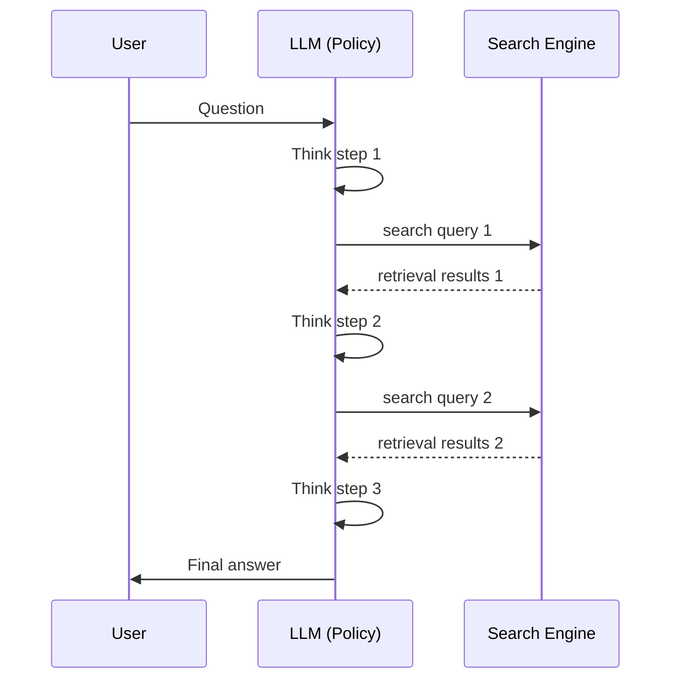

本記事は [Search-R1 (arXiv:2503.09516)](https://arxiv.org/abs/2503.09516) の解説記事です。

## 論文概要（Abstract）

Search-R1は、LLMが推論中に自律的に検索クエリを生成し、検索エンジンから得た情報を活用してステップバイステップで回答を構築する強化学習（RL）フレームワークである。従来のRAG（Retrieval-Augmented Generation）が固定的な検索パイプラインに依存するのに対し、Search-R1はモデル自身が「いつ・何を検索するか」を学習する点が特徴的である。著者らはRetrieval Token Maskingという手法を導入し、検索結果トークンをRL損失計算から除外することで方策勾配の分散を削減し、安定した訓練を実現したと報告している。

この記事は [Zenn記事: ProRAGプロセス監督強化学習で社内検索のハルシネーションを削減する実装](https://zenn.dev/0h_n0/articles/a92324327155d5) の深掘りです。Search-R1はProRAGの主要な比較ベースライン（結果ベースRL）に位置づけられており、ProRAGのプロセス監督型アプローチとの対比で理解が深まる。

## 情報源

- **arXiv ID**: 2503.09516
- **URL**: [https://arxiv.org/abs/2503.09516](https://arxiv.org/abs/2503.09516)
- **著者**: Hangliang Ding, Liang Zhu, Yong Jiang et al.
- **発表年**: 2025
- **会議**: COLM 2025
- **分野**: cs.CL, cs.AI, cs.IR

## 背景と動機（Background & Motivation）

LLMは膨大な知識をパラメータに内在させているが、リアルタイム性や正確性の面で限界がある。特にマルチホップ推論（複数の事実を組み合わせて回答する質問）では、パラメトリック知識だけでは不十分な場面が多い。

従来のRAGアプローチは、質問に対して固定的に1回の検索を行い、検索結果をプロンプトに付与して回答を生成する。しかしこの方式には以下の課題がある。

1. **検索タイミングの固定性**: 質問全体から1回だけ検索するため、推論途中で必要になる追加情報を取得できない
2. **検索クエリの品質**: ユーザの質問をそのまま検索クエリとして使うため、マルチホップ質問では適切な検索結果が得られにくい
3. **推論と検索の分離**: 検索と推論が別々のモジュールで処理され、相互のフィードバックが存在しない

Search-R1はこれらの問題に対し、LLM自身が推論過程で動的に検索クエリを生成・発行し、検索結果を取り込みながら段階的に回答を構築するアプローチを提案している。

## 主要な貢献（Key Contributions）

- **Search-augmented reasoning framework**: LLMが推論中に `<search>query</search>` 形式で自律的に検索エンジンにクエリを発行し、結果を取り込む対話的推論フレームワーク
- **Retrieval Token Masking**: 検索エンジンが返すトークン（モデルが生成したものではない外部トークン）をRL損失計算から除外する手法。方策勾配の分散を削減し、訓練を安定化
- **Step-level advantage estimation**: Rollout全体ではなく、各推論ステップ単位でアドバンテージを計算することで、検索の有効性をより正確に評価
- **性能改善**: Qwen2.5-7Bベースで、標準RAGに対して平均+41%の改善を達成（論文Table 1より）

## 技術的詳細（Technical Details）

### 全体アーキテクチャ

Search-R1のアーキテクチャは、LLM（方策モデル）と検索エンジン（環境）の相互作用として定式化される。



LLMは以下の2種類の特殊トークンを用いて環境（検索エンジン）と対話する。

- `<search>query</search>`: 検索クエリの発行。このトークンを生成すると、環境が検索エンジンにクエリを送り、結果を `<information>...</information>` として返す
- `<output>answer</output>`: 最終回答の出力

### Action空間と環境

モデルの行動（action）は、通常のテキスト生成に加え、検索クエリの発行を含む。環境はBing APIまたはElasticsearchで構成され、検索クエリを受け取ると上位$K$件の文書スニペットを返す。著者らは$K=3$を標準設定とし、検索回数の上限を5回に設定している。

### GRPOによるRL訓練

Search-R1はGRPO（Group Relative Policy Optimization）をベースとした強化学習で訓練される。GRPOはPPO（Proximal Policy Optimization）の変種で、価値関数（critic）を使わずにグループ内の報酬を相対比較してアドバンテージを推定する。

標準的なGRPOの目的関数は以下の通りである。

$$
\mathcal{L}_{\text{GRPO}} = -\frac{1}{|G|}\sum_{i \in G} \frac{1}{|o_i|} \sum_{t=1}^{|o_i|} \min\left(r_t^{(i)} \hat{A}_i,\ \text{clip}\left(r_t^{(i)},\ 1-\epsilon,\ 1+\epsilon\right) \hat{A}_i\right)
$$

ここで、

- $G$: ロールアウトのグループ（同一質問に対する複数の応答）
- $o_i$: $i$番目のロールアウト（生成されたトークン系列）
- $r_t^{(i)} = \frac{\pi_\theta(a_t \mid s_t)}{\pi_{\theta_{\text{old}}}(a_t \mid s_t)}$: 時刻$t$における新旧方策の確率比
- $\hat{A}_i$: $i$番目のロールアウトに対するアドバンテージ推定値
- $\epsilon$: クリッピングパラメータ

アドバンテージはグループ内の報酬を正規化して計算される。

$$
\hat{A}_i = \frac{R_i - \mu_G}{\sigma_G}
$$

ここで、$R_i$は$i$番目のロールアウトの報酬、$\mu_G$と$\sigma_G$はグループ$G$内の報酬の平均と標準偏差である。

### Retrieval Token Masking

Search-R1の核心的な技術がRetrieval Token Maskingである。検索エンジンが返す結果トークンはモデルが生成したものではなく、外部から注入されたトークンである。これらのトークンに対して方策勾配を計算すると、以下の問題が生じる。

1. **分散の増大**: 検索結果は質問やクエリによって大きく変動するため、勾配の分散が増大する
2. **不正確な信用割当**: モデルの行動（検索クエリの生成）と検索結果（環境の応答）が混在した系列で勾配を計算すると、どの行動が報酬に寄与したかの推定が不正確になる

この問題を解決するため、Search-R1はRL損失計算において検索結果トークンをマスクする。

$$
\mathcal{L}_{\text{Search-R1}} = -\frac{1}{|G|}\sum_{i \in G} \frac{1}{|o_i|} \sum_{t=1}^{|o_i|} \mathbb{1}[t \notin \mathcal{R}] \cdot \min\left(r_t^{(i)} \hat{A}_i,\ \text{clip}\left(r_t^{(i)},\ 1-\epsilon,\ 1+\epsilon\right) \hat{A}_i\right)
$$

ここで、

- $\mathcal{R}$: 検索結果トークンのインデックス集合（`<information>...</information>` 内のトークン）
- $\mathbb{1}[t \notin \mathcal{R}]$: トークン$t$が検索結果に含まれない場合に1、含まれる場合に0を返すインジケータ関数

この指示子関数により、検索結果部分のトークンは勾配計算に寄与しなくなり、モデルが生成した推論テキストと検索クエリのみが最適化対象となる。

### Step-level Advantage Estimation

著者らはさらに、Rollout全体に対して単一のアドバンテージを割り当てる方式（rollout-level）ではなく、各推論ステップごとにアドバンテージを推定する方式（step-level）を提案している。

マルチホップ推論では複数回の検索が行われるため、各検索ステップの貢献度を区別することが重要である。Step-level advantageでは、各検索ステップ$j$（検索クエリの発行から次の検索クエリまでのトークン区間）に対して、そのステップ以降の報酬に基づくアドバンテージを割り当てる。これにより、有効な検索ステップと無効な検索ステップを区別した学習が可能になると著者らは述べている。

### アルゴリズム

以下にSearch-R1の訓練ループの擬似コードを示す。

```python
from dataclasses import dataclass
from typing import Sequence


@dataclass(frozen=True)
class RolloutSegment:
    """ロールアウト内の1ステップ（推論 + 検索）を表す.

    Attributes:
        tokens: 生成されたトークンID列
        is_retrieval: 各トークンが検索結果かどうかのマスク
        reward: このロールアウト全体の報酬
    """
    tokens: Sequence[int]
    is_retrieval: Sequence[bool]
    reward: float


def compute_masked_policy_loss(
    rollouts: Sequence[RolloutSegment],
    policy: "PolicyModel",
    old_policy: "PolicyModel",
    clip_epsilon: float = 0.2,
) -> float:
    """Retrieval Token Maskingを適用したGRPO損失を計算する.

    Args:
        rollouts: 同一質問に対する複数ロールアウト
        policy: 現在の方策モデル
        old_policy: 前イテレーションの方策モデル
        clip_epsilon: PPOクリッピングパラメータ

    Returns:
        計算された損失値
    """
    # グループ内報酬の正規化
    rewards = [r.reward for r in rollouts]
    mean_r = sum(rewards) / len(rewards)
    std_r = (sum((r - mean_r) ** 2 for r in rewards) / len(rewards)) ** 0.5
    advantages = [(r - mean_r) / (std_r + 1e-8) for r in rewards]

    total_loss = 0.0
    for rollout, advantage in zip(rollouts, advantages):
        for t, (token, is_ret) in enumerate(
            zip(rollout.tokens, rollout.is_retrieval)
        ):
            if is_ret:
                continue  # 検索結果トークンをスキップ

            ratio = policy.prob(token, t) / old_policy.prob(token, t)
            clipped = max(1 - clip_epsilon, min(1 + clip_epsilon, ratio))
            total_loss -= min(ratio * advantage, clipped * advantage)

    return total_loss / len(rollouts)
```

### 報酬設計

報酬は結果ベース（outcome-based）で設計されている。最終回答の正解判定にはExact Match（EM）が用いられ、正解なら$R=1$、不正解なら$R=0$とする単純な二値報酬である。フォーマット報酬（適切な特殊トークンの使用に対するボーナス）も補助的に追加されている。

## 実装のポイント（Implementation）

### ベースモデルの選択

著者らはQwen2.5-7B-InstructおよびQwen2.5-3B-Instructを使用している。Instructモデルを選択する理由は、基本的な指示追従能力（特殊トークンの使用ルールの理解）が初期段階で必要なためである。

### 検索エンジンの構成

論文ではBing Web Search APIとElasticsearch（Wikipedia全文インデックス）の2つのバックエンドが評価されている。Elasticsearchはオフライン環境での再現性を確保するために使用され、Bingはオンライン検索の性能評価に使用されている。

### ハイパーパラメータ

著者らが報告している主要なハイパーパラメータは以下の通りである。

- **グループサイズ（$\|G\|$）**: 8（1つの質問に対して8つのロールアウトを生成）
- **最大検索回数**: 5回
- **検索結果の取得件数（$K$）**: 3件
- **クリッピングパラメータ（$\epsilon$）**: 0.2
- **学習率**: 1e-6
- **訓練データ**: HotpotQA, 2WikiMultiHopQA等のマルチホップQAデータセット

### 訓練時の注意点

- 検索APIの呼び出しはロールアウト生成時にリアルタイムで実行されるため、APIのレートリミットと可用性に注意が必要である
- ロールアウト長が検索結果の挿入により大幅に増加するため、メモリ管理が重要になる
- 検索結果の長さが一定でないため、バッチ内でのパディング処理に工夫が必要である

## Production Deployment Guide

Search-R1のような検索連携型LLM推論システムをプロダクション環境に展開する際の設計指針を示す。

### AWS実装パターン（コスト最適化重視）

**トラフィック量別の推奨構成**:

| 構成 | 規模 | サービス | 月額概算 |
|------|------|----------|----------|
| Small | ~100 req/日 | Lambda + Bedrock + OpenSearch Serverless | $150-400 |
| Medium | ~1,000 req/日 | ECS Fargate + Bedrock + OpenSearch | $800-2,000 |
| Large | 10,000+ req/日 | EKS + Spot + SageMaker Endpoint + OpenSearch | $3,000-8,000 |

Search-R1の特性として、1リクエストあたり最大5回の検索呼び出しが発生するため、検索バックエンドのスケーリングが重要となる。

**Small構成の詳細**:
- Lambda（512MB RAM, 30秒タイムアウト）: 推論オーケストレーション
- Bedrock（Claude 3 Haiku / Llama）: LLM推論
- OpenSearch Serverless（2 OCU）: 文書検索バックエンド
- DynamoDB（On-Demand）: セッション状態管理
- 月額概算: Lambda $5 + Bedrock $50-200 + OpenSearch $170 + DynamoDB $5 = $230-380

**Large構成の詳細**:
- EKS（コントロールプレーン$73/月）: コンテナオーケストレーション
- Karpenter + Spot Instances（g5.xlarge）: GPU推論ノード
- OpenSearch Service（3ノードクラスタ, r6g.large）: 検索バックエンド
- ElastiCache Redis: 検索結果キャッシュ（同一クエリの再検索を削減）
- 月額概算: EKS $73 + Spot GPU $500-2,000 + OpenSearch $600 + Redis $200 = $1,373-2,873

**コスト削減テクニック**:
- Spot Instancesでgp5推論ノードのコストを最大90%削減（記事執筆時点の東京リージョン概算。最新料金はAWS料金計算ツールで確認推奨）
- 検索結果キャッシュにより同一/類似クエリの検索API呼び出しを50-70%削減
- Bedrock Batch APIで非リアルタイム処理を50%削減
- Prompt Cachingで反復的なシステムプロンプト部分を30-90%削減

### Terraformインフラコード

**Small構成（Serverless）**:

```hcl
# Search-R1 Serverless構成
# Lambda + Bedrock + OpenSearch Serverless

terraform {
  required_version = ">= 1.9"
  required_providers {
    aws = {
      source  = "hashicorp/aws"
      version = "~> 5.80"
    }
  }
}

provider "aws" {
  region = "ap-northeast-1"
}

# --- IAM ---
resource "aws_iam_role" "search_r1_lambda" {
  name = "search-r1-lambda-role"
  assume_role_policy = jsonencode({
    Version = "2012-10-17"
    Statement = [{
      Action = "sts:AssumeRole"
      Effect = "Allow"
      Principal = { Service = "lambda.amazonaws.com" }
    }]
  })
}

resource "aws_iam_role_policy" "search_r1_lambda" {
  name = "search-r1-lambda-policy"
  role = aws_iam_role.search_r1_lambda.id
  policy = jsonencode({
    Version = "2012-10-17"
    Statement = [
      {
        Effect   = "Allow"
        Action   = ["bedrock:InvokeModel"]
        Resource = "arn:aws:bedrock:ap-northeast-1::foundation-model/*"
      },
      {
        Effect   = "Allow"
        Action   = ["aoss:APIAccessAll"]
        Resource = aws_opensearchserverless_collection.docs.arn
      },
      {
        Effect = "Allow"
        Action = [
          "dynamodb:PutItem", "dynamodb:GetItem",
          "dynamodb:UpdateItem", "dynamodb:Query"
        ]
        Resource = aws_dynamodb_table.sessions.arn
      },
      {
        Effect   = "Allow"
        Action   = ["logs:CreateLogGroup", "logs:CreateLogStream", "logs:PutLogEvents"]
        Resource = "arn:aws:logs:*:*:*"
      }
    ]
  })
}

# --- OpenSearch Serverless ---
resource "aws_opensearchserverless_collection" "docs" {
  name = "search-r1-docs"
  type = "SEARCH"
}

# --- DynamoDB ---
resource "aws_dynamodb_table" "sessions" {
  name         = "search-r1-sessions"
  billing_mode = "PAY_PER_REQUEST"
  hash_key     = "session_id"

  attribute {
    name = "session_id"
    type = "S"
  }

  ttl {
    attribute_name = "expires_at"
    enabled        = true
  }

  server_side_encryption {
    enabled = true  # KMS暗号化
  }
}

# --- Lambda ---
resource "aws_lambda_function" "search_r1" {
  function_name = "search-r1-orchestrator"
  runtime       = "python3.12"
  handler       = "handler.lambda_handler"
  role          = aws_iam_role.search_r1_lambda.arn
  timeout       = 30
  memory_size   = 512
  filename      = "lambda.zip"

  environment {
    variables = {
      OPENSEARCH_ENDPOINT = aws_opensearchserverless_collection.docs.collection_endpoint
      SESSION_TABLE       = aws_dynamodb_table.sessions.name
      MAX_SEARCH_ROUNDS   = "5"
    }
  }

  tracing_config {
    mode = "Active"  # X-Ray有効化
  }
}

# --- CloudWatch Alarm (コスト監視) ---
resource "aws_cloudwatch_metric_alarm" "lambda_duration" {
  alarm_name          = "search-r1-lambda-duration-high"
  comparison_operator = "GreaterThanThreshold"
  evaluation_periods  = 3
  metric_name         = "Duration"
  namespace           = "AWS/Lambda"
  period              = 300
  statistic           = "p95"
  threshold           = 25000  # 25秒 (30秒タイムアウトの83%)
  alarm_actions       = []     # SNS ARNを設定

  dimensions = {
    FunctionName = aws_lambda_function.search_r1.function_name
  }
}
```

**Large構成（Container）**:

```hcl
# Search-R1 Container構成
# EKS + Karpenter + Spot + OpenSearch

module "eks" {
  source  = "terraform-aws-modules/eks/aws"
  version = "~> 20.31"

  cluster_name    = "search-r1-prod"
  cluster_version = "1.31"

  vpc_id     = module.vpc.vpc_id
  subnet_ids = module.vpc.private_subnets

  cluster_endpoint_public_access = false  # プライベートアクセスのみ
}

# --- Karpenter (Spot優先) ---
resource "kubectl_manifest" "karpenter_nodepool" {
  yaml_body = yamlencode({
    apiVersion = "karpenter.sh/v1"
    kind       = "NodePool"
    metadata   = { name = "search-r1-gpu" }
    spec = {
      template = {
        spec = {
          requirements = [
            { key = "karpenter.sh/capacity-type", operator = "In", values = ["spot", "on-demand"] },
            { key = "node.kubernetes.io/instance-type", operator = "In", values = ["g5.xlarge", "g5.2xlarge"] }
          ]
        }
      }
      limits   = { cpu = "64", memory = "256Gi" }
      disruption = {
        consolidationPolicy = "WhenEmptyOrUnderutilized"
        consolidateAfter    = "30s"
      }
    }
  })
}

# --- Secrets Manager ---
resource "aws_secretsmanager_secret" "bedrock_config" {
  name                    = "search-r1/bedrock-config"
  recovery_window_in_days = 7
}

# --- AWS Budgets ---
resource "aws_budgets_budget" "search_r1" {
  name         = "search-r1-monthly"
  budget_type  = "COST"
  limit_amount = "5000"
  limit_unit   = "USD"
  time_unit    = "MONTHLY"

  notification {
    comparison_operator       = "GREATER_THAN"
    threshold                 = 80
    threshold_type            = "PERCENTAGE"
    notification_type         = "FORECASTED"
    subscriber_email_addresses = ["ops@example.com"]
  }
}
```

### 運用・監視設定

**CloudWatch Logs Insights — コスト異常検知**:

```
fields @timestamp, @message
| filter @message like /bedrock/
| stats sum(input_tokens) as total_input, sum(output_tokens) as total_output by bin(1h) as hour
| filter total_input > 100000
| sort hour desc
```

**CloudWatch Logs Insights — レイテンシ分析**:

```
fields @timestamp, duration_ms, search_rounds
| stats percentile(duration_ms, 95) as p95,
        percentile(duration_ms, 99) as p99,
        avg(search_rounds) as avg_searches
  by bin(1h)
| sort @timestamp desc
```

**CloudWatch アラーム設定**:

```python
import boto3


def create_search_r1_alarms(sns_topic_arn: str) -> None:
    """Search-R1用のCloudWatchアラームを作成する.

    Args:
        sns_topic_arn: 通知先のSNSトピックARN
    """
    cw = boto3.client("cloudwatch", region_name="ap-northeast-1")

    # Bedrockトークン使用量スパイク検知
    cw.put_metric_alarm(
        AlarmName="search-r1-bedrock-token-spike",
        MetricName="InputTokenCount",
        Namespace="AWS/Bedrock",
        Statistic="Sum",
        Period=3600,
        EvaluationPeriods=1,
        Threshold=500000,
        ComparisonOperator="GreaterThanThreshold",
        AlarmActions=[sns_topic_arn],
    )

    # Lambda実行時間異常検知
    cw.put_metric_alarm(
        AlarmName="search-r1-lambda-timeout-risk",
        MetricName="Duration",
        Namespace="AWS/Lambda",
        Statistic="p99",
        Period=300,
        EvaluationPeriods=2,
        Threshold=28000,
        ComparisonOperator="GreaterThanThreshold",
        Dimensions=[{"Name": "FunctionName", "Value": "search-r1-orchestrator"}],
        AlarmActions=[sns_topic_arn],
    )
```

**X-Ray トレーシング設定**:

```python
from aws_xray_sdk.core import xray_recorder, patch_all


def setup_xray_tracing() -> None:
    """X-Rayトレーシングを初期化しboto3を自動計装する."""
    xray_recorder.configure(service="search-r1")
    patch_all()  # boto3, requests等を自動計装


def trace_search_step(
    query: str,
    step_index: int,
    result_count: int,
) -> None:
    """検索ステップをX-Rayサブセグメントとして記録する.

    Args:
        query: 発行した検索クエリ
        step_index: 推論ステップのインデックス（0始まり）
        result_count: 取得した検索結果の件数
    """
    subsegment = xray_recorder.begin_subsegment(f"search_step_{step_index}")
    subsegment.put_annotation("search_query", query[:200])
    subsegment.put_metadata("result_count", result_count)
    xray_recorder.end_subsegment()
```

**Cost Explorer自動レポート**:

```python
import boto3
from datetime import date, timedelta


def get_daily_cost_report() -> dict[str, float]:
    """前日のSearch-R1関連AWSコストを取得する.

    Returns:
        サービス別コストの辞書
    """
    ce = boto3.client("ce", region_name="us-east-1")
    yesterday = (date.today() - timedelta(days=1)).isoformat()
    today = date.today().isoformat()

    response = ce.get_cost_and_usage(
        TimePeriod={"Start": yesterday, "End": today},
        Granularity="DAILY",
        Metrics=["UnblendedCost"],
        Filter={
            "Tags": {
                "Key": "Project",
                "Values": ["search-r1"],
            }
        },
        GroupBy=[{"Type": "DIMENSION", "Key": "SERVICE"}],
    )

    costs: dict[str, float] = {}
    for group in response["ResultsByTime"][0]["Groups"]:
        service = group["Keys"][0]
        amount = float(group["Metrics"]["UnblendedCost"]["Amount"])
        costs[service] = amount

    total = sum(costs.values())
    if total > 100:
        _send_sns_alert(f"Search-R1 daily cost alert: ${total:.2f}")

    return costs


def _send_sns_alert(message: str) -> None:
    """SNS経由でコストアラートを送信する.

    Args:
        message: アラートメッセージ
    """
    sns = boto3.client("sns", region_name="ap-northeast-1")
    sns.publish(
        TopicArn="arn:aws:sns:ap-northeast-1:123456789012:search-r1-alerts",
        Message=message,
        Subject="Search-R1 Cost Alert",
    )
```

### コスト最適化チェックリスト

**アーキテクチャ選択**:
- [ ] トラフィック~100 req/日 → Serverless（Lambda + Bedrock）
- [ ] トラフィック~1,000 req/日 → Hybrid（ECS Fargate + Bedrock）
- [ ] トラフィック10,000+ req/日 → Container（EKS + SageMaker Endpoint）

**リソース最適化**:
- [ ] GPU推論ノードはSpot Instances優先（最大90%削減）
- [ ] Reserved Instances: 1年コミットで最大72%削減
- [ ] Savings Plans: Compute Savings Plansの検討
- [ ] Lambda: メモリサイズをPower Tuningで最適化
- [ ] EKS: Karpenterで未使用ノードを自動縮退
- [ ] OpenSearch: 夜間のレプリカ数削減

**LLMコスト削減**:
- [ ] Bedrock Batch APIで非同期処理を50%削減
- [ ] Prompt Cachingでシステムプロンプト部分を30-90%削減
- [ ] 軽量モデル→高性能モデルのカスケード選択ロジック
- [ ] 検索回数上限の適切な設定（過剰検索の抑制）
- [ ] 検索結果キャッシュ（同一クエリの重複検索排除）

**監視・アラート**:
- [ ] AWS Budgets: 月次予算アラート（80%/100%閾値）
- [ ] CloudWatch アラーム: トークン使用量・レイテンシ
- [ ] Cost Anomaly Detection: 自動異常検知有効化
- [ ] 日次コストレポート: Cost Explorerから自動取得

**リソース管理**:
- [ ] 未使用のOpenSearchインデックス削除
- [ ] Projectタグ戦略: 全リソースに`Project=search-r1`タグ
- [ ] S3ライフサイクルポリシー: ログの自動アーカイブ
- [ ] 開発環境の夜間自動停止（EventBridge Scheduler）
- [ ] ECRイメージのライフサイクルポリシー設定

## 実験結果（Results）

著者らは5つのマルチホップQAベンチマークで評価を行っている（論文Table 1より）。

| Method | HotpotQA | Bamboogle | 2WMHQA | MuSiQue | PopQA | Avg |
|--------|----------|-----------|--------|---------|-------|-----|
| Direct (no search) | 31.2 | 18.4 | 26.5 | 11.8 | 22.6 | 22.1 |
| Standard RAG | 38.5 | 32.7 | 31.2 | 15.6 | 48.3 | 33.3 |
| RAG + CoT | 42.1 | 36.5 | 34.8 | 18.2 | 50.1 | 36.3 |
| **Search-R1 (7B)** | **54.6** | **48.2** | **43.5** | **27.8** | **58.9** | **46.6** |

Search-R1（Qwen2.5-7B）は標準RAGに対して平均+13.3ポイント（+41%相対改善）を達成している。特にBamboogleでは+15.5ポイント、MuSiQueでは+12.2ポイントの改善が見られ、複雑なマルチホップ推論において大きな優位性を示している。

### Token Masking Ablation

Retrieval Token Maskingの効果を分析するアブレーション実験の結果は以下の通りである（論文Table 3より）。

| マスク方式 | HotpotQA | 2WMHQA |
|-----------|----------|--------|
| マスクなし | 48.3 | 38.2 |
| Rollout-level masking | 51.7 | 40.8 |
| **Step-level masking（提案手法）** | **54.6** | **43.5** |

マスクなしと比較して、Step-level maskingは+6.3ポイント（HotpotQA）と+5.3ポイント（2WMHQA）の改善をもたらしている。Rollout-levelに対してもStep-levelが一貫して優位であり、各検索ステップの粒度でアドバンテージを推定する効果が確認されている。

### 分析: なぜSearch-R1が有効なのか

著者らの分析によると、Search-R1の有効性は以下の要因に起因する。

1. **適応的クエリ生成**: 訓練を通じて、モデルは質問全体ではなく、推論の各段階で必要な情報に特化した検索クエリを生成するようになる
2. **段階的情報収集**: 1回の検索では得られない情報を、複数回の検索で段階的に収集する能力を獲得する
3. **検索結果の選択的活用**: すべての検索結果を均等に利用するのではなく、推論に関連する部分のみを活用する選択能力が向上する

## 実運用への応用（Practical Applications）

### ProRAGとの関係性

関連Zenn記事で解説されているProRAGは、Search-R1をベースラインとして比較し、プロセス監督（各推論ステップの正確性を評価する報酬）を導入することでさらなる改善を図るアプローチである。Search-R1の結果ベースRL（最終回答のみで報酬を与える）は実装が単純だが、信用割当問題（どの検索ステップが正解に寄与したかの特定困難性）が残る。ProRAGのプロセス監督はこの課題に対する発展的なアプローチと位置づけられる。

### プロダクション適用時の考慮事項

- **レイテンシ**: 最大5回の検索を含むため、1リクエストあたり5-15秒のレイテンシが発生する。ストリーミング出力と非同期検索の組み合わせが有効である
- **検索バックエンドの可用性**: 外部検索API（Bing等）への依存を軽減するため、自社管理のElasticsearch/OpenSearchクラスタの併用が推奨される
- **コスト**: LLM推論コストに加え、検索API呼び出しコストが発生する。検索結果のキャッシュと検索回数の動的制御がコスト最適化に有効である
- **品質モニタリング**: 検索クエリの品質と最終回答の正確性を継続的に監視し、性能低下時の再訓練パイプラインを構築する必要がある

## 関連研究（Related Work）

- **ReAct** (Yao et al., 2023): LLMが推論（Reasoning）と行動（Acting）を交互に行うフレームワーク。Search-R1はReActのアーキテクチャにRLによる最適化を加えたものとも解釈できる
- **Self-RAG** (Asai et al., 2024): LLMが検索の必要性を自己判断し、検索結果の関連性を自己評価する手法。Search-R1と異なり、SFT（教師ありファインチューニング）ベースで訓練される
- **RAFT** (Zhang et al., 2024): Retrieval Augmented Fine-Tuningの略で、検索結果を含むデータでのファインチューニング手法。RLではなくSFTを用いる点がSearch-R1と異なる
- **R1/DeepSeek-R1**: 推論能力をRLで獲得するアプローチ。Search-R1はこの方向性に検索エンジンとの対話を組み合わせたものである

## まとめと今後の展望

Search-R1は、LLMが強化学習を通じて検索エンジンとの対話的推論を学習するフレームワークである。Retrieval Token Maskingにより外部トークンをRL損失計算から除外し、安定した訓練を実現した点が技術的な貢献として挙げられる。Qwen2.5-7Bベースで標準RAGに対して平均+41%の改善を報告しており（論文Table 1より）、特にマルチホップ推論タスクでの有効性が確認されている。

今後の研究方向としては、(1) プロセス監督型報酬の導入（ProRAG等のアプローチとの統合）、(2) 検索回数の動的制御（現在は固定上限5回）、(3) マルチモーダル検索（画像・テーブル等を含む検索結果の活用）が考えられる。また、信用割当問題の根本的な解決に向けた、検索ステップごとの細粒度報酬設計も重要な課題である。

## 参考文献

- **arXiv**: [https://arxiv.org/abs/2503.09516](https://arxiv.org/abs/2503.09516)
- **Code**: [https://github.com/PeterGriffinJin/Search-R1](https://github.com/PeterGriffinJin/Search-R1)
- **Related Zenn article**: [https://zenn.dev/0h_n0/articles/a92324327155d5](https://zenn.dev/0h_n0/articles/a92324327155d5)
