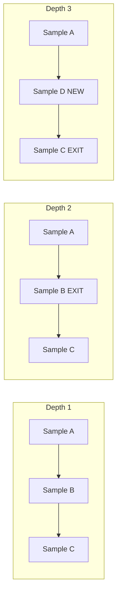

## 論文概要（Abstract）

本記事は [Relaxed Recursive Transformers (ICLR 2025)](https://deepmind.google/research/publications/122290/) の解説記事です。

Google DeepMindの研究チームは、既存の事前学習済みTransformerを「Recursive Transformer」に変換する手法を提案している。Recursive Transformerは単一のレイヤーブロックを複数回繰り返し適用する構造であり、レイヤーごとの低ランクアダプタ（LoRA）を追加することでレイヤー特殊化を実現しつつコンパクトな表現を維持する。著者らは、2倍のサイズのモデルから変換されたRecursive Transformerが、同等サイズの標準的な事前学習モデルを上回る性能を達成することを報告している。さらに、推論効率化のためのContinuous Depth-wise Batching（最大2.76倍の高速化）も提案されている。

この記事は [Zenn記事: Recursive Language Models コンテキスト100倍超を実現する推論手法](https://zenn.dev/0h_n0/articles/acfc7763441dd1) の深掘りです。「再帰（recursion）」をアーキテクチャレベルで実現するアプローチとして、RLMの推論レベルの再帰と対比的に理解できる。

## 情報源

- **会議名**: ICLR 2025（The Thirteenth International Conference on Learning Representations）
- **年**: 2025
- **URL**: [https://deepmind.google/research/publications/122290/](https://deepmind.google/research/publications/122290/)
- **著者**: Sangmin Bae, Adam Fisch, Hrayr Harutyunyan, Ziwei Ji, Seungyeon Kim, Tal Schuster（Google DeepMind）

## カンファレンス情報

ICLR（International Conference on Learning Representations）は機械学習分野の最高峰会議の一つであり、深層学習の理論と応用に焦点を当てている。採択率は例年25-30%程度で競争率が高い。

## 技術的詳細（Technical Details）

### Recursive Transformerの定義

標準的なTransformerは$L$層の異なるレイヤーを持ち、各レイヤーは固有のパラメータ $\theta_1, \theta_2, \ldots, \theta_L$ を持つ。Recursive Transformerは、単一のレイヤーブロック $\theta^*$ を$L$回繰り返し適用する。

$$
h^{(l+1)} = \text{TransformerBlock}(h^{(l)}; \theta^*)
$$

ここで $h^{(l)}$ は $l$ 番目のレイヤー後の隠れ状態、$\theta^*$ は共有パラメータである。

このパラメータ共有により、モデルのパラメータ数は約$1/L$に削減される。ただし、すべてのレイヤーが完全に同一のパラメータを使用するため、レイヤー間の特殊化が失われるという問題がある。

### Relaxed Recursive Transformer（レイヤーごとのLoRA追加）

著者らはこの問題を、レイヤーごとの低ランクアダプタ（LoRA）を追加する「Relaxed」アプローチで解決している。

$$
h^{(l+1)} = \text{TransformerBlock}(h^{(l)}; \theta^* + \Delta\theta_l)
$$

ここで $\Delta\theta_l = B_l A_l$（$B_l \in \mathbb{R}^{d \times r}$, $A_l \in \mathbb{R}^{r \times d}$, $r \ll d$）はレイヤー$l$固有の低ランク摂動である。

この設計により、以下の利点が得られる。

1. **パラメータ効率**: 共有パラメータ $\theta^*$ に対してLoRAパラメータは非常に小さい（$r=16$でフルパラメータの約0.5%）
2. **レイヤー特殊化**: 各レイヤーは$\Delta\theta_l$を通じて固有の振る舞いを獲得
3. **初期化容易性**: 事前学習済みモデルから効率的に変換可能

### 事前学習済みモデルからの変換手順

著者らは以下の手順でRelaxed Recursive Transformerを構築する。

1. 事前学習済み標準Transformerの$L$層パラメータの**平均**を共有パラメータ $\theta^*$ として初期化

$$
\theta^* = \frac{1}{L} \sum_{l=1}^{L} \theta_l
$$

2. 各レイヤーの残差 $\theta_l - \theta^*$ を低ランク分解して $\Delta\theta_l = B_l A_l$ を初期化
3. 短期間の追加学習（継続事前学習）でパラメータを洗練

この変換プロセスは、元のモデルの知識を最大限保持しつつコンパクトなRecursive構造を得るための効率的な手法である。

### Continuous Depth-wise Batching

著者らは、Recursive Transformerの推論効率化のためのContinuous Depth-wise Batchingを提案している。

標準的なバッチ推論では、バッチ内のすべてのサンプルが同じ深度（レイヤー数）で処理される。しかしRecursive Transformerでは、一部のサンプルが浅い深度で十分な品質の出力を生成できる可能性がある（早期終了）。

Continuous Depth-wise Batchingでは以下が行われる。

1. 各サンプルに対して深度ごとの品質スコアを評価
2. 十分な品質に達したサンプルはバッチから取り除く
3. 空いたスロットに新しいサンプルを挿入



著者らはこの手法で最大2.76倍のスループット向上を報告している。

## 実験結果（Results）

### モデル圧縮の効果

著者らの主要な結果として、2倍サイズのモデルからRecursive Transformerに変換した場合、同等サイズの標準モデルを上回る性能が得られることが報告されている。

具体的には、$2N$パラメータの標準Transformerから変換された$N$パラメータのRelaxed Recursive Transformerは、$N$パラメータの標準Transformerよりも高い性能を達成する。これは、大きなモデルから「蒸留」された知識がRecursive構造を通じて効率的に保持されることを示唆している。

知識蒸留と組み合わせた場合、Relaxedモデルは「大幅に大きなコーパスで事前学習された元の非共有モデルに匹敵する結果」を達成することが報告されている。

### 推論効率化

Continuous Depth-wise Batchingによるスループット改善:

| 設定 | スループット改善 |
|---|---|
| 固定深度（ベースライン） | 1.0x |
| 早期終了のみ | 1.4x |
| Continuous Depth-wise Batching | 最大2.76x |

早期終了に加えて動的なサンプルスケジューリングを行うことで、理論上の上限に近いスループットが得られている。

## 実装のポイント（Implementation）

### LoRAランクの選択

LoRAランク$r$はモデルの表現力とパラメータ効率のトレードオフを制御する。著者らの実験では$r=16$が性能とパラメータ数のバランスが良く、フルパラメータの約0.5%の追加で十分なレイヤー特殊化が得られている。

### 変換時の学習コスト

既存モデルからの変換に必要な追加学習は、元の事前学習コストに比べて非常に小さい。元のコーパスの数%の追加トレーニングで十分な性能回復が報告されている。

### 早期終了基準

Continuous Depth-wise Batchingの品質スコアには、中間レイヤーのKLダイバージェンス（連続する深度の出力分布の差異）が使用されている。

$$
\text{quality}(l) = D_{\text{KL}}\left(p(y|h^{(l)}) \| p(y|h^{(l-1)})\right) < \epsilon
$$

$\epsilon$ が小さいほど出力が安定しており、追加のレイヤー処理は不要と判断される。

## Production Deployment Guide

### AWS実装パターン

Relaxed Recursive Transformerのデプロイでは、モデルの圧縮性を活かしたコスト最適化が可能である。2倍サイズのモデル相当の性能を半分のパラメータで実現するため、インスタンスコストが削減される。

| 規模 | 推奨構成 | 月額コスト目安 |
|------|---------|-------------|
| **Small** | SageMaker Serverless | $50-200 |
| **Medium** | SageMaker Real-Time + g5.xlarge | $400-1,000 |
| **Large** | EKS + g5.xlarge Spot × 2-4 | $1,500-4,000 |

Recursive Transformerでは、同一レイヤーブロックの繰り返し適用のためKVキャッシュの管理が標準Transformerと異なる点に注意が必要である。Continuous Depth-wise Batchingを実装することで追加の高速化（最大2.76倍）が見込めるが、バッチスケジューラの実装コストが発生する。

**コスト試算の注意事項**: 2026年4月時点のAWS ap-northeast-1料金に基づく概算。Recursive Transformerのパラメータ削減により、より小さなGPUインスタンスで同等性能が得られる可能性がある。

### Terraformインフラコード

```hcl
resource "aws_sagemaker_endpoint_configuration" "recursive_transformer" {
  name = "recursive-transformer-config"

  production_variants {
    variant_name           = "primary"
    model_name            = aws_sagemaker_model.recursive_transformer.name
    instance_type         = "ml.g5.xlarge"
    initial_instance_count = 1
    initial_variant_weight = 1.0
  }
}

resource "aws_sagemaker_model" "recursive_transformer" {
  name               = "relaxed-recursive-transformer"
  execution_role_arn = aws_iam_role.sagemaker.arn

  primary_container {
    image          = "763104351884.dkr.ecr.ap-northeast-1.amazonaws.com/huggingface-pytorch-inference:2.1.0-transformers4.37.0-gpu-py310-cu121-ubuntu22.04"
    model_data_url = "s3://models-bucket/recursive-transformer/model.tar.gz"
    environment = {
      HF_MODEL_ID           = "relaxed-recursive-transformer"
      ENABLE_DEPTH_BATCHING  = "true"
      EARLY_EXIT_THRESHOLD   = "0.01"
      MAX_DEPTH              = "32"
    }
  }
}

resource "aws_cloudwatch_metric_alarm" "inference_latency" {
  alarm_name          = "recursive-transformer-latency"
  comparison_operator = "GreaterThanThreshold"
  evaluation_periods  = 2
  metric_name         = "ModelLatency"
  namespace           = "AWS/SageMaker"
  period              = 300
  statistic           = "p99"
  threshold           = 5000
  alarm_description   = "推論レイテンシP99が5秒超過"

  dimensions = {
    EndpointName = aws_sagemaker_endpoint.recursive_transformer.name
    VariantName  = "primary"
  }
}
```

### コスト最適化チェックリスト

- [ ] Recursive Transformerの圧縮によりインスタンスサイズを1段階下げる
- [ ] Continuous Depth-wise Batchingで最大2.76倍のスループット
- [ ] 早期終了閾値（$\epsilon$）のタスク別チューニング
- [ ] SageMaker Spot Training使用（学習コスト最大90%削減）
- [ ] SageMaker Auto-Scalingで需要変動に対応
- [ ] モデルをINT8/FP8量子化してさらにインスタンスコスト削減
- [ ] CloudWatchでレイテンシP99とスループットを監視
- [ ] AWS Budgets月額予算設定

## 実運用への応用（Practical Applications）

Relaxed Recursive Transformerは、RLM（arXiv:2512.24601）の「推論レベルの再帰」とは異なる「アーキテクチャレベルの再帰」を実現する。この2つのアプローチは直交しており、組み合わせることが可能である。

具体的には、Relaxed Recursive Transformerで構築された圧縮モデルをRLMのサブLLMとして使用することで、以下の利点が得られる可能性がある。

1. **コスト削減**: サブLLMのパラメータ数が半減し、推論コストが削減される
2. **レイテンシ改善**: Continuous Depth-wise Batchingによるスループット向上
3. **品質維持**: 2倍サイズモデル相当の性能を維持

ただし、RLMのREPL環境内でのRecursive Transformer特有のKVキャッシュ管理が技術的な課題となる可能性がある。

## 関連研究（Related Work）

- **Universal Transformers (Dehghani et al., 2019)**: レイヤー共有Transformerの先駆的研究。Relaxed版はLoRAによる特殊化を追加
- **Knowledge Distillation (Hinton et al., 2015)**: 大型→小型モデルの知識転移。本手法は蒸留と構造圧縮を組み合わせる
- **LoRA (Hu et al., 2022)**: 低ランク適応の基盤技術。本手法はLoRAをレイヤー特殊化に応用する新たなユースケース

## まとめ

Relaxed Recursive Transformerは、パラメータ共有とレイヤーごとのLoRAを組み合わせることで、モデル圧縮と性能維持を両立する。2倍サイズモデルから変換された圧縮モデルが同等サイズの標準モデルを上回る結果は、大規模モデルの知識を効率的に保持できることを示している。Continuous Depth-wise Batchingによる最大2.76倍の推論高速化も実用面で価値が高い。RLMとの組み合わせによるサブLLMの効率化は、今後の探索が期待される方向性である。

## 参考文献

- **Conference URL**: [https://deepmind.google/research/publications/122290/](https://deepmind.google/research/publications/122290/)
- **Related Zenn article**: [https://zenn.dev/0h_n0/articles/acfc7763441dd1](https://zenn.dev/0h_n0/articles/acfc7763441dd1)
