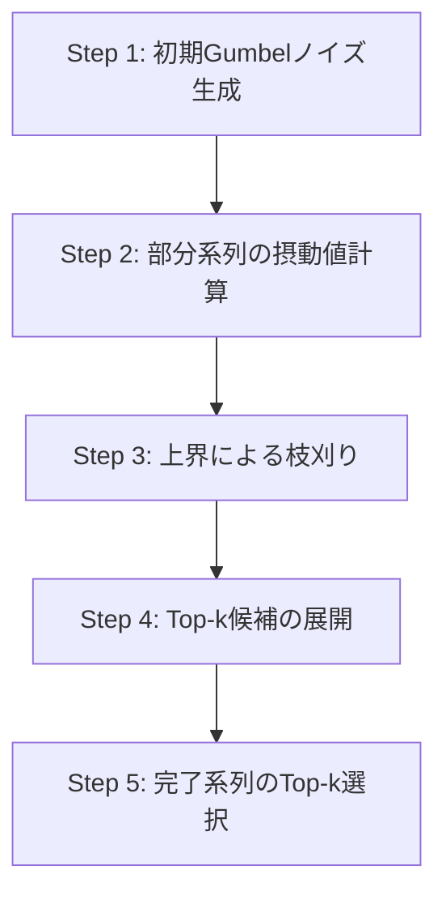

## 論文概要

本記事は [Stochastic Beams and Where to Find Them: The Gumbel-Top-k Trick for Sampling Sequences Without Replacement](https://arxiv.org/abs/1903.06059) の解説記事です。
この記事は [Zenn記事: Neural Garbage Collection―LLMが自ら忘却を学ぶKVキャッシュ管理](https://zenn.dev/0h_n0/articles/a571af34a7694f) の深掘りです。

Koolらは、カテゴリカル分布からk個の要素を非復元（without replacement）でサンプリングする手法として「Gumbel-Top-k Trick」を提案した。Gumbel-Max Trick（k=1の場合）の自然な拡張であり、対数確率にGumbelノイズを加算してtop-kを選択するだけで、理論的に厳密な非復元サンプリングが実現できる。さらに、この手法を系列の因子化分布に暗黙的に適用する「Stochastic Beam Search」を導出し、指数的に大きな探索空間でもモデル評価回数がkと系列長に対して線形で済むことを示した。

## 情報源

| 項目 | 内容 |
|------|------|
| arXiv ID | [1903.06059](https://arxiv.org/abs/1903.06059) |
| 著者 | Wouter Kool, Herke van Hoof, Max Welling (University of Amsterdam) |
| 発表年 | 2019 |
| カンファレンス | ICML 2019 (Proceedings of Machine Learning Research, Vol. 97, pp. 3499-3508) |
| 分野 | cs.LG, stat.ML |
| コード | [GitHub: wouterkool/stochastic-beam-search](https://github.com/wouterkool/stochastic-beam-search) |

## カンファレンス情報

**ICML（International Conference on Machine Learning）** は、機械学習分野における最高峰の国際会議の一つであり、NeurIPS、ICLRとともに「機械学習三大会議」と呼ばれる。2019年のICMLはLong Beachで開催され、採択率は約22.6%（773/3424件）であった。本論文はこの厳しい査読プロセスを通過しており、Gumbel分布を用いた離散サンプリング理論の基盤的貢献として評価された。

編集はK. ChaudhuriとR. Salakhutdinovが担当した。

## 背景と動機

深層生成モデルや強化学習において、離散的なカテゴリカル分布からのサンプリングは基本的な操作である。しかし、**非復元サンプリング**（同じ要素を2回以上選ばない）を効率的かつ微分可能に行う方法は確立されていなかった。

従来手法の問題点は以下の通りである。

- **逐次的サンプリング**: 1つサンプルするたびに確率を再正規化する必要があり、計算コストが高い
- **Beam Search**: 決定的であり、多様性が低い。確率最大化に偏るため、翻訳タスクなどで同じような出力しか生成できない
- **Gumbel-Softmax（Jang et al., 2016）**: 連続緩和を用いるため、厳密な離散サンプルではない。また、非復元サンプリングへの拡張が自明でない

著者らは、Gumbel-Max Trickという既知の手法をk個の選択に拡張することで、上記の問題を統一的に解決できることを示した。特に系列モデルへの適用では、指数的なドメインサイズにもかかわらず線形の計算量で済む点が実用上の大きな利点である。

## 主要な貢献

1. **Gumbel-Top-k Trickの定式化**: Gumbel-Max Trickをk個の非復元サンプリングに拡張し、対数確率にi.i.d. Gumbelノイズを加えてtop-kを取る操作が厳密な非復元サンプリングと等価であることを証明した
2. **Stochastic Beam Searchの導出**: 因子化された系列分布に対してGumbel-Top-k Trickを暗黙的に適用するアルゴリズムを提案。通常のBeam Searchと同じ計算量で多様なサンプルを生成できる
3. **サンプル確率の解析的計算**: 非復元サンプリングで得られた各サンプルの包含確率（inclusion probability）を解析的に計算する方法を示した。これによりREINFORCE勾配推定が可能になる
4. **低分散勾配推定器**: 非復元サンプルを用いたREINFORCE推定器が、復元サンプリングより低分散であることを理論的・実験的に示した
5. **機械翻訳での実証**: WMT'14英独翻訳タスクにおいて、多様で高品質な翻訳候補の生成と、文レベルBLEUスコアの低分散推定を実現した

## 技術的詳細

### Gumbel分布の基礎

Gumbel分布は極値理論に由来する分布で、確率密度関数と累積分布関数は以下で定義される。

$$
f(g) = e^{-(g + e^{-g})}, \quad F(g) = e^{-e^{-g}}
$$

標準Gumbel分布（位置パラメータ0、スケール1）からのサンプリングは以下で行える。

$$
g = -\log(-\log(u)), \quad u \sim \text{Uniform}(0, 1)
$$

Gumbel分布の重要な性質として、**独立なGumbel確率変数の最大値もGumbel分布に従う**という点がある。

### Gumbel-Max Trick

カテゴリカル分布 $$ p(X = i) \propto e^{\alpha_i} $$ からのサンプリングは、各カテゴリの対数確率（非正規化）$$ \alpha_i $$ にi.i.d.標準Gumbel変数 $$ g_i $$ を加算し、最大値を取る操作と等価である。

$$
X = \arg\max_{i} (\alpha_i + g_i), \quad g_i \overset{\text{i.i.d.}}{\sim} \text{Gumbel}(0, 1)
$$

この結果は、摂動した値（perturbed log-probability）$$ z_i = \alpha_i + g_i $$ の最大値が $$ \text{Gumbel}(\log \sum_j e^{\alpha_j}, 1) $$ に従うことから導かれる。

### Gumbel-Top-k Trick

Gumbel-Max Trickの自然な拡張として、**top-kを取ることで非復元k-サンプルが得られる**。

$$
S = \text{top-k}(\{z_i\}_{i=1}^{n}), \quad z_i = \alpha_i + g_i
$$

ここで $$ S $$ は選ばれたk個のインデックスの集合である。著者らは、この操作が以下の非復元サンプリング分布と等価であることを証明した。

$$
p(S) = \prod_{j=1}^{k} \frac{e^{\alpha_{s_j}}}{\sum_{i \notin \{s_1, \ldots, s_{j-1}\}} e^{\alpha_i}}
$$

すなわち、逐次的に1つずつサンプルし、選んだ要素を除外して再正規化する手続きと同じ分布を、**並列的なtop-k操作**で実現できる。

### Stochastic Beam Search

系列 $$ \mathbf{x} = (x_1, x_2, \ldots, x_T) $$ の確率が因子化される場合を考える。

$$
\log p(\mathbf{x}) = \sum_{t=1}^{T} \log p(x_t \mid x_1, \ldots, x_{t-1})
$$

ドメインサイズは語彙サイズ $$ V $$ に対して $$ V^T $$ と指数的に大きいため、全系列にGumbelノイズを加算してtop-kを取ることは直接的には不可能である。

著者らの重要な洞察は、**Gumbelノイズを段階的に（top-down方式で）サンプリングできる**という点にある。具体的には、部分系列の摂動値の上界を利用して、完全な系列を展開する必要のない候補を枝刈りする。



アルゴリズムの核心は、通常のBeam Searchと同じ構造を持ちながら、スコアリング関数を対数確率から**摂動対数確率**（Gumbelノイズ付き）に置き換える点にある。これにより、決定論的なBeam Searchが確率的な非復元サンプラーに変換される。

### 包含確率の計算

非復元サンプルの各要素の包含確率は以下で計算できる。著者らは、摂動値の条件付き分布がTruncated Gumbel分布になることを利用している。

$$
p(i \in S) = 1 - \prod_{j=1}^{k} \left(1 - \frac{e^{\alpha_i}}{\sum_{l \notin S_{<j}} e^{\alpha_l}}\right)
$$

この包含確率は対数空間で安定に計算でき、REINFORCE勾配推定器の重み付けに直接利用できる。

## 実装のポイント

以下にGumbel-Top-k Trickの基本実装を示す。

```python
import torch
from torch import Tensor


def gumbel_top_k(
    log_probs: Tensor,
    k: int,
    temperature: float = 1.0,
) -> tuple[Tensor, Tensor]:
    """Gumbel-Top-k Trickによる非復元サンプリング.

    Args:
        log_probs: 対数確率ベクトル (batch_size, num_categories)
        k: サンプル数
        temperature: サンプリング温度（低いほど決定的）

    Returns:
        indices: 選択されたインデックス (batch_size, k)
        perturbed: 摂動後の値 (batch_size, k)

    Note:
        temperature=0の極限で通常のtop-k（決定的）と一致する。
    """
    # i.i.d. Gumbel(0,1)ノイズの生成
    # -log(-log(u)), u ~ Uniform(0,1)
    u = torch.rand_like(log_probs).clamp(min=1e-10)
    gumbel_noise = -torch.log(-torch.log(u))

    # 摂動対数確率の計算
    perturbed_log_probs = log_probs + gumbel_noise * temperature

    # Top-k選択
    top_k_values, top_k_indices = torch.topk(
        perturbed_log_probs, k=k, dim=-1
    )

    return top_k_indices, top_k_values
```

Stochastic Beam Searchの利用については、著者らが公開しているFairseqベースの実装（[GitHub](https://github.com/wouterkool/stochastic-beam-search)）を参照できる。主要なハイパーパラメータは以下の通りである。

| パラメータ | 推奨値 | 説明 |
|-----------|--------|------|
| `beam` (k) | 5-20 | ビーム幅。大きいほど多様だが計算コスト増 |
| `sampling_temperature` | 0.3-1.0 | 低いほど高確率系列に集中。ML学習モデルでは0.3程度が推奨 |
| `unnormalized` | True | アルゴリズムの正確性のために必須 |
| `no-early-stopping` | True | 全ビームが終了するまで探索を継続 |

## Production Deployment Guide

Gumbel-Top-k Trickは離散サンプリングベースの推論パイプラインの基盤技術であり、NGCのKVキャッシュ管理やMulti-candidate生成などの実システムに適用できる。以下ではAWSでの本番デプロイ構成を示す。

### 1. AWS実装パターン

| 規模 | 月間リクエスト | 推奨構成 | 月額コスト | 主要サービス |
|------|--------------|---------|-----------|------------|
| Small | ~3,000 (100/日) | Serverless | $50-150 | Lambda + Bedrock + DynamoDB |
| Medium | ~30,000 (1,000/日) | Hybrid | $300-800 | Lambda + ECS Fargate + ElastiCache |
| Large | 300,000+ (10,000/日) | Container | $2,000-5,000 | EKS + Karpenter + EC2 Spot |

**Small**: Lambda ARM64 512MB ($5) + Bedrock Haiku ($30-100) + DynamoDB On-Demand ($5) + CloudWatch ($5)。
**Medium**: ECS Fargate 0.5vCPU x2 ($60) + Lambda ($10) + ElastiCache t4g.micro ($15) + Bedrock ($150-500) + ALB ($20)。
**Large**: EKS ($75) + Karpenter Spot g5.xlarge x2-4 ($800-2000) + Secrets Manager ($5) + S3 ($50)。

**コスト削減**: Spot最大90%、RI最大72%、Batch API 50%、Prompt Caching 30-90%。※2026年4月時点ap-northeast-1概算。

### 2. Terraformインフラコード

**Small構成（Serverless）**:

```hcl
terraform {
  required_version = ">= 1.9"
  required_providers {
    aws = { source = "hashicorp/aws", version = "~> 5.80" }
  }
}

provider "aws" { region = "ap-northeast-1" }

resource "aws_dynamodb_table" "sampling_cache" {
  name         = "gumbel-topk-cache"
  billing_mode = "PAY_PER_REQUEST"
  hash_key     = "request_id"
  range_key    = "created_at"
  attribute { name = "request_id"; type = "S" }
  attribute { name = "created_at"; type = "S" }
  ttl { attribute_name = "expires_at"; enabled = true }
  point_in_time_recovery { enabled = true }
}

resource "aws_iam_role" "lambda_role" {
  name = "gumbel-topk-lambda-role"
  assume_role_policy = jsonencode({
    Version = "2012-10-17"
    Statement = [{
      Action = "sts:AssumeRole", Effect = "Allow"
      Principal = { Service = "lambda.amazonaws.com" }
    }]
  })
}

resource "aws_iam_role_policy" "lambda_policy" {
  name = "gumbel-topk-lambda-policy"
  role = aws_iam_role.lambda_role.id
  policy = jsonencode({
    Version = "2012-10-17"
    Statement = [
      { Effect = "Allow", Action = ["dynamodb:PutItem","dynamodb:GetItem","dynamodb:Query"], Resource = aws_dynamodb_table.sampling_cache.arn },
      { Effect = "Allow", Action = ["bedrock:InvokeModel"], Resource = "arn:aws:bedrock:ap-northeast-1::foundation-model/*" },
      { Effect = "Allow", Action = ["logs:CreateLogGroup","logs:CreateLogStream","logs:PutLogEvents"], Resource = "arn:aws:logs:*:*:*" }
    ]
  })
}

resource "aws_lambda_function" "sampling" {
  function_name = "gumbel-topk-sampling"
  runtime       = "python3.12"
  handler       = "handler.lambda_handler"
  role          = aws_iam_role.lambda_role.arn
  memory_size   = 512
  timeout       = 30
  architectures = ["arm64"]
  filename      = "lambda.zip"
  environment {
    variables = { DYNAMODB_TABLE = aws_dynamodb_table.sampling_cache.name, TEMPERATURE = "0.5", TOP_K = "10" }
  }
}

resource "aws_cloudwatch_metric_alarm" "lambda_errors" {
  alarm_name          = "gumbel-topk-lambda-errors"
  comparison_operator = "GreaterThanThreshold"
  evaluation_periods  = 2
  metric_name         = "Errors"
  namespace           = "AWS/Lambda"
  period              = 300
  statistic           = "Sum"
  threshold           = 5
  dimensions          = { FunctionName = aws_lambda_function.sampling.function_name }
}
```

**Large構成（Container）**: `terraform-aws-modules/eks/aws` (~> 20.31) でEKSクラスタを構築し、KarpenterでSpot優先のGPUノード（g5.xlarge）を自動スケーリングする。Secrets ManagerでAPIキー管理、AWS Budgetsで月額$5,000のアラートを設定する。

### 3. セキュリティベストプラクティス

- **ネットワーク**: VPC内配置、VPCエンドポイント経由アクセス、SG outbound 443のみ
- **認証**: IAM最小権限、BedrockリソースポリシーでモデルID限定、API Gateway認証必須
- **シークレット**: Secrets Managerで一元管理・ローテーション有効化、環境変数への直接格納禁止
- **監査**: CloudTrail全API記録、Config Rules、GuardDuty異常検知
- **データ保護**: DynamoDB暗号化、S3パブリックアクセスブロック、TLS 1.2以上必須

### 4. 運用・監視設定

**CloudWatch Logs Insightsクエリ**:

```
# レイテンシ P95/P99
fields @timestamp, duration_ms
| stats percentile(duration_ms, 95) as p95, percentile(duration_ms, 99) as p99 by bin(5m)
| sort @timestamp desc | limit 48
```

**CloudWatchアラーム設定（Python boto3）**:

```python
import boto3
from typing import Any


def create_latency_alarm(
    function_name: str,
    threshold_ms: float = 5000.0,
) -> dict[str, Any]:
    """Lambda関数のP99レイテンシアラームを作成する.

    Args:
        function_name: 監視対象のLambda関数名
        threshold_ms: アラーム閾値（ミリ秒）

    Returns:
        CloudWatch API レスポンス
    """
    client = boto3.client("cloudwatch", region_name="ap-northeast-1")
    return client.put_metric_alarm(
        AlarmName=f"{function_name}-p99-latency",
        MetricName="Duration",
        Namespace="AWS/Lambda",
        Statistic="p99",
        Period=300,
        EvaluationPeriods=3,
        Threshold=threshold_ms,
        ComparisonOperator="GreaterThanThreshold",
        Dimensions=[{"Name": "FunctionName", "Value": function_name}],
        AlarmActions=[],  # SNSトピックARNを設定
        TreatMissingData="notBreaching",
    )
```

**その他**: X-Ray (`aws_xray_sdk`) でサンプリング関数を計装、Cost Explorer (`get_cost_and_usage`) で月次コストレポートを自動生成。

### 5. コスト最適化チェックリスト

- [ ] リクエスト量に応じた構成選択（Serverless / Hybrid / Container）
- [ ] Lambda ARM64 (Graviton) 選択（x86比20%安価）
- [ ] EKS: KarpenterでSpot優先ノードプロビジョニング
- [ ] DynamoDB: On-Demand vs Provisioned を負荷パターンで選択
- [ ] Prompt Caching有効化（30-90%削減）、Batch API利用（50%削減）
- [ ] 小規模モデル（Haiku）で十分なタスクを分離
- [ ] ElastiCacheで重複リクエスト削減
- [ ] AWS Budgets 80%/100%アラート、Cost Anomaly Detection有効化
- [ ] ログ保持期間30日、未使用リソース月次クリーンアップ
- [ ] Savings Plans / RI検討、Cost Allocationタグ有効化

## 実験結果

著者らはWMT'14英独翻訳タスク（Transformer base model, fairseq実装）で実験を行っている。

**多様性と品質のトレードオフ**（論文Figure 2, 3より）:

| 手法 | ビーム幅 | 多様性 | Oracle BLEU | 特徴 |
|------|---------|--------|-------------|------|
| Beam Search | 5 | 低 | 中 | 決定的、上位候補が類似 |
| 復元サンプリング | 5 | 高 | 低 | 重複サンプルあり |
| Stochastic Beam Search | 5 | 高 | 高 | 非復元、多様かつ高品質 |

著者らは以下の知見を報告している。

- Stochastic Beam Searchは通常のBeam Searchと同じ計算量でありながら、多様な翻訳候補を生成できる
- temperature=0.3で、ML学習済みモデルにおいて良好な多様性・品質バランスが得られた
- 非復元サンプルを用いたREINFORCE推定器は、復元サンプリングベースの推定器と比較して分散が低い
- 文レベルBLEUスコアとモデルエントロピーの推定において、少ないサンプル数で安定した推定値が得られた

**制約と限界**:
- 現在のFairseq実装はメモリ効率が最適化されていない
- 長い系列ではビーム探索の計算コストが依然として大きい
- temperature パラメータの選択はタスク依存であり、事前のチューニングが必要

## 実運用への応用

### NGC（Neural Garbage Collection）との関係

本論文のGumbel-Top-k Trickは、NGC論文（arXiv:2604.18002, Kool et al.の手法を直接応用）のコアアルゴリズムである。NGCでは、KVキャッシュのどのブロックを除去するかという**離散的な選択問題**をGumbel-Top-kで解いている。

具体的には以下のように適用される。

1. **KVキャッシュブロックの重要度スコア**: LLMの各レイヤーでKVキャッシュブロックに対する対数確率（除去スコア）$$ \alpha_i $$ を計算
2. **Gumbelノイズの付加**: 各ブロックにi.i.d. Gumbelノイズを加算し、摂動スコア $$ z_i = \alpha_i + g_i $$ を得る
3. **Top-k選択**: 摂動スコアのtop-kを取り、除去対象のブロックをk個選択
4. **REINFORCE勾配**: 非復元サンプリングの包含確率を用いてPolicy Gradientを計算し、除去ポリシーを学習

この手法により、NGCは離散的なキャッシュ除去決定を微分不可能な操作として扱いつつも、REINFORCE推定器を通じてend-to-endの学習を実現している。Zenn記事で紹介したNGCのCountdownタスクでの高精度（49.6%、SnapKV 21.2%の2.3倍）は、このGumbel-Top-kによる効率的な離散最適化に支えられている。

### プロダクション視点での意義

Gumbel-Top-kの実用的な価値は以下の点にある。

- **計算効率**: top-k操作は高度に最適化されたGPUカーネルで実行可能。追加コストはGumbelノイズ生成（一様乱数2回+log演算）のみ
- **実装の容易さ**: 既存のtop-k選択ロジックにGumbelノイズを追加するだけで非復元サンプリングが実現できる
- **汎用性**: 翻訳だけでなく、KVキャッシュ管理、トークン選択、バッチスケジューリングなど、離散選択を含む任意のタスクに適用可能

## 関連研究

- **Gumbel-Softmax / Concrete Distribution (Jang et al., 2016; Maddison et al., 2016)**: 離散サンプリングの連続緩和。勾配は計算可能だが、厳密な離散サンプルではない。Gumbel-Top-kは厳密な離散サンプルを保証する点で異なる
- **REINFORCE (Williams, 1992)**: 離散変数を含むモデルの勾配推定の基盤手法。Gumbel-Top-kの非復元サンプルと組み合わせることで分散を低減できることが本論文で示された
- **Diverse Beam Search (Vijayakumar et al., 2016)**: ヒューリスティックな多様性ペナルティを導入。Stochastic Beam Searchは理論的に厳密な非復元サンプリングである点で異なる
- **Ancestral Sampling**: 自己回帰モデルの標準的サンプリング。復元方式のため同一系列の重複が起こり得る

## まとめと今後の展望

Koolらが提案したGumbel-Top-k Trickは、離散サンプリングの理論と実用を橋渡しする基盤的な貢献である。対数確率にGumbelノイズを加えてtop-kを取るという操作が、厳密な非復元サンプリングと等価であるという結果は、その後のNGCをはじめとする多くの手法の数学的基盤となっている。

今後の展望として、著者らはStochastic Beam Searchの学習への統合（サンプリング方策の最適化）や、より大規模な言語モデルへの適用を挙げている。2026年現在、NGCによるKVキャッシュ管理への応用が示すように、Gumbel-Top-kは推論効率化の文脈でも重要性を増している。離散最適化と深層学習の接点として、本手法の発展は注目に値する。

## 参考文献

- Kool, W., van Hoof, H., & Welling, M. (2019). Stochastic Beams and Where to Find Them: The Gumbel-Top-k Trick for Sampling Sequences Without Replacement. ICML 2019. [arXiv:1903.06059](https://arxiv.org/abs/1903.06059)
- 公式実装: [GitHub: wouterkool/stochastic-beam-search](https://github.com/wouterkool/stochastic-beam-search)
- ICML Proceedings: [proceedings.mlr.press/v97/kool19a.html](https://proceedings.mlr.press/v97/kool19a.html)
- 関連Zenn記事: [Neural Garbage Collection―LLMが自ら忘却を学ぶKVキャッシュ管理](https://zenn.dev/0h_n0/articles/a571af34a7694f)
- Jang, E., Gu, S., & Poole, B. (2016). Categorical Reparameterization with Gumbel-Softmax. [arXiv:1611.01144](https://arxiv.org/abs/1611.01144)
- NGC論文: [arXiv:2604.18002](https://arxiv.org/abs/2604.18002)

:::message
この記事はAI（Claude Code）により自動生成されました。内容の正確性については原論文もご確認ください。
:::
