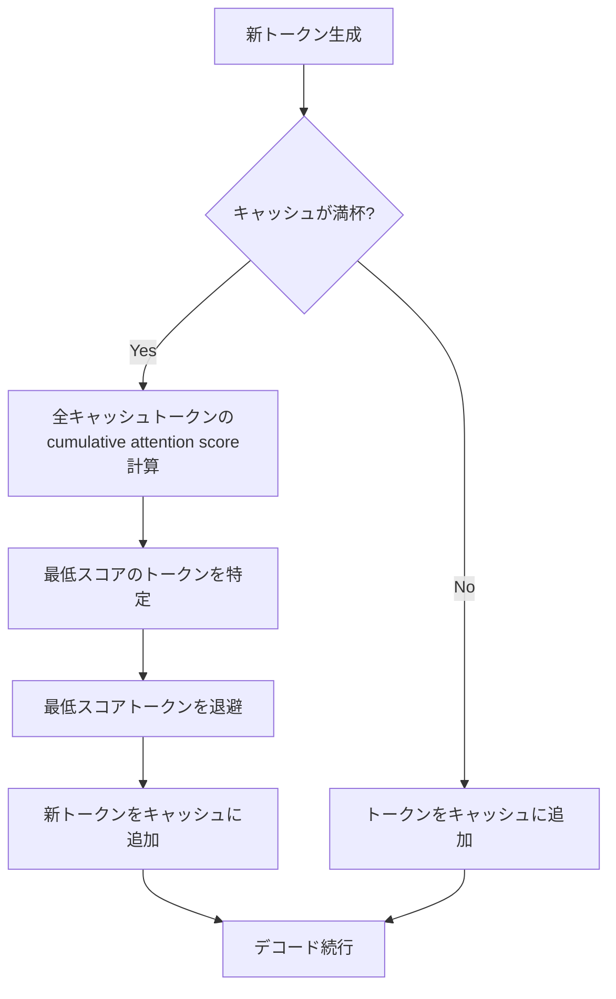

## 論文概要

本記事は [H2O: Heavy-Hitter Oracle for Efficient Generative Inference of Large Language Models](https://arxiv.org/abs/2306.14048) の解説記事です。
この記事は [Zenn記事: Neural Garbage Collection―LLMが自ら忘却を学ぶKVキャッシュ管理](https://zenn.dev/0h_n0/articles/a571af34a7694f) の深掘りです。

H2Oは、LLMの自己回帰デコード時に生じるKVキャッシュのメモリ使用量を大幅に削減する手法である。著者らは、attention scoreの累積分布がべき乗則（power-law）に従うことを発見し、少数の「Heavy Hitter」トークンが全体のattention合計の大部分を占めることを示した。この知見に基づき、Heavy Hitterと直近トークンをバランスよく保持する退避ポリシーを提案し、OPT・LLaMA・GPT-NeoXで20%のKVキャッシュ予算でも性能を維持できることを報告している。NeurIPS 2023にて発表された。

## 情報源

- **arXiv ID**: 2306.14048
- **URL**: [https://arxiv.org/abs/2306.14048](https://arxiv.org/abs/2306.14048)
- **著者**: Zhenyu Zhang, Ying Sheng, Tianyi Zhou, Tianlong Chen, Lianmin Zheng, Ruisi Cai, Zhao Song, Yuandong Tian, Christopher Re, Clark Barrett, Zhangyang Wang, Beidi Chen
- **発表**: NeurIPS 2023
- **分野**: cs.LG, cs.CL
- **GitHub**: [https://github.com/FMInference/H2O](https://github.com/FMInference/H2O)

## 背景と動機

LLMの自己回帰デコードでは、過去の全トークンに対するKey-Valueペアをキャッシュに保持する必要がある。このKVキャッシュのメモリ使用量はシーケンス長とバッチサイズに対して線形にスケールし、対話システムや長文生成タスクにおいてGPUメモリのボトルネックとなる。例えばOPT-30Bでは、モデルパラメータ自体が約60GBを占める上に、長いシーケンスではKVキャッシュがさらに数十GBに達する。

従来のアプローチとしては、Sparse Transformerのように事前定義されたパターンで疎なattentionを実現する手法が存在したが、これらは学習時からの変更が必要であり、既存の訓練済みモデルにそのまま適用できないという課題があった。また、単純に直近のトークンのみを保持する「Local」戦略では、文脈情報の損失が著しく、性能が大幅に低下する。著者らは、訓練済みLLMのattention行列が95%以上のスパース性を示すにもかかわらず、どのトークンが重要かを動的に判定する実用的な手法が欠如していたことを課題として指摘している。

## 主要な貢献

1. **Heavy Hitter現象の発見**: attention scoreの累積分布がべき乗則に従い、少数のトークンが全体のattentionの大部分を占めるという経験的知見を報告
2. **H2Oアルゴリズムの提案**: Heavy Hitterトークンと直近トークンをバランスよく保持する動的KVキャッシュ退避ポリシーを設計
3. **理論的保証の導出**: KVキャッシュ退避を動的劣モジュラ最適化問題として定式化し、貪欲アルゴリズムの近似保証を証明
4. **広範な実験的検証**: OPT（6.7B〜175B）、LLaMA（7B/13B）、GPT-NeoX-20Bで、20%のKVキャッシュ予算でフルキャッシュと同等の精度を達成
5. **実システムでのスループット改善**: DeepSpeed Zero-Inference、Hugging Face Accelerate、FlexGenに対してそれぞれ最大29倍、29倍、3倍のスループット向上を報告

## 技術的詳細

### Heavy Hitter現象とべき乗則分布

著者らは、訓練済みLLMのattention行列を分析し、各トークンの累積attention scoreがべき乗則分布に従うことを発見した。具体的には、全生成ステップにわたるattention scoreの累積値を計算すると、少数のトークンが極端に高いスコアを持ち、大多数のトークンは低いスコアにとどまる。このべき乗則特性は、テキスト中の単語の共起頻度と強く相関していると著者らは報告している。

### cumulative attention scoreの定式化

ステップ$$i$$におけるattention出力は以下のように計算される。

$$
o_i = D_i^{-1} \cdot \exp\left(Q_{i,*} \cdot K_{S_i,*}^T\right) \cdot V_{S_i,*}
$$

ここで$$S_i$$はステップ$$i$$におけるKVキャッシュの内容（保持されているトークンの集合）、$$D_i$$は正規化定数、$$Q_{i,*}$$はステップ$$i$$のクエリベクトル、$$K_{S_i,*}$$と$$V_{S_i,*}$$はキャッシュ内のKeyとValueの行列である。退避されたトークンの寄与はゼロとして扱われ、正規化定数から差し引かれる。

各トークン$$j$$のcumulative attention scoreは以下で定義される。

$$
\text{score}(j) = \sum_{i > j} \alpha_{i,j}
$$

ここで$$\alpha_{i,j}$$はステップ$$i$$におけるトークン$$j$$へのattention重みである。H2Oはこのスコアが高いトークンをHeavy Hitterとして識別する。

### H2O退避アルゴリズム

H2Oの退避ポリシーは、キャッシュサイズを$$k$$に固定し、各デコードステップで以下の手順を実行する。

1. 新しいトークン$$i$$が生成されたら、キャッシュ$$S_{i-1} \cup \{i\}$$のすべてのトークンについてattention scoreを計算
2. 目的関数$$F_{\text{score}}(T) = \sum_{s \in T} o_s$$を最大化するように、退避するトークンを選択
3. 退避対象: $$u \leftarrow \arg\min_{v \in S_{i-1} \cup \{i\}} F_{\text{score}}(S_{i-1} \cup \{i\} \setminus \{v\})$$
4. 新しいキャッシュ: $$S_i = S_{i-1} \cup \{i\} \setminus \{u\}$$

キャッシュ予算$$k$$のうち、おおよそ半分をHeavy Hitterトークンに、残り半分を直近トークンに割り当てる。著者らの実験では、いずれか一方のみの保持では2.85%〜22.75%の精度低下が生じると報告されている（論文Table 9）。

### 理論的保証

著者らは、KVキャッシュ退避を動的劣モジュラ最適化問題として定式化した。attention score関数が劣モジュラ性（diminishing returns性質）を満たすと仮定すると、H2Oの貪欲アルゴリズムは以下の近似保証を持つ。

$$
f(\tilde{S}_i) \geq (1 - \alpha)\left(1 - \frac{1}{e}\right) \max_{|S|=k} f(S) - \beta
$$

ここで$$\alpha, \beta > 0$$は誤差パラメータであり、$$(1 - 1/e) \approx 0.632$$は古典的な劣モジュラ最大化の近似比率である。この定理は、H2Oが最適解の約63.2%以上のスコアを保持することを理論的に保証している。



## 実装のポイント

以下は、H2Oの退避ポリシーのコア部分を簡略化したPython実装である。

```python
import torch
from dataclasses import dataclass


@dataclass
class H2OConfig:
    """H2O KVキャッシュ退避の設定パラメータ。

    Attributes:
        max_cache_size: KVキャッシュの最大トークン数
        heavy_hitter_ratio: キャッシュ予算に占めるHeavy Hitter枠の割合
    """
    max_cache_size: int = 256
    heavy_hitter_ratio: float = 0.5


def h2o_evict(
    attention_scores: torch.Tensor,
    cumulative_scores: torch.Tensor,
    cache_size: int,
    num_heavy_hitters: int,
) -> tuple[torch.Tensor, int]:
    """H2O退避ポリシーに基づき退避対象トークンのインデックスを返す。

    Args:
        attention_scores: 現ステップのattention重み [seq_len]
        cumulative_scores: 各トークンの累積attention score [seq_len]
        cache_size: 現在のキャッシュ内トークン数
        num_heavy_hitters: Heavy Hitter枠のトークン数

    Returns:
        更新後のcumulative_scoresと退避対象インデックス
    """
    # 累積スコアを更新
    cumulative_scores = cumulative_scores + attention_scores

    # 直近トークン枠の数
    num_recent: int = cache_size - num_heavy_hitters

    if cache_size <= num_heavy_hitters + num_recent:
        return cumulative_scores, -1  # 退避不要

    # Heavy Hitter枠と直近枠以外から最低スコアを退避
    eviction_candidates = cumulative_scores[:cache_size - num_recent]
    evict_idx: int = int(torch.argmin(eviction_candidates).item())

    return cumulative_scores, evict_idx
```

**ハイパーパラメータの推奨値**（論文Table 1, Table 9の実験結果に基づく）:

| パラメータ | 推奨値 | 備考 |
|-----------|--------|------|
| `max_cache_size` | 元のシーケンス長の20% | 論文のメイン実験設定 |
| `heavy_hitter_ratio` | 0.5 | Heavy Hitterと直近の均等配分 |
| 最小キャッシュ予算 | 5% | これ以下では性能が著しく低下 |

## Production Deployment Guide

H2O式KVキャッシュ退避を組み込んだLLM推論サービスをAWS上にデプロイする構成を以下に示す。

### 1. AWS実装パターン

| 規模 | 月間リクエスト | 推奨構成 | 月額コスト | 主要サービス |
|------|--------------|---------|-----------|------------|
| Small | ~3,000 (100/日) | Serverless | $50-150 | Lambda + Bedrock + DynamoDB |
| Medium | ~30,000 (1,000/日) | Hybrid | $300-800 | Lambda + ECS Fargate + ElastiCache |
| Large | 300,000+ (10,000/日) | Container | $2,000-5,000 | EKS + Karpenter + EC2 Spot |

**Small構成**: Lambda + Bedrock + DynamoDB。KVキャッシュ管理はBedrock側で抽象化されるが、コンテキスト長制限の設計判断にH2Oの知見を活用。月額内訳: Lambda ($5-10) + Bedrock ($30-100) + DynamoDB ($5-15)。

**Medium構成**: ECS Fargate上でvLLM/TGIを稼働させ、H2O退避ロジックを統合。ElastiCacheでセッション管理。月額内訳: Fargate ($150-400) + ALB ($20-30) + ElastiCache ($50-100)。

**Large構成**: EKS + Karpenter + GPU Spot（g5.xlarge）。推論PodにH2O退避ポリシーを直接統合し、KVキャッシュを20%に制限。月額内訳: EKS ($73) + EC2 Spot x3 ($700-1,500) + ALB ($30)。

> 注: 上記コストは2026年4月時点のap-northeast-1リージョンにおける概算です。

### 2. Terraformインフラコード

**Small構成（Serverless）**:

```hcl
terraform {
  required_version = ">= 1.9"
  required_providers { aws = { source = "hashicorp/aws", version = "~> 5.80" } }
}
provider "aws" { region = "ap-northeast-1" }

module "vpc" {
  source  = "terraform-aws-modules/vpc/aws"
  version = "~> 5.16"
  name = "h2o-inference-vpc"; cidr = "10.0.0.0/16"
  azs = ["ap-northeast-1a", "ap-northeast-1c"]
  private_subnets = ["10.0.1.0/24", "10.0.2.0/24"]
  public_subnets  = ["10.0.101.0/24", "10.0.102.0/24"]
  enable_nat_gateway = false
}

resource "aws_dynamodb_table" "conversation_history" {
  name = "h2o-conversation-history"; billing_mode = "PAY_PER_REQUEST"
  hash_key = "session_id"; range_key = "timestamp"
  attribute { name = "session_id"; type = "S" }
  attribute { name = "timestamp";  type = "N" }
  ttl { attribute_name = "expires_at"; enabled = true }
}

resource "aws_lambda_function" "inference" {
  function_name = "h2o-inference"; runtime = "python3.12"
  handler = "handler.lambda_handler"; role = aws_iam_role.lambda_role.arn
  timeout = 300; memory_size = 512
  filename = "lambda_package.zip"; source_code_hash = filebase64sha256("lambda_package.zip")
}
```

**Large構成（EKS + Karpenter）**:

```hcl
module "eks" {
  source = "terraform-aws-modules/eks/aws"; version = "~> 20.31"
  cluster_name = "h2o-inference-cluster"; cluster_version = "1.31"
  vpc_id = module.vpc.vpc_id; subnet_ids = module.vpc.private_subnets
  eks_managed_node_groups = {
    system = { instance_types = ["m7i.large"], min_size = 2, max_size = 3, desired_size = 2 }
  }
}

resource "helm_release" "karpenter" {
  name = "karpenter"; repository = "oci://public.ecr.aws/karpenter"
  chart = "karpenter"; version = "1.1.1"; namespace = "kube-system"
}

resource "aws_secretsmanager_secret_version" "model_config" {
  secret_id     = aws_secretsmanager_secret.model_config.id
  secret_string = jsonencode({ h2o_cache_ratio = 0.2, heavy_hitter_ratio = 0.5 })
}

resource "aws_budgets_budget" "monthly" {
  name = "h2o-monthly"; budget_type = "COST"
  limit_amount = "5000"; limit_unit = "USD"; time_unit = "MONTHLY"
}
```

### 3. セキュリティベストプラクティス

- **ネットワーク**: VPCエンドポイント経由でBedrock/DynamoDB/S3にアクセス。セキュリティグループは推論ポートのみALBからの受信に限定
- **認証**: Lambda関数URLにIAM認証。EKS環境ではIRSA（IAM Roles for Service Accounts）で最小権限をPodに付与
- **シークレット**: Secrets Managerに格納し自動ローテーション有効化。環境変数への直接埋め込み禁止
- **監査**: CloudTrail + GuardDuty + Config Rulesで異常検知とコンプライアンス監視
- **データ保護**: DynamoDB保存時暗号化有効。PIIを含む場合はComprehendで自動マスキング

### 4. 運用・監視設定

**CloudWatch Logs Insightsクエリ（レイテンシ監視）**:

```
fields @timestamp, @message
| filter @message like /inference/
| stats avg(duration_ms) as avg_latency, pct(duration_ms, 95) as p95, pct(duration_ms, 99) as p99, count(*) as req_count by bin(1h)
| sort @timestamp desc
```

**CloudWatchアラーム + Cost Explorer自動レポート（Python boto3）**:

```python
import boto3
from datetime import datetime, timedelta
from typing import Any


def create_latency_alarm(function_name: str, threshold_ms: float = 5000.0) -> dict[str, Any]:
    """H2O推論サービスのP95レイテンシアラームを作成する。

    Args:
        function_name: 監視対象のLambda関数名
        threshold_ms: P95レイテンシの閾値（ミリ秒）

    Returns:
        CloudWatch APIのレスポンス
    """
    client = boto3.client("cloudwatch", region_name="ap-northeast-1")
    return client.put_metric_alarm(
        AlarmName=f"{function_name}-p95-latency", Namespace="AWS/Lambda",
        MetricName="Duration", Dimensions=[{"Name": "FunctionName", "Value": function_name}],
        Statistic="p95", Period=300, EvaluationPeriods=3, Threshold=threshold_ms,
        ComparisonOperator="GreaterThanThreshold",
        AlarmActions=["arn:aws:sns:ap-northeast-1:123456789012:ops-alerts"],
    )


def get_weekly_cost_report() -> dict[str, Any]:
    """直近7日間のサービス別コストレポートを取得する。

    Returns:
        サービス別のコスト集計結果
    """
    client = boto3.client("ce", region_name="us-east-1")
    end_date: str = datetime.now().strftime("%Y-%m-%d")
    start_date: str = (datetime.now() - timedelta(days=7)).strftime("%Y-%m-%d")
    return client.get_cost_and_usage(
        TimePeriod={"Start": start_date, "End": end_date}, Granularity="DAILY",
        Metrics=["UnblendedCost"], GroupBy=[{"Type": "DIMENSION", "Key": "SERVICE"}],
    )
```

**X-Rayトレーシング**: `aws_xray_sdk` の `xray_recorder.configure(service="h2o-inference")` + `patch_all()` でboto3・requestsを自動パッチ。

### 5. コスト最適化チェックリスト

- [ ] 月間リクエスト数に応じた構成選択（Small/Medium/Large）
- [ ] NAT Gateway除去 → VPCエンドポイント利用
- [ ] EC2 Spot推論ワーカー（最大90%削減） / RI安定ワークロード（最大72%削減）
- [ ] H2OのKVキャッシュ削減（20%予算）でバッチサイズ拡大 → スループット向上
- [ ] Prompt Caching（30-90%削減） / Batch API（50%削減） / 量子化併用
- [ ] Lambda関数メモリサイズの実測最適化 / DynamoDB On-Demand
- [ ] Karpenter consolidation policyで未使用ノード回収
- [ ] CloudWatch異常検知 + AWS Budgets月次上限 + Cost Explorer週次レポート
- [ ] タグポリシーでプロジェクト別コスト可視化 / 未使用リソース月次棚卸し

> 注: 上記コストは2026年4月時点のap-northeast-1リージョンにおける概算です。

## 実験結果

### 精度評価

著者らは、OPT-30Bを用いた5-shot評価（20%キャッシュ予算）で以下の結果を報告している（論文Table 1より）。

| タスク | Full Cache | Local Only | H2O (20%) |
|--------|-----------|------------|-----------|
| COPA | 85.0 | 56.0 | 85.0 |
| OpenBookQA | 43.2 | 28.4 | 43.8 |
| PiQA | 78.5 | 57.9 | 79.2 |
| Winogrande | 70.2 | 51.3 | 71.7 |

Local Only戦略（直近トークンのみ保持）と比較して、H2Oは全タスクでFull Cacheと同等以上の性能を達成している。特にCOPAではFull Cacheと完全に一致する85.0%を維持している点が注目に値する。

### スループット評価

著者らは、T4 GPU上でのOPT-6.7Bの推論スループットを報告している（論文Table 3, 5より）。

| システム | スループット (tokens/s) | H2O適用後 | 改善倍率 |
|---------|----------------------|----------|---------|
| DeepSpeed Zero-Inference | - | - | 最大29倍 |
| Hugging Face Accelerate | 20.4 | 35.1 | 1.72倍 |
| FlexGen | 20.2 | - | 最大3倍 |

A100上でのOPT-6.7B（シーケンス長7000+1024）では、スループットが494.1→918.9 tokens/sに向上し（1.86倍）、バッチサイズ64（H2Oなしではメモリ不足）で1161 tokens/sを達成したと報告されている（論文Table 5）。OPT-30Bのレイテンシも57.0秒→50.4秒（1.13倍削減）に改善されている。

## 実運用への応用

### Zenn記事（NGC）との関連

H2Oは、関連Zenn記事で解説されているNGC（Neural Garbage Collection, arXiv:2604.18002）の直接的な比較対象である。NGCの著者らはH2Oの限界として以下を指摘している。

1. **固定的なヒューリスティック**: cumulative attention scoreという単一の指標に基づく退避判断であり、推論コンテキストに依存した最適な退避判断ができない
2. **Recency bias**: 直近トークンに過度な重要度を付与する傾向があり、文脈的に重要だが出現が古いトークンを誤って退避する場合がある

NGCはこれらの課題に対し、KVキャッシュ退避を強化学習の離散アクションとして定式化し、Gumbel-Top-kで退避ブロックを選択するアプローチを提案している。これにより、タスク固有の報酬関数に基づいてコンテキスト依存の退避判断が可能になると報告されている。

### プロダクション視点

H2Oの主な利点は、追加の学習を必要とせず既存の訓練済みモデルにそのまま適用できる点である。vLLMやTGIなどの推論フレームワークへの統合が比較的容易であり、GPUメモリの制約下でバッチサイズを拡大できるため、推論コストの削減に直結する。一方、cumulative attention scoreの計算にはステップごとの追加コストが発生する点、またHeavy Hitterの判定が推論全体ではなく過去のattention履歴に依存するため、長文推論タスク（多段推論や数学的推論）では性能低下のリスクがある点に注意が必要である。

## 関連研究

1. **StreamingLLM** (Xiao et al., 2023): シーケンス先頭のトークンがattentionの「シンク」として機能する現象を発見し、先頭トークン+直近トークンの保持で無限長入力に対応する手法。H2Oも同様にAttention Sink現象を活用しているが、StreamingLLMが先頭+直近の固定パターンであるのに対し、H2Oは動的にHeavy Hitterを識別する点で柔軟性が高い。著者らは4Mトークンのシーケンスでの比較実験において、H2OがStreamingLLMよりも低いパープレキシティを達成したと報告している（論文Figure 5）。

2. **SnapKV** (Li et al., 2024): プロンプトのattentionパターンから重要なKV位置を特定する手法。H2Oがデコード中に動的にスコアを更新するのに対し、SnapKVはプロンプト処理時に一度だけ選択を行う。

3. **Sparse Transformer** (Child et al., 2019): 事前定義されたストライドまたは固定パターンでattentionを疎化する手法。OPT-30Bの20%キャッシュ条件でCOPAタスクにおいて、Strided Sparseが50%、Fixed Sparseが61%であるのに対し、H2Oは85%を達成したと報告されている（論文Table 2）。

## まとめと今後の展望

H2Oは、LLMのattention scoreにおけるHeavy Hitter現象という経験的知見に基づき、KVキャッシュの効率的な退避ポリシーを提案した研究である。20%のキャッシュ予算でフルキャッシュ性能を維持し、劣モジュラ最適化の理論的保証も備えている。一方、cumulative attention scoreという固定的なヒューリスティックに基づく手法であるため、推論コンテキストに応じた適応的な退避判断には限界がある。NGC（Neural Garbage Collection）のような学習ベースの退避手法がこの方向性を発展させつつあり、ヒューリスティックと学習ベースのハイブリッド手法の研究が今後の重要な課題となると考えられる。

## 参考文献

- Zhang, Z., Sheng, Y., Zhou, T., Chen, T., et al. (2023). "H2O: Heavy-Hitter Oracle for Efficient Generative Inference of Large Language Models." *NeurIPS 2023*. [https://arxiv.org/abs/2306.14048](https://arxiv.org/abs/2306.14048)
- GitHub: [https://github.com/FMInference/H2O](https://github.com/FMInference/H2O)
- Zenn記事: [Neural Garbage Collection―LLMが自ら忘却を学ぶKVキャッシュ管理](https://zenn.dev/0h_n0/articles/a571af34a7694f)

:::message
この記事はAI（Claude Code）により自動生成されました。内容の正確性については原論文もご確認ください。
:::
