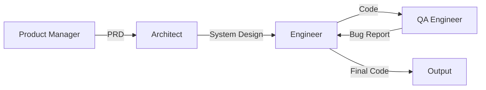

本記事は [arXiv:2308.00352](https://arxiv.org/abs/2308.00352) の解説記事です。

## 論文概要（Abstract）

Hong et al.（2023）は、ソフトウェア開発ワークフロー（PM → アーキテクト → エンジニア → QA）をLLMエージェントのロールに直接写像し、各エージェント間の通信に**型付きI/Oスキーマ**（PRD・設計書・コード等の構造化ドキュメント）を導入することで、ハルシネーション伝播を抑制するマルチエージェントフレームワーク「MetaGPT」を提案した。著者らの実験では、HumanEvalベンチマークで85.9%のPass@1を達成し、単一GPT-4エージェントを上回る性能を報告している。GitHubリポジトリ（geekan/MetaGPT）としてMITライセンスで公開されている。

この記事は [Zenn記事: マルチエージェントシステムの進化：古典的MASからLLMベースMASへの技術比較](https://zenn.dev/0h_n0/articles/3848dd01781b58) の深掘りです。

## 情報源

- **arXiv ID**: 2308.00352
- **URL**: [https://arxiv.org/abs/2308.00352](https://arxiv.org/abs/2308.00352)
- **著者**: Hong et al.
- **発表年**: 2023
- **分野**: cs.AI, cs.SE, cs.MA
- **コード**: [https://github.com/geekan/MetaGPT](https://github.com/geekan/MetaGPT)（MIT License）

## 背景と動機（Background & Motivation）

2023年前半、ChatDevやCAMELなどのLLMマルチエージェントフレームワークが登場し、ソフトウェア自動生成の可能性が示された。しかし、これらのシステムには重大な課題があった：エージェント間の通信が自然言語のフリーテキストに依存しており、あるエージェントのハルシネーション（事実に反する生成）が後続エージェントに伝播し、最終成果物の品質が大幅に低下する現象が観察されていた。

著者らはこの問題の根本原因を「通信プロトコルの不在」と特定した。人間のソフトウェア開発チームでは、PRD（製品要件定義書）、UML図、API仕様書といった**標準化されたドキュメント形式**がチームメンバー間の情報伝達の質を保証している。MetaGPTはこの知見をLLMマルチエージェントに移植し、各エージェント間の通信に構造化されたスキーマを強制する設計を採用した。

## 主要な貢献（Key Contributions）

- **貢献1**: ソフトウェア開発のStandardized Operating Procedures（SOP）をマルチエージェントワークフローにエンコードし、各ロールの入出力を型付きスキーマで定義する手法を提案
- **貢献2**: 「実行可能なフィードバック」メカニズムにより、生成されたコードの実行結果をエージェントにフィードバックし、自己修正を促進
- **貢献3**: HumanEvalで85.9%のPass@1を達成し、ChatDevの単一エージェント構成を上回る性能を報告

## 技術的詳細（Technical Details）

### SOPエンコーディングによるロール定義

MetaGPTのコアアイデアは、ソフトウェア開発のSOPを以下の5ロールに分解することである。



各ロールの入出力は以下のように型定義される：

| ロール | 入力スキーマ | 出力スキーマ |
|--------|-----------|-----------|
| Product Manager | ユーザー要件（自然言語） | PRD（JSON: goals, user_stories, requirements） |
| Architect | PRD（JSON） | システム設計書（JSON: architecture, api_spec, data_model） |
| Engineer | システム設計書（JSON） | コードファイル群（Python/TypeScript） |
| QA Engineer | コードファイル群 | テストコード + バグレポート（JSON: test_results, bugs） |

### 型付きI/Oスキーマの設計

著者らが提案する型付きスキーマは、各エージェント間の通信を構造化し、情報損失を防ぐ。

```python
from pydantic import BaseModel, Field

class PRD(BaseModel):
    """Product Requirements Document — PMロールの出力スキーマ"""
    project_name: str
    goals: list[str] = Field(description="プロジェクトの目標（3-5項目）")
    user_stories: list[str] = Field(description="ユーザーストーリー")
    requirements: list[str] = Field(description="機能要件")
    non_functional_requirements: list[str] = Field(description="非機能要件")
    constraints: list[str] = Field(default_factory=list)

class SystemDesign(BaseModel):
    """System Design Document — Architectロールの出力スキーマ"""
    architecture: str = Field(description="アーキテクチャ概要")
    modules: list[dict[str, str]] = Field(description="モジュール一覧")
    api_spec: list[dict[str, str]] = Field(description="API仕様")
    data_model: list[dict[str, str]] = Field(description="データモデル")
    tech_stack: list[str] = Field(description="技術スタック")

class BugReport(BaseModel):
    """Bug Report — QAロールの出力スキーマ"""
    test_file: str
    test_results: list[dict[str, str]]
    bugs: list[dict[str, str]] = Field(description="発見されたバグ")
    suggestions: list[str] = Field(description="修正提案")
```

この型定義により、PMが出力するPRDは必ず`goals`、`user_stories`、`requirements`フィールドを含む。Architectは構造化されたPRDを入力として受け取るため、自然言語のフリーテキストから要件を推測する必要がなく、ハルシネーションのリスクが低減される。

### 実行可能フィードバックメカニズム

MetaGPTのもう一つの重要な設計要素は、生成されたコードを実際に実行し、その結果をエンジニアエージェントにフィードバックするループである。

$$
\text{Code}_{t+1} = f_{\text{LLM}}(\text{Code}_t, \text{Error}_t, \text{SystemDesign})
$$

ここで、$\text{Code}_t$ は $t$ 回目の生成コード、$\text{Error}_t$ は実行エラーメッセージ、$f_{\text{LLM}}$ はLLMによるコード修正関数である。著者らは最大3回のリトライで大半のエラーが解消されると報告している。

```python
import subprocess
from dataclasses import dataclass

@dataclass
class ExecutionResult:
    success: bool
    stdout: str
    stderr: str
    return_code: int

def execute_and_feedback(
    code: str,
    test_code: str,
    max_retries: int = 3,
) -> tuple[str, ExecutionResult]:
    """コードを実行し、エラーがあればLLMにフィードバックして修正"""
    current_code = code

    for attempt in range(max_retries):
        result = _run_code(current_code, test_code)
        if result.success:
            return current_code, result

        feedback_prompt = (
            f"以下のコードを実行したところエラーが発生しました。\n"
            f"コード:\n```python\n{current_code}\n```\n"
            f"エラー:\n```\n{result.stderr}\n```\n"
            f"エラーを修正してください。"
        )
        current_code = _call_llm(feedback_prompt)

    return current_code, result

def _run_code(code: str, test_code: str) -> ExecutionResult:
    """サンドボックス内でコードを実行"""
    combined = f"{code}\n\n{test_code}"
    proc = subprocess.run(
        ["python", "-c", combined],
        capture_output=True,
        text=True,
        timeout=30,
    )
    return ExecutionResult(
        success=proc.returncode == 0,
        stdout=proc.stdout,
        stderr=proc.stderr,
        return_code=proc.returncode,
    )

def _call_llm(prompt: str) -> str:
    """LLM APIを呼び出してコード修正を取得（実装省略）"""
    ...
```

### 共有メッセージプールとパブリッシュ/サブスクライブ

MetaGPTはエージェント間の通信に**共有メッセージプール**を採用している。各エージェントは自分のロールに関連するメッセージのみをサブスクライブする。これにより、エージェント数 $n$ に対する通信コストが $O(n^2)$（完全メッシュ）から $O(n)$（パブリッシュ/サブスクライブ）に削減される。

## 実装のポイント（Implementation）

MetaGPTを実際に利用する際の注意点：

- **LLMバックエンド**: OpenAI APIまたはローカルLLM（vLLM等）に対応。複雑なアーキテクチャ設計にはGPT-4クラス以上のモデルが推奨される
- **型付きスキーマの拡張**: Pydanticモデルをカスタマイズすることで、ドメイン固有のワークフローに対応可能
- **コスト管理**: 1プロジェクトあたりのトークン消費量はGPT-4使用時で約$2〜$5。エンジニア→QA→エンジニアのフィードバックループが主なコスト要因
- **エラーハンドリング**: 実行可能フィードバックのタイムアウト設定（デフォルト30秒）と最大リトライ回数の調整が重要

## Production Deployment Guide

### AWS実装パターン（コスト最適化重視）

MetaGPTベースのマルチエージェントシステムをAWSにデプロイする際のトラフィック量別推奨構成：

| 規模 | 月間リクエスト | 推奨構成 | 月額コスト | 主要サービス |
|------|--------------|---------|-----------|------------|
| **Small** | ~3,000 (100/日) | Serverless | $80-200 | Lambda + Bedrock + DynamoDB |
| **Medium** | ~30,000 (1,000/日) | Hybrid | $500-1,200 | ECS Fargate + Bedrock + ElastiCache |
| **Large** | 300,000+ (10,000/日) | Container | $3,000-8,000 | EKS + Karpenter + EC2 Spot |

**Small構成の詳細**（月額$80-200）:
- **Lambda**: 2GB RAM, 120秒タイムアウト（$30/月）— MetaGPTの各ロールを個別Lambda関数として実装
- **Bedrock**: Claude 3.5 Haiku（PM/QAロール）+ Claude 3.5 Sonnet（Architect/Engineerロール）、Prompt Caching有効（$100/月）
- **DynamoDB**: On-Demand、PRD/設計書/コードの中間成果物を保存（$10/月）
- **S3**: 生成コードのアーティファクト保存（$5/月）
- **Step Functions**: ロール間のワークフローオーケストレーション（$15/月）

**コスト削減テクニック**:
- Bedrock Prompt Caching: システムプロンプトの固定部分（ロール定義）をキャッシュし30-90%削減
- モデル混合: PM/QAにHaiku（$0.25/MTok）、Architect/EngineerにSonnet（$3/MTok）を使い分けることで約40%削減
- Step Functions Express: 短時間ワークフロー向け（Standard比で最大90%安価）

**コスト試算の注意事項**: 上記は2026年4月時点のAWS ap-northeast-1（東京）リージョン料金に基づく概算値です。実際のコストはトラフィックパターン、モデル選択、コード生成の複雑度により変動します。最新料金は [AWS料金計算ツール](https://calculator.aws/) で確認してください。

### Terraformインフラコード

**Small構成 (Serverless): Lambda + Step Functions + Bedrock**

```hcl
module "vpc" {
  source  = "terraform-aws-modules/vpc/aws"
  version = "~> 5.0"

  name = "metagpt-vpc"
  cidr = "10.0.0.0/16"
  azs  = ["ap-northeast-1a", "ap-northeast-1c"]
  private_subnets = ["10.0.1.0/24", "10.0.2.0/24"]

  enable_nat_gateway   = false
  enable_dns_hostnames = true
}

resource "aws_iam_role" "metagpt_lambda" {
  name = "metagpt-lambda-role"

  assume_role_policy = jsonencode({
    Version = "2012-10-17"
    Statement = [{
      Action    = "sts:AssumeRole"
      Effect    = "Allow"
      Principal = { Service = "lambda.amazonaws.com" }
    }]
  })
}

resource "aws_iam_role_policy" "bedrock_invoke" {
  role = aws_iam_role.metagpt_lambda.id
  policy = jsonencode({
    Version = "2012-10-17"
    Statement = [{
      Effect   = "Allow"
      Action   = ["bedrock:InvokeModel", "bedrock:InvokeModelWithResponseStream"]
      Resource = [
        "arn:aws:bedrock:ap-northeast-1::foundation-model/anthropic.claude-3-5-haiku*",
        "arn:aws:bedrock:ap-northeast-1::foundation-model/anthropic.claude-3-5-sonnet*"
      ]
    }]
  })
}

resource "aws_lambda_function" "pm_agent" {
  filename      = "lambda_pm.zip"
  function_name = "metagpt-pm-agent"
  role          = aws_iam_role.metagpt_lambda.arn
  handler       = "handler.pm_handler"
  runtime       = "python3.12"
  timeout       = 120
  memory_size   = 2048
  environment {
    variables = {
      BEDROCK_MODEL_ID = "anthropic.claude-3-5-haiku-20241022-v1:0"
      DYNAMODB_TABLE   = aws_dynamodb_table.artifacts.name
    }
  }
}

resource "aws_lambda_function" "engineer_agent" {
  filename      = "lambda_engineer.zip"
  function_name = "metagpt-engineer-agent"
  role          = aws_iam_role.metagpt_lambda.arn
  handler       = "handler.engineer_handler"
  runtime       = "python3.12"
  timeout       = 120
  memory_size   = 2048
  environment {
    variables = {
      BEDROCK_MODEL_ID = "anthropic.claude-3-5-sonnet-20241022-v2:0"
      DYNAMODB_TABLE   = aws_dynamodb_table.artifacts.name
    }
  }
}

resource "aws_dynamodb_table" "artifacts" {
  name         = "metagpt-artifacts"
  billing_mode = "PAY_PER_REQUEST"
  hash_key     = "project_id"
  range_key    = "artifact_type"
  attribute {
    name = "project_id"
    type = "S"
  }
  attribute {
    name = "artifact_type"
    type = "S"
  }
  ttl {
    attribute_name = "expire_at"
    enabled        = true
  }
}
```

### セキュリティベストプラクティス

- **IAMロール**: 各Lambda関数に最小権限のBedrock InvokeModel権限のみ付与
- **コード実行のサンドボックス**: 生成コードの実行はコンテナ内で分離（Lambda Layer + /tmp制約）
- **シークレット管理**: APIキーはSecrets Managerに保存、環境変数ハードコード禁止
- **データ暗号化**: DynamoDBはKMS暗号化、S3はSSE-S3暗号化を有効化

### 運用・監視設定

```python
import boto3

cloudwatch = boto3.client('cloudwatch')

cloudwatch.put_metric_alarm(
    AlarmName='metagpt-token-usage-spike',
    ComparisonOperator='GreaterThanThreshold',
    EvaluationPeriods=1,
    MetricName='TokenUsage',
    Namespace='MetaGPT/Bedrock',
    Period=3600,
    Statistic='Sum',
    Threshold=200000,
    AlarmDescription='MetaGPT Bedrockトークン使用量異常（1時間あたり20万トークン超過）',
    ActionsEnabled=True,
    AlarmActions=['arn:aws:sns:ap-northeast-1:123456789:cost-alerts'],
)
```

### コスト最適化チェックリスト

- [ ] ~100 req/日 → Lambda + Step Functions + Bedrock（$80-200/月）
- [ ] ~1000 req/日 → ECS Fargate + Bedrock（$500-1,200/月）
- [ ] Bedrock Prompt Caching有効化（ロール定義のシステムプロンプト固定部分）
- [ ] モデル混合: PM/QAにHaiku、Architect/EngineerにSonnet
- [ ] Step Functions Express（短時間ワークフロー向け）
- [ ] DynamoDB On-Demand（低トラフィック時に最適）
- [ ] Lambda Provisioned Concurrencyは不使用（コスト削減）
- [ ] S3 Intelligent-Tiering（アーティファクトの自動階層化）
- [ ] CloudWatch Logs保持期間を30日に設定
- [ ] AWS Budgets: 月額予算$250で80%アラート設定

## 実験結果（Results）

### ベンチマーク性能

著者らが報告する主要ベンチマーク結果（論文Table 2より）：

| 手法 | HumanEval Pass@1 | MBPP Pass@1 |
|------|-----------------|-------------|
| GPT-4 (単一エージェント) | 67.0% | — |
| ChatDev (マルチエージェント) | 61.8% | — |
| MetaGPT | **85.9%** | **87.7%** |

著者らは、型付きI/Oスキーマの導入により、エージェント間の情報伝達の質が向上し、特にアーキテクチャ設計→コード生成の段階でのハルシネーション伝播が抑制されたことが性能向上の主因であると分析している。

### コスト比較

著者らの報告によると、MetaGPTの1プロジェクトあたりの平均コスト（GPT-4 API使用時）は約$2.0であり、ChatDevの$3.2と比較して約37%の削減を達成している。これは型付きスキーマにより不要な対話ラウンドが削減された効果であると著者らは分析している。

## 実運用への応用（Practical Applications）

MetaGPTのアーキテクチャは、ソフトウェア開発以外のドメインにも応用可能である。

- **レポート生成**: リサーチャー → アナリスト → ライター → エディターのワークフローで、各段階の出力を型定義
- **データパイプライン**: データ収集エージェント → 前処理エージェント → 分析エージェント → 可視化エージェントの直列構成
- **カスタマーサポート**: トリアージエージェント → 専門回答エージェント → 品質検証エージェントの3段階構成

ただし、著者らが指摘するように、ロールとワークフローが事前に固定されるため、動的にタスクが変化するユースケース（リアルタイム交渉、オープンエンドな探索など）には不向きである。動的ロール割当が必要な場合はAgentVerseやAutoGenの採用が推奨される。

## 関連研究（Related Work）

- **ChatDev (Qian et al., 2023)**: ソフトウェア開発向けマルチエージェント。自然言語ベースの通信を採用しており、MetaGPTの型付きスキーマとは対照的なアプローチ
- **CAMEL (Li et al., 2023)**: ロールプレイによるエージェント間対話フレームワーク。役割の自動割当に焦点を当てており、ワークフローの構造化よりも対話の多様性を重視
- **AutoGen (Wu et al., 2023)**: GroupChatベースの汎用マルチエージェント。MetaGPTがレイヤー型の構造化ワークフローを採用するのに対し、AutoGenはメッシュ型の自由度の高い対話を許容する

## まとめと今後の展望

MetaGPTは「型付きI/Oスキーマによるハルシネーション伝播の抑制」という実務的に重要な貢献を行った論文である。著者らが示した設計原則 — SOPのエンコーディング、構造化された中間成果物、実行可能フィードバック — は、2026年現在のLangGraphやCrewAIにおける設計パターンにも影響を与えている。

今後の課題として、動的なロール再割当（タスクの進行に応じてロール構成を変更）、マルチリポジトリ対応（複数のコードベースにまたがるプロジェクト）、長期的なコンテキスト管理（大規模プロジェクトでのコンテキストウィンドウ制約への対応）が挙げられる。

## 参考文献

- **arXiv**: [https://arxiv.org/abs/2308.00352](https://arxiv.org/abs/2308.00352)
- **Code**: [https://github.com/geekan/MetaGPT](https://github.com/geekan/MetaGPT)（MIT License）
- **Related Zenn article**: [https://zenn.dev/0h_n0/articles/3848dd01781b58](https://zenn.dev/0h_n0/articles/3848dd01781b58)
- **ChatDev (Qian et al., 2023)**: [https://arxiv.org/abs/2307.07924](https://arxiv.org/abs/2307.07924)
