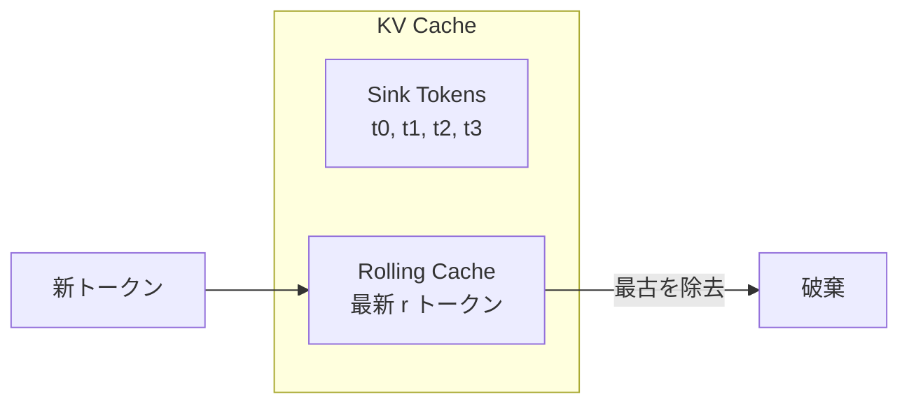

## 論文概要

本記事は [Efficient Streaming Language Models with Attention Sinks](https://arxiv.org/abs/2309.17453) (Xiao et al., ICLR 2024) の解説記事です。
この記事は [Zenn記事: Neural Garbage Collection―LLMが自ら忘却を学ぶKVキャッシュ管理](https://zenn.dev/0h_n0/articles/a571af34a7694f) の深掘りです。

LLMをストリーミング用途にデプロイする際、KVキャッシュが無限に膨張する問題がある。本論文では、LLMが意味的重要性に関係なく最初の数トークンに過剰なattention weightを割り当てる「Attention Sink」現象を発見した。この知見に基づき、先頭のsink tokens（4トークン）とsliding windowを組み合わせることで、KVキャッシュを一定サイズに保ちながら400万トークン以上の無限長推論を追加学習なしで実現するStreamingLLMフレームワークを提案している。

## 情報源

| 項目 | 内容 |
|------|------|
| arXiv ID | [2309.17453](https://arxiv.org/abs/2309.17453) |
| 著者 | Guangxuan Xiao, Yuandong Tian, Beidi Chen, Song Han, Mike Lewis (MIT, Meta) |
| 発表年 | 2023（ICLR 2024 採択） |
| 分野 | cs.CL, cs.LG |
| GitHub | [mit-han-lab/streaming-llm](https://github.com/mit-han-lab/streaming-llm) |

## 背景と動機

LLMのデプロイにおいて、チャットボットやリアルタイム文書解析などのストリーミング用途では、入力シーケンスが事前学習時のコンテキスト長を超える場面が頻繁に発生する。この際、KVキャッシュのメモリ使用量が線形に増大し、デコーディング速度も低下するという本質的な問題がある。

従来のアプローチには以下の課題があった。

- **Dense Attention**: 全トークンのKVを保持するため、$$O(T^2)$$の計算量とメモリが必要。シーケンス長が事前学習長を超えるとperplexityが急激に悪化し、OOMエラーも発生する
- **Window Attention**: 直近のトークンのみを保持するが、先頭トークンがキャッシュから除去された瞬間にperplexityが破綻的に悪化する（Llama-2-13Bで5,158.07まで上昇）
- **Sliding Window with Re-computation**: 各トークン生成時にウィンドウ内の全KV状態を再計算するため$$O(T \cdot L^2)$$の計算量が必要で、実用上は最大22.2倍遅い

著者らは、Window Attentionの破綻原因を調査する中でAttention Sink現象を発見し、わずか4トークンの保持で問題を解決できることを示した。

## 主要な貢献

1. **Attention Sink現象の発見**: LLMが意味的重要性と無関係に先頭トークンへ過剰なattentionを割り当てる現象を特定し、これがSoftMaxの正規化制約に起因することを示した
2. **StreamingLLMフレームワーク**: sink tokens + rolling cacheの二部構成KVキャッシュにより、追加学習なしで400万トークン以上の安定した推論を実現
3. **位置埋め込みの適切な処理**: キャッシュ内の相対位置に基づくRoPE/ALiBiの再割り当て手法を提案
4. **学習可能なsink token**: 事前学習時にプレースホルダトークンを1つ追加するだけで、ストリーミング性能がさらに向上することを示した
5. **広範な検証**: Llama-2、MPT、Falcon、Pythiaの4ファミリ10モデルで有効性を確認

## 技術的詳細

### Attention Sink現象のメカニズム

標準的なSoftMax関数は、attention scoreの総和を1に正規化する。

$$\text{SoftMax}(x)_i = \frac{e^{x_i}}{\sum_{j=1}^{N} e^{x_j}}$$

ここで$$x_i$$はquery $$q$$とkey $$k_i$$の内積（attention logit）、$$N$$はシーケンス長である。Transformerの自己回帰モデルでは、先頭トークンは後続の全トークンから参照可能である。モデルがあるトークンに対して「どこにも強くattendする必要がない」場合でも、SoftMaxの制約上どこかに重みを割り当てる必要がある。このとき、全トークンから可視な先頭トークンが「余剰attention」の受け皿（sink）として機能する。

著者らはこの仮説を検証するために、先頭4トークンを改行文字（`\n`）に置換する実験を行った。その結果、意味的に無意味な改行文字でもperplexityは5.60と安定しており（元の先頭トークンでは5.40）、先頭トークンの**内容**ではなく**位置**が重要であることが確認された（論文Table 1より）。

代替アプローチとして、SoftMax関数の分母に定数1を加える$$\text{SoftMax}_1$$も検討されている。

$$\text{SoftMax}_1(x)_i = \frac{e^{x_i}}{1 + \sum_{j=1}^{N} e^{x_j}}$$

これにより「どこにもattendしない」という選択肢が生まれるが、既存モデルの再学習が必要であり、完全にはsink依存を排除できないと報告されている。

### StreamingLLMのKVキャッシュ構造

StreamingLLMのKVキャッシュは以下の二部構成をとる。

$$\text{Cache} = \underbrace{[t_0, t_1, \ldots, t_{s-1}]}_{\text{Sink Tokens}} \oplus \underbrace{[t_{T-r}, t_{T-r+1}, \ldots, t_{T-1}]}_{\text{Rolling Cache}}$$

ここで$$s$$はsinkトークン数（デフォルト4）、$$r$$はrolling cacheサイズ、$$T$$は現在のシーケンス位置である。キャッシュの総サイズは$$s + r$$で一定に保たれる。



### 位置埋め込み（RoPE）のズレ問題と対処

RoPE（Rotary Position Embedding）では、位置情報がkey/queryに回転行列として埋め込まれる。StreamingLLMでは、テキスト中の元の位置ではなく、キャッシュ内の連続した位置を割り当てる。

具体例として、キャッシュに`[t0, t1, t2, t3, t6, t7, t8]`が格納され、`t9`をデコードする場合を考える。

- **正しい割り当て（StreamingLLM）**: 位置 `[0, 1, 2, 3, 4, 5, 6, 7]`
- **誤った割り当て（元の位置）**: 位置 `[0, 1, 2, 3, 6, 7, 8, 9]`

元の位置をそのまま使うと位置4, 5が欠落し、RoPEの相対距離計算に不整合が生じてperplexityが悪化する。実装上は、RoPE変換を適用する**前**のkey表現をキャッシュに格納し、デコード時にキャッシュ内位置に基づいてRoPE変換を適用する。ALiBiの場合はより単純で、ジャンプのない連続的な線形バイアスに置き換えるだけでよい。

## 実装のポイント

以下は、StreamingLLMのKVキャッシュ管理ロジックの核心部分を示す実装例である。

```python
from dataclasses import dataclass, field
import torch


@dataclass
class StreamingKVCache:
    """StreamingLLMのKVキャッシュ管理クラス.

    sink tokens（先頭の固定トークン）と rolling cache（直近トークン）の
    二部構成でKVキャッシュを一定サイズに維持する。

    Attributes:
        num_sink_tokens: sink として保持する先頭トークン数（推奨値: 4）
        rolling_cache_size: rolling cache のサイズ（推奨値: 1020）
        key_cache: レイヤーごとの key キャッシュ [num_layers, seq_len, head_dim]
        value_cache: レイヤーごとの value キャッシュ [num_layers, seq_len, head_dim]
    """

    num_sink_tokens: int = 4
    rolling_cache_size: int = 1020
    key_cache: list[torch.Tensor] = field(default_factory=list)
    value_cache: list[torch.Tensor] = field(default_factory=list)

    @property
    def max_cache_size(self) -> int:
        """キャッシュの最大サイズ."""
        return self.num_sink_tokens + self.rolling_cache_size

    def update(
        self, layer_idx: int, new_keys: torch.Tensor, new_values: torch.Tensor,
    ) -> tuple[torch.Tensor, torch.Tensor]:
        """新しいKVペアでキャッシュを更新し、上限超過時にsink+recentに圧縮する.

        Args:
            layer_idx: Transformerレイヤーのインデックス
            new_keys: 新しい key テンソル [batch, num_heads, seq_len, head_dim]
            new_values: 新しい value テンソル [batch, num_heads, seq_len, head_dim]

        Returns:
            更新後の (keys, values) タプル
        """
        if layer_idx >= len(self.key_cache):
            self.key_cache.append(new_keys)
            self.value_cache.append(new_values)
        else:
            self.key_cache[layer_idx] = torch.cat([self.key_cache[layer_idx], new_keys], dim=2)
            self.value_cache[layer_idx] = torch.cat([self.value_cache[layer_idx], new_values], dim=2)

        if self.key_cache[layer_idx].shape[2] > self.max_cache_size:
            s, r = self.num_sink_tokens, self.rolling_cache_size
            for cache in [self.key_cache, self.value_cache]:
                cache[layer_idx] = torch.cat([cache[layer_idx][:, :, :s, :],
                                               cache[layer_idx][:, :, -r:, :]], dim=2)

        return self.key_cache[layer_idx], self.value_cache[layer_idx]
```

**推奨ハイパーパラメータ**:
- `num_sink_tokens`: 4（論文Table 2より、1-2では不十分、8以上は収穫逓減）
- `rolling_cache_size`: 用途に応じて508-4092（合計キャッシュサイズ512-4096）
- RoPEのキャッシュ戦略: 回転変換**前**のkey表現を格納し、デコード時に位置を再割り当て

## Production Deployment Guide

StreamingLLMはKVキャッシュサイズが固定のため、メモリ管理とコスト予測が容易である。以下にAWSでのデプロイパターンを示す。

### 1. AWS実装パターン

| 規模 | 月間リクエスト | 推奨構成 | 月額コスト | 主要サービス |
|------|--------------|---------|-----------|------------|
| Small | ~3,000 (100/日) | Serverless | $50-150 | Lambda + Bedrock + DynamoDB |
| Medium | ~30,000 (1,000/日) | Hybrid | $300-800 | Lambda + ECS Fargate + ElastiCache |
| Large | 300,000+ (10,000/日) | Container | $2,000-5,000 | EKS + Karpenter + EC2 Spot |

> コスト注意事項: 以下は2026年4月時点のap-northeast-1（東京リージョン）概算です。

StreamingLLMはKVキャッシュサイズが固定のため、GPU メモリ消費量を事前に正確に見積もれる点がデプロイ上の大きな利点である。Small構成ではLambda+Bedrock+DynamoDBで$50-150/月、Large構成ではEKS+g5.xlarge Spot+Karpenterで$2,000-5,000/月が目安となる。コスト削減にはSpot Instances（最大90%削減）、RI（最大72%）、Prompt Caching（30-90%）が有効である。

### 2. Terraformインフラコード

**Small構成（Serverless）** -- Lambda + DynamoDB + CloudWatch:

```hcl
terraform {
  required_version = ">= 1.9"
  required_providers {
    aws = { source = "hashicorp/aws", version = "~> 5.80" }
  }
}
provider "aws" { region = "ap-northeast-1" }

resource "aws_iam_role" "lambda" {
  name = "streaming-llm-lambda-role"
  assume_role_policy = jsonencode({
    Version = "2012-10-17"
    Statement = [{ Action = "sts:AssumeRole", Effect = "Allow",
                    Principal = { Service = "lambda.amazonaws.com" } }]
  })
}

resource "aws_lambda_function" "inference" {
  function_name = "streaming-llm-inference"
  runtime = "python3.12"
  handler = "handler.lambda_handler"
  role    = aws_iam_role.lambda.arn
  timeout = 30
  memory_size = 512
  filename = "lambda_package.zip"
  environment {
    variables = { SINK_TOKENS = "4", ROLLING_CACHE = "1020" }
  }
}

resource "aws_dynamodb_table" "cache" {
  name = "streaming-llm-cache"
  billing_mode = "PAY_PER_REQUEST"
  hash_key = "session_id"
  range_key = "timestamp"
  attribute { name = "session_id"; type = "S" }
  attribute { name = "timestamp"; type = "N" }
  ttl { attribute_name = "expires_at"; enabled = true }
}
```

**Large構成（Container）** -- EKS + Karpenter（GPU Spot優先）+ Budgets:

```hcl
module "eks" {
  source  = "terraform-aws-modules/eks/aws"
  version = "~> 20.31"
  cluster_name = "streaming-llm"
  cluster_version = "1.31"
  vpc_id     = module.vpc.vpc_id
  subnet_ids = module.vpc.private_subnets
  cluster_addons = { karpenter = { most_recent = true } }
}

resource "kubectl_manifest" "gpu_nodepool" {
  yaml_body = yamlencode({
    apiVersion = "karpenter.sh/v1", kind = "NodePool"
    metadata = { name = "gpu-streaming" }
    spec = {
      template = { spec = { requirements = [
        { key = "karpenter.sh/capacity-type", operator = "In", values = ["spot","on-demand"] },
        { key = "node.kubernetes.io/instance-type", operator = "In", values = ["g5.xlarge","g5.2xlarge"] }
      ]}}
      limits = { cpu = "64", memory = "256Gi" }
    }
  })
}
```

### 3. セキュリティベストプラクティス

| 領域 | 対策 |
|------|------|
| ネットワーク | VPCエンドポイント経由でDynamoDB/Bedrock接続、ALBのみパブリック、SG 443のみ |
| 認証 | API Gateway + Cognito、IAMロールベースのサービス間認証 |
| シークレット | Secrets Manager格納（自動ローテーション）、環境変数に直接設定しない |
| 監査 | CloudTrail全リージョン、Config Rules、GuardDuty |
| データ保護 | DynamoDB暗号化（CMK）、S3パブリックアクセスブロック、KVキャッシュTTL自動削除 |

### 4. 運用・監視設定

**CloudWatch Logs Insights クエリ**:

```
# 高レイテンシリクエスト検知
fields @timestamp, @message
| filter duration_ms > 5000
| stats count() as slow_requests by bin(30m)

# KVキャッシュ使用率
fields @timestamp, cache_size, cache_hit_rate
| filter event = "kv_cache_update"
| stats avg(cache_hit_rate) as avg_hit_rate, max(cache_size) as max_cache by bin(1h)
```

**CloudWatchアラーム + X-Ray（Python boto3）**:

```python
import boto3
from aws_xray_sdk.core import xray_recorder, patch_all


def create_streaming_llm_alarms(function_name: str, sns_topic_arn: str) -> None:
    """StreamingLLM推論サービスのP95レイテンシ・エラー率アラームを作成する.

    Args:
        function_name: Lambda関数名
        sns_topic_arn: 通知先SNSトピックのARN
    """
    cw = boto3.client("cloudwatch", region_name="ap-northeast-1")
    for name, metric, stat, threshold in [
        ("latency-p95", "Duration", "p95", 10000),
        ("error-rate", "Errors", "Sum", 10),
    ]:
        cw.put_metric_alarm(
            AlarmName=f"{function_name}-{name}",
            MetricName=metric, Namespace="AWS/Lambda",
            Statistic=stat, Period=300, EvaluationPeriods=2,
            Threshold=threshold, ComparisonOperator="GreaterThanThreshold",
            Dimensions=[{"Name": "FunctionName", "Value": function_name}],
            AlarmActions=[sns_topic_arn],
        )


def configure_xray_tracing(service_name: str = "streaming-llm") -> None:
    """AWS X-Rayトレーシングを設定する.

    Args:
        service_name: X-Rayのサービス名
    """
    xray_recorder.configure(service=service_name, sampling=True, context_missing="LOG_ERROR")
    patch_all()
```

### 5. コスト最適化チェックリスト

| カテゴリ | チェック項目 |
|---------|------------|
| アーキテクチャ | リクエスト規模に応じた構成選択 / キャッシュサイズ最小化 / GPU Spot優先 / NAT Gateway回避 / Batch API検討 |
| リソース | Lambda Power Tuning / DynamoDB On-Demand or Auto Scaling / Logs保持30日 |
| LLMコスト | Prompt Caching有効化（30-90%削減） / sink=4固定 / rolling cache最小化 / Batch API |
| 監視 | CloudWatchアラーム / X-Ray / Cost Explorer日次レポート / Budgets 80%通知 |
| 管理 | Terraform IaC / タグ規則徹底 / 未使用リソース月次棚卸し / RI/SP四半期見直し |

## 実験結果

### 長文テキストにおけるPerplexity

著者らはPG-19テストセット（100冊の書籍）を用いて最大400万トークンの連続テキストでperplexityを評価した。主要な結果を以下に示す（論文Figure 3, Table 1より）。

| モデル | 手法 | キャッシュサイズ | Perplexity |
|--------|------|----------------|------------|
| Llama-2-13B | Window Attention (0+1024) | 1024 | 5,158.07 |
| Llama-2-13B | StreamingLLM (4+1020) | 1024 | 5.40 |
| Llama-2-13B | StreamingLLM (改行sink, 4+1020) | 1024 | 5.60 |

sink tokensを4つ保持するだけでperplexityが3桁改善されるという結果は、Window Attentionの破綻がAttention Sink現象に起因することを強く示唆している。

### sinkトークン数のアブレーション

論文Table 2より、sinkトークン数による影響を示す。

| sinkトークン数 | Llama-2-7B PPL | Falcon-7B PPL |
|---------------|----------------|----------------|
| 0 | 発散 | 発散 |
| 1 | 9.58 | 12.12 |
| 2 | 9.37 | 9.07 |
| 4 | 9.32 | 8.65 |
| 8 | 9.33 | 8.64 |

4トークンで十分な回復が得られ、8以上では改善が微小であることが確認されている。

### キャッシュサイズの反直感的な結果

論文Table 6より、キャッシュサイズを大きくしてもperplexityが単調に改善しないという興味深い結果が報告されている（Llama-2-7B: 4+508で9.73、4+1020で9.32、4+4092で9.59）。著者らはこれについて、モデルが利用可能なコンテキストを十分に活用していない可能性を指摘している。

### 速度性能

Sliding Window with Re-computationと比較して、StreamingLLMは最大**22.2倍**のデコーディング速度向上を達成した。これはRe-computationが各トークン生成時に$$O(L^2)$$の計算を必要とするのに対し、StreamingLLMは$$O(1)$$のキャッシュ管理操作で済むためである。

## 実運用への応用

### Zenn記事（NGC）との関連

本論文のStreamingLLMは、[NGC（Neural Garbage Collection）](https://zenn.dev/0h_n0/articles/a571af34a7694f)が直接比較対象としている手法である。StreamingLLMの限界は明確で、rolling cacheの範囲外にある情報には一切アクセスできない。つまり、長い推論チェーンの途中ステップがキャッシュから除去された場合、その情報は永久に失われる。

NGCはこの限界を克服するため、強化学習によってKVキャッシュの除去判断を学習するアプローチをとる。StreamingLLMの「固定的なsink + sliding window」に対し、NGCはGumbel-Top-kサンプリングでタスクに応じた動的な除去を実現する。Countdown課題でNGCが49.6%の精度を達成したのに対し、SnapKV（StreamingLLMと同様の固定ポリシー系）は21.2%にとどまったと報告されている。

### プロダクション視点での使い分け

StreamingLLMは以下のユースケースに適している。
- **チャットボット**: 直近の会話履歴のみで応答可能な対話システム
- **リアルタイムテキスト処理**: ニュースフィード、ログ解析など、最新の情報のみが重要な用途
- **エッジデバイス**: メモリ制約の厳しい環境での推論

一方、文書全体の要約、長文QA、複数ステップの推論チェーンなど、長距離依存が重要なタスクにはStreamingLLMは不向きであり、NGCのような動的キャッシュ管理手法が必要となる。

## 関連研究

- **H2O (Heavy-Hitter Oracle)** (Zhang et al., 2023): attention weightが高いトークンを動的に選択してKVキャッシュに保持する手法。StreamingLLMのように先頭トークンに固定するのではなく、重要度ベースの選択を行うが、選択の計算オーバーヘッドが発生する
- **SnapKV** (Li et al., 2024): attention patternを分析し、重要なKVペアを選択的に保持する手法。StreamingLLMと同様の固定ポリシー系であり、NGC論文ではStreamingLLMと共に比較対象とされている
- **NGC (Neural Garbage Collection)** (arXiv:2604.18002): 本記事の関連Zenn記事で解説。強化学習による動的KVキャッシュ管理で、StreamingLLMの「固定的な除去ポリシー」の限界を克服することを目指す
- **Vision Transformerのレジスタトークン** (Darcet et al., 2023): ViTでも類似のsink現象が確認されており、学習可能なレジスタトークンの追加が提案されている。StreamingLLMのsink token概念とモダリティを超えた共通性がある

## まとめと今後の展望

StreamingLLMは、Attention Sink現象という本質的な発見に基づき、わずか4トークンの追加保持でLLMの無限長ストリーミング推論を実現した。追加学習不要、実装が単純、速度向上が顕著（最大22.2倍）という実用的な利点が大きい。

一方で、キャッシュ外の情報を完全に失うという根本的な制約があり、長距離依存が必要なタスクには適用できない。この制約はNGCのような動的キャッシュ管理手法の研究動機となっており、「何を忘れ、何を覚えるか」をタスクに応じて学習する方向に研究が進んでいる。今後は、StreamingLLMの効率性とNGCの柔軟性を組み合わせたハイブリッドアプローチの登場が期待される。

## 参考文献

- Xiao, G., Tian, Y., Chen, B., Han, S., & Lewis, M. (2024). Efficient Streaming Language Models with Attention Sinks. ICLR 2024. [https://arxiv.org/abs/2309.17453](https://arxiv.org/abs/2309.17453)
- GitHub: [https://github.com/mit-han-lab/streaming-llm](https://github.com/mit-han-lab/streaming-llm)
- 関連Zenn記事: [Neural Garbage Collection―LLMが自ら忘却を学ぶKVキャッシュ管理](https://zenn.dev/0h_n0/articles/a571af34a7694f)

:::message
この記事はAI（Claude Code）により自動生成されました。内容の正確性については原論文もご確認ください。
:::
