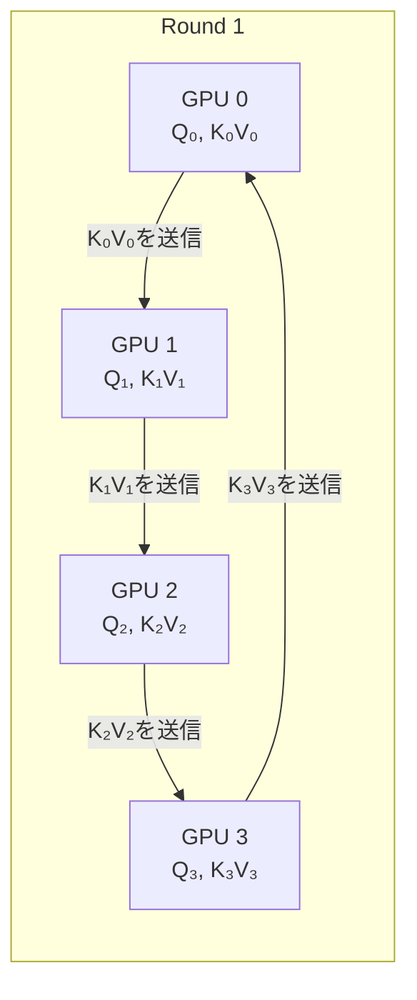

> **本記事は [Ring Attention with Blockwise Transformers for Near-Infinite Context (arXiv:2310.01889)](https://arxiv.org/abs/2310.01889) の解説記事です。ICLR 2024 採択論文。**

## 論文概要（Abstract）

Ring Attentionは、UC Berkeleyの研究グループ（Hao Liu, Matei Zaharia, Pieter Abbeel）が提案した、複数GPU間でアテンション計算を分散する手法である。シーケンスをデバイスごとのブロックに分割し、Key-Valueブロックをリング型トポロジーで隣接デバイスに順次転送しながら、ブロック単位でアテンションを計算する。通信と計算をオーバーラップさせることで通信オーバーヘッドをほぼゼロに抑え、デバイス数に比例したシーケンス長の拡張を実現する。著者らは、1億トークン以上のシーケンスを近似なしで処理できることを報告している。

この記事は [Zenn記事: Attention機構の全史 Bahdanauから FlashAttention4・MLAまでの数学と実装](https://zenn.dev/0h_n0/articles/b03b57bf327edf) の深掘りです。

## 情報源

- **会議名**: ICLR 2024（International Conference on Learning Representations）
- **年**: 2024
- **URL**: [https://arxiv.org/abs/2310.01889](https://arxiv.org/abs/2310.01889)
- **著者**: Hao Liu, Matei Zaharia, Pieter Abbeel
- **発表形式**: Conference Paper

## カンファレンス情報

ICLRは機械学習分野の最高峰会議の一つである。Ring Attentionは長コンテキスト処理の基盤技術として広く引用されており、後続研究（Striped Attention、World Model on Million-Length Video等）にも影響を与えている。

## 技術的詳細（Technical Details）

### 長コンテキスト処理のメモリ制約

標準的なSelf-Attentionの計算量は $O(n^2 d)$、メモリ使用量は $O(n^2)$ であり、シーケンス長 $n$ に対して二次的に増大する。FlashAttentionはメモリ使用量を $O(n)$ に削減するが、それでも単一GPUのメモリ（80-192 GB）に収まるシーケンス長には上限がある。

| シーケンス長 | KVキャッシュ（70Bモデル概算） | 必要GPU数（80GB/GPU） |
|-------------|---------------------------|---------------------|
| 128K | ~32 GB | 1 |
| 512K | ~128 GB | 2 |
| 1M | ~256 GB | 4 |
| 100M | ~25,600 GB | 320 |

100万トークン以上のシーケンスを処理するには、複数GPUにまたがる分散アテンション計算が不可避である。

### Ring Attentionのアルゴリズム

Ring Attentionの核心は、ブロックワイズ（Blockwise）アテンション計算とリング型通信の組み合わせである。

**ステップ1: シーケンスの分割**

全シーケンス長 $n$ のQ, K, Vを $P$ 台のデバイスに均等分割する。各デバイス $p$ は以下を保持する。

$$
Q_p = Q[p \cdot B : (p+1) \cdot B], \quad K_p, V_p \text{（同様に分割）}
$$

ここで $B = n / P$ はブロックサイズ。

**ステップ2: リング型通信とブロックワイズ計算**

各デバイスは自身のQブロックを保持したまま、K, Vブロックをリング状に隣接デバイスに転送する。$P$ ラウンドで全K, Vブロックが一巡する。



各ラウンドで、デバイス $p$ は以下を並行実行する。
1. **受信**: 前のデバイスから K, V ブロックを受け取る
2. **計算**: 受け取った K, V ブロックと自身の Q ブロックでブロックワイズアテンションを計算
3. **送信**: 使い終わった K, V ブロックを次のデバイスに送信

**通信と計算のオーバーラップ**: アテンション計算の時間が K, V ブロック転送の時間以上であれば、通信は完全に計算の裏に隠れる。著者らは、ブロックサイズ $B$ が十分大きい場合にこの条件が満たされることを示している。

**ステップ3: オンラインsoftmaxによるブロック間の統合**

ブロック間でsoftmaxの正規化係数を正しく統合するため、FlashAttentionと同様のオンラインsoftmaxアルゴリズムを使用する。

$$
m_j^{(p)} = \max(m_{j-1}^{(p)}, \max(S_j))
$$

$$
O^{(p)} = \text{diag}\left(\frac{l_{j-1}^{(p)}}{l_j^{(p)}}\right) O_{j-1}^{(p)} + \frac{\exp(S_j - m_j^{(p)})}{l_j^{(p)}} V_j
$$

ここで、
- $m_j^{(p)}$: デバイス $p$ のラウンド $j$ までの行ごとの最大値
- $l_j^{(p)}$: 対応する正規化定数（softmaxの分母）
- $S_j = Q_p K_j^\top / \sqrt{d}$: ラウンド $j$ のスコア

この漸化式により、全ブロック処理後の出力は、シーケンス全体に対する正確なアテンション出力と数学的に等価である（近似なし）。

### 理論的なスケーラビリティ

Ring Attentionの特性をまとめる。

| 特性 | 値 | 備考 |
|------|-----|------|
| 計算量 | $O(n^2 d / P)$ per device | $P$台に均等分散 |
| メモリ使用量 | $O(n / P)$ per device | ブロックサイズ $B = n/P$ に依存 |
| 通信量 | $O(n d / P)$ per round | K, Vブロックの転送 |
| 通信ラウンド | $P$ | デバイス数と同数 |
| 処理可能シーケンス長 | $\propto P$ | デバイス数に比例 |

### 実装例

```python
import torch
import torch.distributed as dist

def ring_attention_forward(
    q_local: torch.Tensor,
    k_local: torch.Tensor,
    v_local: torch.Tensor,
    rank: int,
    world_size: int,
) -> torch.Tensor:
    """Ring Attention Forward Pass (simplified)

    Args:
        q_local: (batch, block_size, d_k) - local Q block
        k_local: (batch, block_size, d_k) - local K block
        v_local: (batch, block_size, d_v) - local V block
        rank: current device rank
        world_size: total number of devices

    Returns:
        output: (batch, block_size, d_v) - attention output
    """
    d_k = q_local.size(-1)
    scale = d_k ** -0.5

    # オンラインsoftmaxの状態
    output = torch.zeros_like(v_local)
    row_max = torch.full(
        (q_local.size(0), q_local.size(1), 1),
        float('-inf'), device=q_local.device
    )
    row_sum = torch.zeros_like(row_max)

    k_recv = k_local.clone()
    v_recv = v_local.clone()

    for step in range(world_size):
        # 非同期通信: K, Vブロックをリング状に転送
        k_send = k_recv.clone()
        v_send = v_recv.clone()

        send_rank = (rank + 1) % world_size
        recv_rank = (rank - 1) % world_size

        # 通信と計算をオーバーラップ
        send_k_op = dist.isend(k_send, dst=send_rank)
        send_v_op = dist.isend(v_send, dst=send_rank)

        # ブロックワイズアテンション計算（通信と並行）
        scores = torch.matmul(q_local, k_recv.transpose(-2, -1)) * scale

        # オンラインsoftmax更新
        block_max = scores.max(dim=-1, keepdim=True).values
        new_max = torch.maximum(row_max, block_max)

        exp_scores = torch.exp(scores - new_max)
        exp_old = torch.exp(row_max - new_max)

        row_sum = row_sum * exp_old + exp_scores.sum(dim=-1, keepdim=True)
        output = output * exp_old + torch.matmul(exp_scores, v_recv)
        row_max = new_max

        # 受信完了を待機
        k_recv_buf = torch.empty_like(k_local)
        v_recv_buf = torch.empty_like(v_local)
        recv_k_op = dist.irecv(k_recv_buf, src=recv_rank)
        recv_v_op = dist.irecv(v_recv_buf, src=recv_rank)

        send_k_op.wait()
        send_v_op.wait()
        recv_k_op.wait()
        recv_v_op.wait()

        k_recv = k_recv_buf
        v_recv = v_recv_buf

    # 正規化
    output = output / row_sum
    return output
```

## 実装のポイント（Implementation）

**FlashAttentionとの統合**: Ring Attentionの各ブロック内アテンション計算にはFlashAttentionを使用できる。実際の高性能実装では、FlashAttentionのブロックワイズAPIを呼び出してSRAM効率を最大化している。著者らの後続研究では、Pallas（JAX向けカーネルDSL）を使用したFlashAttention統合も報告されている。

**Causal Masking**: 自己回帰モデルでCausal Maskを適用する場合、一部のブロックペアは完全にマスクされるため計算をスキップできる。Striped Attention（後続研究）は、このスキップを最適化して負荷分散を改善している。

**通信帯域幅の要件**: NVLink（GPU間600 GB/s）またはInfiniBand（ノード間400 Gb/s）が推奨される。PCIe接続のみの環境では通信がボトルネックになりうる。

**フレームワーク対応**: JAX（著者らの実装）、PyTorch（コミュニティ実装）、Megatron-LM（NVIDIA）等で利用可能。

## Production Deployment Guide

### AWS実装パターン（コスト最適化重視）

Ring Attentionを使用した超長コンテキスト推論のAWS構成を示す。Ring Attentionは複数GPUが必須である。

| 規模 | コンテキスト長 | 推奨構成 | 月額コスト概算 | 主要サービス |
|------|-------------|---------|---------------|------------|
| **Medium** | ~512K | p5.48xlarge × 1 | $15,000-20,000 | EKS + H100×8 |
| **Large** | ~1M | p5.48xlarge × 2 | $30,000-40,000 | EKS + H100×16 |
| **Ultra** | 10M+ | p5.48xlarge × 8+ | $120,000+ | EKS + H100×64+ |

**構成の特徴**: Ring AttentionはGPU間の高速通信が必須のため、NVLink/NVSwitch対応のp5インスタンスが最適。g5インスタンスはGPU間通信帯域が不足するため非推奨。

**コスト試算の注意事項**: 上記は2026年4月時点のAWS東京リージョン料金に基づく概算値。Ring Attentionのデプロイはp5/p5eインスタンスの可用性に依存し、Spotは利用できない場合が多い。

### Terraformインフラコード

```hcl
module "eks" {
  source  = "terraform-aws-modules/eks/aws"
  version = "~> 20.0"

  cluster_name    = "ring-attention-cluster"
  cluster_version = "1.31"

  vpc_id     = module.vpc.vpc_id
  subnet_ids = module.vpc.private_subnets

  enable_cluster_creator_admin_permissions = true
}

resource "aws_eks_node_group" "gpu_ring" {
  cluster_name    = module.eks.cluster_name
  node_group_name = "ring-attention-gpu"
  node_role_arn   = aws_iam_role.eks_node.arn
  subnet_ids      = module.vpc.private_subnets

  instance_types = ["p5.48xlarge"]

  scaling_config {
    desired_size = 2
    max_size     = 8
    min_size     = 0
  }

  labels = {
    "nvidia.com/gpu.present"  = "true"
    "ring-attention"          = "enabled"
  }

  taint {
    key    = "nvidia.com/gpu"
    value  = "true"
    effect = "NO_SCHEDULE"
  }
}

resource "aws_placement_group" "gpu_cluster" {
  name     = "ring-attention-placement"
  strategy = "cluster"
}

resource "aws_budgets_budget" "ring_attention" {
  name         = "ring-attention-monthly"
  budget_type  = "COST"
  limit_amount = "50000"
  limit_unit   = "USD"
  time_unit    = "MONTHLY"

  notification {
    comparison_operator        = "GREATER_THAN"
    threshold                  = 70
    threshold_type             = "PERCENTAGE"
    notification_type          = "ACTUAL"
    subscriber_email_addresses = ["ops@example.com"]
  }
}
```

### 運用・監視設定

```python
import boto3

cloudwatch = boto3.client('cloudwatch')

# GPU間通信帯域幅の監視
cloudwatch.put_metric_alarm(
    AlarmName='ring-attn-nccl-bandwidth',
    ComparisonOperator='LessThanThreshold',
    EvaluationPeriods=3,
    MetricName='NCCLBandwidth',
    Namespace='Custom/RingAttention',
    Period=300,
    Statistic='Average',
    Threshold=100.0,
    AlarmDescription='NCCL帯域幅100GB/s未満: GPU間通信ボトルネックの可能性'
)

# 推論レイテンシ監視
cloudwatch.put_metric_alarm(
    AlarmName='ring-attn-latency',
    ComparisonOperator='GreaterThanThreshold',
    EvaluationPeriods=2,
    MetricName='InferenceLatency',
    Namespace='Custom/RingAttention',
    Period=60,
    Statistic='p99',
    Threshold=30000.0,
    AlarmDescription='推論レイテンシP99が30秒超過'
)
```

### コスト最適化チェックリスト

- [ ] Placement Group（cluster）でGPU間通信を最適化
- [ ] EFA（Elastic Fabric Adapter）有効化で通信帯域幅向上
- [ ] p5インスタンスのReserved購入（1年コミットで最大40%削減）
- [ ] 利用しない時間帯はノード数0にスケールダウン
- [ ] Causal Masking最適化（スキップ可能ブロックの除外）
- [ ] FlashAttention統合でブロック内計算を高速化
- [ ] CloudWatch GPU使用率/NCCL帯域幅アラーム設定
- [ ] AWS Budgets月額予算アラート（GPU費用が高額）
- [ ] Cost Anomaly Detection有効化
- [ ] 開発・テスト時はコンテキスト長を制限してGPU数を最小化

## 実験結果（Results）

著者らが報告している主要な実験結果を以下にまとめる（論文Table 1, Figure 3-4より）。

**メモリ効率の改善**:

| 手法 | 処理可能シーケンス長（8×A100） | メモリスケーリング |
|------|---------------------------|-----------------|
| 標準Attention | ~32K | $O(n^2)$ |
| FlashAttention | ~256K | $O(n)$（単一GPU制約） |
| Ring Attention | **100M+** | $O(n/P)$ per device |

著者らは、従来のメモリ効率的アテンション手法と比較して500倍以上長いシーケンスの処理が可能であると報告している。

**通信オーバーヘッド**: NVLink接続のA100×8環境において、ブロックサイズ $B \geq 2048$ の場合、通信時間はアテンション計算時間の5%未満に抑えられる（論文Figure 4より）。

**後続研究の発展**: 著者らは後続研究で、Ring AttentionとFlashAttentionを統合し、100万トークンの動画+言語マルチモーダルモデルの学習に成功したことを報告している（World Model on Million-Length Video, 2024）。

**制約事項**: Ring Attentionの性能はGPU間通信帯域幅に大きく依存する。PCIe接続のみの環境では、通信がボトルネックとなり性能が大幅に低下する。また、Ring Attentionは正確なアテンションを計算するため、Sparse AttentionやLinear Attentionのような近似手法と比較して計算量は削減されない。

## 実運用への応用（Practical Applications）

Ring Attentionの実運用上の主要な価値は、以下のユースケースにある。

**超長文書の処理**: 書籍全体（数十万トークン）、法律文書（数百ページ）、コードリポジトリ全体をコンテキストに含めた分析・生成が可能になる。

**マルチモーダルAI**: 長尺動画（数時間分）のフレームをトークン化して処理する場合、100万トークン以上のシーケンスが必要となる。Ring Attentionはこのスケールの処理を実現する。

**大規模学習**: LLMの事前学習において、長いコンテキスト窓での学習が可能になり、長距離依存性の獲得を促進する。

ただし、Ring Attentionは本質的に複数GPU環境を前提とし、インフラコストが高い。短中距離のコンテキスト（~128K）であれば、FlashAttention + GQA/MLA等のシングルGPU最適化の方がコスト効率に優れる。Ring Attentionは、これらの手法では対応できない超長コンテキストが真に必要な場合に選択すべき手法である。

## まとめと今後の展望

Ring Attentionは、リング型トポロジーの通信パターンとブロックワイズアテンション計算の組み合わせにより、デバイス数に比例したシーケンス長拡張を実現した。近似なしで正確なアテンションを計算する点が特徴であり、1億トークン以上の処理が可能である。

今後の方向性としては、Sparse AttentionやLinear Attentionとの組み合わせによる計算量の削減、異種GPU環境でのロードバランシング最適化、およびMoEやSSMハイブリッドアーキテクチャとの統合が考えられる。

## 参考文献

- **arXiv**: [https://arxiv.org/abs/2310.01889](https://arxiv.org/abs/2310.01889)
- **Striped Attention**: [https://arxiv.org/abs/2311.09431](https://arxiv.org/abs/2311.09431)（Ring Attentionの最適化）
- **World Model (Million-Length)**: [https://arxiv.org/abs/2402.08268](https://arxiv.org/abs/2402.08268)（Ring Attention応用）
- **Related Zenn article**: [https://zenn.dev/0h_n0/articles/b03b57bf327edf](https://zenn.dev/0h_n0/articles/b03b57bf327edf)
